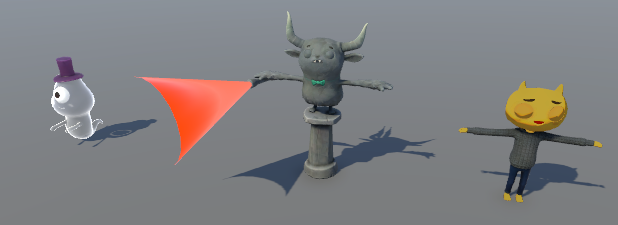

# Art Adventures: Character Catalog

For as long as I can remember, art has been a major problem for me. It started
with crippled neurological motor skill development. I was frequently reprimanded
as a very young child for “not staying within the lines” when coloring. I think
at the time everyone thought I wasn’t trying, when in reality, it was a physical
challenge for me. As my childhood progressed, I continued to face frequent
environmental disincentives. By the time I discovered my potential skills and
interests in game development, I found myself stuck with a lot of lost time I
badly needed if I wanted to pursue these interests fully.

Before I got fully invested in Unity DOTS, I was trying to play catch-up for the
lost time during childhood. At the time, I believed 3D may be different enough
from 2D that even someone with near-zero drawing capabilities could potentially
do it. I’m not sure if I still believe that, at least not for the style I’d want
in my creations. But I tried. This is where I got five years ago:

Since then, I focused fully on development. My hope was that by the time I got
all my tech up and running, either new tools would be developed that would be
far friendlier to me, or I’d meet the right people that either wanted to work
with me or someone would teach me some trick that would click with me and get me
back on the fast track.

That didn’t quite go as I had hoped.

Tools have shifted further from my technical strengths. A global pandemic shut
down a lot of opportunities to meet new people. The people I’ve made friends
with online are nearly all programmers (y’all are awesome!). And I’ve forgotten
many of the things I used to know to the extent I don’t think I could reproduce
that screenshot above without weeks of practice.

The Latios Framework is maturing. For both my own needs, and now with an
experienced enough community requesting more art-dependent features, I can’t
wait for life magic any longer.

It is time I start thinking up new ways to solve this problem.

This series is all about my adventures in acquiring the art needed to keep
framework development moving forward. I don’t have time to fight the uphill
battle of learning to create art the way real artists do, while also continuing
to develop the framework. Instead, I will explore alternate options that better
leverage the skills I do have; those being programming, and discovering tools
and resources on the internet.

## The Need for Characters

Kinemation is a big module, and a big reason people use the Latios Framework.
But up until now, there’s been only one sample buried inside of Free Parking.
That’s a problem.

At the beginning of the year, IK was the most-requested feature. But naïve IK
algorithms don’t understand the concept of pain. That’s a problem.

Character controllers might prefer to use capsules, but they only really work
when they maintain the illusion that the character is actually being controlled.
That’s a problem.

There are times game developers want to express nudity, and there are times they
definitely don’t. Cloth physics algorithms often deviate from those intents.
That’s a problem.

Hair emitting from an eyeball might make for a decent horror game aesthetic, but
for everything else… That’s a problem.

Voice talents don’t typically record facial mocap with their performances. And
not every character needs to possess the powers of telepathy. That’s a problem.

Conclusion: Characters are a problem, a very technical complex problem.

There’s another factor that needs to be considered. If I were to use the same
character for all these use cases, people would start to associate the framework
with that character, in a way making that character a mascot. That would be
really cool if the Latios Framework had a high-quality mascot character. But
that’s not a thing.

The other option is to use a different character for every use case and every
sample, and sometimes multiple. This has the benefit of avoiding any biases
people might draw from the quality of a mascot character. And it also increases
the chances that a character used in a sample is similar to a user’s character,
which makes the sample more helpful. If these characters are distributed, then
it gives users lots of different starting points.

Effectively, I want to build a character catalog that I can redistribute.

Which means I’m going to need a lot of characters.

## Legal and Ethical Challenges

In the game dev world, people will usually say something similar to the
following:

If you can’t make it yourself, just use someone else’s.

That means the first place to start is to simply look for characters to use on
the internet. And fortunately, there are tons of royalty-free characters out
there.

But…

Royalty-free only applies to use in games or animations. We specifically want to
redistribute the characters in project-form. A lot of royalty free assets
explicitly have clauses in their licenses to disallow this. Here’s a list of
some of those licenses:

-   Unity Asset Store EULA
-   Adobe General Terms of Use (Applies to Mixamo)
-   Sketchfab Standard License
-   CGTrader Royalty Free License
-   Free3D Royalty Free License
-   TurboSquid 3D Model License
-   BlenderKit Royalty Free
-   ArtStation Marketplace End User Agreement
-   Reallusion Character Creator Base Model License (with an exception to models
    you create in the tool)
-   RenderHub 3D Content Licensing Agreement – Extended Use License

I challenge you to use your search engine of choice and find a 3D character
model site that isn’t one of the above and doesn’t contain a bunch of models
ripped from popular games. The options have gotten quite limited, but it gets
worse.

If a model isn’t distributed under one of these licenses, there’s a good chance
it is uploaded with no license at all. Under many jurisdictions, making this
available for download at all is pointless, because copyright protections exist
by default. We also need to avoid those.

And if the model is licensed under a creator-given license, there’s a good
chance it is CC-BY 4.0, which while technically allowed for our use case, CC-BY
has an “attribution clause” in which the appropriate way to fulfill it is
extremely vague. A lot of artists pick this because they want “attribution”, but
you’d be surprised how different their opinions will be on what “attribution”
even means. Some want their legal name associated. Some would rather it be an
online username or alias. Some instead want a clickable link to a page featuring
all their other artwork, or perhaps the specific download link so that anyone
else can use the “official link”. And different artists will also have different
opinions on the “visibility” of the attribution. In a distributed project,
should the attribution be next to the source assets in the project directory?
Should it be next to all derivatives as well? Or maybe it should go in a single
combined text document? What happens if all the assets go through a packaging
transformation that could potentially be unpacked later? And what about binaries
that don’t have a dedicated credits scene? Unless an artist is explicit about
this (which is rare), I usually try to avoid CC BY 4.0 models.

So what is legally in the clear?

Perhaps surprisingly, AI.

At least in the US where I live, my understanding is that an AI trained on
images is completely tangential and inconsequential to copyright laws. The only
things that matter are how the trained images were acquired and fed into the
algorithm, and whether the output infringes on another copyrighted work in
likeness. For the latter, you simply have to ask yourself, “If a real artist
made this, would it be copyright infringement?” From a legal perspective, AI is
very appealing and promising…

…That’s not the full story.

In the part of the US where I live – a modest pocket of society surrounded by
farmland – the game development scene is very small, if it even really exists at
all. There’s not a single studio here I know of, nor any kind of meetup events
for hobbyists like myself. However, the same cannot be said about the art scene.
Artists thrive here. They are the artists you’d probably find selling art at
conventions. They mainly do fanart, crafts, and other physical and digital
works. And they feel very threatened by AI, and how it might completely destroy
their livelihoods. Their messaging has resonated strongly with the consumers of
their art here.

That message is in stark contrast to the programmers and the artists employed by
those programmers who have been telling me I should just use AI because it is
legal and solves my problem. But I already make enough enemies by accident, and
really don’t want to upset more people present in my daily life. I think for now
I will try to stay out of the controversy. However, I might explore some of the
AI tools in the series, solely for the purpose of evaluating the quality I can
achieve with them compared to other methods.

## Classification

Anyways, our options are extremely limited, but fortunately, not zero. Diversity
will be a challenge, so to better evaluate it, I will be grouping all character
models into one of four categories:

### Rigid

These are your stereotypical low-poly skeletal-animated characters, usually
humanoids. All the vertices deform to the bone animations, and there’s not
really anything else to add to them. They are great for basic animation and
blending samples, and maybe even some procedural motion and IK.

### Soft

These character models contain parts that benefit from secondary physics-based
motion. Loose cloth, long hair, organic fatty matter, hanging jewelry, you get
the idea. All these things generally require support from the code to function.

### Technical

These character models usually have some complex attachments or accessories that
have gameplay elements associated with them. They stand out for typically
requiring more complex IK setups and some procedural motion.

### Cinematic

These characters operate at a level of fidelity where you have to be extra
careful about staying out of the uncanny valley. Often times, the algorithms
that work for the other categories don’t quite cut it for these characters.

Ideally, we’ll end up with a variety of styles in each of these categories.
We’ll see where we end up in practice.

Anyways, enough background. Let’s find some characters!

## Unity Companion License

The Latios Framework is licensed as a derivative work of Unity’s packages under
the Unity Companion License. Naturally, this means any characters licensed under
this license are safe to use for our purposes.

### GitHub

Only about half of Unity’s sample projects use UCL. The other half are either
Unity Asset Store, unlicensed, or from what I gathered incorrectly-licensed
(these tend to be older projects). Fortunately, the
[EntityComponentSystemSamples](https://github.com/Unity-Technologies/EntityComponentSystemSamples)
repository falls into the UCL category. It contains two characters.

First, is this warrior:

The sword is a separate skinned mesh, even though it is only influenced by one
bone. However, it shares UV space with the rest of the character, so both
skinned meshes can use the same material. It uses root motion animation and an
exposed skeleton. While there are some issues with the sword in the hand that is
noticeable up-close, overall it is a very general-purpose character for testing.
The low poly blockiness of the hair and cloth puts this character into the Rigid
category.

Also in the samples project repo graphics project, there’s a Terraformer
character. Unfortunately, this one is missing textures. However, all is not
lost, as it turns out that the NetCode sample project has a correct setup,
including URP shaders set up for DOTS skinning (even though it is being used as
a `GameObject`). We can modify the shaders to support motion vectors.

Like the warrior, this character also uses an exposed skeleton. It comes with a
whole bunch of animations with root motion support. But unlike the warrior, this
character has a full LOD Group setup, which makes this character especially good
for stress-testing.

The only other URP ECS sample with an animated character is the [character
controller
samples](https://github.com/Unity-Technologies/CharacterControllerSamples/blob/master/_Documentation/Tutorial/tutorial-netcodecharacters-prediction-firstperson.md).
Fortunately, this simple character you may recognize is an easy add to the Rigid
category as another exposed skeleton.

If we expand our horizons beyond just ECS samples, we will find Unity’s [Boss
Room
sample](https://github.com/Unity-Technologies/com.unity.multiplayer.samples.coop).

Once again, we have exposed skeletons, or should I say skeleton? All the
characters exist in a single hierarchy. There’s very few skinned meshes. The
rest are all just rigid meshes parented to bones. That means there’s a lot of
opportunity for secondary motions, so some of these characters will be our first
soft characters. Although without arms, secondary motion might be a little
noisy.

Unity also has the [Bite-Size NetCode samples (for Game
Objects)](https://github.com/Unity-Technologies/com.unity.multiplayer.samples.bitesize).
In there, we can find the Chop Chop pig chef, but with modern shader graph toon
shaders compatible with forward+ rendering.

This character uses an exposed skeleton, just like all the others. It seems
Unity doesn’t typically optimize their animated characters. But more
interestingly, each eye and mouth expression is its own Mesh Renderer for this
character. The ears and clothing have the potential for some softness. All of
the interesting loose parts have unique bones, so this character could be a good
candidate for simulated bone animations.

### Unity Asset Store

Not all assets on the Unity Asset Store are governed by the EULA. Some of them
specifically call out in big bold print that they use the Unity Companion
License instead. The easiest two to get into a working project are the [Starter
Assets Character
Controllers](https://assetstore.unity.com/packages/essentials/starter-assets-character-controllers-urp-267961)
and [Robot
Kyle](https://assetstore.unity.com/packages/3d/characters/robots/robot-kyle-urp-4696).

These two have nearly identical proportions and leverage the same animations.
But strangely, they use completely different bone names. Like most
already-created prefabs, these two come with exposed skeletons and fall into the
rigid category.

Next, there is the Adventure Sample which is also UCL. However, it uses BiRP
with a custom shader for all its characters, so the stuff in there isn’t
compatible with ECS. Instead we’ll move on to [John
Lemon](https://assetstore.unity.com/packages/essentials/tutorial-projects/unity-learn-3d-beginner-john-lemon-tutorial-resources-143848).

John Lemon and the ghost follow the same patterns as many of the previous
characters, using exposed skeletons. However, the gargoyle statue is actually
using an optimized skeleton. And while it could potentially be the target of
secondary animation, it is a bit niche of a character. Also, a lot of secondary
animation is already baked into the animation itself. All three of these
characters fall into the rigid category.

While there are more Unity Companion License projects on the Unity Asset Store,
the others seemed to have been set up for built-in instead of URP using custom
shaders. Maybe I’ll look into exploring those again later. But it is time we
move on to other sources for characters.

## Creative Commons Zero (CC0)

I mentioned earlier that a lot of assets are licensed CC-BY, which has an
attribution clause. But there is a CC license that has no restrictions
whatsoever. It is a true public domain do-whatever-you-want license. That
license is CC0. For CC0 assets, you can attribute the author out of curtesy, but
there is no legal requirement, which means you don’t have to worry about messing
it up. Explicitly seeking the CC0 license will help focus our search.

### Kenney

If you are a game dev that has never heard of [Kenney
Assets](https://kenney.nl/), it is time you hear about it! This is a massive
library of CC0 assets particularly targeting indie devs. Some often refer to
Kenney as “Asset Jesus” because of how much is available and how practical it
is. With that said, 3D animated characters are quite sparse compared to the
other types of assets. Most of the characters are quite blocky. But there are
also 3 packs which all use the same model and animations, but different
textures. I’ve imported them as optimized humanoid skeletons.

All the outfits, hair, and everything else is done completely by textures.
There’s no real potential for soft things, so these 12 will all go into the
rigid category.

### Quaternius

Kenney isn’t the only creator in the CC0 scene. Another creator is
[Quaternius](https://quaternius.com/index.html), who is much more 3D-oriented.
And well, “creator” might be the wrong word here. Because for the purposes of
this adventure, “hero” might be more appropriate. There’s a lot to unpack, and I
probably won’t explore everything.

We’ll start with the Modular Men and Modular Women packs. These packs come with
multiple versions that we can choose to use. I used the version that packs
everything together in a single FBX that is imported as a generic skeleton.
There’s also a Blender version that uses a humanoid rig, but doesn’t come with
animations. There’s probably a way to retarget the generic animations onto the
humanoid rig, but I’m not going to concern myself with that now. The real focus
of these packs are the “modular” aspects. The head, body, legs, and feet are all
separate meshes that you can mix and match. Here’s a few mash-ups I quickly
threw together:

An interesting aspect of Quaternius assets is that they rarely use textures,
instead opting for unique materials per each color. Kinemation supports submesh
sharing for skinned meshes, so this doesn’t cost much, and makes it easy to
tweak individual colors further.

The modular men don’t really have any soft parts, so they fall into the rigid
category. The modular women have a few modular pieces that might have potential,
so they fall into the soft category.

Next, there’s the Animal pack.

There’s nothing particularly special about these animals. They are too low poly
for any soft physics potential, so they are added to the rigid category.

A relatively new addition is the Universal Animation Library. This pack comes in
3 versions: Standard (Free), Pro, and Source. All are CC0, but we’ll stick to
the free version for the character catalog.

This one is interesting, because it comes with a dedicated FBX export for Unity.
Inside Unity, I had to check the “Bake Axis Conversion” checkbox to make it work
correctly. Also, this character is fully humanoid compatible with all the
animations, so it will be possible to retarget these animations. Nice!
Apparently this asset was a collaborative project, which is why it uses a
different rig.

The root motion import settings may need to be cleaned up though before they can
be used. For now, I will leave them as is.

Moving on, there’s the Animated Mech Pack.

Yes, these have textures, which is atypical from Quaternius. In fact, each mech
has 5 different color variations. The mechs also have names. They use the
traditional Quaternius skeleton though, so they aren’t humanoid-compatible
out-of-the-box.

So far, we’ve covered character packs, but Quaternius also does themed packs
that include characters and environment. One such involves this explorer in the
Ultimate Modular Ruins Pack.

We are back to standard Quaternius style of single color materials and generic
skeletons. The hair has sufficient polygon density that this character falls
into the soft category.

## To Be Continued…

Unfortunately, this character catalog is a low-priority project. That means
progress is slow and often interrupted. This article will be amended with
further progress.

Everything covered so far can be found in the Latios Framework Mini Demos repo
in the Features Samples project. Within there, look for the Redistributable
Assets folder. PRs are welcome if you’d like to help add to the collection!
