# Calligraphics Animation

*Written by Sovogal – Edited by DreamingImLatios*

World space text is super cool, but maybe we can do better. Let's take damage
numbers, as an example.

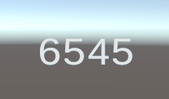

I hope you're thirsty, because it's time for some juice.

## Step 1 - Scene Setup

Let's make a quick empty scene with a subscene, and inside that subscene, create
a new empty GameObject.

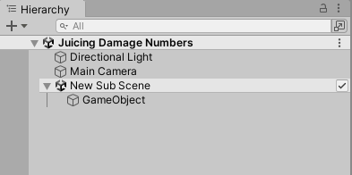

The *Text Animation* component is your first step to understanding the
Calligraphics built-in animation system. It requires the *Text Renderer*
component too, so let’s add both of those now.

Set the text and the font.

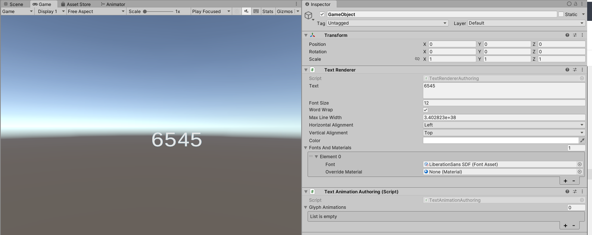

The *Text Animation* component hosts a list of animation transitions.

Each transition has the following properties:

-   **Glyph Property** - The property of the glyph to transition. These are
    currently: Opacity, Scale, Color, PositionNoise, RotationNoise, and
    Position.
-   **Animation Style** - Progressive or Simultaneous. This setting exposes
    appropriate properties to render the animation as progressive (iterating
    through each glyph, word, or line in order) or simultaneous (affecting all
    glyphs, words, or lines at once).
-   **Interpolation** - The type of tweening interpolation to use for the
    transition.
-   **Unit Scope** - Whether to scope the animation to Glyph, Word, or Line
-   **Start Index** - The start index of the animation
-   **End Index** - The end index of the animation. This is inclusive, so the
    element at the end index will receive animation as well.
-   **End Behavior** - The behavior at the end of the transition (Revert, Keep
    Final, Loop)
-   **Loop Count** - The number of times to loop the animation if the **End
    Behavior** is set to Loop
-   **Loop Delay** - The delay time between loops if the
-   **End Behavior** is set to Loop
-   **Transition Time Offset** - The delay before the transition begins
-   **Transition Duration** - The duration of the transition, once it begins
-   **Progressive Time Offset** - The time offset between each progressive
    animation, if the transition is using a Progressive **Animation Style**

## Step 2 - Add a transition

Let's add a really basic transition that will make the text fade in.

| Transition Settings              | Result                             |
|----------------------------------|------------------------------------|
| 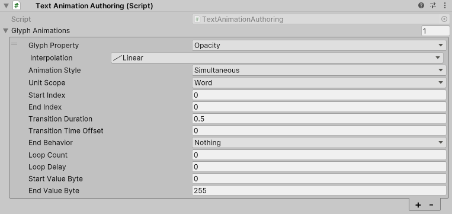 | 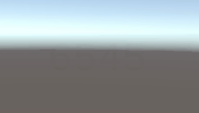 |

Not bad. But nothing special. We can do this with material properties. Let's see
something we can't do with material properties alone.

## Step 3 - Juice it up

Let's add a progressive animation to make the number pop. Maybe scale.
Progressive animations are really just an authoring trick that bakes a bunch of
animations individually with time steps in between.

| Transition Settings            | Result                           |
|--------------------------------|----------------------------------|
| 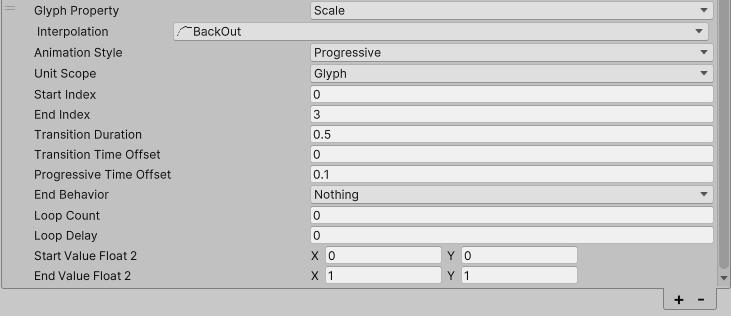 | 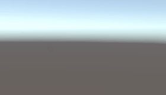 |

Clean, but maybe we want something crunchier. Let's add some positional noise to
the entire word.

| Transition Settings                    | Result                                   |
|----------------------------------------|------------------------------------------|
| 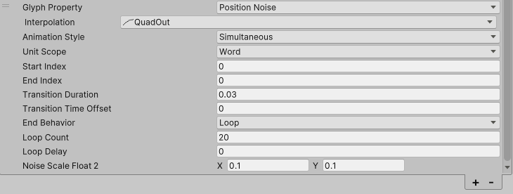 | 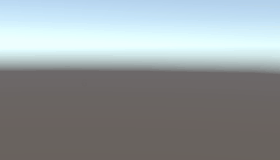 |

There we go! Now, let's create a delayed animation to fade the whole thing out.

| Transition Settings              | Result                             |
|----------------------------------|------------------------------------|
| 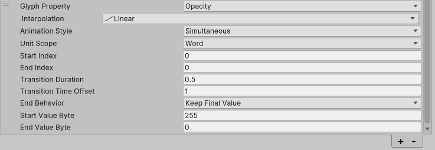 | 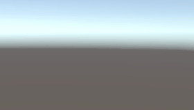 |

Looking good, killer. Maybe a little over- or under-worked, but that's up to
your own design preferences.
