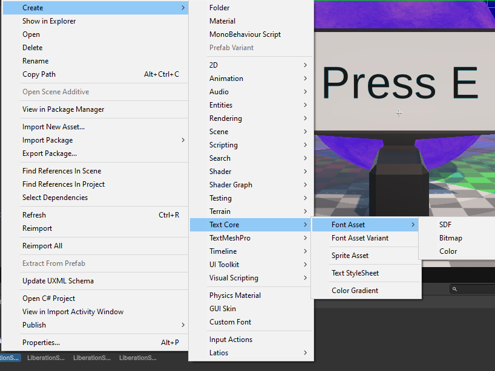
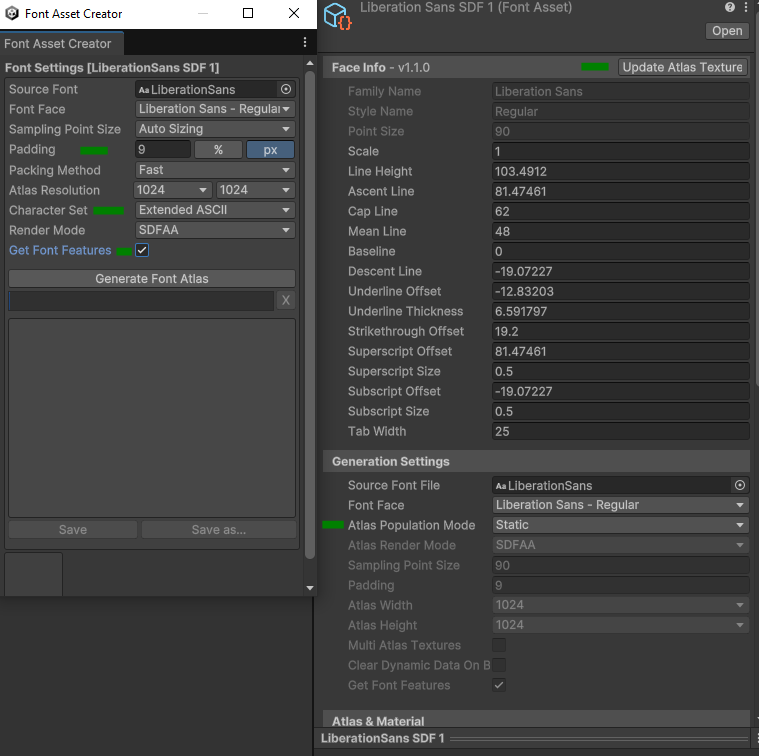

# Getting Started with Calligraphics

*Originally written by Sovogal – Edited by DreamingImLatios*

From damage numbers to simply labeling world space objects, text rendering is
one of those engine features that we don't spend a lot of time thinking about,
but we feel its absence like a missing limb. Like a lot of developers braving
the wilderness of Unity ECS, you were probably surprised to find zero TextMesh
support. That's why I wrote Calligraphics.

## Main Camera

Make sure your main camera is not using FXAA anti-aliasing. FXAA does a poor job
at preserving text crispness, but unfortunately is the default anti-aliasing
method in URP.

## Authoring

Calligraphics provides a single component for authoring text. You can find it in
*Latios* -\> *Calligraphics* -\> *Text Renderer* in the *Add Component Menu*.
For animating the text, an additional component can be found in *Latios* -\>
*Calligraphics* -\> *Text Animation*.

### Text Renderer

The *Text Renderer* component exposes all of the settings required to render
Rich Text to world space.

-   **Text** – The Rich Text to render.
-   **Font Size** – The size to use for the text
-   **Word Wrap** – Whether to wrap the text should it exceed **Max Line
    Width**.
-   **Max Line Width** – The maximum line width for a single line of text. If
    **Word Wrap** is false, this setting does nothing.
-   **Horizontal Alignment** and **Vertical Alignment** – These two settings
    provide a pivot point for the text rendering. They not only affect text
    alignment, but also in which directions to expand the text relative to the
    authoring transform.
-   **Is Orthographic** – Controls how the text reacts to scaling
-   **Enable Kerning** – Enable kerning pair adjustments
-   **Font Style** – Base styling options to apply to the text
-   **Word Spacing, Line Spacing, and Paragraph Spacing** – Additional spacing
    values in font units where a value of 1 equals 1/00em
-   **Color** – The base color of the text when no Color tag is in scope.
-   **Fonts and Materials** – The font-material pairs used by the renderer. All
    fonts/materials called out by font rich text tags will need to be specified
    here. There should always be at least one entry for the base font.
    Calligraphics includes a Liberations-Sans Font set up for URP to get started
    quickly.
-   **Gpu Resident** – When checked, the text uses GPU-resident mode in which
    text changes are always uploaded and stored on the GPU regardless of
    visibility. However, visible text is not reuploaded each frame when no
    changes occur.

*Warning: GPU Resident Text can be prone to fragmentation, so be wary of
modification patterns.*

### Fonts and Materials

Calligraphics fonts are generated using Unity’s TextCore and use SDF rendering.
To create a new font, make sure an imported font file is selected in the project
folder. Then right-click on it, and select Create Text Core Font Asset SDF.

Next, set the atlas type to *Static*, then press the *Update Atlas Texture*
button to open the Font Asset Creator window. All parameters in this window will
affect Calligraphics in the same way as traditional TextMeshPro or UI Toolkit.
However, it is worth calling out some common settings.

First, some level of padding is required for bold or text outlines, as otherwise
the rendered quads won’t be large enough. Second, because this is a static
atlas, you must specify which characters will be baked into the font atlas.
Lastly, be sure to select *Get Font Features* for kerning support.

Once you are happy with your selection, press *Generate Font Atlas* and then
*Save*.

In a font-material pair, if you leave the material empty, Calligraphics will use
the material from the font. The material must use a Calligraphics-compatible
shader in order to read the Calligraphics glyph buffer. Two shaders, one for URP
and one for HDRP are provided out-of-the-box by Calligraphics. These shaders are
created with Shader Graph, so you can copy them and modify them for custom
effects.

### Text Animation

This one is a bit of a work in progress. You can specify animation transitions
scoped to specific portions of text. Are there other ways to accomplish this
through shaders? Yep! However, this allows you to animate a single glyph, word,
or line in very basic ways to give a little life to some world space text.

Each transition has the following properties:

-   **Glyph Property** - The property of the glyph to transition. These are
    currently: Opacity, Scale, Color, PositionNoise, RotationNoise, and
    Position.
-   **Animation Style** - Progressive or Simultaneous. This setting exposes
    appropriate properties to render the animation as progressive (iterating
    through each glyph, word, or line in order) or simultaneous (affecting all
    glyphs, words, or lines at once).
-   **Interpolation** - The type of tweening interpolation to use for the
    transition.
-   **Unit Scope** - Whether to scope the animation to Glyph, Word, or Line
-   **Start Index** - The start index of the animation
-   **End Index** - The end index of the animation. This is inclusive, so the
    element at the end index will receive animation as well.
-   **End Behavior** - The behavior at the end of the transition (Revert, Keep
    Final, Loop)
-   **Loop Count** - The number of times to loop the animation if the **End
    Behavior** is set to Loop
-   **Loop Delay** - The delay time between loops if the **End Behavior** is set
    to Loop
-   **Transition Time Offset** - The delay before the transition begins
-   **Transition Duration** - The duration of the transition, once it begins
-   **Progressive Time Offset** - The time offset between each progressive
    animation, if the transition is using a Progressive **Animation Style**

## API

Calligraphics exposes its primary API through a `TextRendererAspect`. The
back-end uses a dynamic buffer of `CalliBytes`, where each element is just a
single byte, to represent a string, but `TextRendererAspect` exposes this buffer
as a `CalliString` to allow you to interact with it similar to the `NativeText`
type.

## Under The Hood

Calligraphics bakes fonts and materials as pairs to a blob asset that contains
Unity TextCore metadata about each font and font-supported glyph (size, vertex
positioning, UVs for the font atlas, glyph-to-glyph positioning specifics, and
so on). At runtime, `GenerateGlyphsSystem` then parses the
`DynamicBuffer<CalliBytes>` and generates the `DynamicBuffer<RenderGlyphs>`. It
also generates the `DynamicBuffer<GlyphMappingElement>` which is used by the
`AnimateTextTransitionSystem`. This system post-processes the glyphs. Finally,
the glyphs are fed raw into a compute shader by the Kinemation rendering
systems.
