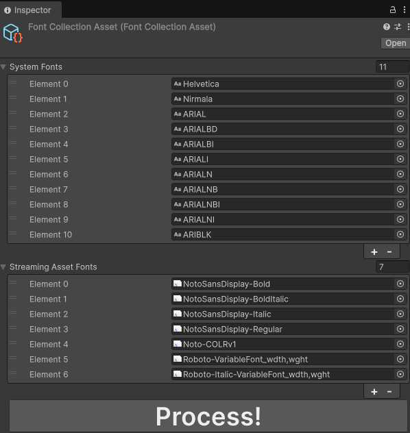

# Getting Started with Calligraphics

Calligraphics has evolved to be fully independent of Unity’s text rendering
features. And while some aspects of its implementation have been inspired by
TextMesh Pro, its workflow has evolved to something a bit more original. This
guide will walk through everything from setting up text, modifying it at
runtime, and even how to use some of its advanced features.

## Main Camera

Make sure your main camera is not using FXAA anti-aliasing. FXAA does a poor job
at preserving text crispness. Other anti-aliasing solutions tend to work better,
but your milage may vary.

## Fonts and Font Collections

Calligraphics loads fonts directly from font files. Supported font types are
OpenType (.otf), TrueType (.ttf), and TrueType Collection (.ttc).

In order to load fonts, Calligraphics needs to know where to find them. This is
typically done through a **Font Collection Asset**. You can create one in
*Assets* -\> *Create* -\> *Latios* -\> *Calligraphics* -\> *Font Collection
Asset*. This asset is an editor-only asset and will not be included in the
build, so you can put it anywhere in your project, including an *Editor* folder.

Font Collection Asset supports loading system fonts and Streaming Asset fonts.
For system fonts, you must copy the system font from the target device into the
Unity project. The font can be stored in an *Editor* folder. Streaming Asset
fonts must be in a *StreamingAssets* folder.

Drag the fonts into the Font Collection Asset inspector, then press the
**Process!** button.

After you press the button, *Font Load Descriptions* and *Font Families* will be
populated. If you need to make changes to the list of fonts, you will need to
press *Process!* again.

A Font Asset Collection is typically baked into a `FontLoadDescriptionsBlob`,
typically stored in a `FontLoadDescriptionsBlobReference` component. At runtime,
Calligraphics iterates through all component instances and loads all fonts. Once
a font is loaded, it is never unloaded until the `LatiosWorld` is disposed. If
you want to load fonts at runtime, use
`FontLoadDescription.GetDescriptionsFromPath()` and pass in the filepath of each
font you want to load. Then use the results to construct a
`FontLoadDescriptionsBlob`.

## Shaders and Materials

Calligraphics provides several Shader Graph shaders which can be installed from
the Latios Framework package samples in the *Package Manager* window. Each
shader supports both HDRP and URP.

While most of the shader properties are generally self-explanatory, there are a
few that require a little extra explanation. Note that these values do not
affect emoji.

### Dilate

Dilation is a value typically in the range of [-1, 1] where a value of 0 draws
the edges where the font edges occur, a positive value inflates the edges
outward, and a negative value pulls the edges inward. Calligraphics defines the
maximum inflation or deflation as 1/8th the font size. For fonts that do not
include a bold-face, the dilation value is typically averaged with +3/16 to
emulate boldness. Otherwise, the dilation value is divided by two. It is
actually the result of this averaging or division which must be in the range
(-1, 1), meaning that for non-bold text, dilation values of (-2, 2) are
acceptable.

### Softness

Softness is a value that comes from TextMesh Pro and is typically in the range
of [0, 3]. It controls how softly the edges of the text fade to transparent.
Small nonzero values can sometimes help text appear less aliased, while larger
values create a soft blur effect.

### GradientScale

This value is no longer used and should be ignored.

## Authoring Text

Calligraphics provides a single component for authoring text. You can find it in
*Latios* -\> *Calligraphics* -\> *Text Renderer* in the *Add Component Menu*.

The *Text Renderer* component exposes all of the settings required to render
Rich Text to world space.

-   **Text** – The Rich Text to render.
-   **Font Collection Asset** – The Font Collection Asset used to populate the
    Default Font dropdown (and will also be baked)
-   **Default Font** – The font family that should be used to render the text
    when rich text tags do not override the font
-   **Font Styles** – Base styling options to apply to the text. The buttons are
    ordered as follows:
    -   Normal (selecting this clears all other options)
    -   Bold
    -   Italics
    -   Lower Case
    -   Upper Case
    -   Small Caps
    -   Superscript
    -   Subscript
    -   Fraction
-   **Font Size** – The size to use for the text
-   **Color** – The base color of the text
-   **Max Line Width** – The maximum line width for a single line of text. If
    **Word Wrap** is false, this setting does nothing.
-   **Word Spacing, Line Spacing, and Paragraph Spacing** – Additional spacing
    values in font units where a value of 1 equals 1/00em
-   **Word Wrap** – Whether to wrap the text should it exceed **Max Line Width**
-   **Is Orthographic** – Controls how the text reacts to scaling
-   **Language** – The IETF BCP 47 language string used to help HarfBuzz format
    text to a particular locale
-   **Horizontal Alignment** and **Vertical Alignment** – These two settings
    provide a pivot point for the text rendering. They not only affect text
    alignment, but also in which directions to expand the text relative to the
    authoring transform.
-   **Font Texture Size** – How big text should be rasterized into the SDF and
    bitmap textures
    -   **Normal** – A value suitable for most text
    -   **Big** – Use for large text and titles
    -   **Massive** – Use only if Big is not big enough, extremely expensive and
        can easily exhaust GPU memory if more than \~10 unique characters are
        drawn with this across all renderers within a frame
-   **Material** – The material used to render the text

## Working with Text in Code

Many of the authoring options for text can be found in the
`TextBaseConfiguration` component at runtime. All properties can generally be
freely modified at any time.

The text string itself is stored in a `DynamicBuffer<CalliByte>()`. Pass this
value into the constructor of a `CalliString` in order to work with it using the
Collections package string APIs.

Calligraphics evaluates text during `UpdatePresentationSystemGroup`. At this
time, it will populate the `RenderGlyph` buffer describing the quad mesh data to
be sent to the GPU. It will also update `MaterialMeshInfo` and `RenderBounds` to
reflect the length and size of the text.

The `RenderGlyph` buffer can be animated by adding the
`DynamicBuffer<AnimatedRenderGlyph>` to the entity, and then populating it with
animated `RenderGlyph` instances using the `RenderGlyph` buffer as reference.
This can be done by injecting systems into `CalligraphicsAnimationSuperSystem`,
which runs after populating `RenderGlyph` buffer, but before updating the other
rendering components.

A RenderGlyph is composed of several values. Of interest for animation are the
Position, UVB, and Color values. Each of these are prefixed with a two letter
code representing the quad corner they correspond to:

-   bl – bottom left
-   br – bottom right
-   tl – top left
-   tr – top right

Note that these corners are for the full quad, which includes padding for
outline effects and shader bold emulation. For position information, the
z-ordinate is always assumed to be `0f`.

## Other Features

There are a few other features of Calligraphics.

In the *Add Component* menu, you can add a *Latios* -\> *Calligraphics* -\>
*Font Collection* authoring component. This let’s you bake a
`FontLoadDescriptionBlob` without a *Text Renderer*.

You can create a *Font Utility* asset, which allows you to inspect various font
properties from a font file. This is a `ScriptableObject` used as a tool, and
not something you should include in builds.

`TextRendererUtility` offers various runtime APIs for creating IETF BCP 47
language strings packed as blob assets, and setting up a
`TextBaseConfiguration`.

*Resources* includes a *LatiosTextBackendMesh* which contains the mesh used for
rendering all text in Calligraphics. The `MaterialMeshInfo` should be configured
to use a single mesh and material (no range). Note that the mesh has multiple
submeshes, but the submesh index is modified at runtime in order to select the
number of quads that should be drawn. If you choose to configure a text
rendering entity from scratch at runtime, initially set the submesh index to 0.

`DynamicBuffer<TextColorGradient>` optionally lives on the
`worldBlackboardEntity`, and allows defining named gradients that can be called
out via rich text tag. The *Text Color Gradient* authoring component provides an
authoring experience for it.
