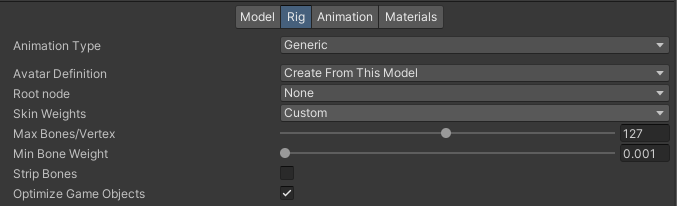
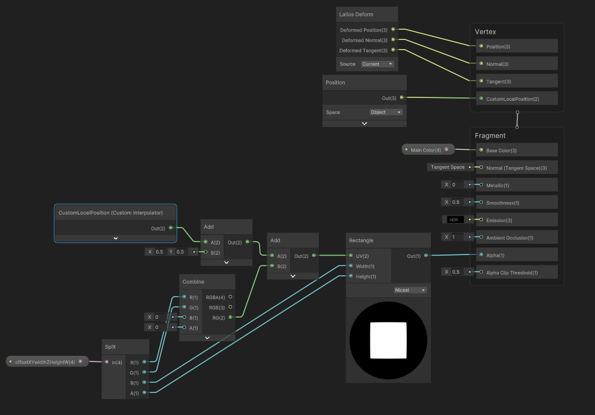
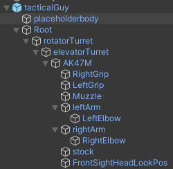
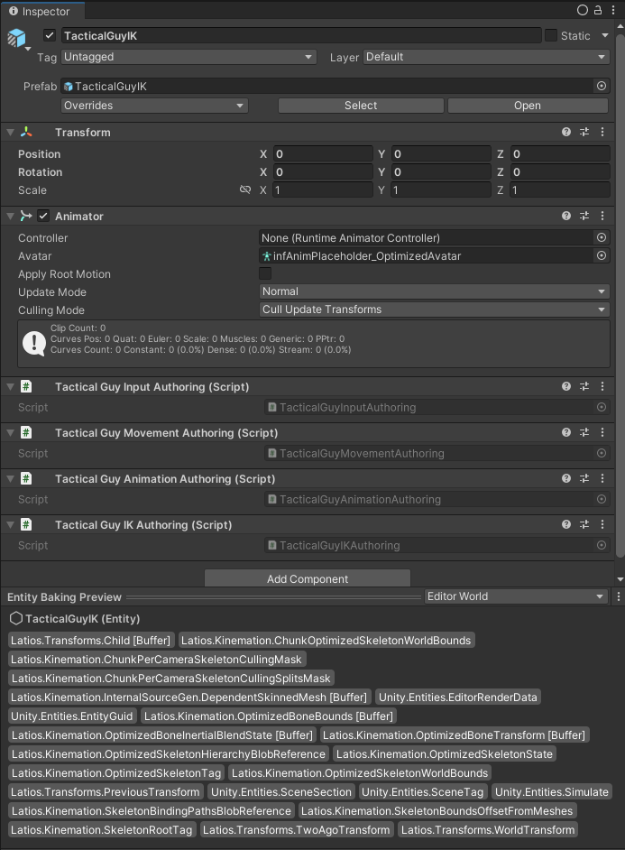
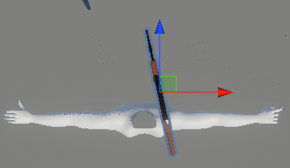
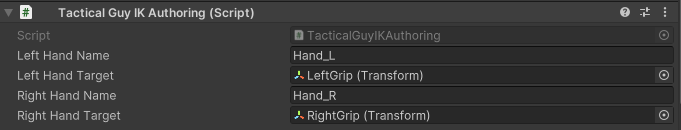
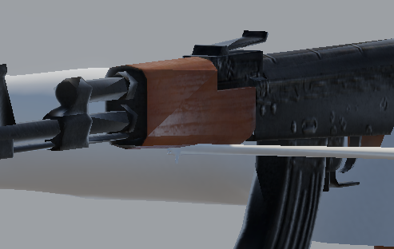
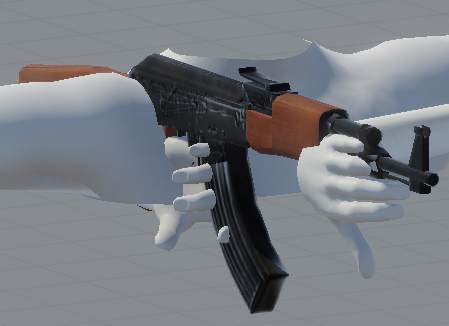
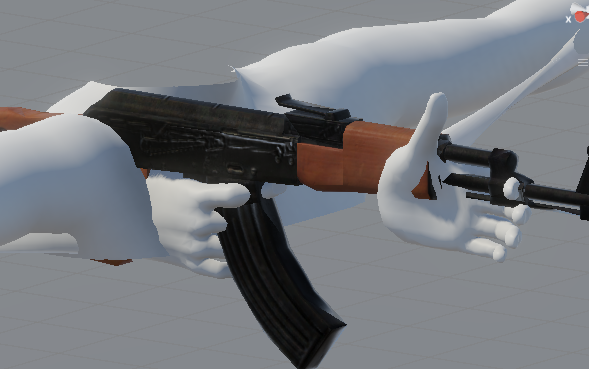

# Character Adventures 2024-2-24 : Beginning Tactical Arms

There’s a special magic to taking static triangles and textures, and moving them
in a way such that they act as if powered by a brain of a living thing. Humans
lack the ability to directly read the thoughts and emotions of others. And for
everyone else, the society considers such actions an invasion of privacy without
consent. Therefore, we’ve all work around this by learning to approximate
thoughts and emotions purely through the motion of living things.

It is via this universal skill that game developers are able to communicate to
players and provide a richer experience. Yet, what developers wish to
communicate may be dynamic to the player’s actions. Traditional animation is not
enough, and sometimes, developers need to generate this motion through code.

The sensitivity to subtlety that players have is very high, and so orchestrating
code to generate the correct nuances can present interesting challenges.
Fortunately, players can be forgiving of shortfalls, but it is still something
they notice and make judgements about.

It can be quite a challenge to make a character move and act interactively in an
environment while portraying emotion, thoughts, and personality. But if done
right, it is effectively the equivalent of creating life! This series is all
about figuring out various ways to do just that, from a programmer’s
perspective.

## Tactical Guy

Throughout this series, many of the characters we’ll be working with will come
from submissions from the community. This first one is no exception. BattleByte
has provided a character named “tacticalGuy”, along with a gun model and some
reference aiming code. I’m currently going off the assumption this is for a
first-person shooter, but I could be wrong about that. Nothing has really been
set up yet in Free Parking, so we’ll have to see how far we can take things
ourselves.

For our first step, we’ll need to clean up the import settings to make this
character ready for Kinemation. BattleByte plans to use Unity Transforms, so
let’s use optimized skeletons for this. We don’t know how many bone influences
per vertex there will be either, so we’ll play it safe and set it to something
high. We won’t expose any transforms right now. But we may need to expose some
later.



This tacticalGuy comes with nothing but the gun and some boots, which is
certainly a peculiar way to go about life. But practically, I believe the intent
is that only the arms are meant to be visible. Since we have to set up the
deformation shader anyways, let’s set up a body mask so that we can focus on
what is meant to be visible. In a real project, you’d want to modify the mesh
instead to reduce vertex count and improve performance. But this will be
sufficient for testing.




Unfortunately, the character didn’t come with textures, so we are stuck with the
fake marble sculpture look for now.

## Tactical Prefab

You’ll notice that the character’s arms are in t-pose, but the fingers posed.
This means we won’t have a reference forward pose to work from, but there seems
to be some intent as to how these hands are to fit. BattleByte provided a
reference prefab that contains the gun, and indeed there do seem to be some
transforms marked out we may be able to use as landmarks.



Let’s copy this hierarchy over to our optimized version. And then we can set up
all the prefab variants in our CharactersOnly dev dungeon workflow.



## Analyzing the Rig

The reference code included contains runtime components and some static methods,
but no authoring components or systems. As such, the reference prefab contains
no custom components, so we have to figure things out by names alone.

Analyzing the code, none of the code modifies any transform’s position. Only
rotations are ever modified. That means that whatever base offsets exist are
what we have to work with.

As for the weights of the character, there’s no twist bones. The forearm bone
doesn’t have influence over the elbow, so it can follow the hand to a small
degree. But the hand also cannot twist too much because it has low influence
over the forearm.

Now if you imagine that the right hand is holding a cup, that cup would be
pouring water while the character is t-posed. We need that cup to hold water,
without rotating the hand relative to the forearm.

Hold your right arm out with your palm facing down and your fingers curled, just
like the t-pose. Now without twisting your wrist, relax your arm down to your
side. Your elbow should be pointing behind you, and your palm should be facing
your left. Now flex your elbow to make a 90-degree bend. Your hand is now
holding the cup upright. Flex your elbow even further and bend your write to
keep that cup upright. Notice, you aren’t twisting/rolling your wrist, just
bending it. This is fine, as the skin of your forearm barely moves when you do
this. Now rotate your upper arm such that your hand gets close to your neck,
without raising your elbow. Now, if you were to try and raise your elbow as if
you were doing the chicken dance without twisting your wrist, you’d end up
pouring your drink down your shirt.

What this experiment tells us is that we’ll need the right elbow down and tucked
close to the body for the deformations to look good. We could do a similar
experiment to determine that it is impossible for the left hand to hold up the
gun underhanded, and instead must use the base of the palm as support while the
knuckles face the left. Again, the elbow must be down and tucked for this to
work.

There are four bones in each arm that we must manipulate to pose the character
to hold the gun. The hands must be posed relative to the gun and must move
directly with it. The forearms and upper arms will rotate about within the
limits. And then there’s the shoulders. Shoulders tend to move forward and
backward based on how far forward or backwards the elbow is. Vertical movement
in the shoulders is a trickier to generalize, but for our situation we’ll likely
be able to apply similar logic in the vertical direction.

Thus, our strategy will be to place the hands, then use a two-bone IK to find a
rough elbow position, adjust the shoulders accordingly, and then resolve the
two-bone IK with the updated shoulders. We might add an additional iteration of
updating the shoulders plus two-bone IK to stabilize things.

## Placing the Hands

The first thing we need to do is place the hand bones appropriately. Since this
is an optimized skeleton, we’ll need to find the hand bone indices. Doing this
at bake time requires some dangerous games with incremental baking, so for now
we’ll do it at runtime. We can figure out how to optimize it later.

The way we identify optimized bones at runtime is via the
`SkeletonBindingPathsBlobReference`. That means we’ll need to store a string to
look up. We’ll also need a reference to the transform on the gun where the hand
should go. Thus, we get this:

```csharp
[InternalBufferCapacity(2)]
struct TacticalGuyArmIKStats : IBufferElementData
{
    public FixedString32Bytes         handBoneName;
    public EntityWith<WorldTransform> handTarget;
}
```

And this is what our job looks like:

```csharp
[BurstCompile]
partial struct Job : IJobEntity
{
    [ReadOnly] public ComponentLookup<WorldTransform> transformLookup;

    public void Execute(OptimizedSkeletonAspect skeleton, in DynamicBuffer<TacticalGuyArmIKStats> armStatsBuffer, in SkeletonBindingPathsBlobReference boneNames)
    {
        foreach (var armStats in armStatsBuffer)
        {
            if (!boneNames.blob.Value.TryGetFirstPathIndexThatStartsWith(armStats.handBoneName, out var handIndex))
                continue;

            var handTargetTransform = qvvs.inversemulqvvs(skeleton.skeletonWorldTransform, transformLookup[armStats.handTarget].worldTransform);

            var handBone           = skeleton.bones[handIndex];
            handBone.rootTransform = handTargetTransform;
        }
    }
}
```

You might notice that we transform the hand target into root space. While we
could use the `worldTransform` property of `handBone`, it will be more efficient
to perform our IK solve in root space, so we might as well convert it now.

Our authoring component is configured like this:



And with our system wired in, it is time to test it out!



Umm, not quite what we wanted.

Turns out, the gun’s transforms have scale, and that is scaling our hands way
down. So we should ensure we preserve the scale of our hands when we place them.

```csharp
var handTargetTransform     = qvvs.inversemulqvvs(skeleton.skeletonWorldTransform, transformLookup[armStats.handTarget].worldTransform);
var handBone                = skeleton.bones[handIndex];
handTargetTransform.scale   = handBone.rootScale;
handTargetTransform.stretch = handBone.stretch;

handBone.rootTransform = handTargetTransform;
```



The hands are upside down. For now, I’ll just flip the rotations of the target
points since they had identity rotation anyways.



Alright. At this point it is clear that the gun transforms are not set up
correctly to work with the character skeleton. I’ve already made a ton of
assumptions up to this point that I now suspect may be wrong. That’s a good time
for me to set this aside and allow an artist to fix things up.
