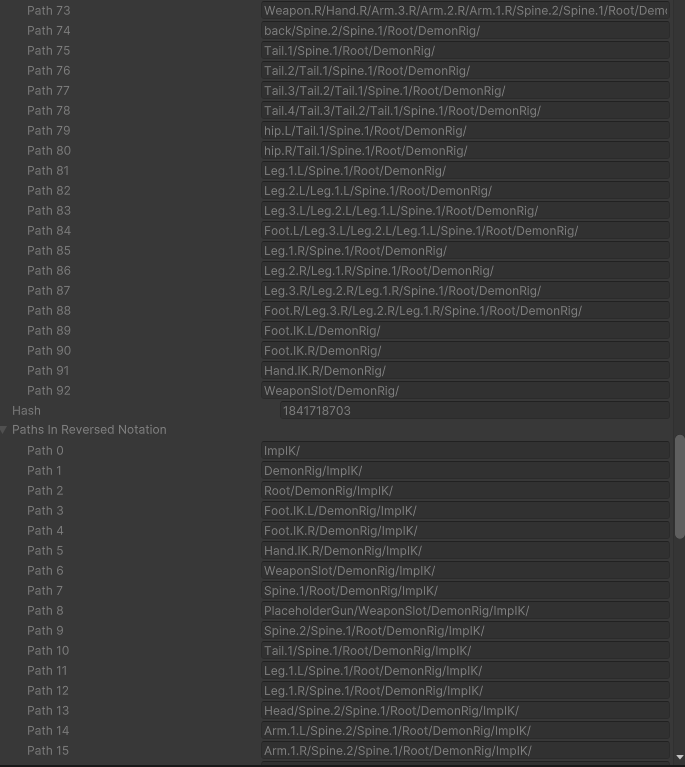

# Binding Skinned Meshes to Skeletons at Runtime

Skinned meshes bind to skeletons at runtime, even if baked in a subscene. This
document describes the process in detail. From this, you’ll be able to leverage
the process with your own tools and workflows, as well as better diagnose issues
if things go wrong.

## Bindings are Strings

Kinemation’s runtime binding system works a little differently from how skinned
mesh renderers function as Game Objects.

Let’s suppose you have a modular character system, where you have a skeleton
hierarchy made of Game Objects that are animated via an Animator. However, the
skinned mesh that should be driven by this skeleton must be loaded dynamically
via Addressables. Simply parenting the instantiated skinned mesh to the root
Game Object isn’t enough to get the skinned mesh to deform.

What many people do in this situation, is they will export the skeleton with its
animations with a plane skinned to it, with the plane disabled. Then once they
load the real skinned mesh, they copy the plane’s `bones` array onto the real
`SkinnedMeshRenderer`. The plane solely exists to ensure the `bones` array is
there to copy from.

In Kinemation, the plane is completely unnecessary. That’s because Kinemation
skinned meshes don’t refer to individual bones. Rather, they refer to the bone
names of the skeleton.

When a skeleton is baked, it is often baked with a
`SkeletonBindingPathsBlobReference`. Similarly, a skinned mesh is often baked
with a `MeshBindingPathsBlobReference`. These blob assets contain strings
(actually, `BlobArray<byte>`) that define unique bone “paths” stored in “reverse
order”. That is, the string will start with the name of the bone itself, then a
forward slash, and then the name of the bone’s parent, then another forward
slash, and then the parent’s parent, and so on. You can see them side-by-side in
the `SkeletonDependent` component of the skinned mesh. The top is the
`MeshBindingPathsBlob`, while the bottom is the `SkeletonBindingPathsBlob`. The
`SkeletonDependent` component is an internal component that exists upon a
successful runtime binding.

You’ll notice a few things from `SkeletonDependent` inspector.

First, the bones in the skinned mesh have different indices compared to the
skeleton. For example, *Leg.1.L* is at index 81 in the skinned mesh, but index
11 in the skeleton.

Second, there almost always are bones in the skeleton than the skinned mesh (not
visible in the image above).

Third, the skinned mesh paths omit the root bone, which in the image above would
be *ImpIK*. The skeleton does not omit this. There are a couple of reasons for
this. One is that the root bone comes from the Game Object with the Animator
attached. This Game Object is prone to renaming, and is renamed automatically if
you were to duplicate it in a scene. The second reason is that a skeleton could
be comprised of multiple armatures from a DCC application. It is desirable that
the same skinned mesh be able to bind to both the composite skeleton or a
skeleton derived from just one of the armatures.

Due to all these factors, the runtime must match the skinned mesh bone paths
with the appropriate skeleton bone paths. The **entirety** of each mesh bone
path is compared to the **start** of each skeleton bone path.

### Path Overrides

The binding path names can be completely overridden. For example, if you have a
bone naming convention and know all the bone names are unique, you might forego
the forward-slash delineated reverse-path convention entirely and just use the
simple bone names. As long as your paths are compatible with the “Starts with”
algorithm, the binding system will function correctly.

You can override the paths by using the smart blobber APIs to create the
appropriate blob assets. Similarly, if you need different bindposes for
different skeletons, you can create unique mesh instances and use the smart
blobber API to create a `MeshDeformDataBlob` for each.

### Extracting Strings from Optimized Hierarchies

Optimized hierarchies don’t have Game Objects to extract string names from, nor
do they have a valid `bones` array in the `SkinnedMeshRenderer`. Kinemation has
a solution for this. Given an Animator with an optimized hierarchy, it will
instantiate a clone and then “deoptimize” the clone. It will then use the clone
to extract the bone paths, as well as bone hierarchy relationships and animation
clip samples. These clones are referred to as “Shadow Hierarchies” in Kinemation
and are managed behind-the-scenes through the Smart Blobber APIs.

### Mesh Bones Referring to the Root

The default baking process will not bake the mesh binding paths correctly if one
of the bones it refers to does not have a parent `GameObject`. You can get
around this by overriding the paths, but be careful that the root does not get
renamed. It is best to avoid this scenario altogether by ensuring the animator
is an ancestor of the root-most bone that has deforming influence over the
skinned mesh. If you imported your asset from a DCC app, you shouldn’t have to
worry about this.

## The Binding Process at Runtime

The binding process happens in an ECS system named
`KinemationBindingReactiveSystem`. This system runs in both the editor world and
runtime world. Because it runs in the editor world, you’ll be able to see if
your bindings are working correctly without needing to enter play mode.

When it was mentioned that Kinemation skinned meshes refer to bone names, that
was only partially true. As you may know, strings are not exactly the most
efficient data types. They are convenient for binding, as the matching behavior
is intuitive for humans. But once that initial matching is performed, what a
skinned mesh really references is the skeleton entity and indices of the bones
within the skeleton. The indices of bones within the skeleton are constant for
any pair of `SkeletonBindingPathsBlob` and `MeshBindingPathsBlob`. Kinemation
caches these results and ref-counts them so that when a prefab is instantiated
frequently, the binding operations are quick.

To identify the target skeleton, the binding system examines the
`BindSkeletonRoot` component on the skinned mesh. If the component doesn’t
immediately point to a valid skeleton, the binding system will search that
entity for any Kinemation component that might reference the skeleton, such as a
`BoneOwningSkeletonReference` or another `BindSkeletonRoot`. This process is
iterative.

When a skinned mesh is bound to a skeleton, it is reparented to the skeleton
entity. If the skinned mesh fails to bind, it will instead be parented to an
entity named “Failed Bindings Root”. After the first binding attempt, Kinemation
will not attempt another binding for a given skinned mesh until you provide the
`NeedsBindingFlag` component and make it enabled. This operation will also
acknowledge swapping of the `MeshDeformDataBlobReference`.

By default during baking, the Animator will add the `BindSkeletonRoot` to all
children skinned meshes with bind poses. Besides this interaction, the baking of
skinned meshes and skeletons is fully independent.

### Skinned Mesh Extraction

You can use `IBaker.GetEntity()` on a `SkinnedMeshRenderer` obtained from
`GetComponentInChildren()` inside of a prefab to bake just the skinned mesh.
You’ll then be able to attach this skinned mesh at runtime to any skeleton that
has the necessary bone paths by simply giving the skinned mesh entity the
`BindSkeletonRoot` component with a proper skeleton reference.

### Override Indices

You can bypass the string paths entirely and use the `OverrideSkinningBoneIndex`
dynamic buffer to supply the bone indices corresponding to each bindpose in the
skinned mesh. However, Kinemation still requires “locking in” these indices via
the binding system.

### Debugging Bindings

If you get a failed binding, take a look at the `BindSkeletonRoot` and the
`MeshBindingPathsBlobReference` and compare that to the skeleton’s
`SkeletonBindingPathsBlobReference` and try to match up the mesh paths to the
skeleton’s yourself. If they don’t match entirely, it could be because some
essential bones were renamed or removed from the skeleton in the subscene or
prefab.

## How Skinning Works (and How Kinemation Does It Differently)

For the purposes of keeping things simple, we’ll only examine a vertex with a
single bone influence.

The idea of skeletal deformation is that we compute the vertex relative to the
bone’s local space in its original pose (the bindpose). The matrix that converts
the vertex from the mesh’s local space to the bone’s local space is called the
bindpose matrix. These are stored in a `Mesh` object, and Kinemation bakes these
into the `MeshDeformDataBlob`.

When a bone moves, the vertex relative to its local space should move along with
it. Thus, we can calculate the world-space position of the vertex by multiplying
it in this expression:

worldSpacePosition = boneLocalToWorld \* bindpose \* vertexInMeshLocation

However, this isn’t how it works in practice. Unity’s shaders will always
multiply the resulting deformed mesh by the mesh’s local-to-world matrix. To
correct for this, we make the mesh’s local-to-world matrix match the skeleton’s
local-to-world matrix by parenting the skinned mesh to the skeleton and setting
its local transform to identity. We can then substitute this identity into the
original formula to get the same result, but in a way that makes Unity happy.

boneLocalToWorld = skeletonLocalToWorld \* boneLocalToSkeleton

As a bonus, keeping all bones relative to their skeleton allows bones in an
optimized hierarchy to remain fully in-sync.

However, as a downside, this puts some restrictions on the skinned mesh when the
bindposes are created.

First, the transform that the skinned mesh is a child of when the bindposes are
created must be a bone in the Kinemation skeleton and must be the ancestor of
all true bone influences (a fake bone influence is a bindpose in the mesh that
none of the vertices index).

Second, the local transform of the skinned mesh relative to this bone transform
must be identity. In Blender, this usually means “applying transforms” before
parenting the mesh to the armature.

And third, the skinned mesh’s local transform in ECS should remain identity.
QVVS Transforms enforce this. But Unity Transforms provide no such mechanism and
will only correct the transform once on binding.

If you want to further modify the transform of the skinned mesh independent of
the rest of the skeleton, use the `PostProcessMatrix` component. Kinemation uses
the skeleton transforms for culling and generally ignores the skinned mesh
transform as an optimization. The presence of this component will inform
Kinemation to correct for it during culling.

And if you are wondering how multiple influences work, they effectively compute
the world-space vertex for each influence and then use a weighted blend of the
resulting vertices. However, some algorithms including Kinemation’s will utilize
the distributive property of matrix multiplication to perform the blending on
matrices instead.

### What Kinemation Does Differently

Kinemation picks a skeleton root often further up the hierarchy than what Unity
and the DCC applications use. This simply shifts some transforms from being
accounted for in the skeleton’s local-to-world matrix and instead accounted for
in the bone’s local-to-skeleton matrix. The end result is the same.

The benefit of this choice is that Kinemation only has to consider a single root
(the skeleton) for all attached skinned meshes. But it can be a little
surprising if comparing to other solutions.

Another big difference is how Kinemation handles computing the combination of
these matrices. The expression:

boneLocalToSkeleton \* bindpose

is often referred to as the “skin matrix”. In vanilla Entities Graphics, Unity
assigns a dynamic buffer of these skin matrices to each skinned mesh primary
entity. It is then up to whatever animation solution exists to drive these
buffers for every skinned mesh attached to the animated skeleton. And then each
of these buffers is uploaded to the GPU.

Kinemation instead opts to store the bindposes and the binding resulting bone
indices in the skeleton within persistent GPU buffers. That way, Kinemation only
has to upload all the bones’ local-to-skeleton transforms to the GPU once. The
GPU is then responsible for converting the QVVS transforms into matrices and
computing the skin matrices for each mesh. This saves a bunch of CPU processing
power and CPU-to-GPU bandwidth at the cost of adding a tiny (for the GPU)
workload to the GPU.

What this difference means is that Kinemation is impacted much less by skinned
meshes that are split up into multiple different parts. If a character is
composed of modular parts, and those modular parts are reused by multiple
characters, you may get better instancing performance and reduced GPU memory
usage by keeping the meshes split. It also is easier to implement at runtime in
Kinemation due to Kinemation’s binding mechanism.
