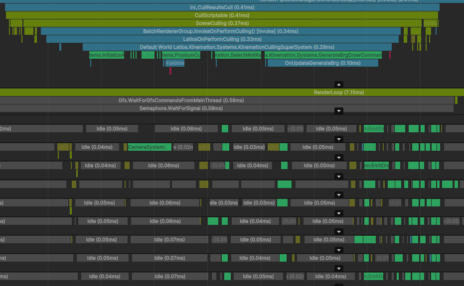

# Culling Performance

Kinemation is designed to handle dense worlds with hundreds of thousands of
entities within the limits of floating-point stability. However, culling can
still consume a large amount of frame’s budget. This guide will discuss various
ways to help Kinemation out.

## Culling Pass Counts

The first thing to check when determining culling performance is to look for the
number of times `LatiosOnPerformCulling` occurs in a frame. Typically there are
two instances of this per frame in a build. One is for the main camera, and the
other is for shadow map cascades. If you have extra cameras or additional
shadow-casting lights, each of these will also create an instance. In the
editor, the scene view may also create an instance. Each instance requires
scheduling a large set of jobs over multiple ECS systems, and for some projects,
the overhead of scheduling can become too much. A telltale sign of this is if
the worker threads have lots of tiny idle gaps between jobs.

The above screenshot shows what a `LatiosOnPerformCulling` that is
scheduling-bound might look like in the profiler. Having 2 or 3 instances of
this per frame is typically not an issue (this capture had safety checks
enabled, so it is 2-3 times slower than a build). But with a larger instance
count, it can add up.

Unfortunately, there is no fix for this issue at this time, because it is
largely a Unity issue. However, if you encounter this issue, please report it in
the framework Discord, as it may help prioritize research towards improving the
situation.

## Frustum Culling

If your worker threads are slammed during culling with large amounts of time
consumed by `FrustumCullUnskinnedEntitiesSystem`’s `SingleSplitCullingJob` and
`MultiSplitCullingJob`, you may have a frustum culling bottleneck.
`MultiSplitCullingJob` is typically more expensive, and occurs for directional
lights with shadow map cascades and for point light shadows. If most of the
entities in the world are static, there’s a very simple optimization you can do
that can have quite a big impact.

All you need to do is divide up your world roughly into tiles, and assign a
shared component with the tile index (or coordinates, really doesn’t matter) to
each static entity. This will cause entities near to each other to be placed in
the same ECS chunks, which shrinks the bounds of `ChunkWorldRenderBounds` for
each chunk. Smaller bounds increase the chances Kinemation can cull the entire
chunk in a single test, which is much faster.

## Contribution Culling

If you use LOD Pack and frequently leave the last level LOD empty, you are
effectively reducing the draw distance of the entity. This is known as
“contribution culling”. And sometimes, if you have a lot of small entities
within the far reaches of your view frustum, you might end up with a heavy
`SelectMmiRangeLodsSystem.Job` in the profiler.

If you encounter issues with this in a project that you can share, please share
it! There are two potential improvements to this problem (evaluation pipelining
and distance culling of `ChunkWorldRenderBounds`). But these require testing.

## General Tips for Worker Thread Bottlenecks

If the above tips weren’t enough, there are still some general tips you can
apply to improve culling performance across all worker threads in large scenes.

Cameras and lights often have layer masks, which can be used to select specific
entities to render. The layer mask for entities is stored in the
`RenderFilterSettings` shared component, which means culling may occur per
chunk. Currently, only Game Object layers can be culled this way (Unity
limitation). Rendering layers are not considered for culling.

Entities can also easily be culled in bulk from shadow casting. One way is to
disable shadow casting for entities. This property is also stored in
`RenderFilterSettings`. Another way is to bake shadows into lightmaps.

Lastly, you can always disable the `MaterialMeshInfo` component. The enabled
state is a toggle that won’t result in any structural changes, but is forwarded
to the bitmasks Kinemation uses internally to keep track of culling statuses.
One downside of `MaterialMeshInfo` is that its status affects all cameras and
shadow casters for the frame, including scene view.

All of these checks take place first in the culling pipeline before frustum and
contribution culling. And the remaining steps will skip over culled chunks and
entities for maximum efficiency.
