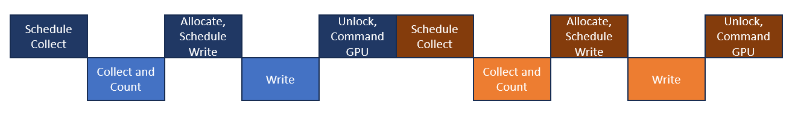
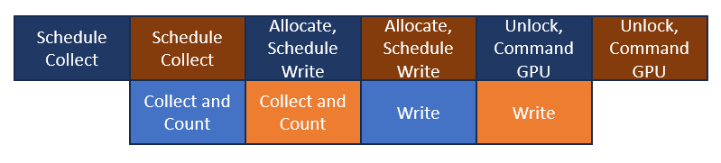

# Custom Graphics

Kinemation is quite experienced when it comes to sending data to the GPU based
on culling data. Over time, it has converged onto some high-performance patterns
and architecture. The mechanisms have been made part of the public API, so that
other modules, add-ons, and even your own code can tap into this power.

This is not a guide about how to write custom DOTS Instanced shaders. Rather,
the focus is extracting data from ECS and sending it to the GPU as efficiently
as possible. It is assumed you have basic knowledge of graphics buffers and
compute shaders in Unity.

## The Rendering Loop

Kinemation’s rendering loop looks a little different than Entities Graphics. It
goes like this:

-   PresentationSystemGroup – once per non-paused frame
    -   StructuralChangePresentationSystemGroup
    -   UpdatePresentationSystemGroup
    -   LatiosEntitiesGraphicsSystem
    -   KinemationPostRenderSystemGroup
        -   Systems performing various frame preparation tasks and cache setups
        -   KinemationCustomGraphicsSuperSystem – skips update if disabled
            (disabled by default)
            -   KinemationCustomGraphicsSetupSuperSystem – user injectable
            -   Systems which setup deform renderer material properties
            -   CustomGraphicsRoundRobinDispatchSuperSystem – systems within
                participate in round-robin scheduling
                -   DispatchRoundRobinEarlyExtensionsSuperSystem – user
                    injectable
                -   System to upload unique meshes
                -   Systems performing deformations
                -   DispatchRoundRobinLateExtensionsSuperSystem – user
                    injectable
-   KinemationCullingSuperSystem – once per camera and shadow casting light per
    frame (including paused frames)
    -   Currently, culling systems are exclusively built-in, though user
        injection points could be added upon request
-   KinemationCullingDispatchSuperSystem
    -   Systems which setup deform renderer material properties
    -   CullingRoundRobinDispatchSuperSystem – systems within participate in
        round-robin scheduling
        -   DispatchRoundRobinEarlyExtensionsSuperSystem – user injectable
        -   System to upload unique meshes
        -   Systems performing deformations
        -   DispatchRoundRobinLateExtensionsSuperSystem – user injectable
        -   System to upload material properties
    -   Systems to update frame frame masks and visibility feedback

There’s a lot going on. But we’ll explore it more in detail. One thing I’d like
to point out though is that `KinemationCullingSuperSystem` and
`KinemationCullingDispatchSuperSystem` each have a custom allocator set bound to
`WorldUpdateAllocator`. These can update hundreds of times in-between world
updates, and so the allocators need to rewind more frequently. As long as you
keep the expected lifecycles of allocations within these systems to a single
dispatch pass, you won’t have to worry about this.

## Round Robin Scheduling

The biggest thing you may have noticed is the round-robin scheduling systems.
What are those? To understand that, we need to break down what it takes to
populate and upload a graphics buffer to the GPU.

Except under specific use cases, we probably don’t know how much data we need to
upload in advance. Therefore, our first step will be to collect the data and
count the size we need to upload. We’ll probably schedule this as a job or
several. We call this the **Collect Phase**.

Then, we need to sync with the main thread so that we can allocate our
GraphicsBuffer instances, and then lock them for writing. Afterwards, we’ll
schedule more jobs to write to the buffers. We call this the **Write Phase**.

Finally, we need to sync with the main thread one last time to unlock our
buffers. Then we can assign it to a shader variable and maybe dispatch some
compute shaders. We call this the **Dispatch Phase**. The act of dispatching
compute shaders is also where the “Dispatch” originates in other Kinemation
types. In those contexts, when we refer to “a dispatch”, we are describing the
time period where we are uploading data to the GPU and making GPU commands. One
dispatch will service several culling passes.

If we have two systems doing this uploading and GPU commanding, we end up with a
profiler kinda looking like the following diagram. Top row is the main thread,
while bottom row is the worker threads.



This is what round-robin scheduling does to our profiler:



Do you see how there’s much less white space? That’s performance!

### Round Robin Code

There are two custom injection points that are part of round-robin scheduling,
which means you can write code that participates. To help you do this, there is
a utility API to guide you. Let’s create a new `ISystem` called
`MyRoundRobinSystem`.

Inside our system, we need to define two custom public struct types, which we
conventionally name `CollectState` and `WriteState`. These types will hold state
we want to pass between the update phases, such as allocated collections.

Next, make `MyRoundRobinSystem` implement
`ICullingComputeDispatchSystem<MyRoundRobinSystem.CollectState,
MyRoundRobinSystem.WriteState>`. This will require we implement `Collect()`,
`Write()`, and `Dispatch()` methods. Go ahead and let your IDE generate them for
you.

Next, we need to create a field of type
`CullingComputeDispatchData<CollectState, WriteState>`. In our example, we’ll
name this `m_data`. In `OnCreate()`, we need to construct it by passing in the
`LatiosWorldUnmanaged`.

Lastly, we can specify our `OnUpdate()` method like this:

```csharp
[BurstCompile]
public void OnUpdate(ref SystemState state) => m_data.DoUpdate(ref state, ref this);
```

Putting it all together, we have this:

```csharp
public partial struct MyRoundRobinSystem : ISystem, ICullingComputeDispatchSystem<MyRoundRobinSystem.CollectState, MyRoundRobinSystem.WriteState>
{
    LatiosWorldUnmanaged latiosWorld;
    CullingComputeDispatchData<CollectState, WriteState> m_data;

    public void OnCreate(ref SystemState state)
    {
        latiosWorld = state.GetLatiosWorldUnmanaged();
        m_data      = new CullingComputeDispatchData<CollectState, WriteState>(latiosWorld);
    }

    [BurstCompile]
    public void OnUpdate(ref SystemState state) => m_data.DoUpdate(ref state, ref this);

    public CollectState Collect(ref SystemState state)
    {
        return new CollectState
        {

        };
    }

    public WriteState Write(ref SystemState state, ref CollectState collected)
    {
        return new WriteState
        {

        };
    }

    public void Dispatch(ref SystemState state, ref WriteState written)
    {
        
    }

    public struct CollectState
    {

    }

    public struct WriteState
    {

    }
}
```

That’s all we need to make our system compliant with round-robin scheduling. And
yes, we’ll be Burst-compiling all our updates.

## Graphics Buffers and Shaders

We’ll assume we want to load a `ComputeShader`, feed it a few buffers, and then
bind the result to a global shader variable. For this, we will need to define
variables to hold our compute shader and all our shader property IDs. For the
compute shader, we store it as a `UnityObjectRef<ComputeShader>` field.

Our `OnCreate()` method won’t be Burst-compatible, so remove the attribute if
necessary. In it, we’ll load our compute shader from `Resources` and collect our
shader properties via `Shader.PropertyToID()`.

*Note: If you are referencing framework code, you might see methods named*
`LoadFromResourcesAndPreserve<ComputeShader>()`*. This was a workaround for
older versions of Unity and may no longer be necessary.*

For a `GraphicsBuffer`, we can construct a `GraphicsBufferUnmanaged`. You’ll
notice that this has many of the same APIs as `GraphicsBuffer`, except these are
all Burst-compatible. Similarly, `UnityObjectRef<ComputeShader>` has
Burst-compatible extension methods emulating `ComputeShader` member methods.
Lastly, there’s a static class `GraphicsUnmanaged` which has a
`SetGlobalBuffer()` method. This emulates the `Shader` member of the same name.

If the graphics API you need doesn’t have a Burst-compatible equivalent, feel
free to make a request.

## GraphicsBufferBroker

`GraphicsBufferUnmanaged` still creates a `GraphicsBuffer` behind-the-scenes,
which means if we tried to create a new `GraphicsBufferUnmanaged` every update,
we would end up with GC allocations every frame. That’s undesirable. It would be
better if we could reuse buffers. However, Unity has complex rules for working
with graphics buffers that we need to be aware of. And this gets especially
tricky when trying to make buffers resize dynamically to the project’s needs.

Kinemation provides a utility to simplify all of this. It is called
`GraphicsBufferBroker`, and it is an `IComponentData` that lives on the
`worldBlackboardEntity`. `GraphicsBufferBroker` provides two types of resources.

### Persistent Buffers

Persistent buffers are graphics buffers that live for multiple frames. They can
be write targets of compute shaders and be bound to shader variables for
rendering. However, they cannot use the `LockBufferForWrite()` API. Persistent
buffers are always allocated at powers of 2 in size. If a buffer is requested
for a bigger size than what it currently is, a new buffer will be created. The
old buffer’s contents will be copied to the new buffer, and the old buffer will
be disposed at some time in the future. You will need to provide a compute
shader to perform this copy operation.

If your persistent buffer is a `ByteAddressBuffer`, you can use the
`“CopyBytes”` compute shader in `Resources`. For a structured buffer, your
compute shader needs to provide `_src` and `_dst` buffer uniforms and an `int
_start` which is an offset that should be added to `SV_DispatchThreadID.x` to
get the element index for a given thread. You can find plenty of examples in
Kinemation’s Resources folder.

To create a persistent buffer, we first need to reserve a static ID for it.

```csharp
static GraphicsBufferBroker.StaticID kMyPersistentBufferID = GraphicsBufferBroker.ReservePersistentBuffer();
```

We also want to define a non-static member that will store a copy of this ID in
a Burst-accessible manner.

```csharp
GraphicsBufferBroker.StaticID m_myPersistentBufferID;
```

*Q: Why can’t we use SharedStatic?*

*A: SharedStatics cause initialization to happen potentially twice, once in
Burst and once outside of it. This means we might end up reserving two different
static IDs for the same persistent buffer. If you know of a better way around
this issue, feel free to send me suggestions!*

In `OnCreate()`, we fetch the `GraphicsBufferBroker` from the
`worldBlackboardEntity`. `GraphicsBufferBroker` internally stores all of its
data in collections, so we can safely pass it around by value. However, you
should never pass it to a job.

Next, on the `GraphicsBufferBroker` instance, call
`InitializePersistentBuffer()`, passing in all the required arguments. For the
initial size, it is a good idea to use some kind of conservative minimum power
of 2 to reduce frequent resize allocations early on. Don’t forget to copy the
static ID to the system’s member.

Typically in a system’s `Dispatch()` method, we can call `GetPersistentBuffer()`
to get access to the buffer and potentially resize it. If the buffer resizes, we
will need to rebind it to any shaders or materials appropriately. If we instead
wish to obtain a buffer driven by a different system (typically for reading in a
compute shader), we can use `GetPersistentBufferNoResize()` instead.

### Upload Pools

Upload pools contain a rotating `GraphicsBuffer` pool designed for the
`LockBufferForWrite()` API. Buffers obtained from this pool are only valid for a
single frame and can only act as a read-only buffer in shaders. They are
specifically designed for transferring data from the CPU to the GPU.

Upload pools are set up very similarly to persistent buffers. We reserve static
IDs for them just like persistent buffers, except we call
`GraphicsBufferBroker.ReserveUploadPool()`. We also use `InitializeUploadPool()`
in `OnCreate()`.

When we call `GetUploadBuffer()`, we will get a `GraphicsBufferUnmanaged` which
we can call `LockBufferForWrite()` on. The buffer we receive may be larger than
the requested size. If we make multiple calls to this method within the same
frame using the same static ID, we will receive different buffer instances. They
are all safe to use. Usually, we call `GetUploadBuffer()` one or more times in
the system’s `Write()` method, and store the buffers in the `WriteState` so that
we can unlock them in `Dispatch()`.

### GraphicsBufferBroker Extensions

Kinemation and other modules provide extension methods on `GraphicsBufferBroker`
for accessing predefined resources. The skinning transforms buffer is a
`ByteAddressBuffer` containing either combined skin matrices or world-space dual
quaternions. These are used by vertex skinning shaders. The deformed vertices
buffer contains the vertices used by deform shaders, including dynamic meshes,
blend shapes, and compute skinning. These are a structured buffer defined as:

```hlsl
struct Vertex
{
    float3 position;
    float3 normal;
    float3 tangent;
};
```

Both of those buffers can only be obtained in
`DispatchRoundRobinLateExtensionsSuperSystem`. The start offsets into these
buffers can be read from Kinemation’s material property components.

The undeformed source mesh vertices can also be obtained, and these are also
valid in `DispatchRoundRobinEarlyExtensionsSuperSystem`. However, at the time of
writing, there is no public API for finding appropriate offsets into this
buffer. If you need this or need access to other Kinemation data, please reach
out!

The extension methods `GetMetaUintUpload3Buffer()` and
`GetMetaUintUpload4Buffer()` provide `ByteAddressBuffers` via upload pools with
elements counted in `uint3` or `uint4` respectively. These are especially common
formats for storing compute shader commands.

## Working with Entities

There are two absolutely critical rules when doing custom graphics. The first is
**no structural changes!** You can use command buffers that are played back in
`InitializationSystemGroup`, but you cannot move entities around until then.
Kinemation (and Entities Graphics is like this too) assumes that after the
`StructuralChangePresentationSystemGroup`, the location of all entities in their
chunks is locked down until rendering finishes.

One of the things you may want to know is which entities to process based on
culling results. There are two components that will be relevant for this:
`ChunkPerDispatchCullingMask` and `ChunkPerFrameCullingMask`. These are chunk
components, which means accessing them will be a little different if you have
never used chunk components before. They each have a pair of `BitField64`, where
`lower` represents the first 64 entities in the chunk, and `upper` represents
the last 64.

`ChunkPerDispatchCullingMask` will have a bit enabled for each entity which
passed any of the culling passes since the last dispatch.
`ChunkPerFrameCullingMask` will have a bit enabled for each entity which was
serviced by a previous dispatch since the last world update. To get entities
that need dispatching for the first time this frame, use the expression`
ChunkPerDispatchCullingMask & ~ChunkPerFrameCullingMask`.

Another common operation with entities is setting material property components.
This brings us to the second absolutely critical rule. **Once an entity has been
dispatched in a frame, the values of its material property components should
never change until the next world update.** The behavior that occurs when this
rule is violated is platform-dependent, and may result in nasty artifacts or
even GPU deadlocks (if you use loops in shaders) on some platforms. This rule
also applies to element indices in any graphics buffers you bind globally to
shaders.

`LatiosEntitiesGraphicsSystem` marks material property components as dirty on a
per-chunk basis. These markings are also in a chunk component called
`ChunkMaterialPropertyDirtyMask`. After this point, to mark a material property,
we must mark the bits directly. Each bit corresponds to a component type in the
`DynamicBuffer<MaterialPropertyComponentType>` on the `worldBlackboardEntity`.
Material property components must be dirtied during the `Collect()` phase of
round-robin scheduling. Anything later could result in the data never being
synced.

Lastly, the `worldBlackboardEntity` has a `DispatchContext` component. Likely
the most interesting value here is the `dispatchIndexThisFrame` value. This
value starts at 0 and counts up until the next world update.

## Graphics Before Culling

Sometimes, custom graphics require sending data to the GPU before culling even
begins. A common example of this is VFX Graph, which updates between
`PresentationSystemGroup` and the culling phases. If your project requires this,
you can enable the Custom Graphics Systems. You do this by adding the
`EnableCustomGraphicsTag` to the `worldBlackboardEntity`. When this is enabled,
a form of round-robin dispatch takes place at the end of
`PresentationSystemGroup`. This introduces a partial sync point, so it is
disabled by default.

When the custom graphics systems are enabled, there is a special
`KinemationCustomGraphicsSetupSuperSystem` prior to the round-robin dispatch
where systems can be added. One of the main purposes of this system is to flag
entities that require the early dispatch. This means writing to
`ChunkPerDispatchCullingMask`. For entities that should only be processed in
this phase, and always be culled, add the `UsedOnlyForCustomGraphicsTag`
component to them.
