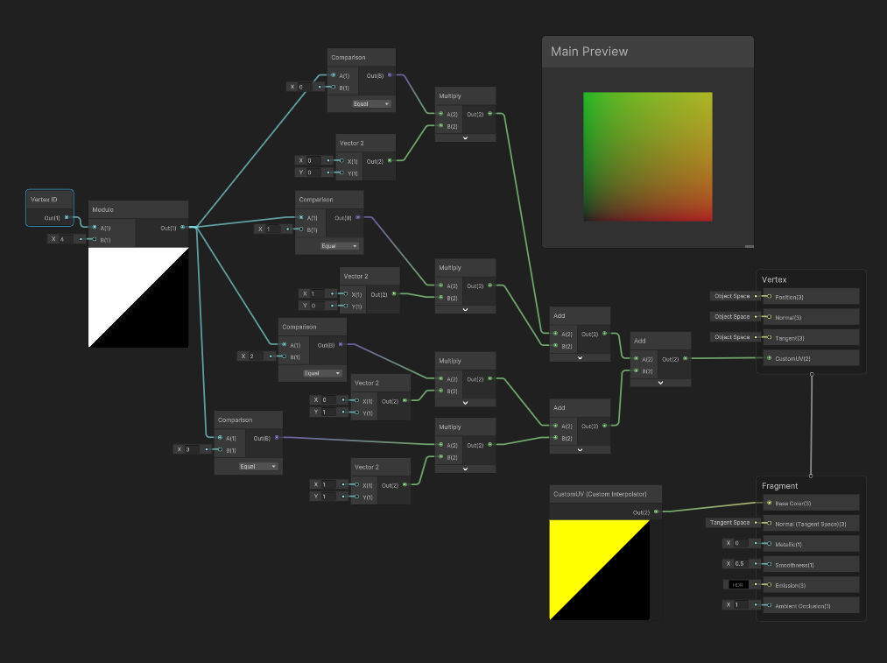

# Dynamic Meshes

Dynamic Meshes are meshes that leverage Kinemation’s GPU deform buffers to feed
in mesh modifications from ECS data. They can be used to represent non-rigid
shapes or for CPU-based particle systems.

Dynamic meshes reupload their mesh every frame in which they are visible and
rendered, even if no changes have been made. They maintain their own motion
history via an internal buffer rotation mechanism.

## Composition

A Dynamic Mesh requires four components to operate correctly:

-   MeshDeformDataBlobReference : IComponentData
-   DynamicMeshMaxVertexDisplacement : IComponentData
-   DynamicMeshState : IComponentData
-   DynamicMeshVertex : IBufferElementData

There is also a `DynamicMeshAspect : IAspect` which abstracts `DynamicMeshState`
and `DynamicMeshVertex`.

Lastly, to render a Dynamic Mesh correctly, the entity will need to be baked as
a *deformed mesh*.

## Baking a Dynamic Mesh

First, create an authoring component that inherits OverrideMeshRendererBase.
This action will disable default Mesh Renderer baking.

```csharp
public struct TestDynamicMeshData : IComponentData
{
    public float2 meshRelativeCenter;
    public float  frequency;
    public float  speed;
    public float  amplitude;
}

public class TestDynamicMeshAuthoring : OverrideMeshRendererBase
{
    public float2 meshRelativeCenter;
    public float  frequency;
    public float  speed;
    public float  amplitude;
}
```

Next, create a smart baker for your authoring component. Along with any custom
data you require, this baker must invoke `BakeMeshAndMaterial()`, and request a
smart blobber to generate the `MeshDeformDataBlob` required by the
`MeshDeformDataBlobReference` component. It must also create the remaining
required runtime components.

```csharp
[TemporaryBakingType]
struct TestDynamicMeshBakeItem : ISmartBakeItem<TestDynamicMeshAuthoring>
{
    SmartBlobberHandle<MeshDeformDataBlob> meshBlobRequest;

    public bool Bake(TestDynamicMeshAuthoring authoring, IBaker baker)
    {
        var entity = baker.GetEntity(TransformUsageFlags.Dynamic);
        baker.AddComponent(entity, new TestDynamicMeshData
        {
            meshRelativeCenter = authoring.meshRelativeCenter,
            frequency          = authoring.frequency,
            speed              = authoring.speed,
            amplitude          = authoring.amplitude,
        });

        var renderer         = baker.GetComponent<MeshRenderer>();
        var mesh             = baker.GetComponent<MeshFilter>().sharedMesh;
        var material         = renderer.sharedMaterial;
        var rendererSettings = new MeshRendererBakeSettings
        {
            isDeforming           = true,
            localBounds           = mesh.bounds,
            renderMeshDescription = new RenderMeshDescription(renderer),
            targetEntity          = entity,
        };
        baker.BakeMeshAndMaterial(rendererSettings, mesh, material);

        meshBlobRequest = baker.RequestCreateBlobAsset(mesh);
        baker.AddComponent<MeshDeformDataBlobReference>(     entity);
        baker.AddComponent<DynamicMeshMaxVertexDisplacement>(entity);
        baker.AddComponent(                                  entity, DynamicMeshAspect.RequiredComponentTypeSet);

        return true;
    }

    public void PostProcessBlobRequests(EntityManager entityManager, Entity entity)
    {
        entityManager.SetComponentData(entity, new MeshDeformDataBlobReference
        {
            blob = meshBlobRequest.Resolve(entityManager)
        });
    }
}

class TestDynamicMeshAuthoringBaker : SmartBaker<TestDynamicMeshAuthoring, TestDynamicMeshBakeItem>
{
}
```

*Q:* `DynamicBuffer<DynamicMeshVertex>` *is left empty?*

If you want to initialize the mesh data in the baker, you may do so. However, if
you leave it zero-sized, the runtime will initialize it to the contents of
`MeshDeformDataBlob.undeformedVertices`. This drastically decreases the size of
the serialized subscene.

## Modifying a Dynamic Mesh at Runtime

To write to a Dynamic Mesh, simply acquire the mesh data via
`DynamicMeshAspect.verticesRW`. These vertices will **NOT** contain the previous
frame’s vertices and should only ever be written to. If you need the previous
frame’s modifications, read from the `previousVertices` instead.

```csharp
public partial struct TestDynamicMeshSystem : ISystem
{
    [BurstCompile]
    public void OnUpdate(ref SystemState state)
    {
        new Job { elapsedTime = (float)SystemAPI.Time.ElapsedTime }.ScheduleParallel();
    }

    [BurstCompile]
    partial struct Job : IJobEntity
    {
        public float elapsedTime;

        public void Execute(ref DynamicMeshAspect mesh, ref DynamicMeshMaxVertexDisplacement displacement, in TestDynamicMeshData data)
        {
            var vertices = mesh.verticesRW;
            var previous = mesh.previousVertices;
            for (int i = 0; i < mesh.vertexCount; i++)
            {
                var vertex   = previous[i];
                var distance = math.distance(vertex.position.xz, data.meshRelativeCenter);
                math.sincos(data.frequency * distance + data.speed * elapsedTime, out var s, out var c);
                vertex.position.y = s * data.amplitude;
                var slope         = c * data.amplitude;
                var normal2d      = math.normalize(new float2(-slope, 1));
                vertex.normal     = math.normalize(new float3(normal2d.x * math.normalize(vertex.position.xz - data.meshRelativeCenter), normal2d.y)).xzy;
                vertices[i]       = vertex;
            }
            displacement.maxDisplacement = data.amplitude;
        }
    }
}
```

When modifying a `DynamicMesh`, you need to compute the maximum displacement of
any vertex from its original position in the
`MeshDeformDataBlob.undeformedVertices` and store it in
`DynamicMeshMaxVertexDisplacement`, otherwise culling may not work correctly.

However, modifying the `DynamicMeshMaxVertexDisplacement` every frame has a
non-zero cost, especially if the mesh is skinned or has blend shapes. If an
upper limit is known, it may be sufficient to set the value once at runtime or
even during baking to avoid triggering the change filter every frame.

## Using Skinning Algorithms

Kinemation includes a static class called `SkinningAlgorithms` to help deform
more complex objects. Meshes often have multiple vertices that share the same
position, but may have different normals or tangents (tangents are derived from
UVs). If you only care to deform the unique positions of a mesh, you can use
ExtractUniquePositions() to get the unique positions to modify. Once you are
done, call ApplyPositionsWithUniqueNormals() followed by NormalizeMesh() to get
the final mesh with updated normals and tangents. The following job shows an
example:

```csharp
[BurstCompile]
partial struct Job : IJobEntity
{
    public float time;
    public float deltaTime;

    public void Execute(DynamicMeshAspect dynamicMesh,
                        ref DynamicMeshMaxVertexDisplacement displacement,
                        in MeshDeformTest testParams,
                        in MeshDeformDataBlobReference meshBlobRef)
    {
        var deformVertices      = dynamicMesh.verticesRW;
        var uniqueVerticesCount = meshBlobRef.blob.Value.uniqueVertexPositionsCount;
        var uniqueVertices      = new NativeArray<float3>(uniqueVerticesCount, Allocator.Temp, NativeArrayOptions.UninitializedMemory);
        SkinningAlgorithms.ExtractUniquePositions(ref uniqueVertices, dynamicMesh.previousVertices, ref meshBlobRef.blob.Value.normalizationData);
        for (int i = 0; i < uniqueVertices.Length; i++)
        {
            var vertex         = uniqueVertices[i];
            var dist           = math.length(vertex.xz);
            vertex.y          += math.cos(testParams.frequency * time + dist * testParams.speed) * deltaTime * testParams.magnitude;
            uniqueVertices[i]  = vertex;
        }
        SkinningAlgorithms.ApplyPositionsWithUniqueNormals(ref deformVertices, uniqueVertices.AsReadOnly(), ref meshBlobRef.blob.Value.normalizationData);
        SkinningAlgorithms.NormalizeMesh(ref deformVertices, ref meshBlobRef.blob.Value.normalizationData, true);
        displacement.maxDisplacement = SkinningAlgorithms.FindMaxDisplacement(deformVertices.AsReadOnly(), ref meshBlobRef.blob.Value);
    }
}
```

`SkinningAlgorithms` also includes APIs for applying skeletal skinning and blend
shape deformations on the CPU. One challenge with skeletal skinning is obtaining
the bone transform bindings to compute the proper skin matrices. Bone transform
bindings are encoded as a `NativeArray<short>` where each element corresponds to
a skin matrix’s skeleton bone index. The bindings array can be accessed from the
`worldBlackboardEntity` via `SkinBoneBindingsCollectionAspect`. If you have the
mesh and skeleton binding path blobs, you can use those to try and find the
cached bindings, using `BindingUtilities.TrySolveBindings()` as a fallback. You
can also use `SkinnedMeshBindingAspect` or `SkeletonSkinBindingsAspect` to get a
`SkinBoneBindingsIndex` which can be used to index the
`SkinBoneBindingsCollectionAspect` directly. `SkeletonSkinBindingsAspect` can
also be used to identify all skinned mesh entities bound to the skeleton entity.

## Particle Tricks

*Note: This section describes using Dynamic Meshes for CPU particles. A better
solution for this use case will be provided in LifeFX. Calligraphics RenderGlyph
types may also provide a better temporary solution.*

When working with Dynamic Meshes as particles, you’ll still need a base mesh to
work from. While any mesh of sufficient size will do, you must make sure that
the triangles are set up correctly. For example, if working with billboard
quads, you would want a mesh that for every 4 vertices has 6 indices
representing those 4 vertices as 2 triangles.

### Culling Primitives

To cull a vertex, simply assign `math.asfloat(~0u)` to the `position`.

In general, you want to do this for all vertices in a primitive. In our
billboard quads case, all four vertices of a quad should have this position. VFX
Graph uses the same trick.

### Generating UVs

Dynamic Meshes do not allow dynamic assignment of UVs, as this is not included
in Kinemation’s deform buffers. This means you will either have to rely on the
UVs within the mesh or generate them on the fly in the shader using the Vertex
ID. Here’s an example of how you can construct the UVs in Shader Graph:


