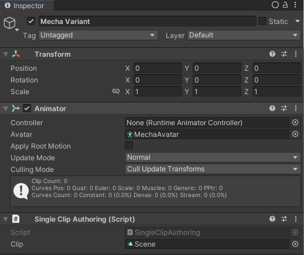

# Getting Started with Kinemation – Part 3

In this part, we’ll cover baking an animation clip, and playing it on our
character in a system. This guide assumes usage of QVVS Transforms. If you are
using Unity Transforms, you may need to make some corrections in order to get
the animations to work. This will not be an issue in Part 4 using optimized
skeletons.

## Defining our Clip Player Component

First, we will need add the following namespace:

```csharp
using Latios.Kinemation;
```

Baked Animation Clips are stored in `SkeletonClipSetBlob` blobs. Multiple clips
can be stored in a single blob. But if you only want to store a single clip per
blob and have multiple blobs, you can do that too. In our case, we will define a
component which stores a single blob with a single clip.

```csharp
public struct SingleClip : IComponentData
{
    public BlobAssetReference<SkeletonClipSetBlob> blob;
}
```

## Baking the Clip

Animation Clips are baked using a [Smart Blobber](../Core/Smart%20Blobbers.md).
Open up that link in a separate tab and read through the first section that has
code.

By the way, that code, that’s our authoring script that bakes the animation
clip. So let’s talk about the parts that the Smart Blobber guide didn’t discuss.

First, we need to create a `SkeletonClipConfig` for every clip we want to bake.
That takes two fields, the source animation clip, and the compression settings.
In this case, we specify the default settings which are usually pretty good. But
you can create your own settings if you want.

We create a blob request using that array as well as the `Animator` we want to
bake the clips for. Kinemation doesn’t yet support runtime retargeting of human
animations, but you can bake any human animation for a humanoid `Animator`.

The Smart Blobber will create a temporary clone of the `Animator`, sample all
the animation clips, and send those samples to ACL for compression.

Finally, in `PostProcessBlobRequests()` we get back a fresh-baked blob asset
with our animation clip inside. We can add that to our entity, which for now
we’ll assume is our skeleton entity.

## Playing the Clip Using BoneReference

There are multiple ways to play an animation clip. In all of the examples, we’ll
use `Time.ElapsedTime` to keep track of time. Normally you would want to keep
track of time some other way. But this will suffice for these examples.

Our first example will iterate skeletons. We’ll define our system like this:

```csharp
using Latios.Kinemation;
using Latios.Transforms;
using Latios.Transforms.Systems;
using Unity.Burst;
using Unity.Collections;
using Unity.Entities;

using static Unity.Entities.SystemAPI;

namespace Dragons
{
    [UpdateBefore(typeof(TransformSuperSystem))]
    public partial struct SingleClipPlayerSystem : ISystem
    {
        [BurstCompile]
        public void OnUpdate(ref SystemState state)
        {
            float t = (float)Time.ElapsedTime;

            foreach ((var bones, var singleClip) in Query<DynamicBuffer<BoneReference>, RefRO<SingleClip>>())
            {

            }
        }
    }
}
```

So far, so good.

Next, we want to get access to our animation clip. The `SkeletonClipSetBlob`
stores all the animation clips in a `BlobArray` appropriately named `clips`.
Each clip is of type `SkeletonClip`.

```csharp
ref var clip = ref singleClip.ValueRO.blob.Value.clips[0];
```

We want our clip to loop, but Kinemation automatically clamps all sample times.
So we need to convert our loop time to be within the bounds of the animation
clip. While we could do this ourselves using the clip’s duration value, the
`SkeletonClip` provides a convenient method for us.

```csharp
var clipTime = clip.LoopToClipTime(t);
```

Now we are ready to iterate through our bones. For each bone, we will call the
`SampleBone()` method on our `clip`. This method returns a `TransformQvvs`,
which contains local space translation, rotation, scale, and stretch. We can
then write those values to our bones.

```csharp
for (int i = 1; i < bones.Length; i++)
{
    var boneSampledLocalTransform          = clip.SampleBone(i, clipTime);
    var boneTransformAspect                = GetAspect<TransformAspect>(bones[i].bone);
    boneTransformAspect.localTransformQvvs = boneSampledLocalTransform;
}
```

*Q: Why are we starting with 1?*

*A: Index 0 is the root bone, which is also our skeleton entity. If we applied
animation data to that, we would lose our world-space position and rotation. Our
animation does not have root motion, so the character would be snapped to the
origin. However, if our animation did have root motion, we would want to compare
it to the previous frame’s sample and* **add** *the difference to our
Translation.*

Let’s add our new authoring component to our character and give it a clip.



And now when we press play…


## Playing the Clip Using BoneOwningSkeletonReference

Our first approach was fine, but we had to run it single-threaded because of the
`GetAspect<TransformAspect>()` calls. Using `TransformAspect` and
`WithNativeDisableParallelForRestriction()` might work, but perhaps it would be
a little cleaner if we iterated using bone entities instead. To do that, we’ll
use the `BoneOwningSkeletonReference` to find our skeleton and get the animation
clip and the `BoneIndex` to sample the right bone.

```csharp
[UpdateBefore(typeof(TransformSuperSystem))]
public partial struct SingleClipPlayerSystem : ISystem
{
    [BurstCompile]
    public void OnUpdate(ref SystemState state)
    {
        new ExposedJob { clipLookup = GetComponentLookup<SingleClip>(true), et = (float)Time.ElapsedTime }.ScheduleParallel();
    }

    [BurstCompile]
    partial struct ExposedJob : IJobEntity
    {
        [ReadOnly] public ComponentLookup<SingleClip> clipLookup;
        public float et;

        public void Execute(TransformAspect transform, in BoneIndex boneIndex, in BoneOwningSkeletonReference skeletonRef)
        {
            if (boneIndex.index <= 0 || !clipLookup.HasComponent(skeletonRef.skeletonRoot))
                return;

            ref var clip = ref clipLookup[skeletonRef.skeletonRoot].blob.Value.clips[0];
            var clipTime = clip.LoopToClipTime(et);

            transform.localTransformQvvs = clip.SampleBone(boneIndex.index, clipTime);
        }
    }
}
```

Hey look! We used `ScheduleParallel()` now.

## On To Part 4

We now have animations playing. What next?

Well, we have only discussed exposed skeletons. We still need to animate
optimized skeletons, especially if we want to push the performance boundaries.

[Continue to Part 4](Getting%20Started%20-%20Part%204.md)
