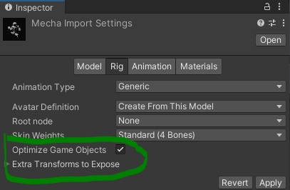

# Getting Started with Kinemation – Part 4

Optimized skeletons are fast. In this part, we’ll write some code to work with
them.

## Making an Optimized Skeleton via Import

Before we write any code though, we need to change our skeleton to be optimized.
We can do so by checking this box.



Of course, if we wanted to have additional sockets to attach weapons or
accessories, we might do that with the dropdown below it. We could also set it
up with *Socket* authoring components later.

## Sampling an Entire Pose at Once

Unlike exposed skeletons which rely on the entity transform system, optimized
skeletons maintain their own root-space hierarchy in dynamic buffers and blob
assets. Due to this complexity, it is not recommended to work with the raw
components. Instead, we will be using `OptimizedSkeletonAspect`.

**Important:** *Unity deprecated/removed IAspect, and Latios Framework 0.15 is
the first version to react to this change. The documentation below shows code
samples for Latios Framework 0.14.x. To adapt the samples for 0.15, you must
construct the* `OptimizedSkeletonAspect` *as a local variable using its
constructor. The constructor is different between QVVS Transforms and Unity
Transforms. For QVVS Transforms specifically, you also need to pass a*
`ComponentLookup<Socket>` *and a properly-obtained* `TransformAspect`*.*

*If you struggle to perform these substitutions, please inform me on the Latios
Framework Discord, but also complain to Unity that their removal of IAspect has
made the Latios Framework significantly harder to use. They are more likely to
do something about it if they hear it directly from you.*

```csharp
[BurstCompile]
partial struct OptimizedJob : IJobEntity
{
    public float et;

    public void Execute(OptimizedSkeletonAspect skeleton, in SingleClip singleClip)
    {
        ref var clip = ref singleClip.blob.Value.clips[0];
        var clipTime = clip.LoopToClipTime(et);

    }
}
```

There are multiple ways that we can sample the animations for the bones. For
example, we could iterate through the `bones` and write to the `localTransform`
of each. However, doing so will sync the hierarchy on every write, which is
slow.

A faster way that minimizes syncing would be to write to `rawLocalTransformsRW`
instead. This does no syncing whatsoever. And when we are done, we have to call
`EndSamplingAndSync()`.

However, there’s one further optimization we can employ. Sampling all the bones
in a clip (a pose) is significantly faster than sampling each bone one-by-one.
We can use the `SamplePose()` method for this. This requires a third argument
which specifies a `weight`. When using pose sampling, weight blending is
built-in for performance reasons. For a single clip, we can set this to `1f`.
Afterwards, we have to call `EndSamplingAndSync()`.

```csharp
[BurstCompile]
partial struct OptimizedJob : IJobEntity
{
    public float et;

    public void Execute(OptimizedSkeletonAspect skeleton, in SingleClip singleClip)
    {
        ref var clip     = ref singleClip.blob.Value.clips[0];
        var     clipTime = clip.LoopToClipTime(et);

        clip.SamplePose(ref skeleton, clipTime, 1f);
        skeleton.EndSamplingAndSync();
    }
}
```

Yes. It really is that simple! It is also worth noting that unlike exposed
skeletons, optimized skeletons can safely write to bone index 0. Often, this
bone contains the root motion delta, and is not reflected in rendering.

## What’s Next

Kinemation is new cutting-edge technology, and its potential is still being
explored. Let me know what you would like to see showcased next!
