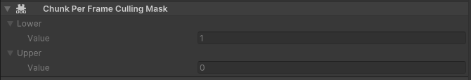

# Kinemation Troubleshooting Guide

This guide discusses common problems encountered when using Kinemation and how
to diagnose and resolve them. If you encounter an issue not present in this
guide, please share the issue in the Latios Framework Discord for the fastest
resolution.

## Invisible Meshes

Very frequently someone reports that Kinemation isn’t rendering. There could be
a variety of causes. Here are the initial steps to help diagnose the problem.

If this happened after installing the Latios Framework Bootstrap into an
existing project and your subscenes are closed, reimport them. For some reason,
Unity doesn’t recognize the subscenes need to be rebaked sometimes. If that’s
not your issue, read on.

Before you do anything else, make sure there are no warnings or errors during
baking or runtime. Any issue, even on an unrelated object, could potentially
corrupt the caches used in rendering. If you do get an error, you may wish to
look at the line of code containing the error message. If that line of code
belongs to the Latios Framework, pay extra attention to the message. It is there
to tell you what is wrong and why.

Now, put the object in its own subscene, and without entering play mode, switch
to the game tab. If the object is visible and correctly shaped there, that means
Kinemation is rendering it just fine (yes, Kinemation renders the game view tab
in edit mode). We can rule out shader issues as the problem.

As a next test, you want to look at the runtime inspector of your entity and
look for this component:

Every ECS chunk has up to 128 entities. Lower is a bitmask of the first 64
entities, and Upper is the second 64. Copy these values into an integer-\>binary
converter to see which entities have a ‘1’. Those entities were ones Kinemation
chose to render in the last frame. If your entity has a ‘1’, then your issue is
almost certainly one of three things:

1.  Your shader is wrong/incompatible
2.  Your mesh has bad data (especially for dynamic meshes or Calligraphics)
3.  Your transform has zero scale or stretch

If your entity has a ‘0’, then Kinemation does not believe your object should be
rendered. This could be due to improper archetype, wrong bounds, incorrect LODs,
wrong layer masks, or other reasons.

This should hopefully help focus your investigations.

## Bindings and Initialization

Kinemation requires managing and tracking internal state with many of the
entities that are created at runtime. The primary reason for this is
performance, but it does place some restrictions on how entities are
instantiated and modified.

`KinemationBindingReactiveSystem` is the most important system. This system sets
up all the relationships between skeletons and skinned meshes and will reparent
skinned meshes in the process. It also registers deforming mesh blobs for upload
to the GPU and keeps reference counts. This system runs twice per frame, once
inside `LatiosWorldSyncGroup` (actual system is
`KinemationFrameSyncPointSuperSystem` for ordering purposes) and the other in
`StructuralChangePresentationSystemGroup`.

`RotateAnimatedBufferSystem` is also important if you use optimized skeletons,
blend shapes, or dynamic meshes. This system updates in the
`MotionHistoryUpdateSuperSystem` which occurs at the very end of
`InitializationSystemGroup`. Optimized skeletons, blend shapes, and dynamic
meshes are baked with compressed dynamic buffers to save on memory and
instantiation costs. Because of this, the first time one of these archetypes is
encountered by `RotateAnimatedBuffersSystem`, the system will expand the dynamic
buffers to the appropriate runtime sizes. The potential issues and resolutions
for this is slightly different for optimized skeletons than the other two.

Prior to `RotateAnimatedBufferSystem`, `BlendShapeAspect` and
`DynamicMeshAspect` will not function correctly, but rendering will still
function. To make the aspects work, the `BlendShapeWeight` and
`DynamicMeshVertex` buffers should be three times the size of the number of
shapes and vertices respectively. You will also need to copy the sets of shapes
and vertices twice for Previous and TwoAgo properties to function correctly.
Using `MeshDeformDataBlob`, you can size the blend shapes buffer using
`blendShapesData.shapes.Length`, and you can size the dynamic mesh buffer using
`undeformedVertices.Length`.

Optimized skeletons will not render correctly if their buffers are not
initialized. But unlike the previous types, the issue can be resolved directly
in the `OptimizedSkeletonAspect` API. Simply call `ForceInitialize()` and the
aspect will be corrected and ready for use. Beginning in 0.11.2, this is invoked
automatically if the transform systems see the optimized skeleton prior to
`KinemationBindingReactiveSystem`.

*If you encounter issues with initialization or struggle to apply the suggested
fixes, feel free to discuss in the Latios Framework Discord. It is very likely
new utility APIs can be added to help resolve the issues you are facing.*

## Baking Mesh Paths

If you get an error from `MeshPathsSmartBlobberSystem`, odds are you have a bone
influence in the mesh referencing the Game Object with the Animator. This is not
supported with the default bakers. [This
page](Binding%20Skinned%20Meshes%20to%20Skeletons%20at%20Runtime.md) explains
why this is and how you might work around it. This issue is not an issue you are
likely to run into unless you do custom mesh manipulations on skinned meshes in
the Editor.
