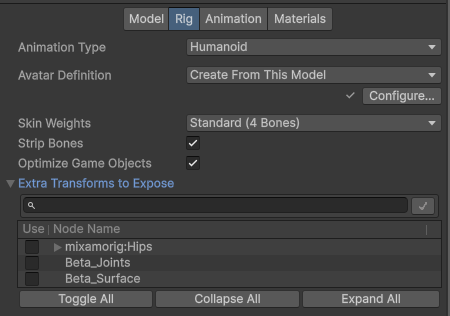
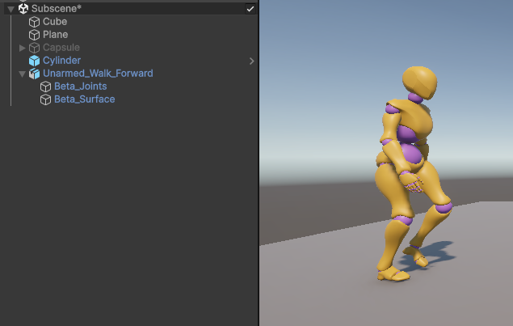
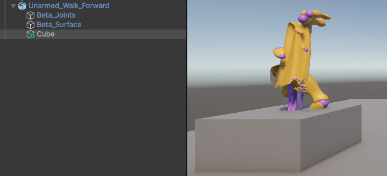
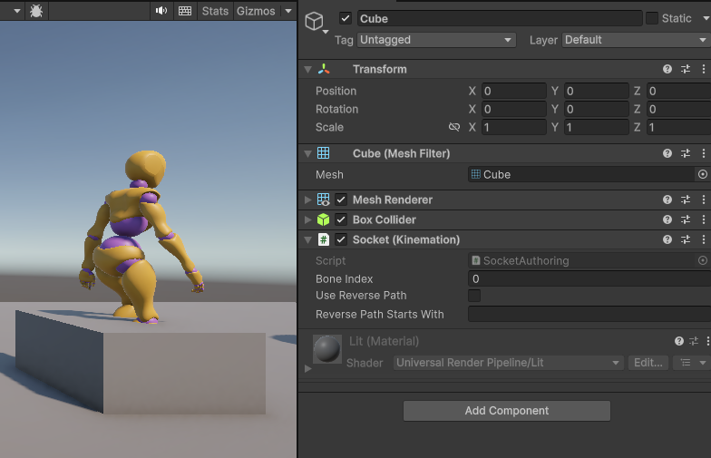
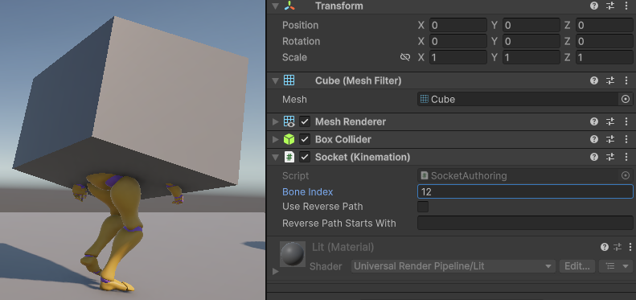
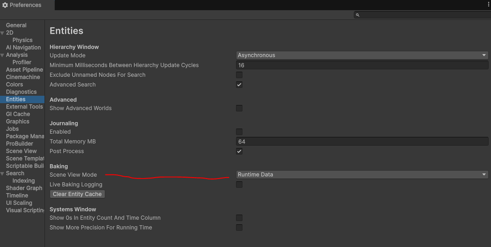
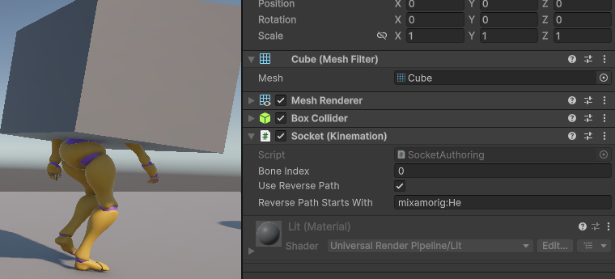
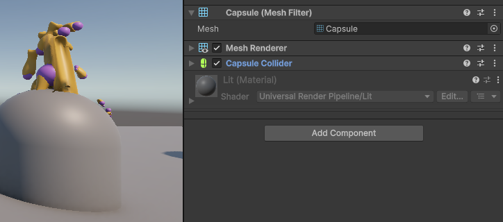
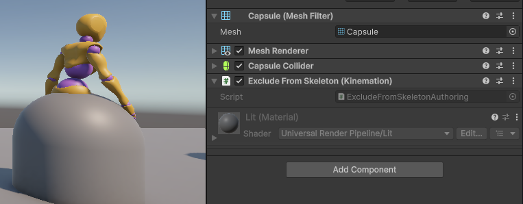

# Working with Optimized Skeletons Nondestructively

Optimized skeletons are powerfully performant. However, the authoring tooling is
somewhat simplistic and may come with a few surprises. This guide will
demonstrate a workflow for configuring sockets and child entities on optimized
skeletons using the nondestructive workflows.

## Importing a Skeleton

To configure an optimized skeleton, you must import it with the **Optimize Game
Objects** checked in the Rig tab.

The other settings are up to you to decide based on your own needs. For example,
the Strip Bones setting can reduce runtime costs depending on your model, but
will also eliminate some potential socket points you might want to leverage.

For the Extra Transforms to Expose setting, we will leave all of them unchecked.
While checking individual items is a valid approach for creating sockets, if you
ever wanted to make changes, you would have to reimport the mesh. We’ll be using
a different workflow that doesn’t have that problem.

Once your skeleton has been imported with your desired animations, and skinned
meshes have been set up with correct materials, feel free to drag it into the
subscene.

If this is done correctly, you will see the character’s root GameObject will
only have a few children. In this case, there is one for each skinned mesh.
Sometimes, the skinned meshes will be a child of a LOD Group which is a child of
the root, and sometimes, there will be a small hierarchy for unskinned meshes if
the model was imported with a weapon in hand or something.

## Adding a Child

Next, let’s add a new child Cube to the character’s root.

Yikes! What just happened to the skinned mesh?

Long story short, adding the new GameObject makes Kinemation think the skeleton
changed, and that this new object might be an animated socket from import time.
However, in the live editor world, the skinned mesh has already bound itself to
the old skeleton’s binding paths blob, and it assumes that doesn’t change at
runtime. While this is technically a bug in Kinemation (fixing it would incur a
heavy editor performance penalty, including in play mode), it is also usually a
sign you are missing an authoring component.

## Adding a Socket

By simply adding the Socket component to the cube, the skinned mesh fixes
itself.

Now, by dragging the Bone Index value, the cube will “jump” through the various
bones.

This will only be visible in the game view unless you have the Scene View Mode
set to Runtime Data in the Entities tab within Preferences.

In the Socket component, you can instead choose to check Use Reverse Path. This
will disable Bone Index, and instead use the string you provide to find the bone
to attach to. The “reverse path” always starts with the bone name, so typically
you can simply type the bone name (or even the first part of it) to get the
result you want. Here, “He” was enough for Kinemation to find the head bone.

Using the reverse path can be helpful if your skeleton is subject to changes.

## Adding a Non-Socket Child

What if you want a child object of the animator that isn’t attached to a bone?

This time, let’s add a capsule as a child. Again, we see the same mesh
corruption.

Now add the Exclude From Skeleton component to the capsule, and the skinned mesh
is fixed again.

Exclude From Skeleton is useful because not only does it fix visual issues in
the editor, but it also improves runtime performance.

## Fixing Skinned Meshes After Skeleton Changes

Sometimes, you will encounter situations where you do want the changes to the
skeleton to stay, but you would also like the skinned mesh to deform correctly.
Perhaps you added Exclude From Skeleton components on the LOD Group objects,
which resulted in the skeleton’s structure changing to have fewer tracked bones.
In such cases, there are typically two strategies you can employ.

If your character is self-contained, and does not reference anything else in the
subscene, simply drag it out of the subscene into the parent scene, and then
drag it back into the subscene.

If your character does have references to other subscene objects, another
alternative is to close the subscene and reopen it. You can also disable and
re-enable the skinned mesh renderer components (Components, not GameObjects).
