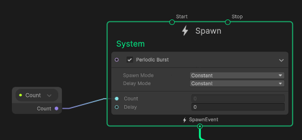
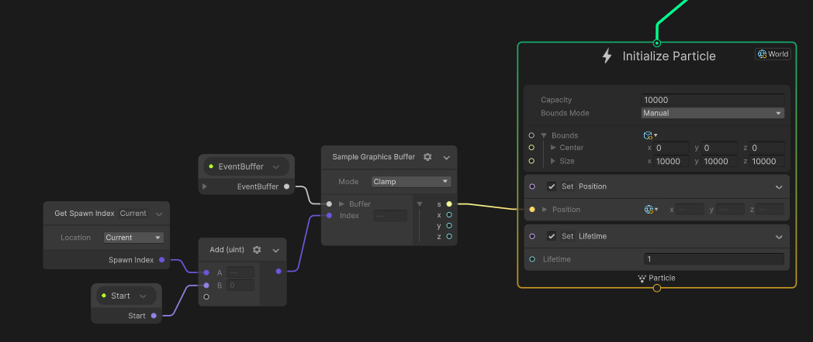
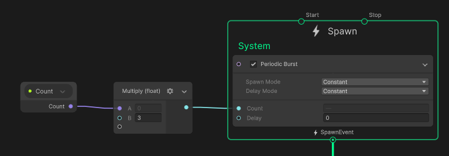
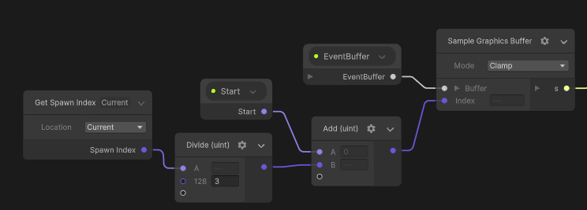
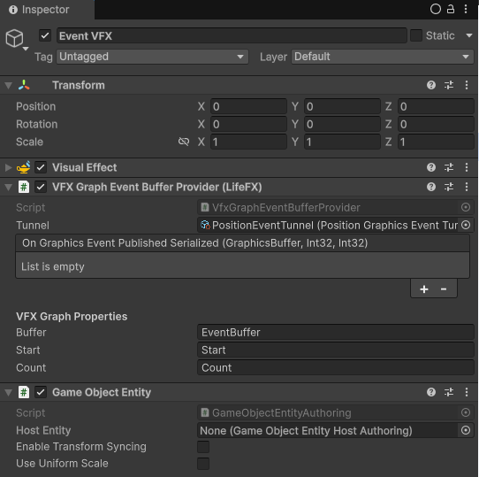
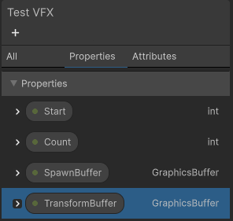
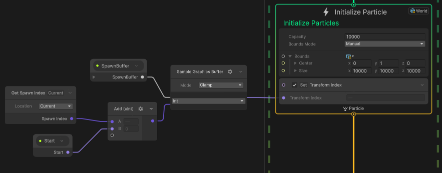
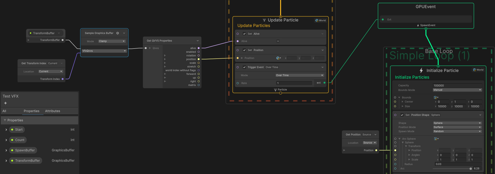

# Getting Started with LifeFX

LifeFX provides a pipeline for extracting data from ECS and sending it to GPU
buffers that can be processed by Game Objects. The most common use case for this
is to drive VFX Graph instances in a scene. This guide will discuss this
workflow for spawning multiple effect instances within a single VFX Game Object
in a scene, with the assumption you are experienced with VFX Graph. For other
use cases, it may be best to seek help from the framework’s Discord community.

## Before You Begin

It is really important that you understand both what LifeFX, and what it is not.
In VFX Graph, you have inputs called Properties. You can set these on a
`VisualEffect` instance using methods like `SetInt()` or `SetGraphicsBuffer()`.
All LifeFX does is extract data from the ECS world and call these methods. How
these properties get used in the graph is solely up to the user, and there’s no
official LifeFX workflow beyond feeding the VFX Graph the inputs.

For performance, it is usually best for a single `VisualEffect` instance to
service many entities at once. This is a different workflow from how VFX Graph
is typically used with Game Objects. LifeFX doesn’t magically make your “working
with Game Objects” VFX Graphs suddenly compatible with entities with high
performance. Unity hasn’t made that possible, and there’s nothing LifeFX can do
about it. Unity’s Galaxy Sample also uses this alternate workflow and may
provide a good reference.

Additionally, LifeFX can provide these properties extracted from the ECS world
to other things in Game Object land besides VFX Graph. If you are trying to do
custom graphics, it may be worth considering LifeFX to help with such use cases.

## Requirements and Installation

LifeFX requires that GameObjectEntity be installed when using Unity Transforms.

LifeFX is disabled in the bootstrap templates, and must be enabled by
uncommenting its installer in the `LatiosBootstrap` class. LifeFX currently has
no baking installation requirements and does not need to be installed in the
Editor world. When LifeFX is installed, it will add
`Kinemation.EnableCustomGraphicsTag` to the `worldBlackboardEntity`, which will
enable the early dispatch systems. To understand what this means and when LifeFX
systems update, refer to [Kinemation Custom
Graphics](../Kinemation%20Animation%20and%20Rendering/Custom%20Graphics.md).

## Terminology

LifeFX has specific terminology for its data pipeline.

### Graphics Event

A graphics event is just a struct. It contains a set of data that is independent
and unordered to everything else. All instances of the same type of event are
sent to the GPU in a single structured `GraphicsBuffer`. For VFX Graph, this
event type should be one of the [supported
types](https://docs.unity3d.com/Packages/com.unity.visualeffectgraph@17.1/manual/Operator-SampleBuffer.html#available-types).

### Tunnel

A tunnel is an asset which describes a common link channel between ECS data and
Game Objects. This decouples scenes from subscenes, and also decouples graphics
event generation from how they may be used. In ECS, tunnels should be baked into
unmanaged ECS components and buffers as `UnityObjectRef`s. For Game Objects,
tunnels are serialized directly in buffer receptors.

Tunnels are user-defined types which derive from `GraphicsEventTunnel<T>`, where
`T` is the graphics event type.

**Warning: Do not put a** `UnityObjectRef<>` **field directly inside a**
`MonoBehaviour`**. This will break closed subscene baking.**

### Buffer Receptors

A buffer receptor is a Game Object with a Game Object Entity (no host required).
Each frame, it will receive an update from ECS with a `GraphicsBuffer`, as well
as two integers in the case of an event buffer: a start index into the buffer,
and an event count. This range of the buffer contains all the events that were
broadcasted through the tunnel the buffer receptor references. For non-event
receptors, the buffer will be some global resource such as deformation vertices.

Buffer Receptors can be used as a base class, or as a publisher via either C\#
events or Unity Actions. Multiple receptors can listen to the same tunnel or
global resource.

**Warning: The values provided to the buffer receptor are only valid for that
frame.**

### VFX Graph Buffer Providers

A buffer provider is a derived class of a buffer receptor which forwards the
buffer and ranges to a VFX Graph instance. In the inspector, the user specifies
the VFX Graph Property names for the buffer, start, and count.

### Graphics Event Postal

The `GraphicsEventPostal` is a collection component on the
`worldBlackboardEntity` that serves as the receiver for graphics events
generated in ECS. You retrieve this component as `readOnly` and add events to
it. The reason it is `readOnly` is because you are only reading the array of
pointers to thread-safe collector bins. It is completely safe to post graphics
events from multiple jobs concurrently.

Events are read during the Collect stage of `GraphicsEventUploadSystem` within
`DispatchRoundRobinLateExtensionsSuperSystem`. `GraphicsEventUploadSystem` only
runs the first time it is invoked in a frame.

### Mailbox

A mailbox is a thread-safe collector bin for graphics events of a specific type.
You retrieve mailboxes from the `GraphicsEventPostal`. You can either retrieve a
mailbox within a job, or retrieve it on the main thread and pass it to the job.
In a mailbox, you send an event by passing it the event data and the tunnel as a
`UnityObjectRef`.

`GraphicsEventPostal` has a shorthand method for retrieving the mailbox and
writing the event in a single method for convenience.

### Shader Property to Global Buffer Map

The `ShaderPropertyToGlobalBufferMap` is a collection component on the
`worldBlackboardEntity` that associates global shader buffer variables with
their active graphics buffers. Its purpose is to broadcast global buffers that
were obtained from Kinemation’s `GraphicsBufferBroker`. Just like
`GraphicsEventPostal`, you want to retrieve this component as `readOnly`.

The map component is read during the Dispatch stage of
`GraphicsGlobalBufferBroadcastSystem` inside
`DispatchRoundRobinLateExtensionsSuperSystem`.
`GraphicsGlobalBufferBroadcastSystem` only runs the first time it is invoked in
a frame.

### Tracked Transform

The `TrackedWorldTransform` component can be attached to an entity to have it
automatically be tracked on the GPU. Tracked Transforms are stored in global
buffer resource with the shader property name `_latiosTrackedWorldTransforms`.

The two most-significant bits of `worldIndex` are used to encode alive and
enabled states of the transform on the GPU.

## Making Your First LifeFX Effect

### ECS and Tunnel

First, create a new script which will represent your tunnel type. Use the
`ScriptableObject` template as the basis. Make your new type inherit from
`GraphicsEventTunnel<SomeType>` where `SomeType` can be any type you want to
represent your graphics event. If you need to define your own type, do so now,
and be sure to add the required
`[VFXType(VFXTypeAttribute.Usage.GraphicsBuffer)]` attribute. If you want a raw
type, you can also use Unity Mathematics types such as `float3` instead of
`Vector3` and `Matrix4x4`. However, you cannot use Unity Mathematics types when
using the `[VFXType]` attribute.

Next, create an asset instance from your new tunnel type. If you don’t know how,
your script is probably missing the `[CreateAssetMenu]` attribute.

Now, create an ECS component and authoring component for your effect, with a
reference to your tunnel. If you’d like, you can add some timing variables for
spawning logic. Here’s an example:

```csharp
struct PositionEventSpawner : IComponentData
{
    public float                                       timeUntilNextSpawn;
    public float                                       spawnPeriod;
    public UnityObjectRef<PositionGraphicsEventTunnel> tunnel;
}
```

In the above example, `PositionGraphicsEventTunnel` uses a `float3` graphics
event type. We could change the type of `tunnel` to
`GraphicsEventTunnel<float3>` if we wanted to.

Next, create a system to grab the `GraphicsEventPostal` and spawn events. Here’s
an example for the previous spawner:

```csharp
[RequireMatchingQueriesForUpdate]
[BurstCompile]
public partial struct PositionEventSpawnerSystem : ISystem
{
    LatiosWorldUnmanaged latiosWorld;

    [BurstCompile]
    public void OnCreate(ref SystemState state)
    {
        latiosWorld = state.GetLatiosWorldUnmanaged();
    }

    [BurstCompile]
    public void OnUpdate(ref SystemState state)
    {
        var mailbox = latiosWorld.worldBlackboardEntity.GetCollectionComponent<GraphicsEventPostal>(true).GetMailbox<float3>();
        foreach ((var transform, var spawner) in SystemAPI.Query<WorldTransform, RefRW<PositionEventSpawner> >())
        {
            ref var sp             = ref spawner.ValueRW;
            sp.timeUntilNextSpawn -= SystemAPI.Time.DeltaTime;
            if (sp.timeUntilNextSpawn < 0f)
            {
                sp.timeUntilNextSpawn += sp.spawnPeriod;
                mailbox.Send(transform.position, sp.tunnel);
            }
        }
    }
}
```

The system is allowed to update anywhere before `GraphicsEventUploadSystem`.
This includes anywhere in `InitializationSystemGroup` and
`SimulationSystemGroup`. It also includes anywhere in `PresentationSystemGroup`
before `KinemationPostRenderSystemGroup`. Or it can update in
`KinemationCustomGraphicsSetupSuperSystem`.

### VFX Graph

We are completely done with writing code at this point.

Now it is time you create your VFX Graph. There’s no official workflow for this,
but here are some tips to help you out.

If your graphics events represent “spawn data”, then you will want to start out
your graph like this:



Here, there’s a Count property which is fed in via LifeFX. Note that this is a
*Periodic Burst*. This will allow this spawner to listen for new spawns every
frame.

There are a few different paths to go from here. If you only need to spawn a
single particle associated with your graphics event, you can feed the SpawnEvent
directly to the Initialize context. Your Initialize context might look like
this:



First, notice the World in the top right corner. Also, note the capacity is set
to a high value because this needs to support potentially many entities. The
bounds are also manually set to a very large range because we want to spawn
particles from entities all across the game world.

In the example, the Sample Graphics Buffer node is reading a buffer of
`Vector3`s. Note that this buffer is only valid for a single frame, so for a
custom `VFXType`, you’d want to save all data into attributes.

An easy way to spawn multiple particles with a single event is to multiply the
count with a constant.



Then, divide the Spawn Index by this constant so that all particles associated
with a particular graphics event read the same buffer data.



If you need to spawn a variable number of particles per graphics event, or set
up a persistent stream of particle spawns over time, you can create a graph
system which does not have an Output Particle Context and instead produces GPU
Events to another system. Consult Unity’s Galaxy Samples for an example of this.

### Game Objects

Once you have your graph set up, you will need a Visual Effect Game Object in
your scene (**not a subscene**). Add a VFX Graph Event Buffer Provider component
to the Game Object. Drag in your tunnel, and set the names of your graph
properties for the buffer name, start, and count.

The Game Object needs to be a Game Object Entity. It is safe to disable
transform syncing.

It should look something like this:



That’s it!

You can enter play mode, and hopefully everything works! In play mode, you can
bind the graph editor to the Visual Effect in your scene and live edit it while
your ECS simulation running.

## Using Tracked Transforms in VFX Graph

The first example spawned particles from events. But those events only lasted a
single frame. Often, particles may need to track an entity across several
frames. But there is no guarantee that events on one frame will go to the
correct corresponding particles on subsequent frames. This is where Tracked
Transforms comes into play!

### ECS Spawning

First, you will need to ensure that your entity has a `TrackedWorldTransform`
added to it. You can add this in your own baker. The enabled state of this
component does not matter, as it will be overwritten at runtime. Optionally, you
can also add the `TrackedWorldTransformEnableFlag` if you want to toggle
tracking at runtime (which can help with performance).

Next, you will need to add a single integer value to your graphics event used
for spawning. If all your graphics event needs is transform data, then you can
create a *Spawn Event Tunnel*.

For tracked transform spawning to work, you **must** update your graphics event
system inside `KinemationCustomGraphicsSetupSuperSystem`. In this system, you
only iterate entities with enabled `TrackedWorldTransform` components, as this
component will only be enabled on the first frame the `TrackedWorldTransform`
needs to be synced. `TrackedWorldTransform` contains a `transformIndexInBuffer`
property. Copy this value into a new graphics event that you send to the
`GraphicsEventPostal`.

```csharp
struct SpawnIndexTunnel : IComponentData
{
    public UnityObjectRef<SpawnEventTunnel> tunnel;
}

[BurstCompile]
partial struct SpawnTrackedTransformJob : IJobEntity
{
    [ReadOnly] public GraphicsEventPostal postal;

    public void Execute(in SpawnIndexTunnel tunnel, in TrackedWorldTransform transform)
    {
        postal.Send(transform.transformIndexInBuffer, tunnel.tunnel);
    }
}
```

### VFX Graph

In the Package Manager, go to the Latios Framework, and select the Samples tab.
Install *LifeFX VFX Subgraphs*.

In your VFX Graph, create four properties, two *Int* values, and two *Graphics
Buffer* values.



Then, go to the *Attributes* tab and create a custom *Int* attribute named
*TransformIndex*.


In the *Initialize* context, sample the *SpawnBuffer* and set the
*TransformIndex* attribute.



In the Update context, sample the TransformBuffer with the TransformIndex. Make
sure to specify the buffer type as VfxQvvs. Then create a new *Get QVVS
Properties* node (which can be found inside *LifeFX Operators*). Connect the
*alive* output to the particle’s *Alive* attribute, and then use the other
transform properties to manipulate your particle.



The *alive* output will only be false for a single frame upon entity
destruction, and the transform buffer will hold the last remembered transform
for that entity. On subsequent frames, the *TransformIndex* may refer to a
different entity, so make sure you ignore any sampled transforms on subsequent
frames if your particle outlives the entity.

## Custom Tracking

The entire implementation of Tracked Transforms uses the public API of LifeFX.
This means that everything it does can be replicated in your own code, and
consequently, you can use the Tracked Transforms implementation as a reference
for synchronizing your own state between entities and the GPU.

## Q&A

**Do I really need every Visual Effect instance in the scene? Can’t LifeFX load
them dynamically?**

LifeFX on the ECS side only knows the tunnel assets which were serialized and
loaded from the subscenes. It has no idea what VFX graphs are tied to which
tunnels. You can spawn the Visual Effect `GameObjects` yourself (this is fine
with GameObjectEntity as long as you don’t specify a host), but then you are
responsible for managing the lifecycle of such `GameObjects`.
