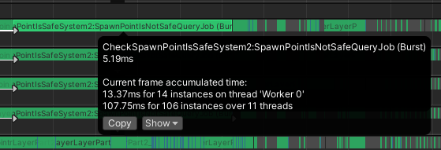
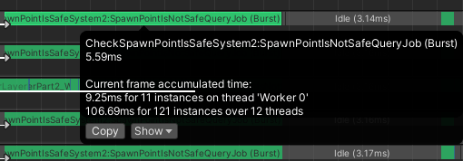
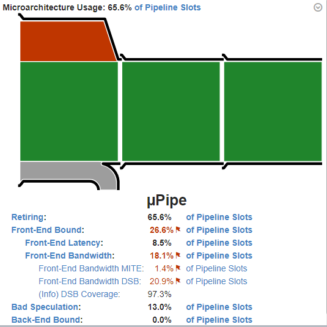

# Optimization Adventures: Part 10 – Find Objects 1

Every software project has that one task which you think should be simple, but
ends up being really expensive. In LSSS, that’s figuring out if a spawner is
allowed to spawn based on whether or not anything else is within some bounding
box. No crazy shapes, no normal vectors or overlap distances. Just simple AABBs
and a single bool result. And yet, here we are, having already spent 4 parts of
this series on this task, and we are about to spend a fifth.

If you haven’t read the previous three Find Pairs adventures or the Build
Collision Layer adventures, then you probably want to go back and read those
first. For the rest of you, you are probably wondering why “find Objects”
instead of “Find Pairs”? Story time!

## A New Algorithm

Back in Find Pairs 3, we were investigating what changes to the underlying
`CollisionLayer` would provide us with the best runtime performance. We ended up
forgoing sentinels or fancy dual axes or z-ordering and just kept the sign
flipping trick. Instead, we found a much bigger impact minimizing the cost of
invoking the Execute method of the `IFindPairsProcessor`.

The reason I wanted to figure out these structural details is because of what I
was planning next, layer queries. From game jams and other personal projects, I
realized that AI and other gameplay logic would be a lot easier to implement if
we could just raycast an entire layer. Well, I always knew that, but the
workarounds were starting to get out-of-hand.

With layer queries, instead of having a bunch of AABBs to test against a bunch
of other AABBs, we only have a single AABB to test against a layer full of
AABBs. And we might want to do this many times over, so preferable this whole
operation takes less than O(n) time where n is the number of AABBs in our layer.
Already, we can possibly skip a bunch of tests by leveraging the multi-box. But
can we do better?

### Walking Forward

Let’s go all the way back to our very first adventure and revisit this image:


First, let’s pretend that [2] is our query AABB and the rest are in our layer.
To detect any overlap with an index higher than `[2]`, we simply need to find
the layer `xmins` greater than `[2].xmin` and sweep along them. As `xmins` are
sorted, this becomes a binary search to find our place, and then a forward
sweep.

Binary search is a well-established algorithm. But if you do some internet
research on it with performance in mind, you’ll quickly learn that most naïve
implementations tend to be overly branchy, and that there are optimizations that
can be made when you really focus on specific requirements. Naturally, somebody
is going to have an optimized implementation for any specific set of
requirements. Our requirements were specifically that we wanted to find the
first index equal or greater than our floating point value for a
non-power-of-two array. Here’s what I ended up finding:

```csharp
// Returns count if nothing is greater or equal
//   The following function is a C# and Burst adaptation of Paul-Virak Khuong and Pat Morin's
//   optimized sequential order binary search: https://github.com/patmorin/arraylayout/blob/master/src/sorted_array.h
//   This code is licensed under the Creative Commons Attribution 4.0 International License (CC BY 4.0)
private static unsafe int BinarySearchFirstGreaterOrEqual(float* array, [AssumeRange(0, int.MaxValue)] int count, float searchValue)
{
    for (int i = 1; i < count; i++)
    {
        Hint.Assume(array[i] >= array[i - 1]);
    }

    var  basePtr = array;
    uint n       = (uint)count;
    while (Hint.Likely(n > 1))
    {
        var half    = n / 2;
        n          -= half;
        var newPtr  = &basePtr[half];

        // As of Burst 1.8.0 prev 2
        // Burst never loads &basePtr[half] into a register for newPtr, and instead uses dual register addressing instead.
        // Because of this, instead of loading into the register, performing the comparison, using a cmov, and then a jump,
        // Burst immediately performs the comparison, conditionally jumps, uses a lea, and then a jump.
        // This is technically less instructions on average. But branch prediction may suffer as a result.
        basePtr = *newPtr < searchValue ? newPtr : basePtr;
    }

    if (*basePtr < searchValue)
        basePtr++;

    return (int)(basePtr - array);
}
```

This algorithm does some clever tricks with the search. Instead of working with
indices, it modifies the pointers directly so that loads can happen more easily.
The whole point of this algorithm was to be branchless except for the loop
control. But as you can see from my lengthy comment, Burst has other ideas.
Here’s what it generates in 1.8.4:

```asm
.cv_inline_site_id 16 within 15 inlined_at 3 66 0
# LayerQuerySweepMethods.cs(82, 1)            while (Hint.Likely(n > 1))
        cmp               r8d, 1
        mov               rdx, rcx
        je                .LBB6_6
        mov               rdx, rcx
        mov               eax, r8d
        jmp               .LBB6_3
        .p2align        4, 0x90
.LBB6_5:
        cmp               eax, 1
        jbe               .LBB6_6
.LBB6_3:
# LayerQuerySweepMethods.cs(84, 1)                var half    = n / 2;
        mov               ebx, eax
        shr               ebx
# LayerQuerySweepMethods.cs(85, 1)                n          -= half;
        sub               eax, ebx
# LayerQuerySweepMethods.cs(93, 1)                basePtr = *newPtr < searchValue ? newPtr : basePtr;
        vucomiss          xmm1, dword ptr [rdx + 4*rbx]
        jbe               .LBB6_5
        lea               rdx, [rdx + 4*rbx]
        jmp               .LBB6_5
.LBB6_6:
# LayerQuerySweepMethods.cs(96, 1)            if (*basePtr < searchValue)
        xor               eax, eax
        vucomiss          xmm1, dword ptr [rdx]
        seta              al
        lea               rdx, [rdx + 4*rax]
# LayerQuerySweepMethods.cs(99, 1)            return (int)(basePtr - array);
        sub               rdx, rcx
        lea               rax, [rdx + 3]
        test              rdx, rdx
        cmovns            rax, rdx
        sar               rax, 2
```

It isn’t that Burst is incapable of using a `cmov` instead of a branch. The
second-to-last instruction outside the loop is a `cmov`. But for whatever
reason, Burst prefers the very tight 9 instruction loop even if it means an
extra branch. Maybe it knows something about modern hardware that we don’t? I’m
not really sure yet. But 9 instructions is very small, so regardless, this is
going to be fast for an initial implementation.

And now our walk forward is this code (hint: q = query):

```csharp
for (int indexInBucket = linearSweepStartIndex; indexInBucket < bucket.count && bucket.xmins[indexInBucket] <= qxmax; indexInBucket++)
{
    if (Hint.Unlikely(math.bitmask(context.qyzMinMax < bucket.yzminmaxs[indexInBucket]) == 0))
    {
        context.result.SetBucketRelativeIndex(indexInBucket);
        processor.Execute(in context.result);
    }
}
```

### The Problem with Backwards

We have found indices in front of our query position along sorted `xmins`. And
we know that every AABB afterwards up to our query `xmax` will be overlapping
along the x axis. However, the same technique does not work in the other
direction. Any one of those AABBs could have an `xmax` greater than our query
`xmin`. The single layer FindPairs handles this by relying on earlier indices to
always pick up later indices. The bipartite FindPairs swaps the roles of the two
layers. Here however, our only option is to iterate over every index smaller and
check.

This is one of the reasons most Physics Engines prefer BVH for broadphase. That
solution naturally accounts for these one-off queries with good algorithmic
complexity. But BVH is also heavily heuristic-dependent in how it groups up
nodes. Heuristics are not my thing. I don’t have the time to experiment on a
best value. I would rather focus on the micro-optimizations. But, we probably
need some data structure to help us out. We need some way to query all AABBs our
query `xmin` is **inside of**. Also, it would be nice if we could leverage much
of our existing data structures. `BuildCollisionLayer` has O(n) complexity, and
I don’t want to ruin that either. And `CollisionLayer` uses O(n) memory and
subdivides it across the different buckets. Unlike back when I wrote the first
version of FindPairs, I now know how to allocate memory dynamically where I
wouldn’t need to conform to this requirement, but allocations are still
expensive and I would prefer to stick to the old approach.

I went on a Google deep-dive, trying to discover any data structure that had
inside-out query capabilities. I ended up on a Reddit thread for a similar-ish
question (albeit totally different use case) where a user suggested an “interval
tree”.

Me: What’s that?

*One Wikipedia page later…*

Me: OH!

### I Like This Tree

On that Wikipedia page, there are two versions of interval trees. The first is
the centered tree, and it isn’t interesting for our use case. The second is the
augmented tree, and this is the one that caught my attention.

First, unlike a BVH, each node in the tree has a real element. Elements aren’t
exclusive to leaf nodes. And this means O(n) space.

Second, it is a binary search tree. There are well-established techniques for
packing these inside arrays. One such approach is an Eytzinger Layout. It keeps
the nodes closer to the root near the front of the array, so for the first few
depths, all the data is in a small region of memory. Those are cache hits.
KA-CHING! It also uses exclusively relies on the index, size, and some math to
navigate to child nodes. That keeps the data smaller.

Third, it is ordered by `xmins`, which we already have in sorted order. Turns
out, you can convert a sorted array into an Eytzinger Layout tree in O(n) time.

And lastly, it has really good algorithmic complexity for finding all
encapsulating intervals for a given value.

With a normal binary search tree ordered by `xmin`, you can eliminate any
right-side subtree of a node whose `xmin` is greater than our query `xmin`.
Where the interval tree goes a step further is that it also maintains a
`subteeXmax`. If our query `xmin` is greater than that for a node, than that
node’s entire subtree can be eliminated. The asymmetry can be a little tricky to
reason about, but the internet has rock-solid examples we can leverage to make
it work.

I did not expect to find something that checks all the boxes, but here we are.
This is the perfect fit! Let’s implement it.

Here’s our node structure, which fits perfectly into a 128 bit SIMD register:

```csharp
internal struct IntervalTreeNode
{
    public float xmin;
    public float xmax;
    public float subtreeXmax;
    public int   bucketRelativeBodyIndex;
}
```

And here’s the builder code which I borrowed from the same people who designed
the fast binary search implementation:

```csharp
//   Unless otherwise specified, the following functions are C# adaptations of Paul-Virak Khuong and Pat Morin's
//   Eytzinger Array builder: https://github.com/patmorin/arraylayout/blob/master/src/eytzinger_array.h
//   This code is licensed under the Creative Commons Attribution 4.0 International License (CC BY 4.0)
private static void BuildEytzingerIntervalTree(NativeArray<IntervalTreeNode> tree, NativeArray<int> sortedSrcIndices, NativeArray<float2> srcXminMaxs)
{
    var builder = new EytzingerIntervalTreeBuilder(tree, sortedSrcIndices, srcXminMaxs);
    builder.Build();
}

private struct EytzingerIntervalTreeBuilder
{
    private NativeArray<IntervalTreeNode> nodesToPopulate;
    private NativeArray<int>              sortedSrcIndices;
    private NativeArray<float2>           srcXminMaxs;

    public EytzingerIntervalTreeBuilder(NativeArray<IntervalTreeNode> tree, NativeArray<int> sortedSrcIndices, NativeArray<float2> srcXminMaxs)
    {
        this.nodesToPopulate  = tree;
        this.sortedSrcIndices = sortedSrcIndices;
        this.srcXminMaxs      = srcXminMaxs;
    }

    public void Build()
    {
        BuildEytzingerIntervalTreeRecurse(0, 0);

        PatchSubtreeMaxResurse(0);
    }

    private int BuildEytzingerIntervalTreeRecurse(int bucketRelativeIndex, uint treeIndex)
    {
        // It is for this condition that we need treeIndex to be a uint, which can store 2 * (int.MaxValue - 1) + 2 without overflow.
        // If code reaches beyond this point, it is safe to cast treeIndex to an int.
        if (treeIndex >= nodesToPopulate.Length)
            return bucketRelativeIndex;

        bucketRelativeIndex = BuildEytzingerIntervalTreeRecurse(bucketRelativeIndex, 2 * treeIndex + 1);

        var minmax                      = srcXminMaxs[sortedSrcIndices[bucketRelativeIndex]];
        nodesToPopulate[(int)treeIndex] = new IntervalTreeNode
        {
            xmin                    = minmax.x,
            xmax                    = minmax.y,
            subtreeXmax             = minmax.y,
            bucketRelativeBodyIndex = bucketRelativeIndex
        };
        bucketRelativeIndex++;

        bucketRelativeIndex = BuildEytzingerIntervalTreeRecurse(bucketRelativeIndex, 2 * treeIndex + 2);

        return bucketRelativeIndex;
    }

    // This function is unique to Latios Framework
    // Todo: There is likely a more cache-friendly way to iterate this tree and do this work
    private float PatchSubtreeMaxResurse(uint treeIndex)
    {
        if (treeIndex >= nodesToPopulate.Length)
            return 0f;

        float leftTreeMax  = PatchSubtreeMaxResurse(2 * treeIndex + 1);
        float rightTreeMax = PatchSubtreeMaxResurse(2 * treeIndex + 2);

        var node                        = nodesToPopulate[(int)treeIndex];
        node.subtreeXmax                = math.max(math.max(leftTreeMax, rightTreeMax), node.subtreeXmax);
        nodesToPopulate[(int)treeIndex] = node;

        return node.subtreeXmax;
    }
}
```

I will save the deep-dive on this construction algorithm for perhaps another
adventure when we optimize it. But there are plenty of online resources to
explore if you want to learn more.

And here’s the search at runtime:

```csharp
private struct AabbSweepRecursiveContext
{
    public FindObjectsResult     result;
    public readonly BucketSlices bucket;
    public float4                qyzMinMax;
    public float                 qxmin;

    public AabbSweepRecursiveContext(in FindObjectsResult result, in BucketSlices bucket, float4 qyzMinMax, float qxmin)
    {
        this.result    = result;
        this.bucket    = bucket;
        this.qyzMinMax = qyzMinMax;
        this.qxmin     = qxmin;
    }
}

private static void SearchTree<T>(uint currentIndex, ref AabbSweepRecursiveContext context, ref T processor) where T : struct, IFindObjectsProcessor
{
    if (currentIndex >= context.bucket.count)
        return;

    var node = context.bucket.intervalTree[(int)currentIndex];
    if (context.qxmin >= node.subtreeXmax)
        return;

    SearchTree(GetLeftChildIndex(currentIndex), ref context, ref processor);

    if (context.qxmin < node.xmin)
        return;

    if (context.qxmin > node.xmin && context.qxmin <= node.xmax)
    {
        if (Hint.Unlikely(math.bitmask(context.qyzMinMax < context.bucket.yzminmaxs[node.bucketRelativeBodyIndex]) == 0))
        {
            context.result.SetBucketRelativeIndex(node.bucketRelativeBodyIndex);
            processor.Execute(in context.result);
        }
    }

    SearchTree(GetRightChildIndex(currentIndex), ref context, ref processor);
}

public static uint GetLeftChildIndex(uint currentIndex) => 2 * currentIndex + 1;
public static uint GetRightChildIndex(uint currentIndex) => 2 * currentIndex + 2;
public static uint GetParentIndex(uint currentIndex) => (currentIndex - 1) / 2;
```

You can see the asymmetric culling in effect here. The first check over the
subtreeXmax eliminates all recursion. If that check passes, we recurse left. And
afterwards we have our min bounds check to eliminate further exploration of the
right side. It is only after these checks that we perform our AABB test and
explore the right side of any subtree.

You’ll also notice that there is a `context` object. This allows for passing a
bunch of relevant data around by ref so that we aren’t copying that data with
every recursive iteration.

And that’s the gist of it. We can query an AABB against a `CollisionLayer`, and
from that we can then make shorthands for raycasts, collider casts, and distance
queries. I implemented all of that, and then Entities 1.0 experimental dropped.
Everything was on fire for 7 weeks, but then I finally released 0.6.

### Awkward Confession

I never tested the algorithm. Sure, I implemented it in LSSS and knew that
construction doesn’t crash or cause other errors. But the query in LSSS
currently resides in an unused codepath meant for structural obstacles that the
AI doesn’t know how to avoid. I was not prepared for how crazy the 1.0 version
of Entities was going to be. And when I released 0.6, it released already on
life support. I assumed that the ugly state of everything meant that people
would maybe clone it to toy around with Kinemation and maybe play with the other
Psyshock APIs where there are actual usage examples. Surely no one would want to
use all Psyshock had to offer, right?

I was very, *very* wrong.

A couple months after release, I was still trying to put out the Transform
System fires when all of a sudden several users on Discord all decided to play
around with Psyshock, including layer queries. As soon as I read their posts and
messages, I began mentally preparing myself for an onslaught of bug reports
related to layer queries.

But nothing happened…

Well, stuff happened. Those users had complaints, but not with layer queries.
They weren’t the silent types, but yet had no complaints at all with layer
queries, which only means one thing:

Layer queries are working!

Phew.

I guess it makes sense, because most of the code I borrowed from the internet,
and the algorithms are well-established tried-and-tested general algorithms plus
a couple of AABB tests which I have plenty of experience with by this point.
Even still, I don’t recommend doing this, and I apologize to everyone for
handling things this way. Entities 1.0 has been an absolute rollercoaster, a
fiery free-falling rollercoaster that nearly wrecked my sanity. But now that
things are stabilizing and I once again find myself trying to make LSSS as fast
as possible, I have a new use case to test out this algorithm.

### Target Lock-On

Currently, spawn point safety checking is done by a bunch of FindPairs
operations on all the types of objects in the game. A spawn point only needs a
single hit to register as unsafe, which means any further tests against it are
unnecessary. With FindPairs, there wasn’t a good way to filter out spawn points
that are already hit. But with this new layer query algorithm now called
FindObjects, a spawn point can choose on its own to query or not. Perhaps we can
eliminate a lot of unnecessary queries by using FindObjects instead.

## Initial Replacement

First, here’s the original jobs and processors for our spawn point safety
system:

```csharp
[BurstCompile]
partial struct SpawnPointResetFlagsJob : IJobEntity
{
    public void Execute(ref SafeToSpawn safeToSpawn) => safeToSpawn.safe = true;
}

//Assumes A is SpawnPoint
struct SpawnPointIsNotSafeProcessor : IFindPairsProcessor
{
    public PhysicsComponentLookup<SafeToSpawn> safeToSpawnLookup;

    public void Execute(in FindPairsResult result)
    {
        // No need to check narrow phase. AABB check is good enough
        safeToSpawnLookup[result.entityA] = new SafeToSpawn { safe = false };
    }
}

struct SpawnPointsAreTooCloseProcessor : IFindPairsProcessor
{
    public PhysicsComponentLookup<SafeToSpawn> safeToSpawnLookup;

    public void Execute(in FindPairsResult result)
    {
        safeToSpawnLookup[result.entityA] = new SafeToSpawn { safe = false };
        safeToSpawnLookup[result.entityB]                          = new SafeToSpawn { safe = false };
    }
}
```

If you have experience with Psyshock, you might wonder if it would be faster to
cache the bools by body index in a `NativeArray<bool>` and then propagate the
results later. Surprisingly, no. It doesn’t have that kind of benefit. Pairs are
very infrequent with this use case compared to the number of tests FindPairs
performs.

However, I did end up using such an array for the new technique. The main reason
for this is that I wanted to try iterating over the spawn points spatially in
their `CollisionLayer` rather than by ECS chunks. I expect adjacent spawn points
in the `CollisionLayer` will need to test against some the same AABBs in the
other `CollisionLayers`, and so iterating this way improves cache reuse. Even
then, I could still use lookups and probably be fine, but in this case the
`NativeArray<bool>` was simpler to reason about.

```csharp
[BurstCompile]
partial struct ClearHitsArrayJob : IJobFor
{
    public NativeArray<bool> hitArray;
    public void Execute(int index) => hitArray[index] = false;
}

struct SpawnPointsAreTooCloseProcessor : IFindPairsProcessor
{
    [NativeDisableParallelForRestriction] public NativeArray<bool> hitArray;

    public void Execute(in FindPairsResult result)
    {
        hitArray[result.bodyIndexA] = true;
        hitArray[result.bodyIndexB] = true;
    }
}

[BurstCompile]
struct SpawnPointIsNotSafeQueryJob : IJobFor
{
    struct TestAnyInLayerProcessor : IFindObjectsProcessor
    {
        public bool hit;

        public void Execute(in FindObjectsResult result)
        {
            hit = true;
        }
    }

    public NativeArray<bool>         hitArray;
    [ReadOnly] public CollisionLayer spawnPointLayer;
    [ReadOnly] public CollisionLayer otherLayer;

    public void Execute(int index)
    {
        if (hitArray[index])
            return;

        var aabb        = spawnPointLayer.GetAabb(index);
        hitArray[index] = Physics.FindObjects(in aabb, in otherLayer, new TestAnyInLayerProcessor()).RunImmediate().hit;
    }
}

[BurstCompile]
struct WriteSpawnPointStatusesJob : IJobFor
{
    [ReadOnly] public NativeArray<bool>                                       hitArray;
    [ReadOnly] public CollisionLayer                                          spawnPointLayer;
    [NativeDisableParallelForRestriction] public ComponentLookup<SafeToSpawn> lookup;

    public void Execute(int index)
    {
        var entity                                  = spawnPointLayer.colliderBodies[index].entity;
        var hit                                     = hitArray[index];
        lookup.GetRefRW(entity, false).ValueRW.safe = !hit;
    }
}
```

You’ll notice that we are still keeping around FindPairs for testing spawn
points against other spawn points. Given that’s the first test, we want to use
the more efficient algorithm (more on that in a sec).



Yikes! This increased frame times from 65 ms to 70 ms. That’s half of the
performance we gained from the last adventure. What happened?

As I mentioned earlier, FindObjects is a less efficient algorithm compared to
FindPairs. With FindPairs, all x-axis interval overlaps can be tested one after
another linearly in memory. With FindObjects, we have to perform the additional
steps of the binary search and the interval tree walk. Those involve jumping
around more in memory and are naturally going to be more expensive. The problem
right now is that we aren’t eliminating enough spawn points from the tests to
compensate.

## Skip the Animation

Seeing things get worse isn’t the end of the picture. This new paradigm presents
new potential. We now have the ability to conditionally choose to test spawn
points. We are already skipping spawn points that have previously detected an
AABB hit, but perhaps there are spawn points that don’t need to be tested at
all?

Indeed, there are.

Some spawn points might be in the middle of a spawn animation. Those don’t need
to be tested.

This does change up the behavior a little, because now spawn points might have
invalid safety statuses for some frames, but we can assume that such statuses
won’t ever be used on those frames either, so it all works out. Due to how spawn
animations work, we can actually rely on a single value of
`SpawnTimes.pauseTime` to provide us everything we need to know.

Here’s the new job to replace `ClearHitsArrayJob`:

```csharp
[BurstCompile]
partial struct InitHitsArrayJob : IJobFor
{
    [ReadOnly] public ComponentLookup<SpawnTimes> lookup;
    [ReadOnly] public CollisionLayer spawnLayer;
    public NativeArray<bool> hitArray;
    public void Execute(int index) => hitArray[index] = lookup[spawnLayer.colliderBodies[index].entity].pauseTime > 0f;
}
```

And Unity isn’t loading the subscene…

And now Unity crashed. Lovely.

And now I have to Burst-compile everything twice, once with safety checks
enabled, and again with them disabled just to profile this stupid simple change.
If you ever wondered why the 0.7 releases were taking so long, a lot of it has
to do with these two crippling bugs. Oh well, it seems to be up now.

Nope. Totally broken.

Mission 1 works, but I can’t get Mission 5 to load anymore. No idea why.

Ok. Seems I corrupted Burst somehow.

Alright. Finally got it profiled. What? No change in performance? What happened?

After adding some debug logs, I discovered that only 4% of the spawn points were
being culled early by animations, and that wasn’t a big enough delta to show up
in tests. So with this logging, how many hits are bullets exclusively
responsible for? And how many are FindObjects responsible for?

Not a lot. In this stress test, there are 25 000 spawn points. Between 1000 and
2500 are locked in animation. In the collision layer self-test, the total hits
accumulated typically reaches about 16 000, and only about 2000 more are added
by the FindObjects algorithm, leaving 7000 spawn points “safe” each frame.

FindObjects doesn’t currently have a way of quitting early once a valid hit is
found. Adding it would have seemed like a sane optimization. But looking at the
numbers, that at most would have improved performance by 1.2X, and we need a
full 2x improvement just to break even with the full FindPairs approach. A third
of the entities taking over twice as long is not a good look for FindObjects.
Fortunately, this was only the first implementation, and there are likely
options for improvement.

## Assembling a Case

At this point, without redesigning LSSS, our high-level optimization options are
dwindling. Which means it is time to look at the assembly. The nice thing is
that this job is actually fairly small, so it is easy to find things in the
Burst Inspector.

We start out with a few dozen instructions that identify which buckets we need
to search in. And then we are met with 245 lines of mov instructions.

Wait, what?

Yeah. Turns out that twice, we copy the `CollisionLayer` struct, and once we
also copy the `BucketSlices` struct. And that’s per bucket! For small queries,
we may want to capture pointers to these structs instead in the context objects
that use them.

Next, we have the binary search which we’ve already discussed, followed by this
forward sweep:

```asm
        vucomiss          xmm0, dword ptr [r14 + 4*rbx]
        jb                .LBB4_39
# LayerQuerySweepMethods.cs(54, 1)                if (Hint.Unlikely(math.bitmask(context.qyzMinMax < bucket.yzminmaxs[indexInBucket]) == 0))
        vcmpltps          xmm2, xmm1, xmmword ptr [rdx]
        vmovmskps         ecx, xmm2
        test              ecx, ecx
        je                .LBB4_37
.LBB4_38:
# LayerQuerySweepMethods.cs(52, 1)            for (int indexInBucket = linearSweepStartIndex; indexInBucket < bucket.count && bucket.xmins[indexInBucket] <= qxmax; indexInBucket++)
        inc               rbx
        add               rdx, 16
        cmp               rbx, rax
        jl                .LBB4_35
```

10 instructions is not bad. We could maybe get rid of the increment instruction
by switching array indexing into pointers. But that isn’t going to net us the
type of performance wins we are looking for.

Next is our recursive tree search. There are 75 instructions if I counted
correctly.

```asm
.seh_proc "Latios.Psyshock.LayerQuerySweepMethods.SearchTree<Lsss.CheckSpawnPointIsSafeSystem2.SpawnPointIsNotSafeQueryJob.TestAnyInLayerProcessor>(uint currentIndex, ref Latios.Psyshock.LayerQuerySweepMethods.AabbSweepRecursiveContext context, ref Lsss.CheckSpawnPointIsSafeSystem2.SpawnPointIsNotSafeQueryJob.TestAnyInLayerProcessor processor) -> void_930e313844f708dd8e72e0cb41431524 from Latios.Psyshock, Version=0.0.0.0, Culture=neutral, PublicKeyToken=null@@24"
        push              rbp
        .seh_pushreg rbp
.Ltmp46:
        push              r14
        .seh_pushreg r14
        push              rsi
        .seh_pushreg rsi
        push              rdi
        .seh_pushreg rdi
        push              rbx
        .seh_pushreg rbx
        sub               rsp, 64
        .seh_stackalloc 64
        lea               rbp, [rsp + 64]
        .seh_setframe rbp, 64
        vmovaps           xmmword ptr [rbp - 16], xmm7
        .seh_savexmm xmm7, 48
        vmovaps           xmmword ptr [rbp - 32], xmm6
        .seh_savexmm xmm6, 32
        .seh_endprologue
        cmp               dword ptr [rdx + 696], ecx
        jbe               .LBB5_7
        mov               r14, r8
        mov               rdi, rdx
        mov               ebx, ecx
        jmp               .LBB5_2
        .p2align        4, 0x90
.LBB5_6:
.Ltmp47:
        .cv_inline_site_id 24 within 23 inlined_at 1 141 0
# LayerQuerySweepMethods.cs(145, 1)        public static uint GetRightChildIndex(uint currentIndex) => 2 * currentIndex + 2;
        add               ebx, 2
.Ltmp48:
# LayerQuerySweepMethods.cs(120, 1)            if (currentIndex >= context.bucket.count)
        cmp               ebx, dword ptr [rdi + 696]
        jae               .LBB5_7
.LBB5_2:
# LayerQuerySweepMethods.cs(123, 1)            var node = context.bucket.intervalTree[(int)currentIndex];
        mov               rax, qword ptr [rdi + 832]
.Ltmp49:
        movsxd            rcx, ebx
        shl               rcx, 4
.Ltmp50:
# LayerQuerySweepMethods.cs(124, 1)            if (context.qxmin >= node.subtreeXmax)
        vmovss            xmm0, dword ptr [rdi + 1000]
        vucomiss          xmm0, dword ptr [rax + rcx + 8]
        jae               .LBB5_7
        .cv_inline_site_id 25 within 23 inlined_at 1 127 0
# LayerQuerySweepMethods.cs(144, 1)        public static uint GetLeftChildIndex(uint currentIndex) => 2 * currentIndex + 1;
        vmovss            xmm7, dword ptr [rax + rcx]
        vmovss            xmm6, dword ptr [rax + rcx + 4]
        mov               esi, dword ptr [rax + rcx + 12]
.Ltmp51:
        lea               ecx, [rbx + rbx + 1]
.Ltmp52:
# LayerQuerySweepMethods.cs(127, 1)            SearchTree(GetLeftChildIndex(currentIndex), ref context, ref processor);
        mov               rdx, rdi
        mov               r8, r14
        call              "Latios.Psyshock.LayerQuerySweepMethods.SearchTree<Lsss.CheckSpawnPointIsSafeSystem2.SpawnPointIsNotSafeQueryJob.TestAnyInLayerProcessor>(uint currentIndex, ref Latios.Psyshock.LayerQuerySweepMethods.AabbSweepRecursiveContext context, ref Lsss.CheckSpawnPointIsSafeSystem2.SpawnPointIsNotSafeQueryJob.TestAnyInLayerProcessor processor) -> void_930e313844f708dd8e72e0cb41431524 from Latios.Psyshock, Version=0.0.0.0, Culture=neutral, PublicKeyToken=null@@24"
# LayerQuerySweepMethods.cs(129, 1)            if (context.qxmin < node.xmin)
        vmovss            xmm0, dword ptr [rdi + 1000]
        vucomiss          xmm7, xmm0
        ja                .LBB5_7
# LayerQuerySweepMethods.cs(132, 1)            if (context.qxmin > node.xmin && context.qxmin <= node.xmax)
        add               ebx, ebx
        vucomiss          xmm0, xmm7
        jbe               .LBB5_6
        vucomiss          xmm6, xmm0
        jb                .LBB5_6
# LayerQuerySweepMethods.cs(134, 1)                if (Hint.Unlikely(math.bitmask(context.qyzMinMax < context.bucket.yzminmaxs[node.bucketRelativeBodyIndex]) == 0))
        movsxd            rax, esi
        vmovups           xmm0, xmmword ptr [rdi + 984]
        mov               rcx, qword ptr [rdi + 784]
.Ltmp53:
        shl               rax, 4
.Ltmp54:
        vcmpltps          xmm0, xmm0, xmmword ptr [rcx + rax]
        vmovmskps         eax, xmm0
        test              eax, eax
        jne               .LBB5_6
.Ltmp55:
        .cv_inline_site_id 26 within 23 inlined_at 1 136 0
# Physics.FindObjects.cs(105, 1)            m_bodyIndexRelative = index;
        mov               dword ptr [rdi + 672], esi
.Ltmp56:
        .cv_inline_site_id 27 within 23 inlined_at 1 137 0
        .cv_inline_site_id 28 within 27 inlined_at 7 0 0
# CheckSpawnPointIsSafeSystem.cs(210, 1)                    hit = true;
        mov               byte ptr [r14], 1
        jmp               .LBB5_6
.Ltmp57:
.LBB5_7:
        vmovaps           xmm6, xmmword ptr [rbp - 32]
        vmovaps           xmm7, xmmword ptr [rbp - 16]
        add               rsp, 64
        pop               rbx
        pop               rdi
        pop               rsi
        pop               r14
        pop               rbp
        ret
```

A third of that is call overhead, and the rest only executes on average half the
time because of branches. Because this method is recursive, it gets called A
LOT. It is reasonable to assume we can make this faster.

## Please Stop Calling

Recursion seems to be very expensive, and Burst doesn’t know how to optimize it.
But we can. We know that this is a balanced binary search tree with a maximum
depth of 32, and so there can only be 32 stack frames in flight. Let’s emulate
that stack ourselves, using a loop.

First, we need a stack that includes the minimal state we need for a given
iteration. That’s simply the `currentIndex` argument and some tracker for where
we should resume execution from when we pretend to resume from a call.

```csharp
struct StackFrame
{
    public uint currentIndex;
    public uint checkpoint;
}
```

Setup then looks like this:

```csharp
uint currentFrameIndex = 0;
StackFrame* stack = stackalloc StackFrame[32];
stack[0] = new StackFrame { currentIndex = _currentIndex, checkpoint = 0 };

while (currentFrameIndex < 32)
{
    var currentFrame = stack[currentFrameIndex];
```

I added a leading underscore to the real argument in this looping version to
prevent myself from accidentally using it instead of the one in the stack.

One tricky piece is that I am using an unsigned integer for `currentFrameIndex`.
Experience tells me that Burst will be able to use addressing tricks with this,
and I am relying on unsigned integer underflow to exit the loop. This also means
that if something bad were to happen that would cause a stack overflow, the loop
will also exit. Two checks for the price of one!

A return statement becomes this:

```csharp
currentFrameIndex--;
continue;
```

A recursive call looks like this:

```csharp
currentFrame.checkpoint = 1;
stack[currentFrameIndex] = currentFrame;
currentFrameIndex++;
stack[currentFrameIndex].currentIndex = GetLeftChildIndex(currentFrame.currentIndex);
stack[currentFrameIndex].checkpoint = 0;
continue;
```

And all code since the start or last call up and to the invocation of the next
gets wrapped in an `if` block that checks the checkpoint number:

`if (currentFrame.checkpoint == 0)`

Before we profile it, let’s make sure Burst doesn’t do anything stupid with this
code.

The mov instructions…

They’re gone…

And the new method is inlined…

BURST! WHAT DID YOU DO?

Hang on, none of this may even matter because our data could be too randomly
accessed since we are working with a tree, and theres a whole mess of branch
instructions in the inlined assembly that are probably really hard to predict.

So did it matter?



Nope.

Alright. Time for VTune.

## A Different Song



…

…?

What?

Yeah. So turns out I was nowhere near close to figuring out what was happening.
We are extremely bottlenecked by raw execution of `SearchTreeLooped`. There’s a
little bit of the frontend struggling to keep up, but branch prediction and data
cache are not problems at all apparently, and our utilization rivals FindPairs.

So why is this so slow?

Instruction count.

Turns out, when navigating the tree, we end up touching a lot of elements that
aren’t intervals we care about but have children we do care about. That adds up.
On top of that, the loop isn’t nearly as tight as FindPairs, and when you put it
all together, you end up with something that is about 6 times slower.

How do we reduce the instructions?

We need to change how our tree works. Right now, our interval tree is a binary
search tree and we are evaluating one node at a time. Aside from our AABB test,
there are no SIMD instructions involved. And Burst has worked really hard to
keep the instructions that do exist down to just what is necessary. There might
still be headroom for a couple of improvements, but not large enough to cover
our performance gap. If we want less total instructions executed, we need to
vectorize our tree.

That will have to wait for another adventure with a different use case.
FindPairs has better improvement potential for this problem. Think about it, if
we had a `CollisionLayer` that only had the third of the spawn points that
needed testing after the layer self-test, then we would likely see a 3X increase
in overall performance. Whereas even if FindObjects were to be made 4X faster,
it would still only be 2X faster overall. Plus there’s still the potential for a
dual-axis approach I want to try.

## Conclusions

Wait, conclusions? Did we even optimize anything?

Yes, actually.

FindObjects compiled code is now three times smaller. Our use case didn’t really
see the benefit of that, because most of that code only runs once per query and
we only had a few thousand queries that each had tons of iterations against a
very large `CollisionLayer`. But if we had a lot more queries on a smaller
`CollisionLayer`, the story may have been very different.

Right now, I don’t have a good test case for FindObjects. So if you do and want
more performance, feel free to send a project my way.

There’s a few things we learned though. First, making stuff inline-able can make
a bunch of struct copies disappear. Second, recursive function calls have much
less overhead than I thought, because even though we got rid of them, we still
didn’t see any speedup. And third, binary trees have high iteration costs.

Oh. And I guess I’ve tested FindObjects now. Only 8 months late!

I appreciate you all hanging around for 10 of these adventures. And I’d love to
know your thoughts on where I should explore next on the Latios Framework
Discord!

## Try It Yourself

You can find the relevant code for all of this in LSSS. Both old and new
versions of the code are left there, so you can explore the different
techniques.
