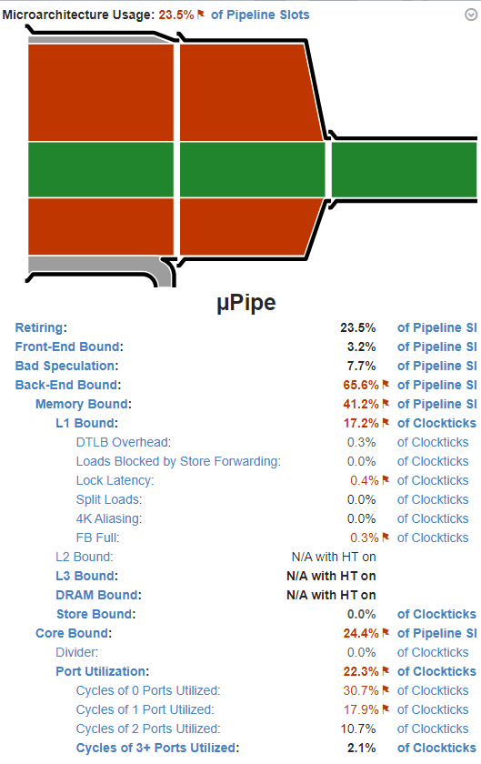
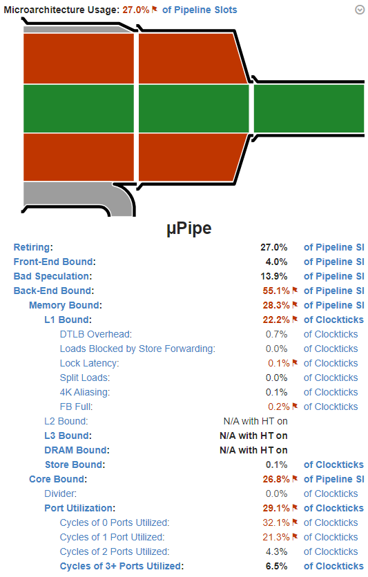

# Optimization Adventures: Part 11 – Find Pairs 4

Has your company ever rolled out a new policy where now it takes you twice as
long to get half as much done? That’s 4 times slower, and this is the 4th
episode of our battle to make Find Pairs as fast as we can.

We’re far enough into the series where you don’t need any more of an
introduction. If your memory needs refreshing, perhaps it is worth going back
and revisiting the previous articles. But otherwise, let’s jump in where we last
left off, and explore linked lists.

## Linked Lists Dual Sweeping

The idea of this is simple, instead of using `tzcnt` iteration to find the AABBs
within the intervals of two independent axes, we build and maintain a linked
list to iterate instead. This way, we can cut way down on our inner loop, to the
point where the only difference from our single-axis inner loop our SIMD float4
is loaded indirectly instead of directly from a counter each iteration.

We still use a bit array to mark bits of x-axis overlaps as we traverse each
AABB, with the bits being ordered by the z-axis. And we still use these bits to
find our starting location in the linked list. But the linked list itself is an
array parallel to the z-bits, with each element containing the x-axis data index
as well as an index to the next node. Unlike the previous algorithms, I decided
to split out the interval management and linked list into a separate struct to
make the code a little more understandable. Here’s what the actual loop looks
like now:

```csharp
var intervalSet = new IntervalSet(zBits.AsArray(), minYZmaxYZsFlipped.Length);

for (int i = 0; i < xs.Length; i++)
{
    if (xs[i] < minYZmaxYZsFlipped.Length)
    {
        int currentIndex = (int)xs[i];
        var currentYZ    = -minYZmaxYZsFlipped[currentIndex].zwxy;
        var range        = zRanges[currentIndex];
        var enumerator   = new IntervalSet.Enumerator(in intervalSet, range.min, range.max - 1);

        while (enumerator.IsValid())
        {
            var otherIndex = enumerator.Current;
            Hint.Assume(otherIndex >= 0);
            if (Hint.Unlikely(math.bitmask(currentYZ < minYZmaxYZsFlipped[otherIndex]) == 0))
            {
                overlaps.Add(new EntityPair(entities[currentIndex], entities[otherIndex]));
            }
            enumerator.Advance();
        }

        intervalSet.Add(range.index, currentIndex);
    }
    else
    {
        var range = zRanges[(int)(xs[i] - minYZmaxYZsFlipped.Length)];
        intervalSet.Remove(range.index);
    }
}
```

This new `IntervalSet` structure has a few fancy methods. `Add()`, `Remove()`,
and the `Enumerator` constructor are all doing really complex bit manipulations
to keep the linked list intact. But it is `IsValid()` and `Advance()` that live
in the inner loop. Here’s what they look like:

```csharp
public bool IsValid()
{
    Hint.Assume(linkIndex >= 0);
    return linkIndex <= maxZIndex;
}
public void Advance()
{
    Hint.Assume(linkIndex >= 0);
    linkIndex = links[linkIndex].nextZ;
    Hint.Assume(linkIndex >= 0);
}
public int Current => links[linkIndex].xIndex;
```

Really simple and small stuff here. And this is what Burst has to show for it:

```asm
.LBB13_24:
.Ltmp397:
# FindPairsSimplified.cs(2137, 1)                        if (Hint.Unlikely(math.bitmask(currentYZ < minYZmaxYZsFlipped[otherIndex]) == 0))
        mov               edi, eax
        mov               eax, dword ptr [r14 + 8*rdi]
.Ltmp398:
        mov               rcx, rax
        shl               rcx, 4
.Ltmp399:
        vcmpltps          xmm0, xmm7, xmmword ptr [r13 + rcx]
        vmovmskps         ecx, xmm0
        test              ecx, ecx
        je                .LBB13_25
.LBB13_31:
.Ltmp400:
# FindPairsSimplified.cs(2350, 1)                    return linkIndex <= maxZIndex;
        mov               eax, dword ptr [r14 + 8*rdi + 4]
.Ltmp401:
        cmp               eax, r12d
.Ltmp402:
# FindPairsSimplified.cs(2133, 1)                    while (enumerator.IsValid())
        jle               .LBB13_24
        jmp               .LBB13_32
.LBB13_25:
```

Only 11 instructions in this loop! Not bad!

But to be fair, there’s some low-hanging fruit. That `shl` (shift-left) by 4 is
because we need to convert an index into a byte addressing a 16-byte SIMD
float4. x86 only allows an 8x scaling directly in the address loading, so we
need the shift operator. If we were to store all our link indices as double
their actual values, we could probably shave off that instruction and the one
before which would bring us down to 9 instructions. But before we do that, we
should probably see if this even got us close to our performance goals.

## A Big Bad Bottleneck

Here’s the results for 2000 and 5000:

```
Sweep_2000 (0.508s)
---
NaiveSweep 4896.80 Microseconds
Bool4Sweep 1587.50 Microseconds
LessNaiveSweep 2980.60 Microseconds
FunnySweep 1496.80 Microseconds
BetterSweep 2717.60 Microseconds
SimdSweep 1880.20 Microseconds
RearrangedSweep 643.00 Microseconds
SoaSweep 635.30 Microseconds
SoaShuffleSweep 627.80 Microseconds
OptimalOrderSweep 507.30 Microseconds
*FlippedSweep 502.80 Microseconds
SentinelSweep 423.00 Microseconds
MortonNaiveSweep 1638.50 Microseconds
BatchSweep 1007.90 Microseconds
DualSweep 1207.70 Microseconds
DualSweepCondensed 1008.50 Microseconds
DualSweepOptimized 863.50 Microseconds
UnrolledSweepPoor 635.80 Microseconds
UnrolledSweep 492.40 Microseconds
UnrolledSweep2 470.70 Microseconds
UnrolledSweep3 415.70 Microseconds
UnrolledSweep4 428.50 Microseconds
DualSweepBranchless 840.30 Microseconds
*DualSweepLinked 737.20 Microseconds
Sweep_5000 (0.655s)
---
NaiveSweep 28.59 Milliseconds
Bool4Sweep 6.32 Milliseconds
LessNaiveSweep 13.40 Milliseconds
FunnySweep 8.02 Milliseconds
BetterSweep 6.18 Milliseconds
SimdSweep 4.82 Milliseconds
RearrangedSweep 3.65 Milliseconds
SoaSweep 3.64 Milliseconds
SoaShuffleSweep 3.73 Milliseconds
OptimalOrderSweep 3.16 Milliseconds
*FlippedSweep 2.94 Milliseconds
SentinelSweep 2.60 Milliseconds
MortonNaiveSweep 8.78 Milliseconds
BatchSweep 5.37 Milliseconds
DualSweep 6.68 Milliseconds
DualSweepCondensed 5.57 Milliseconds
DualSweepOptimized 4.65 Milliseconds
UnrolledSweepPoor 3.54 Milliseconds
UnrolledSweep 2.74 Milliseconds
UnrolledSweep2 2.66 Milliseconds
UnrolledSweep3 2.44 Milliseconds
UnrolledSweep4 2.28 Milliseconds
DualSweepBranchless 4.60 Milliseconds
*DualSweepLinked 4.77 Milliseconds
```

This version is competitive with our previous dual-axes designs, and in the 2000
case pulling off a steady lead. However, we’re still nearly twice as slow as our
single-axis algorithm. And the relative regression compared to the other
dual-axes approach is worrying. But, this is in spite of cutting our instruction
count in half, which was the bottleneck with our previous attempts. So what is
the deal this time?



Well, that certainly explains a lot. Turns out that with only a 50% reduction,
our `float4` loads and linked list iteration really start to look like random
accesses once we get into the couple of thousands of boxes, which is also at the
point where our setup processes start to be negligible. This is why we start to
see a regression relative to the other dual-axes methods when jumping from 2000
to 5000. The memory required to manage the linked list is putting even more
cache pressure.

However, it isn’t all bad news. Remember that our dual-axes algorithms were
requiring about 140 billion instructions to finish. This algorithm is at 73
billion, which is even slightly less than `UnrolledSweep4`! The algorithmic
efficiency of this algorithm is definitely there, and even strongly noticeable
at just 50% work reduction. There’s one thing left to try to reign things in at
the microarchitecture level.

## Cache Compression FTW?

Right now, our linked list exists along the z-axis, and we have to access 8
bytes for the x-axis index plus the next node. Besides that being 8 bytes of
memory we have to iterate over in our inner loop, the other big issue with this
approach is that these nodes are extremely scattered relative to the x-axis.
Along the x-axis, our candidates are at least somewhat condensed as we iterate.
Not as condensed as our single-axis algorithm, but still probably a lot better
than z.

But should this even matter? It isn’t like we are iterating through thousands of
elements in the inner loop. Shouldn’t there be enough temporal coherency along
the z-axis?

That’s what I thought too, but apparently it is not enough. My guess is that
each node is spaced roughly a cache line apart and consequently the cost of each
node might be an order of magnitude of cache data more than what it actually
needs. And maybe, just maybe, the fix is as simple as storing the linked list
nodes relative to the x-axis as 4-byte nodes. This does require a change to our
stop criterion, so let’s figure that out.

Our indices in our linked list now index the x-axis, so our stop criterion needs
to also be an index in the x-axis. We want to keep our stop criterion as a
single comparison, as this goes in the inner loop. However, we still insert and
remove elements in our linked list using z-axis order, which means along our
x-axis space, indices will both increase and decrease as we traverse.

This means we have to find the first node that is outside our z-interval. To do
this, I instead search for the last node in the z-interval, get its x-indexed
node, and then get the index for the next node along the x-axis. The consequence
of this is that I am now doing two bit searches in the outer loop instead of
one, but it does clean up the inner loop iteration. Also, I just set the max
threshold and start index to both 0 when the interval has no set bits.

Another gotcha with this new rewrite was getting rid of the shifts. As I
mentioned earlier, I can store double each index to help with x86 addressing.
But Burst did not want to acknowledge this. Despite having several `Assume()`
statements about the index, both that it was greater than 0 and divisible by
two, Burst would still generate two shifts (a right shift by 1 and left shift by
4). My solution was to calculate the target address manually. To protect myself
during debugging, I added some manual safety checks around the accesses in the
code until I could get all the bugs from this rework ironed out. But here’s the
inner loop methods with the new linked list:

```csharp
public bool IsValid()
{
    Hint.Assume(linkIndexX2 >= 0 && linkIndexX2 % 2 == 0);
    return linkIndexX2 != maxXIndexX2;
}
public unsafe void Advance()
{
    EnsureDoubledIndexIsValid(linkIndexX2, linksX2.Length);
    Hint.Assume(linkIndexX2 >= 0 && linkIndexX2 % 2 == 0);
    var ptr     = (int*)((byte*)linksX2.GetUnsafeReadOnlyPtr() + linkIndexX2 * 2);
    linkIndexX2 = *ptr;
    //linkIndexX2 = linksX2[linkIndexX2 / 2];
    Hint.Assume(linkIndexX2 >= 0 && linkIndexX2 % 2 == 0);
}
public int CurrentX2 => linkIndexX2;
```

And the inner loop itself looks like this:

```csharp
while (enumerator.IsValid())
{
    var otherIndex = enumerator.CurrentX2;
    EnsureDoubledIndexIsValid(otherIndex, minYZmaxYZsFlipped.Length);
    var flippedPtr = (float4*)((byte*)minYZmaxYZsFlipped.GetUnsafeReadOnlyPtr() + otherIndex * 8);
    if (Hint.Unlikely(math.bitmask(currentYZ < *flippedPtr) == 0))
    {
        var entitiesPtr = (Entity*)((byte*)entities.GetUnsafeReadOnlyPtr() + otherIndex * 4);
        overlaps.Add(new EntityPair(entities[currentIndex], entities[otherIndex / 2]));
    }
    enumerator.Advance();
}
```

You can practically see the assembly-level addressing in the C\# source code,
and indeed, Burst generates exactly that code:

```asm
.LBB13_24:
# FindPairsSimplified.cs(2468, 1)                        var flippedPtr = (float4*)((byte*)minYZmaxYZsFlipped.GetUnsafeReadOnlyPtr() + otherIndex * 8);
        mov               esi, eax
# FindPairsSimplified.cs(2469, 1)                        if (Hint.Unlikely(math.bitmask(currentYZ < *flippedPtr) == 0))
        vcmpltps          xmm0, xmm7, xmmword ptr [rbx + 8*rsi]
        vmovmskps         eax, xmm0
        test              eax, eax
        je                .LBB13_25
.LBB13_31:
.Ltmp443:
        .cv_inline_site_id 269 within 230 inlined_at 1 2474 0
# FindPairsSimplified.cs(2682, 1)                    linkIndexX2 = *ptr;
        mov               eax, dword ptr [r13 + 2*rsi]
.Ltmp444:
# FindPairsSimplified.cs(2675, 1)                    return linkIndexX2 != maxXIndexX2;
        cmp               eax, r15d
.Ltmp445:
# FindPairsSimplified.cs(2464, 1)                    while (enumerator.IsValid())
        jne               .LBB13_24
```

Our loop is just 8 instructions! That’s better than sign flipping and equivalent
to a sentinel!

So how fast is it?

|                | 1000   | 2000   | 5000    | 10000    |
|----------------|--------|--------|---------|----------|
| Flipped        | 119 µs | 440 µs | 2.76 ms | 10.67 ms |
| Z-Order Linked | 191 µs | 656 µs | 4.77 ms | 22.28 ms |
| X-Order Linked | 184 µs | 548 µs | 3.20 ms | 14.54 ms |

Our changes had a noticeable impact at our sweet spot, but they still are not
enough to break even with our single-axis production algorithm. If we look at
V-Tune, we can find this:



Our memory problems became significantly less, and most of it seems to be issues
within L1 cache. This loop has some major instruction bottlenecking issues. The
end result is only a measly 3.5% difference in throughput relative to full
utilization. But, our inner loop uses two thirds of the instructions in the
inner loop, and uses over 10 billion fewer instructions total to complete the
benchmark, which is why it performs so much better than the other dual-axes
variants.

At this point, there’s not a whole lot we can do. We can potentially squeeze a
little more out of memory by using 16-bit indices, but honestly, there’s just
something about this algorithm that is really hard on CPUs. My microarchitecture
knowledge isn’t quite deep enough to make sense of this yet.

It is worth reminding, that this test may be the worst-case scenario for this
dual-axis algorithm. A use case like LSSS would see both fewer iterations and
better cache efficiency. However, before we try to push this algorithm any
further, there’s something very different that we can try.

## AVX

The latest Steam hardware survey shows that over 95% of users at the time of
writing this have an AVX-supported machine, and over 90% have AVX2 support.
Those numbers are rising, and will likely be even higher a year or two from now
when you are ready to release a game that you’ve started today. On top of that,
if your game is big enough where having an expensive FindPairs is a problem, you
are probably not targeting players on Steam with potato computers. At this
point, it seems like a good time to start investigating what AVX can do for us.

Pierre Terdiman’s blog discusses AVX in one particular article in the series.
However, most of the analysis was done by Fabian “Ryg” Giesen. In it, the two of
them proposed the biggest problem with AVX was that each AABB in the inner loop
only requires a float4 comparison, whereas AVX benefits when there are 8 floats
to work with. Because of this, AVX requires testing two AABBs at a time. And
after each test, there’s now four possible results instead of two:

-   No AABBs intersect
-   Only the first AABB intersects
-   Only the second AABB intersects
-   Both AABBs intersect

Because it requires multiple instruction to test for all these cases in the
inner loop, they decided the best way was to shift to a full SoA approach, and
test 8 AABBs in the inner loop at a time. I’m hesitant about this, because it
follows the same potential issue that unrolling had when applied to parallel
bipartite. So we’ll stick with testing each AABB, and see if we can’t keep the
loop tight.

Once again, Burst really struggled with indexing our arrays. So I had to use
similar addressing tricks as before. Here’s what the job looks like:

```csharp
[BurstCompile(OptimizeFor = OptimizeFor.Performance)]
public struct AVXSweep : IJob
{
    [ReadOnly] public NativeArray<float>  xmins;
    [ReadOnly] public NativeArray<float>  xmaxs;
    [ReadOnly] public NativeArray<float4> minYZmaxYZsFlipped;
    [ReadOnly] public NativeArray<Entity> entities;
    public NativeList<EntityPair>         overlaps;

    public unsafe void Execute()
    {
        Hint.Assume(xmins.Length == xmaxs.Length);
        Hint.Assume(xmins.Length == minYZmaxYZsFlipped.Length);

        if (!X86.Avx.IsAvxSupported)
            return;

        for (int i = 0; i < xmins.Length - 1; i++)
        {
            float4 current     = -minYZmaxYZsFlipped[i].zwxy;
            v256   current256  = new v256(current.x, current.y, current.z, current.w, current.x, current.y, current.z, current.w);
            float  xmax        = xmaxs[i];
            var    xminsPtr    = (byte*)xmins.GetUnsafeReadOnlyPtr() + 4 * i + 4;
            var    flippedPtr  = (byte*)minYZmaxYZsFlipped.GetUnsafeReadOnlyPtr() + 16 * i + 16;
            var    entitiesPtr = (byte*)entities.GetUnsafeReadOnlyPtr() + 8 * i;
            var    count       = 4 * (ulong)(xmaxs.Length - (i + 1));

            ulong j = 0;
            for (; Hint.Likely(j < (count & ~0x7ul) && *(float*)(xminsPtr + j + 4) <= xmax); j += 8)
            {
                v256 otherPairs = X86.Avx.mm256_loadu_ps(flippedPtr + 4 * j);
                var  cmpBools   = X86.Avx.mm256_cmp_ps(current256, otherPairs, (int)X86.Avx.CMP.LT_OQ);
                var  cmpResult  = X86.Avx.mm256_movemask_ps(cmpBools);
                if (Hint.Unlikely((cmpResult & 0xf) == 0))
                {
                    overlaps.Add(new EntityPair(*(Entity*)entitiesPtr, *(Entity*)(entitiesPtr + 2 * j + 8)));
                }
                if (Hint.Unlikely((cmpResult & 0xf0) == 0))
                {
                    overlaps.Add(new EntityPair(*(Entity*)entitiesPtr, *(Entity*)(entitiesPtr + 2 * j + 16)));
                }
            }
            if (j < count && *(float*)(xminsPtr + j) <= xmax)
            {
                if (Hint.Unlikely(math.bitmask(current < *(float4*)(flippedPtr + 4 * j)) == 0))
                {
                    overlaps.Add(new EntityPair(*(Entity*)entitiesPtr, *(Entity*)(entitiesPtr + 2 * j + 8)));
                }
            }
        }
    }
}
```

There’s a lot to unpack here. First, let me introduce you to the Burst
intrinsics API. Instrinsic methods are namespaced by the instruction set and
extension they fall within. Also, each extension has an `IsXXXSupported()`
method which is statically compiled by Burst. In our case, we’ll only need AVX
and not AVX2, which is potentially nice if you want to target the 3-4% who only
have the former.

Because we are using AVX, we need to look through two AABBs at a time at once.
So we need to duplicate our current `float4` into a full 256-bit register.
Instead of figuring out the intrinsic for that, I wrote lazy code to assemble
the `v256` specifying the 8 `float` parts. `v256` is the primitive struct the
AVX intrinsics use. In this particular case, Burst figured out a suitable
intrinsic to replicate the `float4` for me, which was a `vinsertf128`.

After that, we grab pointer offsets into the array starting at where we will be
iterating from, which is `i + 1` except for the entities themselves where we
want to start with `i`. We do this so that our code most closely reflects the
exact assembly addressing we are going for.

Another interesting aspect is that we count `j` by 4 per AABB. To index an
8-byte `Entity`, we multiply `j` by 2, and to index a `float4` in SIMD, we
multiply `j` by 4. To iterate two AABBs at a time, we add 8 to `j`. But figuring
out how to not go out of bounds is tricky. I decided to precompute a count for
`j` to increment towards.

Then we get into our inner loop. We are testing two AABBs at a time, so we have
to mask out a possible odd leftover from our count and handle that after the
loop. Inside the loop, we explicitly load 8 floating point values into our
`v256` using an unaligned load, since Unity’s `TempJob` can only guarantee
16-byte alignment and we would need 32-byte alignment to use aligned loads in
AVX. Then we perform our comparison without signaling, which translates into the
`vcmpltps` Burst has always been generating for us, except this time it uses AVX
256-bit registers. After that, we explicitly invoke our `vmovmskps` instruction
via intrinsic instead of `math.bitfield()`. This version takes a 256-bit
register, so it will set a full byte of 1s and 0s, with each of the two AABBs
using 4 bits. We need to test if each of those 4-bit patterns are all 0s, so we
mask out 4 bits in each AABB test.

If all goes well, we should see an increase by 4 instructions for a total of 14
in the inner loop. Here’s what Burst generated:

```asm
.LBB5_19:
        vucomiss          xmm7, dword ptr [rdi + rsi]
        jb                .LBB5_23
# FindPairsSimplified.cs(2730, 1)                    var  cmpResult  = X86.Avx.mm256_movemask_ps(cmpBools);
        vcmpltps          ymm0, ymm2, ymmword ptr [r12 + 4*rsi]
        vmovmskps         ebx, ymm0
# FindPairsSimplified.cs(2731, 1)                    if (Hint.Unlikely((cmpResult & 0xf) == 0))
        test              bl, 15
        je                .LBB5_4
# FindPairsSimplified.cs(2735, 1)                    if (Hint.Unlikely((cmpResult & 0xf0) == 0))
        cmp               bl, 16
        jb                .LBB5_11
.LBB5_22:
# FindPairsSimplified.cs(2726, 1)                for (; Hint.Likely(j < (count & ~0x7ul) && *(float*)(xminsPtr + j + 4) <= xmax); j += 8)
        add               rsi, 8
        cmp               rsi, r13
        jb                .LBB5_19
```

That’s…

Wait…

11?

Either I messed up, or Burst did something smart.

Actually, this has to do with us optimizing the order of how we store our
flipped y and z values. In Pierre Terdiman’s algorithm, he has to test for
explicit bit patterns, whereas we only have to test for 0s. This exposed some
opportunities for Burst to be really clever. When the `test` instruction has a
second literal argument, it performs a bitwise AND, and then then if the result
is 0, it sets the zero flag. The `je` instruction jumps if the zero flag is set.
Previously, we were using the single argument `test` which didn’t perform the
bitwise AND before checking if the value is zero. But now we get that mask in
the same amount of instructions for our first AABB. The second AABB also has a
cool trick. If the top 4 bits of our byte are zero, then only the bottom four
bits can be set, and the maximum value they can represent is 15, whereas if any
of the top 4 bits are set, the value will be 16 or greater. Therefore, we can
compare against 16. Thus, we only needed two additional instructions to parse
out everything. Nice!

However, we have 11 instructions, not 12. One other instruction in our loop
disappeared. What happened?

## A Bad Move in Plain Sight

As a refresher, here’s the inner loop of our `FlippedSweep` algorithm:

```asm
.LBB5_9:
.Ltmp33:
        vmovss            xmm0, dword ptr [r13 + 4*r14]
.Ltmp34:
        vucomiss          xmm0, dword ptr [r12 + 2*rbx]
        jb                .LBB5_12
# FindPairsSimplified.cs(384, 1)                    if (Hint.Unlikely(math.bitmask(current < minYZmaxYZsFlipped[j]) == 0))
        vcmpltps          xmm0, xmm7, xmmword ptr [rdi + 8*rbx]
        vmovmskps         eax, xmm0
        test              eax, eax
        je                .LBB5_2
# FindPairsSimplified.cs(381, 1)                for (int j = i + 1; Hint.Likely(j < xmaxs.Length && xmins[j] <= xmaxs[i]); j++)
        add               rbx, 2
        dec               rsi
        jne               .LBB5_9
```

Remember, in this version, Burst chose to count `j` by two, in order to get good
addressing, similar to how we counted `j` by 4 (well, really 8 as we count two
at a time). However, Burst also kept a second counter that decremented by one.
When that value reached zero, it branched. In the new algorithm, we compare `j`
to our computed count and don’t have a separate counter. But it still ends up
being the same number of instructions to test `j` against the length.

The actual difference is at the very top of the loop. The `FlippedSweep` has a
`vmovss` that our new algorithm doesn’t. Why?

In the new algorithm, to make the code a little more readable, I assigned the
`xmaxs[i]` into a local variable. I had assumed that the `vmovss` was loading
the `xmins[j]`, but looking at it again, it was loading `xmaxs[i]` every time.
Burst probably was afraid `xmaxs[i]` could be altered when writing to our AABBs
lists or something, and by making it a local variable, we’ve effectively told
Burst it is safe to cache the `xmaxs[i]` into a register.

We just found a way to make our production FindPairs algorithm’s inner loop one
instruction shorter, without AVX!

We should probably benchmark that too!

## Benchmark Results

I’ll be honest, when I saw the initial results on my machine, I was skeptical. I
was starting to get suspicious that I was pushing too hard towards the pitfalls
of my particular CPU architecture, and that whatever optimizations I make at
this point could potentially have negative impacts on other architectures. So as
a precaution, I asked the awesome community to run the benchmark and send me
their results for analysis. This time around, I’ll be showing a few of these
results as well.

| CPU/Count  | Naïve | OptimalOrder | Flipped | Sentinel | Unrolled4 | DualLinkedX | Flipped2 | AVX  | Flipped2 Gain | Flipped % Total | AVX % Total |
|------------|-------|--------------|---------|----------|-----------|-------------|----------|------|---------------|-----------------|-------------|
| 10 (µs)    |       |              |         |          |           |             |          |      |               |                 |             |
| i7 5820K   | 0.7   | 0.9          | 0.9     | 0.8      | 1.0       | 1.8         | 0.9      | 0.9  | 1.00          | 0.78            | 0.78        |
| i5 6400    | 0.6   | 0.9          | 0.8     | 0.9      | 0.9       | 1.5         | 0.9      | 0.9  | 0.89          | 0.75            | 0.67        |
| R7 3700X   | 0.8   | 1.0          | 1.0     | 1.0      | 1.2       | 1.7         | 1.0      | 1.0  | 1.00          | 0.80            | 0.80        |
| R7 5800H   | 0.5   | 0.6          | 0.6     | 0.6      | 0.7       | 1.1         | 0.6      | 0.6  | 1.00          | 0.83            | 0.83        |
| 20 (µs)    |       |              |         |          |           |             |          |      |               |                 |             |
| i7 5820K   | 2.0   | 2.6          | 2.5     | 2.5      | 3.1       | 5.7         | 2.6      | 2.6  | 0.96          | 0.80            | 0.77        |
| i5 6400    | 0.7   | 0.9          | 0.9     | 0.9      | 1.0       | 1.8         | 0.9      | 0.9  | 1.00          | 0.78            | 0.78        |
| R7 3700X   | 0.9   | 1.0          | 1.0     | 1.0      | 1.2       | 2.0         | 1.0      | 1.1  | 1.00          | 0.90            | 0.82        |
| R7 5800H   | 0.6   | 0.7          | 0.7     | 0.7      | 0.8       | 1.4         | 0.7      | 0.7  | 1.00          | 0.86            | 0.86        |
| 50 (µs)    |       |              |         |          |           |             |          |      |               |                 |             |
| i7 5820K   | 1.9   | 2.2          | 2.3     | 2.3      | 3.0       | 5.9         | 2.2      | 2.2  | 1.05          | 0.83            | 0.86        |
| i5 6400    | 1.0   | 1.2          | 1.2     | 1.2      | 1.4       | 2.6         | 1.1      | 1.1  | 1.09          | 0.83            | 0.91        |
| R7 3700X   | 1.7   | 1.8          | 1.7     | 1.6      | 1.4       | 2.8         | 1.3      | 1.8  | 1.31          | 1.00            | 0.94        |
| R7 5800H   | 0.7   | 0.8          | 0.8     | 0.8      | 1.0       | 2.0         | 0.8      | 0.8  | 1.00          | 0.88            | 0.88        |
| 100 (µs)   |       |              |         |          |           |             |          |      |               |                 |             |
| i7 5820K   | 4.5   | 5.5          | 5.2     | 5.2      | 3.3       | 7.2         | 2.6      | 2.2  | 2.00          | 0.87            | 2.05        |
| i5 6400    | 1.8   | 1.9          | 1.9     | 1.9      | 2.4       | 4.5         | 1.9      | 1.6  | 1.00          | 0.95            | 1.13        |
| R7 3700X   | 2.3   | 1.9          | 1.8     | 1.8      | 2.1       | 4.6         | 2.1      | 1.6  | 0.86          | 1.28            | 1.44        |
| R7 5800H   | 1.5   | 1.3          | 1.3     | 1.2      | 1.6       | 3.4         | 1.3      | 1.1  | 1.00          | 1.15            | 1.36        |
| 200 (µs)   |       |              |         |          |           |             |          |      |               |                 |             |
| i7 5820K   | 4.2   | 4.6          | 4.2     | 4.7      | 4.9       | 9.8         | 4.1      | 3.0  | 1.02          | 1.00            | 1.40        |
| i5 6400    | 4.8   | 4.4          | 4.0     | 3.9      | 4.5       | 8.4         | 4.0      | 2.9  | 1.00          | 1.20            | 1.66        |
| R7 3700X   | 6.3   | 4.0          | 3.5     | 4.1      | 4.1       | 8.4         | 4.8      | 2.9  | 0.73          | 1.80            | 2.17        |
| R7 5800H   | 4.0   | 3.3          | 3.3     | 2.5      | 4.8       | 6.5         | 3.2      | 2.2  | 1.03          | 1.21            | 1.82        |
| 500 (µs)   |       |              |         |          |           |             |          |      |               |                 |             |
| i7 5820K   | 118   | 33.0         | 28.4    | 28.1     | 24.6      | 45.9        | 31.0     | 18.0 | 0.92          | 4.15            | 6.56        |
| i5 6400    | 107   | 29.8         | 27.9    | 24.8     | 23.4      | 40.7        | 27.8     | 18.7 | 1.00          | 3.84            | 5.72        |
| R7 3700X   | 123   | 25.5         | 26      | 26.9     | 20.6      | 37.3        | 28.4     | 16.1 | 0.92          | 4.73            | 7.64        |
| R7 5800H   | 27.8  | 22.3         | 22.2    | 16.5     | 15.8      | 25.1        | 21       | 12.7 | 1.06          | 1.25            | 2.19        |
| 1000 (µs)  |       |              |         |          |           |             |          |      |               |                 |             |
| i7 5820K   | 622   | 116          | 111     | 104      | 85.3      | 163         | 108      | 90.3 | 1.03          | 5.60            | 6.89        |
| i5 6400    | 408   | 113          | 109     | 93.8     | 80.6      | 163         | 107      | 92.1 | 1.02          | 3.74            | 4.43        |
| R7 3700X   | 449   | 105          | 105     | 103      | 76.6      | 151         | 103      | 80.6 | 1.02          | 4.28            | 5.57        |
| R7 5800H   | 264   | 82.5         | 84.8    | 61.8     | 52.7      | 97.1        | 79.2     | 52.5 | 1.07          | 3.11            | 5.03        |
| 2000 (µs)  |       |              |         |          |           |             |          |      |               |                 |             |
| i7 5820K   | 1760  | 454          | 436     | 408      | 389       | 536         | 420      | 333  | 1.04          | 4.04            | 5.29        |
| i5 6400    | 1740  | 450          | 426     | 368      | 314       | 553         | 420      | 344  | 1.01          | 4.08            | 5.06        |
| R7 3700X   | 1970  | 447          | 447     | 404      | 310       | 517         | 427      | 335  | 1.05          | 4.41            | 5.88        |
| R7 5800H   | 1460  | 364          | 369     | 293      | 240       | 431         | 338      | 241  | 1.09          | 3.96            | 6.06        |
| 5000 (ms)  |       |              |         |          |           |             |          |      |               |                 |             |
| i7 5820K   | 10.5  | 2.64         | 2.39    | 2.34     | 1.94      | 2.76        | 2.29     | 1.87 | 1.04          | 4.39            | 5.61        |
| i5 6400    | 10.7  | 2.60         | 2.45    | 2.13     | 1.73      | 2.95        | 2.44     | 1.92 | 1.00          | 4.37            | 5.57        |
| R7 3700X   | 11.8  | 2.55         | 2.74    | 2.31     | 1.75      | 2.84        | 2.46     | 1.86 | 1.11          | 4.31            | 6.34        |
| R7 5800H   | 8.88  | 2.05         | 2.03    | 1.66     | 1.32      | 2.33        | 1.86     | 1.34 | 1.09          | 4.37            | 6.63        |
| 10000 (ms) |       |              |         |          |           |             |          |      |               |                 |             |
| i7 5820K   | 39.3  | 10.6         | 9.67    | 9.30     | 7.26      | 12.7        | 9.47     | 7.43 | 1.02          | 4.06            | 5.29        |
| i5 6400    | 42.8  | 10.4         | 9.65    | 8.45     | 6.68      | 14.0        | 9.70     | 7.58 | 0.99          | 4.44            | 5.65        |
| R7 3700X   | 46.9  | 9.90         | 10.9    | 9.10     | 6.80      | 12.7        | 9.61     | 7.24 | 1.13          | 4.30            | 6.48        |
| R7 5800H   | 37.3  | 8.19         | 8.02    | 6.42     | 5.23      | 11.2        | 7.51     | 5.63 | 1.07          | 4.65            | 6.63        |
| 20000 (ms) |       |              |         |          |           |             |          |      |               |                 |             |
| i7 5820K   | 163   | 41.5         | 38.5    | 35.7     | 31.7      | 59.8        | 36.8     | 31.1 | 1.05          | 4.23            | 5.24        |
| i5 6400    | 176   | 42.4         | 39.9    | 34.8     | 26.8      | 72.1        | 40       | 31.2 | 1.00          | 4.41            | 5.64        |
| R7 3700X   | 189   | 40.4         | 44.6    | 36.9     | 28.3      | 64.2        | 39.8     | 29.3 | 1.12          | 4.24            | 6.45        |
| R7 5800H   | 156   | 33.5         | 32.8    | 26.2     | 20.5      | 54.4        | 29.9     | 21.6 | 1.10          | 4.76            | 7.22        |
| 50000 (ms) |       |              |         |          |           |             |          |      |               |                 |             |
| i7 5820K   | 986   | 257          | 235     | 219      | 187       | 556         | 228      | 195  | 1.03          | 4.20            | 5.06        |
| i5 6400    | 1110  | 266          | 250     | 220      | 168       | 680         | 250      | 202  | 1.00          | 4.44            | 5.50        |
| R7 3700X   | 1180  | 245          | 276     | 225      | 182       | 503         | 245      | 176  | 1.13          | 4.28            | 6.70        |
| R7 5800H   | 986   | 209          | 205     | 165      | 127       | 465         | 185      | 136  | 1.11          | 4.81            | 7.25        |

On the Intel processors, `FlippedSweep2` had no advantage over `FlippedSweep`.
It seems that operation used up an otherwise completely unused resource. Perhaps
this will change when each core is handling 2 threads? As for AVX, performance
was competitive with `UnrolledSweep4`, but the advantage of AVX kicked in at as
low as the 100-element test. AVX definitely was not a free 2X performance boost
though.

On Zen 2, `OptimalOrderSweep` would actually outperform `FlippedSweep`. However,
whenever this happened, FlippedSweep2 still kept up or beat `OptimalOrderSweep`,
so there was a clear advantage here. Compared to Intel, Zen2 sees a much bigger
improvement with `FlippedSweep2`. AVX also showed a little stronger here, and
was quite stable. There were still times `UnrollSweep4` outperformed it, and
while not shown here, Zen 2 seems to prefer `UnrollSweep3` over `UnrollSweep4`.
That sort of thing is common with unrolling, and I am not surprised to see that
behavior show up. Zen 3 cleaned up `FlippedSweep` such that it was effectively
equal with `OptimalOrderSweep`. I suspect swizzles are free on Zen processors.
Zen 3 also behaves more like Intel preferring `UnrollSweep4` over
`UnrollSweep3`.

All of the processors struggled with the Dual Axes algorithms relatively the
same amount. It is sad, but I think it is time to let go of that technique. All
it takes is one large terrain object or something whose bounding box stretches
across an axis to completely kill the algorithm. Dual Axes thrive when colliders
are relatively uniformly sized. But you know what other technique also does well
under such conditions?

Spatial hashing.

But that’s for another adventure.

Anyways, I’m glad I asked for data from multiple CPUs, because now I have some
hope that these new improvements to our single axis algorithm may lead to
real-world gains too, especially AVX. Let’s try it!

## Production Integration Investigation

I’m using new versions of Unity (2022.3.10f1) and Burst (1.8.8) since our last
benchmarking of LSSS, so it is best to start with some baseline profile
readings.

LSSS runs Sector 3 Mission 5 quite consistently in this version, and I am seeing
frames taking between 55 and 65 milliseconds. I first checked to see if removing
our unnecessary `xmins[]` load instruction makes any difference when each CPU
core has two threads to worry about.

Nothing measurable. Granted, I didn’t really expect there to be anything
noticeable. After all, any such speedup would have been tiny, and LSSS has too
many dynamic variables in the simulation for such a small change to show up
among the noise.

But what about AVX?

Yeah… no.

At least not on my system. On the bright side, it didn’t hurt performance either
like what happened with unrolling in our last adventure, so I will probably
still leave these “improvements” in just in case it helps other devices. After
all, we already saw situations where changes benefitted some CPUs but had no
effects on others.

But why did this not work?

```asm
.LBB5_32:
        vucomiss          xmm7, dword ptr [rax + rsi]
        jb                .LBB5_36
# FindPairsSweepMethods.cs(259, 1)                    var  cmpResult  = X86.Avx.mm256_movemask_ps(cmpBools);
        vcmpltps          ymm0, ymm2, ymmword ptr [rbx + 4*rsi]
        vmovmskps         r13d, ymm0
# FindPairsSweepMethods.cs(260, 1)                    if (Hint.Unlikely((cmpResult & 0xf) == 0))
        test              r13b, 15
        je                .LBB5_29
# FindPairsSweepMethods.cs(265, 1)                    if (Hint.Unlikely((cmpResult & 0xf0) == 0))
        cmp               r13b, 16
        jb                .LBB5_30
.LBB5_35:
# FindPairsSweepMethods.cs(255, 1)                for (; j < (countRemaining & ~0x7ul) && *(float*)(xminsPtr + j + 4) <= xmax; j += 8)
        add               rsi, 8
        add               r14d, 2
        cmp               rsi, rdi
        jb                .LBB5_32
```

See that extra `add` 2 instruction? Yeah, that probably isn’t helping.

In production FindPairs, instead of adding the Entity pair to a list, the
algorithm writes the indices of the two colliders to the `FindPairsResult` and
then executes the processor on the result. I wrote the expression like this:

```csharp
result.SetBucketRelativePairIndices(i, (int)(j >> 2) + bstart);
processor.Execute(in result);
```

But rather than perform the shift calculation after finding a pair, Burst
decides it is better to keep around a second counter. Ugh!

Apparently, if you read a scaled index from memory, Burst will litter the
assembly with shift instructions. But if your counter lives exclusively on the
stack, Burst will use extra registers and instructions just to avoid shifts. I
tried a few different tricks, but Burst saw right through them. Then I had an
idea.

What if the shift factor had to be loaded from memory? Perhaps a `SharedStatic`?

```csharp
result.SetBucketRelativePairIndices(i, (int)(j >> RuntimeConstants.two.Data) + bstart);
```

That fixed the generated assembly. But once again, it made no perceptible
difference to the frame times in LSSS.

## Conclusions and Further Avenues

While we didn’t see any significant gains in LSSS, we did manage to find some
gains in our single-threaded benchmark, and did so without regressing when
applying the technique to production. But more importantly, we learned some
valuable tricks, techniques, and pitfalls when writing code to extract desired
assembly out of Burst. We learned how to be more intelligent with indexing
arrays in tight loops. We learned to watch out for extra loads from immutable
memory and an easy way to fix such issues. And we learned how to force Burst to
not get overly clever with counters.

The FindPairs algorithm in production has very similar assembly compared to what
is shipped with PhysX. That’s a battle-tested code path that chip makers
probably optimize for, so it shouldn’t be any surprise that we’d have trouble
making the algorithm any faster.

There are several possible things we could try still. Currently, we aren’t using
sentinels, and maybe those tiny test and branch instructions are our bottleneck.
Unfortunately, using sentinels would require a full copy of our `xmins` array to
avoid breaking other algorithms that require continuous indexing of `xmins`
independent of buckets. Given our single-threaded benchmark only sees 5-15%
improvement, I’m skeptical. There would have to be some special interplay
between it and AVX to matter here.

Another option would be to switch to SoA. However, with the different use case
requirements, this would be a daring battle to try and solve, especially with
pair reporting.

A third option would be to subdivide each bucket into sub-buckets if the element
counts inside reach a certain size. We’d need some scheme for picking planes
that helps break up the cross bucket. This does seem like a plausible win
though.

The last option would be to explore spatial hashing. This wouldn’t completely
replace `CollisionLayer`, but would instead serve as another option to the
FindPairs algorithm. Spatial hashing can deteriorate when you have wildly
varying sizes of AABBs in a smaller space. But for something like LSSS or other
applications where many AABBs in a layer are going to be roughly the same size,
spatial hashing provides very aggressive culling across all axes.

I’m not sure which approach I will try next. Perhaps you can provide your own
thoughts in the Latios Framework Discord!

## Try It Yourself

The single-threaded benchmark code lives in LSSS and can be accessed via the
Test Runner window.
