# Optimization Adventures: Part 12 – Find Pairs 5

You are probably thinking, “Ugh, FindPairs again?” The last few adventures have
been not very successful at making things really fast. In fact, the amount of
time the main thread spends waiting on FindPairs jobs has even increased since
the start of these adventures!

Actually, we have Unity to blame for that last part. As much as we like to
complain about them making the editor slower, we have to give them credit where
credit is due. The Editor Loop time spent has decreased significantly in my LSSS
testing. My jobs were always running during this, so they were further along
before the main thread reached the point where it had to start waiting. But with
those editor improvements, the main thread kicks into wait-and-help mode much
sooner.

We’ve had a long journey trying to optimize LSSS. Let’s recap.

## LSSS Optimizations Recap

We started out with the basic FindPairs algorithm, our single-axis sweep and
prune algorithm. We figured out that by reducing the four branches of our AABB
test down to one gave us a significant boost. And then we combined the four
tests into fewer instructions using SIMD. This gave us a 2X boost.

In part 2, we looked at building collision layers, including our multi-box
algorithm. We were able to optimize it by removing one of the memory copies,
instead storing a source index into an array until the very end where we
rearranged all of our data for real.

In part 3, we did a graphics optimization of caching noise calculations into a
texture so that we could be CPU-bound in our tests.

In part 4, we improved our sync point times with custom command buffers, where
we leveraged batch instantiation to utilize cache lines better.

In part 5, we explored the data layout of FindPairs to make our SIMD setup a bit
more efficient by separating our x axis data into separate arrays from y and z.

Part 6 was for a different project, but in Part 7, while trying to optimize
skinned mesh rendering, we accidentally optimized the rendering of LSSS as well
by skipping uploading of chunks to the GPU if the chunks weren’t visible.

In part 8, we found an optimal load and shuffle pattern for doing our SIMD
comparisons in FindPairs. But then we ended up getting rid of the shuffle ops
completely using a sign flipping technique. We also explored a dual-axis
algorithm, but that did not pan out. We also tried unrolling, which worked in
our benchmark but failed in LSSS. What was effective was reworking
`FindPairsResult` to be passed as an `in` parameter and to dynamically index the
layer arrays instead of reading the data and constructing the result for each
found hit.

In part 9, after switching to a new QVVS Transforms system, we had a new
bottleneck with hierarchy updates we needed to solve. We did that by scheduling
multiple jobs to do a breadth-first update in chunks, reducing the amount of
component lookups substantially.

In part 10, we explored using FindObjects as an alternative, and converted a
recursive algorithm into a looping algorithm to improve inlining. Unfortunately,
this did not help much when lots of elements were involved.

In part 11, we explored a linked list version of the dual-axis algorithm, which
sped things up but still fell short. We then switched to implementing an AVX
version and found an unnecessary memory load to fix along the way. Both of these
helped on AMD platforms but had little effect on Intel.

And that brings us to the present. FindPairs is still our biggest bottleneck in
LSSS. We’re still struggling to push past 10k ships on my machine. And try as we
might, we’ve really struggled to employ a technique faster than the tight
single-axis SIMD algorithm that CPU cores seem to have strong preference
towards. What are we going to try changing this time? BVH? Spatial hashing? Some
other micro-optimization technique?

Nothing.

You heard me.

We change nothing.

The core algorithm is fine. If we don’t modify it, we can’t get any worse. But
we can do better. How? We run the algorithm on less data.

This optimization adventure is all about exploring higher-level techniques to
filter out unnecessary tests before they reach our heavy algorithms. There won’t
be much assembly in this one, so if that was a struggle for you, then take a
deep breath. The ideas here will be much simpler to grok, though quite
effective!

Oh, and by the way, we are on Unity 2022.3.13 and Burst 1.8.12 for this
adventure.

## Crossing Out Tests

Production FindPairs uses a multi-box. That is, elements are divided into cells
within the y and z axes and anything that doesn’t fit cleanly goes into a “cross
bucket”. In a first pass, each cell/bucket gets tested for pairs. Then, a second
pass tests the cross bucket against all the other cells.

For a little experiment, let’s see how these two passes stack up against each
other. I added two profiler markers to the production FindPairs, one surrounding
the first pass named “Cell”, and the second surrounding the second pass named
“Cross”. I did this accounting for the weird variants like
`ScheduleParallelUnsafe()` and `WithCrossCache()` such that these measure the
algorithms as if they were using the standard method.

Across all threads, Cell took between 55-80 ms. Cross took between 130-190 ms.
While there’s quite a bit of variance, testing cell buckets against the cross
bucket always takes more time than testing cells and cross buckets against
themselves or their counterparts in another layer. As we explored back in Part
8, the cross bucket tends to fill up a lot more for spawners and radars, and
those happen to be the most expensive FindPairs operations. I don’t think that’s
a coincidence.

To understand why filters can help, let’s figure out the algorithmic complexity
of the cross-bucket vs a cell.

For each AABB in the cross-bucket, it will overlap *k* other AABBs along the
x-axis. For medium to large buckets, *k* will typically be somewhere in the
double digits, and sometimes reach the low hundreds. For *n* AABBs in the
cross-bucket, the algorithmic complexity is O(*kn*).

Now let’s suppose we iterated through all AABBs in the cross-bucket and filtered
out ones we can somehow prove we won’t need. This would be an O(*n*) operation,
in which we removed *r* AABBs. Thus, our new algorithmic complexity is O(*n* +
*k*(*n* – *r*)).

If we fail to filter out any AABBs, then the relative performance penalty is
100%/*k*. Plug in a double-digit number for *k*, and this is relatively small. A
single one of our micro-optimizations in our recent adventures net us that
difference.

Next, we can solve the equation *kn* = *n* + *k*(*n* – *r*) for *r* to get the
number of elements we would need to filter to break even. That evaluates to
*n*/*k*, which is a small fraction of the number of AABBs.

All this is to say that our filter only needs to remove a tiny bit for us to
start seeing potential performance improvements. But what kind of filter could
we come up with?

Let’s take a look at what our AABBs look like. The purple cell has cell AABBs in
blue, while our cross-bucket has the orange AABBs.

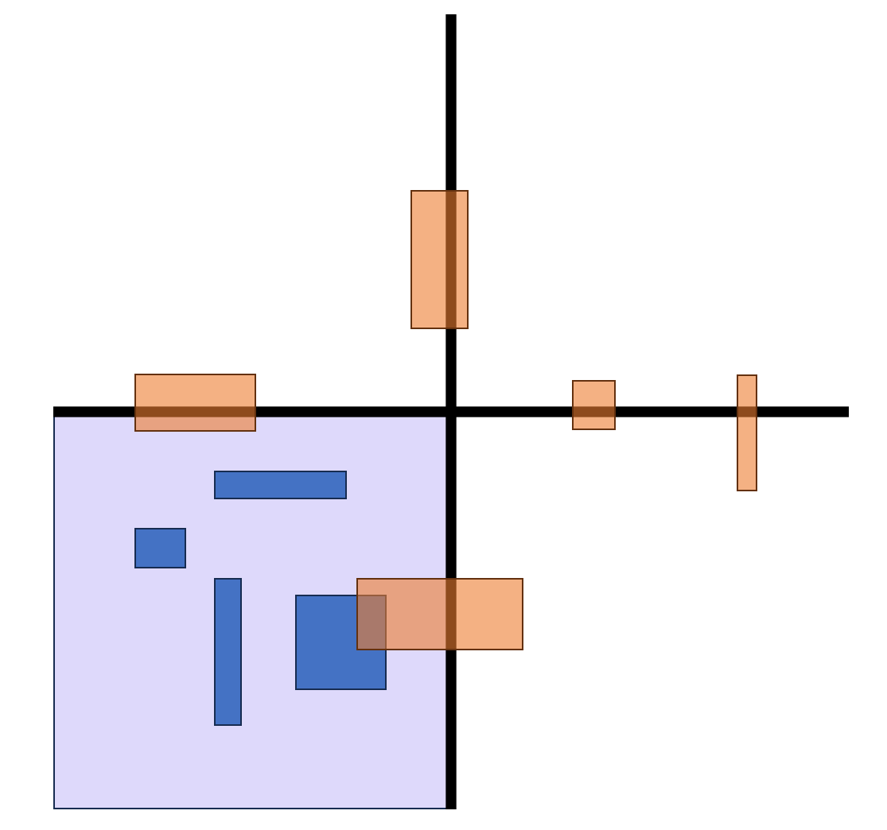

Notice how some of the cross-bucket AABBs don’t even touch the cell? We could
get rid of those!

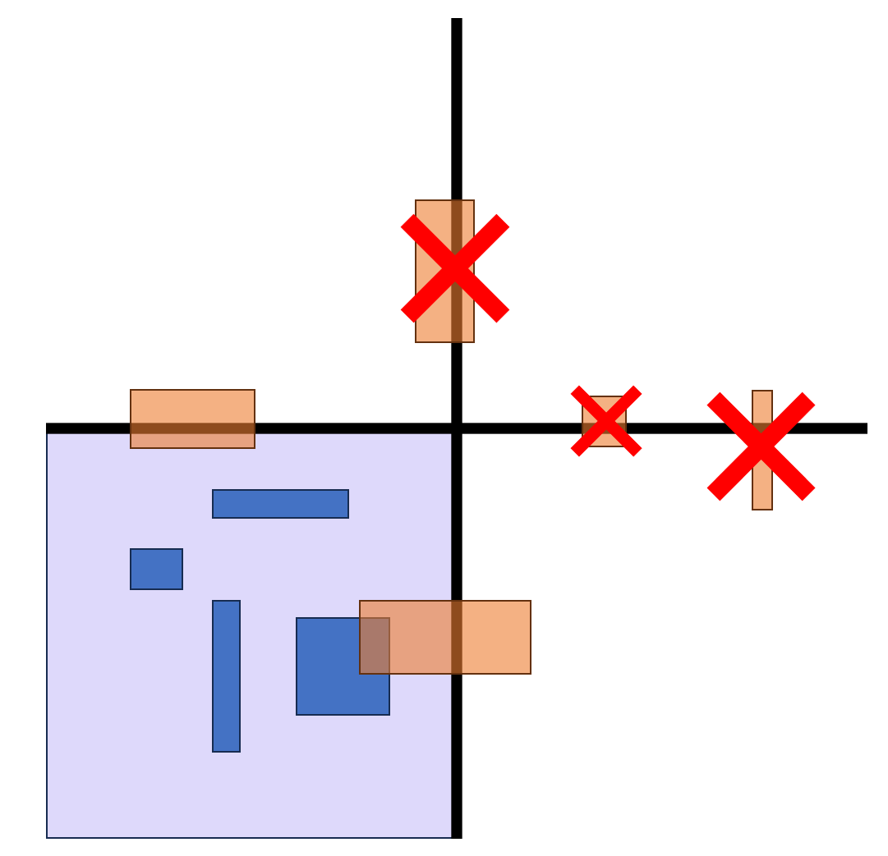

### Some Maintenance Stuff

Before we can do this, we’ll need Psyshock to recognize when it is running
bipartite passes between cross buckets and cells. And we’ll need to know which
is which. We also want to avoid doing this if the buckets are too small. And
we’ll need to account for the possibility of needing variants targeting
different CPUs. And sub-sweeping. And…

I refactored the whole thing.

No seriously, if there were going to be a bunch of sweep variations, I didn’t
want all those variations to get duplicated in all the different jobs designed
for different scheduling mechanisms. Plus, I recently converted `CollisionLayer`
to use `NativeLists`, which opens the door for even more variations, some of
which we might need for this adventure. I rewrote everything such that there are
now only two jobs. One job handles a single layer, and one handles two layers.
Each job handles all the different scheduling modes. And I created custom
profiler markers which are also aware of the `IFindPairsProcessor` name, so
those show up in the profiler too. Here’s what that looks like:

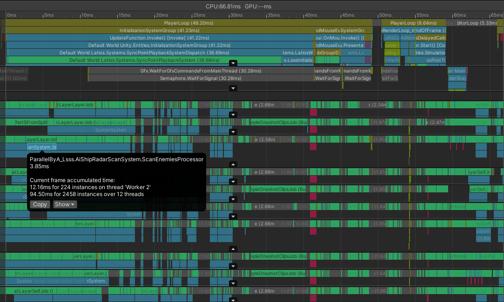

`ParallelByA` is a new mode that only enforces thread-safety on the A-side of a
bipartite operation, but only requires a single parallel job to process
everything similar to `ParallelUnsafe`.

### Allocators

We have a filter function. But we’ll need somewhere to store our results such
that our tried-and-tested single-axis sweep can process our reduced list of
AABBs. `Allocator.Temp` seems like a good initial candidate. However, we either
have to externally pass the memory in, or allocate a new time for every sweep.
The latter is wasteful, since we only need the memory for the duration of the
sweep. But `Allocator.Temp` is bad in general since a user might call
`RunImmediately()` inside a loop within their own job. The memory would keep
getting allocated over and over and over again and not freed until the job
eventually completes.

Instead, we’d like a pool of memory we can use per thread that we recycle as
soon as we are done with it. But how do we know which thread we are on? We won’t
always have a `[NativeSetThreadIndex]` to give it to us.

Fortunately, Unity added a `JobsUtility.ThreadIndex` property we can use. I was
suspicious this property might be expensive to query, otherwise Unity would have
deprecated the attribute. So I ran a little performance test.

```csharp
[BurstCompile]
struct InjectedIndexJob : IJob
{
    public NativeArray<int> writeZone;
    public Rng              writeScatterer;

    public int iterations;

    [NativeSetThreadIndex]
    int m_threadIndex;

    public void Execute()
    {
        var rng = writeScatterer.GetSequence(m_threadIndex);
        for (int i = 0; i < iterations; i++)
        {
            writeZone[rng.NextInt(0, writeZone.Length)] += m_threadIndex;
        }
    }
}

[BurstCompile]
struct QueriedIndexJob : IJob
{
    public NativeArray<int> writeZone;
    public Rng              writeScatterer;

    public int iterations;

    public void Execute()
    {
        var rng = writeScatterer.GetSequence(Unity.Jobs.LowLevel.Unsafe.JobsUtility.ThreadIndex);
        for (int i = 0; i < iterations; i++)
        {
            writeZone[rng.NextInt(0, writeZone.Length)] += Unity.Jobs.LowLevel.Unsafe.JobsUtility.ThreadIndex;
        }
    }
}
```

The `QueriedIndexJob` took twice as long in the benchmark, which suggests that
the property has the same overhead as an `Rng` roll. While a little slower than
the attribute since it has to go into engine code, that’s honestly not that bad!
It is plenty good enough for obtaining an initial allocator handle inside a
method that has its own loop.

In anticipation for this adventure, I wrote a little allocation mechanism that
uses shared statics and the thread index to arrive to a per-thread allocator
stack. Each “allocator stack” is actually a stack of memory blocks and a stack
of allocations. A block can have multiple allocations made from it. You create a
`ThreadLocalAllocator` in the scope you want to allocate, and it will remember
where it started in the stack of allocations. It will then add new allocations,
and potentially create new memory blocks. When the `ThreadLocalAllocator` is
disposed, all of its allocations get popped off the stack. The next allocations
made will use the same blocks and consequently, the same memory addresses that
may still be around in cache. We aren’t shuffling as much memory this way, which
is a bonus win.

### Writing the Filter

Since this optimization requires a multi-box, which our separate performance
tests didn’t utilize, I’m implementing this optimization directly inside of the
framework. Here’s what the new sweep looks like:

```csharp
static unsafe void BipartiteSweepBucketVsFilteredCross<T>(ref FindPairsResult result,
                                                            in BucketSlices bucketA,
                                                            in BucketSlices bucketB,
                                                            ref T processor,
                                                            in BucketAabb bucketAabbForA) where T : struct, IFindPairsProcessor
{
    Hint.Assume(bucketA.xmins.Length == bucketA.xmaxs.Length);
    Hint.Assume(bucketA.xmins.Length == bucketA.yzminmaxs.Length);
    Hint.Assume(bucketA.xmins.Length == bucketA.bodies.Length);

    Hint.Assume(bucketB.xmins.Length == bucketB.xmaxs.Length);
    Hint.Assume(bucketB.xmins.Length == bucketB.yzminmaxs.Length);
    Hint.Assume(bucketB.xmins.Length == bucketB.bodies.Length);

    int countA = bucketA.xmins.Length;
    int countB = bucketB.xmins.Length;

    using var allocator = ThreadStackAllocator.GetAllocator();

    var crossXMins     = allocator.Allocate<float>(countB + 1);
    var crossXMaxs     = allocator.Allocate<float>(countB);
    var crossYzMinMaxs = allocator.Allocate<float4>(countB);
    var crossIndices   = allocator.Allocate<int>(countB);
    int crossCount     = 0;

    for (int i = 0; i < countB; i++)
    {
        if (bucketAabbForA.xmax < bucketB.xmins[i])
            break;
        if (bucketB.xmaxs[i] < bucketAabbForA.xmin)
            continue;
        if (math.bitmask((bucketAabbForA.yzMinMaxFlipped < bucketB.yzminmaxs[i]) & bucketAabbForA.finiteMask) == 0)
        {
            crossXMins[crossCount]     = bucketB.xmins[i];
            crossXMaxs[crossCount]     = bucketB.xmaxs[i];
            crossYzMinMaxs[crossCount] = bucketB.yzminmaxs[i];
            crossIndices[crossCount]   = i;
            crossCount++;
        }
    }
    crossXMins[crossCount] = float.NaN;
    //UnityEngine.Debug.Log($"Remaining after filter: {crossCount * 100f / countB}");

    // Check for b starting in a's x range
    int bstart = 0;
    for (int i = 0; i < countA; i++)
    {
        // Advance to b.xmin >= a.xmin
        // Include equals case by stopping when equal
        while (bstart < crossCount && crossXMins[bstart] < bucketA.xmins[i])
            bstart++;
        if (bstart >= crossCount)
            break;

        var current = -bucketA.yzminmaxs[i].zwxy;
        var xmax    = bucketA.xmaxs[i];
        for (int j = bstart; j < crossCount && crossXMins[j] <= xmax; j++)
        {
            if (math.bitmask(current < crossYzMinMaxs[j]) == 0)
            {
                result.SetBucketRelativePairIndices(i, crossIndices[j]);
                processor.Execute(in result);
            }
        }
    }

    // Check for a starting in b's x range
    int astart = 0;
    for (int i = 0; i < crossCount; i++)
    {
        // Advance to a.xmin > b.xmin
        // Exclude equals case this time by continuing if equal
        while (astart < countA && bucketA.xmins[astart] <= crossXMins[i])
            astart++;
        if (astart >= countA)
            break;

        var current = -crossYzMinMaxs[i].zwxy;
        var xmax    = crossXMaxs[i];
        for (int j = astart; j < countA && bucketA.xmins[j] <= xmax; j++)
        {
            if (math.bitmask(current < bucketA.yzminmaxs[j]) == 0)
            {
                result.SetBucketRelativePairIndices(j, crossIndices[i]);
                processor.Execute(in result);
            }
        }
    }
}
```

The first new piece is the `ThreadStackAllocator` and new allocations. The
allocations are returned as raw pointers, so you have to be careful. I crashed
Unity a few times getting this to work. Another oddity you’ll find is that I
have allocated an extra minimum x. One potential optimization we’ve never
brought into production FindPairs was using sentinels. The idea is that by using
an extra value that forces the loop exit condition, we don’t have to check for
the length each iteration. That extra value is problematic with multi-box where
all the buckets are packed into larger arrays. However, since we are building a
temporary smaller list of AABBs, such optimizations are much more palatable. For
now I’ve added the code to insert the sentinel, but I haven’t optimized the
loops to make use of it yet.

The second thing you’ll notice is the `BucketAabb` type. The method that calls
this method is responsible for creating the instance passed in. It comes with a
pre-arranged AABB for our sign-flipping technique. It also comes with a mask
that specifies if the 4 boundaries in the yz plane are finite or not. With
these, we can filter our cross-bucket AABBs efficiently.

After that, we have our normal bipartite algorithm, swapping out one of the
buckets for the filtered arrays. We also have to remap result indices to bucket
indices whenever we find a hit.

And that’s our filter! Let’s take it for a spin!

### The First Filter Takes Flight

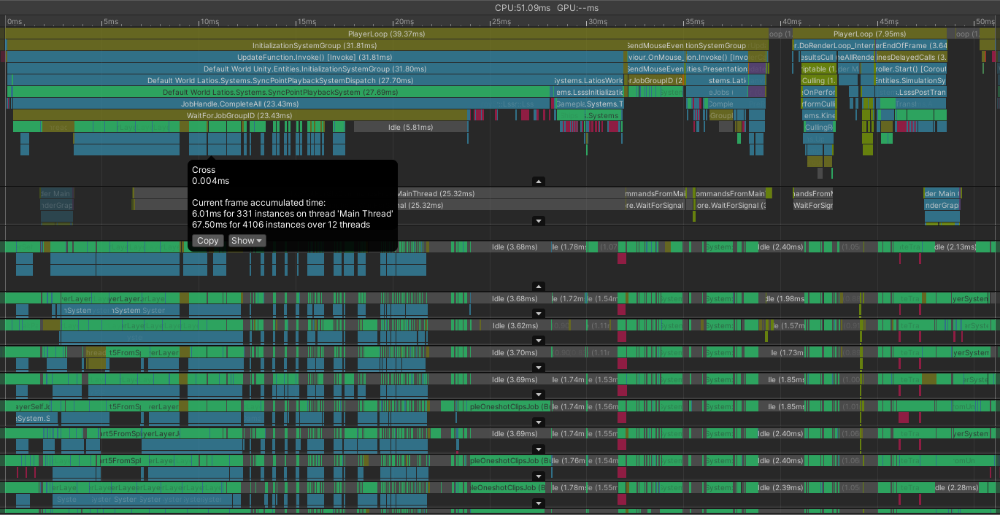

Whoah!

That made a real difference! This frame used to take closer to 67 milliseconds.
Now we are near 50. We can also see that on the average, we cut off about 100
milliseconds across all threads for cell vs cross.

However, even with this improvement, cell vs cross still takes more time per
frame than cell vs cell. There’s still some room for improvement. But there’s
another issue I have with this profile capture that I’d like to fix.

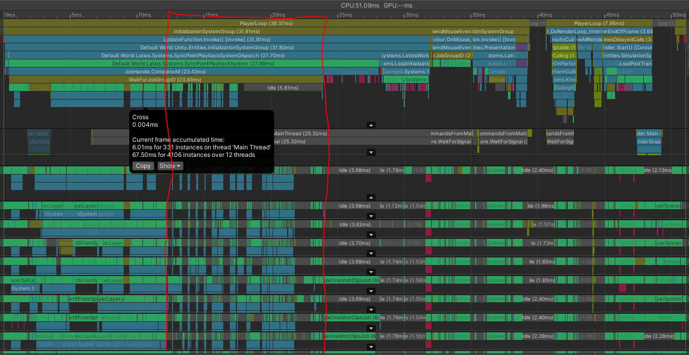

Do you see how there are a lot of gaps between the green bars? Those are worker
thread scheduling issues. We have lots of little bubbles in our pipeline.

With each of these gaps, there’s at least one thread that has it filled, which
means that job is the bottleneck. So what is that job? Well, there are actually
two that are the culprit. One of them is the second phase of ship vs ship, and
the other is the second phase of ship vs bullet.

## Shared Component Filtering

In LSSS, there’s a ship collision layer for each ship faction. There were a few
reasons why this was done.

The first is that it allowed exclusive gameplay depending on the factions. In
practice, there is only one system that takes advantage of this, which is the
radar system. However, the radar system still cares about both friendly and
enemy ships, so this could just as easily be a branch in the processor.

The second reason was that due to the way the radar system used to work before
layer queries were a thing, it was critical to interleave the find pairs jobs
with other jobs with a complex job chain. However, the code no longer works this
way, so it serves no benefit.

The third reason was that at the time, I didn’t fully understand the algorithmic
complexity formula of single-axis pruning. And so I suspected that splitting
layers resulted in better complexity with cell vs cross. I know now it works out
to the same amount of AABB tests. The only time that splitting offers a
work-reduction benefit is when you want to completely ignore specific
combinations. We still want to keep ships and bullets and radars all apart, but
there isn’t a good reason to keep the factions separate anymore.

But is there a good reason to combine them? Take a look at this:

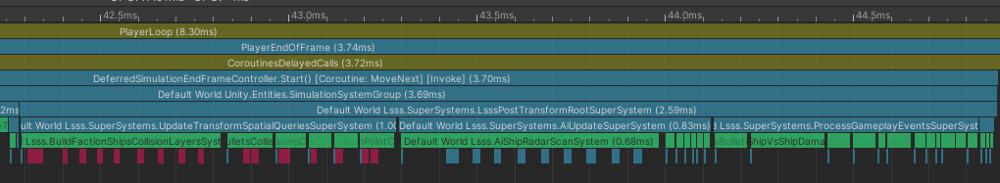

There are three systems here that take longer than the others. The
`ShipVsShipDamageSystem` takes a while because it is scheduling *n\^2* FindPairs
operations for *n* factions. But yet, that’s still slower than
`BuildFactionShipsCollisionLayersSystem`. This system and the
`AiShipRadarScanSystem` suffer from something in common. They both build
collision layers based on entity queries that involve shared component
filtering.

That means that for each faction, the main thread is iterating through all the
chunks of the required archetype. That’s not great. And this affects
lighter-weight missions as well, so it would be nice to fix this. Merging the
per-faction layers would be such a fix.

Merging the per-faction layers would also cause our bubbles in your jobs to
merge into one bigger bubble. One bigger bubble is a lot easier to fill with an
independent job than a bunch of smaller bubbles. This seems like a possible
improvement.

Let’s try it!

### Refactoring Ships

There’s a bunch of touch points that need to change. Our collection component
storing the ships `CollisionLayer` should no longer be attached to each faction,
but instead be on the `sceneBlackboardEntity`.
`BuildFactionShipsCollisionLayerSystem` can be renamed to
`BuildShipsCollisionLayerSystem` and be modified to build the layer for all
ships. It no longer needs to iterate over each faction.
`CheckSpawnPointIsSafeSystem`, `ShipVsShipDamageSystem`,
`ShipVsBulletDamageSystem`, `ShipVsExplosionDamageSystem`, and
`ShipVsWallDamageSystem` all need to be modified to use the singular layer,
which mostly involves deleting the code that iterates over factions. And that
just leaves us with `AiShipRadarScanSystem`, which has a bit more going on.

The radar system has two `IFindPairsProcessors`, named `ScanFriendsProcessor`
and `ScanEnemiesProcessor`. These use the exact same job arguments. We’ll
respectively rename their `Execute()` methods to `ExecuteFriend()` and
`ExecuteEnemy()`…

Okay. There’s some serendipitous dark humor in those name choices, but let’s
roll with it.

We can merge these two processors by copying one method into the other
processor, and renaming that processor to `ScanProcessor`. Now we just need to
determine if the ship we detected is friendly or an enemy and call the
appropriate method.

The faction a ship belongs to is determined by its `FactionMember` component.
And a radar also has this component. This is an `ISharedComponentData`. But
there’s no `SharedComponentLookup<>` type. How do we figure that out?

We could cache the shared component indices in an array along with each
`CollisionLayer`. Maybe that’s fast. But it is also a lot of memory to do
lookups on.

It turns out, `ComponentLookup<>` types are actually completely unnecessary, and
merely exist out of convenience. You can replace any `ComponentLookup<>` with a
`ComponentTypeHandle<>` and an `EntityStorageInfoLookup`. The
`EntityStorageInfoLookup` gives you an `ArchetypeChunk` which you can use the
`ComponentTypeHandle<>` on to get the array of components. Then you can use the
`IndexInChunk` to get the specific component in the array.

A similar trick exists using `SharedComponentTypeHandle<>`, except we don’t even
need the `IndexInChunk` value at all. Also, since we are only trying to
determine equivalency of shared component values, we don’t need to fetch the
actual shared component values. We can simply check if the indices are
equivalent. Thus, we get this:

```csharp
public void Execute(in FindPairsResult result)
{
    var factionIndexA = entityStorageInfoLookup[result.entityA].Chunk.GetSharedComponentIndex(factionMemberHandle);
    var factionIndexB = entityStorageInfoLookup[result.entityB].Chunk.GetSharedComponentIndex(factionMemberHandle);
    if (factionIndexA == factionIndexB)
        ExecuteFriend(in result);
    else
        ExecuteEnemy(in result);
}
```

The rest is simplifying the main thread update routine for the system. And it
simplified a lot! If you remember the behemoth it looked like before, compare
that to what it looks like now:

```csharp
[BurstCompile]
public void OnUpdate(ref SystemState state)
{
    CollisionLayerSettings collisionLayerSettings;
    if (latiosWorld.sceneBlackboardEntity.HasComponent<ArenaCollisionSettings>())
        collisionLayerSettings = latiosWorld.sceneBlackboardEntity.GetComponentData<ArenaCollisionSettings>().settings;
    else
        collisionLayerSettings = BuildCollisionLayerConfig.defaultSettings;
    var shipLayer              = latiosWorld.sceneBlackboardEntity.GetCollectionComponent<ShipsCollisionLayer>(true).layer;
    var wallLayer              = latiosWorld.sceneBlackboardEntity.GetCollectionComponent<WallCollisionLayer>(true).layer;

    var allocator = state.WorldUpdateAllocator;

    var count        = m_radarsQuery.CalculateEntityCountWithoutFiltering();
    var bodies       = CollectionHelper.CreateNativeArray<ColliderBody>(count, allocator, NativeArrayOptions.UninitializedMemory);
    var aabbs        = CollectionHelper.CreateNativeArray<Aabb>(count, allocator, NativeArrayOptions.UninitializedMemory);
    var scanResults  = CollectionHelper.CreateNativeArray<AiShipRadarScanResults>(count, allocator, NativeArrayOptions.UninitializedMemory);
    state.Dependency = new BuildRadarBodiesJob { bodies = bodies, aabbs = aabbs, scanResults = scanResults }.ScheduleParallel(m_radarsQuery, state.Dependency);
    state.Dependency = Physics.BuildCollisionLayer(bodies, aabbs).WithSettings(collisionLayerSettings).ScheduleParallel(out var radarLayer, allocator, state.Dependency);

    var scanProcessor = new ScanProcessor
    {
        entityStorageInfoLookup = GetEntityStorageInfoLookup(),
        factionMemberHandle     = GetSharedComponentTypeHandle<FactionMember>(),
        radarLookup             = GetComponentLookup<AiShipRadar>(false),
        scanResultsArray        = scanResults,
        wallLayer               = wallLayer
    };

    state.Dependency = Physics.FindPairs(radarLayer, shipLayer, scanProcessor).ScheduleParallelByA(state.Dependency);

    var indices      = m_radarsQuery.CalculateBaseEntityIndexArrayAsync(allocator, state.Dependency, out var jh);
    state.Dependency = new CopyBackJob
    {
        array                         = scanResults,
        scanResultsHandle             = GetComponentTypeHandle<AiShipRadarScanResults>(false),
        indicesOfFirstEntitiesInChunk = indices
    }.ScheduleParallel(m_radarsQuery, jh);
}
```

Let’s try it out!

…Unity crashed.

There’s one more detail I missed. Some of the systems were relying on
`[RequireMatchingQueriesForUpdate]` with the query being the factions. With them
no longer being factions, some of the systems were no longer running while
things were still spawning in. I had to fix that too.

But now its working. Let’s see what it looks like.

### We Need the Cache

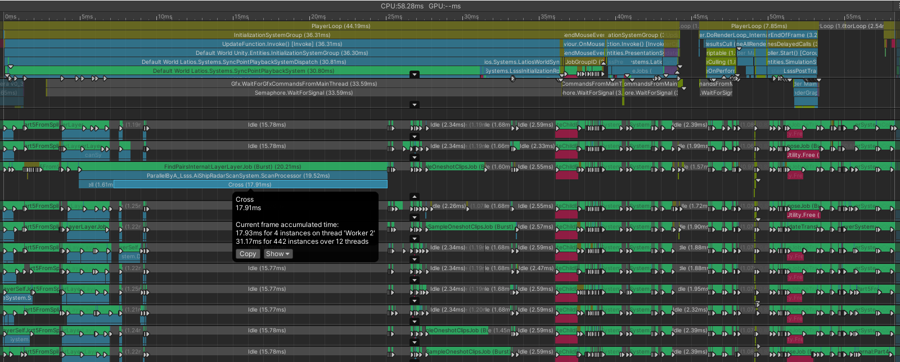

Yikes!

We went backwards. And there’s this giant singular index that is holding
everything up.

Turns out, having radars grouped by factions was giving us a lot of good
parallelism that we just destroyed. That was also the reason why we had those
temporary radar arrays. We could try to split everything up again, but I do like
the idea of having cleaner code. So let’s add back the cross-cache
functionality.

However, since everything is refactored into a single job type, we can’t rely on
`NativeStream` anymore. That was an awkward API anyways.

You all know `UnsafeParallelBlockList`, right? Well meet its new backer,
`UnsafeIndexedBlockList`.

That’s right, I changed `UnsafeParallelBlockList` to support an arbitrary number
of indices, and then made a new `UnsafeParallelBlockList` which uses it.

Because the `ParallelByA` mode normally only uses a single job, I decided to
populate the cross-cache in a non-generic job that runs before the main job.
That should help Burst compile times a tiny bit. Here’s what that job looks
like:

```csharp
internal struct FindPairsParallelByACrossCacheJob : IJobFor, IFindPairsProcessor
{
    [ReadOnly] public CollisionLayer layerA;
    [ReadOnly] public CollisionLayer layerB;
    public UnsafeIndexedBlockList    cache;

    int writeIndex;

    public void Execute(int index)
    {
        writeIndex = index;
        var a      = layerA.GetBucketSlices(layerA.bucketCount - 1);
        var b      = layerB.GetBucketSlices(index);
        FindPairsSweepMethods.BipartiteSweepCrossCell(in layerA, in layerB, in a, in b, index, ref this, false, false);
    }

    public void Execute(in FindPairsResult result)
    {
        cache.Write(new int2(result.bodyIndexA, result.bodyIndexB), writeIndex);
    }
}
```

Oh yeah. Did you know that you can make your job struct an `IFindPairsProcessor`
to use with `RunImmediate()`? It is a good trick to know if you want the job
context and don’t need local variables.

I’ve also added this method for handling playback:

```csharp
public static void BipartiteSweepPlayCache<T>(UnsafeIndexedBlockList.Enumerator enumerator,
                                                in CollisionLayer layerA,
                                                in CollisionLayer layerB,
                                                int jobIndex,
                                                ref T processor,
                                                bool isAThreadSafe,
                                                bool isBThreadSafe) where T : struct, IFindPairsProcessor
{
    if (!enumerator.MoveNext())
        return;

    var result = FindPairsResult.CreateGlobalResult(in layerA, in layerB, jobIndex, isAThreadSafe, isBThreadSafe);

    do
    {
        var indices = enumerator.GetCurrent<int2>();
        result.SetBucketRelativePairIndices(indices.x, indices.y);
        processor.Execute(in result);
    }
    while (enumerator.MoveNext());
}
```

`FindPairsResult.CreateGlobalResult()` makes it so that
`SetBucketRelativePairIndices()` actually sets full layer indices, which is what
we wrote in our other job. So does this new mode fix our giant soloing thread
problem?

Nope. Burst had a heart attack. I ended up refactoring a few things to get it
back on track, including changing the non-generic job to not have multiple
methods named Execute(). But the final piece was that it really did not like an
enum being a byte in size rather than 4 bytes.

Okay, try it again.

### Well, That Was Unexpected

There was only a 2 millisecond performance difference.

Why?

With some additional profiling and debugging, I determined that each cell the
cross bucket was being tested with was reporting a few thousand pairs. The
processor itself is being overloaded.

I’ll have to think of a new scheme for handling this oddity. But for now, I am
going to revert to separate collision layers by faction just for the radars,
still using the combined processor.

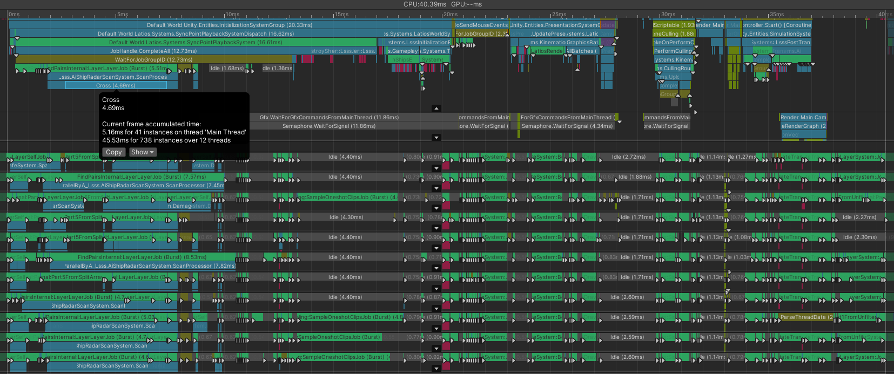

We’re down to 40 milliseconds!

Interestingly, the amount of time we spend in FindPairs per frame shrunk too. I
guess the overhead of lots of small jobs was adding up. This new distribution is
much better!

FindPairs in total is only twice the next job in cost. If we keep pushing, we’re
eventually going to need to start investigating other things. Building the
bullets collision layer is quite expensive. And there’s some stuff with
transforms, render bounds, and motion history.

Actually, we might already be at the point where we need to change focus. As we
have discovered, a good chunk of time is being spent inside the ScanProcessor
itself. Perhaps we should try to get that under control first before we push
FindPairs any further.

## Scanning the Scanner

When I was writing the new `ScanProcessor`, something caught me off guard.
Normally, you pass handles into `ArchetypeChunk` be `ref`. However, this wasn’t
allowed. As I revisit this, I’d like to know why, because that might provide a
clue for a possible optimization. Here’s what the implementation looks like:

```csharp
public readonly int GetSharedComponentIndex<T>(SharedComponentTypeHandle<T> chunkSharedComponentData)
    where T : struct, ISharedComponentData
{
    var archetype = m_EntityComponentStore->GetArchetype(m_Chunk);
    var typeIndexInArchetype = ChunkDataUtility.GetIndexInTypeArray(archetype, chunkSharedComponentData.m_TypeIndex);
    if (Hint.Unlikely(typeIndexInArchetype == -1)) return -1;

    var chunkSharedComponentIndex = typeIndexInArchetype - archetype->FirstSharedComponent;
    var sharedComponentIndex = archetype->Chunks.GetSharedComponentValue(chunkSharedComponentIndex, m_Chunk.ListIndex);
    return sharedComponentIndex;
}
```

And curiously, here’s what the overload for DynamicSharedComponentTypeHandle
looks like:

```csharp
public readonly int GetSharedComponentIndex(ref DynamicSharedComponentTypeHandle typeHandle)
{
#if ENABLE_UNITY_COLLECTIONS_CHECKS
    AtomicSafetyHandle.CheckReadAndThrow(typeHandle.m_Safety);
#endif
    var archetype = m_EntityComponentStore->GetArchetype(m_Chunk);
    ChunkDataUtility.GetIndexInTypeArray(archetype, typeHandle.m_TypeIndex,
        ref typeHandle.m_cachedTypeIndexinArchetype);
    var typeIndexInArchetype = typeHandle.m_cachedTypeIndexinArchetype;
    if (Hint.Unlikely(typeIndexInArchetype == -1)) return -1;

    var chunkSharedComponentIndex = typeIndexInArchetype - archetype->FirstSharedComponent;
    var sharedComponentIndex = archetype->Chunks.GetSharedComponentValue(chunkSharedComponentIndex, m_Chunk.ListIndex);
    return sharedComponentIndex;
}
```

It seems that the dynamic handle uses `ref`. And inside, we can see there’s this
`m_cachedTypeHandleInArchetype`. It seems Unity forgot to modernize the typed
shared component handle but remembered the dynamic one? I guess they internally
don’t use typed shared components?

Switching to the dynamic handle isn’t going to make our problems go away that
easy. The cache system works by remembering the last archetype accessed. Radars
and ships are two different archetypes, so we’d be flip-flopping between the two
and not actually getting any benefit. We could potentially try to clone the
handle to keep a separate cache, but there’s a better way.

We already established that keeping our radars split by faction gave us better
parallelism. But that also means that for a given FindPairs operation, all the
radars will have the same shared component index. Let’s just cache this in the
FindPairs struct. We can do this once in `BeginBucket()` which is an optional
method an `IFindPairsProcessor` can implement. Here’s what that looks like with
the switch to a dynamic handle:

```csharp
int radarFactionIndex;

public void BeginBucket(in FindPairsBucketContext context)
{
    if (context.bucketCountA == 0 || context.bucketCountB == 0)
        return;
    var radar         = context.layerA.colliderBodies[context.bucketStartA].entity;
    radarFactionIndex = entityStorageInfoLookup[radar].Chunk.GetSharedComponentIndex(ref factionMemberHandle);
}

public void Execute(in FindPairsResult result)
{
    var factionIndexB = entityStorageInfoLookup[result.entityB].Chunk.GetSharedComponentIndex(ref factionMemberHandle);
    if (radarFactionIndex == factionIndexB)
        ExecuteFriend(in result);
    else
        ExecuteEnemy(in result);
}
```

### It Ain’t That Simple

Before this optimization, the FindPairs operation on ScanProcessor across all
threads was sitting in the low 40s of milliseconds. Now it is high 30s. So about
4-8 milliseconds saved, which is an improvement, but not a significant enough
one to put a dent in our overall frame times in a meaningful way.

What I know from my determination of why the cross-cache didn’t work is that on
average, there’s probably a good 100k pairs being processed each frame. That
makes sense, as that’s about 4 other ships spotted by each ship. But I don’t
have as much of a guess as to what part the CPU is choking on most. I think it
is time we let V-Tune give us some insight!

I profiled LSSS running in the Editor for 2 minutes, and this was the overall
summary:

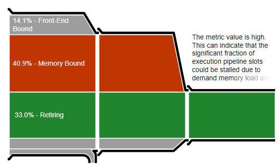

This is pretty typical of an ECS project being pushed a bit. As we’ll explore,
I’m running up against bandwidth limits on my machine.

And here’s the top functions:

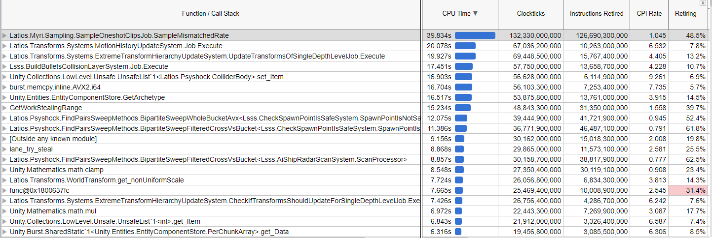

Look at that! Myri is at the top!

That spot used to be a competitive race between it and the FindPairs operations.
But now Myri is way more than anything else. However, it isn’t worth worrying
about, since Myri isn’t even a bottleneck. It fills the sync point gap pretty
close to perfect in our stress scene.

Next is our `MotionHistoryUpdateSystem` which is completely bottlenecked by
memory bandwidth.

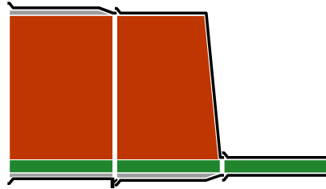

That’s a pure chunk-iteration algorithm. Perhaps some of this may be do to
lower-than-desired chunk occupancy. But I suspect much of this is purely being
bandwidth-bound. This is copying the current `WorldTransform` to the
`PreviousTransform` for every renderable in the scene which is required for
HDRP’s motion vectors. That ends up being 96 bytes per entity, and there are 25k
ships with on average 10 renderables each plus all the bullets. That adds up. If
you were ever wondering why Kinemation uses the rotating buffers for optimized
skeletons and blend shapes, it is to avoid this.

The Transform Hierarchy is also memory-bound. I think the only reason it costs
less is because it doesn’t count bullets. It retires 50% more instructions than
motion history, which is probably the math part. Speaking of bullets, the next
two are related to building the bullet collision layer. The first gathers the
initial arrays, while the second writes the final `CollisionLayer`. They are
memory-bound too.

The `GetArchetype()` is interesting. Expanding it, it shows as being the lookup
for `WorldTransform` when updating the hierarchy. I have some ideas for how to
maybe improve that, but that’s for another adventure.

Then, we have our sweeps for `CheckSpawnPointIsSafeProcessor`. One of these is
cell vs cell, while the other is cross vs cell. These have good retire rates,
especially the cross vs cell variant. Both primarily report branching as their
biggest bottleneck. If you are wondering why there’s no cell vs cross, it is
because only the spawn points regularly lie in the cross-bucket. The other types
compared to are small and stay in cells.

And then we have our sweep for the radars, but just the cross vs cell. It is
three times larger than the cell vs cell sweep, and also apparently three times
larger than the ScanProcessor. However, up to this point, my Unity profile
captures have always been at the start of the game, since over time the unit
numbers start to fall as ships destroy each other. But based on what V-Tune is
reporting, the ScanProcessor has less of an impact over time and the spawn point
sweeps become more chaotic, potentially because there’s more bullets flying
around. We should maybe capture some frames a little further into the simulation
to see what’s happening.

Oh, and if you are wondering what’s up with the random `math.clamp()`, that is
100% Myri’s fault.

## Did We Win?

After profiling some more, I have come to the conclusion that Unity and V-Tune
are at odds with each other regarding what they perceive to be the most
expensive. Unity continues to report problems with the FindPairs/ScanProcessor,
and less so with spawn points, while V-Tune thinks the opposite. I’m not going
to try to speculate why.

What is obvious to me though is that FindPairs is no longer objectively the sole
bottleneck of LSSS. It is still a big hitter, but there are other big hitters in
the picture such as transforms, building the bullet collision layer, and
Engine/HDRP rendering. And this contested space makes it harder to measure
performance gains of any one of these in particular. LSSS would require a major
change in direction for us to explore new frontiers.

We’re on the fifth adventure of FindPairs. Over this time, we learned a lot. We
tried lots of fancy algorithms such as dual axes, hyper-aggressive unrolling,
and layer queries. But none of that could compare to a well-refined simple
single-axis pruner. The solution this whole time was to build simple high-level
optimizations on top of this foundation, and suddenly our performance problems
evaporated. We can finally put this concern to rest.

Does that mean there isn’t more to optimize to FindPairs? Of course not! The
optimizations we employed currently don’t have much affect when cell occupancy
is extremely high. There’s some additional filtering strategies we can try, such
as filtering along boundaries or dynamically partitioning cells. But those will
have to wait for a new project with a new bottleneck.

Did we win?

Yeah.

We won.

## Try It Yourself

This optimization adventure was developed completely within LSSS and its final
results have been committed and pushed. Feel free to clone the project and
experiment with the optimizations yourself.
