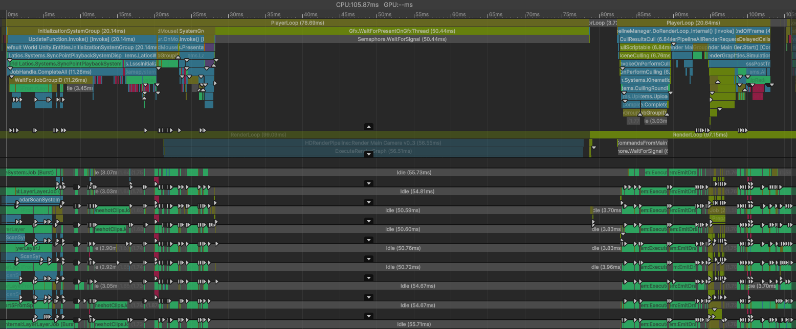
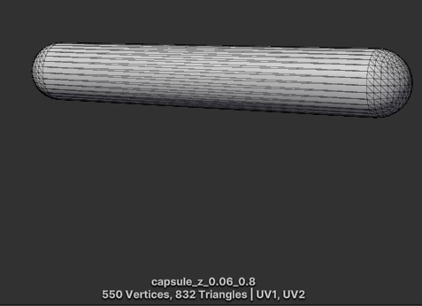
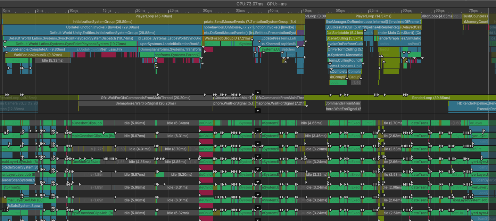
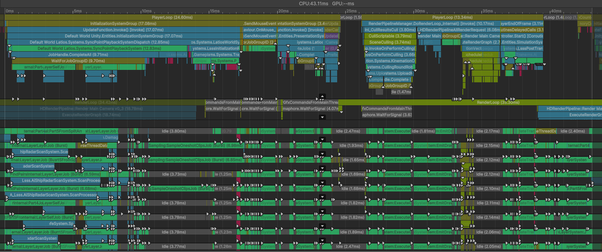

# Optimization Adventures: Part 13 – LODs 1

In the streaming world, the recordings of streams are typically called VODs.
People don’t say V-O-Ds, instead they say it as a one syllable word. In the same
way, I don’t say L-O-D, I say it as one word that rhymes with VOD. I don’t know
who I picked this up from, but I have definitely confused some professionals in
the games industry I have chatted with.

We’re diving into a completely new topic in this adventure, and I’m sure you
would like to learn what it is and why we want to optimize it. Let’s get right
to it!

## A Surprise GPU Medical Emergency

In many of our previous adventures, we’ve looked at various ways to improve the
performance of LSSS and increase how large of a simulation we can run at
playable framerates. Last time, we brought Sector 03 Mission 5 down to 40
milliseconds per frame on my machine. Some community members have informed me
that on their much newer machines, this runs at a smooth 60 FPS now! It is a
good reminder that the numbers I provide here are not universal, and that you
should always do your own benchmarking when comparing numbers across the
internet from different sources.

And if that wasn’t enough to convince you, what if I told you that the 40
milliseconds wasn’t the most honest number to begin with?

You see, in this particular mission, the player spawns facing mostly away from
the action. And so far, I’ve been leaving the player alone when profiling. But
what happens when we turn the player towards the action?



My poor GPU is having a heart attack!

Or is it? Perhaps the issue is that massive block on the render thread. That
would be really bad. Fortunately, it seems unlikely, as looking at other frames,
that block doesn’t start to show up until after a few frames of being totally
GPU-bound. So it would seem that block is having to do GPU things and getting
put on hold by the graphics driver.

So why is this happening?

Are you familiar with the performance issues the plagued the launch of Cities:
Skylines II? Where there were a bunch of high-res models like teeth being
rendered even at a bird’s eye view resulting in 50+ million triangles being
pushed every frame? Well, Unity’s stats pane just reported a peak of 380 million
triangles.

Yeah… that’s a problem.

There’s no shame in running into this problem though. After all, this is a
stress test. The normal missions reach triangle counts that are plenty
reasonable. But where are all these triangles coming from?

Well, we have a lot of bullets. Here’s what one of those looks like:



That is a lot of triangles for a simple bullet! It looks great up close, but
many of these bullets are very far away. Perhaps we can swap this mesh with
something that has far fewer triangles for those far away bullets.

## LODs to the Rescue!

This is effectively what Levels-Of-Detail (LODs) are. And the Latios Framework
already has support for them. In addition, LSSS procedurally generates the
capsule meshes in a baker, so we can very easily procedurally generate a low-res
version at the same time.

```csharp
Mesh CreateLODMesh(float height, float radius, CapsuleMeshAuthoring.DirectionAxis axis)
{
    var mesh      = new Mesh();
    var positions = new NativeArray<float3>(10, Allocator.Temp);

    var halfHeight    = height / 2f;
    var radialExtents = radius / math.sqrt(2f);

    positions[0] = new float3(-halfHeight, 0f, 0f);
    positions[1] = new float3(-halfHeight + radius, -radialExtents, -radialExtents);
    positions[2] = new float3(-halfHeight + radius, radialExtents, -radialExtents);
    positions[3] = new float3(-halfHeight + radius, radialExtents, radialExtents);
    positions[4] = new float3(-halfHeight + radius, -radialExtents, radialExtents);
    positions[5] = new float3(halfHeight - radius, -radialExtents, -radialExtents);
    positions[6] = new float3(halfHeight - radius, radialExtents, -radialExtents);
    positions[7] = new float3(halfHeight - radius, radialExtents, radialExtents);
    positions[8] = new float3(halfHeight - radius, -radialExtents, radialExtents);
    positions[9] = new float3(halfHeight, 0f, 0f);

    if (axis == CapsuleMeshAuthoring.DirectionAxis.Y)
    {
        for (int i = 0; i < positions.Length; i++)
        {
            var p        = positions[i];
            p            = p.yxz;
            positions[i] = p;
        }
    }
    else if (axis == CapsuleMeshAuthoring.DirectionAxis.Z)
    {
        for (int i = 0; i < positions.Length; i++)
        {
            var p        = positions[i];
            p            = p.yzx;
            positions[i] = p;
        }
    }

    var triangles = new NativeArray<int3>(16, Allocator.Temp);
    triangles[0]  = new int3(1, 5, 6);
    triangles[1]  = new int3(1, 6, 2);
    triangles[2]  = new int3(2, 6, 7);
    triangles[3]  = new int3(2, 7, 3);
    triangles[4]  = new int3(3, 7, 8);
    triangles[5]  = new int3(3, 8, 4);
    triangles[6]  = new int3(4, 8, 5);
    triangles[7]  = new int3(4, 5, 1);
    triangles[8]  = new int3(0, 1, 2);
    triangles[9]  = new int3(0, 2, 3);
    triangles[10] = new int3(0, 3, 4);
    triangles[11] = new int3(0, 4, 1);
    triangles[12] = new int3(5, 6, 9);
    triangles[13] = new int3(6, 7, 9);
    triangles[14] = new int3(7, 8, 9);
    triangles[15] = new int3(8, 5, 9);

    mesh.SetVertices(positions);
    mesh.SetTriangles(triangles.Reinterpret<int>(12).ToArray(), 0);
    mesh.RecalculateNormals();
    mesh.RecalculateTangents();
    return mesh;
}
```

Now, we just need a way to select whether we render the detailed mesh or the
low-res mesh. Fortunately, Kinemation provides a straightforward way to supply
baking with that information. We just have to give it the largest axis of the
local bounds as the “LOD height” and then specify min and max screen percentages
where we want the particular version of the mesh to be visible.

Hi-res settings:

```csharp
lodSettings.localHeight            = authoring.m_height;
lodSettings.lowestResLodLevel      = 1;
lodSettings.maxScreenHeightPercent = (half)1f;
lodSettings.minScreenHeightPercent = (half)(authoring.m_lodPercentage / 100f);
```

Lo-res modifications:

```csharp
rendererSettings.lodSettings.maxScreenHeightPercent = rendererSettings.lodSettings.minScreenHeightPercent;
rendererSettings.lodSettings.minScreenHeightPercent = default;
```



That’s looking better!

Actually…

We overdid it.

Now the GPU is *waiting* on the CPU for 35 milliseconds. And thus, we are
presented with the real challenge of this adventure!

## The Curse of Dynamic Buffers

Looking at the profiler, there are two main areas where we have lost a lot of
time. Our sync point now takes 20 milliseconds compared to just 8 before. And
transform hierarchy updates are also taking much longer, and delaying the
rendering systems due to a sync point in the middle.

Why are these more expensive?

Well, in order to generate our low-res mesh LOD, we needed to create an
additional entity. For ships mostly comprised of capsules, the number of
rendering entities within them doubled. But even worse, our bullets that used to
be only a single entity are now two entities a piece. This means that bullets
have to do all the parent and child tracking, which is why transforms takes so
long and why our `ParentChangeSystem` sees a big spike in sync point processing.
However, that’s not the full story. In the profile capture, there’s a lot of
red. And red usually means there’s heavy pressure on allocation and deallocation
of memory. Where’s that coming from?

Dynamic Buffers.

Having the LOD companion entity suddenly causes bullets to not only have a Child
buffer, but it also forces `LinkedEntityGroup` onto the heap.

What is wrong about the heap?

Normally, forcing dynamic buffers to the heap is a good idea, because ECS chunk
space is very limited to get good chunk occupancy. And bad occupancy defeats all
the cache benefits of ECS.

However, there’s a catch. Dynamic Buffers on the heap allocate with the
Persistent allocator, which is the slowest allocator. And they always allocate
for a minimum of 8 elements. These allocations and deallocations primarily
happen during the sync point, which adds up.

Dynamic Buffers work well for complex entities, like the skeletons in
Kinemation. But for simplistic entities like bullets that are spammed across the
galaxy, it may be wise to avoid them.

There are multiple things we could try here. We could try to remove the `Child`
buffer by storing children in a global collection instead. Though that only
solves part of the problem. We could also try to change the allocation strategy
of Dynamic Buffers, but while that would have universal benefits if we
succeeded, it would be quite invasive.

Instead of trying to fix this problem, let’s try to undo its creation. This
whole thing came about because we needed a second entity for the low-res LOD.
What if we instead put both LODs on the same entity? After all, Kinemation can
already render multiple meshes and materials on a single entity.

As a bonus, we’ll fix a regression where our material fade-out isn’t being
applied to our low-res bullets.

## The Secrets of RenderMeshArray

Most people are familiar with how `RenderMeshArray` contains an array of meshes
and an array of materials, and how negative indices inside of `MaterialMeshInfo`
index these arrays. But beginning with Entities 1.1, `RenderMeshArray` has a
third array named `m_MaterialMeshIndices`. This contains instances of
`MaterialMeshIndex`, which is composed of an index into the mesh array, an index
into the material array, and an integer submesh index. At runtime,
`RenderMeshArray` gets converted to a `BRGRenderMeshArray`, which replaces all
`UnityObjectRef` with the `BatchRendererGroup` registered meshes and materials
and stores them in `UnsafeList` instances, as this version is meant to be
Burst-friendly. It also converts `MaterialMeshIndex` into
`BatchMaterialMeshSubMesh` which replaces the mesh and material indices into
direct BRG IDs as a slight optimization. But the submesh index is passed right
through.

We have a 32-bit integer submesh index in our `RenderMeshArray`. However,
`BatchRendererGroup` only supports `ushort` submesh indices. Which means we have
16 spare bits to play with! We can use 8 of those bits to represent a LOD mask.
So now in our authoring settings look like this:

```csharp
public struct MeshMaterialSubmeshSettings
{
    public UnityObjectRef<Mesh>     mesh;
    public UnityObjectRef<Material> material;
    public ushort                   submesh;
    public byte                     lodMask;

    public const byte kDefaultLodMask = 0xff;
}
```

So how do we utilize the `m_MaterialMeshIndices` array? For that, we have to
look into `SubMeshIndexInfo32`, an instance of which lives inside
`MaterialMeshInfo`. This has a single private `uint` member with the following
comment describing the layout:

```csharp
// Bit packing layout
// ====================================
// 20 bits : Range start index.
// 7 bits : Range length.
// 4 bits (unused) : Could be used for LOD in the future?
// 1 bit : True when using material mesh index range, otherwise false.
uint m_Value;
```

With this, a `MaterialMeshInfo` can optionally denote a sub-array of
`m_MaterialMeshIndices` that should be used. However, the range only supports up
to 7 bits worth of elements. From the authors of Entities Graphics perspective,
this means they support up to 127 materials on a single entity, which is a lot
(though admittedly a lot less than the number of submeshes that could be
supported). However, since we want to combine multiple mesh renderer’s worth in
a single entity, this limit is a little constraining. Fortunately, we can use
the other 8 spare bits to encode special data. If we have a range of 127, we can
treat that value as a sign to instead read the real range out of the combination
of 8 bits from elements 1, 2, and 3 of the subarray (we assume we have at least
4 elements in this state). The 8 bits of element 0 can then be used to specify a
combined LOD mask for all elements in the range, which can offer a culling
fast-path. Here's how that can be baked:

```csharp
void AddLodDataToBuffer(ref DynamicBuffer<BakingMaterialMeshSubmesh> buffer)
{
    if (buffer.Length == 0)
        return;

    ref var element0 = ref buffer.ElementAt(0);
    if ((element0.submesh & 0xff000000) == 0xff000000)
    {
        element0.submesh |= 0x00ff0000;
    }
    else
    {
        int mask = 0;
        foreach (var element in buffer)
        {
            mask |= element.submesh;
        }
        element0.submesh |= (mask >> 8) & 0x00ff0000;
    }

    if (buffer.Length >= 127)
    {
        buffer.ElementAt(1).submesh |= (buffer.Length << 16) & 0x00ff0000;
        buffer.ElementAt(2).submesh |= (buffer.Length << 8) & 0x00ff0000;
        buffer.ElementAt(3).submesh |= (buffer.Length) & 0x00ff0000;
    }
}
```

Technically, we’d only need 2 bits in `SubMeshIndexInfo32` to represent the
range in this scheme. So if anyone from Unity is reading this, might you
consider shifting 3 of those bits to the start offset so that we can have up to
8 million elements instead of 1 million?

Anyways, there are 4 more bits in our layout that are unused. And there’s even a
comment about using them for LOD in the future. Well, we’re impatient. So that
future is going to be now!

A LOD Group can have up to 17 regions. 8 are the actual LOD regions. There are 7
transition regions for crossfade. There’s a fade-out region. And then there’s an
entirely culled region. That culled region can be tied directly to the culling
bit masks, since in that case there’s no point in processing the entity at all.
That gives us 16 regions, of which we can only be inside one of at any given
time. Turns out, 4 bits is exactly enough to represent our active LOD region!

Unfortunately, `SubMeshIndexInfo32` is completely private through and through.
So we need to use some pointer shenanigans to get at these unused bits.

```csharp
const uint kLodMaskInMmi = 0xf << 27;

/// <summary>
/// Sets the LOD region in the MaterialMeshInfo which can filter individual (mesh, material, submesh) tuples when EnableMmiRangeLodTag is present.
/// </summary>
/// <param name="currentHiResLodIndex">The target high-res LOD index, with 0 being the highest resolution and 7 being the lowest resolution</param>
/// <param name="isCrossfadingWithLowerRes">If true, the LOD is in a crossfade with the adjacent lower resolution region</param>
public static unsafe void SetCurrentLodRegion(ref this MaterialMeshInfo mmi, int currentHiResLodIndex, bool isCrossfadingWithLowerRes)
{
    uint                     region = (uint)currentHiResLodIndex * 2 + math.select(0u, 1u, isCrossfadingWithLowerRes);
    fixed (MaterialMeshInfo* mmiPtr = &mmi)
    {
        var     uintPtr     = (uint*)mmiPtr;
        ref var packedData  = ref uintPtr[2];
        packedData         &= ~kLodMaskInMmi;
        packedData         |= (region << 27) & kLodMaskInMmi;
    }
}

/// <summary>
/// Extracts the LOD region from the MaterialMeshInfo
/// </summary>
/// <param name="currentHiResLodIndex">The target high-res LOD index, with 0 being the highest resolution and 7 being the lowest resolution</param>
/// <param name="isCrossfadingWithLowerRes">If true, the LOD is in a crossfade with the adjacent lower resolution region</param>
public static unsafe void GetCurrentLodRegion(in this MaterialMeshInfo mmi, out int currentHiResLodIndex, out bool isCrossfadingWithLowerRes)
{
    fixed (MaterialMeshInfo* mmiPtr = &mmi)
    {
        var uintPtr               = (uint*)mmiPtr;
        var packedData            = uintPtr[2];
        var region                = (packedData & kLodMaskInMmi) >> 27;
        currentHiResLodIndex      = (int)(region >> 1);
        isCrossfadingWithLowerRes = (region & 1) != 0;
    }
}
```

Lastly, we don’t want this filtering to kick in when using the old style of LODs
(important for dynamic meshes and such). We’ll add a tag component
`UseMmiRangeLodTag` to call out this new mode at runtime. Now we need to tell
our rendering how to use these LOD masks and regions. For that, we jump over to
`GenerateBrgDrawCommandsSystem`.

## Injecting our Masks into BatchRendererGroup

When I last wrote about Kinemation’s customized rendering pipeline, we were
still in the 0.50 days. Back then, after figuring out LODs and culling, there
was a small system named `UpdateVisibilitiesSystem` that converted that into the
render indices that `BatchRendererGroup` cared about, and that was it.

Then Entities 1.0 came about, and everything changed.

Entities 1.0 came with Unity 2022 LTS where `BatchRendererGroup` was rewritten
to support mixed meshes and materials in batches, which allowed different mesh
and materials to exist in the same ECS chunks. However, we still want to use
instancing on our GPU, which requires us to group matching meshes, materials,
submeshes, and rendering settings all together.

Our ECS data is NOT set up for that.

Well, not anymore at least. But it turns out that Unity wrote a complex yet
performant bucketing algorithm to handle this reorganization in parallel. The
algorithm spans 11 different jobs, only 4 of which I had to override with custom
implementations. And two of those jobs I only replaced to remove the stats code,
as Kinemation doesn’t support that. Thus, the two key jobs in question are
`EmitDrawCommandsJob` and `ExpandVisibleIndicesJob`.

In Entities Graphics, `EmitDrawCommandsJob` is responsible for analyzing all the
chunks and classifying all the renderable items, binning them into “draw command
chains”. In Entities Graphics, these chunks and bitmasks come from a list of
`ChunkVisibilityItem`. However, Kinemation instead uses chunk components for the
bitmasks, which is the first modification. Additionally, Kinemation modifies
this job to remove layer and scene mask culling, since it does that much earlier
in the culling pipeline. Kinemation also alters how entity positions are
extracted for transparency sorting, as it needs to account for QVVS Transforms
and `PostProcessMatrix`. Lastly, Kinemation has some extra logic per-entity for
denoting entities that should use LOD Crossfade.

`EmitDrawCommandsJob` has full access to the `ArchetypeChunk` involved, so it is
easy to add additional component checks and modify the loops to add our LOD
masking. Unfortunately, we can’t specify the LOD Crossfade value in this job,
which is a problem because now different elements on the same entity might need
one of two different crossfade values. We need to head over to
`ExpandVisibleIndicesJob`.

As its name suggests, `ExpandVisibleIndicesJob` is what populates the
`visibleIndices` array in `BatchRendererGroup`. It is also the job the populates
the sorting positions array, which was the first reason I replaced it with a
custom implementation. This job used to always extract positions from `float4x4`
matrices, but in Kinemation, it might need to extract positions from
`TransformQvvs` instances instead, which have a different size.

But it is also this `visibleIndices` array that contains the 8-bit crossfade
values packed in each element. And here lies the challenge. While this job knows
each entity index in the chunk and has the chunk pointer to sorting positions
for transparent chunks, this job doesn’t have direct access to the
`ArchetypeChunk`. Instead, all it had was a linked list of
`DrawCommandVisibility`, which simply stores a prefix sum offset for the
`BatchRendererGroup` batch and a bitmask of visible entities. As it turns out,
each `DrawCommandVisibility` corresponds to a chunk. And the prefix sum offset
is a value stored inside `EntitiesGraphicsChunkInfo`. But we still need the
batch ID if we want to uniquely identify a chunk.

What I was able to figure out was that there was this `binIndex` inside each
`workItem` used to extract the linked list and prefix sums. It turns out this
`binIndex` could also be used to extract the shared `DrawCommandSettings` used
by the bin. These are the same settings generated by `EmitDrawCommandsJob`.
These settings contain the batch ID, as well as the LOD Crossfade flags. My
solution was to build a `NativeHashMap` keyed by the pair of batch ID and prefix
sum offset, and with the hashmap value being a pointer to the LOD crossfade
values. Then, if the settings had specified using LOD Crossfade, I could simply
look up the crossfade values in the hashmap. And this worked!

But this solution has a problem. We only know the crossfade value associated
with the whole entity, and now our entity can have different crossfade values
for different renderable items. Fortunately, there can only be one of two
crossfade values, as it is either the value stored in the component, or the
complement of that value. All we have to do is smuggle a single bit through the
`DrawCommandSettings` to specify which, and we’ll have everything we need to
make this work. Here’s the fields available to us:

```csharp
public int FilterIndex;
public BatchDrawCommandFlags Flags;
public BatchMaterialID MaterialID;
public BatchMeshID MeshID;
public ushort SplitMask;
public ushort SubMeshIndex;
public BatchID BatchID;
private int m_CachedHash;
```

Looking at this, my initial impulse is to borrow a bit from `SubMeshIndex`. Who
needs more than 32,000 submeshes anyways?

But then I saw this:

```csharp
public bool Equals(DrawCommandSettings other)
{
    // Use temp variables so CPU can co-issue all comparisons
    bool eq_batch = BatchID == other.BatchID;
    bool eq_rest = math.all(PackedUint4 == other.PackedUint4);

    return eq_batch && eq_rest;
}

private uint4 PackedUint4
{
    get
    {
        Assert.IsTrue(MeshID.value < (1 << 24));
        Assert.IsTrue(SubMeshIndex < (1 << 8));
        Assert.IsTrue((uint)Flags < (1 << 24));
        Assert.IsTrue(SplitMask < (1 << 8));

        return new uint4(
            (uint)FilterIndex,
            (((uint)SplitMask & 0xff) << 24) | ((uint)Flags & 0x00ffffffff),
            MaterialID.value,
            ((MeshID.value & 0x00ffffff) << 8) | ((uint)SubMeshIndex & 0xff)
        );
    }
}
```

Did I say 32,000? Well, Unity just said 255.

The changelog for 1.2.0-pre.12 says the following:

>   MaterialMeshInfo.SubMesh chaned from sbyte to ushort, allowing for the full
>   range of submesh indices.

That’s a lie.

I’ll be honest, I have no idea what Unity is doing here. The `PackedUInt4` never
gets cached or stored anywhere. It is repacked on every evaluation. Is that
really any faster? And the packing priorities don’t make any sense either. Why
does the mesh only use 24 bits, but the material uses 32? Why does the flags use
24 bits when the `enum` only defines 7 bits worth? And why does the
`FilterIndex` need a full 32? What even is the `FilterIndex` anyways?

Oh. That’s a shared component index.

Those can’t be negative.

That’s a free bit!

And it looks like `FilterIndex` is only used in one other job, one of the jobs
Kinemation already overrides to remove the stats. It is trivial to also mask out
that bit there, so that will be our smuggling bit.

Now all we need to do is use the bit to complement our crossfade values. But
what does that involve exactly?

LOD Crossfade in `BatchRendererGroup` is an `snorm` value, which means it is a
signed byte where values -128 and -127 represent -1.0 and +127 represents +1.0.
However, for technical reasons, it is represented in Kinemation as an unsigned
byte. In the shader, the magnitude represents the fade factor to use. And a
negative value causes the shader to use the complement of whatever that fade
factor would result in for a dithered fade effect.

The strategy is simple. We bump up -128 to -127, and then perform 2’s complement
to flip the sign. The actual code with the awkward unsigned byte looks like
this:

```csharp
public LodCrossfade ToComplement()
{
    int snorm = raw;
    snorm += math.select(0, 1, snorm == 128);
    snorm = (~snorm) + 1;
    snorm &= 0xff;
    return new LodCrossfade { raw = (byte)snorm };
}
```

With a few surgical inserts into `ExpandVisibleInstancesJob`, we are done with
`GenerateBrgDrawCommandsSystem` and can finally move on to evaluating these
LODs.

### Free Comes with Fine Print

When I ran the code in the editor, I started getting a hashmap exception, and
this was related to the `filterIndex`. With some additional debugging, it turns
out the `filterIndex` was negative to begin with. And it wasn’t even -1.

What?

Apparently, you can’t use `GetSharedComponentIndex()` on an unmanaged shared
component and expect a real index into a real array. Digging deep into
`EntityComponentStore`, we can find this method:

```csharp
[MethodImpl(MethodImplOptions.AggressiveInlining)]
        internal static int BuildUnmanagedSharedComponentDataIndex(int elementIndex, TypeIndex typeIndex) =>
            kUnmanagedSharedComponentIndexFlag | (typeIndex.Value << kUnmanagedSharedTypeIndexBitOffset) | elementIndex;
```

And interestingly, `kUnmanagedSharedComponentIndexFlag` happens to be `1 << 31`.

So yes, we still can have a free bit here. But that bit is actually the opposite
of what we thought it was. Instead of setting the bit when we want the
complement, we need to clear it. And instead of masking when we want to recover
the original index, we need to force-set it.

## Finding a Home for the New System

Before we start writing our new little 2-LOD evaluation system, we need to
strategize where in our game loop this system should run. If you recall from our
culling adventure, we can often get job code to run for free if the main thread
is busy with things. However, as our code will be traditional ECS code, it won’t
be a sync point that we try to run our code alongside. Instead, it will be
engine code. Kinemation’s system layout creates sensitive regions and relaxed
regions.

Sensitive regions are right before sync points, so right before
`LatiosEntitiesGraphicsSystem` or `UploadMaterialPropertiesSystem`. Jobs
scheduled in these sensitive regions will often make the main thread wait on
them.

Relaxed regions are when after the systems execute, the main thread defers to
the engine letting the jobs run freely for a bit. These regions are desirable to
schedule work. One of these regions is right after
`LatiosEntitiesGraphicsSystem`. And this is why I try to run a bunch of
rendering setup and classification systems there, such as exposed skeleton
bounds cleanup, blob asset GPU uploads, skinning shader classification, light
probe mapping, and even the system that creates our LOD Crossfade chunk hashmap.
The other relaxed region is right after `UploadMaterialPropertiesSystem`, or
more specifically after the `CullingRoundRobinDispatchSuperSystem`.
`CullingRoundRobinDispatchSuperSystem` cycles through systems each needing to
sync on themselves twice due to limitations with Unity’s graphics upload APIs.
It alleviates some of the pressure by letting each system’s jobs run alongside
the other systems’ sync points. Unfortunately, most things in rendering require
uploading data to the GPU, and so these round-robin systems still end up being
quite sensitive. There’s only two systems that run in the relaxed region that
follows. They are `GenerateBrgDrawCommandsSystem` and
`SetRenderVisibilityFeedbackFlagsSystem`.

But as it turns out, our new multi-LOD entities propose a unique opportunity.
Assuming there’s always at least one LOD active at each distance from the camera
within the camera frustum, then the entity as a whole is rendered. All LODs
share all the entity data. And all we are doing is filtering parts of the entity
to not include in the draw commands. The draw commands are exclusively handled
by `GenerateBrgDrawCommandsSystem`, and consequently that is the only system
impacted by the determination of which LODs are active. We can run our LOD
system in the relaxed region, right before `GenerateBrgDrawCommandsSystem`!

This is especially awesome, because this under-utilized region runs in parallel
to SRP’s render graph compilation and setup. And we all know how slow that can
be! A big downside of Kinemation’s deferred material property uploads is that it
has a harder time taking advantage of worker threads in this region. Granted, it
makes up for it by having a much smaller main-thread stall earlier on. But I’ll
sleep better if the worker threads are better utilized while SRPs do their
thing.

Alright! It is finally time we talk about what this 2-level LOD system actually
looks like!

## LOD-ing It

Kinemation’s LOD algorithm is a little different than Entities Graphics, as I
redesigned it to support LOD Crossfade and other optimizations. However, it is
mathematically nearly identical.

As discussed earlier, we use the largest local bounding box axis as the “LOD
height”. Then, we want to figure out how much of the screen vertically that
height would cover given the entity’s position and scale relative to the camera.
That gets compared to some known screen fraction thresholds to determine the
active LOD region. Because these screen fraction thresholds have a very limited
range of possible values, and are typically authored by a human using a slider,
I have found that half precision is sufficient for representing them. This can
save us precious chunk memory.

Our LOD select component needs 4 bytes for the local height. We need a two-byte
half for the dividing threshold between LOD0 and LOD1. But due to how alignment
works, we would either have to split our component in 2, or we need to fill it
with two more bytes. I chose to fill it with an extra half threshold that allows
us to compute a crossfade value.

Kinemation provides a utility method for computing a “camera factor” which can
transform a world-space height into a view-space height. For orthographic
cameras, the view-space height and screen-space height are identical. But for
perspective, we have to divide the view-space height by the distance between the
LOD entity and the camera. As an optimization, we can choose to instead multiply
this distance with our thresholds instead.

There’s one last thing we need to worry about. Unity has a concept of a “max LOD
level”. Basically, any LOD not in this range is outright omitted. If the value
is 1, then we want to always force our low-res LOD and skip the height
calculations.

Here’s the whole system, in all its glory:

```csharp
[RequireMatchingQueriesForUpdate]
[DisableAutoCreation]
[BurstCompile]
public partial struct SelectMmiRangeLodsSystem : ISystem, ISystemShouldUpdate
{
    LatiosWorldUnmanaged                    latiosWorld;
    WorldTransformReadOnlyAspect.TypeHandle m_worldTransformHandle;

    EntityQuery m_query;

    int   m_maximumLODLevel;
    float m_lodBias;

    [BurstCompile]
    public void OnCreate(ref SystemState state)
    {
        latiosWorld            = state.GetLatiosWorldUnmanaged();
        m_worldTransformHandle = new WorldTransformReadOnlyAspect.TypeHandle(ref state);

        m_query = state.Fluent().With<MaterialMeshInfo, LodCrossfade>(false).With<MmiRange2LodSelect, UseMmiRangeLodTag>(true).WithWorldTransformReadOnly().Build();
    }

    public bool ShouldUpdateSystem(ref SystemState state)
    {
        m_maximumLODLevel = UnityEngine.QualitySettings.maximumLODLevel;
        m_lodBias         = UnityEngine.QualitySettings.lodBias;
        return m_maximumLODLevel < 2;
    }

    [BurstCompile]
    public void OnUpdate(ref SystemState state)
    {
        var parameters = latiosWorld.worldBlackboardEntity.GetComponentData<CullingContext>().lodParameters;

        m_worldTransformHandle.Update(ref state);

        state.Dependency = new Job
        {
            perCameraMaskHandle   = GetComponentTypeHandle<ChunkPerCameraCullingMask>(true),
            worldTransformHandle  = m_worldTransformHandle,
            selectHandle          = GetComponentTypeHandle<MmiRange2LodSelect>(true),
            mmiHandle             = GetComponentTypeHandle<MaterialMeshInfo>(false),
            crossfadeHandle       = GetComponentTypeHandle<LodCrossfade>(false),
            cameraPosition        = parameters.cameraPosition,
            isPerspective         = !parameters.isOrthographic,
            cameraFactor          = LodUtilities.CameraFactorFrom(in parameters, m_lodBias),
            maxResolutionLodLevel = m_maximumLODLevel
        }.ScheduleParallel(m_query, state.Dependency);
    }

    [BurstCompile]
    struct Job : IJobChunk
    {
        [ReadOnly] public ComponentTypeHandle<ChunkPerCameraCullingMask> perCameraMaskHandle;
        [ReadOnly] public WorldTransformReadOnlyAspect.TypeHandle        worldTransformHandle;
        [ReadOnly] public ComponentTypeHandle<MmiRange2LodSelect>        selectHandle;

        public ComponentTypeHandle<MaterialMeshInfo> mmiHandle;
        public ComponentTypeHandle<LodCrossfade>     crossfadeHandle;

        public float3 cameraPosition;
        public float  cameraFactor;
        public int    maxResolutionLodLevel;
        public bool   isPerspective;

        public void Execute(in ArchetypeChunk chunk, int unfilteredChunkIndex, bool useEnabledMask, in v128 chunkEnabledMask)
        {
            var mask = chunk.GetChunkComponentData(ref perCameraMaskHandle);
            if ((mask.upper.Value | mask.lower.Value) == 0)
                return;

            var transforms        = worldTransformHandle.Resolve(chunk);
            var selects           = chunk.GetNativeArray(ref selectHandle);
            var mmis              = chunk.GetNativeArray(ref mmiHandle);
            var crossfades        = chunk.GetNativeArray(ref crossfadeHandle);
            var crossfadesEnabled = chunk.GetEnabledMask(ref crossfadeHandle);

            if (maxResolutionLodLevel == 1)
            {
                for (int i = 0; i < chunk.Count; i++)
                {
                    crossfadesEnabled[i] = false;
                    var mmi              = mmis[i];
                    mmi.SetCurrentLodRegion(1, false);
                    mmis[i] = mmi;
                }
                return;
            }

            if (isPerspective)
            {
                for (int i = 0; i < chunk.Count; i++)
                {
                    var select    = selects[i];
                    var transform = transforms[i].worldTransformQvvs;
                    var height    = LodUtilities.ViewHeightFrom(select.height, transform.scale, transform.stretch, cameraFactor);
                    var distance  = math.distance(transform.position, cameraPosition);
                    var mmi       = mmis[i];

                    var zeroHeight = select.fullLod0ScreenHeightFraction * distance;
                    var oneHeight  = select.fullLod1ScreenHeightFraction * distance;

                    if (height >= zeroHeight)
                    {
                        crossfadesEnabled[i] = false;
                        mmi.SetCurrentLodRegion(0, false);
                    }
                    else if (height <= oneHeight)
                    {
                        crossfadesEnabled[i] = false;
                        mmi.SetCurrentLodRegion(1, false);
                    }
                    else
                    {
                        crossfadesEnabled[i] = true;
                        mmi.SetCurrentLodRegion(0, true);
                        LodCrossfade fade = default;
                        fade.SetFromHiResOpacity(math.unlerp(oneHeight, zeroHeight, height), false);
                        crossfades[i] = fade;
                    }

                    mmis[i] = mmi;
                }
            }
            else
            {
                for (int i = 0; i < chunk.Count; i++)
                {
                    var select    = selects[i];
                    var transform = transforms[i].worldTransformQvvs;
                    var height    = LodUtilities.ViewHeightFrom(select.height, transform.scale, transform.stretch, cameraFactor);
                    var mmi       = mmis[i];

                    if (height >= select.fullLod0ScreenHeightFraction)
                    {
                        crossfadesEnabled[i] = false;
                        mmi.SetCurrentLodRegion(0, false);
                    }
                    else if (height <= select.fullLod1ScreenHeightFraction)
                    {
                        crossfadesEnabled[i] = false;
                        mmi.SetCurrentLodRegion(1, false);
                    }
                    else
                    {
                        crossfadesEnabled[i] = true;
                        mmi.SetCurrentLodRegion(0, true);
                        LodCrossfade fade = default;
                        fade.SetFromHiResOpacity(math.unlerp(select.fullLod1ScreenHeightFraction, select.fullLod0ScreenHeightFraction, height), false);
                        crossfades[i] = fade;
                    }

                    mmis[i] = mmi;
                }
            }
        }
    }
}
```

## Nailed It!

We started at 105 milliseconds heavily GPU-bound. Then, we introduced
Kinemation’s standard LODs and brought things down to 73 milliseconds but made
us severely CPU-bound. Now with our shared entity LODs, we get this:



That’s looking much better!

If you compare to last time in Part 12, we are only 3 milliseconds slower, and
that is entirely due to us rendering way more entities since in this capture we
are staring at the center of the action.

After this capture, I spent some time tuning the LOD thresholds and turning on
crossfades in the shaders. Frame times only increase by two milliseconds, and
now the LODs are imperceptible on my setup, meaning we have the same visual
quality at significantly better GPU performance.

We started out with a GPU problem. But we managed to solve it by optimizing
things on the CPU, which was only viable given all the other CPU optimizations
we’ve made to LSSS. It is kinda strange when you think about it. But with
understanding of your project and what is happening at the low-level, you can
find crazy ways to rebalance away many of your problems.

So what did we learn?

We learned that dynamic buffers start to become troublesome at very high entity
counts. And we learned that trying to do more with fewer entities can sometimes
lead to big gains. And we learned that sometimes we can solve a GPU problem by
doing optimal things on the CPU.

We’re still CPU-bound with this change, so there will be more CPU optimizations
to come. I have ideas.

I’ll catch ya then!

## Try It Yourself

This optimization adventure was developed completely within LSSS and its final
results have been committed and pushed. Feel free to clone the project and
experiment with the optimizations yourself.
