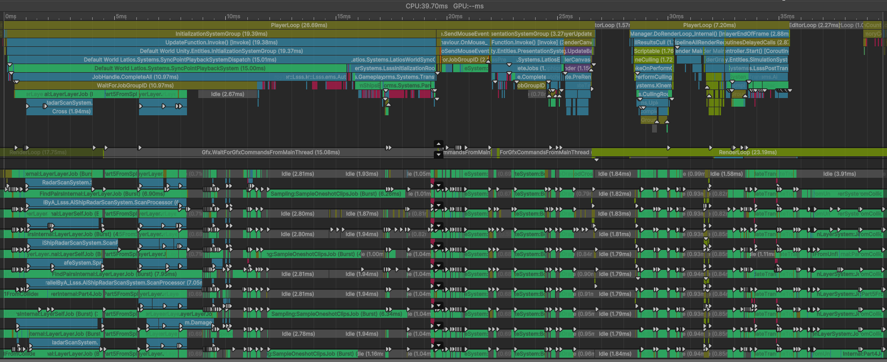
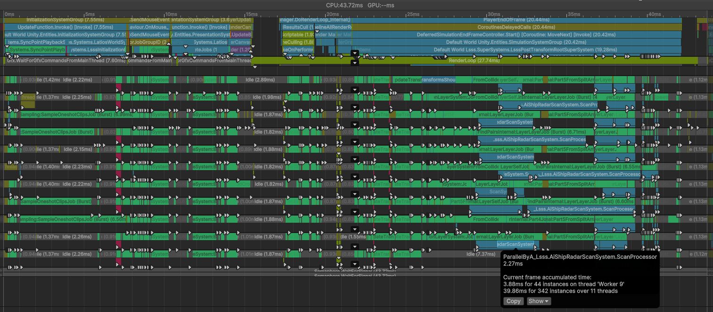
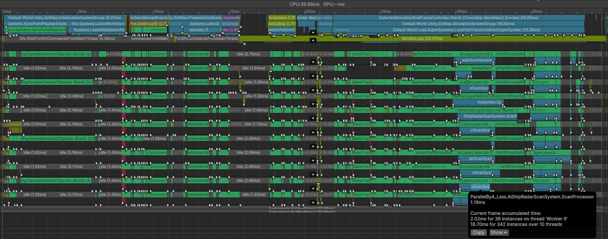
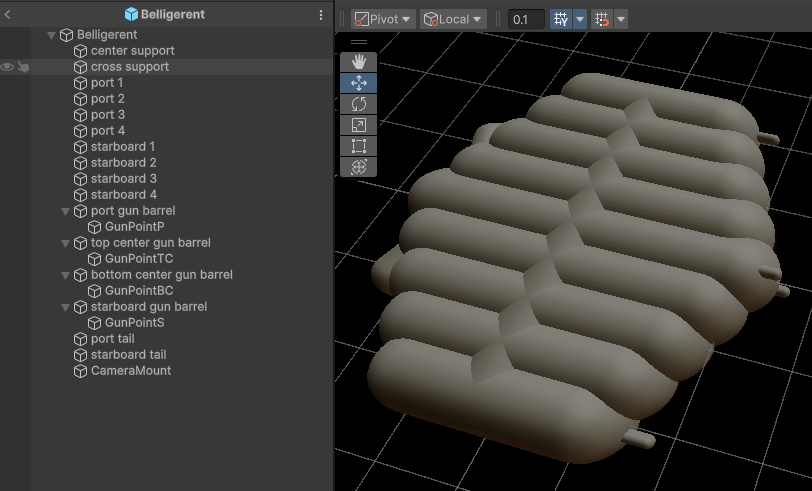
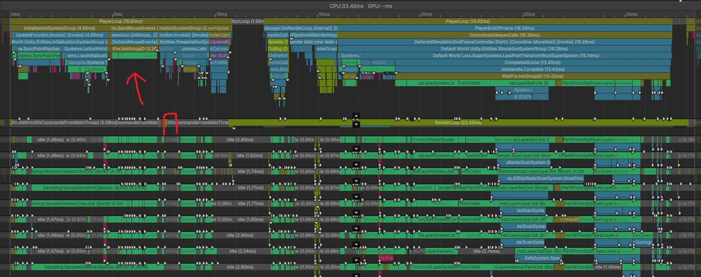
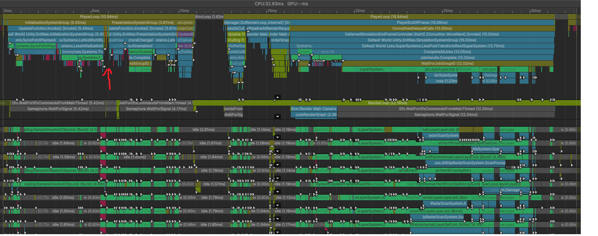
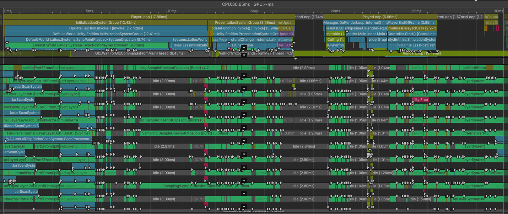

# Optimization Adventure 14 : Operation Reduction 1

Have you ever just decided to stop doing something because it felt unnecessary
and that time could be better spent on something else? Maybe your company
decided to do this. Or maybe you found a personal life hack.

Whatever the reason, we can do the similar things with our code. Not all the
work we do is necessary, and if we can find ways to cut some of it out, we can
increase the size of our simulation.

Our adventure brings us to LSSS, where we will be doing exactly that.

## Hold Your Fire

As always, we start by profiling. Here’s one frame:



Right at the beginning of the frame, we see that our main thread is stalled
waiting on a bunch of jobs. And without clicking on the jobs, we can see that a
heavy hitter it is waiting on is a FindPairs job for the AI radar scans.

Don’t worry, this isn’t another FindPairs optimization. When we last explored
FindPairs, we discovered that the radar scan spends a bunch of time in the
processor doing component lookups and other things. But what is this scan used
for?

```csharp
[BurstCompile]
[WithAll(typeof(AiTag))]
partial struct JobA : IJobEntity
{
    [ReadOnly] public ComponentLookup<AiShipRadarScanResults> scanResultsLookup;

    public void Execute(ref AiSearchAndDestroyOutput output, in AiSearchAndDestroyPersonality personality, in AiShipRadarEntity shipRadarEntity)
    {
        var scanResults = scanResultsLookup[shipRadarEntity.shipRadar];
        output.fire     = !scanResults.friendFound && scanResults.nearestEnemy != Entity.Null;

        if (scanResults.target != Entity.Null)
        {
            output.flyTowardsPosition = math.forward(scanResults.targetTransform.rot) * personality.targetLeadDistance + scanResults.targetTransform.pos;
            output.isPositionValid    = true;
        }
        else
        {
            output.isPositionValid = false;
        }
    }
}
```

The scan results are consumed by a simple `IJobEntity`. The job cares about a
tracked target that the ship is pursuing to ensure that target is still visible.
And it also cares if a friend or foe is in the crosshairs.

This job evaluates every frame. But if you think about it, why does the AI need
to decide to fire every frame? Every shot has multiple frames of cooldown, and
when all the shots are expired, there’s even more frames spent on reload. On all
these inactive frames, the only thing the AI cares about is having a tracked
target. And if it had a target the previous frame, and the target is still
visible in the current frame, there’s no reason to do a full FindPairs scan.

Let’s start by creating a system to inform the radar whether or not it needs to
consider firing in its scan. We’ll define this component and ensure it gets
baked:

```csharp
public struct AiShipRadarRequests : IComponentData
{
    public bool requestFriendAndNearestEnemy;
}
```

The reason we are using a bool here and not an `IEnableableComponent` is because
we want to do lookup writes in parallel, and doing so with the latter will do so
using atomic operations, which can be quite slow.

There’s one gotcha with this system, and that is that AI runs a frame in advance
of simulation, which means that it must predict whether the ship will be able to
fire the next frame. Fortunately, the logic is pretty simple:

```csharp
[BurstCompile]
[WithAll(typeof(AiTag))]
[WithAll(typeof(AiSearchAndDestroyPersonality))]
partial struct Job : IJobEntity
{
    [NativeDisableParallelForRestriction] public ComponentLookup<AiShipRadarRequests> requestsLookup;
    public float                                                                      dt;

    public void Execute(in ShipReloadTime gunState, in AiShipRadarEntity radarEntity)
    {
        var canFireNextFrame = dt >= math.select(gunState.bulletReloadTime, gunState.clipReloadTime, gunState.bulletsRemaining == 0);

        requestsLookup.GetRefRW(radarEntity.shipRadar).ValueRW.requestFriendAndNearestEnemy = canFireNextFrame;
    }
}
```

Next, in our `AiShipRadarScanSystem`, we’ll need the job that evaluates whether
or not we require a full scan, and if not, update the scan results with the
updated target transform. We’ll store the evaluation in a newly defined
`IEnableableComponent` `AiShipRadarNeedsFullScanFlag`. That job looks like this:

```csharp
[BurstCompile]
[WithOptions(EntityQueryOptions.IgnoreComponentEnabledState)]
[WithAll(typeof(AiRadarTag))]
partial struct EvaluateScanRequestsJob : IJobEntity
{
    [ReadOnly] public CollisionLayer                  wallLayer;
    [ReadOnly] public ComponentLookup<WorldTransform> worldTransformLookup;

    public void Execute(EnabledRefRW<AiShipRadarNeedsFullScanFlag> flag,
                        ref AiShipRadarScanResults results,
                        in WorldTransform transform,
                        in AiShipRadar radar,
                        in AiShipRadarRequests requests)
    {
        if (requests.requestFriendAndNearestEnemy)
        {
            flag.ValueRW = true;
            return;
        }

        if (radar.target != Entity.Null)
        {
            if (!worldTransformLookup.TryGetComponent(radar.target, out var targetTransform))
            {
                flag.ValueRW = true;
                return;
            }
            var  radarToTarget  = targetTransform.position - transform.position;
            bool outOfView      = math.lengthsq(radarToTarget) >= radar.distance * radar.distance;
            outOfView          |=
                math.dot(math.normalize(radarToTarget), math.forward(math.mul(transform.rotation, radar.crossHairsForwardDirectionBias))) <= radar.cosFov;

            if (outOfView || Physics.RaycastAny(transform.position, targetTransform.position, in wallLayer, out _, out _))
            {
                flag.ValueRW = true;
            }
            else
            {
                flag.ValueRW            = false;
                results.targetTransform = new RigidTransform(targetTransform.rotation, targetTransform.position);
            }
        }
        else
        {
            flag.ValueRW = true;
        }
    }
}
```

Now all that’s left is to update the rest of the system to account for our new
flag. Unfortunately, that’s a little easier said than done, since the system was
designed to operate on full chunks. We end up having to replace the
`CopyBackJob` with an `IJobEntity` version, since we can no longer rely on full
chunk array copies. But even more tricky, we now have to use `NativeLists`
instead of `NativeArrays` and not rely on `EntityQuery.CalculateEntityCount()`,
since doing so would now create a sync point.

However, since we still need to set the sizes of the `NativeLists`, I needed
something, and unfortunately Unity’s APIs break down here. I ended up using
`EntityQuery.ToEntityListAsync()` and then sized the other lists based on that.
It is not the most efficient, but it will hopefully be minor relative to the
FindPairs operations we are saving.

Anyways, to get more consistent profiling of individual features, I created an
artificial sync point at the end of the frame. Here is what it looks like before
this change:



And here is with the changes:



We cut our processor times in half! And as a result, we obtained a small but
measurable speedup.

### Friend or Foe?

So a 50% reduction is pretty good. It is enough that I am tempted to consider
optimizing other parts. However, I’d be lying if I said I wasn’t expecting a
little more gains than this. I’d like to understand the distribution of causes
for the full scans. So let me write a quick little job to collect the stats and
log it. Here’s one of the frames.

-   Full scans: 8799
-   Full scan requests: 8742
-   Ship is wandering: 1445
-   Promoted to full scan: 39
-   Requested scan found friend: 286

Most of the initial frames were like this. I had suspected that there would be a
lot of cases where ships were holding fire because an ally was in the way, but
this was only a small portion of the cases, certainly not worth trying to
optimize at this time.

It would seem that most of our full scans are actually triggered for shot
evaluation with a target already acquired. Most likely these ships are trying to
line up their shots. One potential optimization is that we reduce the Aabb to
the more limited crosshairs field-of-view. But the effectiveness of that depends
on each ship’s orientation. Perhaps we should revisit this at another time.

## Time for Some Welding

Looking for our next highest job in total time, we find a new culprit being
transforms, clocking in at 28 milliseconds across all threads.

No. We aren’t going to turn this in to a Transforms optimization. Instead, we
will try to reduce the number of transforms we need to update. For example, this
is the main ship of the Lacedars faction:



Most of those Game Objects are just visual capsules. And if that sounds like a
similar problem as last time where we had an entity per LOD level, that’s
because it is!

Kinemation has a good API for baking renderers that allows for manipulating
meshes and materials during baking, as we already saw. Combining renderables
should also be possible. We will have to somehow notify the default bakers to
let off and allow our combining baker to take control, but otherwise the only
challenge will be baking all the transforms into the meshes.

This optimization won’t just benefit transform updates either. Here are some
others that may be affected by this change:

-   UpdateChildBuffersJob – 2 milliseconds
-   UpdateDepthsJob – 4 milliseconds
-   CheckIfTransformsShouldUpdateForSingleDepthLevelJob – 12 milliseconds
-   MotionHistoryUpdateSystem – 12 milliseconds
-   BoundsJob – 15 milliseconds
-   UpdateDrawCommandFlagsJob – 7 milliseconds
-   SingleSplitCullingJob – 6 milliseconds
-   ExecuteGpuUploads – 5 milliseconds
-   SelectMmiRangeLodsSystem – 3 milliseconds

That’s 94 milliseconds worth in total!

Now, not all of these are from ships. Some are from spawners and bullets. But
there’s still a lot of potential savings here!

To understand how we’ll be doing this, we won’t be using any editor tool or
anything to combine the meshes. We’ll still have the same number of authoring
GameObjects. Instead, we’ll rely on Unity’s reference culling mechanism to make
some of the entities in the hierarchy go away.

In a baker, calling `GetEntity()` does more than just give you the entity to add
components to. It marks the entity as “referenced”. If an entity is never marked
referenced by the end of baking, it is removed from the subscene. Additionally,
if an entity is marked as requiring a parent, then all ancestors will be marked
referenced. So if you have a dynamic root, several generations of empty
entities, and then a renderable, all those empty generations will still be
baked. For the ship above, the gun barrels will still be referenced even if the
rendering was moved elsewhere. But for now, that’s okay. We don’t want to
completely eliminate transforms, as that would defeat one of the purposes of
LSSS.

Anyways, we need to define a list of renderers we want to combine, and somehow
prevent other bakers from trying to bake the renderers. I came up with a new
MonoBehaviour base type to do this, which allows the authoring code to look like
this:

```csharp
public class RendererCombinerAuthoring : OverrideHierarchyRendererBase
{
    public List<MeshRenderer> meshRenderers;

    public override bool ShouldOverride(IBaker baker, Renderer renderer)
    {
        if (meshRenderers == null)
            return false;

        if (renderer is MeshRenderer meshRenderer)
        {
            foreach (var mr in meshRenderers)
            {
                if (mr == meshRenderer)
                    return true;
            }
        }
        return false;
    }
}
```

All other renderer bakers will look for the `OverrideHierarchyRendererBase` in
the ancestry, and call `ShouldOverride()` to see if they should stop trying to
bake.

The actual baking code is quite complex, so I will simply show the mesh
transformation part:

```csharp
var transform = AbstractBakingUtilities.ExtractTransformRelativeTo(childRendererTransform, combinerTransform);
var positions = mesh.vertices;
var normals   = mesh.normals;
var tangents  = mesh.tangents;

for (int i = 0; i < positions.Length; i++)
{
    positions[i]   = qvvs.TransformPoint(in transform, positions[i]);
    normals[i]     = qvvs.TransformDirectionWithStretch(in transform, normals[i]);
    float4 tangent = tangents[i];
    tangent.xyz    = qvvs.TransformDirectionWithStretch(in transform, tangent.xyz);
    tangents[i]    = tangent;
}
```

One thing to note about my first implementation, I’m not actually combining
meshes into a single mesh object. Instead, I am packing all the meshes and
materials into a single entity. That does mean our GenerateBrgDrawCommandsSystem
will still have as many meshes and materials to process, and we still suffer
some overhead from that. But here’s what the newest capture looks like:


That’s 6.5 milliseconds faster!

We’re starting to reach territory where the sync point shrinks with each
optimization. Now our Myri jobs are outliving the sync point. We may have to
calibrate the settings of those to something a little more appropriate for all
the optimizations we’ve applied.

Here’s how all the various jobs compared:

|                                                     | Before (ms) | After (ms) | Speedup |
|-----------------------------------------------------|-------------|------------|---------|
| UpdateTransformsOfSingleDepthLevelJob               | 28          | 22.5       | 1.2     |
| UpdateChildBuffersJob                               | 2           | 1          | 2.0     |
| UpdateDepthsJob                                     | 4           | 3.6        | 1.1     |
| CheckIfTransformsShouldUpdateForSingleDepthLevelJob | 12          | 6          | 2.0     |
| MotionHistoryUpdateSystem                           | 12          | 6          | 2.0     |
| BoundsJob                                           | 15          | 8          | 1.9     |
| UpdateDrawCommandFlagsJob                           | 7           | 3          | 2.3     |
| SingleSplitCullingJob                               | 6           | 3          | 2.0     |
| ExecuteGpuUploads                                   | 5           | 1.5        | 3.3     |
| SelectMmiRangeLodsSystem                            | 3           | 0.8        | 3.8     |

Curiously, the transform hierarchy update saw the least improvement. It seems we
didn’t actually remove that many transform hierarchy entities. But what we did
remove was a lot of renderer entities, which is where we are seeing more
significant speedups.

Why are we removing so few entities?

Because ships shoot bullets.

The ship firing system uses a dynamic buffer of entity references to spawn
points for the bullets. These transforms still need to stick around, even though
they don’t serve any other function. There are also a couple other utility child
entities such as the radar and camera points. While we could employ more
techniques to further reduce the entity count, at this point I feel the problem
is localized enough to warrant a dedicated optimization effort towards
transforms.

But not right now.

Right now, we need to scout out the remaining big hitters.

## Byte the Bullets

Looking at the profiler, we see some new bottlenecks start to emerge. It has
become evident we are losing about 4 milliseconds to job syncing in and before
the `PresentationSystemGroup`. Eliminating those would knock out a bit of idle
time. However, lurking in the shadows is another monster.

-   BuildBulletCollisionLayerSystem
    -   Job – 14 milliseconds
    -   Part1FromColliderBodyArrayJob – 8 milliseconds
    -   Part4Job – 11 milliseconds
    -   Part5FromSplitArraysJob – 16 milliseconds

That’s 49 milliseconds just to build the CollisionLayer for bullets! We spend
more time building the layer than we spend using it!

Most of those jobs are Psyshock jobs, and our focus right now is on removing
unnecessary work. So let’s first look at the LSSS-specific setup job.

```csharp
[BurstCompile]
partial struct Job : IJobEntity
{
    public NativeArray<ColliderBody> bodies;

    public void Execute(Entity entity,
                        [EntityIndexInQuery] int entityInQueryIndex,
                        in WorldTransform worldTransform,
                        in Collider collider,
                        in PreviousTransform previousPosition)
    {
        CapsuleCollider capsule     = collider;
        float           tailLength  = math.distance(worldTransform.position, previousPosition.position);
        capsule.pointA              = capsule.pointB;
        capsule.pointA.z           -= math.max(tailLength, math.EPSILON);

        bodies[entityInQueryIndex] = new ColliderBody
        {
            collider  = capsule,
            entity    = entity,
            transform = worldTransform.worldTransform
        };
    }
}
```

That’s… not a lot of work.

Why does this take so long?

Let’s count bytes. For inputs, an `entity` takes 8, the `worldTransform` takes
48, `collider` takes 48, and `previousPosition` also takes 48. That’s 152 bytes.
And then we are writing out 104 bytes, for a total bandwidth of 256 bytes per
entity.

This smells like a memory bandwidth bottleneck.

And here’s `Part1FromColliderBodyArrayJob`:

```csharp
[BurstCompile]
public struct Part1FromColliderBodyArrayJob : IJob, IJobParallelForDefer
{
    [ReadOnly] public CollisionLayer            layer;
    [NoAlias] public NativeArray<int>           layerIndices;
    [ReadOnly] public NativeArray<ColliderBody> colliderBodies;
    [NoAlias] public NativeArray<Aabb>          aabbs;
    [NoAlias] public NativeArray<float2>        xMinMaxs;

    public void Execute()
    {
        for (int i = 0; i < colliderBodies.Length; i++)
            Execute(i);
    }

    public void Execute(int i)
    {
        var aabb    = Physics.AabbFrom(colliderBodies[i].collider, colliderBodies[i].transform);
        aabbs[i]    = aabb;
        xMinMaxs[i] = new float2(aabb.min.x, aabb.max.x);

        int3 minBucket = math.int3(math.floor((aabb.min - layer.worldMin) / layer.worldAxisStride));
        int3 maxBucket = math.int3(math.floor((aabb.max - layer.worldMin) / layer.worldAxisStride));
        minBucket      = math.clamp(minBucket, 0, layer.worldSubdivisionsPerAxis - 1);
        maxBucket      = math.clamp(maxBucket, 0, layer.worldSubdivisionsPerAxis - 1);

        if (math.any(math.isnan(aabb.min) | math.isnan(aabb.max)))
        {
            layerIndices[i] = IndexStrategies.NanBucketIndex(layer.cellCount);
        }
        else if (math.all(minBucket == maxBucket))
        {
            layerIndices[i] = IndexStrategies.CellIndexFromSubdivisionIndices(minBucket, layer.worldSubdivisionsPerAxis);
        }
        else
        {
            layerIndices[i] = IndexStrategies.CrossBucketIndex(layer.cellCount);
        }
    }
}
```

This job reads in per-entity the 104 bytes of `ColliderBody` and writes out 32
bytes of AABB data plus 4 bytes for the bucket index. That totals 140 bytes
per-entity. But there’s also a bit more computation in this job. So the fact
that this job takes 8 milliseconds while the previous one takes 14 confirms our
suspicion that memory usage is a problem.

Are we wasting memory?

Yes. Yes we are.

We have a 48-byte union `Collider` as input, but we explicitly interpret it as a
`CapsuleCollider`, which only requires 32 bytes. That’s 16 bytes right there.
Additionally, we completely overwrite the first point in the capsule without
caring about the original, so that’s another 12 bytes. And 4 of those bytes are
the stretch mode plus padding. We can hard-code the stretch mode and ditch the
padding, thus bringing the total required bytes down to 16. And as one last
optimization, we can ditch 8 of those bytes by assuming the z-axis passes
directly through the middle of the bullet. We save 40 bytes this way.

That’s a good start, but we can do better.

What if we computed the `Aabb` inside the `IJobEntity`?

This would reduce our `IJobEntity` memory savings down to only 16 bytes.
However, then we would run this job:

```csharp
[BurstCompile]
public struct Part1FromDualArraysJob : IJob, IJobParallelForDefer
{
    [ReadOnly] public CollisionLayer     layer;
    [NoAlias] public NativeArray<int>    layerIndices;
    [ReadOnly] public NativeArray<Aabb>  aabbs;
    [NoAlias] public NativeArray<float2> xMinMaxs;

    public void Execute()
    {
        for (int i = 0; i < aabbs.Length; i++)
            Execute(i);
    }

    public void Execute(int i)
    {
        ValidateOverrideAabbsAreRightLength(aabbs, layerIndices.Length);

        var aabb    = aabbs[i];
        xMinMaxs[i] = new float2(aabb.min.x, aabb.max.x);

        int3 minBucket = math.int3(math.floor((aabb.min - layer.worldMin) / layer.worldAxisStride));
        int3 maxBucket = math.int3(math.floor((aabb.max - layer.worldMin) / layer.worldAxisStride));
        minBucket      = math.clamp(minBucket, 0, layer.worldSubdivisionsPerAxis - 1);
        maxBucket      = math.clamp(maxBucket, 0, layer.worldSubdivisionsPerAxis - 1);

        if (math.any(math.isnan(aabb.min) | math.isnan(aabb.max)))
        {
            layerIndices[i] = IndexStrategies.NanBucketIndex(layer.cellCount);
        }
        else if (math.all(minBucket == maxBucket))
        {
            layerIndices[i] = IndexStrategies.CellIndexFromSubdivisionIndices(minBucket, layer.worldSubdivisionsPerAxis);
        }
        else
        {
            layerIndices[i] = IndexStrategies.CrossBucketIndex(layer.cellCount);
        }
    }
}
```

In this job, we read in the 24-byte `AABB`, and write out 8 bytes of extra AABB
info as well as the 4-byte bucket index. That’s a total of 36 bytes, a lot less
than 140. Combined, we would eliminate 120 bytes out of 296.

So now we have a new component for our bullet:

```csharp
public struct BulletCollider : IComponentData
{
    public float headOffsetZ;
    public float radius;
}
```

And our job now looks like this:

```csharp
[BurstCompile]
partial struct Job : IJobEntity
{
    public NativeArray<ColliderBody> bodies;
    public NativeArray<Aabb>         aabbs;

    public void Execute(Entity entity,
                        [EntityIndexInQuery] int entityInQueryIndex,
                        in WorldTransform worldTransform,
                        in BulletCollider collider,
                        in PreviousTransform previousPosition)
    {
        var             pointB      = new float3(0f, 0f, collider.headOffsetZ);
        CapsuleCollider capsule     = new CapsuleCollider(pointB, pointB, collider.radius);
        float           tailLength  = math.distance(worldTransform.position, previousPosition.position);
        capsule.pointA.z           -= math.max(tailLength, math.EPSILON);

        bodies[entityInQueryIndex] = new ColliderBody
        {
            collider  = capsule,
            entity    = entity,
            transform = worldTransform.worldTransform
        };
        aabbs[entityInQueryIndex] = Physics.AabbFrom(capsule, worldTransform.worldTransform);
    }
}
```

And the results?

A couple hundred microseconds for the `IJobEntity`. And `Part1FromDualArraysJob`
is down to 2 milliseconds.

We saved about 6 milliseconds across all threads with this change, which
unfortunately wasn’t enough to show up in total frame times, at most only
shaving off a couple hundred microseconds.

## We Don’t Need Your Stupid Events

Back to our profiler capture, this was bothering me:



There’s a sync point here, which is resulting in a small gap where the worker
threads are starved. This sync point is on the `GameObjectEntity` transform
sync, which is synchronizing with the camera. And we can see that an engine
mechanism called `PreUpdate.SendMouseEvents` is demanding the synchronization.

Why do mouse events need to synchronize transforms?

There’s two possible explanations. Either Unity’s internal engine code is a
mess, or the events are defensively interacting with the specific transform that
belongs to the `GameObjectEntity`.

Well, after researching what these mouse events even are, I learned that they
can be received by the camera, and that the camera has a way to disable all
events. I added this line inside `SetCameraDrawDistanceSystem`:

```csharp
camera.eventMask = 0;
```



No sync point! This combined with our bullet optimization has started to show a
dent in the frame times, albeit a small one.

## Conclusion

Without the artificial sync point, here’s where we are at:



That’s right. 25% of our total frame processing has been eliminated with our
changes!

We were able to achieve this by strategically bypassing spatial queries,
combining multiple meshes into a single entity, reducing memory bandwidth by
redistributing job work, and eliminating unnecessary engine activities.

There is certainly more we can eliminate, but the biggest bottlenecks remaining
require other flavors of optimizations. Sync points seem to be especially
troublesome at the moment.

But it will be a different moment when we solve those. In the meantime, enjoy a
faster LSSS!

## Try It Yourself

This optimization adventure was developed completely within LSSS and its final
results have been committed and pushed. Feel free to clone the project and
experiment with the optimizations yourself.
