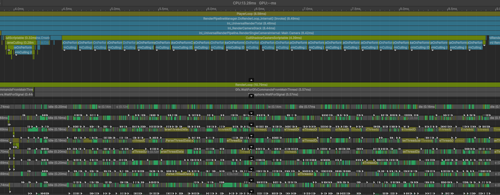

# Optimization Adventures: Part 15 – Frustum Culling 2

*The loops go marching one-by-one per light, per frame.*

*The loops go marching one-by-one per light, per frame.*

*I wish they’d go marching two-by-two,*

*But I’m stuck with an engine that starts with U.*

*So now we optimize, every job, every light, every frame. Hmm, Hmm, Huh…*

Well, it is time for a new installment of an Optimization Adventure. And this
one is a little different. For the first time, we’re actually exploring a
community-member’s project! Yes, anyone can send me a project using the Latios
Framework that is encountering performance problems, and I will do what I can to
optimize.

And to kick things off, we have quite a challenging one, largely due to Unity’s
engine-side not being as scalable as we would like. As you will see, we are
going to be employing all sorts of tactics for this one, from
micro-optimizations scratching at microseconds to large architectural refactors
aimed at reducing work.

Prepare yourself for a ride, because we are taking off!

## Lights, Shadows, and Way Too Much Action

The test scene is a stripped-down version of the use case the concerned
community member encountered. It is a NetCode project, which means we are
currently using Unity Transforms mode. But the scene itself is not terribly
large. The project also came without any code, so we should have very cheap
frames.



That is a lot of shadow-casting lights. And consequently, a lot of culling
passes. Just on these culling passes Unity takes 3.5-5.5 milliseconds per frame.
But this project was sent accidentally omitting the Latios NetCode Bootstrap. If
we add that, we get this:


That’s even worse!

To be honest, this is expected. Kinemation tries a lot harder than Unity
Graphics to reduce GPU work. However, that does mean a couple tenths of a
millisecond per culling pass. Many projects only have two or three culling
passes. But this project is pushing the pass count quite high.

My first instinct would be to somehow try to combine passes. Unfortunately, this
is a quirk of the Unity Engine, and every shadow-casting light is given to us
one-by-one. We could potentially modify URP and HDRP to give them all at once
early, but that’s a last resort. Let’s first pick any low-hanging fruits.

## Flat-Footed Callbacks

If we zoom in on one of these culling passes, we find each pass takes
approximately 350 microseconds. And while it is easy to stare at the more
expensive systems in the profiler, I want to instead draw attention to something
I suspect most people would overlook.


Each of these areas are outside the `KinemationCullingSuperSystem`, and are part
of the `LatiosEntitiesGraphicsSystem` callback. And combined, these areas take
60 microseconds, which is 1/6th of our culling pass! That’s expensive. So let’s
add a few more profiler markers and figure out why.

-   Before Constructing Culling Splits – 17 microseconds
-   Constructing Culling Splits – 7 microseconds
-   After Constructing Culling Splits – 6 microseconds
-   After Culling Systems – 9 microseconds, but sometimes 28

So, first off, the tail-end is not as big of a deal anymore. I did change the
profiling to use static markers, and that seems to have helped. Now there are a
couple of callbacks that have more expensive tail-ends. But overall, this isn’t
scaling significantly with light count.

However, that’s still 40 microseconds, which for 25 lights still ends up
consuming a full millisecond. My first tactic here will be to move as much of
the logic to Burst static methods. Basically, I collect all the arguments,
system members, and other properties from managed types and put them all into a
struct. Then I send the pointer to the struct to the Burst static method. The
callback method now looks like this:

```csharp
private unsafe JobHandle OnPerformCulling(BatchRendererGroup rendererGroup, BatchCullingContext batchCullingContext, BatchCullingOutput cullingOutput, IntPtr userContext)
{
    using var callbackMarker = m_latiosPerformCullingMarker.Auto();

    var setup = new BurstCullingSetup
    {
        wrappedIncludeExcludeList       = new WrappedPickingIncludeExcludeList(batchCullingContext.viewType),
        entityManager                   = EntityManager,
        worldBlackboardEntity           = worldBlackboardEntity,
        cullPassIndexThisFrame          = m_cullPassIndexThisFrame,
        globalSystemVersionAtLastUpdate = m_globalSystemVersionAtLastUpdate,
        lastSystemVersionAtLastUpdate   = m_LastSystemVersionAtLastUpdate,
        batchCullingContext             = batchCullingContext,
        shadowProjection                = QualitySettings.shadowProjection,
        threadLocalAllocators           = m_ThreadLocalAllocators,
        filterSettings                  = m_FilterSettings,
        brgRenderMeshArrays             = m_registerMaterialsAndMeshesSystem.BRGRenderMeshArrays,
        cullingOutput                   = cullingOutput,

        m_beforeCreateSplitsMarker = m_beforeCreateSplitsMarker,
        m_createSplitsMarker       = m_createSplitsMarker,
        m_afterCreateSplitsMarker  = m_afterCreateSplitsMarker
    };
    if (!DoBurstCullingSetup(&setup))
        return default;

    SuperSystem.UpdateSystem(latiosWorldUnmanaged, m_cullingSuperSystem.SystemHandle);

    var finalize = new BurstCullingFinalize
    {
        latiosWorldUnmanaged           = latiosWorldUnmanaged,
        cullingCallbackFinalJobHandles = m_cullingCallbackFinalJobHandles,
        finalHandle                    = default,

        m_afterCullingMarker = m_afterCullingMarker,
    };
    DoBurstCullingFinalize(&finalize);

    m_cullPassIndexThisFrame++;

    return finalize.finalHandle;
}
```

-   Before Constructing Culling Splits – 6 microseconds
-   Constructing Culling Splits – 6 microseconds
-   After Constructing Culling Splits – 1 microsecond
-   After Culling Systems – 2 microseconds

So that’s another roughly 20 microseconds saved!

What? Not impressed?

What if I told you that we want from over 10 milliseconds per frame of culling
passes to under 8.5 milliseconds?

Yeah. This microseconds matter!

Is there more we can do here? Maybe. But further changes would likely be a lot
more invasive. So we should plan on revisiting this later.

## Unity Can’t Handle the Truth

It is no secret that Unity’s job system is slow. Consequently, systems that
schedule jobs are slow. And when the main thread is spending 24 microseconds on
the culling system, we have to ask where is that time going? This is a pretty
simple system, with a collection component fetch, a `NativeList` allocation
based on an `EntityQuery` chunk count, a component lookup, and two scheduled
jobs. Anyways, here’s the profiler breakdown:


The CL label is our component lookup, and it is tiny compared to everything
else. But also, most of the system time isn’t even in the `OnUpdate()` method.
Instead it appears most of the time is spent after the system updates! Here’s
the code from Unity’s SystemState.cs:

```csharp
internal void AfterOnUpdate()
{
    AfterUpdateVersioning();
    // If m_JobHandle isn't the default we have scheduled some jobs (and they haven't been sync'd),
    // and need to batch them up or register them.
    // This is a big optimization if we only Run methods on main thread...
    if (!m_JobHandle.Equals(default(JobHandle)))
    {
        JobHandle.ScheduleBatchedJobs();
        m_JobHandle = m_DependencyManager->AddDependency(m_JobDependencyForReadingSystems.Ptr,
            m_JobDependencyForReadingSystems.Length, m_JobDependencyForWritingSystems.Ptr,
            m_JobDependencyForWritingSystems.Length, m_JobHandle);
    }
}
```

The `m_DependencyManager->AddDependency()` might appear to be the main culprit
here, but don’t be deceived. That method is simply assigning `JobHandles` to
arrays with the occasional combine operation (every 16 or so). Yet we see the
long after-update times consistently on every culling pass.

The actual culprit here is `ScheduleBatchedJobs()`. Unfortunately, there’s not
much we can do about that.

However, getting a collection component is taking 3 whole microseconds? That
seems like something we can fix. I’d expect this to be as fast as our normal ECS
component lookup.

In the hot path of getting a collection component, finding the actual component
is a single hashmap lookup. That can’t be our issue. Rather, I think it is what
happens after, which is this method:

```csharp
public void CompleteOrMergeDependencies(bool isReadOnly, ref FixedList512Bytes<JobHandle> readHandles, ref JobHandle writeHandle)
{
    if (!m_executingSystemStack.IsEmpty && m_executingSystemStack[m_executingSystemStack.Length - 1] == m_worldUnmanaged.GetCurrentlyExecutingSystem())
    {
        ref var state = ref m_worldUnmanaged.ResolveSystemStateRef(m_executingSystemStack[m_executingSystemStack.Length - 1]);
        if (isReadOnly)
        {
            state.Dependency = JobHandle.CombineDependencies(state.Dependency, writeHandle);
        }
        else
        {
            var handleArray = new NativeArray<JobHandle>(readHandles.Length + 2, Allocator.Temp);
            handleArray[0]  = state.Dependency;
            handleArray[1]  = writeHandle;
            for (int i = 0; i < readHandles.Length; i++)
                handleArray[i + 2] = readHandles[i];
            state.Dependency       = JobHandle.CombineDependencies(handleArray);
        }
    }
    else
    {
        if (isReadOnly)
        {
            writeHandle.Complete();
            writeHandle = default;
        }
        else
        {
            var handleArray = new NativeArray<JobHandle>(readHandles.Length + 1, Allocator.Temp);
            handleArray[0]  = writeHandle;
            for (int i = 0; i < readHandles.Length; i++)
                handleArray[i + 1] = readHandles[i];
            JobHandle.CompleteAll(handleArray);
            writeHandle = default;
            readHandles.Clear();
        }
    }
}
```

Every single code path either involves completing a job or combining job
handles. Which means this method always goes to engine code. And engine code
seems to be slow. But what if the `JobHandle` we need to merge or complete is
actually just a default handle, because we initialized the collection component
on the main thread during our culling setup?

We should add a fast path for that.

```csharp
if (writeHandle.Equals(default(JobHandle))
{
    if (isReadOnly || readHandles.IsEmpty)
        return;
}
```

That brought the cost down to something a little more reasonable. Although this
had a negligible impact on the overall frame times.

But to drive the point home about just how bad Unity’s job scheduling
performance is, take a look at this breakdown of
`GenerateBrgDrawCommandsSystem`:


Most of the jobs in the system are scheduled in the `JobsBeforeCombined` region.
However, as soon as the system starts calling `JobHandle.CombineDependency()`,
bad things happen.

We will have to investigate possible options for this later. But for now, our
best bet is to keep shaving off the little bits where we can.

## Burst Flexin’

You probably already noticed it in the previous profile captures, but
UploadMaterialPropertiesSystem is eating up a good chunk of our update. This is
a managed system that updates three times per pass, doing different things each
time. The reason for this is that it is responsible for sending data to the GPU,
which typically requires three steps.

1.  Collect data pointers and counts for uploading GPU data
2.  Allocate graphics buffers and write to them
3.  Dispatch compute shaders

Between each step, jobs need to be synced on the main thread. For this reason, I
schedule the steps in a round-robin fashion. Thus, the work gets spread out over
three separate updates. Here’s what that looks like in the profiler:


In this particular pass, the first update takes 55 microseconds, the second
update takes 22, and the third takes 5.

That’s a lot. Especially the first update. It must be scheduling a lot of jobs,
right?

It schedules 2 jobs.

The second update schedules more, scheduling 3. So where is all that time going?

Well, I decided to do some major refactoring, and this is what I got when I was
done:


That’s 41, 11, and 4 microseconds respectively!

How did I pull this off?

Look at the colors. They are green. I Burst-compiled this system.

Let me remind you, this system is responsible for working with graphics buffers
and dispatching compute shaders, which are all class types. And I didn’t move
these things out.

So what did I do?

I figured out how to call Mono from within Burst. And I’m going to detail it
step-by-step.

### Calling Mono from Burst

The first step is we need to define a delegate for our mono method. You could
follow these steps for every single managed method you want access to, but I
personally prefer to have a single mono method handle multiple different
operations. So I use the same context pointer and operation code pattern that I
use for source-generated types. With the delegate defined, I also declare a
static instance.

```csharp
private delegate void ManagedDelegate(IntPtr context, int operation);
static ManagedDelegate managedDelegate;
```

Next, we need an instance of a `FunctionPointer` for our managed delegate.

```csharp
public FunctionPointer<ManagedDelegate> managedFunctionPtr;
```

My instance lives inside a struct, of which I have made a `SharedStatic<>`.
Effectively, I’m bundling multiple static variables into a single
`SharedStatic<>`. I’ll get to what the other static variables are later.

I need the actual method defined for the next part. So here is the outline of
it:

```csharp
[MonoPInvokeCallback(typeof(ManagedDelegate))]
static void ManagedExecute(IntPtr context, int operation)
{
    try
    {
        switch (operation)
        {
            // ...
        }
    }
    catch (Exception e)
    {
        UnityEngine.Debug.LogException(e);
    }
}
```

First, there’s the attribute, which is the same as how we’d do Burst function
pointers. Then, we have to make sure we consume any exceptions thrown, since
Burst won’t know what to do with them. Now, for the magic, we can assign our
mono method delegate to the Burst-friendly `FuncitonPointer<>` type!

```csharp
managedDelegate                 = ManagedExecute;
handles.Data.managedFunctionPtr = new FunctionPointer<ManagedDelegate>(Marshal.GetFunctionPointerForDelegate<ManagedDelegate>(ManagedExecute));
```

This is in an `Initialize()` method that initializes all the values inside
`handles`, which is our `SharedStatic<>` instance. We first copy the method
delegate into our managed static delegate. This keeps the delegate status alive
to avoid GC. Since we have ensured the delegate remains alive, we can then grab
a function pointer from it using the `Marshal` class.

Burst knows how to invoke `FunctionPointers`. But unlike a Burst-compiled
`FunctionPointer`, this one is raw Mono and can do things with classes and such.
With a little bit of C\# magic, we can abstract all this into something really
beautiful. Let me show you!

Our goal is to perform a compute shader dispatch from within a Burst context. We
can define a context struct that provides our arguments:

```csharp
// Code 7
struct ComputeShaderDispatchContext
{
    public UnityObjectRef<ComputeShader> computeShader;
    public int                           kernelIndex;
    public int                           threadGroupsX;
    public int                           threadGroupsY;
    public int                           threadGroupsZ;
    public bool                          success;
}
```

This struct is fully unmanaged, but contains a wrapped `ComputeShader` instance
via `UnityObjectRef`. We can invoke our dispatch inside the mono method like
this:

```csharp
case 7:
{
    ref var       ctx    = ref *(ComputeShaderDispatchContext*)context;
    ComputeShader shader = ctx.computeShader;
    shader.Dispatch(ctx.kernelIndex, ctx.threadGroupsX, ctx.threadGroupsY, ctx.threadGroupsZ);
    ctx.success = true;
    break;
}
```

You’ll notice we implicitly cast the `UnityObjectRef` to the actual managed
`ComputeShader`. We can do this because we are in mono land now.

For invoking our mono method, I put together this little utility. This avoids GC
allocations if we end up trying to invoke things while we are already in mono.

```csharp
static void DoManagedExecute(IntPtr context, int operation)
{
    bool didIt = false;
    ManagedExecuteFromManaged(context, operation, ref didIt);

    if (!didIt)
        handles.Data.managedFunctionPtr.Invoke(context, operation);
}

[BurstDiscard]
static void ManagedExecuteFromManaged(IntPtr context, int operation, ref bool didIt)
{
    didIt = true;
    ManagedExecute(context, operation);
}
```

Now, for the final step that makes this all clean, we’ll define an extension
method for `UnityObjectRef<ComputeShader>` that performs the full setup and
invocation.

```csharp
public static void Dispatch(this UnityObjectRef<ComputeShader> computeShader, int kernelIndex, int threadGroupsX, int threadGroupsY, int threadGroupsZ)
{
    var context = new ComputeShaderDispatchContext
    {
        computeShader = computeShader,
        kernelIndex   = kernelIndex,
        threadGroupsX = threadGroupsX,
        threadGroupsY = threadGroupsY,
        threadGroupsZ = threadGroupsZ,
        success       = false
    };
    DoManagedExecute((IntPtr)(&context), 7);

#if ENABLE_UNITY_COLLECTIONS_CHECKS
    if (!context.success)
        throw new System.InvalidOperationException("Dispatching the Compute Shader failed.");
#endif
}
```

This means we can now invoke the `Dispatch()` method on the `UnityObjectRef` as
if it were the object itself, all from within a Burst-compiled `OnUpdate()`.

```csharp
ComputeShader managedInstance = default;
UnityObjectRef<ComputeShader> unmanagedInstance = default;

managedInstance.Dispatch(0, 1, 1, 1);
unmanagedInstance.Dispatch(0, 1, 1, 1);
```

See? It is the same syntax!

### That’s Not an Object!

Unfortunately, `GraphicsBuffer` is not inherit `UnityEngine.Object`, which means
we can’t store it inside a `UnityObjectRef`. How do we deal with this? Well,
that what the other statics in our `SharedStatic` are for!

I made a static managed `List<GraphicsBuffer>` that will serve as a reference
pool. I’m not pooling actual instances, but rather I am pooling locations where
I can reference the instances, with those locations being elements in the list.
All of the lifecycle management happen Burst-side, using an index-version handle
scheme and a freelist, similar to how Unity represents entities.

We have a `GraphicsBufferUnmanaged` type. When you invoke its constructor, it
consults the `SharedStatic` `UnsafeList` instances to find an unused index.
Then, it passes that index to the mono method along with the constructor
arguments to create the actual `GraphicsBuffer` object and store it in the
`List`.

Later, we can refer to it in the mono method by its list index, and have the
mono method fetch it when needed, such as when assigning it to a property of a
compute shader.

But there’s one more curveball with `GraphicsBuffer`. In DOTS, we prefer to
invoke `LockBufferForWrite<>()` which is a generic method that gives us a
`NativeArray<>` of the same type. But unless we define every single possible
type, our mono method has no way to make sense of this.

Fortunately, the solution is actually really simple. The mono method always
assumes we use the method with byte, and the extension methods performs the
`NativeArray<>.Reinterpret<>() `and size compensation logic so that from a
user’s perspective, it seems to work the same way.

### Unity Doesn’t Compromise on Safety

We got some performance improvements from things being Burst-compiled. However,
there’s still 41 microseconds just to schedule 2 jobs, even with Burst. What is
going on?

I decided to break things down with a bunch of profiler markers again, and I
noticed something weird.

```csharp
m_burstCompatibleTypeArray.Update(ref state);
```

That line takes twice as long as constructing the job struct, the latter
requires copying the entire type array over. Updating each handle looks like
this:

```csharp
public unsafe void Update(ref SystemState state)
{
#if ENABLE_UNITY_COLLECTIONS_CHECKS
    m_Safety0 = state.m_DependencyManager->Safety.GetSafetyHandleForDynamicComponentTypeHandle(m_TypeIndex, IsReadOnly);
    int numHandles = IsReadOnly ? m_SafetyReadOnlyCount : m_SafetyReadWriteCount;
    if (numHandles > 1)
        m_Safety1 = state.m_DependencyManager->Safety.GetBufferHandleForBufferTypeHandle(m_TypeIndex);
#endif
    m_GlobalSystemVersion = state.GlobalSystemVersion;
}
```

Safety checks are off, so it should just be the last line where we set the
version. That’s a single integer. A bunch of these should not be more expensive
than copying the entire struct!

Time to look at the Burst Inspector!


Huh…

I guess disabling safety checks doesn’t apply to safety handles on the main
thread. That means that we’d have to make a build to profile if we wanted to see
the full impacts of our optimizations.

Builds take a long time, and I don’t have that kind of time when iterating. So
we’re just going to leave that be. Micro-optimizations won’t be effective here,
so we must look for different strategies to optimize. I happen to have an idea.

## One Thread to Rule Them All

Remember how Unity’s job system is causing us a lot of problems? What if we had
fewer jobs?

Specifically, `GenerateBrgDrawCommandsSystem` is scheduling a lot of jobs, many
of which come directly from the Entities Graphics package. Is there a way to
combine them?

Yes there is.

However, the only reliable way to do so is to make many of the jobs
single-threaded. That’s usually not a good thing, but in smaller scenes or
more-specifically, scenes with smaller lights, this may be a beneficial
tradeoff. We’ll have to make an option for it.

The simplest way to do this is to make an `IJob`, copy the bulk of the job
scheduling into the `Execute()` method, and then replace those schedules with
immediate execution.

But of course, it can’t be that simple! Unity won’t allow for it!

Some of the jobs scheduled by Unity are actually private jobs scheduled by
methods that the main thread calls on intermediate structures. Two of these
instances occur right after EmitDrawCommandsJob and form a continuous job chain.
EmitDrawCommandsJob is already a heavy `IJobChunk`, so it might be nice to leave
that be. So to start with, we’ll only concern ourselves with the jobs after
Unity’s pesky private job methods.

There’s one more of these pesky schedule methods though, specifically the final
disposer:

```csharp
public JobHandle Dispose(JobHandle dependencies)
{
    // First schedule a job to release all the thread local arrays, which requires
    // that the data structures are still in place so we can find them.
    var releaseChunkDrawCommandsDependency = new ReleaseChunkDrawCommandsJob
    {
        DrawCommandOutput = this,
        NumThreads = kNumReleaseThreads,
    }.Schedule(kNumReleaseThreads, 1, dependencies);

    // When those have been released, release the data structures.
    var disposeDone = new JobHandle();
    disposeDone = JobHandle.CombineDependencies(disposeDone,
        ThreadLocalDrawCommands.Dispose(releaseChunkDrawCommandsDependency));
    disposeDone = JobHandle.CombineDependencies(disposeDone,
        ThreadLocalCollectBuffers.Dispose(releaseChunkDrawCommandsDependency));
    disposeDone = JobHandle.CombineDependencies(disposeDone,
        BinPresentFilter.Dispose(releaseChunkDrawCommandsDependency));
    disposeDone = JobHandle.CombineDependencies(disposeDone,
        BinCollector.Dispose(releaseChunkDrawCommandsDependency));
    disposeDone = JobHandle.CombineDependencies(disposeDone,
        SortedBins.Dispose(releaseChunkDrawCommandsDependency));
    disposeDone = JobHandle.CombineDependencies(disposeDone,
        BinIndices.Dispose(releaseChunkDrawCommandsDependency));
    disposeDone = JobHandle.CombineDependencies(disposeDone,
        WorkItems.Dispose(releaseChunkDrawCommandsDependency));

    return disposeDone;
}
```

There are so many bad things happening here!

First off, a lot of this disposal is because there are various containers that
explicitly call out the `TempJob` allocator, rather than the rewindable
allocators a lot of other stuff uses. I don’t understand why this is being done.

The first job is a private job, but fortunately its implementation is tiny and
accesses public fields, so we can inline its implementation.

Next, we see a sequence of disposals and JobHandle.CombineDependencies() calls.
Not only could these be merged into a single JobHandle.CombineDependencies(),
but many of the Dispose methods are no-ops returning either a default JobHandle
or the one passed in. I doubt the writers of the job system expected anyone to
abuse the API this way, yet some other individual at the company did it anyways
because “it worked”. I don’t fault the latter mentality, because I do that
sometimes too. But you can only get away with it if you can pivot from your
mistakes quickly once you learn about a problem., That is something I am usually
capable of. Unity, not so much.

Converting these `Dispose()` calls to the non-job form works for all but
`BinCollector`, which uses a special `Dispose()` method. That method disposes a
private variable…

…which uses `TempJob`.

The quick and dirty workaround is that we simply call this `Dispose()` method
after our single-threaded job, creating one more job in our job chain. But at
least we have a single-streamed job chain with no more
`JobHandle.CombineDependencies()`. And we cut out about half of our scheduled
jobs. Is that enough to make a difference?


That’s a 2x improvement!

Ok. How much of that was from the disposal?

Half.

So half of our improvements came from disposal, and the other half from the rest
of the jobs being combined. That’s good enough to warrant exposing a runtime
flag to switch between modes.

## Looking to the Future

The project sent to me uses Unity 6 preview. I’ve heard lots of mixed opinions
as to whether this version of the Editor is used by professionals, or just
hobbyists. But at least in the framework Discord, it seems to be popular. And as
it turns out, this version hides a particular new upgrade to
`BatchRendererGroup` that was made for Unity’s GPU Resident Drawer.

A very common misconception is that ECS-based projects benefit from GPU Resident
Drawer out-of-the-box. That is simply not true. You don’t get any of the new
features like occlusion culling or utilization of the new low-level rendering
APIs. The Entities Graphics package hasn’t seen anything other than bugfixes and
baking reworking for nearly a year. If we want to take advantage of the new APIs
of Unity 6, we have to do so ourselves. And fortunately, I’m in position to do
just that.

Unity 6 introduces a new callback for `BatchRendererGroup` called
`OnFinishedCulling()`. So curiously, I logged both the `OnPerformCulling()` and
`OnFinishedCulling()` with the pass counter, and examined the order. The first
`OnFinishedCulling()` takes place after all the `OnPerformCulling()` callbacks.

What does that give us? Well, see our round-robin dispatch systems taking nearly
half our culling loop?


We can move all of those into a combined `OnFinishedCulling()` callback.

### A New Mask

In order to pull this off, we’ll need a new `ChunkPerDispatchCullingMask`
component. And we will need to refactor our code to utilize this component in
places where it may have used `ChunkPerCameraCullingMask` previously. We also
need to be careful here that we don’t break 2022 LTS support, so we’ll do this
refactor without using `OnFinishedCulling()` first.

The first thing is that we’ll need to ensure our new mask exists on our
entities. But we can add that where we add and remove all the other masks, so
that is trivial.

The second thing is we need to populate that mask. Unfortunately, in 2022 LTS,
we’ll need to create a new job and system for this. The job itself iterates on
meta chunks and looks like this:

```csharp
[BurstCompile]
struct Job : IJobChunk
{
    [ReadOnly] public ComponentTypeHandle<ChunkPerCameraCullingMask> perCameraHandle;
    public ComponentTypeHandle<ChunkPerDispatchCullingMask>          perDispatchHandle;

    public void Execute(in ArchetypeChunk chunk, int unfilteredChunkIndex, bool useEnabledMask, in v128 chunkEnabledMask)
    {
        var perCamera   = chunk.GetNativeArray(ref perCameraHandle).Reinterpret<ChunkPerDispatchCullingMask>();
        var perDispatch = chunk.GetNativeArray(ref perDispatchHandle);
        perDispatch.CopyFrom(perCamera);
    }
}
```

The third thing is we need to change all the culling round-robin systems to
start using the new mask. We run into one particular issue with
`SkinningDispatchSystem`. This system uses `ChunkPerCameraSkeletonCullingMask`
as a fast filter when iterating skeletons. Because skinning requests come from
meshes, we could remove this dependency and still have correct behavior. In
fact, doing so would allow users to be able to “reenable” skinned meshes and
allow the skinning to react appropriately. The downside is that we are now doing
a lot more hashmap lookups. We will have to revisit that in a different
Optimization Adventure. For now, I am going to make the change because I think
that other problem is more solvable than trying to keep the old behavior.

### Regression Fixing Them Jobs

Alright. Let’s test this out and make sure we didn’t regress too badly for 2022
LTS mode:


Yeah… that’s not great.

I’m not sure why, but the job system is having a harder time keeping up now, and
we are encountering sync point stalls as a result.

A good chunk of the job system latency is waiting on the previous pass’s
`GenerateBrgDrawCommandsSystem` jobs (I’m profiling without single-threaded jobs
currently). We can remove those jobs from the dependency chain by instead tying
them to a collection component rather than `state.Dependency`. This is the same
trick that systems in the `PreSyncPointGroup` use.

Unfortunately, this won’t be a particularly big gain, because `LodCrossfade` is
ECS data that gets read pretty late, and we need to capture that dependency. But
we don’t want that to hold up earlier jobs in the culling pass that only depend
on an earlier job in `GenerateBrgDrawCommandsSystem`. Is there a way to
explicitly set the read dependency of just `LodCrossfade`?

Indeed. We have to explicitly create a manual `EntityQuery` from `EntityManager`
with just a read requirement on `LodCrossfade`, call `AddDependency()` on it
each `OnUpdate()`, and be sure to dispose it in `OnDestroy()`.


That’s looking a lot better! Now let’s get those dispatches out of there!

### Copy Cat Drama

As it turns out, there are a couple of extra systems that do setup prior to the
round-robin dispatching systems. And we need to augment these systems so that
they can be deferred in Unity 6 but remain as they are in 2022 LTS.

The first of these is `AllocateDeformMaterialPropertiesSystem`. In 2022 LTS, we
want this system to use the `ChunkPerCameraCullingMask` type (this system runs
before our new copying system for reasons we’ll get to later). But in Unity 6,
we want this system to use the new `ChunkPerDispatchCullingMask` type instead.
The easiest solution is to simply define an alias for our type and conditionally
define which the alias maps to.

The next system is a much trickier problem. `CopyDeformWithCullingSystem` is
responsible for copying both culling statuses and material properties. Culling
statuses are needed for `OnPerformCulling()`, while material properties are
needed in `OnFinishedCulling()`. That means we need a way to split these just
for Unity 6 and not for 2022 LTS, ideally without copying the entire code.

I did something really stupid for that.

We’re not going to talk about it.

Moving on, we need to be able to clear our `ChunkPerDispatchCullingMask` for
each new dispatch group, and merge it at the end of each camera. We also need to
merge it with the frame mask after each dispatch.

To do this, we’ll have two separate locations where we clear the dispatch masks.
We’ll do it once in the same system that clears the frame masks, and we’ll do it
a second time in a new system that merges the dispatch masks into the frame
masks. As for merging each camera pass into the dispatch mask, we’ll do that in
`GenerateBrgDrawCommandsSystem` where in 2022 LTS we merge with the frame mask.
We can use the alias trick again to pick the merge component type.

### Moment of Truth

The final step is to create our new `OnFinishedCulling()` callback’s
`SuperSystem` and invoke it. We need to only invoke it on the first
`OnFinishedCulling()` callback since our last `OnPerformCulling()` callback.

```csharp
private unsafe void OnFinishedCulling(IntPtr customCullingResult)
{
    //UnityEngine.Debug.Log($"OnFinishedCulling pass {(int)customCullingResult}");

    if (m_cullPassIndexThisFrame == m_cullPassIndexForLastDispatch)
        return;

    m_cullingDispatchSuperSystem.Update();
    m_cullPassIndexForLastDispatch = m_cullPassIndexThisFrame;
    m_dispatchPassIndexThisFrame++;
}
```

And here’s our final `SuperSystems` after splitting everything up:

```csharp
[DisableAutoCreation]
public partial class KinemationCullingSuperSystem : SuperSystem
{
    protected override void CreateSystems()
    {
        EnableSystemSorting = false;

        GetOrCreateAndAddUnmanagedSystem<InitializeAndFilterPerCameraSystem>();
        GetOrCreateAndAddUnmanagedSystem<FrustumCullExposedSkeletonsSystem>();
        GetOrCreateAndAddUnmanagedSystem<FrustumCullOptimizedSkeletonsSystem>();
        GetOrCreateAndAddUnmanagedSystem<CullLodsSystem>();
        GetOrCreateAndAddUnmanagedSystem<FrustumCullSkinnedEntitiesSystem>();
        GetOrCreateAndAddUnmanagedSystem<FrustumCullSkinnedPostProcessEntitiesSystem>();
        GetOrCreateAndAddUnmanagedSystem<FrustumCullUnskinnedEntitiesSystem>();

#if UNITY_6000_0_OR_NEWER
        GetOrCreateAndAddUnmanagedSystem<CopyDeformCullingSystem>();
#else
        GetOrCreateAndAddUnmanagedSystem<AllocateDeformMaterialPropertiesSystem>();
        GetOrCreateAndAddUnmanagedSystem<CopyDeformWithCullingSystem>();
        GetOrCreateAndAddUnmanagedSystem<CopyPerCameraMasksToPerDispatchMasksSystem>();

        GetOrCreateAndAddManagedSystem<CullingRoundRobinDispatchSuperSystem>();
#endif

        GetOrCreateAndAddUnmanagedSystem<SelectMmiRangeLodsSystem>();
        GetOrCreateAndAddUnmanagedSystem<GenerateBrgDrawCommandsSystem>();
#if !UNITY_6000_0_OR_NEWER
        GetOrCreateAndAddUnmanagedSystem<SetRenderVisibilityFeedbackFlagsSystem>();
#endif
    }
}

#if UNITY_6000_0_OR_NEWER
[DisableAutoCreation]
public partial class KinemationCullingDispatchSuperSystem : SuperSystem
{
    protected override void CreateSystems()
    {
        EnableSystemSorting = false;

        GetOrCreateAndAddUnmanagedSystem<AllocateDeformMaterialPropertiesSystem>();
        GetOrCreateAndAddUnmanagedSystem<CopyDeformMaterialsSystem>();

        GetOrCreateAndAddManagedSystem<CullingRoundRobinDispatchSuperSystem>();

        GetOrCreateAndAddUnmanagedSystem<ApplyDispatchMasksToFrameMasksSystem>();
        GetOrCreateAndAddUnmanagedSystem<SetRenderVisibilityFeedbackFlagsSystem>();
    }
}
#endif
```


There we go! That’s nearly a 2x speedup!

And if you scroll all the way back up to the top, you’ll notice we are now
outperforming vanilla Entities Graphics!

## Conclusions

We learned a lot in this adventure. We learned that minimizing the number of
jobs and systems we schedule can have a big impact. We also learned that the
micro-optimizations of Burst can really add up, and that it is even worth it to
wrap managed code if most of the surrounding code could be executed unmanaged.

Is this the best we can do? Unfortunately, without an engine update, probably.
But what I would love to see in the future is some way to handle all the
shadow-casting lights in a single culling pass. That way, we can schedule fewer
and fatter jobs that fill up all the worker threads and keep them busy until the
`OnFinishedCulling()` callback.

Until then, let’s appreciate what we were able to achieve!

And well, I may have made some regressions in other projects. So we’ll be back
again soon!
