# Optimization Adventures: Part 16 – Frustum Culling 3

You know how whenever a big game engine releases a new tech demo, there’s always
those people reminding everyone else that real games won’t come close to that
level of impressiveness? Well, the DOTS community tries anyways, and that’s how
we ended up at this new Optimization Adventure.

Welcome back. We’re doing culling and draw call generation again. This time, we
are in the Latios Framework Community (LFC) project where Alejandro Nunez made a
stripped down repro of behavior he is seeing in his game [*The Last
General*](https://store.steampowered.com/app/2566700/The_Last_General/). Culling
is taking up a little more of the frame budget than he would like, and he was
wondering if we can make it faster.

The code that we are dealing with in this adventure is by no means slow. We will
have to squeeze a bit to find opportunities to make things smoother. Expect a
technical journey with profile-guided micro-optimizations. So let’s get started.

## Hundreds of Thousands of Entities

A few adventures ago, we explored the concept of packing multiple LOD levels
into a single entity. This proved to be quite effective for LSSS.

And then I learned the technique ended up being even more effective for the
community! I legitimately underestimated how much of an enabler this technique
would end up being. With feedback from Alejandro and others, I’ve expanded the
technique to support up to 3 LOD levels, where the last level can be empty to
support fade-out. This turned out to be a sweet spot that covers a lot of use
cases. It turns out that with meticulous tuning of this feature, it is possible
to submit hundreds of thousands of entities to the GPU for rendering without
overloading the GPU.

The result of that is that the CPU now has to keep up with a massive number of
entities in culling. We’ve already had to parallelize a meta-chunk iteration job
(*Reminder: meta chunks are where chunk components live*) because there are that
many entities flowing through the pipeline. The Last General also leverages
shared components to spatially group static environment entities in ECS chunks,
which improves the effectiveness of chunk-level culling. The LFC test replicates
this, although it only uses cubes instead of multi-LOD entities. This is the
result of that in the profiler on my machine:

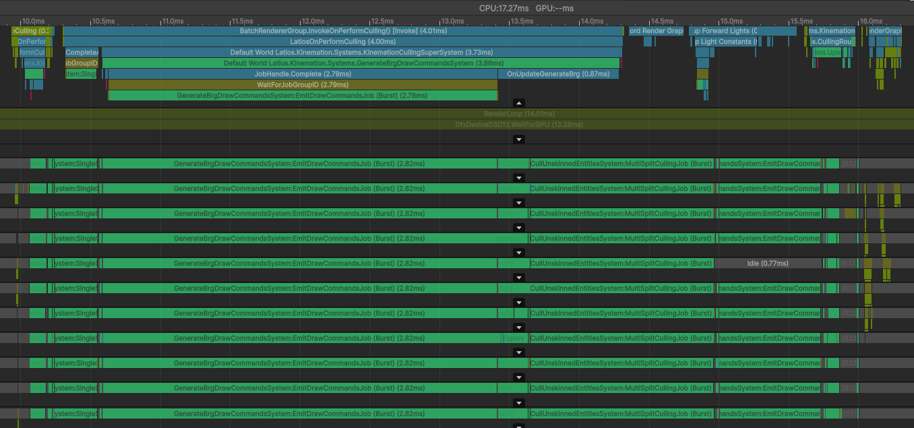

Based on this profiler, there are two culling updates. The first is for the main
camera, while the second is for the main light shadow cascades. Because of ECS
system rules, the second update ends up blocked on the main thread waiting for
the first, which is not ideal.

In this capture, the first `EmitDrawCommandsJob` footprint is much larger than
the second. That’s because the camera frustum extends beyond the shadow
cascades, so with the camera angle I’m testing with, not as many entities render
for shadows as they do for the 3D view. The other job of concern is the
`MultiSplitCullingJob`, but optimizing it now would not be as impactful. We’ll
be focusing on the timings of the first round of `EmitDrawCommandsJob` on a
per-thread basis. In the profile above, that’s 2.8 milliseconds.

`EmitDrawCommandsJob` is a very chaotic job. It is responsible for looking at
all visible entities, classifying them, and figuring out all the unique mesh,
material, submesh, and settings combinations it needs to render. In many cases,
an entity might generate multiple things to draw.

`EmitDrawCommandsJob` is one of the first jobs in
`GenerateBrgDrawCommandsSystem`. This system’s goal is to populate
`BatchRendererGroup` with “draw commands” which very closely resemble graphics
API draw calls. Because of this, a draw command can render one instance, or
render multiple using instancing, and this maps directly to how Unity will
eventually invoke the graphics API. Instancing is good, so we want to pack
things we want to render into instanced draw commands.

Of course, instancing requires many properties of the instances to be the same,
such as which meshes and materials get used, but also the submesh, rendering
settings, shader flags, material override combinations, and shadow cascade
splits. All of these unique properties are gathered into a struct called
`DrawCommandSettings`. This serves as a key into a per-thread hashmap, where the
values are indices into bins. A bin contains a `DrawStream`, where each element
in the stream is an ECS chunk and a bitmask marking which entities in the chunk
should be rendered with the associated `DrawCommandSettings`. This means that an
entity can be drawn with several different `DrawCommandSettings` (multiple
materials or LOD Pack crossfade). But if you were to try and draw the entity
with the exact same settings multiple times, it would only draw once. When a
`DrawCommandSettings` isn’t in the hashmap, a new bin is created for it. Later
jobs will gather all the per-thread bins, merge them, and then arrange the
entities into instanced draw commands. As seen in the profile capture above, the
rest of the jobs are extremely efficient because of this design. And this whole
process is much more optimal than using a `NativeParallelMultiHashMap` or
similar.

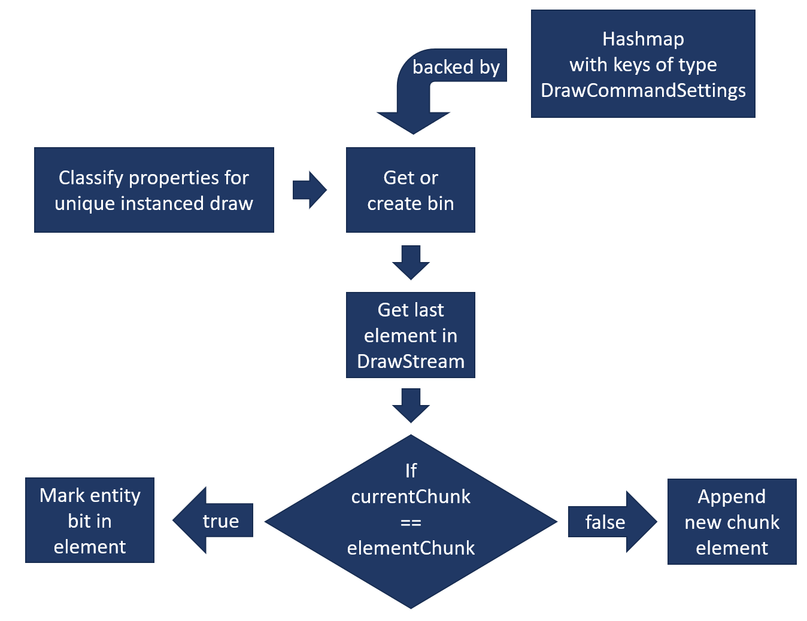

But as fast as it is, there’s a bit of a tax to ingest and classify all our
visible entities and store them into the bins. But it isn’t obvious where the
problems might be, so let’s ask V-Tune to identify them.

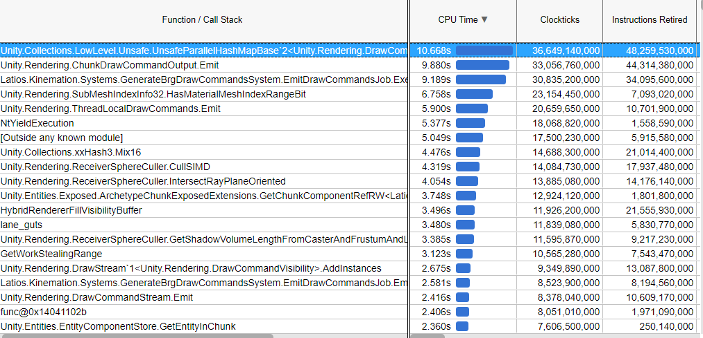

From this, it seems that a hashmap is particularly hot. This is a per-thread
hashmap used for identifying and grouping entities with matching rendering data.
And some of the other top entries have to do with hashing this data.

Curiously, this code is using `UnsafeParallelHashMap`, despite the fact this
hashmap is actually only used in a single-threaded manner. Unity has a separate
single-threaded `UnsafeHashMap`, which they wrote specifically because it is
faster for single-threaded use cases. Unfortunately, the binning algorithm is
actually Entities Graphics code that is left untouched, so we can’t actually fix
this…

… at least not in 0.13.x which is what this capture comes from. That’s the
latest official release at the time of writing, but 0.14 is under development
and has some significant changes that may affect our results. Let’s catch up.

## More LODs, More Code

Unity 6.2 introduces a new LOD mechanism called Mesh LODs. The idea is that new
LOD levels are formed by reusing the vertices of an existing mesh, and just
using a different set of indices for the triangles (with fewer triangles each
level). This is kinda like Unreal Engine’s Nanite, except that the LOD level is
universal for the mesh rather than at a meshlet level. Unity’s implementation
can generate a lot of LOD levels with this approach, typically shrinking the
triangle count by half each time. To streamline this, it uses a curve function
for selecting the LOD level at a given screen height, rather than allowing users
to tune individual LOD transitions. The curve function is also much easier to
store on entities. With how effective single-entity LODs have been in ECS, an
automatic LOD generation technique that is ECS-friendly makes for a hype
prospect. And so, I’ve added support for it, and I ended up changing some things
up in the process.

One of my goals was to allow multiple LOD techniques to coexist. That gets
tricky when each LOD technique could potentially want to control the crossfade
value. I only get to send a single crossfade transition to the GPU for any given
entity within a draw command. Therefore, I needed a way to make these LOD
techniques coordinate crossfade ownership, which got especially tricky for
skinned meshes (which Mesh LOD supports). I ultimately decided to move frustum
culling from skeletons back to the skinned meshes. While this does mean a few
more random accesses per frame (skinned meshes copy bounds from skeletons, not
bones), it also means fewer culling systems and a more consistent runtime
representation for rendered entities.

The framework discord community also made a discovery about
`BatchRendererGroup`, which is that Unity completely ignores the batch bounds.
GPU Resident Drawer never even makes the calls to set it. So it is time to say
“good riddance”. I got to delete all the code that calculated that value. And
even more awesome, this also meant that I could rearrange the systems to compute
bounds after the `LatiosEntitiesGraphicsSystem` update where they have a little
more room to run before forced completion.

Lastly, and most importantly, I needed to actually feed the `BatchRendererGroup`
API the Mesh LOD values. The only problem is that `DrawCommandSettings` doesn’t
have room for it. If you remember, we had to get very creative to squeeze out
just a single bit to mark whether to complement the LOD crossfade value. Well, I
decided to pull the trigger, and implement my own versions of this whole
process. And since I did this, I got to clean up a lot of code around LOD
Crossfade by making it part of the `DrawStream` structure. I also switched some
allocations from `TempJob` to `RewindableAllocator` so that there’s no longer a
need to dispose anything. And I’ve cleaned up a few false sharing “bugs” and
other oddities. I didn’t really notice much of a performance difference in LSSS
from this, so let’s see how it compares here.

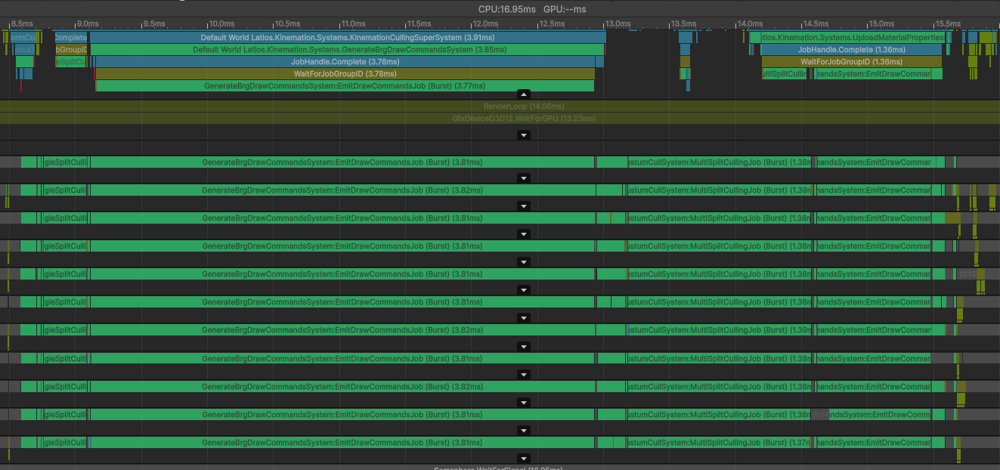

Whoops. It seems that made `EmitDrawCommandsJob` even worse! Fortunately, that
seems to be the only job the changes affect. And there were a number of changes
made to `EmitDrawCommandsJob` to classify LODs with Mesh LOD correctly, so I’m
only slightly surprised it is slower. With that said, let’s try and figure out
why it got slower, and see if we can make it better.

## Exploring the Profiler

The first thing we can try is switching to `UnsafeHashMap`, since that’s now our
own code…

Nope. That didn’t help. In fact, I think it made it 0.1 milliseconds worse! 3.9
milliseconds seems to be the average now.

But then what is going on? Let’s check in with V-Tune.

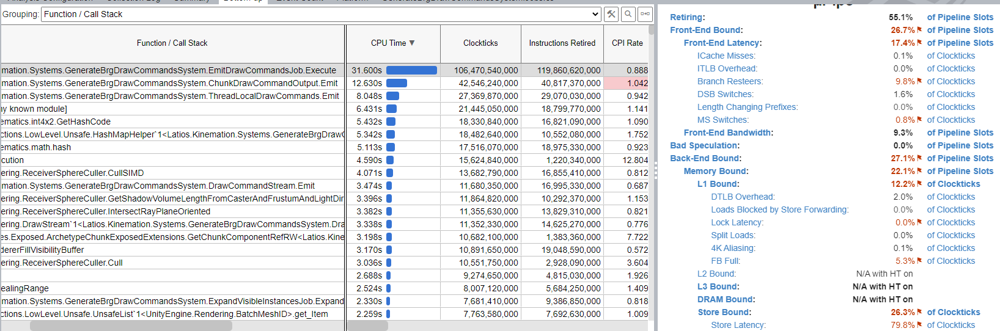

The hashmap is gone. But instead, we have a big chunk of time in the main
`Execute()` method of the job itself. There seems to be two main bottlenecks
here. The first is that there are a lot of write operations. And second, there’s
a bottleneck in the frontend. The frontend is where CPU instructions are fetched
and decoded for later execution. ECS with its system-based design usually avoids
fontend problems, because the same small segment of code often gets run
repeatedly together for a large number of entities before the next system loads
up a different set of code. For us to be front-end bound here means at least one
of two issues:

1.  Our code is way too unpredictable with too many branches
2.  We have way too many instructions in an inner loop

Fortunately, we can have a closer look at what is happening inside the job, by
double-clicking on the source file column (hidden in the screenshot). After
exploring a bit, I noticed this:


Alright. There’s a lot going on in this picture. You’ll see at the bottom there
are three independent scrollable areas, with the first one taking over half the
width. Between the first and second area, you’ll see a narrow vertical strip
with blue horizontal bars of different shades. Those blue bars are a heat map,
where the dark blue represents where along the vertical scroll bar the hottest
code is. And that happens to be this `DrawCommandOutput.Emit()` call. It is 8.3
times more expensive than the next-most-expensive line of code. And on the right
are just some of the instructions involved in this line of code. That’s a lot
for a single method call!

The first argument of that call is significant. That’s the
`DrawCommandSettings`. This needed to change to support Mesh LOD, and given we
got a performance regression after this change, it makes sense that it shows up
where the problems are.

The new `settings` data structure is a 256-bit structure that is meant to be
reinterpreted as either a 256-bit SIMD vector, or two 128-bit SIMD vectors. And
there’s custom SIMD intrinsic implementations for comparison operations as these
instances need to be both hashed and sorted. Entities Graphics also had a SIMD
implementation, though it was a bit quirky. It is worth mentioning that I had a
lot of trouble convincing Burst that this new `DrawCommandSettings` could just
be reinterpret-loaded into a SIMD register as-is. `UnsafeUtility.As<>()`
reinterpretation only worked a third of the time, and I eventually settled on an
explicit struct layout with aliased vector fields. All this is to say I’m not
surprised Burst choked on understanding this type. And I think I know how to fix
it, but first, let’s try upgrading from Burst 1.8.23 to 1.8.24 just to see if
that version understands things a little better.

Nope. No change. Was worth a shot though.

## Where’s the Ref?

Not only are we passing in this complicated structure, we are passing it by
value. The reason for this is because the `Emit()` method modifies `settings` by
computing and storing a cached hashcode. So we can’t use `in`, but we can use
`ref`. We’ll just need to update the hashcode calculation to not include itself
(which it was doing because of SIMD convenience), as it won’t always be zero
anymore.

That made it worse. 4.1 milliseconds per thread now.

We’re going backwards here. But there’s more to the story. Because inside the
`Emit()` method, there’s a `DrawCommands->Emit()` which also passes `settings`
by value. And inside that is where `settings` get tested against the per-thread
hashmap which you guessed it, passes it by value. There’s also a few other calls
that pass `settings` by value. So let’s make that whole path `ref` and `in` and
see how that looks.

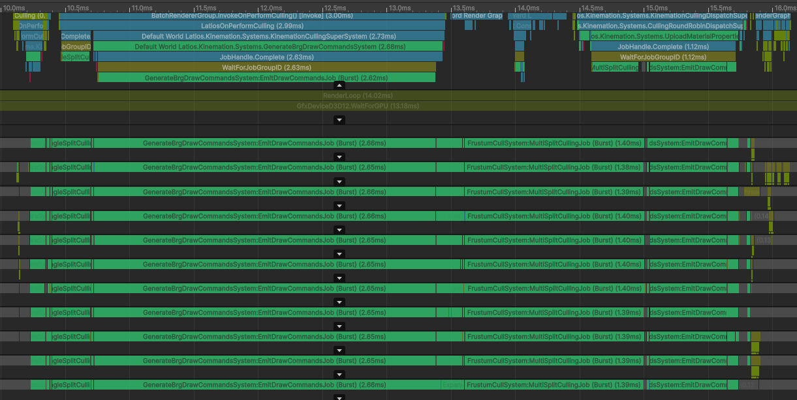

Woah! 2.65 ms!

There went our regression. We’re now 200 microseconds ahead of 0.13.x.

You might be wondering, “What just happened?”

Well, the first time we pass settings into the `Emit()` method, we have to
create it. In the pass-by-value case, Burst constructs it directly on the part
of the stack lined up for passing it as a parameter. When passed by `ref`, Burst
constructs it as a local on the stack, captures a pointer to it, and then passed
the pointer. The latter is slightly more indirect and harder for the CPU to
reason about, hence the ever-so-slight slowdown.

However, once it exists as a `ref`, passing it by `ref` to the four other places
it is used is much cheaper, as now it is just a pointer being passed around. And
that’s where the massive speedup came from. Ideally, Burst would understand that
this type can be safely stored in one or two vector registers, and then passing
by value would be just as fast. But `ref` works well enough.

Anyways, let’s see what V-Tune has to say now that we eliminated a bunch of
code.


Don’t try to compare the time and instruction metrics to previous profiles. The
frame counts and profiling durations don’t match at all. What is relevant is the
relative timing of items at the top. Those `Emit()` methods are much further
down now, and in their place is the hash function for `int4x2`, which is what
`settings` uses for its hash function. Entities Graphics uses `xxHash` for its
hash function, which seemed overkill for a struct of this size. Meanwhile,
`int4x2` hashing is only 12 instructions. And in our test, it is only called
once per visible entity.

What I think is actually happening here is that these instructions are already
queued up in the pipeline before `settings` is fully finished. So V-Tune sees
them in the samples, but they aren’t actually ready to execute yet.

Looking into the hotspot inside the `Execute()` method, we still see most of the
congestion at the same spot, although this time it is attributed to the
`DrawCommandSettings` construction rather than the `Emit()` call that follows.
This is not really a surprise. And we’ll need a different technique to deal with
that.

But first, let’s explore one other thing. There are 8 other parameters to the
`Emit()` call, and similar to `settings`, they also get passed around together
to a few different places. They are a bit easier than `settings` for Burst to
reason about, and the codegen is a bit shorter. But `ref` (or in this case,
`in`) might still be better still. So let’s wrap those in a new struct and apply
the same optimization. Our old `settings` will now be `commandSettings`, and our
new struct will be `entitySettings`.

Zero difference.

Like, actually zero. I’m not even sure if Burst even changed the assembly.

Turns out that after our previous optimization, Burst now inlines all the
downstream calls that use `entitySettings`, so it doesn’t matter if they are
passed by `in` or by individual values, because Burst completely removed the
method call altogether. That just leaves the outermost `Emit()` call right after
we construct the data, which as we already discussed, doesn’t really benefit
anything. However, we’ll still keep it, because it makes the code a little more
tidy, and is probably faster when Burst is disabled.

## Consolidating the Stack

It would seem that constructing our two settings structures, especially the
`DrawCommandSettings`, is quite expensive. Yes, there are a number of
instructions associated with the process, which isn’t great. But there are a lot
of other instructions in other parts of the pipeline too. Why are these in
particular so expensive?

I don’t know.

But that shouldn’t stop us from trying to do something about it. If constructing
these things on the fly is so expensive, let’s not do that.

To understand how, let’s explore what these types consist of. I’ve also added
some annotations that are very relevant to our intentions.

```csharp
unsafe struct DrawCommandSettings : IEquatable<DrawCommandSettings>
{
    [FieldOffset(0)] private int             m_hash;
    [FieldOffset(4)] public BatchID          batch; // Per chunk
    [FieldOffset(8)] public ushort           splitMask; // Per entity
    [FieldOffset(10)] public ushort          meshLod; // Per entity value + 0 or 1 per draw
    [FieldOffset(12)] public ushort          submesh; // Per draw
    [FieldOffset(14)] private uint           m_mesh; // Per draw
    [FieldOffset(18)] public BatchMaterialID material; // Per draw
    [FieldOffset(22)] private ushort         m_flags; // Mix
    [FieldOffset(24)] public int             filterIndex; // Per chunk
    [FieldOffset(28)] public int             renderingPriority; // Per entity
}
unsafe struct EntityDrawSettings
{
    public int           entityQword; // Per half-chunk
    public int           entityBit; // Per entity
    public int           chunkStartIndex; // Per chunk
    public bool          complementLodCrossfade; // Per draw
    public LodCrossfade* lodCrossfades; // Per chunk
    public float*        chunkTransforms; // Per chunk
    public int           transformStrideInFloats; // Per chunk
    public int           positionOffsetInFloats; // Per chunk
}
```

Many of these values are used much less frequently than per-draw (remember, an
entity can have multiple materials and LODs packed inside it). If we were to
construct these structs once, and then patch them with each entity and draw, we
can eliminate a number of the construction instructions. Let’s start simple and
keep the `m_flags` (has a public property) to compress the `enum` and `meshLod`
per draw for starters and see if this wins us anything.

One of our per-draw sites where we used to construct these settings now looks
like this:

```csharp
drawCommandSettings.mesh     = meshID;
drawCommandSettings.material = materialID;
drawCommandSettings.submesh  = materialMeshInfo.SubMesh;
drawCommandSettings.meshLod  = meshLod;
drawCommandSettings.flags    = drawCommandFlags;

entityDrawSettings.complementLodCrossfade = false;

DrawCommandOutput.Emit(ref drawCommandSettings, in entityDrawSettings);

if (isMeshLodCrossfade)
{
    drawCommandSettings.meshLod++;
    entityDrawSettings.complementLodCrossfade = true;
    DrawCommandOutput.Emit(ref drawCommandSettings, in entityDrawSettings);
}
```

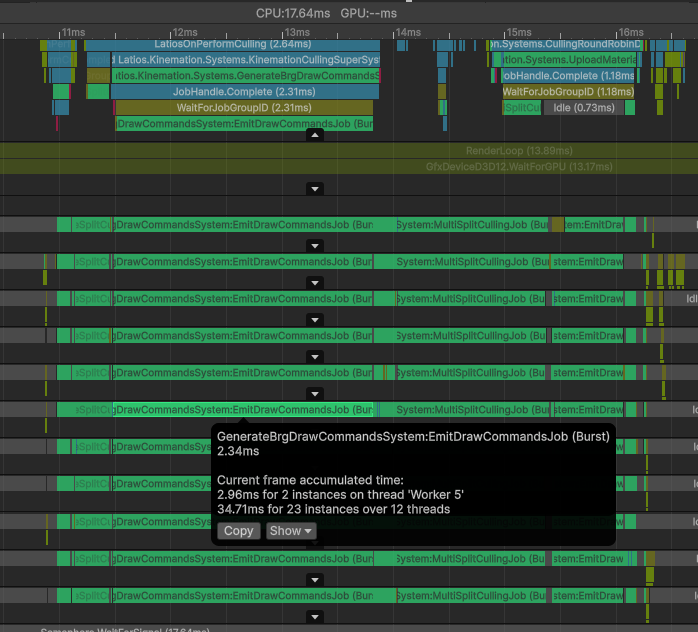

Look at that! That’s another 300 microseconds eliminated per thread!

Looking in the Burst inspector, the per-draw setup is now only 9 instructions.
Recall earlier that this setup used to fill up V-Tune’s window. That’s where the
performance boost is coming from.

But there’s still more to reduce. For example, have a look at these:

```asm
# GenerateBrgDrawCommandsSystem.Jobs.cs(243, 1)                            if (hasMotion)
        lea               r11d, [rax + 2]
        cmp               byte ptr [rbp + 619], 0
        cmovne            r11d, eax
# GenerateBrgDrawCommandsSystem.Jobs.cs(246, 1)                            if (isLightMapped)
        lea               r14d, [r11 + 4]
        cmp               dword ptr [rbp + 508], 0
        cmovs             r14d, r11d
        mov               eax, dword ptr [rsi + 4*r9 + 8]
```

Those are per-chunk values. We could just precompute them into a single
`chunkFlags` and then bitwise-OR the flags in the per-entity loop. The
depth-sorted flag can also receive this treatment. But while we are at it, let’s
analyze that a little bit.

The code currently computes sorting positions for each entity inside the entity
loop. This is the only location where the sorting positions array and the entity
transforms are accessed in the entire job, and that’s all the block does.
Otherwise, only the pointer to the sorting positions is passed around, where it
is eventually saved for a future job. However, because we are computing it in
the entity loop, this work fills up the instruction sequence of the inner loop.
In addition, much of the other work inside the entity loop is bouncing around to
all sorts of places in memory. This might be causing the transform cache lines
to get evicted between entities. And all of this just to reuse the loop control
structure for iterating entities? For transparency with post-process matrices? A
very infrequent use-case?

Let’s hoist that block of code into its own little per-entity loop.

Now everything about transparency, motion, and lightmaps are all handled and
done with before our main entity loop. That frees up some registers and stack
space. And the results?

Another 100 microseconds. We’re down to 2.25 milliseconds per thread.

## Spinning in Loops

Going back to V-Tune, things now look like this:

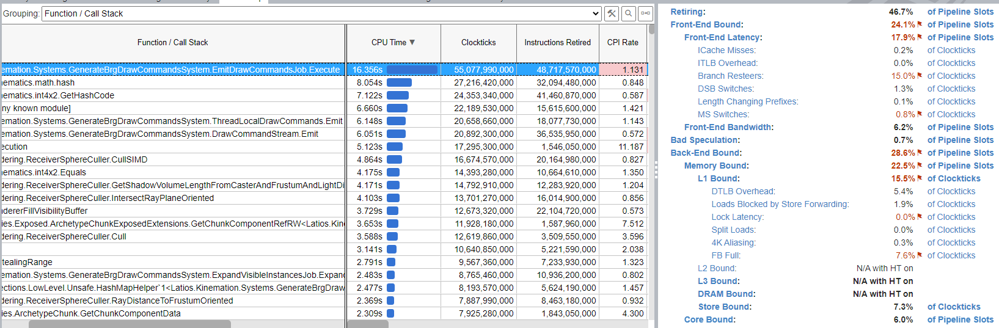

The main job `Execute()` method is still the biggest hitter, but the gap is
decreasing. It is hard to put much stock into hashcode generation right now
though, because Burst decided after the latest optimization to inline it into
the `Execute()` method, and it seems that might be confusing V-Tune’s
attributions between `math.hash` and `int4x2.GetHashCode()`.

Of greater concern is on the right, where it seems the `Execute()` method is
bottlenecked significantly by both front-end and memory. It is weird that so
much of it is allocated to resteers, because the branches work out the same way
nearly every time in our test, and bad speculation is not an issue at all. I
don’t understand what that could be from. As for memory, it seems we are
bottlenecked on the interface between L1 and L2 for both reading and writing.

Looking at the code hotspots, things get interesting.

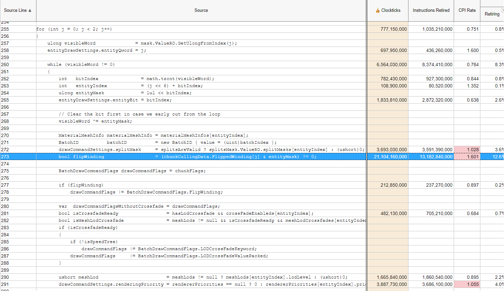

Before, it used to be the `Emit()` call or setting up the settings structures
that were most expensive. This is no longer the case, and the hotspot is now on
the highlighted code. What is interesting, is that most of these hotspots tend
to be on branches. And for most of these branches, they always take the null
path, meaning there aren’t any real memory reads going on.

My suspicion is that the CPU is getting very confused by all the branches, and
is violently trying to funnel instructions from L2 into the L1 instruction
cache. And this ends up bottlenecking the L1/L2 interface, which is where the L1
memory bottleneck comes into play. If my suspicion is correct, perhaps we can
fix this by breaking up the loop into several, so that the CPU has less branches
to deal with per loop iteration.

Let’s start with a loop that unpacks the `tzcnt` iteration into a list of
indices in the chunk. The reason we want to do this is because for as fast as
`tzcnt` iteration is, iterating an array of indices is even faster if we need to
do it several times. That’s especially true when we have two `ulong` instances
to iterate through, as the branch required to switch between them can be quite
disruptive. Also, I’m suspicious that `tzcnt` iteration is creating some kind of
variable dependency hazard that normal array iteration wouldn’t have. Anyways,
this opening loop looks like this:

```csharp
var        entityCount    = mask.ValueRO.lower.CountBits() + mask.ValueRO.upper.CountBits();
Span<byte> indicesInChunk = stackalloc byte[entityCount];
for (int i = 0, j = 0; j < 2; j++)
{
    ulong visibleWord = mask.ValueRO.GetUlongFromIndex(j);
    while (visibleWord != 0)
    {
        int bitIndex      = math.tzcnt(visibleWord);
        indicesInChunk[i] = (byte)((j << 6) + bitIndex);
        i++;
        ulong entityMask  = 1ul << bitIndex;
        visibleWord      ^= entityMask;
    }
}
```

We can now switch post-process transparency handling to use the new
`indicesInChunk` array. However, switching the main entity loop is a little
trickier, because that loop still needs the individual `j` and `bitIndex` values
in the `EntityDrawSettings` structure. Those can be computed without branches
though, so that’s what we’ll do. The top of the main entity loop now looks like
this:

```csharp
for (int visibleIndex = 0; visibleIndex < indicesInChunk.Length; visibleIndex++)
{
    int entityIndex                = indicesInChunk[visibleIndex];
    entityDrawSettings.entityQword = entityIndex >> 6;
    entityDrawSettings.entityBit   = entityIndex & 0x3f;
```

That change by itself set us back to 2.33 ms per thread, which isn’t a surprise
because we did not address the hottest branch in the main entity loop. The most
intense branch was determining whether to set the flag to flip the winding of
triangles. We’ll create an array of flags and move this to the `indicesInChunk`
generation loop. The main entity loop will now just use a bitwise-OR to instead
of the branches.

```csharp
BatchDrawCommandFlags drawCommandFlags = chunkFlags | flipWindingFlags[visibleIndex];
```

2.37 ms.

We’re going backwards. But this isn’t the first time that has happened, and it
eventually worked out in our favor. Let’s push this idea to the limit, and move
out as many branches as we can.

2.52 ms.

Apparently, stack-allocating to avoid later branches is only making things
worse. However, the real aim of this investigation is that now with the loop
split into two, it will be easier to gauge what is actually expensive inside
V-Tune.

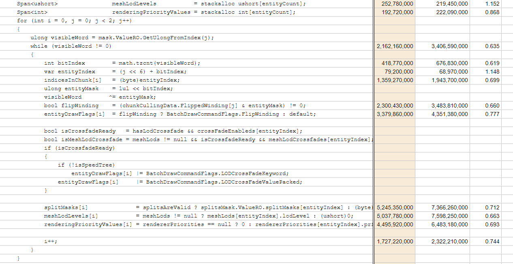

Sure enough, one of our three hotspots now is this new separated loop. But how
much is this actually costing us in the big picture?

To determine this, let’s hardcode most of these small arrays where we already
know what they should be in our test. We aren’t using mesh LODs or rendering
priority values, nor any crossfades or flipped windings. This way, we can get a
sense for what kind of performance might be possible if we were to optimize this
loop.

2.36 ms.

Darn. That’s not even an improvement over our best real implementation.

I did notice that Burst was emitting full `memset` call instructions for the
temporary arrays. So just in case, let’s hardcode those array sizes to 128 each
and try one last time.

2.18 ms.

It’s better…

And honestly, if we had a test case that wasn’t all cubes, there might honestly
still be potential with this approach. But as it stands, there isn’t
meaningfully anything to gain here.

Alright, one final hail-mary shot. Because I’m suspicious that we are thrashing
instructions and such so much, I’ve added a buffer to write all our settings to,
and then we drain it at the end of the chunk or whenever it accumulates to max
capacity. At this point, I’m honestly expecting it to be slower. But who knows?

…

4 milliseconds? No, no, no, no, no! Not going down that route.

## Those Pesky Instructions

What do we make of all this?

Well, at this point, the common denominator between all of our tests and the
performance profiles seems to be the number of instructions. If we add loops, we
potentially add instructions. If we add buffers, we add instructions. If we pass
things by value when they should be by reference, we add instructions.
Therefore, the only way left to remove forward is to peck at any unnecessary
instructions we can find.

That means walking through the entire entity loop in the Burst inspector, along
with all calls it makes, and looking for areas that appear really ugly. Here’s
one of them:

```asm
# int4x2.gen.cs(571, 1)        public bool Equals(int4x2 rhs) { return c0.Equals(rhs.c0) && c1.Equals(rhs.c1); }
        vmovd             xmm2, dword ptr [r14 + 16]
        vpshufd           xmm0, xmm0, 80
        vpblendd          xmm0, xmm0, xmm2, 1
        vpinsrd           xmm0, xmm0, dword ptr [r14 + 28], 3
        vmovd             xmm2, r9d
        vpinsrd           xmm2, xmm2, dword ptr [r14 + 4], 1
        vpunpcklqdq        xmm1, xmm2, xmm1
        vpcmpeqd          xmm2, xmm2, xmm2
.Ltmp510: ...
.LBB7_3:
# UnsafeHashMap.cs(274, 1)                    while (!UnsafeUtility.ReadArrayElement<TKey>(Keys, entryIdx).Equals(key))
        movsxd            r8, r8d
        mov               r9, r8
        shl               r9, 5
.Ltmp511:
# int4x2.gen.cs(571, 1)        public bool Equals(int4x2 rhs) { return c0.Equals(rhs.c0) && c1.Equals(rhs.c1); }
        vpcmpeqd          xmm3, xmm1, xmmword ptr [rcx + r9]
        vpxor             xmm3, xmm3, xmm2
        vpcmpeqd          xmm4, xmm0, xmmword ptr [rcx + r9 + 16]
        vpxor             xmm4, xmm4, xmm2
        vpor              xmm3, xmm3, xmm4
        vtestps           xmm3, xmm3
        je                .LBB7_14
```

It seems Burst is still fumbling over the `DrawCommandSettings` type layout. To
remove all room for doubt, let’s make that type only contain a `v256` as a field
and make everything else properties.

```asm
        vpcmpeqd          ymm1, ymm1, ymm1
        .p2align        4, 0x90
.LBB13_5:
# UnsafeHashMap.cs(274, 1)                    while (!UnsafeUtility.ReadArrayElement<TKey>(Keys, entryIdx).Equals(key))
        movsxd            r9, eax
        mov               r10, r9
        shl               r10, 5
.Ltmp596:
        .cv_inline_site_id 451 within 447 inlined_at 14 274 0
# GenerateBrgDrawCommandsSystem.Structs.cs(98, 1)                    var eq   = X86.Avx2.mm256_cmpeq_epi8(packed, other.packed);
        vpcmpeqb          ymm2, ymm0, ymmword ptr [r8 + r10]
# GenerateBrgDrawCommandsSystem.Structs.cs(99, 1)                    return X86.Avx.mm256_testc_si256(eq, ones) != 0;
        vptest            ymm2, ymm1
.Ltmp597:
# UnsafeHashMap.cs(274, 1)                    while (!UnsafeUtility.ReadArrayElement<TKey>(Keys, entryIdx).Equals(key))
        jb                .LBB13_2
```

I decided to manually write out the intrinsics for AVX2, and the result is
looking a lot better. You’ll see the first instruction compares a register to
itself. That’s just a hack to set all the bits to 1, similar to how XORing
something with itself clears all the bits to 0. The `vptest` instruction is
something I’ve learned about more recently. The way I have it set up, this
instruction takes the bitwise NOT of the comparison, and ANDs the result with a
bunch of 1s. This should result in 0s across the board if and only if the
comparison result was all 1s. In that case, the carry flag gets set, which is
what `jb` looks at. I may have to revisit FindPairs again to make use of this
over `vmovmskps`.

Unfortunately, this implementation caused Burst to no longer completely inline
all the hashmap operations, and instead generates a separate call. However, that
call isn’t struggling over parameters anymore, so perhaps Burst believes the
separate call is more optimal now? Also, Burst now tries to build up the full
`DrawCommandSettings` into a single register, and then store it on the stack
after computing the hashcode. This is a little more complicated, so there’s a
number of instructions that get generated as a result.

But it seems like Burst knows what it is doing, because we are down to 2.18 ms!

## Reality Check

We have these three ternaries in our loop:

```csharp
drawCommandSettings.splitMask         = splitsAreValid ? splitsMask.ValueRO.splitMasks[entityIndex] : (ushort)0;
ushort meshLod                        = meshLods != null ? meshLods[entityIndex].lodLevel : (ushort)0;
drawCommandSettings.renderingPriority = rendererPriorities == null ? 0 : rendererPriorities[entityIndex].priority;
```

In all three cases, we perform a test, and then either read from an array or
assign 0 to the value. But the answers to all these tests are known at the chunk
level. Why not cache 0s in our `DrawCommandSettings` and then test if we need to
read and assign our array in our entity loop? That way, if the test fails, we
don’t have to assign anything. And that’s a common scenario, especially for the
rendering priority which is rarely used.

… Burst had no clue what we were trying to do. As a result, we went back to 2.25
ms. Then I reverted, and profiled again, and I saw 2.25 ms. This means the
optimizations we are attempting to make right now sit within the noise
threshold. I scoured through the Burst Inspector, and even though the assembly
looks kinda messy, every time I really dig in and trace through the registers, I
realize that Burst did a very good job overall. We can maybe scratch for a few
percentage points of improvement here or there with a lot of trial and error,
but is that really worth our time?

In this adventure, I was hoping that the various ternary operations and branches
was causing issues, and that the solution would be splitting everything into
small loops and vectorizing them. Unfortunately, it doesn’t actually work that
way. Our data comes in with gaps, due to entities being potentially culled.
That’s why the entity loop uses `tzcnt` iteration. Additionally, the use of
`RenderMeshArray` means that even for a single mesh and material, the
`MaterialMeshInfo` only contains indices to these things, so they are an
indirect access and in a way require “random” accesses (although the random
accesses have a high cache hit rate). Using scalar code to compact the data ends
up being just as expensive as the amount we’d save by using vector instructions
for the processing. And while special SIMD gather instructions exist, they have
a troubled history performance-wise and we would want to explore them on a
simpler problem first before greenlighting their use. If they were useful, we
would need to vectorize the full entity loop, rather than just small loops. That
would even entail computing multiple hashes at a time. However, once we reach
the hashmap stage, we’d run into problems again. The hashmap requires keys be
stored in struct form, which we wouldn’t have with a fully vectorized
implementation. And on top of that, hashmap logic needs to be sequential. What’s
more is that V-Tune was giving us false alarms. The CPU is quite happy
navigating the branches this time around, and isn’t starved for memory. If
anything, there’s maybe a couple of data dependency issues. But it could even
just be hyper-threading interfering with the numbers, as they have a tendency to
do. The consequence of all this is that we have an algorithm that just does best
with fast scalar code and a few sprinkles of SIMD, and there’s just not enough
room to improve on it with small changes.

If we want big improvements, then we need to think big. For example, what if we
had a fast-path where we didn’t have to iterate the entities in the chunk at all
because we knew they were all identical?

## Promise to Stay Together?

We want to reason about a whole chunk of entities at once. But this only works
if all entities in the chunk use the exact same `MaterialMeshInfo`. Checking for
this means spending CPU cycles on checks, and that kinda defeats the purpose of
this fast path. Instead, let’s make the user promise us this with a tag
component named `PromiseAllEntitiesInChunkUseSameMaterialMeshInfoTag`. Hopefully
such a verbose name will make users be very careful about this.

We’ll check for this component right before the entity loop. If it is present,
we’ll call the fast path. The fast path is allowed to fail by returning `false`,
which will cause the entity loop to proceed. As a bonus, the fast path can also
partially fail and clear out the visible entity bits that it successfully
handled.

For now, we’ll focus the fast path to only care about what we are testing right
now, which is a bunch of cubes in the main camera without any LODs nor multiple
materials. Thus, our fast path starts by looking like this:

```csharp
// Return true if all entities handled. False if there are leftovers.
bool ExecuteBatched(in ArchetypeChunk chunk,
                    ref ChunkPerCameraCullingMask mask,
                    ref DrawCommandSettings drawCommandSettings,
                    in EntityDrawSettings entityDrawSettings,
                    bool useMmiRangeLod,
                    MeshLod*                      meshLods,
                    RendererPriority*             rendererPriorities)
{
    if (splitsAreValid || useMmiRangeLod || meshLods != null || entityDrawSettings.lodCrossfades != null || rendererPriorities != null)
        return false;
```

Why is `EntityDrawSettings` passed as `in` and not `ref`?

Simple. That struct was designed for a single entity, and we will have a whole
chunk. We’ll need a new type `EntityDrawSettingsBatched` to propagate through
the system. But `DrawCommandSettings` still contains some useful chunk-level
details we want to borrow from. Here’s what `EntityDrawSettingsBatched` looks
like:

```csharp
unsafe struct EntityDrawSettingsBatched
{
    public ulong         lower;
    public ulong         upper;
    public int           chunkStartIndex;
    public int           instancesCount;
    public float*        chunkTransforms;
    public int           transformStrideInFloats;
    public int           positionOffsetInFloats;
}
```

We now have a 128-bit bitmask for visible entities. We also dropped crossfade
data as the batched API shouldn’t even deal with crossfading entities. Think
about it, if hundreds of chunks are full of entities all in the middle of a
crossfade, something is wrong. Crossfades should be the leftovers, not the fast
path. And since crossfades generate a unique `DrawCommandSettings` with the
shader flag set, we won’t ever be sending such a `DrawCommandSettings` in batch
mode, and therefore don’t even need to initialize the crossfades pointer in case
of leftovers.

Now we just need to clone duplicate method using `EntityDrawSettings` and make
the copy support `EntityDrawSettingsBatched` instead. For several methods,
that’s all that is required. In a couple of places, we need to null out
crossfade pointers and delete crossfade handling paths. In the place where
`EntityDrawSettings` used the `entityQword` and `entityBit` to append to the
visibility bitmask, we can just bitwise-OR it with our new bitmask. Lastly,
`DrawStream` has an `AddInstances()` method which takes an integer. In the
single entity path, a hardcoded 1 was passed in. But we can now pass in the
`instancesCount`. It is kinda convenient that method was written that way. We
can thank some former Unity staff for having good foresight there.

Now we can finally move to implementing the main fast-path method in our job.
We’ll do this by looking through the code in the normal entity loop, and seeing
which parts we need to keep and which parts we can discard. The first one is the
flipped winding flags. Flipped windings come from transforms with negative
scaling, which is uncommon. Because of that, for now we will simply check if
anything has flipped windings and fail the fast path if so.

Next, we need to get the `MaterialMeshInfo` from the mesh. We don’t care which
one, as we were promised they’d all be the same. So we’ll just pick index 0.
Also, since our test case right now is cubes, we’ll fail the fast path if we
find `MaterialMeshInfo` uses ranges. We’ll still do the rest of the checks for
whether the mesh and material are runtime-based or `RenderMeshArray`-based. And
if we end up with an invalid mesh or material, instead of failing, we’ll
actually return successful, as we aren’t going to draw anything.

All that’s left is to set up our batched draw settings. The final fast-path
method looks like this:

```csharp
// Return true if all entities handled. False if there are leftovers.
bool ExecuteBatched(in ArchetypeChunk chunk,
                    ref ChunkPerCameraCullingMask mask,
                    ref DrawCommandSettings drawCommandSettings,
                    in EntityDrawSettings entityDrawSettings,
                    bool useMmiRangeLod,
                    MeshLod*                      meshLods,
                    RendererPriority*             rendererPriorities,
                    in EntitiesGraphicsChunkInfo entitiesGraphicsChunkInfo,
                    MaterialMeshInfo*             materialMeshInfos,
                    in BRGRenderMeshArray brgRenderMeshArray,
                    BatchDrawCommandFlags chunkDrawFlags)
{
    if (splitsAreValid || useMmiRangeLod || meshLods != null || entityDrawSettings.lodCrossfades != null || rendererPriorities != null)
        return false;

    if ((entitiesGraphicsChunkInfo.CullingData.FlippedWinding[0] | entitiesGraphicsChunkInfo.CullingData.FlippedWinding[1]) != 0)
        return false;

    var materialMeshInfo = materialMeshInfos[0];

    if (materialMeshInfo.HasMaterialMeshIndexRange)
        return false;

    BatchMeshID meshID = materialMeshInfo.IsRuntimeMesh ?
                            materialMeshInfo.MeshID :
                            brgRenderMeshArray.GetMeshID(materialMeshInfo);

    // Invalid meshes at this point will be skipped.
    if (meshID == BatchMeshID.Null)
        return true;

    // Null materials are handled internally by Unity using the error material if available.
    BatchMaterialID materialID = materialMeshInfo.IsRuntimeMaterial ?
                                    materialMeshInfo.MaterialID :
                                    brgRenderMeshArray.GetMaterialID(materialMeshInfo);

    if (materialID == BatchMaterialID.Null)
        return true;

    drawCommandSettings.mesh     = meshID;
    drawCommandSettings.material = materialID;
    drawCommandSettings.submesh  = GetSubMesh16(ref materialMeshInfo);
    drawCommandSettings.meshLod  = 0;
    drawCommandSettings.flags    = chunkDrawFlags;

    var visibleCount              = mask.lower.CountBits() + mask.upper.CountBits();
    var entityDrawSettingsBatched = new EntityDrawSettingsBatched
    {
        chunkStartIndex         = entityDrawSettings.chunkStartIndex,
        chunkTransforms         = entityDrawSettings.chunkTransforms,
        instancesCount          = visibleCount,
        lower                   = mask.lower.Value,
        upper                   = mask.upper.Value,
        positionOffsetInFloats  = entityDrawSettings.positionOffsetInFloats,
        transformStrideInFloats = entityDrawSettings.transformStrideInFloats
    };

    DrawCommandOutput.Emit(ref drawCommandSettings, in entityDrawSettingsBatched);

    return true;
}
```

Now we are ready to try it out. I did have to make a slight tweak to the LFC
code to add the promise component to our cubes, but after that, everything
should be ready.

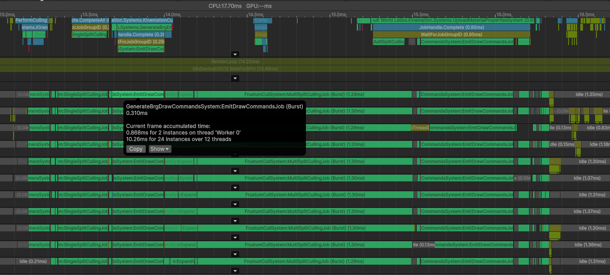

0.31 milliseconds!

Now **that’s fast**!

Interestingly, this new time is very similar to frustum culling. It is almost as
if both jobs are only iterating chunks. (They are)

## Airport Congestion

Remember back at the beginning how `MultiSplitCullingJob` was of concern, but
optimizing it wouldn’t be as impactful? Well, now that we’ve decimated
`EmitDrawCommandsJob`, it is the most time-consuming job at 1.30 ms per thread.
That means it is time to optimize that job too.

And I actually already know where the problem is, because it has shown up
consistently in all our V-Tune captures. It usually looks something like this:

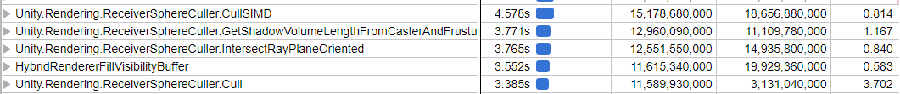

The issue is the sphere culler, which is used for assigning shadow casters to
specific shadow cascade levels. Let’s go over quickly how that algorithm works,
and then we’ll dig into the performance problem.

The idea behind shadow cascades is that we render shadows into multiple
textures, so that a texture with higher resolution per area is used closer to
the camera where detail is more visible, and lower resolution per area textures
can be used to cover the much more expansive space in the distance. Each of
these cascade levels are roughly encompassed by spheres. Sphere culling
identifies which objects need to be drawn for which cascade levels.

The algorithm starts by finding the center of the object, and sending a ray from
that point along the directional light’s direction. The ray is only allowed to
hit the inside of a plane of the rendering camera frustum (not the shadow
camera). The line segment from the object to the hitpoint is inflated by the
AABB extents of the object, forming a capsule shape. Lastly, the capsule is
tested for intersection against all four spheres at once using SIMD.

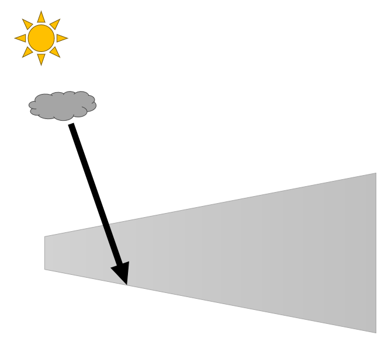

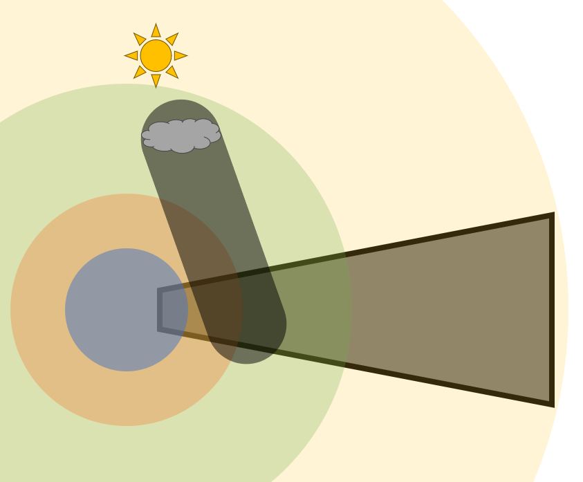

The second picture above shows the outermost sphere encapsulating the entire
frustum. However, this isn’t always the case, and in fact our LFC test case has
the frustum extending well beyond the final shadow cascade.

Anyways, the SIMD capsule-vs-sphere tests, while a bit math-heavy, are not the
main problem. The main problem is the ray being cast against the inside planes
of the camera frustum. Here is the relevant code:

```csharp
// Returns the shortest distance to the front facing plane from the ray.
// Return -1 if no plane intersect this ray.
// planeNumber will contain the index of the plane found or -1.
static float RayDistanceToFrustumOriented(Ray ray, UnsafeList<Plane> planes, out int planeNumber)
{
    planeNumber       = -1;
    float maxDistance = float.PositiveInfinity;
    for (int i = 0; i < planes.Length; ++i)
    {
        float distance;
        if (IntersectRayPlaneOriented(ray, planes[i], out distance) && distance < maxDistance)
        {
            maxDistance = distance;
            planeNumber = i;
        }
    }

    return planeNumber != -1 ? maxDistance : -1.0f;
}

static bool IntersectRayPlaneOriented(Ray ray, Plane plane, out float distance)
{
    distance = 0f;

    float vdot = math.dot(ray.direction, plane.normal);
    float ndot = -math.dot(ray.origin, plane.normal) - plane.distance;

    // No collision if the ray it the plane from behind
    if (vdot > 0)
        return false;

    // is line parallel to the plane? if so, even if the line is
    // at the plane it is not considered as intersection because
    // it would be impossible to determine the point of intersection
    if (Mathf.Approximately(vdot, 0.0F))
        return false;

    // the resulting intersection is behind the origin of the ray
    // if the result is negative ( enter < 0 )
    distance = ndot / vdot;

    return distance > 0.0F;
}
```

The latter method shows up directly in V-Tune. The other gets wrapped up into
its caller’s stack. There’s no need to investigate further into V-Tune though,
because from this code alone, there are obvious inefficiencies.

First, we’re iterating through each plane one-by-one trying to find the index of
the best plane hit by the ray from the inside. That could probably be optimized
with some good-old-fashioned SIMD like the rest of the culling algorithms. But
probably the reason it wasn’t was due to the multiple early-outs. But that’s
where things are especially weird.

In this entire job, there is only one directional light, and consequently only
one direction. Every ray is going to have that same direction. In addition,
there is only one set of planes. That means that `vdot` is completely computed
from job constants, yet it is being computed for every entity we perform sphere
culling on. Even worse, the two early-outs are dependent entirely on `vdot`. We
could have just filtered all those planes out to begin with.

We’re going to need to take ownership of this logic to change it, which means we
need to take ownership of the whole frustum culling data structure Entities
Graphics uses. If you recall from a few adventures back when we were trying to
Burst-compile most of the culling pipeline, we were losing time due to running a
job on the main thread to construct this data structure. Well, now we can fix
that! Actually, even better, since we consolidated frustum culling into a single
system for Mesh LOD support, there’s no need to share this data structure
anymore. We can just construct it in this one system instead and remove the need
for the collection component.

I kid you not, that refactor saved us 100 microseconds per thread inside
`MultiSplitCullingJob`!

I have no idea why or how that happened, as the refactor mostly applied to
outside the job on the main thread. But I guess something changed that made
Burst recognize something it didn’t before. We’ll take it!

Anyways, let’s start by filtering out the planes early. Here is the constructor
code with the old version commented out above.

```csharp
//ShadowFrustumPlanes = GetUnsafeListView(cullingPlanes,
//                                        cullingContext.receiverPlaneOffset,
//                                        cullingContext.receiverPlaneCount);
ShadowFrustumPlanes = new UnsafeList<Plane>(cullingContext.receiverPlaneCount, allocator);
for (int i = 0; i < cullingContext.receiverPlaneCount; i++)
{
    var plane = cullingPlanes[cullingContext.receiverPlaneOffset + i];
                    
    float vdot = math.dot(LightAxisZ, plane.normal);

    // No collision if the ray it the plane from behind
    if (vdot > 0)
        continue;

    // is line parallel to the plane? if so, even if the line is
    // at the plane it is not considered as intersection because
    // it would be impossible to determine the point of intersection
    if (Mathf.Approximately(vdot, 0.0F))
        continue;

    ShadowFrustumPlanes.Add(plane);
}
```

And here’s what our new `IntersectRayPlaneOriented()` looks like now:

```csharp
static bool IntersectRayPlaneOriented(Ray ray, Plane plane, out float distance)
{
    float vdot = math.dot(ray.direction, plane.normal);
    float ndot = -math.dot(ray.origin, plane.normal) - plane.distance;

    // the resulting intersection is behind the origin of the ray
    // if the result is negative ( enter < 0 )
    distance = ndot / vdot;

    return distance > 0.0F;
}
```

We haven’t gotten rid of the internal `vdot` calculation yet. This is just to
see how effective filtering planes is.

Answer: Not very.

We saved at most 50 microseconds from that change. It seems that Unity is
already filtering the planes to a degree, and the code is guarding against some
fringe edge case.

Alright. Let’s try structuring the code for auto-vectorization.

```csharp
float RayDistanceToFrustumOriented(float3 rayOrigin, out int planeNumber)
{
    planeNumber       = -1;
    float maxDistance = float.PositiveInfinity;
    var   rayOriginX  = rayOrigin.x;
    var   rayOriginY  = rayOrigin.y;
    var   rayOriginZ  = rayOrigin.z;
    for (int i = 0; i < receiverPlanePaddedCount; ++i)
    {
        var vdot          = receiverPlaneData[i];
        var planeNormalX  = receiverPlaneData[receiverPlanePaddedCount + i];
        var planeNormalY  = receiverPlaneData[receiverPlanePaddedCount * 2 + i];
        var planeNormalZ  = receiverPlaneData[receiverPlanePaddedCount * 3 + i];
        var planeDistance = receiverPlaneData[receiverPlanePaddedCount * 4 + i];

        var ndot     = -(rayOriginX * planeNormalX + rayOriginY * planeNormalY + rayOriginZ * planeNormalZ) - planeDistance;
        var distance = ndot / vdot;
        var isBest   = distance < maxDistance && distance > 0f;
        maxDistance  = math.select(maxDistance, distance, isBest);
        planeNumber  = math.select(planeNumber, i, isBest);
    }

    return planeNumber != -1 ? maxDistance : -1.0f;
}
```

That made things slower.

Turns out, Burst failed to vectorize that. Here’s what it had to say about it.

```
Remark Type: Analysis
Message:     FrustumCullSystem.cs:758:0: loop not vectorized: value that could not be identified as reduction is used outside the loop
Pass:        loop-vectorize
Remark:      NonReductionValueUsedOutsideLoop
```

Line 758 is the assignment of `planeNumber`. It seems Burst doesn’t understand
how to reduce that selection. That’s because every subsequent iteration is
branching based on the `maxDistance` potentially calculated in the previous
iteration. We’ll have to somewhat manually vectorize it. Here’s what I
eventually ended up with:

```csharp
unsafe float RayDistanceToFrustumOriented(float3 rayOrigin, out int planeNumber)
{
    var    rayOriginX   = rayOrigin.xxxx;
    var    rayOriginY   = rayOrigin.yyyy;
    var    rayOriginZ   = rayOrigin.zzzz;
    float4 maxDistances = float.PositiveInfinity;
    int4   planeNumbers = -1;
    Unity.Burst.CompilerServices.Hint.Assume(receiverPlanePaddedCount >= 4);
    var stride         = receiverPlanePaddedCount / 4;
    var planeDataSimd  = new ReadOnlySpan<float4>(receiverPlaneData.Ptr, stride * 5);
    var vdots          = planeDataSimd.Slice(0, stride);
    var planeNormalXs  = planeDataSimd.Slice(stride, stride);
    var planeNormalYs  = planeDataSimd.Slice(stride + stride, stride);
    var planeNormalZs  = planeDataSimd.Slice(stride * 3, stride);
    var planeDistances = planeDataSimd.Slice(stride * 4, stride);
    for (int i = 0; i < receiverPlanePaddedCount; i += 4)
    {
        var vdot          = vdots[i];
        var planeNormalX  = planeNormalXs[i];
        var planeNormalY  = planeNormalYs[i];
        var planeNormalZ  = planeNormalZs[i];
        var planeDistance = planeDistances[i];

        var ndot     = -(rayOriginX * planeNormalX + rayOriginY * planeNormalY + rayOriginZ * planeNormalZ) - planeDistance;
        var distance = ndot / vdot;
        var isBest   = distance < maxDistances & distance > 0f;
        maxDistances = math.select(maxDistances, distance, isBest);
        planeNumbers = math.select(-1, i + new int4(0, 1, 2, 3), isBest);
    }
    var maxDistance = math.cmin(maxDistances);
    planeNumber     = math.cmax(planeNumbers);

    return planeNumber != -1 ? maxDistance : -1.0f;
}
```

Result: We maybe saved 0 milliseconds from that change, if that.

Well, either vectorizing wasn’t actually eliminating instructions, or this
wasn’t really the problem. Looking at V-Tune, it is now complaining there are
too many division operations in this chunk of code which runs right after
calling the above:

```csharp
var   plane                              = new Plane(normal, receiverPlaneData[receiverPlanePaddedCount * 4 + planeIndex]);
float distFromCasterToPlane              = math.abs(plane.GetDistanceToPoint(casterPosition));
float sinAlpha                           = distFromCasterToPlane / (distFromCasterToFrustumInLightDirection + 0.0001f);
float tanAlpha                           = sinAlpha / (math.sqrt(1.0f - (sinAlpha * sinAlpha)));
distFromCasterToFrustumInLightDirection += casterRadius / (tanAlpha + 0.0001f);
```

Could we do something about this? Maybe. But we would probably need to change
our performance measurement strategy to involve averages over longer periods of
time, because the data is too noisy right now. Perhaps with enough chasing of
these “hints” from V-Tune we could identify a way to descend towards even faster
execution times. But right now, we are in a place where it seems no matter what
we do, things don’t really want to get any faster.

We’ve been through this song and dance before. If we want to break through, we
need to think big. But before that, let’s check in with what GPU Resident Drawer
does, just in case it does things a little more optimally…

Nope. That looks way worse!

## Are You All In?

Once again, we need to stop reasoning about individual entities and start
thinking about chunks, and what conclusions we can extract. What if we could
somehow determine that all entities in the chunk are all inside the same set of
spheres and outside all others?

Currently, for each entity, we are creating a capsule formed by a swept sphere,
and testing for intersection against the shadow cascade spheres. This
conservatively detects intersection. We also do this at the chunk level to
identify shadow cascade spheres that are never touched, and we do skip some
other work based on those results. What we also need to do is detect if at any
point, the swept sphere is fully inside each of the shadow cascades. If that
result perfectly matches the capsule intersection test, then we know that all
entities inside will have that result, and we can skip them.

But how do we test that?

We don’t have to. For this test, false negatives are fine. If we miss spheres,
we’ll end up with different cascade intersection values from the capsule test
and fallback to per-entity testing, which will produce logically correct
results. We are trying to optimize for many distant entities. And at distance,
even for vertically-designed levels, shadow casters are still going to be close
to the shadow receivers in pixels on screen due to perspective. Therefore, I
suspect all we really need to test is the sphere bounds of the shadow caster
where it is at, and ignore the sweeping.

The following is what that looks like. I’ve inserted this change directly into
the main algorithm with an if block, because many useful values are already
calculated. The second and third parameter of the method as well as the if block
are the new parts.

```csharp
int CullSIMD(AABB aabb, bool testBatch, out int isBatchCompletelyInside)
{
    float4 casterRadius4     = new float4(math.length(aabb.Extents));
    float4 combinedRadius4   = casterRadius4 + ReceiverSphereRadius4;
    float4 combinedRadiusSq4 = combinedRadius4 * combinedRadius4;

    float3 lsCasterCenter   = TransformToLightSpace(aabb.Center, LightAxisX, LightAxisY, LightAxisZ);
    float4 lsCasterCenterX4 = lsCasterCenter.xxxx;
    float4 lsCasterCenterY4 = lsCasterCenter.yyyy;
    float4 lsCasterCenterZ4 = lsCasterCenter.zzzz;

    float4 lsCasterToReceiverSphereX4   = lsCasterCenterX4 - LSReceiverSphereCenterX4;
    float4 lsCasterToReceiverSphereY4   = lsCasterCenterY4 - LSReceiverSphereCenterY4;
    float4 lsCasterToReceiverSphereSqX4 = lsCasterToReceiverSphereX4 * lsCasterToReceiverSphereX4;
    float4 lsCasterToReceiverSphereSqY4 = lsCasterToReceiverSphereY4 * lsCasterToReceiverSphereY4;

    float4 lsCasterToReceiverSphereDistanceSq4 = lsCasterToReceiverSphereSqX4 + lsCasterToReceiverSphereSqY4;
    bool4  doCirclesOverlap4                   = lsCasterToReceiverSphereDistanceSq4 <= combinedRadiusSq4;

    float4 lsZMaxAccountingForCasterRadius4 = LSReceiverSphereCenterZ4 + math.sqrt(combinedRadiusSq4 - lsCasterToReceiverSphereSqX4 - lsCasterToReceiverSphereSqY4);
    bool4  isBehindCascade4                 = lsCasterCenterZ4 <= lsZMaxAccountingForCasterRadius4;

    isBatchCompletelyInside = 0;
    if (testBatch)
    {
        float4 lsCasterToReceiverSphereZ4   = lsCasterCenterZ4 - LSReceiverSphereCenterZ4;
        float4 lsCasterToReceiverSphereSqZ4 = lsCasterToReceiverSphereZ4 * lsCasterToReceiverSphereZ4;
        float4 distances4                   = math.sqrt(lsCasterToReceiverSphereDistanceSq4 + lsCasterToReceiverSphereSqZ4);
        bool4  isBoundsFullyInside4         = distances4 + casterRadius4 < ReceiverSphereRadius4;
        isBatchCompletelyInside             = math.bitmask(isBoundsFullyInside4);
    }

    int isFullyCoveredByCascadeMask = 0b1111;

#if !DISABLE_SHADOW_CULLING_CAPSULE_TEST
    float3 shadowCapsuleBegin;
    float3 shadowCapsuleEnd;
    float  shadowCapsuleRadius;
    ComputeShadowCapsule(aabb.Center, casterRadius4.x, out shadowCapsuleBegin, out shadowCapsuleEnd, out shadowCapsuleRadius);

    bool4 isFullyCoveredByCascade4 = IsCapsuleInsideSphereSIMD(shadowCapsuleBegin, shadowCapsuleEnd, shadowCapsuleRadius,
                                                                ReceiverSphereCenterX4, ReceiverSphereCenterY4, ReceiverSphereCenterZ4, CoreSphereRadius4);

    if (math.any(isFullyCoveredByCascade4))
    {
        // The goal here is to find the first non-zero bit in the mask, then set all the bits after it to 0 and all the ones before it to 1.

        // So for example 1100 should become 0111. The transformation logic looks like this:
        // Find first non-zero bit with tzcnt and build a mask -> 0100
        // Left shift by one -> 1000
        // Subtract 1 -> 0111

        int boolMask                = math.bitmask(isFullyCoveredByCascade4);
        isFullyCoveredByCascadeMask = 1 << math.tzcnt(boolMask);
        isFullyCoveredByCascadeMask = isFullyCoveredByCascadeMask << 1;
        isFullyCoveredByCascadeMask = isFullyCoveredByCascadeMask - 1;
    }
#endif

    return math.bitmask(doCirclesOverlap4 & isBehindCascade4) & isFullyCoveredByCascadeMask;
}
```

As you can see, it is only a few extra lines of code. And the result?

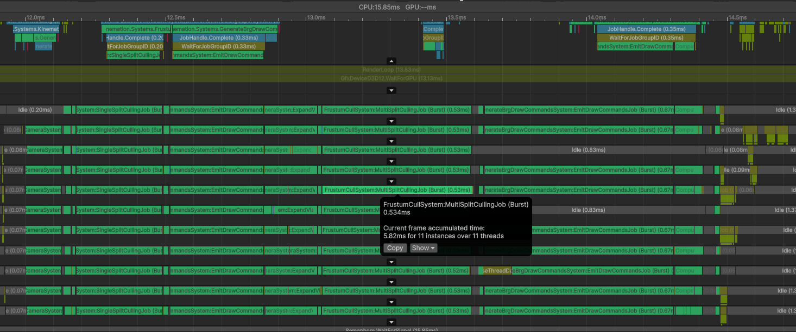

534 microseconds! That’s half the time!

There are three scenarios at play here. There are chunks that are outside the
shadow cascade region, which were already being culled. Then there are the
chunks that are fully inside the outermost cascade sphere, which we just
optimized. And lastly, there are chunks where the outermost cascade sphere cuts
through them, which is why this job is still a little slower than the others we
have optimized. Still though, our entire culling loop is now faster than
`EmitDrawCommandsJob` from when we first started this adventure!

## Reaching for Production

We made some great strides, but we have to remember our test right now is
rendering a bunch of cubes. That’s not really how real games work. We’re going
to have to generalize the `EmitDrawCommandsJob` to work with real production
workloads, which means expanding support for what it can accept. We won’t cover
them all now, but we can at least add splits support, since that is actually in
our test.

Splits are basically a fast way to produce multiple culling results in a single
culling pass. The 4 different shadow cascades are each a split. Similarly,
something that renders into a cubemap like a point light shadowmap will use up
to 6 splits. Each split requires a different `DrawCommandSettings`, so it is a
bit harder to optimize. However, there’s only up to 64 split combinations that
an entities may occupy. And most of the time, they’ll occupy one or two within a
chunk. Therefore, we can probably come up with something that is a little bit
faster than the 550 microseconds the second `EmitDrawCommandsJob` takes per
thread. Let’s try this:

```csharp
else
{
    Span<ChunkPerCameraCullingMask> drawMasksBySplitCombination = stackalloc ChunkPerCameraCullingMask[64];
    drawMasksBySplitCombination.Clear();
    ulong usedSplitsCombinations = 0;

    ulong visibleWord = mask.lower.Value;
    while (visibleWord != 0)
    {
        int   bitIndex     = math.tzcnt(visibleWord);
        int   entityIndex  = bitIndex;
        ulong bitMask      = 1ul << bitIndex;
        visibleWord       ^= bitMask;

        var splitMask                                       = splitsMask.splitMasks[entityIndex];
        drawMasksBySplitCombination[splitMask].lower.Value |= bitMask;
        usedSplitsCombinations                             |= 1ul << splitMask;
    }
    if (mask.upper.Value != 0)
    {
        visibleWord = mask.upper.Value;
        while (visibleWord != 0)
        {
            int   bitIndex     = math.tzcnt(visibleWord);
            int   entityIndex  = 64 + bitIndex;
            ulong bitMask      = 1ul << bitIndex;
            visibleWord       ^= bitMask;

            var splitMask                                       = splitsMask.splitMasks[entityIndex];
            drawMasksBySplitCombination[splitMask].upper.Value |= bitMask;
            usedSplitsCombinations                             |= 1ul << splitMask;
        }
    }
    var entityDrawSettingsBatched = new EntityDrawSettingsBatched
    {
        chunkStartIndex         = entityDrawSettings.chunkStartIndex,
        chunkTransforms         = entityDrawSettings.chunkTransforms,
        positionOffsetInFloats  = entityDrawSettings.positionOffsetInFloats,
        transformStrideInFloats = entityDrawSettings.transformStrideInFloats
    };
    while (usedSplitsCombinations != 0)
    {
        var splitsCombination   = math.tzcnt(usedSplitsCombinations);
        usedSplitsCombinations ^= 1ul << splitsCombination;

        drawCommandSettings.splitMask            = (ushort)splitsCombination;
        var visibleEntities                      = drawMasksBySplitCombination[splitsCombination];
        entityDrawSettingsBatched.lower          = visibleEntities.lower.Value;
        entityDrawSettingsBatched.upper          = visibleEntities.upper.Value;
        entityDrawSettingsBatched.instancesCount = visibleEntities.lower.CountBits() + visibleEntities.upper.CountBits();

        DrawCommandOutput.Emit(ref drawCommandSettings, in entityDrawSettingsBatched);
    }
}
```

Here, we are allocating a visibility mask per split combination. And we are also
using a single 64-bit integer to keep track of which split combinations we are
using, so that when we actually emit our batches, we can index only the
populated visibility masks.

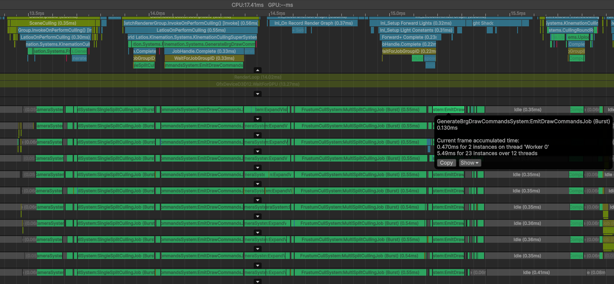

From 550 to 130 microseconds!

That ended up being a lot more effective than I thought it was going to be. Our
culling loop at the start of this adventure took nearly 6 milliseconds. Now it
is under 2 milliseconds.

Apparently, small loops aren’t that bad if it means being able to do batched
emissions. That makes me a bit more confident that we’ll be able to extend this
fast path to support more complex use cases. Instead of failing if there are LOD
crossfades, we can probably batch the entities where the crossfades are
disabled. And for LOD levels, we might be able to run a quick loop to find the
highest LOD level (lowest resolution) and then make a mask in a second loop for
the entities that match that value.

But those changes will happen outside of this adventure. This post is already
very long, so let’s wrap it up.

## Conclusions

A lot happened in this adventure. But I think what is most interesting about all
this is how it paralleled FindPairs and many of its lessons. Once again, we
learned the value of passing things around by reference. We also learned that
once we reach the point where we have a fast core algorithm that we can’t make
faster no matter what we do, that the best approach is to zoom out and look at
the bigger picture.

However, there is new lesson this time around, and that is the cost of
generalization. We started with a solution for a general problem. But with
better understanding of common use cases, we were able to insert an optional
assumption that allowed for significant optimizations. Understanding your data
and the problem you are actually solving is so important. Any small detail can
make a big difference in what you are able to achieve.

And with that, it is time to say goodbye to a chapter in this series, that being
the old workstation I have been developing with since DOTS was first announced.
Perhaps it will return with a linux installation as a benchmarking machine for
future adventures. But by our next adventure, I’ll have switched over to a
high-powered AMD machine. That means we’ll need to learn new tools and new
benchmarking techniques.

What will we be exploring next time? That’s anyone’s guess. But it will probably
be a problem coming from the community again. That means you have the power to
decide the next adventure!

Until then, enjoy the new culling pipeline updates, especially Mesh LOD!
