# Optimization Adventures: Part 17 – Command Buffers 2

Have you ever upgraded your computer or TV, and rather than try out the newest
games or movies, you decide to boot up an old favorite, just to see what it is
like? Maybe it will look better, maybe it will look worse. Maybe it will be the
same as always.

Well, I just got a new computer, and this time around, we are revisiting a topic
that I haven’t given much thought for several years. Way back in Part 4, we
looked at custom command buffers, with a focus on speeding up entity
instantiation. We return to this topic, this time with a focus on entity
destruction.

But before we get started, let me catch you up on how we got here.

## New Computer, New Problems

I built my old computer at the end of the year after the Intel Skylake 6700K
launched. That was back when Intel only ever did quad-core CPUs for their main
desktop series. If you wanted more CPU cores, you needed the extreme desktop
series. The lowest end processor of that series at the time was the Haswell-E
5820K with 6 cores. And oddly enough, it was around the same price as the
Skylake 6700K. That’s what I ended up with, and that computer lasted a long
time. I definitely got my money’s worth out of it!

It was starting to show its age in the last couple years, being somewhat slow to
make game builds and compile code, and struggling in LSSS on missions others
reported ran at smooth framerates. However, that also made that computer good at
validating my tech was fast on lower-end hardware. And then Microsoft decided to
shut down support for that hardware. While I’m personally ready to move
everything to Linux, the rest of the games industry isn’t yet. And Windows is
quirky about things in ways where you really need to be running it to understand
its behavior when issues arise. Hardware prices didn’t suck as much as they had
been, so I figured it was a good time to pull the trigger on a brand new system.

These days, AMD has taken over most of the gaming market, offering up to 16
cores on their mainstream desktop platform. And so I ended up with the 9950X.
Notably, this is not the 3D v-cache variant. Even though most of it is game
development, what I use my computer for most is considered “productivity” tasks
rather than gaming, and productivity doesn’t benefit nearly as much from the 3D
v-cache (and price difference was quite drastic).

Anyways, I now have a computer that can run a lot more worker threads at higher
clock speeds and chew through my jobs. And for a game like LSSS that was heavily
stressing the worker threads, the performance dynamic changed quite a bit with
the new computer. The old computer struggled to achieve 30 FPS on Sector 3
Mission 5, where 25k ships were spawned with their full transform hierarchies,
firing hundreds of thousands of bullets, and performing AI sight scans every
frame. The new computer runs that same mission butter-smooth and even idles a
bit. It’s real challenge is Sector 2 Mission 6, which with 50k ships would bring
my old computer into single-digit frames per second.

This is what I saw first on the new computer:


On the old computer, we had so much work to do, that the spikier FindPairs jobs
would get padded out by all the other jobs. But here, there’s too many CPU cores
for that. And now the spikes are causing bubbles in our job threads!

We can see that the worst offenders here are for the radar scan, which is using
parallel-by-A mode. That means, the radars are read-write, but the ships they
find are read-only. In this case, the bottleneck is for the radars that fall
into the cross bucket. These radars need to test against all the other buckets
of all the other ships. There are four threads with this bottleneck, one for
each faction.

As a quick investigation, I decided to add a call to
`PhysicsDebug.LogBucketCountsForLayer()` to see what the bucket distribution for
the radars looked like. And turns out, 2 / 3 radars are in the cross-bucket.
Whoops.

Unfortunately, making the cell sizes big enough to matter also meant there were
less buckets, which actually hurt parallelism a lot and made FindPairs less
efficient for the other jobs. So that wasn’t the solution.

As an experiment, I tried writing a new version of the system that simply used
FindObjects for each radar in an `IJobEntity`. As you might imagine, this had
much better thread distribution. And while the overall thread time was slower
than FindPairs, if you also factored in the radar `CollisionLayer` construction
and double-buffering the FindPairs-based radar system was performing, then it
worked out even. But now, the workload has been distributed more evenly,
resulting in better frame times!

The other bubble comes from a single-threaded `IJobEntity` that iterates each
spawner, tests if there is a ship to spawn and if the spawner can spawn it, and
if so, it performs spawning logic. There’s 50k spawners in this mission, so this
added up. Even worse, this job has to run twice. There’s a counter based on
`EntityIndexInQuery`, and the first job can only consider entities greater than
the counter, while the second job can only consider entities smaller than the
counter. This is so the spawners are cycled over multiple frames.

Putting this all together, half the time the spawners aren’t being considered
because they are on the wrong side of the counter. And another chunk of the
time, there’s not any more ships to spawn. Is there a way to not iterate all
these entities all the time?

Yes, yes there is.

Using `IJobEntityChunkBeginEnd`, I was able to use this little chunk-level
filter:

```csharp
public bool OnChunkBegin(in ArchetypeChunk chunk, int unfilteredChunkIndex, bool useEnabledMask, in v128 chunkEnabledMask)
{
    // Cull entire chunks if we can
    if (spawnQueues.playerQueue.IsEmpty() && spawnQueues.aiQueue.IsEmpty())
        return false;

    var baseIndex = __ChunkBaseEntityIndices[unfilteredChunkIndex];
    if (useBeforeIndex && baseIndex + chunk.Count <= initialIndex)
        return false;
    if (!useBeforeIndex && baseIndex >= initialIndex)
        return false;
    return true;
}
```

Yes, I’m borrowing from the code-generated base indices array. Unity may break
that some day. But then I’ll probably just rewrite the job as an `IJobChunk`.
But in the meantime, this totally works, and shrunk the job to something far
less visible in the profiler. After this, I went exploring and found another job
that was iterating all bullets that could use a similar filter optimization.

## The Monster That Lurks

With those fixes, frames now look more like this:


The bubbles from the end of our simulation aren’t nearly as big. Things are
looking so much better…

Until we look at this frame:


Yikes! That’s a huge gap! And it is during the sync point! What is happening?
Let’s zoom in:

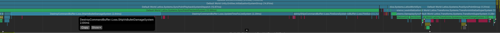

These are `DestroyCommandBuffer` spikes. And while this frame shows the spikes
coming from `DestroyCommandBuffer`s of two specific systems, there are two other
systems that use `DestroyCommandBuffer` that will also produce spikes on
different frames.

My hypothesis is that the vast majority of the time is being spent inside
`EntityManager.DestroyEntity()`. And while it is fun to blame Unity for
problems, I can try to verify it with the following:

```csharp
public static unsafe void Playback(DestroyCommandBuffer* dcb, EntityManager* em)
{
    var entities = dcb->m_entityOperationCommandBuffer.GetEntities(Allocator.Temp);
    using (new Unity.Profiling.ProfilerMarker($"Destroying_{entities.Length}_root_entities").Auto())
    {
        em->DestroyEntity(entities);
    }
    dcb->m_playedBack.Value = true;
}
```

I added the entity count to the profiler marker. Not only will this provide us a
sense of scale, it will also help us identify comparable frames run-to-run so
that we can measure any improvements we make.


Let’s start with this frame. There’s a bunch of red, and that red means that the
allocator is getting hung up creating and destroying `DynamicBuffers` allocated
outside the chunk. Most of the time, this is `LinkedEntityGroup`. In this
particular capture, the `TimeToLiveSystem` is mostly destroying spawner visuals,
which have multiple renderer entities. Meanwhile, `AutoDestroyExpirablesSystem`
is destroying audio sources that finished playing. Most of these are from bullet
firing, and in this mission, those sounds are single entities each. However, a
few of the sounds are explosions which layer sounds and thus have
`LinkedEntityGroup`. These two are roughly 7k and 22.5k root entities
respectively.

Here's another spike:

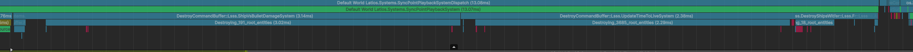

This time, we see `ShipVsBulletDamageSystem`, which is destroying bullets.
Bullets are singular entities with no `LinkedEntityGroup`. And there’s less than
200 of them being destroyed. Similarly, there’s half as many `TimeToLiveSystem`
entities being destroyed, and a lot less red, but still a bunch of time taken.
This frame might be a misnomer. It could be the CPU core running this thread is
also running an operating system thread, and that thread is demanding more time.

Looking through various other frames, there isn’t much consistency in the scale
and time period, other than `AutoDestroyExpirablesSystem` showing some trend of
needing more time when destroying more entities. This system also sees some of
the highest destroy counts per frame.

But hey. My assumption was correct that most of the time does indeed seem to be
inside `EntityManager.DestroyEntity()`. We’re going to have to dig deep to
figure this one out.

## Monster Taxonomy

I don’t trust that Unity reports all `DynamicBuffer` disposals. There’s always
been something kinda weird with those markers. So to truly understand what is
happening, I’ve added my own marker wrapped around `DynamicBuffer` destruction.

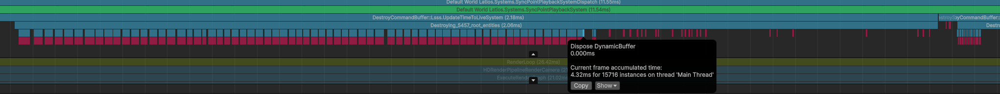

Nope, it is definitely marking every single one. Actually, we’re seeing
additional disposes not associated with dynamic buffers. What could those be
from?

If you trace `EntityManager.DestroyEntity()`, you’ll find layers of call
forwarding wrapped with safety checks and other decorations, until you finally
reach this method in `EntityComponentStore`.

```csharp
public void DestroyEntities(Entity* entities, int count)
{
    var entityIndex = 0;

    var additionalDestroyList = new UnsafeList<Entity>(0, Allocator.TempJob);
    int minDestroyStride      = int.MaxValue;
    int maxDestroyStride      = 0;

    while (entityIndex != count)
    {
        var entityBatchInChunk =
            GetFirstEntityBatchInChunk(entities + entityIndex, count - entityIndex);
        var chunk        = entityBatchInChunk.Chunk;
        var batchCount   = entityBatchInChunk.Count;
        var indexInChunk = entityBatchInChunk.StartIndex;

        if (chunk == ChunkIndex.Null)
        {
            entityIndex += batchCount;
            continue;
        }

        AddToDestroyList(chunk, indexInChunk, batchCount, count, ref additionalDestroyList,
                            ref minDestroyStride, ref maxDestroyStride);

        DestroyBatch(new EntityBatchInChunk {Chunk = chunk, StartIndex = indexInChunk, Count = batchCount});

        entityIndex += batchCount;
    }

    // Apply additional destroys from any LinkedEntityGroup
    if (!additionalDestroyList.IsEmpty)
    {
        var additionalDestroyPtr = additionalDestroyList.Ptr;
        // Optimal for destruction speed is if entities with same archetype/chunk are followed one after another.
        // So we lay out the to be destroyed objects assuming that the destroyed entities are "similar":
        // Reorder destruction by index in entityGroupArray...

        //@TODO: This is a very specialized fastpath that is likely only going to give benefits in the stress test.
        ///      Figure out how to make this more general purpose.
        if (minDestroyStride == maxDestroyStride)
        {
            var reordered = (Entity*)Memory.Unmanaged.Allocate(additionalDestroyList.Length * sizeof(Entity), 16,
                                                                Allocator.TempJob);
            int batchCount = additionalDestroyList.Length / minDestroyStride;
            for (int i = 0; i != batchCount; i++)
            {
                for (int j = 0; j != minDestroyStride; j++)
                    reordered[j * batchCount + i] = additionalDestroyPtr[i * minDestroyStride + j];
            }

            DestroyEntities(reordered, additionalDestroyList.Length);
            using (sReorderDispose.Auto())
            {
                Memory.Unmanaged.Free(reordered, Allocator.TempJob);
            }
        }
        else
        {
            DestroyEntities(additionalDestroyPtr, additionalDestroyList.Length);
        }
    }

    using (sAdditionalDispose.Auto())
    {
        additionalDestroyList.Dispose();
    }
}
```

*From Entities 1.3.14 EntityComponentStoreCreateDestroyEntities.cs*

Side note, the profiler markers wrapped around memory disposals are mine. And
turns out, these aren’t the culprit of the extra red markers. What then is the
culprit? Well, I think it is related to various internal lists that associate
chunks with archetypes.

Anyways, what is clear to me now is that `DynamicBuffer` allocations are at most
only half our problem. That means there’s a lot of other work going on that
could potentially be optimized, if we can identify a way to manipulate it. So
let’s analyze the method above.

There’s an `additionalDestroyList` which is meant to collect entities from
`LinkedEntityGroup`. Then there’s a loop through all entities. At the start of
the loop, there’s a call to `GetFirstEntityBatchInChunk()`. This method finds
the number of subsequent entities in the list from the starting point that are
also consecutive in the ECS chunk of the first entity. Don’t mind that
`entityBatchInChunk` gets deconstructed and then reconstructed again only a few
lines later, that’s just how some folks at Unity like to write code it seems.
But next, `AddToDestroyList()` iterates each entity in the batch, accessing the
`LinkedEntityGroup` buffer. It adds all but the first entity of each buffer into
the `additionalDestroyList`. And then it calls `DestroyBatch()`. That method is
responsible for either moving the entities to a cleanup chunk, or just
destroying them (and their buffers). Then, it moves entities from the back of
the chunk to fill in the gaps if necessary.

The next thing you may be wondering is how a destroy pipeline with
`IEnableableComponent` would compare to this. Fortunately or unfortunately, it
is quite similar. The `EntityQuery` is used to identify chunks, and the
enableable bits help identity multiple `entityBatchInChunk` instances for each
chunk. But then it still uses `DestroyBatch()`. The only interesting quirk is
that it iterates the batches backwards in each chunk, which ensures the batches
remain valid in spite of any gap filling. So aside from skipping having to look
up the chunk for each entity, the `EntityQuery` version doesn’t appear any
faster.

The second block of code destroys the additional entities from
`LinkedEntityGroup` buffers. If all `LinkedEntityGroup` buffers had the exact
same number of entities, Unity tries to transpose the entities in order to
increase the chance of destroying larger batches. This brings up a new question,
how much time do we spend destroying the additional entities rather compared to
the initial set?

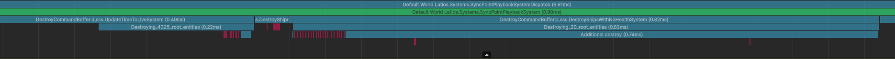

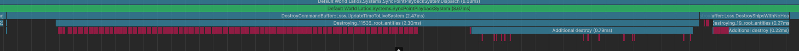

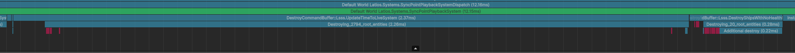

So it definitely matters for destroyed ships. And it seems like it matters less
for entities that have timers, but how much less depends on the distribution of
entities between bullets and more complex hierarchies.

## A Timer Trick

Hopefully by now it is at least obvious Unity likes it when we send entities to
destroy from the same chunks next to each other, so that it can potentially
batch them. If you scroll back to where I showed the profiler capture of a spike
involving `ShipVsBulletDamageSystem`, then you may have noticed that it took
just as long as the `UpdateTimeToLiveSystem` despite destroying an order of
magnitude less entities. Both are destroying bullets, so there’s no hierarchy
shenanigans going on. Instead, `ShipVsBulletDamageSystem` is destroying bullets
in a FindPairs operation, while `UpdateTimeToLiveSystem` is destroying bullets
in an `IJobEntity`. The latter is causing the destroy list to group entities by
chunk.

What if inside `ShipVsBulletDamageSystem`, instead of destroying the bullets, we
modified them so that `UpdateTimeToLiveSystem` would destroy them?

Yes, this would mean an additional random access in `ShipVsBulletDamageSystem`.
However, bullets don’t hit ships that often, and this would distribute the cost
to worker threads.

But what about dependencies? This would introduce a new dependency delaying when
the `UpdateTimeToLiveSystem` job runs. Are those jobs filling space between
FindPairs jobs?


That doesn’t seem to be the case. In fact, it would seem these jobs are running
too early, before any of the FindPairs jobs start.

So the simple solution is inside the FindPairs processor, remove the line adding
the bullet to the `DestroyCommandBuffer`, and replace it with a line setting
`TimeToLive` to `0f`.

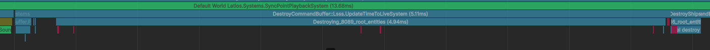

Well…

On same frames this seems to have helped, but then there’s frames like this
where it seems we got the sum of the work. I guess when bullets spawn, they all
tend to spawn in the same chunks, and expire around the same time, so there’s
significant batching potential. However, bullets that hit ships disrupt that, so
these bullets must be quite scattered.

But at the very least, the `UpdateTimeToLive` job now runs alongside some
FindPairs jobs, mitigating some of our bubbles. So at least that’s an
improvement.

## Playing in the Dark Forest

Even with our attempts to improve batches, we are still seeing high workloads in
`DestroyCommandBuffer` for simple bullet entities that have no hierarchies,
cleanup components, or anything of that nature. Why is this so slow, but only
sometimes? It isn’t clear yet.

I went out of my way to do some exploring of `DestroyBatch()`, tracing its calls
and seeing if there were any clues that could help. Along the way, I came across
this precarious method in EntityComponentStoreChunk.cs.

```csharp
void DeallocateBuffers(ChunkIndex chunk, int indexInChunk, int batchCount)
{
    var archetype = GetArchetype(chunk);
    var chunkBuffer = chunk.Buffer;

    for (int ti = 0, count = archetype->TypesCount; ti < count; ++ti)
    {
        var type = archetype->Types[ti];

        if (!type.IsBuffer)
            continue;

        var basePtr = chunkBuffer + archetype->Offsets[ti];
        var stride = archetype->SizeOfs[ti];

        for (int i = 0; i < batchCount; ++i)
        {
            byte* bufferPtr = basePtr + stride * (indexInChunk + i);
            BufferHeader.Destroy((BufferHeader*)bufferPtr);
        }
    }
}
```

This method gets called unconditionally. And it checks every component in the
archetype to see if it is a buffer. Curiously, I also found this method in
ChunkDataUtility.cs which seems to serve the same purpose, but for the entire
chunk rather than a small range of entities.

```csharp
public static void DeallocateBuffers(Archetype* archetype, ChunkIndex chunk)
{
    var bufferComponentsEnd = archetype->BufferComponentsEnd;
    var buffer = chunk.Buffer;
    var entityCount = chunk.Count;

    for (var ti = archetype->FirstBufferComponent; ti < bufferComponentsEnd; ++ti)
    {
        Assert.IsTrue(archetype->Types[ti].IsBuffer);
        var basePtr = buffer + archetype->Offsets[ti];
        var stride = archetype->SizeOfs[ti];

        for (int i = 0; i < entityCount; ++i)
        {
            byte* bufferPtr = basePtr + stride * i;
            BufferHeader.Destroy((BufferHeader*)bufferPtr);
        }
    }
}
```

Notice how this one is exclusively iterating a range of types in the archetype
known to be the `DynamicBuffer` types? `Archetype`s have this grouping, and both
methods have the `Archetype`. So why isn’t the first doing this? Does it even
matter?

…

Oh.

It matters.

Let’s hope that by the time you are reading this, Unity has fixed this. Because
this makes a real difference for me. And I found a similar situation in
ChunkDataUtility.cs. Line with comment shows my modification.

```csharp
public static void Copy(EntityComponentStore* entityComponentStore, ChunkIndex srcChunk, int srcIndex, ChunkIndex dstChunk, int dstIndex, int count)
{
    var arch = entityComponentStore->GetArchetype(srcChunk);

    Assert.IsTrue(arch == entityComponentStore->GetArchetype(dstChunk));

    var srcBuffer  = srcChunk.Buffer;
    var dstBuffer  = dstChunk.Buffer;
    var offsets    = arch->Offsets;
    var sizeOfs    = arch->SizeOfs;
    var typesCount = arch->NonZeroSizedTypesCount;  //arch->TypesCount;

    for (var t = 0; t < typesCount; t++)
    {
        var offset = offsets[t];
        var sizeOf = sizeOfs[t];
        var src    = srcBuffer + (offset + sizeOf * srcIndex);
        var dst    = dstBuffer + (offset + sizeOf * dstIndex);

        UnsafeUtility.MemCpy(dst, src, sizeOf * count);
    }
}
```

All component types that have real sizes are in the archetype first, followed by
the other types. So this version skips attempting to move per-entity data around
for zero-sized types. The original code resulted in a bunch of zero-sized
`MemCpy()` calls at the end of each chunk operation.

Most interestingly, these changes had the most impact on the `LinkedEntityGroup`
destroy lists.

## Scanning for Inefficient Orders

While there are low-hanging fruits in the Entities package code to be addressed,
that’s not something we have much control over in a practical sense. What we can
control are the list of entities that are destroyed, and the order of those
entities in that list. And that brings the question, how optimal is our order?

Let’s start with the `LinkedEntityGroup` extra entities. We can write a little
substitute method for `DestroyEntities()` like this:

```csharp
void CalculateChunkRevisitsAndDestroy(Entity* entities, int count)
{
    var chunksUsed      = new UnsafeHashSet<int>(count, Allocator.Temp);
    int lastChunk       = -1;
    int revisitedChunks = 0;
    for (int i = 0; i < count; i++)
    {
        var entityBatchInChunk = GetFirstEntityBatchInChunk(entities + i, count - i);
        var chunk              = entityBatchInChunk.Chunk;
        if (chunk == lastChunk)
            continue;
        if (!chunksUsed.Add(chunk))
            revisitedChunks++;
        lastChunk = chunk;
    }

    using (new Unity.Profiling.ProfilerMarker($"Extra_destroy_chunk_revisits_{revisitedChunks}").Auto())
    {
        DestroyEntities(entities, count);
    }
}
```

This iterates each entity in the list, and detects if it is in a different chunk
than the previous entity, and is in a chunk that a previous entity was in. While
this doesn’t guarantee that we missed a batch potential, it does give us a hint
at the randomness of our entities.

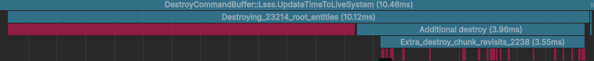


The first is the frame when many of the initial spawner visuals are destroyed.
The second is when a number of ships happened to all be destroyed in the same
frame. It would seem there are some inefficiencies that could be solved, but not
too many.

For the second test, let’s also count how many entities in the chunk are
out-of-order, by counting the number of times the current entity has an index in
chunk lower than the previous.

```csharp
if (chunk == lastChunk)
{
    var indexInChunk = entityBatchInChunk.StartIndex;
    if (indexInChunk < lastIndexInChunk)
        outOfOrder++;
    lastIndexInChunk = indexInChunk;
}
```

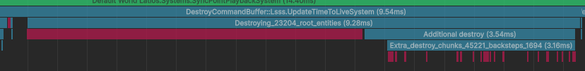


The answer is that it is an even smaller number for spawners and ships. For
ships, I found only a few frames where the number wasn’t zero.

Alright. Third test. This one is a weird one. We are going to count the number
of chunks that have a batch not ending at the end of the chunk, where the number
of entities destroyed is greater than the number of non-destroyed entities after
that batch. This time, I’ll use this logic for roots as well.

Oh, and I wrote some bugs in the second test, so those numbers were higher than
they should have been.

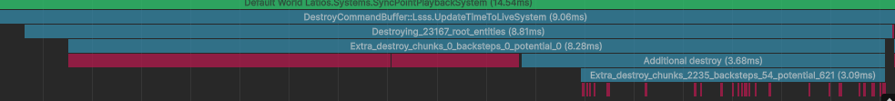

So here we see that roots have zero optimization potential, but there’s at least
some suboptimal chunk shuffling happening for `LinkedEntityGroup`.


Destroying bullets also shows near 0 potential.


Destroying ships only shows that chunks get revisited. But this is on average
one entity per ship, when a ship is composed of several entities. The speedup
potential here is likely no more than 20%.

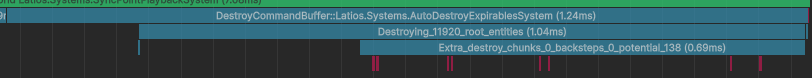

Interesting. It seems like audio sources are quite prone to the last test.

And lastly, let’s capture the number of chunks that have both a batch at the
end, and one other batch. At this point, my hacked together abomination of tests
looks like this:

```csharp
public void CalculateChunkRevisitsAndDestroy(Entity* entities, int count)
{
    var  chunksUsed                         = new UnsafeHashSet<int>(count, Allocator.Temp);
    int  lastChunk                          = -1;
    int  revisitedChunks                    = 0;
    int  lastIndexInChunk                   = -1;
    int  outOfOrder                         = 0;
    int  lastEndInChunkBeforeLastBatch      = -1;
    int  numDestroyedInChunkBeforeLastBatch = 0;
    int  firstTailBatchOrEndChunk           = -1;
    int  chunksSwapPotential                = 0;
    bool hasTail                            = false;
    bool hasNonTail                         = false;
    int  tailPlus                           = 0;
    for (int i = 0; i < count; i++)
    {
        var entityBatchInChunk = GetFirstEntityBatchInChunk(entities + i, count - i);
        var chunk              = entityBatchInChunk.Chunk;
        if (chunk == lastChunk)
        {
            var indexInChunk = entityBatchInChunk.StartIndex;
            if (indexInChunk < lastIndexInChunk)
                outOfOrder++;
            lastIndexInChunk = indexInChunk;
            if (indexInChunk + entityBatchInChunk.Count == chunk.Count)
            {
                firstTailBatchOrEndChunk = math.min(firstTailBatchOrEndChunk, indexInChunk);
                hasTail                  = true;
            }
            else
            {
                numDestroyedInChunkBeforeLastBatch++;
                lastEndInChunkBeforeLastBatch = math.max(lastEndInChunkBeforeLastBatch, indexInChunk + entityBatchInChunk.Count);
                hasNonTail                    = true;
            }
        }
        else
        {
            if (lastEndInChunkBeforeLastBatch > 0 && numDestroyedInChunkBeforeLastBatch - (firstTailBatchOrEndChunk - lastEndInChunkBeforeLastBatch) > 0)
                chunksSwapPotential++;
            if (hasTail && hasNonTail)
                tailPlus++;
            lastEndInChunkBeforeLastBatch      = -1;
            firstTailBatchOrEndChunk           = chunk.Count;
            numDestroyedInChunkBeforeLastBatch = 0;
            lastIndexInChunk                   = -1;
            hasTail                            = false;
            hasNonTail                         = false;
            if (!chunksUsed.Add(chunk))
                revisitedChunks++;
            lastChunk = chunk;
        }
    }

    using (new Unity.Profiling.ProfilerMarker($"Destroy_revisits_{revisitedChunks}_backsteps_{outOfOrder}_potential_{chunksSwapPotential}_tails_{tailPlus}").Auto())
    {
        DestroyEntities(entities, count);
    }
}
```

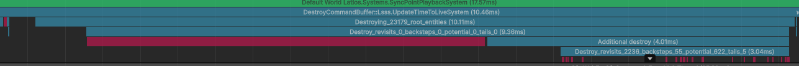

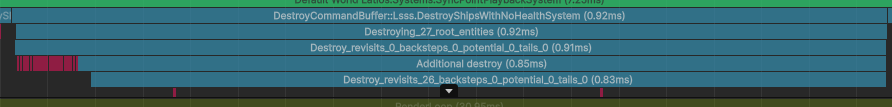


## Sorting by Chunk without Sorting

We just ran a bunch of tests, but what exactly were all those tests for? What
did we want to know?

Let’s start with the simple one. We know Unity can destroy multiple entities in
batch when a subrange of entities in our destroy array are lined up next to each
other inside an ECS chunk. While we often have that for the root entities
already, we don’t have that for `LinkedEntityGroup` entities. Unity tries to do
this for us under very specific scenarios, but we can do this ourselves by
adding the `LinkedEntityGroup` entities to our own arrays and then clearing each
`DynamicBuffer<LinkedEntityGroup>` so Unity ignores them.

However, this means we need to gather and rearrange our entities so that they
are grouped by chunk, yet still ordered deterministically. Unfortunately, chunks
themselves do not have any deterministic ordering ID, so we can’t just sort by
`EntityStorageInfo`. Instead, we’ll do something a little different.

We start by fetching the root entities sorted by `sortKey`, and then run a loop
to gather the `DynamicBuffer<LinkedEntityGroup>` and count the entities in
those.

```csharp
var entities = dcb.m_entityOperationCommandBuffer.GetEntities(Allocator.Temp);

// Collect LEGs and count LEG entities
var legs           = new UnsafeList<DynamicBuffer<LinkedEntityGroup> >(entities.Length, Allocator.Temp);
int legEntityCount = 0;
foreach (var entity in entities)
{
    if (legLookup.TryGetBuffer(entity, out var leg))
    {
        legEntityCount += math.max(0, leg.Length - 1);
        legs.AddNoResize(leg);
    }
}
```

It should be noted we subtract one from each buffer length, because it is
assumed the first entity is always the root entity. Also, this loop only ever
looks at the buffer headers, rather than the buffer arrays itself, so only the
headers get pulled into cache at this time. We cache the headers so that we
don’t have to do archetype lookups after this point.

Next, we need to define these two types:

```csharp
struct ChunkData
{
    public BitField64 lower;
    public BitField64 upper;
    public int        prefixSum;
    public byte       count;
    public byte       lowerCount;
    public byte       chunkTotalCount;
}

struct EntityWithInfo
{
    public Entity entity;
    int           packed;
    public int chunkIndex
    {
        get => Bits.GetBits(packed, 0, 25);
        set => Bits.SetBits(ref packed, 0, 25, value);
    }
    public int indexInChunk
    {
        get => Bits.GetBits(packed, 25, 7);
        set => Bits.SetBits(ref packed, 25, 7, value);
    }
}
```

Our goal is to build two lists, one for each type. `ChunkData` is a bitfield we
will be making per chunk of entities that need to be destroyed. We also store a
prefix sum which will allow us to find a range in an array of entities that come
from the chunk.

`EntityWithInfo` is a condensed version of `EntityStorageInfo`, except instead
of an `ArchetypeChunk`, it instead has an index into the list of `ChunkData`.

We are going to identify and collect chunks in the order we see them while
iterating through entities. We’ll use an `UnsafeHashMap<ArchetypeChunk, int>` to
map chunks to indices in our list. We’ll also use an `UnsafeHashSet<int>` to
filter out duplicate entities. We only need to filter on `Index` for
deduplication, as before that we’ll be filtering out already destroyed entities,
so there won’t be any `Index` conflicts. That all looks like this:

```csharp
// Find chunks for entities and deduplicate
var maxChunkCount    = entities.Length + legEntityCount;
var chunks           = new UnsafeList<ChunkData>(maxChunkCount, Allocator.Temp);
var chunkMap         = new UnsafeHashMap<ArchetypeChunk, int>(maxChunkCount, Allocator.Temp);
var deduplicatedList = new UnsafeList<EntityWithInfo>(entities.Length + legEntityCount, Allocator.Temp);
var deduplicationSet = new UnsafeHashSet<int>(entities.Length + legEntityCount, Allocator.Temp);
foreach (var entity in entities)
{
    if (!em.Exists(entity))
        continue;
    if (!deduplicationSet.Add(entity.Index))
        continue;
    var esi = em.GetStorageInfo(entity);
    if (!chunkMap.TryGetValue(esi.Chunk, out var chunkIndex))
    {
        chunkIndex                                         = chunks.Length;
        chunks.AddNoResize(new ChunkData { chunkTotalCount = (byte)esi.Chunk.Count});
        chunkMap.Add(esi.Chunk, chunkIndex);
    }
    deduplicatedList.AddNoResize(new EntityWithInfo { entity = entity, chunkIndex = chunkIndex, indexInChunk = esi.IndexInChunk});

    ref var chunk = ref chunks.ElementAt(chunkIndex);
    if (esi.IndexInChunk >= 64)
        chunk.upper.SetBits(esi.IndexInChunk - 64, true);
    else
        chunk.lower.SetBits(esi.IndexInChunk, true);
}
foreach (var leg in legs)
{
    for (int i = 1; i < leg.Length; i++)
    {
        var entity = leg[i].Value;
        if (!em.Exists(entity))
            continue;
        if (!deduplicationSet.Add(entity.Index))
            continue;
        var esi = em.GetStorageInfo(entity);
        if (!chunkMap.TryGetValue(esi.Chunk, out var chunkIndex))
        {
            chunkIndex                                         = chunks.Length;
            chunks.AddNoResize(new ChunkData { chunkTotalCount = (byte)esi.Chunk.Count });
            chunkMap.Add(esi.Chunk, chunkIndex);
        }
        deduplicatedList.AddNoResize(new EntityWithInfo { entity = entity, chunkIndex = chunkIndex, indexInChunk = esi.IndexInChunk });
        ref var chunk                                                                                            = ref chunks.ElementAt(chunkIndex);
        if (esi.IndexInChunk >= 64)
            chunk.upper.SetBits(esi.IndexInChunk - 64, true);
        else
            chunk.lower.SetBits(esi.IndexInChunk, true);
    }
    leg.Clear();
}
```

Now this is where things get fun. We need to build our ordered
`NativeArray<Entity>` from these two lists. First, we need to compute our prefix
sums for our chunks. And then, for each entity, we know the chunk base offset
from the prefix sum. Additionally, we know the entity’s index in the chunk, and
the bitmask of entities destroyed within that chunk. That means that with some
bit manipulations, we can calculate how many destroyed entities in the chunk
precede any given entity within the chunk. That looks like this:

```csharp
// Prefix sum chunks
for (int i = 0, sum = 0; i < chunks.Length; i++)
{
    ref var chunk     = ref chunks.ElementAt(i);
    chunk.prefixSum   = sum;
    chunk.lowerCount  = (byte)chunk.lower.CountBits();
    chunk.count       = (byte)(chunk.lowerCount + chunk.upper.CountBits());
    sum              += chunk.count;
}
// Assign
var destroyArray = new NativeArray<Entity>(deduplicatedList.Length, Allocator.Temp, NativeArrayOptions.UninitializedMemory);
foreach (var entity in deduplicatedList)
{
    var chunk = chunks[entity.chunkIndex];
    if (entity.indexInChunk < 64)
    {
        var offset                             = math.countbits(chunk.lower.Value & ((1ul << entity.indexInChunk) - 1));
        destroyArray[chunk.prefixSum + offset] = entity.entity;
    }
    else
    {
        var offset                             = chunk.lowerCount + math.countbits(chunk.upper.Value & ((1ul << (entity.indexInChunk - 64)) - 1));
        destroyArray[chunk.prefixSum + offset] = entity.entity;
    }
}
```

### Analysis

Let’s see how this algorithm so far handles our use cases. Remember, in many
cases, we only have root entities with entities already ordered in chunks, so we
want to ensure this algorithm isn’t too costly. And maybe it will improve our
`LinkedEntityGroup` cases.

With all the prior tests, I noticed a couple patterns for particular spikes in
every profile capture. The `UpdateTimeToLiveSystem` has two consistent spikes,
the first one happens when the initial wave of spawner visuals are destroyed,
and the second is when the first round of bullets that all the AI ships shoot
time out.

First, the spawner destruction frame:

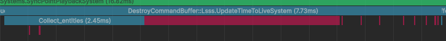

Ouch! 2.45 milliseconds for collecting our entities? That’s not fast.

Except it is.

Prior to this point, the fastest this particular frame ever did was 8.5
milliseconds, and that was with all the profile markers removed. So now, we have
something faster. And even better, we now have 2.45 milliseconds of performance
without our controlled domain. We may be able to make it even faster!

Now for the first wave of bullets:


Phew! The impact of our logic here is tiny. That’s good, because there’s almost
nothing to gain from this scenario by reordering. From our tests, our entities
were almost always in perfect order for this particular case.

Now let’s find an impactful frame where ships get destroyed. There’s not really
a consistent frame for this, so I just look for an expensive one.

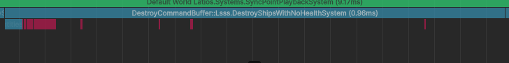

No real difference. Our collection phase is tiny.

And finally, audio:

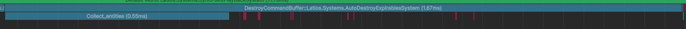

Okay. This one might have experienced a slight regression. But not much. I’m
going to guess that most of our expenses come from jumping around between the
various `LinkedEntityGroup` buffers, and then jumping around between chunks for
each entity in each buffer. However, perhaps there are still things we can do.

## Owning Our Problems

Looking through the Burst inspector, I noticed a couple of areas where Burst was
having trouble.

The first was iterating through each `DynamicBuffer<LinkedEntityGroup>` entity
elements. The assembly was too messy for me to determine whether Burst was
caching whether the buffer was inside or outside the chunk. However, we can
improve things by skipping buffers that have only 1 or fewer entities, and by
converting the buffer to a `NativeArray` for iteration.

Another area was that we are storing 16 bytes for the key in our
`hashmap<ArchetypeChunk, int>` which is awkward. Internally, Unity references
chunks with a 4-byte index, and uses that for equality and hashcode operations.
This means we really just need to store the hashcode.

These changes definitely made an impact in the Burst inspector. But do they make
an impact on our runtime?

Nope. Not at all.

Alright. I think it is time to profile each loop and see which one is the most
problematic.


Yeah. That makes sense. This is the loop that is accessing the actual
`LinkedEntityGroup` buffer contents, iterating each entity inside, finding its
chunk, and then looking up the chunk in the map. But then there’s this for
audio:


It seems checking for the existence of `LinkedEntityGroup` also has a cost.

Actually, this got me thinking. Do we even need to deduplicate entities? After
all, we have an algorithm that directly assigns them to a specific array index.
Duplicates would just be assigned to the same array index. We just have to size
the array based on the prefix sum total rather than our other `EntityWithInfo`
list.

That helped a little, but not a lot. Maybe a couple hundred microseconds.

Something interesting about this is that the assignment phase at the end is very
fast, despite touching every entity including every entity included in
`LinkedEntityGroup`. This makes me believe that our issue here is cache misses
jumping around between archetypes and buffers. Maybe we can parallelize that?

Yeah. We’re going there.

First, the three jobs we’ll schedule:

```csharp
[BurstCompile]
struct FindRootsJob : IJobFor
{
    [ReadOnly] public NativeArray<Entity>             roots;
    [ReadOnly] public EntityStorageInfoLookup         esil;
    [ReadOnly] public BufferLookup<LinkedEntityGroup> legLookup;
    public NativeArray<EntityWithInfo>                rootsWithInfo;
    public NativeArray<int>                           legCounts;

    public void Execute(int i)
    {
        var entity = roots[i];
        if (!esil.Exists(entity))
        {
            rootsWithInfo[i] = default;
            legCounts[i]     = default;
            return;
        }

        if (legLookup.TryGetBuffer(entity, out var buffer))
            legCounts[i] = math.max(0, buffer.Length - 1);
        else
            legCounts[i] = 0;

        var esi          = esil[entity];
        rootsWithInfo[i] = new EntityWithInfo
        {
            entity       = entity,
            chunkIndex   = esi.Chunk.GetHashCode(),
            indexInChunk = esi.IndexInChunk,
        };
    }
}

[BurstCompile]
struct PrefixSumLegsJob : IJob
{
    public NativeArray<int>           legPrefixSums;
    public NativeReference<int>       legTotal;
    public NativeList<EntityWithInfo> legsWithInfo;

    public void Execute()
    {
        int sum = 0;
        for (int i = 0; i < legPrefixSums.Length; i++)
        {
            var legCount      = legPrefixSums[i];
            legPrefixSums[i]  = sum;
            sum              += legCount;
        }
        legTotal.Value = sum;
        legsWithInfo.ResizeUninitialized(sum);
    }
}

[BurstCompile]
struct FindLegsJob : IJobFor
{
    [ReadOnly] public NativeArray<Entity>                                        roots;
    [ReadOnly] public EntityStorageInfoLookup                                    esil;
    [ReadOnly] public NativeArray<int>                                           legPrefixSums;
    [NativeDisableParallelForRestriction] public BufferLookup<LinkedEntityGroup> legLookup;
    [NativeDisableParallelForRestriction] public NativeArray<EntityWithInfo>     legsWithInfo;

    public void Execute(int index)
    {
        if (index < roots.Length - 1)
        {
            var count = legPrefixSums[index + 1] - legPrefixSums[index];
            if (count == 0)
                return;
        }
        else
        {
            var count = legsWithInfo.Length - legPrefixSums[index];
            if (count == 0)
                return;
        }

        var buffer = legLookup[roots[index]];
        var start  = legPrefixSums[index];
        var legs   = buffer.AsNativeArray();
        for (int i = 0; i < legs.Length; i++)
        {
            var entity = legs[i].Value;
            if (!esil.Exists(entity))
            {
                legsWithInfo[start + i] = default;
                return;
            }

            var esi                 = esil[entity];
            legsWithInfo[start + i] = new EntityWithInfo
            {
                entity       = entity,
                chunkIndex   = esi.Chunk.GetHashCode(),
                indexInChunk = esi.IndexInChunk,
            };
        }
        buffer.Clear();
    }
}
```

Of note is that `legCounts` in the first job becomes `legPrefixSums` in the
later jobs. Even though keeping the counts would be handy for the third job,
this approach reduces the amount of allocated memory involved. Instead, we
derive the count based on the `legPrefixSums` and the `legsWithInfo.Length` for
the last element.

Another disadvantage here is that we can no longer cache the `DynamicBuffer`
between the first and third jobs, so we need to repeat the archetype lookups.
Hopefully this won’t be that big of a deal.

And one final gotcha is that we are storing the chunk hashcode inside the
`chunkIndex` field. We are assuming there won’t be more than 33.5 million chunks
alive at runtime. Given we have 16 kB chunks, that’s only… 512 GB of ECS data
before we run into problems.

Anyways, here’s what the main thread work looks like now:

```csharp
static unsafe void PlaybackWithJobs(ref NativeArray<Entity>             entities,
                                    ref EntityManager em,
                                    ref BufferLookup<LinkedEntityGroup> legLookup,
                                    ref EntityStorageInfoLookup esil)
{
    sBatchEntities.Begin();
    var rootsWithInfo = new NativeArray<EntityWithInfo>(entities.Length, Allocator.TempJob, NativeArrayOptions.UninitializedMemory);
    var legPrefixSum  = new NativeArray<int>(entities.Length, Allocator.TempJob, NativeArrayOptions.UninitializedMemory);

    var rootsJh = new FindRootsJob
    {
        roots         = entities,
        esil          = esil,
        legLookup     = legLookup,
        rootsWithInfo = rootsWithInfo,
        legCounts     = legPrefixSum,
    }.ScheduleParallel(entities.Length, 16, default);

    var legTotal     = new NativeReference<int>(Allocator.TempJob, NativeArrayOptions.UninitializedMemory);
    var legsWithInfo = new NativeList<EntityWithInfo>(Allocator.TempJob);
    rootsJh          = new PrefixSumLegsJob
    {
        legPrefixSums = legPrefixSum,
        legTotal      = legTotal,
        legsWithInfo  = legsWithInfo
    }.Schedule(rootsJh);
    var legsJh = new FindLegsJob
    {
        roots         = entities,
        esil          = esil,
        legLookup     = legLookup,
        legsWithInfo  = legsWithInfo.AsDeferredJobArray(),
        legPrefixSums = legPrefixSum,
    }.ScheduleParallel(entities.Length, 16, rootsJh);

    // Find chunks and populate bitmasks
    rootsJh.Complete();
    var maxChunkCount = entities.Length + legTotal.Value;
    var chunks        = new UnsafeList<ChunkData>(maxChunkCount, Allocator.Temp);
    var chunkMap      = new UnsafeHashMap<int, int>(maxChunkCount, Allocator.Temp);
    for (int i = 0; i < rootsWithInfo.Length; i++)
    {
        var entity = rootsWithInfo[i];
        if (entity.entity == Entity.Null)
            continue;
        if (!chunkMap.TryGetValue(entity.chunkIndex, out var chunkIndex))
        {
            chunkIndex                                         = chunks.Length;
            chunks.AddNoResize(new ChunkData { chunkTotalCount = (byte)em.GetChunkCountFromChunkHashcode(entity.chunkIndex) });
            chunkMap.Add(entity.chunkIndex, chunkIndex);
        }
        entity.chunkIndex = chunkIndex;
        rootsWithInfo[i]  = entity;
        ref var chunk     = ref chunks.ElementAt(chunkIndex);
        if (entity.indexInChunk >= 64)
            chunk.upper.SetBits(entity.indexInChunk - 64, true);
        else
            chunk.lower.SetBits(entity.indexInChunk, true);
    }

    legsJh.Complete();
    for (int i = 0; i < legsWithInfo.Length; i++)
    {
        var entity = legsWithInfo[i];
        if (entity.entity == Entity.Null)
            continue;
        if (!chunkMap.TryGetValue(entity.chunkIndex, out var chunkIndex))
        {
            chunkIndex                                         = chunks.Length;
            chunks.AddNoResize(new ChunkData { chunkTotalCount = (byte)em.GetChunkCountFromChunkHashcode(entity.chunkIndex) });
            chunkMap.Add(entity.chunkIndex, chunkIndex);
        }
        entity.chunkIndex = chunkIndex;
        legsWithInfo[i]   = entity;
        ref var chunk     = ref chunks.ElementAt(chunkIndex);
        if (entity.indexInChunk >= 64)
            chunk.upper.SetBits(entity.indexInChunk - 64, true);
        else
            chunk.lower.SetBits(entity.indexInChunk, true);
    }

    // Prefix sum chunks
    int sum = 0;
    for (int i = 0; i < chunks.Length; i++)
    {
        ref var chunk     = ref chunks.ElementAt(i);
        chunk.prefixSum   = sum;
        chunk.lowerCount  = (byte)chunk.lower.CountBits();
        chunk.count       = (byte)(chunk.lowerCount + chunk.upper.CountBits());
        sum              += chunk.count;
    }
    // Assign
    var destroyArray = new NativeArray<Entity>(sum, Allocator.Temp, NativeArrayOptions.UninitializedMemory);
    foreach (var entity in rootsWithInfo)
    {
        if (entity.entity == Entity.Null)
            continue;
        var chunk = chunks[entity.chunkIndex];
        if (entity.indexInChunk < 64)
        {
            var offset                             = math.countbits(chunk.lower.Value & ((1ul << entity.indexInChunk) - 1));
            destroyArray[chunk.prefixSum + offset] = entity.entity;
        }
        else
        {
            var offset                             = chunk.lowerCount + math.countbits(chunk.upper.Value & ((1ul << (entity.indexInChunk - 64)) - 1));
            destroyArray[chunk.prefixSum + offset] = entity.entity;
        }
    }
    foreach (var entity in legsWithInfo)
    {
        if (entity.entity == Entity.Null)
            continue;
        var chunk = chunks[entity.chunkIndex];
        if (entity.indexInChunk < 64)
        {
            var offset                             = math.countbits(chunk.lower.Value & ((1ul << entity.indexInChunk) - 1));
            destroyArray[chunk.prefixSum + offset] = entity.entity;
        }
        else
        {
            var offset                             = chunk.lowerCount + math.countbits(chunk.upper.Value & ((1ul << (entity.indexInChunk - 64)) - 1));
            destroyArray[chunk.prefixSum + offset] = entity.entity;
        }
    }
    rootsWithInfo.Dispose();
    legPrefixSum.Dispose();
    legTotal.Dispose();
    legsWithInfo.Dispose();
    sBatchEntities.End();
    em.DestroyEntity(destroyArray);
}
```

I’ve refactored things such that the root entities are fetched and sorted in
advance. This way, we can switch between the main thread and jobs
implementations based on how many root entities are being destroyed. I’ve set
the threshold to 512 entities for now.

For the actual implementation, I’ve made it so that the first two jobs run, and
then the remapping of root chunk hashcodes to chunk list indices happens on the
main thread while the third job runs. Also, the main thread now uses two
separate lists, `rootsWithInfo` and `legsWithInfo` to assign, rather that a
single combined list. And these lists may contain null entities that we have to
watch out for, since we couldn’t omit them from within a parallel job. That’s
okay though, because everything here is quite cache-friendly. So hopefully we
can blitz through this very fast.


Yes! That totally worked!

Our collection time is about 3x faster (gathering and sorting roots took 150
microseconds).

This last run had a particular bad frame where a lot of audio sources were
destroyed at once. However, we can see that the collection phase is still
smaller than it used to be.


We’ve gotten an undeniable performance win, but we’re not done. All this was
only for grouping entities into batches in chunks. However, there were still
some other weird tests we performed that had some promising statistics. It is
time we explore what those tests were all about.

## Decontaminating Our Batches

When we destroy an entity in a single chunk, one of two things happens. If the
entity is at the end of the chunk, the chunk count is decreased by one, and the
entity’s contents are ignored until they are eventually overwritten by a new
entity. However, if the entity is in the middle of the chunk, an entity from the
back gets copied to fill the hole, and then the count is decreased, leaving the
entity at the back’s data primed for overwriting since the entity has been
moved.

Of these two scenarios, ignoring entities at the end of the chunk is much
cheaper than moving entities from the back. So let’s do an experiment. We have
entities A, B, C, D, E, F, and G. And we are going to destroy A, C, E, and G.
First, let’s destroy them in order.

|             | A | B | C | D | E | F | G |
|-------------|---|---|---|---|---|---|---|
| \~A, Move G | G | B | C | D | E | F |   |
| \~C, Move F | G | B | F | D | E |   |   |
| \~E         | G | B | F | D |   |   |   |
| \~G, Move D | D | B | F |   |   |   |   |

3 move operations

Now let’s destroy those same entities, but in a different order.

|             | A | B | C | D | E | F | G |
|-------------|---|---|---|---|---|---|---|
| \~G         | A | B | C | D | E | F |   |
| \~A, Move F | F | B | C | D | E |   |   |
| \~E         | F | B | C | D |   |   |   |
| \~C, Move D | F | B | D |   |   |   |   |

This order has one fewer move operations.

The idea here is that when we have entities in the back we need to destroy, we
always destroy those first. And when we have other entities in the back, we try
to move them to destroyed spots in the front so that we can end up with a batch
of entities to destroy in the back.

This does require us to know how many entities total exist in the chunk.
Fortunately, I’ve been keeping that data around in the implementation, even
going so far as to make an asmref extension to grab the count directly from the
chunk hashcode. All we have to do now is come up with an algorithm to reorder
batches within a chunk in a more optimal way.

To do this, we need to find the number of entities behind the last entity to be
destroyed. We can use the bitmask to find this using `lzcnt`. This is similar to
`tzcnt` which we’ve explored before, except we are going in the opposite
direction. Let’s do this by finding the index in the chunk of the last entity to
destroy.

```csharp
static int FindLastSetIndex(BitField64 lower, BitField64 upper)
{
    var lzcnt = upper.CountLeadingZeros();
    if (lzcnt == 64)
        lzcnt += lower.CountLeadingZeros();
    return 127 - lzcnt;
}
```

We are also going to want to clear out all the bits of the last batch of
entities in the chunk, after we’ve inserted them into our reordered list. That
way, we can use the above repeatedly. Here’s a method to clear them.

```csharp
static void ClearMsbBits(int startIndex, ref BitField64 lower, ref BitField64 upper)
{
    if (startIndex <= 64)
    {
        upper = default;
        lower.Value &= (1ul << startIndex) - 1;
    }
    else
        upper.Value &= (1ul << (startIndex - 64)) - 1;
}
```

And now we need to find the range of entities at the end that we want to destroy
in a single batch. We’ll do this by looking for the first cleared bit before the
end.

```csharp
static int FindFirstSetIndexInEndRange(int lastSetIndex, BitField64 lower, BitField64 upper)
{
    var inverseLower = lower;
    var inverseUpper = upper;
    inverseLower.Value = ~inverseLower.Value;
    inverseUpper.Value = ~inverseUpper.Value;
    ClearMsbBits(lastSetIndex, ref inverseLower, ref inverseUpper);
    return FindLastSetIndex(inverseLower, inverseUpper) + 1;
}
```

The overall algorithm then looks like this:

```csharp
static void ReorderChunk(ChunkData chunk, Span<Entity> toDestroy)
{
    var last      = FindLastSetIndex(chunk.lower, chunk.upper);
    var moveCount = chunk.chunkTotalCount - (last + 1);
    if (chunk.count <= chunk.chunkTotalCount - moveCount)
        return;

    var          indexFromStart  = 0;
    var          indicesFilled   = 0;
    int          chunkTotalCount = chunk.chunkTotalCount;
    Span<Entity> reorder         = stackalloc Entity[chunk.count];
    while (indicesFilled < chunk.count)
    {
        for (int i = 0; i < moveCount; i++)
        {
            reorder[indicesFilled] = toDestroy[indexFromStart];
            indicesFilled++;
            indexFromStart++;
        }
        if (indicesFilled == chunk.count)
            break;
        chunkTotalCount -= moveCount;

        var tailStart         = FindFirstSetIndexInEndRange(last, chunk.lower, chunk.upper);
        var indicesRequested  = last - tailStart + 1;
        var indicesRemaining  = chunk.count - indicesFilled;
        var overshoot         = math.max(0, indicesRequested - indicesRemaining);
        indicesRequested     += overshoot;
        tailStart            += overshoot;
        var tailDestroyIndex  = toDestroy.Length - indicesRequested;

        var tailSlice = toDestroy[tailDestroyIndex..];
        for (int i = 0; i < tailSlice.Length; i++)
        {
            reorder[indicesFilled] = tailSlice[i];
            indicesFilled++;
        }
        toDestroy = toDestroy[..tailDestroyIndex];
        ClearMsbBits(tailDestroyIndex, ref chunk.lower, ref chunk.upper);
        chunkTotalCount -= indicesRequested;
        moveCount        = chunkTotalCount - (last + 1);
        moveCount        = math.min(moveCount, chunk.count - indicesFilled);    }
    reorder.CopyTo(toDestroy);
}
```

Does it make a difference?

None that I can tell, unfortunately. If it does, it is quite small. It seems
that at this scale, LSSS doesn’t trigger patterns where this sort of thing would
be useful. For now, I will disable this batch reordering, and just leave the
chunk reordering in place.

With that said, that 6.9 milliseconds in the `UpdateTimeToLiveSystem` was on the
high end, as on other runs I’ve seen it as low as 5.5 milliseconds.

## What’s Next?

This adventure definitely did not go the way I expected. I never would have
thought that fetching `DynamicBuffer<LinkedEntityGroup>` and finding the
containing entity chunks would be such a significant part of the problem. Nor
did I ever plan on multi-threading any aspect. But that was the solution that
brought us real gains.

Unfortunately, things get tougher if we try to push further. You might think we
could parallelize the disposal of the `DynamicBuffers` to remove all the red in
the profiler captures. But unfortunately, `Allocator.Persistent` for all
practical purposes is a locking allocator, meaning that only one thread can
really use it at a time. We’d need to collect buffers to dispose later in a
single-threaded job. Maybe that will be a future adventure.

There’s probably a lot that could be done to parallelize and optimize the
internals of the Entities package. Unfortunately, big package changes are
unlikely to be adopted by Unity, and therefore such changes also likely won’t be
adopted by anyone but myself. I’m not that desperate to embark on that journey.

However, after having scrolled through many frames of many runs of LSSS while
making this, I believe larger gains are available elsewhere, especially the sync
points caused by the transform system. Transforms is getting a redesign, so I
guess we’ll see what the profiler looks like after those changes.

But that’s all for this adventure. Catch you in the next one!

## Try It Yourself

The new `DestroyCommandBuffer` logic is available in LSSS and will be made
available in a framework release. Be sure to experiment with how the new version
behaves with your own destruction patterns. If you identify a regression, please
report it!
