# Optimization Adventures: Part 19 – Transform Hierarchy 2

When developers run into performance problems, usually the first thing they try
to do to solve it is add multi-threading. Sometimes it works. Sometimes it
creates a lot of pain. And sometimes it doesn’t solve the problem at all because
of one global lock that ends up holding everything up anyways.

For this reason, I purposefully try to focus on other optimizations first before
reaching for parallelism, especially when the task at hand is complicated and
not trivially parallelizable. This approach tends to be unsatisfying to devs who
ask me how to parallelize a non-trivial-to-parallelize task.

If you are one of those unsatisfied devs, today is your lucky day! Because in
this adventure, I’m going to be doing the thing I usually don’t do. I’m
currently in the middle of QVVS V2 development, and have it finally functional
in LSSS. The problem? It is a big performance regression. And those regressions
come from some single-threaded bottlenecks where I do not expect to achieve much
from other types of optimizations. These bottlenecks are not trivial to
parallelize either, so there’s some interesting challenges to overcome. But
hopefully by the end of this adventure, we can have a fair performance
comparison of QVVS V1 vs QVVS V2 in LSSS.

Let’s get into it!

## Assessing the Damage

In case you are unfamiliar, QVVS V2 switches from a deferred hierarchy
propagation scheme to an immediate one. That means that when you modify a parent
transform, the child transform is updated immediately. This presents several
challenges in safe parallelism and memory access patterns. But it also comes
with benefits, such as being able to skip work on untouched hierarchies. LSSS is
actually V2’s worst-case scenario, so it makes for a good benchmark.

Here's what Sector 03 Mission 5 looks like:

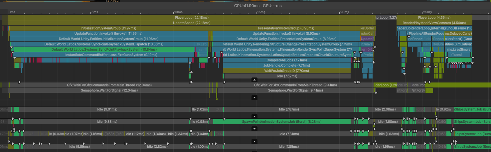

Yikes!

It is worth noting that this is with safety checks enabled. Things are a little
slower here than with checks disabled. However, the same patterns emerge without
safety checks. V2 development has proven challenging to reason about correctly
without leaving data-corrupting mistakes behind, so we are going to be largely
optimizing with safety checks this time around, for my sanity.

Anyways, there are two single-threaded problem spots here. The first is the
`InstantiateCommandBuffer` playback of `FireGunsSystem`. But don’t think for a
second that this is a problem with `InstantiateCommandBuffer`. This is
specifically caused by an `IInstantiateCommand` which is assigning parents to
new audio entities one-by-one. The second issue is a job in which child
transforms are being written to. This can’t be trivially parallelized like it
could in V1, so it is single-threaded right now.

Let’s tackle the parent assignment first, since that’s the more expensive issue.

## Hierarchy Management Is Complicated

In QVVS V2, entities that have parent-child relationships belong to hierarchies.
Each hierarchy has a root entity. This entity holds the
`DynamicBuffer<EntityInHierarchy>` which defines all the parent-child
relationships, inheritance flags, and even the local transforms. This buffer has
a very strict ordering to support navigating the hierarchy. Iterating linearly
through the hierarchy is equivalent to performing a breadth-first traversal
through the hierarchy.

Aside from the root entities, all other entities belonging to the hierarchy have
a `RootReference` component. This component references the root entity, and
specifies the descendant entity’s location in the hierarchy.

This by itself is quite simple and efficient. But the problems present
themselves when taking into account the other factors tied into the hierarchy.
In V2, there are both the normal `WorldTransform` components, as well as the
`TickedWorldTransform` components. The rule here is that whichever an entity
has, its parent also has. So assigning parents might require adding these
components with reasonable values. Additionally, `LinkedEntityGroup` can be
copied or transferred whenever parent assignments change. And depending on
whether the full hierarchy is represented by the `LinkedEntityGroup` on the
root, there may be a need to maintain an `EntityInHierarchyCleanup` buffer,
because bad things happen when a `RootReference` references a nonexistent
entity.

But while root destruction can be accounted for, internal entity destruction is
a bit trickier. V2 is trying to avoid a `DynamicBuffer` on every entity which
has children, as this was one of the performance challenges of V1. But this
means that destroyed entities can be left behind in the hierarchy. The rule for
this is that ancestors of destroyed entities inherit the children of the
destroyed entities. And that rules is handled with propagation already. But if
entities are constantly being added to a hierarchy and then destroyed, the
hierarchy will grow indefinitely. So to combat this, the hierarchy gets purged
of destroyed entities whenever it is involved in a parent assignment operation.

There’s a lot of rules that must be followed. And those rules change in subtle
ways based on which entities in which hierarchies are involved in a parent
assignment operation. A child that was formerly a root might be assigned to a
parent that formerly did not have a hierarchy. Or maybe a child without a
hierarchy was assigned a parent that already belonged to a hierarchy. Or maybe a
child is assigned a parent belonging to the same hierarchy. The current
implementation identifies and deals with each of these cases separately. That
makes trying to batch operations a bit more challenging.

And lastly, there are dependency concerns. If EntityB is assigned EntityA as a
parent, and then EntityC is assigned EntityB as a parent, these things must
happen sequentially, or else EntityC will end up in the wrong spot in EntityA’s
hierarchy. Fortunately, this particular case can’t happen if we just focus on
`InstantiateCommandBuffer`. But we can still have multiple instantiated entities
target the same parent or root hierarchy.

## What Kind of Operation Are You?

To start with, we know we are specifically working with `ParentCommand`, which
has a playback routine that looks like this:

```csharp
static void OnPlayback(ref IInstantiateCommand.Context context)
{
    var entities = context.entities;
    var em       = context.entityManager;
    for (int i = 0; i < entities.Length; i++)
    {
        var entity  = entities[i];
        var command = context.ReadCommand<ParentCommand>(i);
        if (!em.IsAlive(command.parent))
        {
            context.RequestDestroyEntity(entity);
            continue;
        }
        bool hadNormal            = em.HasComponent<WorldTransform>(entity);
        bool hadTicked            = em.HasComponent<TickedWorldTransform>(entity);
        var  localTransform       = hadNormal ? em.GetComponentData<WorldTransform>(entity).worldTransform : TransformQvvs.identity;
        var  tickedLocalTransform = hadTicked ? em.GetComponentData<TickedWorldTransform>(entity).worldTransform : localTransform;
        if (hadTicked && !hadNormal)
            localTransform = tickedLocalTransform;
        em.AddChild(command.parent, entity, command.inheritanceFlags, command.options);
        if (em.HasComponent<WorldTransform>(entity))
            TransformTools.SetLocalTransform(entity, in localTransform, em);
        if (em.HasComponent<TickedWorldTransform>(entity))
            TransformTools.SetTickedLocalTransform(entity, in tickedLocalTransform, em);
    }
}
```

Already, we have a random access to query whether the parent is alive right from
the start. As we learned when optimizing `DestroyCommandBuffer`, random accesses
like this in sync-point critical code is quite costly. And the solution to this
is to parallelize it.

So here’s what that looks like:

```csharp
internal static class TreeChangeInstantiate
{
    public static void AddChildren(ref IInstantiateCommand.Context context)
    {
        var entities        = context.entities;
        var em              = context.entityManager;
        var childWorkStates = new NativeArray<ChildWorkState>(entities.Length, Allocator.TempJob, NativeArrayOptions.UninitializedMemory);
        for (int i = 0; i < entities.Length; i++)
        {
            var command        = context.ReadCommand<ParentCommand>(i);
            childWorkStates[i] = new ChildWorkState
            {
                child   = entities[i],
                parent  = command.parent,
                flags   = command.inheritanceFlags,
                options = command.options
            };
        }

        var classifyJh = new ClassifyJob
        {
            children              = childWorkStates,
            esil                  = em.GetEntityStorageInfoLookup(),
            transformLookup       = em.GetComponentLookup<WorldTransform>(true),
            tickedTransformLookup = em.GetComponentLookup<TickedWorldTransform>(true)
        }.ScheduleParallel(childWorkStates.Length, 32, default);
        classifyJh.Complete();

        for (int i = 0; i < childWorkStates.Length; i++)
        {
            var child = childWorkStates[i];
            if (child.parentIsDead)
            {
                context.RequestDestroyEntity(child.child);
                continue;
            }
            em.AddChild(child.parent, child.child, child.flags, child.options);
            if (em.HasComponent<WorldTransform>(child.child))
                TransformTools.SetLocalTransform(child.child, in child.localTransform, em);
            if (em.HasComponent<TickedWorldTransform>(child.child))
                TransformTools.SetTickedLocalTransform(child.child, in child.tickedLocalTransform, em);
        }

        childWorkStates.Dispose();
    }

    #region Types
    struct ChildWorkState
    {
        public Entity           parent;
        public Entity           child;
        public InheritanceFlags flags;
        public AddChildOptions  options;
        public bool             parentIsDead;
        public TransformQvvs    localTransform;
        public TransformQvvs    tickedLocalTransform;
    }

    struct RootWorkState
    {
    }
    #endregion

    #region Jobs
    [BurstCompile]
    struct ClassifyJob : IJobFor
    {
        public NativeArray<ChildWorkState> children;

        [ReadOnly] public ComponentLookup<WorldTransform>       transformLookup;
        [ReadOnly] public ComponentLookup<TickedWorldTransform> tickedTransformLookup;
        [ReadOnly] public EntityStorageInfoLookup               esil;

        public void Execute(int i)
        {
            var workState          = children[i];
            workState.parentIsDead = !esil.IsAlive(workState.parent);
            if (workState.parentIsDead)
            {
                children[i] = new ChildWorkState { parentIsDead = true };
                return;
            }

            bool hadNormal                 = transformLookup.TryGetComponent(workState.child, out var worldTransform, out _);
            bool hadTicked                 = tickedTransformLookup.TryGetComponent(workState.child, out var tickedTransform, out _);
            workState.localTransform       = hadNormal ? worldTransform.worldTransform : TransformQvvs.identity;
            workState.tickedLocalTransform = hadTicked ? tickedTransform.worldTransform : workState.localTransform;
            if (hadTicked && !hadNormal)
                workState.localTransform = workState.tickedLocalTransform;
            children[i]                  = workState;
        }
    }
    #endregion
}
```

*You may have noticed a few* `EntityManager` *methods that don’t actually exist
on* `EntityManager`*, specifically the methods that fetch lookups. These are
special framework extension methods. You probably shouldn’t use them, because
their dependencies don’t get tracked correctly. But in this case, we just
instantiated entities and synced the world, and we plan to complete all jobs
scheduled, so these methods are fine.*

Obviously, we plan to do more than just this. The `EntityManager.AddChild()`
extension method is where most of the heavy work is happening. But this is a
first step. Let’s see if it made things better or worse…

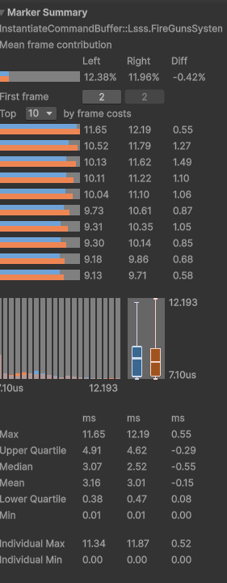

Blue is the single-threaded approach. Orange is the new code. From this we can
see that the new code might be slightly better on average, but has worse max
values. This could be run-to-run variance though.

Anyways, this shouldn’t be much of a surprise. The children are all of one
archetype, ordered in chunks, and the parents are also of the same archetype, so
there’s not much in the way of random accesses happening in our job. Time to
open up the `AddChild()` method and see if we can extract something out of it.

```csharp
public static void AddChild(EntityManager em,
                            Entity parent,
                            Entity child,
                            InheritanceFlags flags,
                            AddChildOptions options)
{
    TreeChangeSafetyChecks.CheckChangeParent(em, parent, child, flags, options);

    var parentClassification = TreeKernels.ClassifyAlive(em, parent);
    var childClassification  = TreeKernels.ClassifyAlive(em, child);

    switch (childClassification.role, parentClassification.role)
    {
        case (TreeKernels.TreeClassification.TreeRole.Solo, TreeKernels.TreeClassification.TreeRole.Solo):
            AddSoloChildToSoloParent(em, parent, child, flags, options);
            break;
        case (TreeKernels.TreeClassification.TreeRole.Solo, TreeKernels.TreeClassification.TreeRole.Root):
            AddSoloChildToRootParent(em, parent, child, flags, options);
            break;
        case (TreeKernels.TreeClassification.TreeRole.Solo, TreeKernels.TreeClassification.TreeRole.InternalNoChildren):
        case (TreeKernels.TreeClassification.TreeRole.Solo, TreeKernels.TreeClassification.TreeRole.InternalWithChildren):
            AddSoloChildToInternalParent(em, parent, parentClassification, child, flags, options);
            break;
        case (TreeKernels.TreeClassification.TreeRole.Root, TreeKernels.TreeClassification.TreeRole.Solo):
            AddRootChildToSoloParent(em, parent, child, flags, options);
            break;
        case (TreeKernels.TreeClassification.TreeRole.Root, TreeKernels.TreeClassification.TreeRole.Root):
            AddRootChildToRootParent(em, parent, child, flags, options);
            break;
        case (TreeKernels.TreeClassification.TreeRole.Root, TreeKernels.TreeClassification.TreeRole.InternalNoChildren):
        case (TreeKernels.TreeClassification.TreeRole.Root, TreeKernels.TreeClassification.TreeRole.InternalWithChildren):
            TreeChangeSafetyChecks.CheckNotAssigningRootChildToDescendant(parent, child, parentClassification);
            AddRootChildToInternalParent(em, parent, parentClassification, child, flags, options);
            break;
        case (TreeKernels.TreeClassification.TreeRole.InternalNoChildren, TreeKernels.TreeClassification.TreeRole.Solo):
            AddInternalChildWithoutSubtreeToSoloParent(em, parent, child, childClassification, flags, options);
            break;
        case (TreeKernels.TreeClassification.TreeRole.InternalNoChildren, TreeKernels.TreeClassification.TreeRole.Root):
            if (parent == childClassification.root)
                AddInternalChildWithoutSubtreeToRootParentSameRoot(em, parent, child, childClassification, flags);
            else
                AddInternalChildWithoutSubtreeToRootParentDifferentRoot(em, parent, child, childClassification, flags, options);
            break;
        case (TreeKernels.TreeClassification.TreeRole.InternalNoChildren, TreeKernels.TreeClassification.TreeRole.InternalNoChildren):
        case (TreeKernels.TreeClassification.TreeRole.InternalNoChildren, TreeKernels.TreeClassification.TreeRole.InternalWithChildren):
            if (parentClassification.root == childClassification.root)
            {
                TreeChangeSafetyChecks.CheckNotAssigningChildToDescendant(em, parent, child, parentClassification, childClassification);
                AddInternalChildWithoutSubtreeToInternalParentSameRoot(em, parent, parentClassification, child, childClassification, flags);
            }
            else
                AddInternalChildWithoutSubtreeToInternalParentDifferentRoots(em, parent, parentClassification, child, childClassification, flags, options);
            break;
        case (TreeKernels.TreeClassification.TreeRole.InternalWithChildren, TreeKernels.TreeClassification.TreeRole.Solo):
            AddInternalChildWithSubtreeToSoloParent(em, parent, child, childClassification, flags, options);
            break;
        case (TreeKernels.TreeClassification.TreeRole.InternalWithChildren, TreeKernels.TreeClassification.TreeRole.Root):
            if (parent == childClassification.root)
                AddInternalChildWithSubtreeToRootParentSameRoot(em, parent, child, childClassification, flags);
            else
                AddInternalChildWithSubtreeToRootParentDifferentRoot(em, parent, child, childClassification, flags, options);
            break;
        case (TreeKernels.TreeClassification.TreeRole.InternalWithChildren, TreeKernels.TreeClassification.TreeRole.InternalNoChildren):
        case (TreeKernels.TreeClassification.TreeRole.InternalWithChildren, TreeKernels.TreeClassification.TreeRole.InternalWithChildren):
            if (parentClassification.root == childClassification.root)
            {
                TreeChangeSafetyChecks.CheckNotAssigningChildToDescendant(em, parent, child, parentClassification, childClassification);
                AddInternalChildWithSubtreeToInternalParentSameRoot(em, parent, parentClassification, child, childClassification, flags);
            }
            else
                AddInternalChildWithSubtreeToInternalParentDifferentRoots(em, parent, parentClassification, child, childClassification, flags, options);
            break;
    }

    var childHandle = em.GetComponentData<RootReference>(child).ToHandle(em);
    if (flags.HasCopyParent())
    {
        // Set WorldTransform of child and propagate.
        Span<Propagate.WriteCommand> command = stackalloc Propagate.WriteCommand[1];
        command[0]                           = new Propagate.WriteCommand
        {
            indexInHierarchy = childHandle.indexInHierarchy,
            writeType        = Propagate.WriteCommand.WriteType.CopyParentParentChanged
        };
        Span<TransformQvvs> dummy = stackalloc TransformQvvs[1];
        em.CompleteDependencyBeforeRW<WorldTransform>();
        var transformLookup = em.GetComponentLookup<WorldTransform>(false);
        if (em.HasComponent<WorldTransform>(child))
        {
            var ema = new EntityManagerAccess(em);
            Propagate.WriteAndPropagate(childHandle.m_hierarchy, childHandle.m_extraHierarchy, dummy, command, ref ema, ref ema);
        }
        if (em.HasComponent<TickedWorldTransform>(child))
        {
            var ema = new TickedEntityManagerAccess(em);
            Propagate.WriteAndPropagate(childHandle.m_hierarchy, childHandle.m_extraHierarchy, dummy, command, ref ema, ref ema);
        }
    }
    else
    {
        // Compute new local transforms (and propagate if necessary)
        if (em.HasComponent<WorldTransform>(child))
        {
            var childTransform = em.GetComponentData<WorldTransform>(child);
            SetWorldTransform(child, in childTransform.worldTransform, em);
        }
        if (em.HasComponent<TickedWorldTransform>(child))
        {
            var childTransform = em.GetComponentData<TickedWorldTransform>(child);
            SetTickedWorldTransform(child, in childTransform.worldTransform, em);
        }
    }
}
```

That’s quite a bit of code, but there’s also structure here. At the start, we
have a safety check method. Most of the safety checks are ensuring the parent
and child are alive. But we already know the child is alive because we just
instantiated it. And we currently check if the parent is alive separately and
register the child for destruction if it is not. The only safety check we
actually need is to check if the parent has a dead root and we are trying to do
something with `LinkedEntityGroup`. That check is easier to do after the next
step, which is to classify the parent and child entities.

Classification is where we figure out the specific initial archetype of each
entity, and identify other key entities such as the roots. In our `AddChild()`
method, we dispatch a specialized algorithm based on the combination of
classifications we have. Coincidentally, I already have a `ClassifyAlive()`
overload method that uses lookups instead of `EntityManager`, so we can use that
in our `ClassifyJob`. Yes, parallelizing this was always the plan. You’ll see
the `TreeKernels` static class referenced quite a bit throughout this article.
It contains a lot of tiny primitive algorithms specific for hierarchy structure
changes.

We can add new lookup fields to the job and classification fields to
`ChildWorkState`. And omitting the safety check implementation for brevity, we
only need to add these three lines to the job’s `Execute()` method:

```csharp
workState.childClassification = TreeKernels.ClassifyAlive(ref rootReferenceLookup, ref hierarchyLookup, ref cleanupLookup, workState.child);
workState.parentClassification = TreeKernels.ClassifyAlive(ref rootReferenceLookup, ref hierarchyLookup, ref cleanupLookup, workState.parent);
CheckDeadRootLegRules(in workState.parentClassification, workState.options);
```

Now to make use of this result, we can copy all of the main-thread
implementation, and then modify it so that the `AddChild()` method accepts a
`ChildWorkState` and skips the safety check and classification steps, jumping
right into the dispatch phase.

```csharp
static unsafe void AddChild(EntityManager em, ref ChildWorkState childWorkState)
{
    var parentClassification = childWorkState.parentClassification;
    var childClassification = childWorkState.childClassification;
    var parent = childWorkState.parent;
    var child = childWorkState.child;
    var flags = childWorkState.flags;
    var options = childWorkState.options;

    switch (childClassification.role, parentClassification.role)
    { //...
```

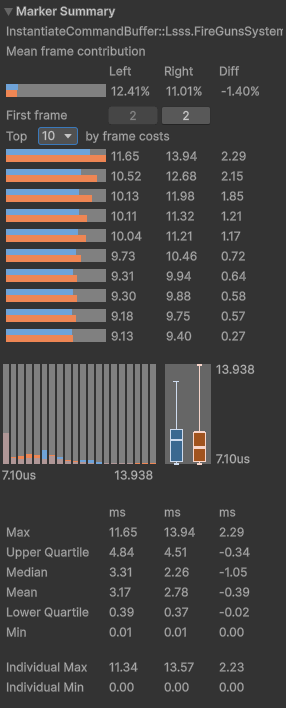

Nope. Same results as before. It seems that these random lookups are either not
that random, or there’s something much more expensive dwarfing these operations.
We’ll need to start looking at the dispatch cases.

## There’s Always an Excuse to Blame Unity

If we look at the solo child and solo parent case, the method starts like this:

```csharp
var childAddSet  = TreeKernels.GetChildComponentsToAdd(em, child, TreeKernels.TreeClassification.TreeRole.Solo, flags);
var parentAddSet = TreeKernels.GetParentComponentsToAdd(em, parent, TreeKernels.TreeClassification.TreeRole.Solo, childAddSet, options);
TreeKernels.AddComponents(em, childAddSet);
TreeKernels.AddComponents(em, parentAddSet);
```

These lines are identifying missing components for the relevant entities, and
adding them. In some of the other cases, it isn’t determined right away whether
the parent requires `EntityInHierarchyCleanup`, and in some cases where the
parent is already a child within the hierarchy, other ancestors also get
involved. But all of the cases permit identifying the child’s missing components
immediately, and adding them. We can move creation of the `childAddSet` to our
classification job. We’ll switch all the specialized methods to receive the
`ChildWorkState`, and swap calculation of the `childAddSet` with one read from
`ChildWorkState`.

For actually calculating the `childAddSet`, I am going to copy the method from
`TreeKernels`, and make it a member method of the job. This way, it can get
direct access to the lookups, plus some of what it computes is already known by
the job.

If you guessed this change alone also wouldn’t have any real effect on
performance, you’d be correct. The comparison this time looks nearly identical
to the first comparison. So far, random accesses don’t seem to be the problem.
But the next step is where we have real potential.

The next step is actually adding the components to the child. We already know
from this series that Unity’s structural change logic can be stupidly slow. And
right now, we are making these structural change calls one-by-one per entity as
we process them. Since we have all the child entities, we can batch up these
changes, and maybe get some real wins going!

Our `ClasifyJob` now has a block that looks like this:

```csharp
var childStorageInfo  = esil[workState.child];
workState.childAddSet = GetChildComponentsToAdd(workState.child, workState.childClassification.role, workState.flags, hadNormal, hadTicked);
childAddSets[i]       = new ChildAddSet
{
    addSet       = workState.childAddSet,
    chunkOrder   = childStorageInfo.Chunk.GetHashCode(),
    indexInChunk = childStorageInfo.IndexInChunk,
};
```

We are recording chunk info because we want to deterministically sort our
entities for better batching. That job looks like this:

```csharp
[BurstCompile]
struct SortAddChildrenJob : IJob
{
    public NativeArray<ChildAddSet> childAddSets;

    public void Execute()
    {
        var hashToOrderMap = new UnsafeHashMap<int, int>(childAddSets.Length, Allocator.Temp);
        for (int i = 0; i < childAddSets.Length; i++)
        {
            var addSet = childAddSets[i];
            if (addSet.addSet.entity == Entity.Null)
                addSet.chunkOrder = -1;
            else if (hashToOrderMap.TryGetValue(addSet.chunkOrder, out var order))
                addSet.chunkOrder = order;
            else
            {
                var hash          = addSet.chunkOrder;
                addSet.chunkOrder = hashToOrderMap.Count;
                hashToOrderMap.Add(hash, addSet.chunkOrder);
            }
            childAddSets[i] = addSet;
        }
        childAddSets.Sort();
    }
}
```

We are using the trick where we store chunk hashcodes, and then assign indices
to chunks based on the order the chunk hashcodes are encountered as a way to
sort the chunks deterministically.

Back in the main thread, we batch things up like this:

```csharp
var entityCacheList = new NativeList<Entity>(childAddSets.Length, Allocator.Temp);
for (int i = 0; i < childAddSets.Length; )
{
    entityCacheList.Clear();
    var addSet = childAddSets[i].addSet;
    var mask   = addSet.changeFlags;
    entityCacheList.Add(addSet.entity);
    for (int subCount = 1; i + subCount < childAddSets.Length; subCount++)
    {
        var nextAddSet = childAddSets[i + subCount].addSet;
        if (nextAddSet.changeFlags != mask)
            break;
        entityCacheList.Add(nextAddSet.entity);
    }
    TreeKernels.AddComponentsForChildren(em, addSet, entityCacheList.AsArray());
    for (int j = 0; j < entityCacheList.Length; j++)
    TreeKernels.ApplyAddTransformUpdatesForChild(em, childAddSets[i + j].addSet);
    i += entityCacheList.Length;
}
```

There’s a few things going on here. First, a `TreeKernel.ComponentAddSet` has a
bunch of flags. Many of the flags specify which components to add
(`changeFlags`), and those are the ones we want to group together. That’s the
primary sorting criteria, with the chunk and index being complementary criteria.
We want to dispatch a batch of entities for each unique set of components we
need to add. As for that dispatch method, I wrote a new version that takes the
entity array. And the method afterwards handles the other flags not part of the
ECS structural change. I then went and removed all of the calls to add the child
components in all the specialized methods.

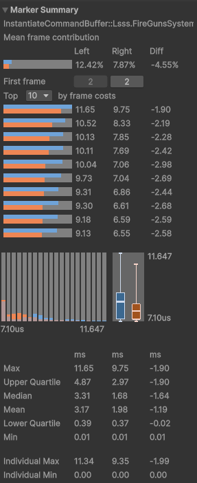

Hey! That looks like progress!

## Blurring Forks

Batching the structural change for child components was the easy part. Now
things get harder, because the next step is where the various classifications
encounter logical divergence.

Some parents used to be solo entities, which means they do not have the required
`DynamicBuffers` to host a hierarchy. They need structural changes right away.
But also, some children might have complex `LinkedEntityGroup` evaluations that
delay knowledge of whether the `EntityInHierarchyCleanup` buffer needs to be
added. And then some parents belong to a hierarchy, so they may require
structural changes for multiple ancestry components.

Fortunately, because we are working with newly-instantiated entities, all new
entities must belong to a `LinkedEntityGroup`. That means we can simplify that
evaluation and perform it sooner.

As for the ancestry, the tricky part is that some of the non-structural change
flags need to be applied in a specific order, because they are initializing
transform values and may need to refer to parent transform values that also
might need to be initialized. That means we’ll need the `ComponentAddSet`s in
two orders, one in batch order, and one in the original recorded order.
Preserving the original order requires a list per entity. Since we need to use
`TempJob` for this, the best tool we have is `NativeStream`. And at this point,
we might as well try to adapt our child component adding into the logic as well.
Therefore, we’ll rename `ChildAddSet` to `BatchedAddSet`, and our new sorting
job will look like this:

```csharp
[BurstCompile]
struct SortAndMergeBatchAddSetsJob : IJob
{
    public NativeStream              batchAddSetsStream;
    public NativeList<BatchedAddSet> outputBatchAddSets;

    public void Execute()
    {
        var addSets        = batchAddSetsStream.ToNativeArray<BatchedAddSet>(Allocator.Temp);
        var hashToOrderMap = new UnsafeHashMap<int, int>(addSets.Length, Allocator.Temp);
        for (int i = 0; i < addSets.Length; i++)
        {
            var addSet = addSets[i];
            if (addSet.addSet.entity == Entity.Null)
                addSet.chunkOrder = -1;
            else if (hashToOrderMap.TryGetValue(addSet.chunkOrder, out var order))
                addSet.chunkOrder = order;
            else
            {
                var hash          = addSet.chunkOrder;
                addSet.chunkOrder = hashToOrderMap.Count;
                hashToOrderMap.Add(hash, addSet.chunkOrder);
            }
            addSets[i] = addSet;
        }
        addSets.Sort(new EntitySorter());

        // Matching entities should now be adjacent in memory. Merge the flags.
        outputBatchAddSets.Capacity = addSets.Length;
        for (int i = 0; i < addSets.Length; )
        {
            var baseAddSet = addSets[i];
            for (i = i + 1; i < addSets.Length; i++)
            {
                var addSet = addSets[i];
                if (addSet.chunkOrder != baseAddSet.chunkOrder || addSet.indexInChunk != baseAddSet.indexInChunk)
                    break;

                baseAddSet.addSet.packed |= addSet.addSet.packed;
            }
            outputBatchAddSets.Add(baseAddSet);
        }

        outputBatchAddSets.Sort();
    }

    struct EntitySorter : IComparer<BatchedAddSet>
    {
        public int Compare(BatchedAddSet x, BatchedAddSet y)
        {
            var result = x.chunkOrder.CompareTo(y.chunkOrder);
            if (result == 0)
                result = x.indexInChunk.CompareTo(y.indexInChunk);
            return result;
        }
    }
}
```

Next, we’ll need to update our `ClassifyJob` to write to the `NativeStream`. For
this, I’ve ported over the `TreeKernel` methods for computing the
`ComponentAddSets` for parents and ancestries and adapted them to leverage the
job’s containers directly, similar to what we did for the child. Then the
`Execute()` method looks like this for computing the streams:

```csharp
var childStorageInfo  = esil[workState.child];
workState.childAddSet = GetChildComponentsToAdd(workState.child, workState.childClassification.role, workState.flags, hadNormal, hadTicked);
batchAddSetsStream.Write(new BatchedAddSet
{
    addSet       = workState.childAddSet,
    chunkOrder   = childStorageInfo.Chunk.GetHashCode(),
    indexInChunk = childStorageInfo.IndexInChunk,
});

if (workState.parentClassification.role == TreeKernels.TreeClassification.TreeRole.Solo ||
    workState.parentClassification.role == TreeKernels.TreeClassification.TreeRole.Root)
{
    batchAddSetsStream.Write(GetParentComponentsToAdd(workState.parent, workState.parentClassification.role, workState.childAddSet, workState.options));
}
else
{
    var hierarchy =
        (workState.parentClassification.isRootAlive ? hierarchyLookup[workState.parentClassification.root] : cleanupLookup[workState.parentClassification.root].
            Reinterpret<EntityInHierarchy>()).AsNativeArray();
    GetAncestorComponentsToAdd(hierarchy, workState.parentClassification, workState.childAddSet, workState.options);
}
```

I may revisit this and clean it up later, but right now I’m focused on making
forward progress, even if it is a little inconsistent.

On the main thread, I’ve temporarily made this little loop to apply the
transform value cleanups after applying all the structural changes:

```csharp
var streamReader       = batchedAddSetsStream.AsReader();
var batchedAddSetCache = new UnsafeList<BatchedAddSet>(8, Allocator.Temp);
for (int i = 0; i < childWorkStates.Length; i++)
{
    batchedAddSetCache.Clear();
    int elementCount = streamReader.BeginForEachIndex(i);
    for (int j = 0; j < elementCount; j++)
    {
        batchedAddSetCache.Add(streamReader.Read<BatchedAddSet>());
    }
    // We need to apply this backwards since the order is stored leaf-to-root and we want to apply root-to-leaf
    for (int j = elementCount - 1; j >= 0; j--)
    {
        var addSet = batchedAddSetCache[j];
        TreeKernels.ApplyAddComponentsBatchedPostProcess(em, addSet.addSet);
    }
    streamReader.EndForEachIndex();
}
```

We’re so close, but now we need to remove all this logic from the specialized
routines. But unfortunately, this throws some curveballs at us. The specialized
methods require access to a few of the parameters in the `ComponentAddSet`s for
parents and ancestries. We’ll need to try and remove those dependencies.

The first check is for whether `EntityInHierarchyCleanup` was added. If so, the
logic can skip checking for the existence of the buffer. Fortunately, this one
is simple, because it only applies to parents and roots, and only under the
condition: `options == AddChildOptions.IgnoreLinkedEntityGroup` which each
specialized process has access to.

The second check is for whether `LinkedEntityGroup` was added. This one we’ll
need to make a variable for inside our `ChildWorkState`, and customize our
`ClassifyJob` methods to export it.

The last use case is that some of the specialized processes require the ancestry
`ComponentAddSets` to initialize local transforms correctly. For this, we’ll
make a little routine to extract the data from our `NativeStream` specifically
for these methods.

Alright. Now we have two structural changes batched up. Let’s see what that
looks like in the profiler:

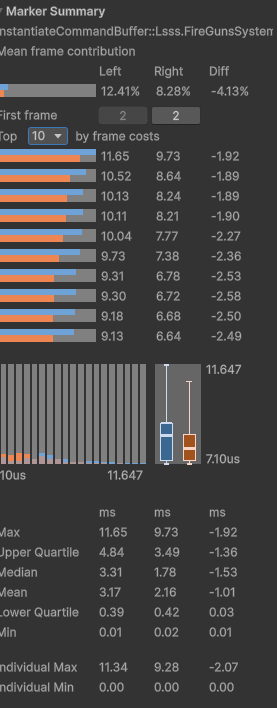

That’s not much different. Maybe a little worse even. What happened?

Actually, this is expected. In LSSS, the new parents don’t need any structural
changes. They are always part of a hierarchy that is ready to grow. And we’ve
added a bit of complexity via `NativeStream` to accommodate code paths that
weren’t actually used.

Another quirk of LSSS is that it has actually been hiding a bug in our jobified
implementation. You see, the parent classification is actually potentially
invalidated after each child is added, because the indices in the hierarchy move
around. We weren’t accounting for that, which means that if we had two new
entities target the same hierarchy at different depth values in the same frame,
things would go bad. However, this doesn’t actually happen in LSSS.

Anyways, we’re going to fix this and some other issues while we implement the
next optimization, so let’s keep moving!

## Spreading Roots

There’s actually only two other steps remaining in each of our specialized
processes. One of them is manipulating the `DynamicBuffers`, and the other is
removing components. The `DynamicBuffer` algorithms are not cheap, and hopefully
parallelizing them provides a much-needed win.

However, in order to parallelize them, we need a way to ensure a thread has
exclusive access to a hierarchy buffer. In the general case, this would be
tricky, because any new child could depend on any other entity. But since we are
instantiating, we know that can’t happen. Therefore, we can group children
together by roots. Let’s make a single-threaded job to do that. The job can run
alongside our sorting and merging job for our first structural change.

```csharp
[BurstCompile]
struct GroupRootsJob : IJob
{
    public NativeArray<int>                       childIndices;
    public NativeList<RootWorkState>              rootWorkStates;
    [ReadOnly] public NativeArray<ChildWorkState> childWorkStates;

    public void Execute()
    {
        rootWorkStates.Capacity = childWorkStates.Length;
        var rootToIndexMap      = new UnsafeHashMap<Entity, int>(childWorkStates.Length, Allocator.Temp);
        var rootToIndexArray    = new NativeArray<int>(childWorkStates.Length, Allocator.Temp, NativeArrayOptions.UninitializedMemory);
        for (int i = 0; i < childWorkStates.Length; i++)
        {
            var    parentClassification = childWorkStates[i].parentClassification;
            Entity root;
            if (parentClassification.role == TreeKernels.TreeClassification.TreeRole.Solo || parentClassification.role == TreeKernels.TreeClassification.TreeRole.Root)
                root = childWorkStates[i].parent;
            else
                root = parentClassification.root;

            if (!rootToIndexMap.TryGetValue(root, out var index))
            {
                index                                             = rootWorkStates.Length;
                rootWorkStates.Add(new RootWorkState { childStart = 0, childCount = 1 });
                rootToIndexMap.Add(root, index);
            }
            else
                rootWorkStates.ElementAt(index).childCount++;
            rootToIndexArray[i] = index;
        }

        // Prefix sum
        int running = 0;
        for (int i = 0; i < rootWorkStates.Length; i++)
        {
            ref var state     = ref rootWorkStates.ElementAt(i);
            state.childStart  = running;
            running          += state.childCount;
            state.childCount  = 0;
        }

        // Write output
        for (int i = 0; i < rootToIndexArray.Length; i++)
        {
            ref var state     = ref rootWorkStates.ElementAt(rootToIndexArray[i]);
            var     dst       = state.childStart + state.childCount;
            childIndices[dst] = i;
            state.childCount++;
        }
    }
}
```

Fairly simple, right?

Anyways, let’s set up our parallel job. We’ll start by making it responsible for
the `ComponentAddSet` cleanups, including the local transform cleanups the
specialized methods were doing. Here’s what that looks like:

```csharp
[BurstCompile]
struct ProcessBuffersJob : IJobParallelForDefer
{
    [ReadOnly] public NativeArray<int>                                       childIndices;
    [ReadOnly] public NativeStream.Reader                                    batchAddSetStream;
    public NativeArray<RootWorkState>                                        rootWorkStates;
    [NativeDisableParallelForRestriction] public NativeArray<ChildWorkState> childWorkStates;

    [ReadOnly] public EntityStorageInfoLookup                                          esil;
    public BufferTypeHandle<EntityInHierarchy>                                         hierarchyHandle;
    public BufferTypeHandle<EntityInHierarchyCleanup>                                  cleanupHandle;
    public BufferTypeHandle<LinkedEntityGroup>                                         legHandle;
    [NativeDisableParallelForRestriction] public ComponentLookup<WorldTransform>       worldTransformLookup;
    [NativeDisableParallelForRestriction] public ComponentLookup<TickedWorldTransform> tickedWorldTransformLookup;

    public void Execute(int rootIndex)
    {
        var rootWorkState       = rootWorkStates[rootIndex];
        var rootChildrenIndices = childIndices.GetSubArray(rootWorkState.childStart, rootWorkState.childCount);

        Entity root;
        bool   rootIsAlive;
        var    firstClassification = childWorkStates[rootChildrenIndices[0]].parentClassification;
        if (firstClassification.role == TreeKernels.TreeClassification.TreeRole.Solo || firstClassification.role == TreeKernels.TreeClassification.TreeRole.Root)
        {
            root        = childWorkStates[rootChildrenIndices[0]].parent;
            rootIsAlive = true;
            // If the parent was destroyed, skip.
            if (root == Entity.Null)
                return;
        }
        else
        {
            root        = firstClassification.root;
            rootIsAlive = firstClassification.isRootAlive;
        }

        var                              esi = esil[root];
        DynamicBuffer<EntityInHierarchy> hierarchy;
        if (rootIsAlive)
            hierarchy = esi.Chunk.GetBufferAccessorRW(ref hierarchyHandle)[esi.IndexInChunk];
        else
            hierarchy = esi.Chunk.GetBufferAccessorRW(ref cleanupHandle)[esi.IndexInChunk].Reinterpret<EntityInHierarchy>();

        var tsa = ThreadStackAllocator.GetAllocator();
        foreach (var childIndex in rootChildrenIndices)
        {
            int elementCount    = batchAddSetStream.BeginForEachIndex(childIndex);
            var ancestryAddSets = tsa.AllocateAsSpan<TreeKernels.ComponentAddSet>(elementCount);
            for (int i = 0; i < elementCount; i++)
                ancestryAddSets[i] = batchAddSetStream.Read<BatchedAddSet>().addSet;
            // We need to apply this backwards since the order is stored leaf-to-root and we want to apply root-to-leaf
            for (int i = elementCount - 1; i >= 0; i--)
                ApplyAddComponentsBatchedPostProcess(ancestryAddSets[i]);

            TreeKernels.UpdateLocalTransformsOfNewAncestorComponents(ancestryAddSets, hierarchy.AsNativeArray());
            batchAddSetStream.EndForEachIndex();
        }
    }
```

There’s an interesting thing happening here. I am using `BufferTypeHandle`
instead of `BufferLookup`. The reason for this is because I want to explicitly
declare read-only or read-write access when I fetch a buffer off an entity.

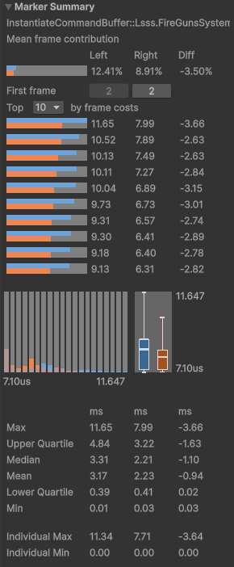

Whoah! What?

That’s noticeably faster!

I wasn’t expecting that.

This whole job was just setup for the real optimization. The things we actually
parallelized so far were things that LSSS wasn’t really using, because again,
the roots don’t need structural changes or initializations of new transforms or
initializations of `LinkedEntityGroup`. I don’t know where this speedup could
have come from. But it certainly brings hope that the next step is going to be
impactful!

## Poppin’ Popcorn

Here’s what is left of our specialized methods:

1.  Update the `EntityInHierarchy` buffers
2.  Update `RootReference` components
3.  Patch `LinkedEntityGroup` buffers
4.  Remove defunct buffers

These steps occurred for a single parent-child pair at a time, and the
specialized methods exploited this for specialized optimizations. However, we
know potentially multiple children being assigned a new root hierarchy, and we
can now do this in a parallel job. Therefore, our jobified approach will be a
little more generalized.

Let’s start with the hierarchy buffers. We’ve already implemented the logic to
acquire the primary hierarchy buffer. If there is a secondary cleanup buffer,
we’ll just do a full copy at the end. But we do need to make a temporary copy of
our primary buffer so that we can perform a diff comparison when updating
`RootReference`s.

```csharp
var oldHierarchy = TreeKernels.CopyHierarchyEntities(ref tsa, hierarchy.AsNativeArray());
```

We actually only care about the original entity order in the hierarchy, so
that’s the only part we copy out to save memory.

Next, we want to clean out any dead entities in the root’s hierarchy. If we
don’t clean this out, the hierarchy can grow indefinitely as temporary effects
are added as children and then destroyed. So cleaning when these effects are
added keeps the buffer size stable. However, cleaning requires the
`LinkedEntityGroup` buffer if we didn’t just add it, so let’s grab that.

```csharp
var rootLeg = esi.Chunk.Has(ref legHandle) ? esi.Chunk.GetBufferAccessorRW(ref legHandle)[esi.IndexInChunk] : default;
TreeKernels.RemoveDeadDescendantsFromHierarchyAndLeg(ref tsa, ref hierarchy, ref rootLeg, esil, ref worldTransformLookup, ref tickedWorldTransformLookup);
```

Yes, I already had a job-friendly `TreeKernel` method written for this. Cleaning
is a somewhat expensive algorithm, with O(n\^2) complexity, although that
complexity might be dwarfed by the O(n) random-access lookups to check if each
entity in the hierarchy is still alive. Of course, if the hierarchy was
originally empty because there were no children, then we need to add the root
element to it.

Next, we’ll loop over the new children we need to add. We’ll just leave that
with a `Todo` for now. And then, we need to copy the cleanup buffer if
necessary, and write out the `RootReference` components for all the entities
that ended up in the hierarchy. All that together looks like this:

```csharp
var oldHierarchy = TreeKernels.CopyHierarchyEntities(ref tsa, hierarchy.AsNativeArray());
var rootLeg      = esi.Chunk.Has(ref legHandle) ? esi.Chunk.GetBufferAccessorRW(ref legHandle)[esi.IndexInChunk] : default;
TreeKernels.RemoveDeadDescendantsFromHierarchyAndLeg(ref tsa, ref hierarchy, ref rootLeg, esil, ref worldTransformLookup, ref tickedWorldTransformLookup);
if (hierarchy.Length == 0)
{
    hierarchy.Add(new EntityInHierarchy
    {
        m_childCount          = 0,
        m_descendantEntity    = root,
        m_firstChildIndex     = 1,
        m_flags               = InheritanceFlags.Normal,
        m_parentIndex         = -1,
        m_localPosition       = default,
        m_localScale          = 1f,
        m_tickedLocalPosition = default,
        m_tickedLocalScale    = 1f,
    });
}
foreach (var childIndex in rootChildrenIndices)
{
    // Todo
}
if (rootIsAlive && esi.Chunk.Has(ref cleanupHandle))
{
    var cleanup = esi.Chunk.GetBufferAccessorRW(ref cleanupHandle)[esi.IndexInChunk];
    TreeKernels.CopyHierarchyToCleanup(in hierarchy, ref cleanup);
}
TreeKernels.UpdateRootReferencesFromDiff(hierarchy.AsNativeArray(), oldHierarchy, ref rootReferenceLookup);
```

Now for the children, we first need to find the parent in the hierarchy.
Fortunately, there’s a `TreeKernel` method for that.

```csharp
var parentIndex    = TreeKernels.FindEntityAfterChange(hierarchy.AsNativeArray(), childWorkState.parent, childWorkState.parentClassification.indexInHierarchy);
```

This actually fixes one of the issues we introduced, as we are now making sure
we find the correct parent index every time.

Unfortunately, the next step is where we have to specialize the code a bit
again. If the child had descendants, we need to also add those to the hierarchy.
We’ll start with solo entities, which are pretty straightforward. There’s a
`TreeKernel` method that lets us trivially insert the solo child into the
hierarchy. Then we need to check the `LinkedEntityGroup` options to see if we
need to add the child to the root’s `LinkedEntityGroup`, and if so, should we
also remove the child’s `LinkedEntityGroup` if all it contains is the child.
Yes, this means we want to consider removing components. For now, we’ll use an
`EntityCommandBuffer` for that, with the plan to optimize this part later.

```csharp
if (childWorkState.childClassification.role == TreeKernels.TreeClassification.TreeRole.Solo)
{
    TreeKernels.InsertSoloEntityIntoHierarchy(ref hierarchy, parentIndex, childWorkState.child, childWorkState.flags);
    if (childWorkState.options != AddChildOptions.IgnoreLinkedEntityGroup)
    {
        TreeKernels.AddEntityToLeg(ref rootLeg, childWorkState.child);
        if (childWorkState.options == AddChildOptions.TransferLinkedEntityGroup)
        {
            var childEsi = esil[childWorkState.child];
            if (childEsi.Chunk.Has(ref legHandle))
            {
                var childLeg = childEsi.Chunk.GetBufferAccessorRO(ref legHandle)[childEsi.IndexInChunk];
                if (childLeg.Length < 2)
                    ecb.RemoveComponent<LinkedEntityGroup>(rootIndex, childWorkState.child);
            }
        }
    }
}
```

Children that were initially roots are a bit trickier to deal with. There’s
several things that could go wrong. For one, they might have been instantiated
with destroyed entities still in their hierarchy. But they might have also been
instantiated with alive entities in their hierarchy that weren’t part of their
`LinkedEntityGroup`, so an instantiated child’s new hierarchy will still refer
to entities in the original hierarchy. We’ll need to clean all this out. This
requires a new `TreeKernel` cleaning method, but the only difference is that it
replaces this check

```csharp
if (!esil.IsAlive(hierarchy[i].entity))
```

with this check

```csharp
if (!rootRefRO.TryGetComponent(hierarchy[i].entity, out var rootRef) || rootRef.rootEntity != hierarchy[0].entity)
```

We’ll also need a new method for removing only dead entities from the
`LinkedEntityGroup`. If somehow an instantiated entity from the
`LinkedEntityGroup` has a different hierarchy, we don’t want to remove it from
the `LinkedEntityGroup`, even though this is generally an error case for now (I
might add logic to detect and correct this later).

```csharp
public static void RemoveDeadEntitiesFromLeg(ref DynamicBuffer<LinkedEntityGroup> leg, EntityStorageInfoLookup esil)
{
    int dst  = 0;
    var span = leg.AsNativeArray().AsSpan();
    for (int i = 0; i < leg.Length; i++)
    {
        if (esil.IsAlive(span[i].Value))
        {
            span[dst] = span[i];
            dst++;
        }
    }
    leg.Length = dst;
}
```

With that, we can now clean our child hierarchy, and then use a subtree insert
to put it into the main hierarchy. Then we need to handle `LinkedEntityGroup`
transfer. Fortunately, we know all the entities from the child’s hierarchy after
cleaning belong to its `LinkedEntityGroup`, so the logic for this is fairly
simple.

```csharp
else if (childWorkState.childClassification.role == TreeKernels.TreeClassification.TreeRole.Root)
{
    var  childEsi       = esil[childWorkState.child];
    var  childHierarchy = childEsi.Chunk.GetBufferAccessorRO(ref hierarchyHandle)[childEsi.IndexInChunk];
    bool hasLeg         = childEsi.Chunk.Has(ref legHandle);
    var  childLeg       = hasLeg ? childEsi.Chunk.GetBufferAccessorRW(ref legHandle)[childEsi.IndexInChunk] : default;
    if (hasLeg)
        TreeKernels.RemoveDeadEntitiesFromLeg(ref childLeg, esil);
    TreeKernels.RemoveDeadAndUnreferencedDescendantsFromHierarchy(ref tsa,
                                                                    ref childHierarchy,
                                                                    esil,
                                                                    ref worldTransformLookup,
                                                                    ref tickedWorldTransformLookup,
                                                                    ref rootReferenceLookup);

    TreeKernels.InsertSubtreeIntoHierarchy(ref hierarchy, parentIndex, childHierarchy.AsNativeArray(), childWorkState.flags);

    bool removeLeg = false;
    if (childWorkState.options != AddChildOptions.IgnoreLinkedEntityGroup)
    {
        TreeKernels.AddHierarchyToLeg(ref rootLeg, childHierarchy.AsNativeArray());
        if (childWorkState.options == AddChildOptions.TransferLinkedEntityGroup && hasLeg)
        {
            TreeKernels.RemoveHierarchyEntitiesFromLeg(ref childLeg, childHierarchy.AsNativeArray());
            removeLeg = childLeg.Length < 2;
        }
    }

    if (removeLeg)
        ecb.RemoveComponent(rootIndex, childWorkState.child, new TypePack<EntityInHierarchy, EntityInHierarchyCleanup, LinkedEntityGroup>());
    else
        ecb.RemoveComponent(rootIndex, childWorkState.child, new TypePack<EntityInHierarchy, EntityInHierarchyCleanup>());
}
```

Moving on, we have child entities that used to belong to another hierarchy.
These are awkward, because when instantiated, they will still be referencing
their old roots. That root could have technically been completely destroyed
without cleanup by the time the `InstantiateCommandBuffer` is played back. For
now, this is considered a user error which will present itself when
classification fails.

There’s two flavors of children inside internal hierarchies. One of these
flavors is when the child has no children of its own. And in that case,
coincidentally the logic we need to perform is identical to the solo child case.
We’ll just patch that condition. But when the child does have its own children,
that’s when things get messy.

However, since both of these cases were broken in the original implementation,
we aren’t going to worry about getting a correct implementation right now.
Instead, we’ll just insert a `NotImplementedException()` and move on.

Anyways, the last step of our buffer management is to check if we shrunk the
root’s `LinkedEntityGroup` from cleaning. If we did, and shrunk the length down
to 1, then we should remove it.

And with that, we can swap out our specialized methods with the
`EntityCommandBuffer` playback, and see what happens.

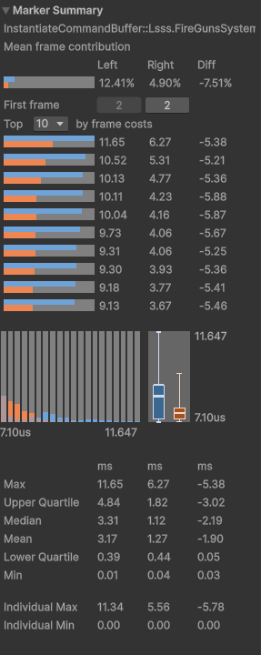

Wow! Another 1.7 milliseconds is gone!

But what is more impressive is how much faster the more typical frames are. It
seems a lot of frames benefit from this parallelization.

## Where Are We At?

The profiler analyzer tells me which frame is the worst, so let’s look at it in
the timeline.

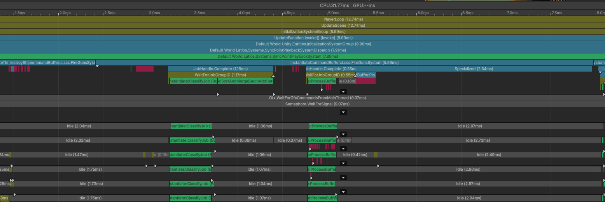

We spend 0.8 milliseconds doing the normal `InstantiateCommandBuffer` things.
Then we have 1.2 milliseconds of our first wave of jobs. For some reason, our
single-threaded job to batch together the results from our `NativeStream` is
really slow. That might be a future item to look at without the context of
safety checks. Then there’s half a millisecond performing the structural changes
for adding the components. Then we have slightly more than half a millisecond
processing all of our buffers. One thread got bogged down a little harder than
the others. The ECB playback after that is surprisingly quick, only taking 0.2
milliseconds. A good amount of that seems to be from disposing the
`DynamicBuffers` we removed from the children. Then again, only a subset of the
children have children of their own in LSSS, as only one faction uses layered
audio for gunshots. And finally, we have a bunch of milliseconds of
doing…something.

What exactly is that doing?

```csharp
for (int i = 0; i < childWorkStates.Length; i++)
{
    var child = childWorkStates[i];
    if (child.parentIsDead)
    {
        context.RequestDestroyEntity(child.child);
        continue;
    }

    if (em.HasComponent<WorldTransform>(child.child))
        TransformTools.SetLocalTransform(child.child, in child.localTransform, em);
    if (em.HasComponent<TickedWorldTransform>(child.child))
        TransformTools.SetTickedLocalTransform(child.child, in child.tickedLocalTransform, em);
}
```

Yeah. We can move setting those transforms into our buffer processing job. We
just need this loop at the end of each root we process:

```csharp
foreach (var childIndex in rootChildrenIndices)
{
    var childWorkState   = childWorkStates[childIndex];
    var indexInHierarchy = TreeKernels.FindEntityAfterChange(hierarchy.AsNativeArray(), childWorkState.child, 0);
    var handle           = new EntityInHierarchyHandle
    {
        m_hierarchy      = hierarchy.AsNativeArray(),
        m_extraHierarchy = extraPtr,
        m_index          = indexInHierarchy,
    };
    if (worldTransformLookup.HasComponent(childWorkState.child))
        TransformTools.SetLocalTransform(handle, childWorkState.localTransform, ref worldTransformLookup, ref esil);
    if (tickedWorldTransformLookup.HasComponent(childWorkState.child))
        TransformTools.SetTickedLocalTransform(handle, childWorkState.localTransform, ref tickedWorldTransformLookup, ref esil);
}
```

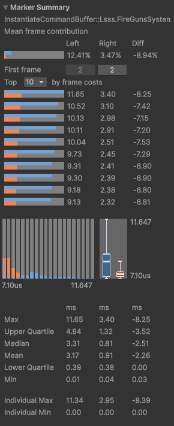

There we go! That’s what we want to see!

Are there still opportunities left to optimize? Absolutely! Looking at the
timeline view, `EntityCommandBuffer` playback is more expensive on some frames.
And the jobs are also more expensive than I would expect. But then again, we
have safety checks on. Perhaps in the future, we can turn those off and really
dig in. But this is good enough for now.

## A Quick Intermission

That’s one of the two problems mostly solved. But we still have one big
single-threaded job handling animations of spawners. It is time to parallelize
that!

But before we dive in, I should mention I took a little break to clean up the
previous optimization and improve safety validation. This meant adding new
safety checks to `ClassifyJob` to detect the cases we don’t support, and
producing meaningful error messages. I’ve also added main-thread checks, and a
new system that validates `RootReference` components once each frame to catch
any other issues. Because of this, profiling with safety checks on means that
things will be a little slower again. That’s okay, because the goal here isn’t
to optimize things to the max, it is to remove the single-threaded bottlenecks.
And these new safety checks don’t impact that goal.

## A Chunk Challenge

To refresh your memory, this is what we are trying to get rid of next:

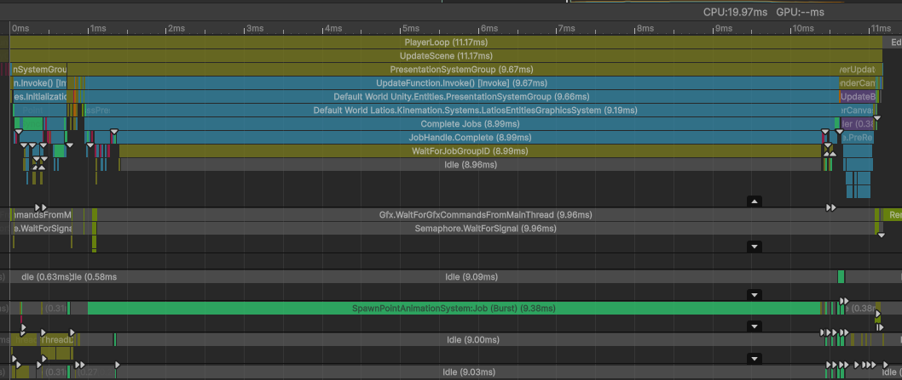

One giant single-threaded job is holding up the frame. This job used to be a
parallel job in QVVS V1. But it was changed for V2 because this job doesn’t
operate on roots. Instead, this job operates on spawner graphics which are
children of the spawners. Here’s what that job looks like:

```csharp
[WithAll(typeof(WorldTransform))]
[BurstCompile]
partial struct Job : IJobEntity
{
    public TransformAspectLookup transformLookup;

    public void Execute(Entity entity, in TimeToLive timeToLive, in SpawnPointAnimationData data)
    {
        float growFactor   = math.unlerp(data.growStartTime, data.growEndTime, timeToLive.timeToLive);
        growFactor         = math.select(growFactor, 1f, data.growStartTime == data.growEndTime);
        float shrinkFactor = math.unlerp(0f, data.shrinkStartTime, timeToLive.timeToLive);
        float factor       = math.saturate(math.min(growFactor, shrinkFactor));
        bool  isGrowing    = growFactor < shrinkFactor;

        float growRadians   = math.lerp(-data.growSpins, 0f, factor);
        float shrinkRadians = math.lerp(data.shrinkSpins, 0f, factor);
        float rads          = math.select(shrinkRadians, growRadians, isGrowing);

        var transform           = transformLookup[entity];
        transform.localRotation = quaternion.Euler(0f, 0f, rads);
        transform.localScale    = math.max(factor, 0.001f);
    }
}
```

This job is primarily modifying local transforms. Typically, only one entity per
hierarchy is being animated. There are a few ways we could solve this with the
QVVS V2 APIs already available. For example, we could add an `IEnableable`
`IComponentData` to each root referencing the animated child entity. Then we
could iterate roots in parallel.

However, I’d like to try and make things reasonably ergonomic by preserving the
`IJobEntity` semantics that this system is already using. And I expect that many
other projects will encounter similar problems, so let’s try to solve this
problem in a general way, one which doesn’t require disabling safety checks.

In order for an `IJobEntity` to process a transform safely, it must know that
the current thread is the only thread that will touch the hierarchy the
transform belongs to. An `IJobEntity` is really an `IJobChunk`, which means that
all chunks which contain entities belonging to the same hierarchy must be
processed by the same thread. Unfortunately, `IJobChunk` doesn’t let us control
which chunks are processed by which threads.

But what if we only used `IJobChunk` to capture the chunk `Execute()`
parameters, and then used a different job type wrapping an `IJobChunk` that
called the `Execute()` method? Such a wrapper job could have control over which
chunks run on which threads.

This presents two questions.

1.  Can we wrap `IJobEntity` inside a custom job?
2.  How do we group chunks together?

## Tightrope Walking Unity’s Source Generators

It is no secret that I am not a fan of how Unity’s source generators work. They
are needlessly inextensible for probably historical tech-debt reasons.
`IJobEntity` is no exception, and that comes in the form of source-generated
last-moment dependency injection. To see what I mean, here’s what the
`Schedule()` implementation of our animation job looks like:

```csharp
public global::Unity.Jobs.JobHandle Schedule(ref global::Lsss.SpawnPointAnimationSystem.Job job, global::Unity.Entities.EntityQuery query, global::Unity.Jobs.JobHandle dependency)
{
    job.__TypeHandle = __TypeHandle;
    return global::Unity.Entities.JobChunkExtensions.ScheduleByRef(ref job, query, dependency);
}
```

This method is a member of the generated struct
`InternalCompilerQueryAndHandleData`. Interestingly, this type is `public`, as
is various useful member methods. But for us to use this, we would require the
user to manually create a field of this type and update it. That’s not really
ergonomic. So let’s look at what the scheduling code looks like.

Here's the method generated when using `.Schedule()` on the `IJobEntity`:

```csharp
global::Unity.Jobs.JobHandle __ScheduleViaJobChunkExtension_0(global::Lsss.SpawnPointAnimationSystem.Job job, global::Unity.Entities.EntityQuery query, global::Unity.Jobs.JobHandle dependency, ref global::Unity.Entities.SystemState state, bool hasUserDefinedQuery)
{
    global::Lsss.SpawnPointAnimationSystem.Job.InternalCompiler.CheckForErrors(1);
    if (Unity.Burst.CompilerServices.Hint.Unlikely(hasUserDefinedQuery))
    {
        int requiredComponentCount = global::Lsss.SpawnPointAnimationSystem.Job.InternalCompilerQueryAndHandleData.GetRequiredComponentTypeCount();
        global::System.Span<Unity.Entities.ComponentType> requiredComponentTypes = stackalloc Unity.Entities.ComponentType[requiredComponentCount];
        global::Lsss.SpawnPointAnimationSystem.Job.InternalCompilerQueryAndHandleData.AddRequiredComponentTypes(ref requiredComponentTypes);
                
        if (!global::Lsss.SpawnPointAnimationSystem.Job.InternalCompilerQueryAndHandleData.QueryHasRequiredComponentsForExecuteMethodToRun(ref query, ref requiredComponentTypes))
        {
            throw new global::System.InvalidOperationException(
            "When scheduling an instance of `global::Lsss.SpawnPointAnimationSystem.Job` with a custom query, the query must (at the very minimum) contain all the components required for `global::Lsss.SpawnPointAnimationSystem.Job.Execute()` to run.");
        }
    }
    dependency = 
    __TypeHandle.__Lsss_SpawnPointAnimationSystem_Job_WithDefaultQuery_JobEntityTypeHandle.UpdateBaseEntityIndexArray(ref job, query, 
    dependency, ref state);__TypeHandle.__Lsss_SpawnPointAnimationSystem_Job_WithDefaultQuery_JobEntityTypeHandle.AssignEntityManager(ref job, state.EntityManager);
    __TypeHandle.__Lsss_SpawnPointAnimationSystem_Job_WithDefaultQuery_JobEntityTypeHandle.__TypeHandle.Update(ref state);
    return __TypeHandle.__Lsss_SpawnPointAnimationSystem_Job_WithDefaultQuery_JobEntityTypeHandle.Schedule(ref job, query, dependency);
}
```

There’s a lot more here than you probably expected. Let’s break this down.

First, this whole method is a member method of the `ISystem`. The `ISystem` has
a generated member field named `__TypeHandle`. Make note that this is the “root”
`__TypeHandle`, because there’s another thing also named `__TypeHandle`.

At the top of the method, there’s a big `if` block performing safety checks in
the case a custom `EntityQuery` was used. After that, we start to see a field
inside the root `__TypeHandle` named
`__Lsss_SpawnPointAnimationSystem_Job_WithDefaultQuery_JobEntityTypeHandle`.
That’s our `InternalCompilerQueryAndHandleData` instance. Inside that is the
other `__TypeHandle` field which is what our specific job actually uses. That
gets updated, which in turn updates its `ComponentTypeHandle` and
`BufferTypeHandle` instances. And then there’s the call to `.Schedule()` which –
as I showed earlier – is responsible for performing the `__TypeHandle`
dependency injection into the job `struct` and then scheduling the job. Because
`__ScheduleViaJobChunkExtension_0` has `job` passed in by value, the
dependency-injected version of the job is destroyed when this method returns,
meaning we can’t capture the dependency injection.

However, if we instead use `.ScheduleByRef()`, we get this generated method:

```csharp
global::Unity.Jobs.JobHandle __ScheduleViaJobChunkExtension_1(ref global::Lsss.SpawnPointAnimationSystem.Job job, global::Unity.Entities.EntityQuery query, global::Unity.Jobs.JobHandle dependency, ref global::Unity.Entities.SystemState state, bool hasUserDefinedQuery)
{
    global::Lsss.SpawnPointAnimationSystem.Job.InternalCompiler.CheckForErrors(1);
    if (Unity.Burst.CompilerServices.Hint.Unlikely(hasUserDefinedQuery))
    {
        int requiredComponentCount = global::Lsss.SpawnPointAnimationSystem.Job.InternalCompilerQueryAndHandleData.GetRequiredComponentTypeCount();
        global::System.Span<Unity.Entities.ComponentType> requiredComponentTypes = stackalloc Unity.Entities.ComponentType[requiredComponentCount];
        global::Lsss.SpawnPointAnimationSystem.Job.InternalCompilerQueryAndHandleData.AddRequiredComponentTypes(ref requiredComponentTypes);
                
        if (!global::Lsss.SpawnPointAnimationSystem.Job.InternalCompilerQueryAndHandleData.QueryHasRequiredComponentsForExecuteMethodToRun(ref query, ref requiredComponentTypes))
        {
            throw new global::System.InvalidOperationException(
            "When scheduling an instance of `global::Lsss.SpawnPointAnimationSystem.Job` with a custom query, the query must (at the very minimum) contain all the components required for `global::Lsss.SpawnPointAnimationSystem.Job.Execute()` to run.");
        }
    }
    dependency = 
    __TypeHandle.__Lsss_SpawnPointAnimationSystem_Job_WithDefaultQuery_JobEntityTypeHandle.UpdateBaseEntityIndexArray(ref job, query, 
    dependency, ref state);__TypeHandle.__Lsss_SpawnPointAnimationSystem_Job_WithDefaultQuery_JobEntityTypeHandle.AssignEntityManager(ref job, state.EntityManager);
    __TypeHandle.__Lsss_SpawnPointAnimationSystem_Job_WithDefaultQuery_JobEntityTypeHandle.__TypeHandle.Update(ref state);
    return __TypeHandle.__Lsss_SpawnPointAnimationSystem_Job_WithDefaultQuery_JobEntityTypeHandle.Schedule(ref job, query, dependency);
}
```

It is exactly the same, except that because we are passing the `job` by `ref`,
the dependency-injection is being applied to the original `job` passed in by
`ref`. That can be a user-defined local variable. Which means this is a
dependency-injected job that we can capture!

Well, we can capture the dependency-injected job after the job has already been
scheduled. Not super helpful, right?

Well, actually, we kinda needed that job scheduled anyways, because we need to
capture the `IJobChunk` `Execute()` parameters. What we really care about is
ensuring the `IJobEntity` `Execute()` method doesn’t get called in this first
`ScheduleByRef()`. And we already know how to do that, using
`IJobEntityChunkBeginEnd`. We simply put a check in `OnChunkBegin()` which
detects whether the job is in the chunk capture phase or the main execution
phase, and then either captures the job and returns `false`, or validates the
chunk and returns `true`.

So in the end, it is possible to get a dependency-injected `IJobEntity` struct
in `IJobChunk` form that we can wrap in a custom job. However, this requires a
very-specific sequence of code written by the user to make this work. Hopefully,
this code will still be less burdensome than what is required for `IJobChunk`.
But we’ll definitely need to ensure we have adequate safety checks in place in
case a user messes up.

## Ready…Set…Theory

Our goal is to group chunks together which share hierarchies, so that they can
be processed by the same thread. We can refer to such a group as a “set”. We
start by defining each chunk as its own set containing 1 node. We then look for
entities within chunks that share a hierarchy. Every time we find one, we merge
the sets of the containing chunks.

This problem has a name: **Union Find**, or sometimes also referred to as
**Disjoint Set Union (DSU)**. It is a fundamental problem in graph theory to
determine which nodes in a graph are reachable by any specified node. However,
our particular use case has a slight variation. Instead of working with edges in
the graph directly, our edges are defined implicitly through shared `Entity`
references (effectively “pointers” for academic discussions) to the hierarchy
roots.

This isn’t the first time this problem has shown up in the framework. It has
also made its appearance in Psyshock’s ForEachPair implementation when computing
phase-2 islands. But unlike ForEachPair which could hide the algorithm’s cost
inside a single thread of a parallel job during phase-1, our use case right now
is very latency-sensitive. So let’s try to write a very optimized
single-threaded implementation as a baseline, and then we can try to parallelize
it if necessary.

We’ll define our job structure like this:

```csharp
[BurstCompile]
struct UnionFindJob : IJob
{
    public NativeList<CapturedChunk>                     chunks;
    public NativeList<int2>                              chunkRanges;
    [ReadOnly] public EntityTypeHandle                   entityHandle;
    [ReadOnly] public ComponentTypeHandle<RootReference> rootReferenceHandle;
```

In this job, `chunks` is already populated with our captured chunks. However,
our job is allowed to reorder this list. We do need to allocate and fully
populate `chunkRanges` in this job. Our goal is to make `CapturedChunk`
instances belonging to the same set to be consecutive in memory and represented
by a single `int2` range.

To start, let’s segregate the chunks with hierarchies from those without
hierarchies, by moving the chunks without hierarchies to the back of the list.
This way, the union find algorithm can focus on just the hierarchy chunks.

```csharp
// Rearrange the chunks so that solo chunks are at the end.
int hierarchyChunkCount;
{
    int currentHierarchyIndex = 0;
    int currentSoloIndex      = chunks.Length - 1;
    for (; currentHierarchyIndex < currentSoloIndex; currentHierarchyIndex++)
    {
        if (chunks[currentHierarchyIndex].role == Role.Solo)
        {
            bool swapped = false;
            for (; currentSoloIndex > currentHierarchyIndex && !swapped; currentSoloIndex--)
            {
                if (chunks[currentSoloIndex].role != Role.Solo)
                {
                    (chunks[currentHierarchyIndex], chunks[currentSoloIndex]) = (chunks[currentSoloIndex], chunks[currentHierarchyIndex]);
                    swapped                                                   = true;
                }
            }
        }
    }
    hierarchyChunkCount = currentSoloIndex;
}
```

As you can see, the captured chunks already contain a classification `enum`,
which makes this operation easy.

Next, we need a couple of data structures. We are trying to perform the union
find on chunks, but we base set membership on root entities. We can use a
hashmap that maps a root entity to the first chunk that referenced it. This
first chunk will be the target node to perform a union with. We’ll want to
reserve enough capacity in the hashmap for all the entities we wish to add. And
actually, this time I’ll add one extra due to rumors of an off-by-one bug I’ve
been hearing lately. We also need an array of nodes, with each node defining a
parent. We can do this with an array of `int`, where the `int` represents the
index of the parent, or its own index if it is the root of the set.
Consequently, every set is actually a tree structure. And the collection of sets
is often referred to as a *forest*.

```csharp
var hierarchyChunks = chunks.AsArray().GetSubArray(0, hierarchyChunkCount);
// Count entities so that we can allocate the hashmap accordingly
int entityCount = 0;
foreach (var chunk in hierarchyChunks)
    entityCount += chunk.enabledEntityCount;

// Perform the Union Find algorithm
var entityToFirstChunkMap = new UnsafeHashMap<int, int>(entityCount + 1, Allocator.Temp);
var sets                  = new NativeArray<int>(hierarchyChunkCount, Allocator.Temp, NativeArrayOptions.UninitializedMemory);
```

For the hashmap, I’ve chosen to only store the root `Entity`’s `Index` as the
key, since we have an always-up-to-date transform system, meaning every root
should be an entity that is still existing and consequently has a unique
`Index`.

Next, we iterate each chunk, and then iterate each root entity referenced by the
chunk and perform the union operation.

```csharp
for (int i = 0; i < hierarchyChunkCount; i++)
{
    sets[i]        = i;
    var chunk      = hierarchyChunks[i];
    var enumerator = new ChunkEntityEnumerator(chunk.useEnabledMask, chunk.enabledMask, chunk.chunk.Count);
    if (chunk.role == Role.Root)
    {
        var entities = chunk.chunk.GetEntityDataPtrRO(entityHandle);
        while (enumerator.NextEntityIndex(out var entityIndex))
        {
            Union(entities[entityIndex], i, ref entityToFirstChunkMap, ref sets);
        }
    }
    else
    {
        var rootRefs = chunk.chunk.GetComponentDataPtrRO(ref rootReferenceHandle);
        while (enumerator.NextEntityIndex(out var entityIndex))
        {
            Union(rootRefs[entityIndex].rootEntity, i, ref entityToFirstChunkMap, ref sets);
        }
    }
}
```

As you can see, we are only iterating arrays inside chunks. No lookups!

So what is the `Union()` method doing?

```csharp
static void Union(Entity entity, int chunkIndex, ref UnsafeHashMap<int, int> entityToFirstChunkMap, ref NativeArray<int> sets)
{
    if (!entityToFirstChunkMap.TryGetValue(entity.Index, out var firstChunkIndex))
    {
        entityToFirstChunkMap.Add(entity.Index, chunkIndex);
        return;
    }

    // Rem's algorithm
    var treeNodeA = chunkIndex;
    var treeNodeB = firstChunkIndex;
    while (sets[treeNodeA] != sets[treeNodeB])
    {
        if (sets[treeNodeA] < sets[treeNodeB])
        {
            if (sets[treeNodeA] == treeNodeA)
            {
                sets[treeNodeA] = sets[treeNodeB];
                break;
            }
            var temp        = treeNodeA;
            sets[treeNodeA] = sets[treeNodeB];
            treeNodeA       = sets[temp];
        }
        else
        {
            if (sets[treeNodeB] == treeNodeB)
            {
                sets[treeNodeB] = sets[treeNodeA];
                break;
            }
            var temp        = treeNodeB;
            sets[treeNodeB] = sets[treeNodeA];
            treeNodeB       = sets[temp];
        }
    }
}
```

First, we find the first chunk that encountered the root entity. If we don’t
find one, then this is the first chunk, so we register it and don’t need to
perform any union operation. If we do find a first chunk, we perform a union
between our current chunk’s set and the set the first chunk with the root
belongs to. Here, I’m using Rem’s algorithm. While there are other algorithms
with lower worst-case runtime, this algorithm tends to be more efficient in
practice.

At the end of all of this, each element in `sets` contains an index either to
itself, or a higher index representing a parent in the set’s tree. To flatten
the trees, we will iterate backwards and replace each node’s parent index with
its parent’s parent index. We’ll also take a count how many chunks are in a set,
storing the count value at the set’s root index.

```csharp
// Collapse the trees (we iterate backwards because we are using the greater-index algorithm
// Also, get count in each set as we will use a counting sort to reorder the chunks
var setCounts = new NativeArray<int>(sets.Length, Allocator.Temp, NativeArrayOptions.ClearMemory);
for (int i = hierarchyChunkCount - 1; i >= 0; i--)
{
    var rootSet = sets[sets[i]];
    setCounts[rootSet]++;
    sets[i] = rootSet;
}
```

Because a root’s parent index is the root’s index itself, we are actually
assigning the root’s index to itself, and don’t have to do any branching logic
here.

Things are still a little awkward though, because we have trees whose nodes are
interleaved in an array. And the roots of the sets are also scattered, and not
in adjacent indices. We somehow want to regroup these nodes, and populate our
ranges correctly, which means reassigning each set to a range index and
repopulating the `chunks` list.

Actually, we can do all of that in one shot by simply sorting the nodes (chunks)
by their setss root indices. And we can do that with a counting sort, which
implicitly computes the ranges. This is why we computed the count of nodes in
each set.

```csharp
// Prefix sum and build ranges
int running          = 0;
chunkRanges.Capacity = chunks.Length;  // Overestimate, but that's probably faster than computing a minimum capacity
for (int i = 0; i < setCounts.Length; i++)
{
    var count = setCounts[i];
    if (count > 0)
    {
        chunkRanges.AddNoResize(new int2(running, count));
        setCounts[i]  = running;
        running      += count;
    }
}

// Assign chunk order using a backup copy
var backup = new NativeArray<CapturedChunk>(hierarchyChunks, Allocator.Temp);
for (int i = 0; i < backup.Length; i++)
{
    var set = sets[i];
    var dst = setCounts[set];
    setCounts[set]++;
    hierarchyChunks[dst] = backup[i];
}
```

You’ll notice we allocated `chunkRanges` to `chunks.Length` rather than
`hierarchyChunksCount`. That’s because we still need to add range elements for
our hierarchy-less chunks.

```csharp
// Assign solo chunks to ranges
for (int i = hierarchyChunkCount; i < chunks.Length; i++)
{
    chunkRanges.AddNoResize(new int2(i, 1));
}
```

And that’s it! We’ve gotten our chunks all grouped by hierarchy. We should now
be able to schedule an `IJobParallelForDefer` based on `chunkRanges`, which will
then iterate the chunks in the range, and manually call an
`IJobChunk.Execute()`. That should then invoke all the `IJobEntity` things,
including setting up the `IJobEntity`’s `Execute()` method.

## Magic Happens

I have named the new API `TransformAspectParallelChunkHandle`. I’ll spare you
the details of its implementation, as a lot of it is safety checks and API
scaffolding. However, I’ll at least share what the wrapper job looks like.

```csharp
[BurstCompile]
public struct TransformsSchedulerJob<T> : IJobParallelForDefer where T : unmanaged, IJobChunk, IJobChunkParallelTransform
{
    public T chunkJob;

    public JobHandle ScheduleParallel(JobHandle inputDeps)
    {
        return this.ScheduleByRef(chunkJob.transformAspectHandleAccess.chunkRanges, 1, inputDeps);
    }

    public void Execute(int parallelForIndex)
    {
        ref var handle     = ref chunkJob.transformAspectHandleAccess;
        var     chunkCount = handle.GetChunkCountForIJobParallelForDeferIndex(parallelForIndex);
        for (int i = 0; i < chunkCount; i++)
        {
            handle.GetChunkInGroupForIJobParallelForDefer(parallelForIndex, i, out var chunk, out var unfilteredChunkIndex, out var useEnabledMask,
                                                          out var chunkEnabledMask);
            handle.currentCapturedChunkIndex = handle.chunkRanges[parallelForIndex].x + i;
            chunkJob.Execute(in chunk, unfilteredChunkIndex, useEnabledMask, in chunkEnabledMask);
        }
    }
}
```

As you can see, we are treating the `IJobChunk` job purely as a struct
implementing an interface, and we’re calling its `Execute()` method directly.
But that is what allows us to dispatch multiple chunks in the same group
together.

This is what our animation system looks like when using our new API:

```csharp
[BurstCompile]
public partial struct SpawnPointAnimationSystem2 : ISystem
{
    [BurstCompile]
    public void OnUpdate(ref SystemState state)
    {
        var job = new Job
        {
            transformHandle = new TransformAspectParallelChunkHandle(SystemAPI.GetComponentLookup<WorldTransform>(false),
                                                                     SystemAPI.GetComponentTypeHandle<RootReference>(true),
                                                                     SystemAPI.GetBufferLookup<EntityInHierarchy>(true),
                                                                     SystemAPI.GetBufferLookup<EntityInHierarchyCleanup>(true),
                                                                     SystemAPI.GetEntityStorageInfoLookup(),
                                                                     ref state)
        };
        job.ScheduleByRef();
        state.Dependency = job.transformHandle.ScheduleChunkGrouping(state.Dependency);
        state.Dependency = job.GetTransformsScheduler().ScheduleParallel(state.Dependency);
    }

    [WithAll(typeof(WorldTransform))]
    [BurstCompile]
    partial struct Job : IJobEntity, IJobEntityChunkBeginEnd, IJobChunkParallelTransform
    {
        public TransformAspectParallelChunkHandle transformHandle;

        public ref TransformAspectParallelChunkHandle transformAspectHandleAccess => ref transformHandle.RefAccess();

        public void Execute([EntityIndexInChunk] int indexInChunk, in TimeToLive timeToLive, in SpawnPointAnimationData data)
        {
            float growFactor   = math.unlerp(data.growStartTime, data.growEndTime, timeToLive.timeToLive);
            growFactor         = math.select(growFactor, 1f, data.growStartTime == data.growEndTime);
            float shrinkFactor = math.unlerp(0f, data.shrinkStartTime, timeToLive.timeToLive);
            float factor       = math.saturate(math.min(growFactor, shrinkFactor));
            bool  isGrowing    = growFactor < shrinkFactor;

            float growRadians   = math.lerp(-data.growSpins, 0f, factor);
            float shrinkRadians = math.lerp(data.shrinkSpins, 0f, factor);
            float rads          = math.select(shrinkRadians, growRadians, isGrowing);

            var transform           = transformHandle[indexInChunk];
            transform.localRotation = quaternion.Euler(0f, 0f, rads);
            transform.localScale    = math.max(factor, 0.001f);
        }

        public bool OnChunkBegin(in ArchetypeChunk chunk, int unfilteredChunkIndex, bool useEnabledMask, in v128 chunkEnabledMask)
        {
            return transformHandle.OnChunkBegin(in chunk, unfilteredChunkIndex, useEnabledMask, chunkEnabledMask);
        }

        public void OnChunkEnd(in ArchetypeChunk chunk, int unfilteredChunkIndex, bool useEnabledMask, in v128 chunkEnabledMask, bool chunkWasExecuted)
        {
        }
    }
}
```

There’s a bit of boilerplate, but only about 10 more lines than the
single-threaded version of the system. So does it work?

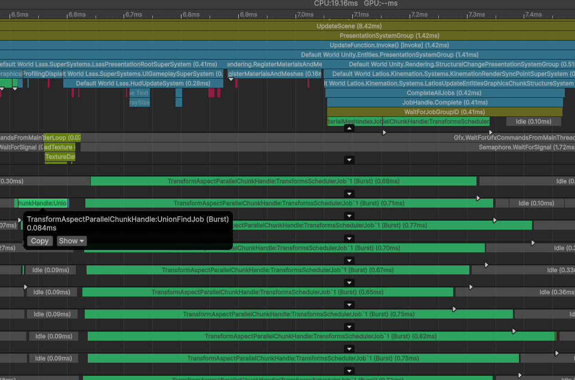

Yup!

And wow! That single-threaded union-find job is faster than I thought it would
be! I don’t think we need to try parallelizing that any time soon.

## The Safety Gloves Come Off

Alright. It is the moment we’ve all been waiting for. With these new
optimizations in place, how fast is QVVS V2 really? Let’s turn off safety checks
and see what happens!

Sector 03 Mission 5

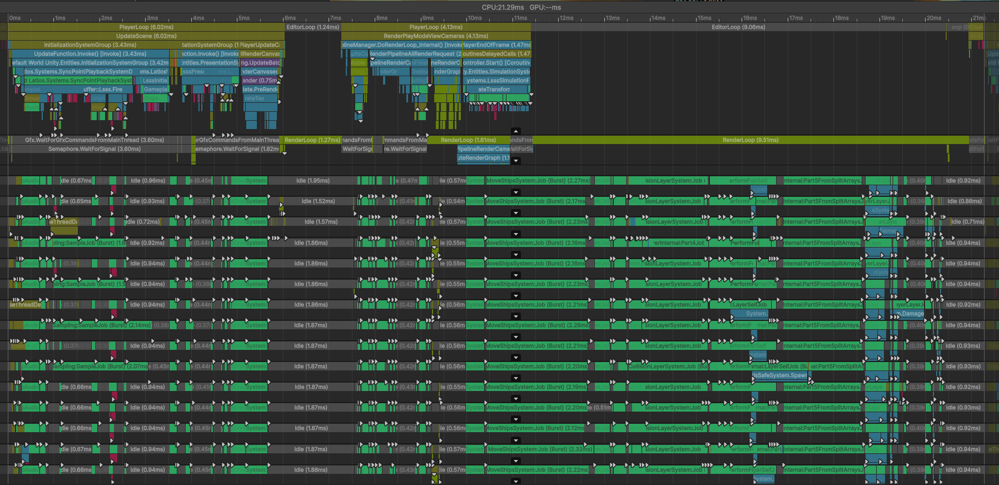

Alright. I’m not sure what the editor is doing. But it is kinda holding up our
frames and preventing us from truly measuring the job wrap-around bottleneck
from simulation.

The `FireGunsSystem`’s `InstantiateCommandBuffer` is still kinda pricy. We maybe
need to give that a little more love.

Now what about Sector 02 Mission 6?

…

Unity crashed.

And it looks like it broke deep within temporary memory allocation code. I’m not
sure what that is about, but I think it is time for an editor update.

*An Editor update later…*

And Unity crashed again…

Turns out, the union find algorithm didn’t correctly handle the case where there
were zero chunks found, and somehow I had forgotten the
`[RequireMatchingQueriesForUpdate]` attribute on the animation system.

As for the profiler syncing on jobs, I noticed the very last ECS systems in the
frame were updating Game Object transforms. Because QVVS V2 does not have a
dedicated transform update system anymore, I needed a new home for syncing
transforms to Game Objects. I decided to make this the end of
`SimulationSystemGroup`. Apparently that stalls frames. So I’ve added a second
sync spot at the end of `InitializationSystemGroup`, and then disabled the
`SimulationSystemGroup` transform sync in the LSSS bootstrap.

Here’s Sector 03 Mission 5 with these fixes:

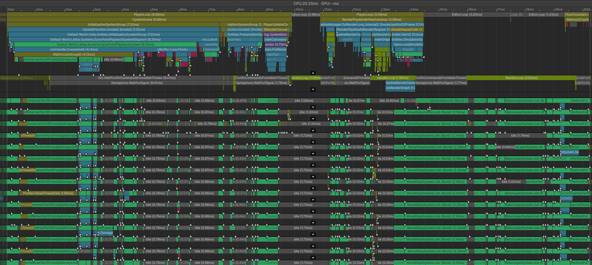

And here’s Sector 02 Mission 6:

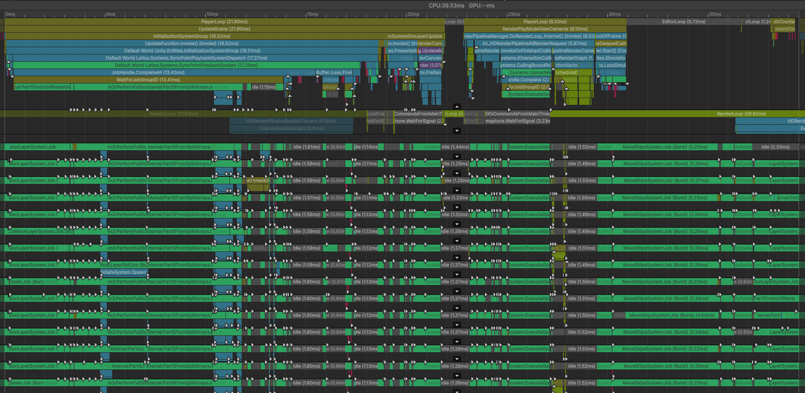

Alright. There seems to be a couple of problems. The first is that instantiating
gun sounds is still a little slow. And the second is that ships are taking a
while to move. Let’s investigate the latter. Here’s that job:

```csharp
public void Execute([EntityIndexInChunk] int indexInChunk,
                    ref Speed speed,
                    ref ShipBoostTank boostTank,
                    in ShipSpeedStats stats,
                    in ShipDesiredActions desiredActions)
{
    var transform = transformHandle[indexInChunk];

    // Rotation
    var oldRotation         = transform.worldRotation;
    var turn                = desiredActions.turn * stats.turnSpeed * dt;
    turn.y                  = -turn.y;
    float3 up               = math.mul(oldRotation, new float3(0f, 1f, 0f));
    turn.x                  = math.select(turn.x, -turn.x, up.y < 0f);
    var xAxisRot            = quaternion.Euler(turn.y, 0f, 0f);
    var yAxisRot            = quaternion.Euler(0f, turn.x, 0f);
    var newRotation         = math.mul(oldRotation, xAxisRot);
    newRotation             = math.mul(yAxisRot, newRotation);
    transform.worldRotation = newRotation;

    // Speed
    bool isBoosting = desiredActions.boost && boostTank.boost > 0f;

    speed.speed = Physics.StepVelocityWithInput(desiredActions.gas,
                                                speed.speed,
                                                math.select(stats.acceleration, stats.boostAcceleration, isBoosting),
                                                stats.deceleration,
                                                math.select(stats.topSpeed, stats.boostSpeed, isBoosting),
                                                stats.acceleration,
                                                stats.deceleration,
                                                stats.reverseSpeed,
                                                dt);

    // Translation
    var   position          = transform.worldPosition + transform.forwardDirection * speed.speed * dt;
    float distanceToOrigin  = math.length(position);
    transform.worldPosition = math.select(position, arenaRadius / distanceToOrigin * position, distanceToOrigin > arenaRadius);

    // Boost Tank
    boostTank.boost += math.select(stats.boostRechargeRate, -stats.boostDepleteRate, isBoosting) * dt;
    boostTank.boost  = math.min(boostTank.boost, stats.boostCapacity);
}
```

Hey! We are doing two writes to the `TransformAspect` here; once for rotation,
and another for position. In QVVS V1, this was quite innocent. But in V2, this
means we are doing propagation twice. Let’s combine the write by simply setting
the full `worldTransform` at the end.

Here’s Sector 03 Mission 5 with this change:

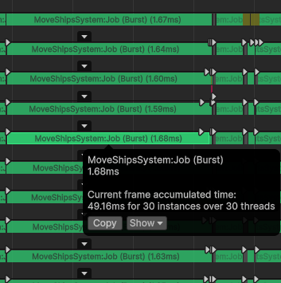

Nice! We saved 18 milliseconds across all threads, reducing the frame time by a
little over half a millisecond. And the overall frame times definitely feel the
difference.

Now about our `SortAndMergeBatchAddSetsJob` that has been taking longer than the
structural change it is supposed to batch up… time for some profiler markers.

This job has 5 steps.

1.  Read elements from `NativeStream`
2.  Use a hashmap to convert chunk hashcodes into chunk indices of first
    appearances
3.  Sort elements by chunk and index in chunk
4.  Merge requirement flags
5.  Sort by requirement flags, and then by chunk and index in chunk

Which of these 5 will be the slowest? Make your prediction now!

…

…

…

And in first place, we have \#3, sorting entities, consuming 50% of the job’s
execution time, followed by \#5, sorting elements, consuming 25% of the job’s
execution time.

Well, sorting is certainly a fun challenge that could certainly balloon into its
own adventure. That’s our queue to wrap this adventure up.

## The Final Score

Time to compare QVVS V1 to QVVS V2, to see how close we got.

If we look at the top markers on the main thread for Sector 02 Mission 6, we see
this:

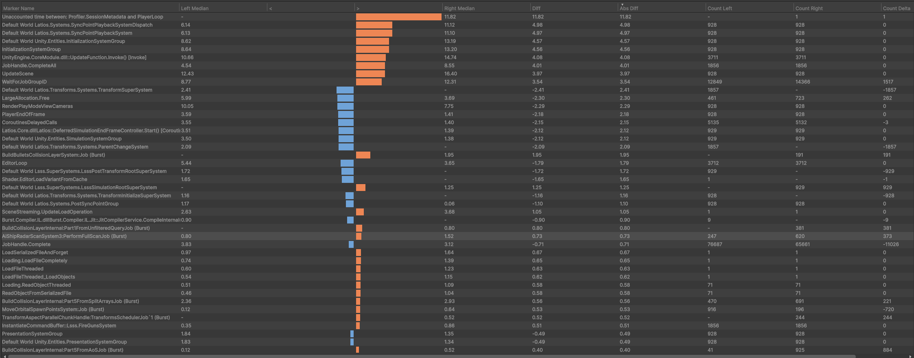

Blue is QVVS V1, while orange is V2. As we can see, V1 suffers some costs of
having to update a transform system, which syncs the main thread. However, that
cost is overshadowed by how much V2 is waiting for (and helping) jobs complete.

If we look at the worker threads, we can see where this difference lies:

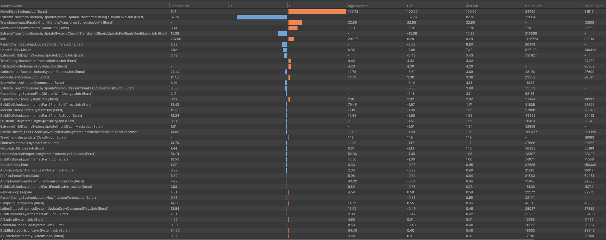

Overall, transform propagation is a little slower in V2. This isn’t a surprise
to me. V2 is more mathematically rigorous, and has a more awkward random access
pattern that can’t leverage L3 cache as much. But also, the propagation
algorithm is very generalized right now, with plenty of opportunities for
fast-paths or other optimization efforts in the future.

In fact, I’m actually surprised V2 is as close to V1 as it is. That’s quite
promising!

But that isn’t the whole story. Check this out. This is V1:

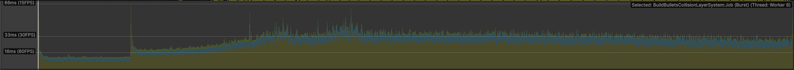

And this is V2:

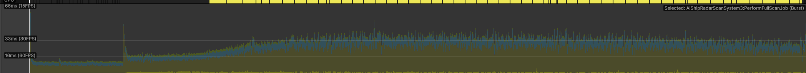

Notice during the frames where frame times ramp up, that V1 has more spiky
frames? That’s from spawning structural changes, especially setting up `Child`
buffers. V2 doesn’t suffer from that, only having 3 spike frames. The first
spike is the load frame, which doesn’t really matter. The second spike is due to
initializing ship positions on the main thread (very fixable). And the third was
a perfect storm of mostly the editor doing editor things.

So while V2 is slightly slower on average, we got rid of this mess:

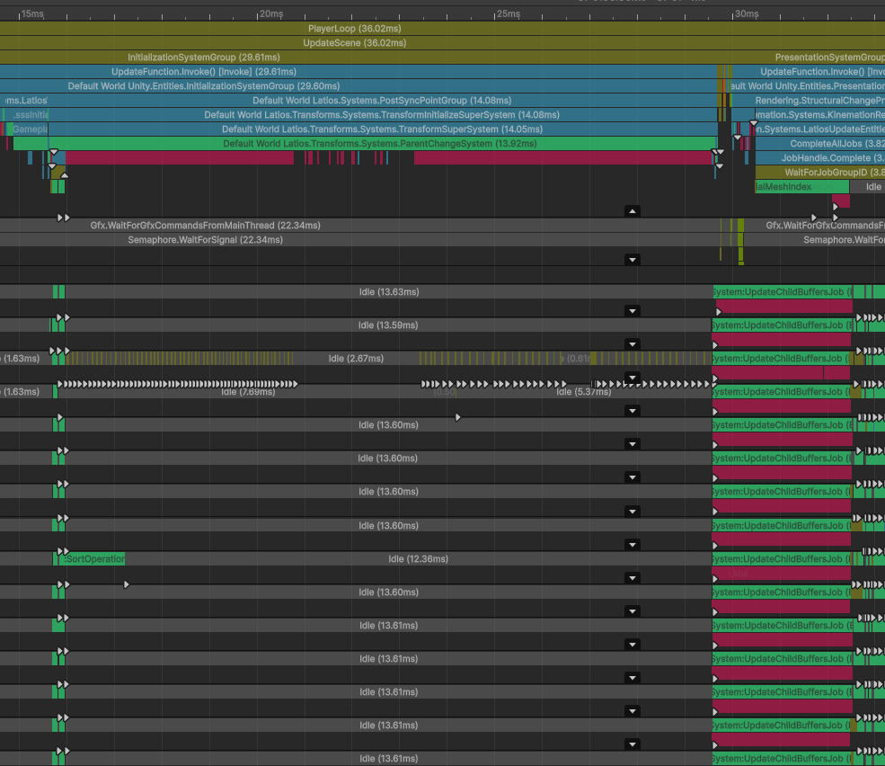

## What’s Next?

The whole goal of this adventure was to parallelize some bottlenecks that came
about due to QVVS V2’s different design philosophies. Not only did we succeed
with this, but we got LSSS performance surprisingly close to V1 levels!

But parallelizing doesn’t automatically lead to better performance. In the case
of instantiation, parallelization was slower until we were able to parallelize
the problematic parts.

As for what’s next? I don’t have any concrete plans, but QVVS V2 offers a whole
new domain ripe with optimizations! I’m certain there will be more adventures to
come!

## Try It Yourself

QVVS V2 integration starts here:
<https://github.com/Dreaming381/lsss-wip/commit/ae3ea17d6b89fac6d8ab3ee94047139a44b35284>

And the last commit for this adventure is this one:
<https://github.com/Dreaming381/lsss-wip/commit/9eed9ba7dbbc8a30df645f3185f38552d1fa36e1>
