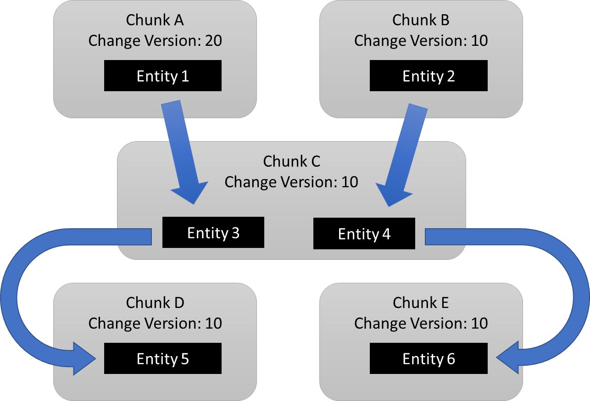
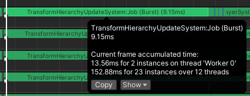
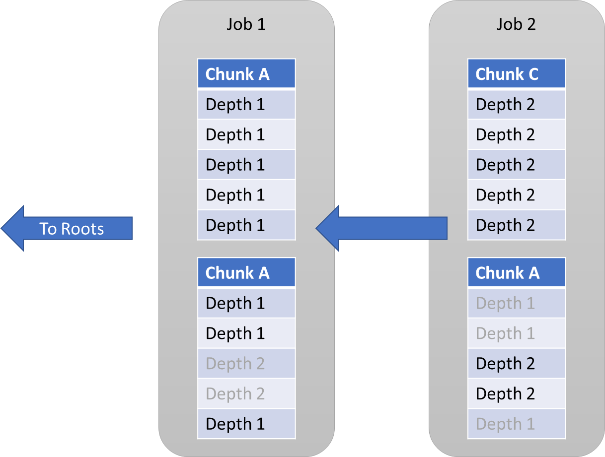
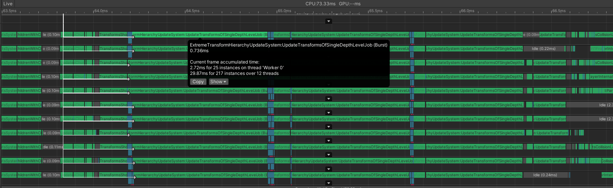
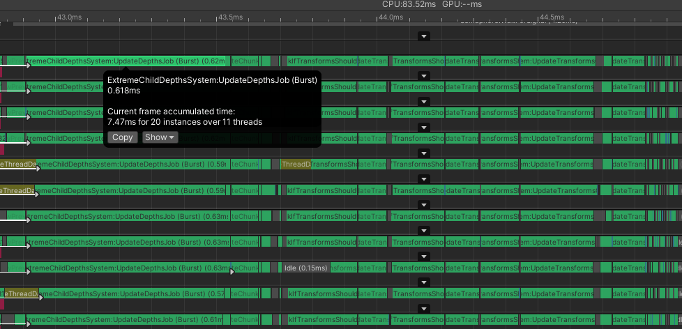

# Optimization Adventure 9 – Transform Hierarchy Part 1

“Transform” is such an overloaded term. You could be referring to some state of
3D space. You could be referring to an operation on a set of data. You might be
referring to robots or fictional anime girls. But you probably aren’t referring
to the action required to fit through a doorway after a flight, though that
would also be a valid use of the term.

For this adventure, we’ll be focusing on the first use case, which is
representing objects in 3D space. These types of transforms are apparently
really hard to make performant in an archetype ECS. So much so, that I often see
developers try to convince themselves and others that you don’t need to read
world-space transforms of child entities or you don’t need hierarchies to begin
with. That might be true if you make simple games with simple gameplay
mechanics, but don’t lie to yourself. Complex objects with lots of different
triggers and sounds and effects and motions need complex hierarchies, and need
to know the world-space transforms of the objects in those hierarchies. It might
not seem like these things are necessary today, but then you also need to
remember all the missing features in Unity’s ECS packages like Audio, Animation,
and AI. There are many reasons these don’t exist yet, but one of them is Unity’s
shaky track record with transforms.

People think that transforms are just plain hard, because there is a lot of
linear algebra involved. I’m no linear algebra master, but I can tell you that
is only half the battle. The other half is general data manipulation, and it is
the part people keep screwing up.

For over a year now, I’ve been modifying and eventually replacing Unity’s
Transform System with my own code. Yet for some reason, I never made a proper
Optimization Adventure on the topic. A big reason for that is that it was a slow
development over months of continuous improvements, little bugfixes and
improvements that kept adding up until I was suddenly way ahead. But now with
the new QVVS Transforms, I need to reimplement one of those optimizations from
scratch. So here we are. But first, let me give some background as to the types
of problems and pitfalls we need to watch out for.

## A Race Condition in the Wild

I’ve often criticized Unity’s Transforms as being full of race conditions and
being non-deterministic. I think a lot of people just skim past these remarks
and never take the time to ask or try to understand what I mean. I could write
several adventures-worth of examples, but let me show you just one.

This is Unity’s transform hierarchy update job in Entities 1.0.0-pre.65:

```csharp
[BurstCompile]
unsafe struct ComputeChildLocalToWorldJob : IJobChunk
{
    [ReadOnly] public EntityQueryMask LocalToWorldWriteGroupMask;

    [ReadOnly] public BufferTypeHandle<Child> ChildTypeHandleRO;
    [ReadOnly] public BufferLookup<Child> ChildLookupRO;
    public ComponentTypeHandle<LocalToWorld> LocalToWorldTypeHandleRW;

    [ReadOnly] public ComponentLookup<LocalTransform> LocalTransformLookupRO;
    [ReadOnly] public ComponentLookup<PostTransformMatrix> PostTransformMatrixLookupRO;
    [NativeDisableContainerSafetyRestriction] public ComponentLookup<LocalToWorld> LocalToWorldLookupRW;
    public uint LastSystemVersion;

    void ChildLocalToWorldFromTransformMatrix(in float4x4 parentLocalToWorld, Entity childEntity, bool updateChildrenTransform)
    {
        updateChildrenTransform = updateChildrenTransform
                                    || PostTransformMatrixLookupRO.DidChange(childEntity, LastSystemVersion)
                                    || LocalTransformLookupRO.DidChange(childEntity, LastSystemVersion);

        float4x4 localToWorld;

        if (updateChildrenTransform && LocalToWorldWriteGroupMask.MatchesIgnoreFilter(childEntity))
        {
            var localTransform = LocalTransformLookupRO[childEntity];
            localToWorld = math.mul(parentLocalToWorld, localTransform.ToMatrix());
            if (PostTransformMatrixLookupRO.HasComponent(childEntity))
            {
                localToWorld = math.mul(localToWorld, PostTransformMatrixLookupRO[childEntity].Value);
            }
            LocalToWorldLookupRW[childEntity] = new LocalToWorld{Value = localToWorld};
        }
        else
        {
            localToWorld = LocalToWorldLookupRW[childEntity].Value;
            updateChildrenTransform = LocalToWorldLookupRW.DidChange(childEntity, LastSystemVersion);
        }

        if (ChildLookupRO.TryGetBuffer(childEntity, out DynamicBuffer<Child> children))
        {
            for (int i = 0, childCount = children.Length; i < childCount; i++)
            {
                ChildLocalToWorldFromTransformMatrix(localToWorld, children[i].Value, updateChildrenTransform);
            }
        }
    }

    public void Execute(in ArchetypeChunk chunk, int unfilteredChunkIndex, bool useEnabledMask, in v128 chunkEnabledMask)
    {
        Assert.IsFalse(useEnabledMask);

        bool updateChildrenTransform = chunk.DidChange(ref ChildTypeHandleRO, LastSystemVersion);
        BufferAccessor<Child> chunkChildBuffers = chunk.GetBufferAccessor(ref ChildTypeHandleRO);
        updateChildrenTransform = updateChildrenTransform || chunk.DidChange(ref LocalToWorldTypeHandleRW, LastSystemVersion);
        LocalToWorld* chunkLocalToWorlds = (LocalToWorld*)chunk.GetRequiredComponentDataPtrRO(ref LocalToWorldTypeHandleRW);
        for (int i = 0, chunkEntityCount = chunk.Count; i < chunkEntityCount; i++)
        {
            var localToWorld = chunkLocalToWorlds[i].Value;
            var children = chunkChildBuffers[i];
            for (int j = 0, childCount = children.Length; j < childCount; j++)
            {
                ChildLocalToWorldFromTransformMatrix(localToWorld, children[j].Value, updateChildrenTransform);
            }
        }
    }
}
```

Already, warning flags should be going off by that
`[NativeDisableContainerSafetyRestriction]` which indeed is hiding the problem
at play here. But its presence alone doesn’t mean there is a race condition.
Unity could very well be doing the smart thing here (except they aren’t).

Now let’s suppose we have a situation like this, where chunks A and B are roots
and the arrows show children.



You’ll notice I highlighted the change version. These represent `LocalToWorld`
change versions. Remember that whenever a component is written to, the change
version is updated to the global value for that component. Let’s suppose that
the global value is 20, and the `LastSystemVersion` is 15. That means that right
now, only Chunk A is considered having changed `LocalToWorld` components. This
job only queries roots, so only chunks A and B reach the initial execute method.
But all the entities will end up being touched by this algorithm. You can also
assume that the `LocalToWorldWriteGroupMask` always returns true in this
example. And lastly, assume all the other transform components have a change
version of 10.

Now let’s suppose Chunk A and Chunk B are each processed by a different thread.
Can you spot the issue?

It might be hard to think of how two threads interact with data at the same
time, but in this case, we don’t have to. Let’s work through what happens if the
first thread runs completely through Chunk A before the second thread starts,
and then what happens if the second thread works through Chunk B before the
first thread starts.

When Chunk A is processed, it sees that the `LocalToWorld` is dirty. It calls
`ChildLocalToWorldFromTransformMatrix` passing in Entity 3 and setting
`updateChildrenTransform` to `true`. Because `updateChildrenTransform` is
`true`, the first `if` block is `true` and Entity 3 `LocalToWorld` gets written
to, thus increasing Chunk C’s change version to 20. Then, the algorithm recurses
to Entity 5, and Chunk D’s change version also gets bumped to 20.

Next, the other thread processes Chunk B. It sees that `LocalToWorld` is clean.
It calls `ChildLocalToWorldFromTransformMatrix` passing in Entity 4 and setting
`updateChildrenTransform` to `false`. Because `updateChildrenTransform` is
`false`, the `else` block gets triggered. Then it checks the change version of
Chunk C which was set to 20 when Entity 3 was updated, so
`updateChildrenTransform` gets set to `true`. And this means Chunk E also ends
up getting its change version bumped to 20. That’s suspicious. By the end of
this update, all chunks except B have a change version of 20. Now what happens
if we flip the order?

We start this time by having the first thread process Chunk B. It sees that
`LocalToWorld` is clean. It calls `ChildLocalToWorldFromTransformMatrix` passing
in Entity 4 and setting `updateChildrenTransform` to false. Because
`updateChildrenTransform` is `false`, the `else` block gets triggered. So far,
all the same. But when it checks the change version of Chunk C, this time it is
still 10. That’s different, and now `updateChildrenTransform` is set to `false`,
which carries on to Entity 6. Entity 6 takes the same codepath.

Next, the other thread processes Chunk A, which follows the exact same pattern
as the first example where it updates the change version of chunks C and D. This
means that chunks A, C, and D have a change version of 20 while chunks B and E
have a change version of 10.

Notice how Chunk E ends up with different change versions in the two different
scenarios? That’s a race condition!

The fix for this is to only check the change version and update
`updateChildTransform` in the else block when `LocalToWorldWriteGroupMask`
queries are `false`. In that case, `LocalToWorld` can’t be touched in the chunk
where such an entity resides by this job, so the change version check is safe.
But when the `else` block is entered because `updateChildrenTransform` was
`false`, all the change version check does is check if any adjacent entity in
the chunk was updated before the current one, which logically isn’t supposed to
affect whether or not a hierarchy is dirty.

## The Journey to Today

This bug, plus many more like it in ParentSystem.cs have existed for years now,
despite me raising complaints about them every so often. That’s not to say that
Latios Framework code is immune from these types of bugs either. I encourage you
to dig deep in the code and be critical and raise attention to potential issues.
Even if those end up being false alarms, I’d much rather there be more eyes on
the code, as that generally improves quality for everyone!

With that said, there’s one more performance-related aspect of this transform
job we can discuss. Even when the bug is fixed, it still ends up reading or
writing `LocalToWorld` for every entity. Even if all the entities are completely
motionless, these operations will happen. However, it is possible to not do
that, by lazy-populating the matrix whenever `updateChildrenTransform` becomes
dirty. There’s also some other tricks related to parent changes that can be
employed as well. And all these changes plus the fixes to ParentSystem.cs were
what I have traditionally called “Improved Transforms”. QVVS Transforms have a
completely different `ParentChangeSystem`, but the transform hierarchy update
job still follows this pattern.

```csharp
[BurstCompile]
struct Job : IJobChunk
{
    [ReadOnly] public ComponentTypeHandle<WorldTransform> worldTransformHandle;
    [ReadOnly] public BufferTypeHandle<Child>             childHandle;
    [ReadOnly] public BufferLookup<Child>                 childLookup;
    [ReadOnly] public ComponentLookup<LocalTransform>     localTransformLookup;
    [ReadOnly] public ComponentLookup<PreviousParent>     parentLookup;

    [NativeDisableParallelForRestriction] public ComponentLookup<ParentToWorldTransform> parentToWorldLookup;
    [NativeDisableContainerSafetyRestriction] public ComponentLookup<WorldTransform>     worldTransformLookup;

    public uint lastSystemVersion;

    public unsafe void Execute(in ArchetypeChunk chunk, int unfilteredChunkIndex, bool useEnabledMask, in v128 chunkEnabledMask)
    {
        var worldTransformArrayPtr = (TransformQvvs*)chunk.GetRequiredComponentDataPtrRO(ref worldTransformHandle);
        var childAccessor          = chunk.GetBufferAccessor(ref childHandle);

        bool worldTransformsDirty = chunk.DidChange(ref worldTransformHandle, lastSystemVersion);
        bool childBufferDirty     = chunk.DidChange(ref childHandle, lastSystemVersion);

        bool worldTransformValid = true;

        for (int i = 0; i < chunk.Count; i++)
        {
            foreach (var child in childAccessor[i])
            {
                // We can safely pass in default for the parent argument since parentWorldTransformValid is forced true.
                // The child doesn't need to lazy load the parentWorldTransform.
                UpdateChildRecurse(ref worldTransformArrayPtr[i], ref worldTransformValid, default, child.child, worldTransformsDirty, childBufferDirty);
            }
        }
    }

    void UpdateChildRecurse(ref TransformQvvs parentWorldTransform,
                            ref bool parentWorldTransformValid,
                            Entity parent,
                            Entity entity,
                            bool parentTransformDirty,
                            bool childBufferDirty)
    {
        bool needsUpdate              = parentTransformDirty;
        bool hasMutableLocalTransform = localTransformLookup.HasComponent(entity);
        if (!parentTransformDirty && hasMutableLocalTransform)
        {
            needsUpdate  = localTransformLookup.DidChange(entity, lastSystemVersion);
            needsUpdate |= parentTransformDirty;
            needsUpdate |= parentLookup.DidChange(entity, lastSystemVersion) && childBufferDirty;
        }

        TransformQvvs worldTransformToPropagate = default;

        if (needsUpdate)
        {
            if (!parentWorldTransformValid)
            {
                parentWorldTransform      = worldTransformLookup[parent].worldTransform;
                parentWorldTransformValid = true;
            }

            if (hasMutableLocalTransform)
            {
                parentToWorldLookup[entity] = new ParentToWorldTransform { parentToWorldTransform = parentWorldTransform };
                ref var worldTransform                                                            = ref worldTransformLookup.GetRefRW(entity, false).ValueRW;
                qvvs.mul(ref worldTransform.worldTransform, in parentWorldTransform, localTransformLookup[entity].localTransform);
                worldTransformToPropagate = worldTransform.worldTransform;
            }
            else
            {
                worldTransformLookup[entity] = new WorldTransform { worldTransform = parentWorldTransform };
                worldTransformToPropagate                                          = parentWorldTransform;
            }
        }
        // If we had a WriteGroup, we would apply it here.

        if (childLookup.HasBuffer(entity))
        {
            bool childBufferChanged    = childLookup.DidChange(entity, lastSystemVersion);
            bool worldTransformIsValid = needsUpdate;
            foreach (var child in childLookup[entity])
                UpdateChildRecurse(ref worldTransformToPropagate, ref worldTransformIsValid, entity, child.child, needsUpdate, childBufferChanged);
        }
    }
}
```

These sorts of optimizations used to net me a 4% performance at an absolute
minimum, and as high as 50% in very motionless scenes. I haven’t benchmarked
this version against the latest Unity transforms though. If that’s something you
would like, I encourage you to find a way to get involved to help make it
happen!

## Why Transforms Are Expensive

The algorithm above is a classical depth-first hierarchy update algorithm. It is
the only algorithm Unity Transforms has ever used, and has always been the
default in the Latios Framework. It performs well with smaller entity counts,
and is intuitive in function. However, when you throw a stress-test scene at it,
like Sector 03 Mission 5 of LSSS, this happens:



A couple things to note here. First, there are two hierarchy updates per frame
in LSSS. The first happens after sync points and initializes newly spawned
entities. The other is the one you see which happens after all the movement
logic. Despite both having to iterate over the entire hierarchy, the first
update only takes half as long as the second. That’s the lazy updates of
matrices for unchanged hierarchies taking effect. The second thing to note is
that these frames take 70 ms on average.

And this job is 20% of that!

While switching to QVVS Transforms made everything else in LSSS a little faster,
this job suddenly became the most expensive. And consequently, this job is now
in the crosshairs for optimization.

### Hi Rars!

As an exercise, scroll up to the job, and count how many “lookup” operations
there are. Quite a few, right? Now how many of them get touched more than once
per entity? None? We’re going through all the effort to drag these pieces of
data into cache, only to touch the data once and never again? What’s the point
of even having a cache?

Yes. If you remember from Optimization Adventure 7, we went to war with random
accesses. And now here they are again in full force causing absolute havok. This
time, we also have a lot of random-access writes (Raws), but it doesn’t make
much difference if we are fighting Raws or Rars. They both cause problems.

## Flipping the Problem Upside Down

If you were paying close attention when counting lookup operations, you may have
also noticed nearly all of them were on the child entity. The parent is looking
up all this information on the child. What if we reversed that? What if we
chunk-iterated children and looked up information on the parents? Suddenly, all
those random accesses become linear accesses, and we are just with a single
random access for looking up the parent’s transform.

*But is the parent’s transform even up to date?*

Probably not. We’d have to schedule a job for each level of the hierarchy to
ensure the parent is always up-to-date first.

*But each entity in a chunk could have a separate depth value. Unless you use
shared components, but won’t that mean a lot of structural changes, which are
also really slow?*

Theoretically, chunks could have a wide variety of depth values. In practice,
this is rare, especially if you are using the Latios Framework. To understand
why, you need to go back to our adventure about InstantiateCommandBuffer. There,
we say that instantiating multiple copies of an entity in batch caused the
copies to end up in the same chunk until the chunk filled up. When you
instantiate an Entity with a LinkedEntityGroup, the same thing happens for each
element in the LinkedEntityGroup. If you instantiate 50 root entities, the first
entity in the prefab LinkedEntityGroup gets instantiated with 50 copies, then
the second element gets 50 copies, then third, and so on. For large-scale
simulations, chunks tend to hold instantiated copies of mostly the same source
Entity at the same LinkedEntityGroup index. And so naturally, they will have the
same hierarchy depth. If your simulation is large enough to have hierarchy
performance problems, you probably are batch-instantiating entities in this way
that creates highly-correlated chunks. They won’t be perfect, and we may have to
iterate some chunks a few times, but those extra iterations won’t have Rars
penalties.

Here's what this will look like:



## Computing Depths

First off, how many depth levels do we support? Each depth will require its own
job, so we don’t want to schedule too many. I personally have picked 16 as this
will fit nicely with some other optimizations we’ll be doing. For any hierarchy
deeper than that, there will be a fallback mode using the traditional algorithm
which will treat depth 16 entities as roots. Most hierarchies aren’t that deep.
Consequently, we only need to keep track of 16 depths plus some spillover value,
which means a `Depth` component only needs a single byte.

```csharp
internal struct Depth : IComponentData
{
    public byte depth;
}
```

Next, we’ll need to add these to the right entities. `ParentChangeSystem` can
help us here by simply adding and removing the Depth component whenever the
`PreviousParent` component gets added or removed.

After that, we need to update the depth values from parent changes. We could
also potentially have `ParentChangeSystem` compute some of this on a worker
thread during a sync point, but that’s a potentially future adventure. For now,
I’m simply going to make a separate system responsible for this.

The algorithm is fairly simple. We first query for all entities with a
`PreviousParent` that has a triggered change version filter. Then, for each
entity, we walk up the hierarchy until it encounters a parent that also has a
changed `PreviousParent`. When that happens, the entity is pruned from the
algorithm. If the walk instead reaches the root, then we know the entity we
iterated on is the top-most entity in its hierarchy with a changed parent, so we
walk back down to compute its depth, and then we broadcast the depth through all
of its descendants.

This is the full job in its entirety:

```csharp
[BurstCompile]
struct UpdateDepthsJob : IJobChunk
{
    [ReadOnly] public ComponentTypeHandle<PreviousParent> parentHandle;
    [ReadOnly] public ComponentLookup<PreviousParent> parentLookup;
    [ReadOnly] public BufferTypeHandle<Child> childHandle;
    [ReadOnly] public BufferLookup<Child> childLookup;
    [NativeDisableContainerSafetyRestriction] public ComponentLookup<Depth> depthLookup;
    public ComponentTypeHandle<Depth> depthHandle;

    public uint lastSystemVersion;

    public void Execute(in ArchetypeChunk chunk, int unfilteredChunkIndex, bool useEnabledMask, in v128 chunkEnabledMask)
    {
        if (!chunk.DidChange(ref parentHandle, lastSystemVersion))
            return;

        var parents = chunk.GetNativeArray(ref parentHandle);

        BufferAccessor<Child> childAccess = default;
        bool hasChildrenToUpdate = chunk.Has(ref childHandle);
        if (hasChildrenToUpdate)
            childAccess = chunk.GetBufferAccessor(ref childHandle);
        NativeArray<Depth> depths = default;

        for (int i = 0; i < chunk.Count; i++)
        {
            if (IsDepthChangeRoot(parents[i].previousParent, out var depth))
            {
                if (!depths.IsCreated)
                    depths = chunk.GetNativeArray(ref depthHandle);

                var startDepth = new Depth { depth = depth };
                depths[i] = startDepth;
                startDepth.depth++;

                if (hasChildrenToUpdate)
                {
                    foreach (var child in childAccess[i])
                    {
                        WriteDepthAndRecurse(child.child, startDepth);
                    }
                }
            }
        }
    }

    bool IsDepthChangeRoot(Entity parent, out byte depth)
    {
        var current = parent;
        depth = 0;
        while (parentLookup.HasComponent(current))
        {
            if (parentLookup.DidChange(current, lastSystemVersion))
            {
                return false;
            }
            depth++;
            current = parentLookup[current].previousParent;
        }
        return true;
    }

    void WriteDepthAndRecurse(Entity child, Depth depth)
    {
        depthLookup[child] = depth;
        depth.depth++;
        if (childLookup.HasBuffer(child))
        {
            foreach (var c in childLookup[child])
            {
                WriteDepthAndRecurse(c.child, depth);
            }
        }
    }
}
```

## Classifying Chunks

The next step is to figure out which chunks need to be processed by each depth
level. We could compute this on the fly whenever we start processing a depth, or
we could try and calculate them all at once up front to limit how many times we
jump to a chunk to begin with.

We’re actually going to do even better than that. Many chunks don’t have
entities jumping around between them on a frame-to-frame basis. Entities don’t
often change their hierarchy structure either. This means that the different
depth levels a chunk contains typically doesn’t change frame-to-frame. We can
probably cache this information. Can you guess with what?

Chunk components!

```csharp
internal struct ChunkDepthMask : IComponentData
{
    public BitField32 chunkDepthMask;
}
```

We have a 32-bit mask. We’ll use 16 of those to represent the different depths a
chunk contains. If a chunk only has higher depths than 16, it won’t have any
bits set. We’ll discuss what the other 16 bits get used for later.

### A Chunk Component Pitfall

You cannot remove a `ComponentTypeSet` from a `NativeArray<Entity>` if that
`NativeArray` contains chunk components. Same applies to adding, but fortunately
that doesn’t affect us as we only add via `EntityQuery`. The fastest way to work
around this is to add a tag component to that `NativeArray`, and then remove the
`ComponentTypeSet` plus tag on a query with that tag. Hopefully one day this
gets fixed.

### Caching Depths

There’s really nothing special here. The job looks at chunks with changes and
then updates the chunk component. The upper 16 bits get reset each time which is
fine, as they need to be reset every update anyways.

```csharp
[BurstCompile]
struct UpdateChunkDepthMasksJob : IJobChunk
{
    [ReadOnly] public ComponentTypeHandle<Depth> depthHandle;
    public ComponentTypeHandle<ChunkDepthMask> chunkDepthMaskHandle;
    public uint lastSystemVersion;

    public void Execute(in ArchetypeChunk chunk, int unfilteredChunkIndex, bool useEnabledMask, in v128 chunkEnabledMask)
    {
        if (chunk.DidChange(ref depthHandle, lastSystemVersion) || chunk.DidOrderChange(lastSystemVersion))
        {
            BitField32 depthMask = default;
            var depths = chunk.GetNativeArray(ref depthHandle);
            for (int i = 0; i < chunk.Count; i++)
            {
                if (depths[i].depth < kMaxDepthIterations)
                    depthMask.SetBits(depths[i].depth, true);
            }

            chunk.SetChunkComponentData(ref chunkDepthMaskHandle, new ChunkDepthMask { chunkDepthMask = depthMask });
        }
    }
}
```

### Binning Chunks

Now that we have a chunk component containing a mask of each of our chunks, the
next thing we need to do is build a list of chunks for each depth. When it comes
to adding an unknown number of chunks to a list in parallel, there’s one tool
for the job. You probably already know it.

`UnsafeParallelBlockList`!

```csharp
[BurstCompile]
struct AllocateBlockListsJob : IJobParallelFor
{
    public NativeArray<UnsafeParallelBlockList> chunkBlockLists;
    public AllocatorManager.AllocatorHandle     allocator;

    public void Execute(int i)
    {
        chunkBlockLists[i] = new UnsafeParallelBlockList(sizeof(ArchetypeChunk), 64, allocator);
    }
}

[BurstCompile]
struct ClassifyChunksAndResetMasksJob : IJobChunk
{
    [ReadOnly] public ComponentTypeHandle<ChunkHeader> headerHandle;
    public ComponentTypeHandle<ChunkDepthMask>         depthMaskHandle;

    [NativeDisableParallelForRestriction]
    public NativeArray<UnsafeParallelBlockList> chunkBlockLists;

    [NativeSetThreadIndex]
    int threadIndex;

    public void Execute(in ArchetypeChunk chunk, int unfilteredChunkIndex, bool useEnabledMask, in v128 chunkEnabledMask)
    {
        var headers    = chunk.GetNativeArray(ref headerHandle);
        var depthMasks = chunk.GetNativeArray(ref depthMaskHandle);

        for (int i = 0; i < chunk.Count; i++)
        {
            var mask                   = depthMasks[i];
            mask.chunkDepthMask.Value &= 0xffff;
            depthMasks[i]              = mask;

            var dynamicMask = mask.chunkDepthMask;
            int j;
            while ((j = dynamicMask.CountTrailingZeros()) < kMaxDepthIterations)
            {
                chunkBlockLists[j].Write(headers[i].ArchetypeChunk, threadIndex);
                dynamicMask.SetBits(j, false);
            }
        }
    }
}
```

We have 16 of these instances, one for each depth. Turns out that allocating and
initializing 16 of these can add up on the main thread, which is why that step
has its own job. Otherwise, the code mostly explains itself. The distribution
job iterates meta chunks for more cache-efficient access to the chunk
components, and it uses `tzcnt` iteration to find the set bits. We only expect a
small percentage of these bits to be set, so `tzcnt` iteration is a nice win
here. Lastly, we zero-out the upper 16 bits of the mask. As I mentioned before,
these need to be reset every update.

However, we want to schedule a parallel job over each one of these lists of
chunks. We can’t really do that with `UnsafeParallelBlockList`. Thus, we need
this job:

```csharp
[BurstCompile]
struct FlattenBlocklistsJob : IJobFor
{
    public NativeArray<UnsafeParallelBlockList>                 chunkBlockLists;
    [NativeDisableParallelForRestriction] public ChunkListArray chunkListArray;

    public void Execute(int index)
    {
        var list = chunkListArray[index];
        list.ResizeUninitialized(chunkBlockLists[index].Count());
        chunkBlockLists[index].GetElementValues(list.AsArray());
    }
}
```

What is `ChunkListArray`? It is a struct with 16 `NativeList<ArchetypeChunk>`
each decorated with `[NativeDisableParallelForRestriction]`. The struct also has
a custom indexer which is just a switch case to select each one. It is arguably
a little stupid that we have to do this, but it functions and we can move on to
the exciting part.

## The Race in the Shadows

The next part is fairly straightforward, right? All we need to do is iterate the
children in chunks of a specific depth level, check if their depth component
matches that provided to the job, and then look up their parent’s transform and
update.

If this is your thought-process, then you are kinda right. But you need to watch
out for `CopyParentWorldTransformTag`. That’s easy though, as that’s data the
can fetched at a chunk-level for the chunks we are iterating. Just hard-branch
for the chunk.

And what about change filters? If you declare write access to the children world
transforms in a chunk, then you bump their change versions, even if nothing
changed. A workaround would be to first iterate and check the parent change
versions, and then if anything changed, then do normal update loop. Instead of
one loop in the job, there would be two.

**Don’t do that!**

If you declare write access to the `WorldTransform` in the same job you are
checking the change version of `WorldTransform`, then you end up with the same
race condition we discussed in the beginning!

If we want change version checking, then the safe way to do that is to separate
the change version checking from the updating, by splitting into two separate
jobs. But that requires each chunk communicate to itself between jobs if it
actually needs an update or not. Perhaps a chunk component would be a good
option for that.

And that’s what those other 16 bits in our depth mask are for.

We use a bit for each depth, so that we only have to clear the bits once per
update, rather than each depth level.

Here’s the check code:

```csharp
public void Execute(int index)
{
    var chunk = chunkList[index];

    var parents = chunk.GetNativeArray(ref parentHandle);
    var depths  = chunk.GetNativeArray(ref depthHandle);

    bool hasLocalTransform = chunk.Has(ref localTransformHandle);

    if (chunk.DidChange(ref parentHandle, lastSystemVersion) || chunk.DidChange(ref localTransformHandle, lastSystemVersion) ||
        (!hasLocalTransform && chunk.DidOrderChange(lastSystemVersion)))  // Catches addition of CopyParentWorldTransformTag
    {
        // Fast path. No need to check for changes on parent.
        SetNeedsUpdate(chunk);
    }
    else
    {
        for (int i = 0; i < chunk.Count; i++)
        {
            if (depth == depths[i].depth)
            {
                var parent = parents[i].previousParent;
                if (worldTransformLookup.DidChange(parent, lastSystemVersion))
                {
                    SetNeedsUpdate(chunk);
                    return;
                }
            }
        }
    }
}

void SetNeedsUpdate(ArchetypeChunk chunk)
{
    var depthMask = chunk.GetChunkComponentData(ref depthMaskHandle);
    depthMask.chunkDepthMask.SetBits(depth + 16, true);
    chunk.SetChunkComponentData(ref depthMaskHandle, depthMask);
}
```

And here’s the update job:

```csharp
public unsafe void Execute(int index)
{
    var chunk = chunkList[index];
    if (!chunk.GetChunkComponentData(ref depthMaskHandle).chunkDepthMask.IsSet(depth + 16))
        return;

    var parents         = chunk.GetNativeArray(ref parentHandle);
    var depths          = chunk.GetNativeArray(ref depthHandle);
    var worldTransforms = (TransformQvvs*)chunk.GetRequiredComponentDataPtrRW(ref worldTransformHandle);

    if (chunk.Has(ref localTransformHandle))
    {
        var localTransforms  = chunk.GetNativeArray(ref localTransformHandle);
        var parentTransforms = chunk.GetNativeArray(ref parentToWorldTransformHandle);

        for (int i = 0; i < chunk.Count; i++)
        {
            if (depth == depths[i].depth)
            {
                qvvs.mul(ref worldTransforms[i], worldTransformLookup[parents[i].previousParent].worldTransform, localTransforms[i].localTransform);
            }
        }
    }
    else
    {
        // Assume this is CopyParentWorldTransformTag
        for (int i = 0; i < chunk.Count; i++)
        {
            if (depth == depths[i].depth)
            {
                worldTransforms[i] = worldTransformLookup[parents[i].previousParent].worldTransform;
            }
        }
    }
}
```

## The Results

5 setup jobs, 32 depth iteration jobs, and a tail job for deep hierarchies for a
grand total of 38 jobs! That’s a lot compared to our single recursive job. Which
as a reminder, profiled like this:


So without further ado, here’s what that same update with the new system looks
like:



Yup! That 9 ms just became less than 3 ms! The full update of all transforms are
now faster than the incremental update of newly spawned transforms using the old
algorithm.

And look at the total time across all theads. Under 30 ms! Of source, that’s not
the full story, as we are only looking at the update jobs, and there are still
the setups and checks. But those only add an additional 30 ms in total.

And that’s for this frame, which is the worst I could find in the profiler.
Often times performance is much closer to 35 ms total, with frame time latency
being under 4.5 ms.

Here’s what a typical incremental update of newly spawned transforms looks like
now:



As you can see, updating the depths has the largest impact, and checks for
updating have a larger impact at the roots but eventually get outweighed by the
update jobs the further in depth you go.

The incremental update is a little faster than the full update, but not by much.

## What’s Next?

Were you surprised to see 38 jobs outperform 1 job? Most are, but that just
shows how reducing random accesses, even if you can’t totally eliminate them,
can help performance a lot. Another thing is because we are random-accessing
parent, we will be accessing the same parents multiple times and may get some
lucky cache hits, especially in L3.

But there are still some problems with this algorithm. It has a high main thread
scheduling cost of 0.2 ms in the Editor, and unfortunately that’s a constant
upfront cost. It is also less granular in detecting changes as change version
checks are mostly random accesses and adding them would actually be more
expensive. For these reasons, at smaller scales the old algorithm wins, which is
why it is the default still in the Latios Framework. But you can enable the new
algorithm easily.

However, I think I have a solution for these problems. But that will have to
wait for another adventure. Transforms are no longer the most expensive thing in
LSSS, which means I should probably take a look at Psyshock next.

## Try It Yourself

The old algorithm is the default algorithm in Latios Framework 0.7, while the
new algorithm can be enabled by installing the “Extreme Transforms
Augmentation”.
