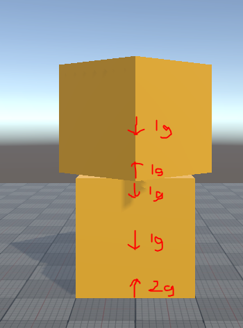

# Getting Started with Psyshock Physics – Part 6

In the previous part, we learned about motion and forces. In this part, we’ll
start introducing the concept of “physics solvers”, and exploring many of the
practical nuances and tradeoffs that go into a physics engine.

## An Imperfect Science

You may have heard that one of Newton’s Laws states that every action comes with
an equal and opposite reaction. And this is why when a ball strikes a surface,
it bounces. But is it really that simple? [Take a look at this video at the
timestamp provided (1:19)](https://youtu.be/uxlIdMoAwbY?t=79).

What is going on here?

When the bat first makes contact with the ball, at the atomic level, the atoms
of the bat and the atoms of the contacting part of the ball get too close to
each other, causing an electrical repelling force. Those atoms in the ball then
start moving in a different direction than the rest of the ball, getting close
to other atoms in the ball, and causing those to start to want to move in the
opposite direction too. This happens pretty quick, and you see it as a sudden
“pop out” on the other side of the ball. Meanwhile, the sides of the ball
(facing the camera and away from the camera) weren’t in the way, so the atoms
don’t immediately move with the bat and instead start to deform around the bat.
Eventually, some of them start to go into direct contact with the bat too, and
some of them get pulled back by the chemical bonds which are stressed. All of
these tiny atomic forces act like springs, where the forces get stronger the
more the atoms move away from equilibrium. These forces eventually restore the
original shape of the ball, and the ball moves cohesively in a new direction.

Can we simulate all of that?

Maybe…

In realtime?

…

…

No.

The reality is that we can’t simulate *real* physics in realtime. And so physics
engines are full of approximations. In fact, the *rigid* in rigid body dynamics
is already referring to an approximation, where we assume that all these
atomic-level deforming mechanics happen within a timespan of a single frame or
less.

These approximations all have various performance and accuracy tradeoffs, and
while some solutions are more popular than others, this isn’t an exact science
as to which tradeoffs are best. Every physics engine is going to make different
tradeoffs and use different approximations for different aspects. Consequently,
every physics engine will have a slightly different result. Psyshock’s vision is
to make these tradeoffs available to you à la carte style. But at the time of
writing, the menu selection leaves a lot to be desired. Help would be very much
appreciated on that front.

Also, I (DreamingImLatios) guess now would be a good time to inform you that I’m
no expert on this topic (yet). While I can hold my own when it comes to spatial
queries and collision detection, the same cannot be said about dynamics. I
understand many of the ideas conceptually, but I wouldn’t be able to even
recognize or name the mathematical formulas involved, much less explain them to
someone else. If I tried to build my own physics engine from scratch right now,
I would probably fail. On the plus side, this makes me a good mediator between
the physics engine dev that lives and breathe physics simulations and the casual
developer that knows absolutely nothing about the domain. But on the downside, I
could be accidentally spreading misinformation, so take everything I say with a
little bit of skepticism.

Because of the nature of the content, this part of this Getting Started series
is written a little differently from the other parts. The goal here is to
familiarize you with concepts and terminology of various physics solvers and
their tradeoffs. This background will be important for when we implement our own
physics solver in Psyshock, so hang tight and be patient while we work through
this.

## A Stack of Forces

Let’s start with a single rigid body cube sitting on a static (immovable) floor.

The rigid body is constantly feeling the force of gravity. And so each frame, it
experiences an impulse measured as 1g. This impulse tries to make the cube move
downward, but the floor is in the way, so the cube ends up applying 1g to the
floor. However, the floor is static, and can’t move. So all it does is return
the impulse back in the opposite direction. Thus, the cube experiences a net
impulse of 0g, as the two impulses applied to it cancel out. And with no net
impulse, the cube remains still.

Now let’s add another cube.

This second cube stacks on top of the first cube. Like the first cube, it too
experiences a gravity impulse, and wants to move downwards. Both cubes
experience the same velocity impulse due to gravity, so they are only “just
touching” each other. But the ground is in the way of the bottom cube, so it
pushes, the ground by 1g, and the ground pushes back by 1g. This means that the
bottom cube now has a different velocity as the top cube, and so the top cube
“runs into” the bottom cube and applies an impulse down on the bottom cube. Due
to Newton’s Law, the bottom cube applies an impulse back of 1g. But the impulse
applied to the bottom cube makes the bottom cube try and move into the ground
again, where the ground then sends another impulse back.

The top cube is not directly in contact with the floor, yet it is experiencing
the effect of the floor through the bottom cube. The bottom cube has to
propagate these impulse across. With each new cube added to the stack, impulses
must be propagated through all other cubes. This is an O(n\^2) algorithm, which
isn’t a great sign. Also, the impulse the floor applies isn’t constant, but
varies based on the other impulses involved, which means the propagation has
dependencies.

What happens, when in one frame, the top cube is still falling…?

…and then in the next frame, it continues to fall for the duration of the
physics discrete timestep (`deltaTime`)?

What you are seeing doesn’t happen in real life. The closest thing to this is
deformations like our baseball example above, but we have already established we
aren’t going to try and simulate deformations. Trying to simulate these cubes by
computing real-world propagated impulses will result in our rigid bodies being
“squishy”, as they all push into each other and get into physically impossible
states due to the discrete time between frames.

One solution to this problem is to operate fully in continuous time. That is,
everything uses continuous collision detection, and you simulate up to the first
collision event, process the collision, then update your spatial queries to find
the next collision event in time, and repeat. This approach is actually viable,
but is very rarely explored. I only know of one practical implementation of it,
[shown here](https://www.youtube.com/watch?v=R9-ihvHJdJE).

There are downsides to the approach, some of which may not be obvious in the
video. The first is that it requires a fully incremental spatial query engine.
Every collision event requires a reprocessing of spatial queries for the
affected bodies afterwards to update any new times of impact. Without an
incremental strategy, the cost of this will easily get prohibitive. It isn’t
cache-friendly either, as memory accesses will be largely dictated by the order
of events which are constantly being sorted and resorted. Also, I don’t believe
the approach is suitable for modern multithreading. Consequently, it isn’t the
right strategy when you want large scale. Algorithmically, this is a more
expensive solution that veers towards accuracy. But for a small number of rigid
bodies, it could be a fun approach to try.

## Rules, Not Forces

Because of discrete timesteps, we end up with these non-physical situations that
we want to resolve. But what even is a non-physical situation?

Let’s start with our overlapping bodies. Bodies shouldn’t overlap like that, and
we don’t want that to happen. That’s a rule. Overlapping bodies violates that
rule.

This is the dirty secret of most modern physics solvers. They aren’t about
“simulating reality”. They are about *minimizing the violations* to established
rules, rules such as “don’t overlap”, “stay connected at these points”, “stay
upright”, ect. Many of these rules may be based on real life, but some of them
may be totally fictional concepts that exist for game design reasons.

These “rules” are more commonly referred to as **constraints**. Not only does a
physics solver try to maintain these constraints, it does so while also trying
to minimize the changes it applies. But how?

Let’s say that we wanted to resolve two overlapping bodies. One solution to this
problem is to simply move them apart. However, doing that naïvely won’t result
in the velocities updating, and the bodies will be overlapping again the next
frame. This isn’t what we want, so we need to separate them in a way that also
updates the velocity in a physical way. There’s only one type of solver I know
that can do that, and that is Extended Position Based Dynamics, or **XPBD**.

XPBD has a lot going for it. It is very simple in its derivation and
implementation compared to other techniques, and it has some interesting
properties. One of the inventors, Matthias Müller, will often bring up how the
technique is “unconditionally stable” in his [Ten Minute Physics
series](https://matthias-research.github.io/pages/tenMinutePhysics/index.html).
He has good reason to do so, as this means that no hacks are required to prevent
the solver from making objects oscillate out of control (until something breaks
and the rigid bodies get sent flying off into space). Another less-known fact of
XPBD is that it is fundamentally **stateless** in the same way Unity Physics is.
This makes it great for networked games.

However, XPBD also faces a few challenges. For one, the authors point out the
caveat of requiring 64-bit floating point numbers. This by itself shouldn’t be
that big of a deal in practice, but it comes up as an issue specifically within
Unity’s ECS and the restrictive 16 kB chunks. However, particle implementations
of XPBD are often found using 32-bit floating point, so I’m not sure how strong
of a requirement 64-bit floating point actually is. Another issue of XPBD is
that while it will never oscillate out of control, it can still oscillate,
especially in stacks of objects where a rigid body might correct itself back and
forth between two adjacent overlapping bodies. There may be some techniques to
improve **convergence** (how quickly the algorithm is able to minimize rule
violations across all rigid bodies) in this regard, but it would require some
experimentation.

The biggest issue of XPBD is that its debut paper used incremental contacts.
Incremental contacts have a lot of problems. Other solvers including Unity
Physics may also suffer from incremental contact issues in some situations, so I
will discuss the caveat in further detail later.

Speaking of Unity Physics, let’s discuss the technique that it and many other
physics engines use.

## All Aboard the Impulse Train

Suppose we have two rigid bodies that are about to collide into each other.
We’ve already applied forces and updated their velocities, but we haven’t
integrated velocities into position and rotation yet. Suppose we can tell just
by their transforms, velocities, and the timestep duration that they are going
to be overlapping each other after integrating if we don’t do anything about it.
How do we stop that from happening?

What if we applied a “bounce” impulse to both rigid bodies so that they instead
start moving away from each other at whatever velocities they are supposed to
(perhaps using the principles of momentum)? Problem solved, right? In a way,
this impulse emulates the collision forces that would cause the rigid bodies to
slightly compress, then re-expand and push off each other. The important detail
is that we aren’t analyzing those forces. We are only looking at the positions
and velocities, and then identifying impulses that can “fix” them.

To further illustrate this point, let’s instead examine a cube hanging from the
ceiling. In this case, there’s a *constraint* that specifies the cube should
remain attached to the ceiling.

The impulse of gravity during the frame induces a downward velocity on the cube.
Consequently, the constraint detects that the cube is now moving away from the
ceiling, and that there will be a gap if something isn’t done about it.

First, the constraint calculates how much of a gap there is going to be, by
speculating based on the velocity where the cube will end up if left untouched.

Next, the constraint uses `position = velocity * time` to calculate a velocity
that would close the gap within a single timestep. With that velocity, it can
then compute an impulse that will induce that velocity (from rest). It applies
that impulse, and as it turns out, that impulse will fully counteract gravity
and the cube will remain in place hanging from the ceiling.

Again, the important detail here is that the constraint found an impulse based
on the position and velocity of the body. It had no idea what was causing the
cube to have a downward velocity. For all it cared, the downward velocity could
have been due to some magic spell, or maybe a vacuum cleaner. The constraint
impulse was simply made up to enforce the rule, and yet it emulated the force of
adhesion that constituted the “sticking to the ceiling” effect.

Now what happens if there’s a second cube hanging off the first cube, and the
two cubes also have a constraint holding them together? In that case, we solve
the constraints one-by-one, applying the impulse and updating the velocity each
time. The visual shows the estimated positions prior to each impulse, as well
one at the end.

The first constraint identifies the top cube is moving away from the ceiling, so
it applies an impulse to make it stay. The second constraint then notices that
the top cube has zero velocity, while the bottom cube is moving downward. Since
both cubes are rigid bodies, it applies an impulse that pulls them together
equally. At the end of evaluation of both these constraints, there is still a
predicted gap, but the gap is only half the size as what it was originally going
to be. The gap exists because the second constraint undid some of the effort of
the first constraint. There’s a simple solution to this. Just run the constraint
evaluations again…

And again…

And again.

Each time, the gap will close by half. After 8 iterations, the gap will be 256
times smaller than at the start. The constraints keep applying impulses with the
hope that eventually the impulses become very small as all the rules are
satisfied.

If you are suspecting that the number of iterations here corresponds to the
number of “solver iterations” in Unity Physics, you’d be right! This algorithm
is known as **Sequential Impulses**, and is what Unity Physics uses, as well as
many other physics engines.

The example constraint impulse calculation I provided above was not particularly
good, as it took a few iterations before it started converging on a solution.
There are different ways to calculate constraint impulses, and these differences
often make physics engines behave slightly different from each other.

Unity Physics will spread out collision-induced impulses over several
iterations, rather than apply the full impulse immediately. For non-collision
constraints, such as joints, Unity Physics uses a mass-independent stiff spring
model which to my knowledge was first pioneered by BEPU physics and is a
relatively new technique. This spring-based approach was coined as a “soft”
solver by Erin Catto, the author of Box2D. It converges very fast, and has an
appealing feeling that early DOTS enthusiasts quickly noticed when Unity Physics
was first made available.

## Hitting Edge Cases

While joint constraints were really impressive when Unity Physics first
released, its ability to stack boxes was not so impressive. We’ll get to that,
but first, we should probably discuss an interesting aspect about collisions,
overlap detection, and overlap prevention.

The type of constraint that prevents rigid bodies from overlapping is known as a
**contact constraint**. Such a constraint is also responsible for handling
friction impulses, for when a rigid body slides against another rigid body. For
a contact constraint to work, it needs to know whether or not a rigid body
*will* have overlap *after the timestep*. But for that to happen, the collision
detection phase needs to report potential collisions. This can be done either
with `ColliderCast` collision detection, or using **speculative contacts**.
Unity Physics uses the latter.

**Contacts** are points of interest on one rigid body that are near another
collider. These can be vertices, points on a face near the other collider’s
vertex, or nearest edge-to-edge point. On the other collider, an infinite plane
is constructed known as the **contact plane**. This image shows lines from the
contact points to the contact plane. The lines are always parallel to the
contact plane’s normal vector, often referred to as the **contact normal**. All
these contact attributes combined form a **contact manifold**.

*Side Note: The wireframes of the boxes don’t fully line up with the visuals,
because collision detection occurs before integration.*

With speculative contacts, the contact constraint evaluates – base on the
position and velocity of the rigid body – whether each contact will cross the
contact plane during the timestep. This usually works well, and is fairly
inexpensive to compute. But it can sometimes be wrong, producing **ghost
collisions**.

To demonstrate this, I set up an experiment. Here I have two spheres. The right
sphere is given an initial velocity towards the top left. The plane that cuts
through it is purely visual and shows the path the sphere should take. The red
dot is the contact point, and the blue line is the contact plane.

If the initial velocity is slow, the contact point won’t cross the contact
plane. The next frame a new contact point and plane is computed, further
extending the distance the contact point must travel.

Ultimately, the sphere’s won’t collide in this scenario.

But if the initial velocity is fast enough, the contact point will cross the
contact plane and this happens…

However, if we rotated the world and the initial velocity by 45 degrees, then
this wouldn’t happen. The reason is that the AABB used for collision detection
is expanded based on the rigid body’s velocity. If the velocity is aligned with
the world axis, the AABB won’t be expanded sideways enough to overlap with the
other sphere. For this reason, the physics engine might also miss secondary
collisions after a first collision, though this is rare.

The problem with speculative contacts most-often happens on boundaries between
floor colliders (including triangles within a mesh collider). The Unity Physics
documentation has a [page about this
issue](https://docs.unity3d.com/Packages/com.unity.physics@1.3/manual/ghost-collision.html).
Havok Physics has a built-in solution named **contact welding** which addresses
this issue.

But there’s another issue with contacts. To start with, let’s drop a cube onto a
box floor.

Now let’s do this with a plane as a floor.

What happened here?

With the plane, we have multiple triangles that the cube collides with. Each
triangle gets its own contact constraint. Consequently, from the perspective of
each constraint, it would appear as if the cube is bouncing off the edge of a
cliff. Interestingly, if I increased the iteration count of the solver,
eventually the plane floor behaved the same as the box floor. This means that
the box floor (where all contacts were handled in a single constraint) converged
much faster than multiple triangle constraints.

This is the problem with incremental contacts that plagues XPBD in all
scenarios. Every contact gets its own individual constraint, and because
constraints are solved one-by-one, rotations get introduced that shouldn’t be
present. As you might imagine, rotations like this can make it a lot harder to
stack boxes.

*Side note: This test was actually done in a personal physics engine. For
whatever reason, the box floor in Unity Physics was producing plane-like
behavior for me, where the falling cube would roll a little unless I increased
the iteration count. I have no idea why this occurred.*

## A Stack of Solutions

Remember how we introduced the concept of sequential impulses with hanging
cubes? Now imagine that in that scenario, our bottom cube was 10x heavier than
the top cube. In this new case, the constraint that holds the cubes together
needs to decide how to distribute the motion to pull them together. And
naturally, it would make most sense if the light cube got pulled more than the
heavy cube (that’s how inertia works). But doing this introduces a problem,
which is that in each iteration, we are undoing nearly all the top constraint’s
work. The bottom constraint keeps pulling the top cube nearly all the way down,
and the simulation will take way too many iterations to converge.

If you flip this problem upside down, where instead of these cubes hanging, they
are stacking, you’d run into a similar problem. The heavy cube keeps trying to
squish the light cube down due to gravity, and the floor is only adding enough
impulse to push the light cube back up each iteration. Even with slightly more
intelligent constraint impulse calculations, this still is a very common problem
with physics engines.

Most physics engines use **warm starting** to address this. In warm starting,
each constraint is remembered over multiple frames while it is in effect. If two
bodies are in contact in adjacent frames, the contact constraint is remembered
and looked up in the second of those frames. While the contact points and plane
may be recomputed, the constraint persists an accumulated impulse. Every time
the constraint applies an impulse in a solver iteration, that same impulse is
also added to the accumulated impulse for that constraint. Then, at the start of
the physics constraint solving within each frame, all constraints apply the
accumulated impulse to the rigid bodies they impact.

The result of this is that multiple frames-worth of constraint iterations of
impulses are all applied. This allows badly broken constraints to fix themselves
over multiple frames when there aren’t enough iterations in a single frame.
There are some artifacts from this, as it can cause unexpected impulses to apply
if something heavy suddenly disappears. But overall, this technique works
really, really well. So well in fact, that nearly all sequential impulse physics
engines use it.

But therein lies a problem. The accumulated impulse of each constraint? That’s
state! Warm starting is a stateful technique. And if you wanted to synchronize
physics over the network, you’d either have to synchronize this state or deal
with different results from the physics engine on client and server. A lot of
people think that main reason a physics engine is stateful is to support
sleeping rigid bodies. But the truth is that warm starting is the bigger factor
at play.

With that said, even without warm starting, it should still be possible to get
stable small stacks of equal mass with enough iterations. Yet when **contact
solver stabilization** is disabled in Unity Physics, even this scenario fails as
stacked rigid bodies experience a slow “drift” until the stacks fall apart. I
don’t know what causes this, but it has been around since the beginning of Unity
Physics.

But speaking of contact solver stabilization, this is the magic that Unity
eventually introduced to solve their stacking problems. And for simple use
cases, it works fairly well. It does two separate things. First, any tiny linear
velocity vector perpendicular to the gravity vector, as well as any tiny angular
velocity, will get snuffed out. This eliminates the drifting issues. Then, for
rigid bodies that are being pushed around by other rigid bodies, the inertia of
such rigid bodies is artificially increased after the first solver iteration.

There’s another stabilization technique at play, called **Baumgarte
Stabilization**. It modifies how contact impulses are computed to incorporate a
bias factor between 0 and 1. It is designed to help push bodies away from each
other. I believe Unity Physics uses this with the factor all the way at 1, but I
could also be misunderstanding the code. Most physics engines use a much lower
bias factor, because its effect gets rolled into warm starting. Some physics
engines will only apply the bias factor in the first few iterations, and leave
it out in later iterations so that any excess energy it adds can be removed
after the bodies get pushed apart.

There are also physics engines that try to fix any remaining positional errors
after solving constraints and (sometimes) after integration by evaluating
constraints again, but not applying impulses to the real rigid body velocities.
Unity Physics simply adds extra impulse to the “bounce” if it detects rigid
bodies already overlapping during collision detection.

Lastly, some physics engines don’t use speculative contacts. I’m less familiar
with the internals of these types of engines, but I would guess they might
perform an initial velocity integration step, perform spatial queries to find
overlaps, solve for the overlap, and then perform another integration step on
just the change in velocity from the new impulses. While this prevents ghost
collisions, depending on the implementation, this may introduce tunneling
through walls instead.

All in all, there is a lot of variability just within the domain of sequential
impulses. But while it is one of the more popular techniques to date, modern
physics engines are starting to explore further strategies.

## Beyond Impulses

Impulses are very intuitive to work with. They tie back to something physical,
which is often valuable to game developers. Some examples might be clamping an
impulse to limit the output of a motor, or breaking a joint when the impulse
(stress) exceeds a threshold. Sometimes their use is as simple as helping decide
which impact audio clip to play. But what if we ignored all that, and instead
focused on just the impact that impulses have?

If you think back to our earlier examples, you may have noticed we were trying
to compute an impulse that achieved a desirable velocity. Really, our constraint
solver is fudging velocities. In essence, each velocity component (6 DOF) of
each rigid body is an unknown variable. And each constraint formulates equations
to solve. What we get is a massive system of equations. A system of equations
can be reformulated into a large matrix *(I’m oversimplifying a little, as some
constraints are inequalities)*. Thus, all constraints can be solved by solving
this matrix.

Unfortunately, solving such a large matrix is really slow, as matrix solving has
O(n\^3) complexity. However, there are iterative approximation algorithms. One
of them is called `Projected Gauss-Seidel` or `PGS`. It works by starting with
an original guess (such as the current velocities), and then solving each row (a
constraint equation) of the matrix. It then uses the updated velocities to solve
the next row, and so on. After solving each row of the matrix, it repeats again,
and again, and again, for some max number of iterations.

If this row-by-row solver reusing previously updated velocities sounds really
familiar to sequential impulses, that’s because it is. In fact, sequential
impulses is implicitly doing this PGS solver algorithm in a roundabout way.
Often, sequential impulse engines will specify that they use a PGS solver.

But with the constraints in a standard matrix form, the door is opened to other
matrix solvers. A method sometimes used for GPU implementations is the **Jacobi
Method**, which unlike PGS that uses up-to-date velocities for each row, instead
uses the initial guess values for all rows and combines the result. This
technique allows for a lot more computations to be performed in parallel to each
other (great for GPUs), but requires many more iterations to converge.

Sometimes, using full matrix solvers for a subset of the matrix can offer much
better stability for tightly-coupled rigid bodies. If the number of bodies in
the subset is low enough, the higher algorithmic complexity does not grow to
high costs. This technique is referred to as using **block solvers** or **direct
solvers**. Unity announced plans to add such solvers to Unity Physics in the
future.

Interestingly, constraints in sequential impulse solvers already act like block
solvers over very small subsets of the matrices. For example, a contact
constraint solves all contacts in a manifold in one go. Similarly, a position
lock constraint may solve for the x, y, and z axes all at once.

## Substepping Into the Future

If you weren’t aware, one of the best ways to get more realistic results out of
a physics simulation is to increase the frequency it runs at. Smaller timesteps
means more accuracy, up until you get too small for 32-bit floating point.

What may surprise you is that if you had to choose between a single physics
updates with 4 solver iterations, or splitting the timestep into 4 physics
updates with only 1 solver iteration each time, the latter would be far more
stable and accurate. This approach is referred to as **substepping**. I even
have a [small tech
demonstration](https://github.com/Dreaming381/LatiosFrameworkMiniDemos/tree/main/FeatureSamples/Assets/Psyshock/CollisionSimple)
of its impact. Of course, performing a full physics update is very expensive.
But what if we could skip some steps for some of the updates?

Turns out, there’s some decent approximations to reproject various constraints,
including contact constraints, which means for some updates, we can skip the
entire collision detection phase. This technique is commonly referred to as
**Temporal Gauss-Seidel** or **TGS**. At the time of writing, Unity Physics has
an experimental implementation of it.

Interestingly, while substepping adds a little bit of complexity to
impulse-based constraints, it actually eliminates some complexity in XPBD. Thus
pretty much every XPBD implementation starts out exclusively using substepping.

## (Rigidly) Bendy Bodies

Rock! Paper! Scissors! SHOOT!

…

…

…

…

…

I picked scissors. What did you pick? Also, have you ever thought of scissors as
being a pair of rigid bodies with a joint constraint?

Well, now you probably have since I mentioned it. And up to now, all of our
physics engines discussed so far would indeed represent it that way. But this
isn’t necessarily optimal. To move the scissors with a force only applied to one
half, the impulses need to be propagated via the joint constraint to the other
half. This opens up the opportunity for some other constraint such as contacts
to undo that work, and thus several iterations will be needed to simulate this
object correctly.

Instead, let’s think of the scissors as a single body, with the standard 6DOF.
Additionally, the scissors can open and close. In a way, this is another degree
of freedom, so this pair of scissors is a 7DOF object. The rate of opening and
closing is a new velocity parameter to go along the other 6. We can simulate it
no differently than the other velocity parameters of rigid body. It is just that
now our body has additional internal **articulations** we need to account for.

The data structure for representing an articulated body is much more complex,
and impulses need to correctly propagate to the various articulated axes. That
can sometimes be overwhelming algorithmic complexity-wise for a large amount of
articulations. In addition, some properties of the body such as center of mass
and the inertia tensor need to now be recomputed on-the-fly, since the
articulations can change them. Yet with all these complexities in mind,
articulated bodies can be a much more accurately simulated. A solver that works
with these bodies is known as a **Featherstone Solver**.

## Links

We’ve covered many different types of solvers and touched on some of their
tradeoffs. If you managed to follow along, and would like to learn more from
people who know more than me, here are some awesome links to help start your
journey.

<https://gdcvault.com/play/1020603/Physics-for-Game-Programmers-Understanding>

<https://box2d.org/posts/2024/02/solver2d/>

<https://gdcvault.com/play/1020604/Physics-for-Game-Programmers-Exploring>

<https://arxiv.org/pdf/2311.09327>

That last link is a paper that features an earlier version of Unity Physics as
part of its experiments.

## Up Next

That was a lot of information. Hopefully, this brought to light the inner
workings of modern physics engines, and brought a little bit of intuition behind
the various domain buzzwords.

In the next part, we’ll build our own very basic rigid body simulation using the
`UnitySim` API. That process will involve concepts from every part of this
Getting Started guide so far. Make sure you come prepared!

Continue to [Part 7](Getting%20Started%20-%20Part%207.md).
