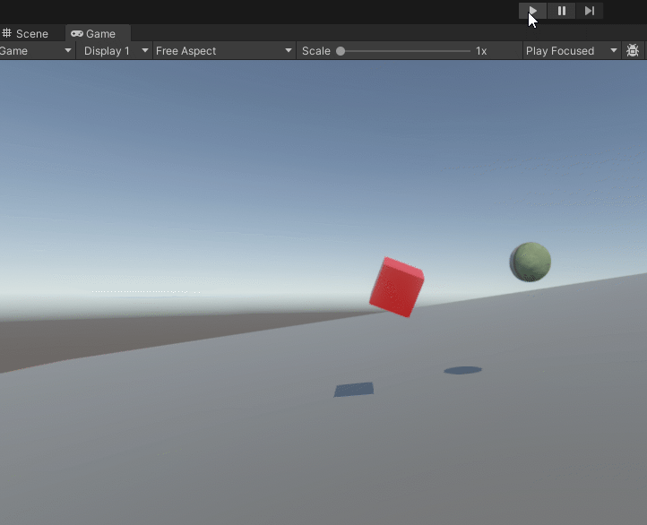

# Getting Started with Psyshock Physics – Part 7

In the previous part, we learned about the anatomy of physics solvers. We
discussed the concepts behind constraints and various tradeoffs of constraint
solvers. Prior to that, we have also covered FindPairs, `PairStreams`, and how
to integrate rigid body motion. In this part, we are going to make things
collide, and allow simple rigid bodies to rest on static objects.

This part brings a lot of the previous concepts together. If you haven’t read
the previous parts recently, it may be good to revisit them first so that the
concepts are fresh in your mind. This part will also assume you have practiced
using `CollisionLayers`, FindPairs, and `PairStreams`.

## Defining Physics Objects

For the sake of convenience, let’s use a very simple definition for our physics
objects. Let’s define a `RigidBody` component like this:

```csharp
struct RigidBody : IComponentData
{
    public UnitySim.Velocity        velocity;
    public UnitySim.MotionExpansion motionExpansion;
    public RigidTransform           inertialPoseWorldTransform;
    public UnitySim.Mass            mass;
    public float                    coefficientOfFriction;
    public float                    coefficientOfRestitution;
    public float                    linearDamping;
    public float                    angularDamping;
} 
```

`velocity`, `inertialPoseWorldTransform`, `mass`, `linearDamping`, and
`angularDamping` should all be familiar values, as they were all covered in Part
5\. `motionExpansion`, `coefficientOfFriction`, and `coefficientOfRestitution`
are new values to explore.

*Q: Is it good practice to put all these values inside a* `RigidBody`
*component?*

*A: For this guide, it is done for simplicity. However, it is more common to
only store a subset of these values in the* `RigidBody` *component and store the
rest in temporary* `NativeArray`*s for a single frame, as doing so allows more
entities to fit within an ECS chunk.*

For this very simple physics engine, rigid bodies are defined as having this
`RigidBody` component, a `Collider`, and a `WorldTransform`. Meanwhile, static
environment is defined as having a `Collider` and `WorldTransform`, and no
`RigidBody`.

To author the rigid body, use this:

```csharp
public class RigidBodyAuthoring : MonoBehaviour
{
    public float mass = 1f;

    [Range(0, 1)] public float coefficientOfFriction    = 0.5f;
    [Range(0, 1)] public float coefficientOfRestitution = 0.5f;
    [Range(0, 1)] public float linearDamping            = 0.05f;
    [Range(0, 1)] public float angularDamping           = 0.05f;
}

public class RigidBodyAuthoringBaker : Baker<RigidBodyAuthoring>
{
    public override void Bake(RigidBodyAuthoring authoring)
    {
        var entity = GetEntity(TransformUsageFlags.Dynamic);
        AddComponent(entity, new RigidBody
        {
            mass = new UnitySim.Mass
            {
                inverseMass = math.rcp(authoring.mass)
            },
            coefficientOfFriction    = authoring.coefficientOfFriction,
            coefficientOfRestitution = authoring.coefficientOfRestitution,
            linearDamping            = authoring.linearDamping,
            angularDamping           = authoring.angularDamping
        });
    }
}
```

*Q: Can I bake* `UnityEngine.RigidBody` *instead?*

*A: Yes, though if you decide to do this, I recommend going to the Physics tab
of Project Settings, and setting the GameObject SDK to None. Otherwise, play
mode when subscenes are open will result in bad behavior.*

Take some time to set up a test scene with some static colliders and some rigid
bodies in a subscene.

The entire physics engine is going to be implemented within a single ECS system
for simplicity. The guide will not show full lines of code, but instead explain
the steps. The full code will be at the end. You are strongly encouraged to work
through writing the code yourself, and then comparing your implementation to the
reference at the end. If it feels like some aspect is being glossed over
quickly, that probably means it was covered in a previous Getting Started part.

## Building CollisionLayers

Since the goal here is to do rigid body collisions, logically, collision
detection is required. For simplicity, this physics engine will use two separate
`CollisionLayers`, one for static colliders, and one for rigid bodies.
`CollisionWorld` is also viable for rigid body collision detection.

Create a system that will be responsible for the entire physics engine. Then,
create the static collider `CollisionLayer` using an `EntityQuery`.

The rigid body `CollisionLayer` will be created using `NativeArrays` with
override AABBs. Create an `EntityQuery` for rigid bodies, and use
`CalculateEntityCountWithoutFiltering()` to compute the size to allocate the
arrays.

Next, create an `IJobEntity` job whose `Execute()` method requires `Entity`,
`EntityIndexInQuery`, `RigidBody` as read-write, `Collider` as read-only, and
`WorldTransform` as read-only. Pass in the two `NativeArrays` with
`[NativeDisableParallelForRestriction]` and also pass in a `float deltaTime`.

The first step of the job is to apply gravity: `rigidBody.velocity.linear.y +=
\-9.81f * deltaTime;`

Next, we need to compute the AABB for the rigid body. This is tricky, because we
haven’t moved the rigid body yet, so we need to account for where the rigid body
might move to and collide with or else FindPairs may not detect the potential
collisions. To account for this, we need to create a `MotionExpansion`. First,
create the normal `Aabb` from the `Collider` and `WorldTransform`. Then, compute
the angular expansion factor via `UnitySim.AngularExpansionFactorFrom()`. This
factor dictates how much the motion may need to expand by as the rigid body
rotates. A baseball would have a very small angular expansion, as the
world-space AABB does not change much as it rotates. However, a baseball bat
would have a large angular expansion, because the world-space AABB can change
quite drastically as the bat rotates.

The `MotionExpansion` can be created by its constructor, passing in the various
parameters. The last optional argument is a fudge-factor. The default is pretty
good, but it can be increased if tunneling occurs. How that can happen will be
discussed later.

The `MotionExpansion` is used in two places. The first is calculating the
expanded `Aabb`, which can be done by calling its member method `ExpandAabb()`.
The second use case will be inside FindPairs, so store the instance inside
`RigidBody`.

We now have everything required to populate the two `NativeArray`s, so go ahead
and populate them.

Lastly, while the rigid body’s `inverseMass` is up-to-date, the `inverseInertia`
and `inertialPoseWorldTransform` may be out of date. Go ahead and recalculate
them to wrap up this job. And then head back to `OnUpdate()` and build the new
`CollisionLayer` with the results of this job.

## Finding Collisions

Create two FindPair processors, one that will be designed for *rigid body &
static collider* pairs, and another for pairs of rigid bodies. We’ll start with
the former.

Like most physics engines, UnitySim relies on speculative contacts, which means
contacts may still be created even if the colliders are not colliding. That
means our `maxDistance` for `DistanceBetween()` should be larger than `0f`.
`MotionExpansion` can provide this, so add a read-only
`ComponentLookup<RigidBody>` to the processor and fetch its value for the rigid
body entity. The method to call is actually a static method on
`MotionExpansion`, in which one or two `MotionExpansion` instances can be passed
in. Since there’s only one rigid body in this pair, use the single instance
variant.

Calling `DistanceBetween()` here would be incorrect. One of the colliders could
be a `TriMeshCollider` in which several triangles could be in contact at once.
Therefore, the correct approach is to call `DistanceBetweenAll()`. The last
argument is an `IDistanceBetweenAllProcessor` which will collect the results.
Add a `DistanceBetweenAllCache` as a private field to the processor, and pass
that in here. This will store all results in a `Temp` list that is recycled for
each call on the thread.

The cache can be iterated on in a `foreach` statement, and each element is a
`ColliderDistanceResult`. Create that `foreach` block now.

The next step is to calculate the contacts, and this can be done using
`UnitySim.ContactsBetween()`. The first four arguments come directly from the
`FindPairsResult`, while the fifth is the specific `ColliderDistanceResult` in
our loop. Assign the return value to a local variable.

A little bit of background here, the `DistanceBetween()` algorithm performs
topological analysis to identify closest features (a feature being a point,
edge, of face of a collider) which are then used to extract the distance and
hitpoints. These closest features are also stored as `internal` fields inside
`ColliderDistanceResult`. Contact generation uses the closest features to
identify contact points. The `DistanceBetween()` algorithm is actually doing
more of the heavy-lifting in this whole process.

`ContactsBetween()` returns a `ContactsBetweenResult()`. This type may seem
cryptic at first, but it is crucial to understand the values contained with this
type for debugging.

`ContactsBetweenResult` represents a full contact manifold. Because this is
based on Unity Physics, this manifold can store up to 32 contact point pairs.
Each pair is defined by a `ContactOnB` struct, which can either be obtained by
the indexer (`[]` operator), or via `AsSpan()`. However, be careful with the
latter, as the `Span` is referencing memory packed into the struct. Each
`ContactOnB` contains the world-space `location` of the contact on the B
collider. `ContactOnB` also contains `distanceToA`, a signed distance from
`location` to the point of contact on the A collider. A negative `distanceToA`
means penetration, while a positive `distanceToA` means separation.
`ContactsBetweenResult` contains a `contactNormal`, which should always point
outwards from the B collider from any `location`.

To get the contact location on the A collider, use this expression:

`location + contactNormal * distanceToA`

As long as the `ColliderDistanceResult` is valid, there will always be one valid
contact point returned. The number of contacts contained is stored in
`contactCount`, though this value can also be obtained via `AsSpan().Length`.

The next step is to create a contact constraint. Unity Physics (and consequently
`UnitySim`) refers to physics solver constraints as *Jacobians*. The rationale
behind this name choice is beyond the scope of this guide.

To create such a contact constraint, call `UnitySim.BuildJacobian()`. There are
a lot of parameters to specify. But before we go through that, let’s back up for
a second. We are building a constraint, that we will want to solve with a
constraint solver. The constraint solver will need to revisit this constraint
multiple times, and right now we are in a FindPairs operation. We need a
`PairStream`.

Go ahead and add a `PairStream.ParallelWriter` to the FindPairs processor, and
feel free to create an instance in `OnUpdate()` as well.

We also need a type to store our contact constraint. Define a new struct for
this, then make it the type used when calling the `PairStream`’s
`AddPairAndGetRef<T>()` method before the call to `UnitySim.BuildJacobian()`.
Specify RW as `false` for the static collider.

The first parameter in `BuildJacobian()` requires a
`Span<UnitySim.ContactJacobianContactParameters>`. You don’t need to understand
what is inside this type. All you really need to know is that there is an
element per contact pair. Add a `StreamSpan` field of this type to your contact
constraint struct, and allocate the `StreamSpan` using
`NativeArrayOptions.UninitializedMemory`. Then, pass its `AsSpan()` to
`BuildJacobian()`. `BuildJacobian()` is responsible for initializing the
contents of these elements.

The next parameter is a `UnitySim.ContactJacobianBodyParameters`. Again, you
don’t need to understand what is inside this type. Simply make a field for it in
your contact constraint struct, and assign that field as the `out` receiver.

The following 6 parameters are rigid body parameters for up to two rigid bodies.
But in this context, we only have one rigid body. For the static collider, pass
in `RigidTransform.identity` for the `inertialPoseWorldTransform`, and `default`
for the `Velocity` and `Mass`. After that, the following two parameters come
from `ContactsBetweenResult`.

The next two parameters are interesting. Remember the `coefficientOfRestitution`
and `coefficientOfFriction` parameters we added to the `RigidBody` and baked
values for? It is time to explain what these do.

The **coefficient of restitution** is a value between 0 and 1 which represents
how elastic or bouncy the collision is. Higher values mean more bounciness. The
**coefficient of friction** is also a value between 0 and 1 which represents how
much the two colliders resist sliding against each other, proportional to how
much they are pushing up against each other. As much as I would love to ramble
about rotor rides, there are enough resources on the internet about these
coefficients.

The next parameter is the **max depenetration velocity**, and this one is
tricky. If for some reason at the beginning of the simulation step, the two
colliders are already overlapping, we want to apply an impulse to help separate
them. The max depenetration velocity specifies how much the constraint solver
can change velocity by in order to fix this.
`UnitySim.kMaxDepenetrationVelocityDynamicStatic` and
`UnitySim.kMaxDepentrationVelocityDynamicDynamic` represent the values Unity
Physics has hard-coded at the time of writing. The former is `float.MaxValue`,
while the latter is `3.0f`. For now, pass in the former.

The next parameter is the gravity magnitude that opposes the contact normal.
Unity Physics uses the magnitude of gravity directly for this as a crude
approximation. Therefore, feel free to pass in `9.81f` for this parameter.

The last three parameters relate to our timestep. For this physics engine, we’ll
be implementing a PGS-style solver rather than a TGS one, so there is no
substepping. Therefore, the `substep` and `inverseSubstep` parameters are really
just `deltaTime` and `1f / deltaTime`, with a `numSubsteps = 1`. Add a field for
`deltaTime` in the processor.

That concludes the `BuildJacobian()` call, but there is still one last step. In
your contact constraint struct, add one last field for `StreamSpan<float>`.
Allocate it for the number of contacts, using `NativeArrayOptions.ClearMemory`.
This stores cumulative impulses applied by the solver for each contact point
pair.

Anyways, that wraps up the processor for rigid bodies vs static colliders. Go
ahead and set up and schedule the FindPairs operation in `OnUpdate()`. Because
the only thing the processor writes to is the `PairStream`, FindPairs can be
scheduled using `ScheduleParallelUnsafe()`.

Collisions between two rigid bodies will be an exercise for the reader. But here
are a couple tips. First, use the same `PairStream.ParallelWriter`, just make
sure the second FindPairs operation depends on the `JobHandle` from the first.
And second, pick some selection or averaging function to combine the
coefficients of friction and restitution between the two rigid bodies. Unity
Physics has a whole material system that lets you pick the combining algorithm.
The default it uses is the geometric mean, which is computed by multiplying each
body’s coefficient together, and then taking the square root of the result.

## Solving Constraints

All the contact constraints now reside in a `PairStream`. To solve them, start
by creating an `IForEachPairProcessor`. Go ahead and read out the contact
constraint from the pair.

Constraint solving requires calling a single method, `UnitySim.SolveJacobian()`.
The very first argument is a `Velocity`, which is passed by `ref`. This means
`PhysicsComponentLookup<RigidBody>` is required. For a static collider, make a
local `default` dummy `Velocity`.

But wait, how do we know whether something is a static collider? Easy. In the
`Pair`, its RW status will be false if it is static, because we set it to false
when we created the pairs. However, we could have also set some other metadata
on the `Pair` to signify this.

`Mass` is the same as when building the contact constraints. The third and sixth
parameters will be covered more formally in a future part of this guide. For
now, populate them with `UnitySim.MotionStabilizer.kDefault`. The next three
parameters all come from the contact constraint in the `PairStream`. The bool
parameter that follows is related to motion stabilization, so just specify
`false` for now. The final input is simply `1 / solverIterationCount`. It is up
to you whether you want to hard-code the iteration count or pass it into the
processor.

The final `out` parameter and the `return` value are both outputs solely for the
purpose of gameplay feedback. The `ContactJacobianImpulses` `out` parameter
provides various impulse values computed. These might be used to analyze how
hard the bodies collided or how much they rubbed against each other will
sliding. And that value might be used to play an audio cue or something. The
`return` `bool` value determines whether there was actual contact between the
bodies detected. Because contacts are speculative, it is possible the bodies are
moving too slowly or away from each other, so there isn’t any actual contact.

Anyways, that’s really it inside this processor. The `SolveJacobian()` method is
doing most of the work of computing the impulses for contacts and friction, and
then updating the velocities accordingly.

Back in `OnUpdate()`, the ForEachPair operation needs to be scheduled multiple
times, for as many solver iterations as you choose. Less than 4 iterations is
typically problematic, but feel free to experiment. Use `ScheduleParallel()`
each time.

## Integrating Everything

There’s one final step to make this basic physics engine ready to try, and
that’s integration. This is simply an `IJobEntity` which integrates the
`inertialPoseWorldTransform` of each body using `UnitySim.Integrate()`, and then
updates the entity’s transform using
`UnitySim.ApplyInertialPoseWorldTransformDeltaToWorldTransform()`.

One interesting tidbit to call out here is that this step can still cause rigid
bodies to “tunnel through” other rigid bodies and static colliders. This is in
spite of using speculative contacts which are designed to prevent this. The way
this tunneling happens is if the rigid body accumulates a very large velocity
during constraint solving compared to what it started with, such that after
integration, it passed by colliders that it never even detected in FindPairs
even in spite of motion expansion. If it isn’t obvious, these are quite extreme
conditions, and don’t ever really happen in normal games. But it is something to
be aware of.

To review, our physics engine goes through the following steps:

1.  Apply gravity and update properties
2.  Find potential collisions, create contact manifolds, and build contact
    constraints
3.  Solve constraints and apply sequential impulses to the rigid body velocities
4.  Integrate the rigid bodies

Of course, within these steps are details that you are welcome to augment to fit
your needs. A lot of those details laid out here were chosen for simplicity, but
you can easily improve upon them with a little creative thinking. For example,
the example physics engine makes a Pair for each contact constraint, but what if
you made a `StreamSpan` of contact constraints for each `FindPairsResult` result
instead?

Anyways, now that the system is complete, go ahead and try it out with your test
scenes!



## Final System Code

```csharp
using Latios;
using Latios.Psyshock;
using Latios.Transforms;
using Unity.Burst;
using Unity.Collections;
using Unity.Entities;
using Unity.Jobs;
using Unity.Mathematics;

using static Unity.Entities.SystemAPI;

namespace Dragons.Systems
{
    [BurstCompile]
    public partial struct RigidBodyPhysicsSystem : ISystem
    {
        LatiosWorldUnmanaged latiosWorld;

        EntityQuery m_rigidBodyQuery;
        EntityQuery m_staticCollidersQuery;

        BuildCollisionLayerTypeHandles m_typeHandles;

        [BurstCompile]
        public void OnCreate(ref SystemState state)
        {
            latiosWorld = state.GetLatiosWorldUnmanaged();

            m_rigidBodyQuery       = state.Fluent().With<RigidBody>(false).PatchQueryForBuildingCollisionLayer().Build();
            m_staticCollidersQuery = state.Fluent().Without<RigidBody>().PatchQueryForBuildingCollisionLayer().Build();

            m_typeHandles = new BuildCollisionLayerTypeHandles(ref state);
        }

        [BurstCompile]
        public void OnUpdate(ref SystemState state)
        {
            var initialJh = state.Dependency;

            // Build static layer
            m_typeHandles.Update(ref state);
            var buildStaticLayerJh =
                Physics.BuildCollisionLayer(m_staticCollidersQuery, m_typeHandles).ScheduleParallel(out var staticLayer, state.WorldUpdateAllocator, initialJh);

            // Gravity, and build rigid body layer
            var rigidBodyCount         = m_rigidBodyQuery.CalculateEntityCountWithoutFiltering();
            var rigidBodyColliderArray = CollectionHelper.CreateNativeArray<ColliderBody>(rigidBodyCount, state.WorldUpdateAllocator, NativeArrayOptions.UninitializedMemory);
            var rigidBodyAabbArray     = CollectionHelper.CreateNativeArray<Aabb>(rigidBodyCount, state.WorldUpdateAllocator, NativeArrayOptions.UninitializedMemory);

            var buildRigidBodyJh = new BuildRigidBodiesJob
            {
                deltaTime     = Time.DeltaTime,
                colliderArray = rigidBodyColliderArray,
                aabbArray     = rigidBodyAabbArray
            }.ScheduleParallel(m_rigidBodyQuery, initialJh);
            buildRigidBodyJh = Physics.BuildCollisionLayer(rigidBodyColliderArray, rigidBodyAabbArray)
                               .ScheduleParallel(out var rigidBodyLayer, state.WorldUpdateAllocator, buildRigidBodyJh);

            // Find collisions, generate contacts, and generate contact constraints
            var pairStream            = new PairStream(rigidBodyLayer, state.WorldUpdateAllocator);
            var findBodyBodyProcessor = new FindBodyVsBodyProcessor
            {
                bodyLookup       = GetComponentLookup<RigidBody>(true),
                pairStream       = pairStream.AsParallelWriter(),
                deltaTime        = Time.DeltaTime,
                inverseDeltaTime = math.rcp(Time.DeltaTime)
            };
            var bodyVsBodyJh = Physics.FindPairs(in rigidBodyLayer, in findBodyBodyProcessor).ScheduleParallelUnsafe(buildRigidBodyJh);

            var findBodyEnvironmentProcessor = new FindBodyVsEnvironmentProcessor
            {
                bodyLookup       = GetComponentLookup<RigidBody>(true),
                pairStream       = pairStream.AsParallelWriter(),
                deltaTime        = Time.DeltaTime,
                inverseDeltaTime = math.rcp(Time.DeltaTime)
            };
            state.Dependency = Physics.FindPairs(in rigidBodyLayer, in staticLayer, in findBodyEnvironmentProcessor)
                .ScheduleParallelUnsafe(JobHandle.CombineDependencies(bodyVsBodyJh, buildStaticLayerJh));

            // Solve constraints
            int numIterations  = 8;
            var solveProcessor = new SolveBodiesProcessor
            {
                rigidBodyLookup        = GetComponentLookup<RigidBody>(false),
                invNumSolverIterations = math.rcp(numIterations)
            };
            for (int i = 0; i < numIterations; i++)
            {
                state.Dependency = Physics.ForEachPair(in pairStream, in solveProcessor).ScheduleParallel(state.Dependency);
            }

            // Integrate and update entities
            new IntegrateRigidBodiesJob { deltaTime = Time.DeltaTime }.ScheduleParallel();
        }

        struct ContactStreamData
        {
            public UnitySim.ContactJacobianBodyParameters                bodyParameters;
            public StreamSpan<UnitySim.ContactJacobianContactParameters> contactParameters;
            public StreamSpan<float>                                     contactImpulses;
        }

        [BurstCompile]
        partial struct BuildRigidBodiesJob : IJobEntity
        {
            public float deltaTime;

            [NativeDisableParallelForRestriction] public NativeArray<ColliderBody> colliderArray;
            [NativeDisableParallelForRestriction] public NativeArray<Aabb>         aabbArray;

            public void Execute(Entity entity, [EntityIndexInQuery] int index, ref RigidBody rigidBody, in Collider collider, in WorldTransform transform)
            {
                rigidBody.velocity.linear.y += -9.81f * deltaTime;

                var aabb                  = Physics.AabbFrom(in collider, in transform.worldTransform);
                var angularExpansion      = UnitySim.AngularExpansionFactorFrom(in collider);
                var motionExpansion       = new UnitySim.MotionExpansion(in rigidBody.velocity, deltaTime, angularExpansion);
                aabb                      = motionExpansion.ExpandAabb(aabb);
                rigidBody.motionExpansion = motionExpansion;

                colliderArray[index] = new ColliderBody
                {
                    collider  = collider,
                    transform = transform.worldTransform,
                    entity    = entity
                };
                aabbArray[index] = aabb;

                var localCenterOfMass = UnitySim.LocalCenterOfMassFrom(in collider);
                var localInertia      = UnitySim.LocalInertiaTensorFrom(in collider, transform.stretch);
                UnitySim.ConvertToWorldMassInertia(in transform.worldTransform,
                                                   in localInertia,
                                                   localCenterOfMass,
                                                   rigidBody.mass.inverseMass,
                                                   out rigidBody.mass,
                                                   out rigidBody.inertialPoseWorldTransform);
            }
        }

        struct FindBodyVsEnvironmentProcessor : IFindPairsProcessor
        {
            [ReadOnly] public ComponentLookup<RigidBody> bodyLookup;
            public PairStream.ParallelWriter             pairStream;
            public float                                 deltaTime;
            public float                                 inverseDeltaTime;

            DistanceBetweenAllCache distanceBetweenAllCache;

            public void Execute(in FindPairsResult result)
            {
                ref readonly var rigidBodyA = ref bodyLookup.GetRefRO(result.entityA).ValueRO;

                var maxDistance = UnitySim.MotionExpansion.GetMaxDistance(in rigidBodyA.motionExpansion);
                Physics.DistanceBetweenAll(result.colliderA, result.transformA, result.colliderB, result.transformB, maxDistance, ref distanceBetweenAllCache);
                foreach (var distanceResult in distanceBetweenAllCache)
                {
                    var contacts = UnitySim.ContactsBetween(result.colliderA, result.transformA, result.colliderB, result.transformB, in distanceResult);

                    ref var streamData           = ref pairStream.AddPairAndGetRef<ContactStreamData>(result.pairStreamKey, true, false, out var pair);
                    streamData.contactParameters = pair.Allocate<UnitySim.ContactJacobianContactParameters>(contacts.contactCount, NativeArrayOptions.UninitializedMemory);
                    streamData.contactImpulses   = pair.Allocate<float>(contacts.contactCount, NativeArrayOptions.ClearMemory);

                    UnitySim.BuildJacobian(streamData.contactParameters.AsSpan(),
                                           out streamData.bodyParameters,
                                           rigidBodyA.inertialPoseWorldTransform,
                                           in rigidBodyA.velocity,
                                           in rigidBodyA.mass,
                                           RigidTransform.identity,
                                           default,
                                           default,
                                           contacts.contactNormal,
                                           contacts.AsSpan(),
                                           rigidBodyA.coefficientOfRestitution,
                                           rigidBodyA.coefficientOfFriction,
                                           UnitySim.kMaxDepenetrationVelocityDynamicStatic,
                                           9.81f,
                                           deltaTime,
                                           inverseDeltaTime,
                                           1);
                }
            }
        }

        struct FindBodyVsBodyProcessor : IFindPairsProcessor
        {
            [ReadOnly] public ComponentLookup<RigidBody> bodyLookup;
            public PairStream.ParallelWriter             pairStream;
            public float                                 deltaTime;
            public float                                 inverseDeltaTime;

            DistanceBetweenAllCache distanceBetweenAllCache;

            public void Execute(in FindPairsResult result)
            {
                ref readonly var rigidBodyA = ref bodyLookup.GetRefRO(result.entityA).ValueRO;
                ref readonly var rigidBodyB = ref bodyLookup.GetRefRO(result.entityB).ValueRO;

                var maxDistance = UnitySim.MotionExpansion.GetMaxDistance(in rigidBodyA.motionExpansion, in rigidBodyB.motionExpansion);
                Physics.DistanceBetweenAll(result.colliderA, result.transformA, result.colliderB, result.transformB, maxDistance, ref distanceBetweenAllCache);
                foreach (var distanceResult in distanceBetweenAllCache)
                {
                    var contacts = UnitySim.ContactsBetween(result.colliderA, result.transformA, result.colliderB, result.transformB, in distanceResult);

                    var coefficientOfFriction    = math.sqrt(rigidBodyA.coefficientOfFriction * rigidBodyB.coefficientOfFriction);
                    var coefficientOfRestitution = math.sqrt(rigidBodyA.coefficientOfRestitution * rigidBodyB.coefficientOfRestitution);

                    ref var streamData           = ref pairStream.AddPairAndGetRef<ContactStreamData>(result.pairStreamKey, true, true, out var pair);
                    streamData.contactParameters = pair.Allocate<UnitySim.ContactJacobianContactParameters>(contacts.contactCount, NativeArrayOptions.UninitializedMemory);
                    streamData.contactImpulses   = pair.Allocate<float>(contacts.contactCount, NativeArrayOptions.ClearMemory);

                    UnitySim.BuildJacobian(streamData.contactParameters.AsSpan(),
                                           out streamData.bodyParameters,
                                           rigidBodyA.inertialPoseWorldTransform,
                                           in rigidBodyA.velocity,
                                           in rigidBodyA.mass,
                                           rigidBodyB.inertialPoseWorldTransform,
                                           in rigidBodyB.velocity,
                                           in rigidBodyB.mass,
                                           contacts.contactNormal,
                                           contacts.AsSpan(),
                                           coefficientOfRestitution,
                                           coefficientOfFriction,
                                           UnitySim.kMaxDepenetrationVelocityDynamicDynamic,
                                           9.81f,
                                           deltaTime,
                                           inverseDeltaTime,
                                           1);
                }
            }
        }

        struct SolveBodiesProcessor : IForEachPairProcessor
        {
            public PhysicsComponentLookup<RigidBody> rigidBodyLookup;
            public float                             invNumSolverIterations;

            public void Execute(ref PairStream.Pair pair)
            {
                ref var streamData = ref pair.GetRef<ContactStreamData>();

                ref var rigidBodyA = ref rigidBodyLookup.GetRW(pair.entityA).ValueRW;

                UnitySim.Velocity defaultVelocity = default;
                ref var           velocityB       = ref defaultVelocity;
                UnitySim.Mass     massB           = default;

                if (pair.bIsRW)
                {
                    ref var rigidBodyB = ref rigidBodyLookup.GetRW(pair.entityB).ValueRW;
                    velocityB          = ref rigidBodyB.velocity;
                    massB              = rigidBodyB.mass;
                }

                UnitySim.SolveJacobian(ref rigidBodyA.velocity,
                                       in rigidBodyA.mass,
                                       UnitySim.MotionStabilizer.kDefault,
                                       ref velocityB,
                                       in massB,
                                       UnitySim.MotionStabilizer.kDefault,
                                       streamData.contactParameters.AsSpan(),
                                       streamData.contactImpulses.AsSpan(),
                                       in streamData.bodyParameters,
                                       false,
                                       invNumSolverIterations,
                                       out _);
            }
        }

        [BurstCompile]
        partial struct IntegrateRigidBodiesJob : IJobEntity
        {
            public float deltaTime;

            public void Execute(TransformAspect transform, ref RigidBody rigidBody)
            {
                var previousInertialPose = rigidBody.inertialPoseWorldTransform;
                UnitySim.Integrate(ref rigidBody.inertialPoseWorldTransform, ref rigidBody.velocity, rigidBody.linearDamping, rigidBody.angularDamping, deltaTime);
                transform.worldTransform = UnitySim.ApplyInertialPoseWorldTransformDeltaToWorldTransform(transform.worldTransform,
                                                                                                         in previousInertialPose,
                                                                                                         in rigidBody.inertialPoseWorldTransform);
            }
        }
    }
}
```

## Up Next

There’s still plenty more to explore in the Psyshock API. We haven’t yet covered
motion stabilization nor the many other types of constraints. But until I get
around to expanding this series, feel free to explore them on your own.

Psyshock can be intimidating. No question is too stupid and you are encouraged
to reach out to the community on Discord if you want help or would like to get
more performance out of your use case.
