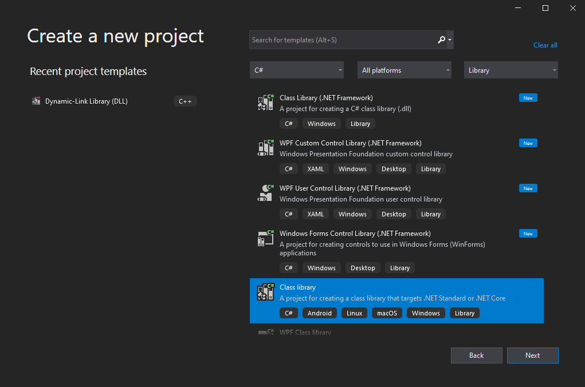
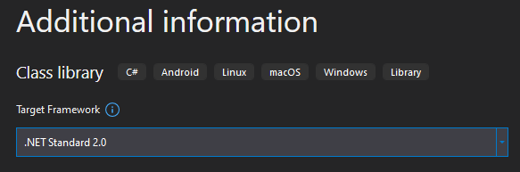
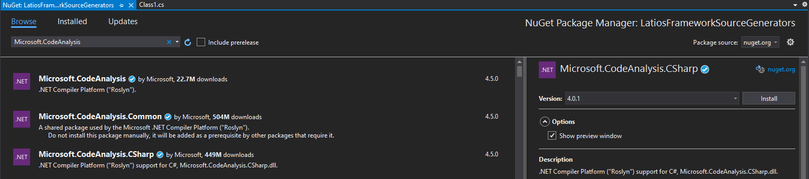

# Tech Adventures: Source Generators Part 1

When it comes to low-level high performance code, I usually feel like I have a
good sense of what I am doing and which direction I want things to go. Sure, I
make little typo mistakes here or there that cause things to not function until
I actually test and fix them. But for the most part, my designs usually end up
working as I intend for them to.

However, for other types of software development, things are often the opposite.
I’m absolutely awful at high-level scripting languages and command line tools.
I’ll encounter many of the esoteric bugs and issues with toolchains or other dev
ops things despite the fact I generally keep OS modifications to an absolute
minimum. DocFx is my most recent problematic encounter. I was very fortunate
that I didn’t have major issues with AclUnity GitHub actions. Back when I
developed games for esoteric platforms, I’d often write my tools in C++ just to
avoid the scripting languages, even though C++ was almost certainly the wrong
choice of language. So yeah. DevOps, not my strong suit. And consequently, I’ve
been really hesitant to explore the world of codegen.

And that makes source generators a great choice for this “Tech Adventures”
article series, where I will be exploring technology I’m less familiar with. My
goal is that you the reader will be able to learn with me or point out the
things I get wrong.

## Why Source Generators? Why Now?

Early on in the Latios Framework, I made a hack into the `TypeManager` to
install generic component types for `ICollectionComponent` and
`IManagedStructComponent`. I went through two full feature releases with minimal
modifications to this hack. But now all of a sudden, major changes are happening
to `TypeManager`. You see, someone on the Unity’s ECS team realized that startup
reflection makes every GC collection from that point on more expensive, due to
reflection not being GC-collectable in Unity. So they have been trying to
replace all runtime reflection with compile time IL Post-Processing, which is a
codegen step that runs after source generators but before Burst compilation. In
this process, they’ve broken a lot of people’s generic systems and other things.
And the Latios Framework has repeatedly been the victim of complicated bugs that
have prevented migration to newer prerelease versions of Entities. And so I’ve
come to a conclusion. I’m going to remove as many generics of Unity-defined
interfaces as possible, and replace them with source generators. But also,
there’s some potential for improvements to the framework I can make along the
way.

Now I really can’t afford to spend several months figuring this out. So if I get
stuck somewhere along the way, I’ll probably switch my attention to something
else. But after enough research, I feel like I have enough of a starting point
for where I want to go with source generators.

So let’s start with the most critical use case. Given user code that looks like
this:

```csharp
partial struct MyCollectionComponent : ICollectionComponent
{
    public JobHandle TryDispose(JobHandle inputDeps) => inputDeps;
}
```

I want to generate code that looks like this:

```csharp
[global::System.Runtime.CompilerServices.CompilerGenerated]
[global::Unity.Burst.BurstCompile]
partial struct MyCollectionComponent : global::Latios.InternalSourceGen.StaticAPI.ICollectionComponentSourceGenerated
{
    public struct ExistComponent : IComponentData { }
    public struct CleanupComponent : ICleanupComponentData , global::Latios.InternalSourceGen.StaticAPI.ICollectionComponentCleanup 
    {
        public static global::Unity.Burst.FunctionPointer<global::Latios.InternalSourceGen.StaticAPI.BurstDispatchCollectionComponentDelegate> GetBurstDispatchFunctionPtr()
        {
            return global::Unity.Burst.BurstCompiler.CompileFunctionPointer(BurstDispatch);
        }

        public static global::System.Type GetCollectionComponentType() => typeof(MyCollectionComponent);
    }

    public ComponentType componentType => ComponentType.ReadOnly<ExistComponent>();
    public ComponentType cleanupType => ComponentType.ReadOnly<CleanupComponent>();

    [global::Unity.Burst.BurstCompile]
    public static unsafe void BurstDispatch(void* context, int operation)
    {
        global::Latios.InternalSourceGen.StaticAPI.BurstDispatchCollectionComponent<MyCollectionComponent>(context, operation);
    }
}
```

You’ll notice a few things about this.

First, I’m generating two nested component types. This means I won’t have to
hijack the `TypeManager` anymore.

Second, I have a `BurstDispatch()` method which basically takes two
hyper-generalized arguments and calls a concrete generic method for the given
collection component type. This hyper-generalization allows me to add new
functionality to collection components without having to update the source
generators.

And lastly, I have static methods inside the `CleanupComponent` for getting back
the `CollectionComponent` or a `FunctionPointer` to its `BurstDispatch` method.
I put this on the `CleanupComponent` because you can filter for
`ICleanupComponent` types from `TypeManager`.

The idea is that I do a first pass through `TypeManager` to collect all the
zero-sized cleanup components. And then I do a second pass using reflection to
get the function pointer or the type from which I can do everything else. In the
case of the function pointer, I can then store that in some other container and
use it inside Burst contexts.

`IManagedStructComponents` will have a nearly identical setup. I don’t know what
operations I would want to use with Burst yet, but I will keep the mechanism
there just in case.

A really nice thing about this setup is that the vast majority of the generated
code is identical for all collection components. That should hopefully minimize
the number of roadblocks I encounter along the way.

## Starting the Project

The first thing I need to do is create the pieces that will allow me to run
Source Generators in Unity’s compilation pipeline. Fortunately, Unity has a
guide for doing just that:
<https://docs.unity3d.com/2022.2/Documentation/Manual/roslyn-analyzers.html>

I’m still on the really old Visual Studio 2019 and at some point should take the
time to update to 2022 or Rider. It isn’t trivial though due to my custom syntax
highlighting theme and code formatter. Anyways, I think this is what I want:



And then there’s this:



Next, we need the right Nuget Package. Unity’s documentation specifies version
3.8. Except that’s a lie. In the Entities Changelog, you can find that Unity
upgraded Roslyn to version 4.0.1. So that’s the version we’ll use too.



The CSharp version just omits the Visual Basic stuff which we don’t need. You
can tell that’s all that most people care about just by the download count.

Fun fact, this isn’t the first time I have worked with this package. I use it
for my auto-formatter Alina (which is long overdue for an upgrade). With that
said, that project and this one will be very different. That one I did a lot of
manual string manipulation on spans provided by the syntax tree which I explored
myself using very C-like code. For source generators, there’s going to be a lot
more progressive C\#-isms I’m not as familiar with.

## Collection Component Searching

A big reason Unity upgraded their Roslyn package was to take advantage of
incremental generators, which they started using with `IJobEntity`. After some
internet searches, I came across [this
page](https://github.com/dotnet/roslyn/blob/main/docs/features/incremental-generators.md)
which very clearly explains the advantages as well as everything else we’ll be
exploring in this part of our source generators adventure. But the biggest
advantage is compilation and IDE editing speed. I’m all for that!

Here's our incremental generator skeleton:

```csharp
using Microsoft.CodeAnalysis;
using System;

namespace LatiosFramework.SourceGen
{
    [Generator]
    public class CollectionComponentGenerator : IIncrementalGenerator
    {
        public void Initialize(IncrementalGeneratorInitializationContext context)
        {
            throw new NotImplementedException();
        }
    }
}
```

The way Roslyn works is that it first builds a syntax tree, which just
classifies spans of each C\# file by C\# language rules. This entire process is
localized to the file and can be heavily cached. This is the only tree my
auto-formatter Alina cared about. After the syntax tree gets built, Roslyn
builds the semantic model. This is where Roslyn figures out what code is
referencing other code and if symbol names are valid.

For incremental generators we build graphs of filtering delegates which span
across these two phases. These graphs are called “Syntax Providers”.
Intermediate graph states are cached, especially during the syntax phase.
Because of that, we want to do most of our filtering during the syntax phase.
Unity’s `IJobEntity` filtering is defined
[here](https://github.com/needle-mirror/com.unity.entities/blob/ddbc05e9d286fbdf58ff32f481eb5c16144f36bc/Unity.Entities/SourceGenerators/Source%7E/JobEntityGenerator/JobEntityGenerator.cs#L25-L29),
and the delegate methods are defined
[here](https://github.com/needle-mirror/com.unity.entities/blob/ddbc05e9d286fbdf58ff32f481eb5c16144f36bc/Unity.Entities/SourceGenerators/Source%7E/JobEntityGenerator/JobEntitySyntaxReceiver.cs).

The syntax delegate checks things like “Is it a struct?”, “Is it partial?”, and
“Is it inheriting the interface `IJobEntity`?” while the semantic check verifies
that the `IJobEntity` is the real `IJobEntity` and not some imposter. We pretty
much want these same checks too, just perhaps a little more generalized to any
interface we define. Here’s what I came up with:

```csharp
using System.Threading;
using Microsoft.CodeAnalysis;
using Microsoft.CodeAnalysis.CSharp;
using Microsoft.CodeAnalysis.CSharp.Syntax;

namespace LatiosFramework.SourceGen
{
    public static class GeneratorFilterMethods
    {
        // Based on Unity's IJobEntity source generator
        public static bool IsSyntaxStructInterfaceMatch(SyntaxNode syntaxNode, CancellationToken cancellationToken, in string interfaceName)
        {
            cancellationToken.ThrowIfCancellationRequested();

            // Is Struct
            if (syntaxNode is StructDeclarationSyntax structDeclarationSyntax)
            {
                // Has Base List
                if (structDeclarationSyntax.BaseList == null)
                    return false;

                // Has IJobEntity identifier
                var hasIJobEntityIdentifier = false;
                foreach (var baseType in structDeclarationSyntax.BaseList.Types)
                {
                    if (baseType.Type is IdentifierNameSyntax s1)
                    {
                        if (s1.Identifier != null && s1.Identifier.ValueText != null && s1.Identifier.ValueText == interfaceName)
                        {
                            hasIJobEntityIdentifier = true;
                            break;
                        }
                    }
                }
                if (!hasIJobEntityIdentifier)
                    return false;

                // Has Partial keyword
                var hasPartial = false;
                foreach (var m in structDeclarationSyntax.Modifiers)
                {
                    if (m.IsKind(SyntaxKind.PartialKeyword))
                    {
                        hasPartial = true;
                        break;
                    }
                }

                return hasPartial;
            }
            return false;
        }

        // Based on Unity's IJobEntity source generator
        public static StructDeclarationSyntax GetSemanticStructInterfaceMatch(GeneratorSyntaxContext ctx, CancellationToken cancellationToken, string fullSemanticInterfaceName)
        {
            var structDeclarationSyntax = (StructDeclarationSyntax)ctx.Node;
            foreach (var baseTypeSyntax in structDeclarationSyntax.BaseList !.Types)
                if (ctx.SemanticModel.GetTypeInfo(baseTypeSyntax.Type).Type.ToFullName() == fullSemanticInterfaceName)
                    return structDeclarationSyntax;
            return null;
        }
    }
}
```

Note that I had to bump up the C\# language version to 8.0 and copy the contents
of [this
file](https://github.com/needle-mirror/com.unity.entities/blob/ddbc05e9d286fbdf58ff32f481eb5c16144f36bc/Unity.Entities/SourceGenerators/Source%7E/Common/SymbolExtensions.cs)
into the project.

Now our Syntax Provider looks like this:

```csharp
var candidateProvider = context.SyntaxProvider.CreateSyntaxProvider(
    predicate: (node, token) => GeneratorFilterMethods.IsSyntaxStructInterfaceMatch(node, token, "ICollectionComponent"),
    transform: (node, token) => GeneratorFilterMethods.GetSemanticStructInterfaceMatch(node, token, "global::Latios.ICollectionComponent")
    ).Where(t => t is { });
```

If some of this syntax is weird, let me explain. We are using named arguments in
`CreateSyntaxProvider()` with the names being predicate and transform. For each,
we are specifying a lambda which forwards the two arguments plus our interface
names to our appropriate filter methods. And in the last line, we remove all the
null results from the semantic filtering method.

## Wave To the Dragon

There’s one pitfall with this approach, and that’s that we hardcode the
interface name and look for exact matches. That means if a user were to define a
new interface that inherits `ICollectionComponent`, and then define a new struct
inheriting that interface only, our source generator won’t pick it up.

```csharp
public interface IFancyUserCollectionComponent : ICollectionComponent
{
    public bool IsFancierThan(int fancyPercentage);
}

// Won't be detected by our source generator
struct FancyCollectionComponent : IFancyUserCollectionComponent
{
    public bool IsFancierThan(int fancyPercentage) => fancyPercentage <= 9000;
}
```

It is probably possible to detect this with a much more complex syntax provider
graph. Right now, I need to keep things simple. But if this is a use case for
you, you can definitely help out and improve these source generators to cover
your use case!

Another issue is that we don’t report missing partial keywords. Though I expect
that APIs using `ICollectionComponent` can also use
`ICollectionComponentSourceGenerated` and I can leave comments reminding users
to add `partial`.

## Constructing the Output Skeleton

Unity’s `IJobEntity` generator combines several providers together. They have a
special environment provider which specifies settings like whether or not to use
safety checks and whether or not to print out the source generation to a file.
We don’t need the former, since our strategy is to just forward any real code to
a generic method which can handle that. And while the latter is nice, it is
already possible in most IDEs to inspect the generated code without baking it to
a file. Unity also uses the `CompilationProvider`. They do this to filter out
bad assemblies where they don’t want codegen to happen, those being tests and
the main Entities assembly, as well as any other assemblies that don’t reference
the Entities assembly. We don’t care about the first two checks, and the last
one is probably already filtered out via our semantic check. So let’s just
forget about those and move on.

Now we need to write our source output method. Unity wraps theirs in a try/catch
where they are able to print out an error message if something goes wrong. We
can do the same. Now our generator looks like this:

```csharp
using System;
using Microsoft.CodeAnalysis;
using Microsoft.CodeAnalysis.CSharp.Syntax;

namespace LatiosFramework.SourceGen
{
    [Generator]
    public class CollectionComponentGenerator : IIncrementalGenerator
    {
        public void Initialize(IncrementalGeneratorInitializationContext context)
        {
            var candidateProvider = context.SyntaxProvider.CreateSyntaxProvider(
                predicate: (node, token) => GeneratorFilterMethods.IsSyntaxStructInterfaceMatch(node, token, "ICollectionComponent"),
                transform: (node, token) => GeneratorFilterMethods.GetSemanticStructInterfaceMatch(node, token, "global::Latios.ICollectionComponent")
                ).Where(t => t is { });

            context.RegisterSourceOutput(candidateProvider, (sourceProductionContext, source) =>
            {
                GenerateOutput(sourceProductionContext, source);
            });
        }

        static void GenerateOutput(SourceProductionContext context, StructDeclarationSyntax collectionComponentSyntax)
        {
            try
            {
                // String building goes here.
            }
            catch (Exception e)
            {
                if (e is OperationCanceledException)
                    throw;
                context.ReportDiagnostic(
                    Diagnostic.Create(CollectionComponentErrorDescriptor, collectionComponentSyntax.GetLocation(), e.ToUnityPrintableString()));
            }
        }

        public static readonly DiagnosticDescriptor CollectionComponentErrorDescriptor =
            new DiagnosticDescriptor("LATIOS_SG_01", "ICollectionComponent Generator Error",
                                     "This error indicates a bug in the Latios Framework source generators. We'd appreciate a bug report. Thanks! Error message: '{0}'.",
                                     "Latios.ICollectionComponent", DiagnosticSeverity.Error, isEnabledByDefault: true, description: "");
    }
}
```

## The Virtual File Name

Unity does this fancy hashing thing with their filenames, probably to help
identify and debug changes in the source. We don’t need to get that fancy. So
for us this should do:

```csharp
var filename = Path.GetFileNameWithoutExtension(collectionComponentSyntax.SyntaxTree.FilePath);
var outputFilename = $"{filename}_{collectionComponentSyntax.Identifier}_ICollectionComponent.gen.cs";
```

## The Contents

This next part is the really tricky part. We need to write out the text for the
partial collection component inside whatever namespaces, structs, classes, or
whatever else someone can define a collection component inside. Honestly, I
thought this would be the dead end of our adventure, because the `IJobEntity`
code seemed to jump right into its lambda `Execute` body analysis shenanigans
which is not something I’m going to try and reverse-engineer. And while some
kind souls sent me their own source generator experiments, I couldn’t find
anything that quite matched what I needed. But right before I gave up, I found
[this](https://github.com/needle-mirror/com.unity.entities/blob/ddbc05e9d286fbdf58ff32f481eb5c16144f36bc/Unity.Entities/SourceGenerators/Source%7E/AspectGenerator/AspectSyntaxFactory.cs#L90).

Turns out, `IAspect` uses a different architecture than the other source
generated types in that it handles writing the code using a struct-based fluent
API wrapper around `StringBuilder`. And this API is pretty much exactly what I
need. Now our struct definition looks like this:

```csharp
public static string WriteComponentCode(StructDeclarationSyntax componentSyntax, string componentTypeString)
{
    var scopePrinter = new SyntaxNodeScopePrinter(Printer.DefaultLarge, componentSyntax.Parent);
    scopePrinter.PrintOpen();
    var printer = scopePrinter.Printer;
    printer.PrintLine("[global::System.Runtime.CompilerServices.CompilerGenerated]");
    printer.PrintLine("[global::Unity.Burst.BurstCompile]");
    printer.PrintBeginLine();
    foreach (var m in componentSyntax.Modifiers)
        printer.Print(m.ToString()).Print(" ");
    printer.Print("struct ").Print(componentSyntax.Identifier.Text).Print(" : global::Latios.InternalSourceGen.StaticAPI.I").Print(componentTypeString).PrintEndLine("ComponentSourceGenerated");
    printer.OpenScope();

    // Body contents go here.

    printer.CloseScope();
    scopePrinter.PrintClose();
    return printer.Result;
}
```

Once again, I have generalized this to handle both our collection components and
managed struct components. And now that we have this part figured out, filling
out the rest of the body is trivial.

```csharp
printer.PrintLine("public struct ExistComponent : IComponentData { }");
printer.PrintBeginLine("public struct CleanupComponent : ICleanupComponentData, global::Latios.InternalSourceGen.StaticAPI.I").Print(componentTypeString).
PrintEndLine("ComponentCleanup");
{
    printer.OpenScope();
    printer.PrintBeginLine("public static global::Unity.Burst.FunctionPointer<global::Latios.InternalSourceGen.StaticAPI.BurstDispatch").Print(componentTypeString).
    PrintEndLine("ComponentDelegate> GetBurstDispatchFunctionPtr()");
    {
        printer.OpenScope();
        printer.PrintLine("return global::Unity.Burst.BurstCompiler.CompileFunctionPointer(BurstDispatch);");
        printer.CloseScope();
    }
    printer.PrintBeginLine().PrintEndLine();
    printer.PrintBeginLine("public static global::System.Type Get").Print(componentTypeString).Print("ComponentType() => typeof(").Print(
        componentSyntax.Identifier.Text).PrintEndLine(");");
    printer.CloseScope();
}
printer.PrintBeginLine().PrintEndLine();
printer.PrintLine("public ComponentType componentType => ComponentType.ReadOnly<ExistComponent>();");
printer.PrintLine("public ComponentType cleanupType => ComponentType.ReadOnly<CleanupComponent>();");
printer.PrintBeginLine().PrintEndLine();
printer.PrintLine("[global::Unity.Burst.BurstCompile]");
printer.PrintLine("public static unsafe void BurstDispatch(void* context, int operation)");
{
    printer.OpenScope();
    printer.PrintBeginLine("global::Latios.InternalSourceGen.StaticAPI.BurstDispatch").Print(componentTypeString).Print("CollectionComponent<").Print(
        componentSyntax.Identifier.Text).PrintEndLine(">(context, operation);");
    printer.CloseScope();
}
```

And now we just have to tie this method into our generator:

```csharp
context.AddSource(outputFilename, ComponentCodeWriter.WriteComponentCode(collectionComponentSyntax, "Collection"));
```

## Does It Work?

Nope.

```
warning CS8032: An instance of analyzer LatiosFramework.SourceGen.CollectionComponentGenerator cannot be created from B:\Unity Projects\Latios Framework Stuff\SourceGenerators\LatiosFrameworkSourceGenerators\bin\Debug\netstandard2.0\LatiosFrameworkSourceGenerators.dll : Could not load file or assembly 'Microsoft.CodeAnalysis, Version=4.0.0.0, Culture=neutral, PublicKeyToken=31bf3856ad364e35' or one of its dependencies. The system cannot find the file specified..
```

Honestly, did you really think it was going to work first try? I told you, I am
really bad when it comes to dev ops stuff, and I run into these issues all the
time.

How do I solve it? I don’t know. What I do know is that when I dropped the .dll
into LSSS, I got an error about it not being able to load the dependencies there
either. I then copied and modified the deps.json to more closely match Unity’s
`IAspect` generator. Nothing happens. No errors. No source generation. Just
total silence. It doesn’t matter what project I install it on either. Just quiet
nothingness.

And this is where we will end this part of our adventure. If you are reading
before Part 2 is out, feel free to provide insight as to what is going wrong.
You can also request the source files if you want to try making a build
yourself.
