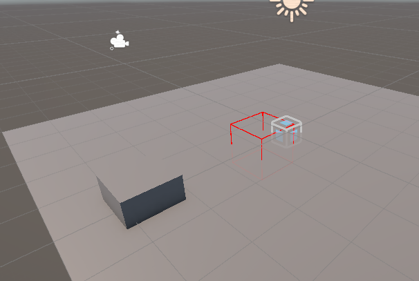
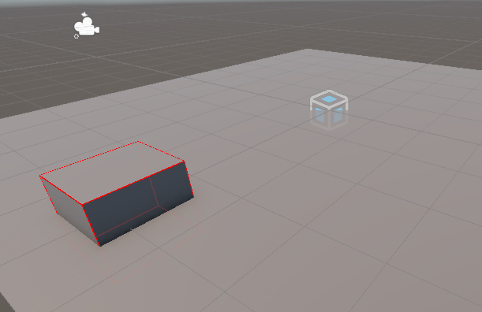

# Tech Adventures: Networking Part 1

Online multiplayer is a big deal these days. Some people only play games when
they can play with their friends. But the tech needed to enable this can be
quite complicated, and something I’ve never really tried before.

That’s not to say I have no experience with networking. But my experience is
with a completely different domain that allows for a different set of shortcuts
and assumptions than what games can use. And even then, I don’t touch those
networking pieces that often. Internet technologies in general are typically not
my strong suit. Every layer of abstraction is another layer for bugs to creep
in, and that gives me very low confidence in the tech, which I find paralyzing.

Prior to this, my experience with Unity NetCode has simply been making the
Latios Framework with Unity Transforms mode work in the NetCode samples. That
meant making each `World` a `LatiosWorld` (which required some bootstrap
shenanigans) and ensuring rendering is driven by Kinemation. But aside from the
bootstrapping, I didn’t really dive into NetCode at all.

Anyways, for the start of our networking adventures, I’m going to be working
through the various Unity NetCode tutorial projects and trying to make them work
more cohesively with Latios Framework features along the way. I will also be
pretending to discard much of what I know about networking to detach myself from
any wrong assumptions.

So to start with, I am going to work through the tutorials in the NetCode
[Getting
Started](https://docs.unity3d.com/Packages/com.unity.netcode@1.3/manual/getting-started.html)
series. And I’ll be resorting to [this
video](https://www.youtube.com/watch?v=8efRGtRCGJ0) as a backup resource to
potentially fill gaps I find in the documentation. I will be investigating with
a level of critical analysis that is atypical of someone going through a
tutorial. My goal is to develop a deeper understanding so that I can navigate
the NetCode package’s codebase and make informed opinions on its capabilities
and shortcomings. This series will act as a journal of this process.

If you have zero experience with NetCode yourself, I encourage you to go through
the learning process on your own first. If you do have experience, use this as
an opportunity to challenge the depths of your understanding. And if you find
you know something that I don’t, feel free to share in the Latios Framework
Discord!

## Installation

For this project, I am using Unity 6000.0.13f1 and NetCode 1.3.0-pre.4, and I
have also installed a local development version of the Latios Framework which
uses the same version of Entities. After setting up required framework scripting
defines (Burst atomics and Entity Store), the new project has zero compiler
errors. First part is done!

## Creating the Scene

Before we move any further, we want this project to use QVVS Transforms. So we
are going to set up an asmdef and a modified version of the NetCode bootstrap
that leverages QVVS Transforms instead of Unity Transforms, as well as using the
explicit workflow.

We are able to follow the steps of [Creating an initial
Scene](https://docs.unity3d.com/Packages/com.unity.netcode@1.3/manual/networked-cube.html#creating-an-initial-scene)
without any issue.

## Port Shenanigans

In the [next
step](https://docs.unity3d.com/Packages/com.unity.netcode@1.3/manual/networked-cube.html#establish-a-connection),
we are supposed to create a bootstrap and specify a port. Well, we already have
a bootstrap, so we just need to override the `Initialize()` method. The document
refers to “your chosen port”. But as a Networking newbie, I haven’t chosen a
port. I don’t know what that entails, or what things I need to watch out for. So
time to resort to the video…

Okay. So turns out there’s a more advanced way to do things that completely
changes this process. So we’re going to throw this into the bucket of
“temporarily unsolved undocumented problems to learn later” and instead use the
port Unity has in their documentation.

## RPC Collection Singleton

Advancing to [this
step](https://docs.unity3d.com/Packages/com.unity.netcode@1.3/manual/networked-cube.html#communicate-with-the-server),
the documentation suggests creating a system that disables itself and only
exists to run logic in `OnCreate()`. Even a disabled system has per-frame
overhead. Since the Latios Framework has specific bootstraps for each type of
world, we can easily move this logic into one of those. We’ll make a utility
class for methods like this called `NetCodeBootstrapTools`.

Next question, can we move this singleton onto the `worldBlackboardEntity`?

Unfortunately, no. The system that creates this singleton explicitly creates an
entity for it. Hopefully that doesn’t give us trouble later.

## We’re Going In!

Next, we need to setup an RPC between the client and the server. The client gets
to tell the server to go into the game. Seems backwards for something that is
supposed to be “server authoritative”, but let’s roll with it for now.

So in our two new systems, we have structural changes inside
`SimulationSystemGroup`. That’s not great. But perhaps this is simply tutorial
convenience?

Regardless, because this is a Latios Framework project, we’ll need to set up
`RootSuperSystems` for housing these systems. These are the systems that require
the `WorldSystemFilterFlags`. The systems they create don’t require the
attribute.

Entering play mode, we successfully see the log message. We also got some errors
about allowing the application to run in the background. I’ve fixed that by
adding lines to set that property in the bootstrap.

## Getting Spooky

Time to move on to [creating ghost
prefabs](https://docs.unity3d.com/Packages/com.unity.netcode@1.3/manual/networked-cube.html#create-a-ghost-prefab).
There’s a few weird things going on here.

First, in the screenshot, they have added the `LinkedEntityGroupAuthoring`. Why?
It isn’t mentioned in the docs at all, so I’m simply going to omit that…

Or not. It is required by the other authoring component and automatically added.
Why?

Second, they have a `Cube` authoring component, tag component, and baker. I
think the purpose of this is to ensure the `LocalTransform` gets added to the
entity. Since we are using QVVS Transforms and this entity will get a
`WorldTransform` from the `MeshRenderer`, I’m going to skip this step.

## Spawning the Spawner

Our [next
step](https://docs.unity3d.com/Packages/com.unity.netcode@1.3/manual/networked-cube.html#create-a-spawner)
is the classic ECS spawner setup. However, what I thought was the reason for the
Cube tag is completely unnecessary, since the spawner can also request the
appropriate transforms. Plus, prefabs tend to request transforms automatically
anyways. So I have no idea what is going on.

What I do know is that I made the spawner `Renderable` instead of Dynamic,
because I suspect that’s all we actually need for it. But even that may be
unnecessary.

## Spawning the Spook

Now we move on to [spawning the actual
cube](https://docs.unity3d.com/Packages/com.unity.netcode@1.3/manual/networked-cube.html#spawning-our-prefab).
After following the steps, I encountered a couple of problems. The first was
just a typo in the spawner. But the second was complaining about the
`LinkedEntityGroup` not existing. Huh?

So turns out that in the bootstrap I had enabled a flag for removing
`LinkedEntityGroup` from entities if they only had one element. But this was
also doing this for entities that were explicitly given a
`LinkedEntityGroupAuthoring`. A new baking-only component and a new baker later,
and I am now excluding such entities from the removal filter. And now everything
is working!

But what even is going on? Is our connection state really on the first client
entity we spawned?

No. What was breaking was some other system that assumes all ghosts have
`LinkedEntityGroup`. The error isn’t specific to the tutorial. It seems that
NetCode has some nasty archetype inefficiencies.

…Not surprised.

## Make Things Move

We continue following along with the [next
step](https://docs.unity3d.com/Packages/com.unity.netcode@1.3/manual/networked-cube.html#moving-the-cube),
which is quite straightforward. The only difference in our implementation is
that we create `RootSuperSystem` wrappers for each of our systems, as we intend
to use explicit system ordering.

And it works!

…

That’s a lie.

While the cube does move around, it is simply moving around in the client. The
server has no idea where the cube is on the client, and vice versa.

To better visualize this, we are going to turn on Psyshock in this project, and
write a server system to draw the colliders, so that we can see what the server
is doing.

Yeah…

That’s out of sync.

In order to make our client and server agree, we need to actually synchronize
the `WorldTransform` component. This should be as simple as slapping some
`[GhostField]` attributes on the `position`, `rotation`, `scale`, and `stretch`,
right?

Those aren’t fields.

`WorldTransform` is instead backed by a `TransformQvvs`, and there is no way to
call out each of its fields directly using NetCode’s serialization scheme. I
could make templates for `TransformQvvs`, but then every field ends up with the
same quantization, which is probably not a good either. I opted to go for the
really ugly solution of making aliased field names in `WorldTransform` that a
`[GhostComponentVariation]` can share references to.

Still not working…

At this point, I was losing my mind and low on sleep, so I reached out for help.
Help I got.

Turns out, there’s one other thing I had to fix with the framework. Explicit
system ordering was excluding a lot of NetCode-generated systems. How everything
worked up to this point? I have no idea. But I got to add a new method to
`NetCodeBootstrapTools` that includes these generated systems when injecting the
initial set of Unity systems.

Much better!

## Attributes and Serializers

Okay. So I may have had to jump all over the place in the documentation to
figure out the issues in the previous part. To be fair, all of that was of my
own doing trying to make framework features function right from the start.

One thing I learned from all of this is that there can be multiple
`GhostComponentVariations` for a single component type. And for that to work,
the code needs to set the default when there are multiple. For now, I’m going to
keep it to just one variation out-of-the-box.

However, being able to set the default variant poses a unique challenge with
explicit system ordering, since the NetCode relies on the pattern of creating
systems with attributes relative to each other to configure the startup
sequence. Then those systems continue to sit in the world and consume little
bits of main thread time for the `ComponentSystemGroup` to check its
`SystemState.Enabled` flag. Unity could improve that by disabling the
`DefaultVariantSystemGroup` (easy optimization you can make too by the way), but
there’s still the problem with this setup not playing nice with phased system
creation.

The solution is that we are going to allow specifying default variants in the
bootstrap. We can do that by adding a new bootstrap interface type, and we’ll
have a `DefaultVariantSystemBase` that creates and caches it. But to ensure
compatibility with third parties, we’ll still modify our `NetCodeBootstrapTools`
to ensure all systems in the `DefaultVariantSystemGroup` recursively get added
when the Unity systems get created.

Anyways, with all that done, we can update the NetCode template and add a new
variant for QVVS using the explicit system ordering workflow.

## What’s Next?

In just this one tutorial, we got a lot of framework features functional. We’ve
added basic WorldTransform synchronization for QVVS Transforms, we’ve added
explicit system ordering, and we’ve improved the integrity and versatility of
our bootstrap APIs.

But do I understand NetCode and how to build games with it?

Far from it.

Next time, we’ll investigate another tutorial and hopefully uncover more areas
to improve compatibility with the framework and learning the networking secrets
along the way.

In the meantime, if you have any of your own insight to share, feel free to post
in the framework Discord.

Thanks for reading!
