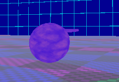
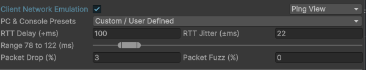
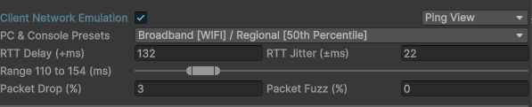
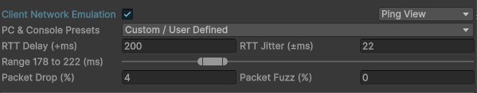

# Tech Adventures: Networking Part 2

I’m a very difficult individual to teach.

I definitely don’t have the personality to do any kind of livestreaming, but if
I did and somehow got popular enough, I would regularly run a challenge where
all donations in a stream would go towards a bucket, and during that stream, I
would have some individual try to teach me something of interest. It could be a
game, it could be a skill, it could be a topic of information. If they taught me
one thing, they’d get a fourth of the donations put towards their charity of
choice. If they actually level up my skill, they’d get all the donations for
that stream sent to their charity of choice. And if they manage to teach me
something so useful it starts to become a regular part of my life, then they get
the leftovers of all previous streams plus that stream. It would be organized
chaos, which I’ve heard makes good streaming content. I doubt it would actually
work, but it is still fun to think about.

Anyways, I’m difficult to teach. And after going through the last tutorial, I
found myself asking questions such as, “what am I allowed to change about this
code without breaking the rules of NetCode?” and “what tutorial or exploration
do I do next?” And that’s when a very good friend of mine decided to chime in.

He goes by “occuros” on various platforms, including the framework Discord. But
we’ve been chatting in a DM on a near-daily basis long before that Discord
existed. At the time of writing, he’s currently working on a DOTS NetCode
Physics-centric VR game. He knows me, he knows NetCode (and networking
technology in general), and he knows how to teach people in the industry. So if
there is anyone who is going to get me further along and closer to being able to
fly on my own, it is him.

The first thing he pointed out to me is that the original tutorial I explored
covered a lot more concepts than perhaps I realized. Here’s the list:

-   How to connect to a server
-   How to put something `InGame`
-   How to capture and send inputs to the server
-   There is prediction loop
-   For snappy behavior, apply input during the prediction loop
-   How to spawn something
-   That the spawned thing will automagically replicate to the client
-   How to sync specific fields between client and server

But how much of that do I really know?

Well, the only way to find out is to start building a new project. That’s my new
plan!

## Some Side Adventures

Since last time, I did a little more investigating and experimenting. First, I
tried out Unity’s Multiplayer Play Mode in Unity 6. While I got some cryptic
errors about connection ports in the player, it otherwise seemed to work fine. I
was able to have two cubes move around independently by clicking into each
window.

I also investigated moving the `GoInGameClientSystem` and `GoInGameServerSystem`
to `LatiosWorldSyncGroup`, as I despise structural changes in
`SimulationSystemGroup`. That seems to work still, so I’m going to roll with
that.

## Going First

I have no idea where occuros will take me on this networking journey, though I
have a pretty good guess that it will eventually end up with physics in some
way. So while I will want to keep the canvas quite open, I need to at least lay
down some foundation that we can explore from. My typical go-to for that is a
first-person controller. I don’t know why that’s my go-to, because I never
played first-person games growing up and am very bad at them. But for some
reason I find them pretty easy to get up and running with for prototyping, even
though I end up doing it slightly different every time. This time, I think I
want to try a controller that uses `half` for stats to save chunk memory.

To start with, I created a very basic environment with a textured floor and a
themed skybox I made in a previous project, just to make the visuals a little
less boring.

Next, I created a bootstrap… and then fixed a couple of bugs in the template. I
then created the skeleton of all my initial C\# files.

For the character controller, I only added the necessary pieces for planar
movement. The only real upgrade over the previous implementation at this point
is that we are using `Physics.StepVelocityWithInput()` and can configure the
movement dynamics in the inspector. Oh, and I guess I also switched to
`IJobEntity`. I also needed to do this:

```csharp
public struct CharacterControllerState : IComponentData
{
    [GhostField]
    public float2 velocity;
}
```

Without synchronizing the velocity, the client’s predictions would never be
accurate.

For input, I first created a `PlayerInput : IInputComponentData`, and then there
is a system that copies that to `CharacterControllerDesiredActions` within the
prediction group. I did it this way to facilitate an “input distribution system”
in the future.

And for player spawning, I did a couple things differently. First, I added the
player prefab to the `sceneBlackboardEntity`, and second, I used Scene
Management to ensure the subscene is loaded before the systems run.

Things are starting to feel a little more like a Latios Framework project. And
after fixing a few bugs, everything seems to be working!

### Disconnect Caveat

There’s a little bit of a known issue in my project right now. As I typically do
with FPS characters, I have several child entities. However, these are not
correctly being destroyed on disconnect, as only the root is being added to
`GoInGameServerSystem`. I’ll need to come up with a different solution for
handling disconnects. But for now, I’m going to pretend that disconnects don’t
exist, as I suspect the full game loop cycle is going to completely change at
some point in the future anyways.

## Seeing Is Believing

The next step is to attach the camera to the player. This is a little tricky,
because we have to determine which character is the client’s. It seems I can
rely on the entity with `GhostOwnerIsLocal` enabled for this. So here is the
system’s `OnUpdate()`:

```csharp
public void OnUpdate(ref SystemState state)
{
    var ecb = new EntityCommandBuffer(Allocator.Temp);
    foreach (var (_, cameraEntity) in Query<RefRO<WorldTransform> >().WithAll<CameraTag>().WithNone<Parent>().WithEntityAccess())
    {
        foreach (var (leg, entity) in Query<DynamicBuffer<LinkedEntityGroup> >().WithAll<GhostOwnerIsLocal, PlayerInput>().WithEntityAccess())
        {
            foreach (var descendant in leg)
            {
                if (HasComponent<CameraMountTag>(descendant.Value))
                    ecb.AddComponent(cameraEntity, new Parent { parent = descendant.Value });
            }
        }
    }
    ecb.Playback(state.EntityManager);
}
```

This goes in the `LatiosWorldSyncGroup` only for clients and requires the
outermost query for update, so it doesn’t run very often.

And that works too!

The transition in looks pretty awful, but that’s something we’ll fix later.
However, aiming is still something we want to do. So let’s figure that out next.

Aiming isn’t all that different from movement, except we want the vertical aim
to affect the child. We can do that by simply having the child copy the vertical
aim from its parent.

I’m not confident the input handling is correct though. With aiming, input is
stored as a delta from the forward direction. And this is supposed to accumulate
from the start of each tick. I don’t think `IInputComponentData` is that smart.
We’ll have to figure that out.

## The Art of Aiming

As I have already said, I tend to write first-person character controllers
differently every time, and one thing I’ve experimented with is the mouse-look
algorithm.

Most people are familiar with the tried-and-tested method of taking the pointer
delta, multiplying it by some assortment of factors involving unit conversions,
screen resolution, field-of-view, sensitivity settings, and magic constants; and
then treating that as rotation angles. And indeed, I’ve done this for several
projects, including LSSS.

However, recently at the time of writing this, I started experimenting with a
different approach.

1.  Assume the pointer is at the center of the screen.
2.  Move the pointer by the delta.
3.  Figure out where the pointer is pointing at.
4.  Rotate the camera so that whatever the pointer was pointing at is now at the
    center of the screen.

This algorithm more closely matches how the pointer works on the desktop, and
may feel better for some people. However, it isn’t a perfect science due to
swap-chain latency and framerate sensitivity.

You see, in the first approach, it is as if we are wrapping the screen around
some sphere. In the second approach, it is as if we are projecting the sphere
onto the screen. The latter attenuates the rotation angle by the cosine, which
means if there was a frame spike, the rotation would be dampened as the pointer
delta per frame would increase. And while player preference is an art, the
latter creates a whole lot of complications when it comes to prediction with
different tick rates on the server and client.

Instead, we can refer to Unity’s Character Controller Samples which features
[instructions](https://github.com/Unity-Technologies/CharacterControllerSamples/blob/master/_Documentation/Tutorial/tutorial-netcodecharacters-prediction-firstperson.md)
for how to do mouse-look in a NetCode project.

I’m not sure I fully understand what makes this code work so well, but it is a
lot smoother than what I had before. What I do know is that
`InputDeltaUtilities` needs to be in some kind of package. And if it isn’t in
Unity’s, it is going in the framework.

Anyways, time to move on to the next challenge.

## Ready, Aim, Fire!

Now that we have our first-person foundation set up, we can finally start
implementing the challenges from my friend occuros.

> So your first challenge will be to have the cube shoot a ball forward when the
user presses space.

Well, we no longer have a “cube” in this project, as I replaced it with a more
traditional prototyping capsule setup. But other than that, I think we can go
about this.

So first things first, we’ll need our ball. I wrote up a `MoveForward` component
with a constant speed, and I set up an authoring component for it as well as a
system that performs the logic. I don’t know which `RootSuperSystem` the
`MoveForwardSystem` needs to update in yet.

Next, we need the player to be able to command shooting the ball. So we give it
a component that contains the ball prefab as well as a reference to a spawn
point entity. I noticed from the Online FPS tutorial there’s the concept of
`NetworkEvent` for inputs such as “jump” or “shoot”. I have added that, and
wired it up to the input distribution mechanism this project is using.

Lastly, I need to figure out how I am supposed to do the spawning. Then I read
the first sentence of
[this](https://docs.unity3d.com/Packages/com.unity.netcode@1.3/manual/ghost-spawning.html).

A ghost is spawned simply by instantiating it on the server, all ghosts on the
server are replicated to all clients.

That seems simple enough. In theory, I can just add my `MoveForwardSystem` to
both the server and client in `SimulationSystemGroup` and require the Simulate
tag. And then I can write a `ShootBallSystem` that only updates in
`SimulationSystemGroup` on the server, and uses `InstantiateCommandBuffer` and
`latiosWorld.syncPoint`.

Does it work?



I know the image is a little hard to see, but that’s way too many balls. It
seems after the very first input, it spawns every frame.

Okay, apparently you have to set an `InputEvent` to default every time you
sample input. The docs could be a little more explicit about that (or just not
use `Entities.ForEach` in the example).


Pretty smooth!

## Keep Firing!

> Now make it a machinegun that spawns bullets while the "shoot" button is pressed
[down] up to a maximum amount of bullets.

Easy! We already have all the pieces for this. We can now switch to hold-to-fire
by using a bool instead of `InputEvent`. And then we can drop in a new
state-tracking component that keeps track of fire times, fire counts, and
reloads. And then we just replace the spawning logic in our server-only system
to account for this. This entire task basically boiled down to borrowing firing
logic from LSSS. It only took me a few minutes to get it working.

I was also told to start playing with the network simulator.

This feels fine.



This has infrequent player movement jittering.



This feels awful, as if there’s some buggy collision and bad character
controller logic. And also shooting is starting to feel laggy as well.



How do we fix that?

Reading through [these
docs](https://docs.unity3d.com/Packages/com.unity.netcode@1.3/manual/prediction-smoothing.html),
it seems there seems to be a mechanism for registering prediction smoothing
functions. And indeed, there is one in the NetCode package provided for Unity’s
`LocalTransform`. I’m going to borrow that code and adapt it for QVVS
`WorldTransform`.

Now for registering, we have to interact with the singleton
`GhostPredictionSmoothing`. Like before, Unity explicitly creates this entity,
so we can’t preemptively move it.

This alone didn’t fully rectify the issues. Turns out, the default delta before
smoothing is applied is a full Unity unit. I reduced this down to 0.01, and that
seems to have done the trick for the most part. But at 200 RTT, I still get a
little wobbling.

## Detour into Disabled Land

Life decided to do “life” things, and the transform smoothing investigation
needed to be put on hold. However, I’m not the only one investigating Latios
Framework and NetCode working together. Another member of the community who goes
by ZGS_Pancake on Discord identified an issue with Kinemation.

If I were to take the projectile prefab and simply drag it into the subscene, it
disappears! You can’t see it in the game view at all.

This is because Unity disables prespawned ghosts by adding the Disabled tag
during baking. But strangely, it doesn’t do this for any of the children.

Making these entities appear in the Editor World is fairly straightforward.
NetCode doesn’t have any editor systems that interact with this mechanism, so we
can simply enable the entities in an Editor World system.

```csharp
[WorldSystemFilter(WorldSystemFilterFlags.Editor)]
[UpdateInGroup(typeof(LatiosWorldSyncGroup), OrderFirst = true)]
[UpdateAfter(typeof(ManagedStructComponentsReactiveSystem))]
[UpdateAfter(typeof(CollectionComponentsReactiveSystem))]
[DisableAutoCreation]
[RequireMatchingQueriesForUpdate]
[BurstCompile]
public partial struct EnablePreSpawnedGhostsInEditorSystem : ISystem
{
    EntityQuery m_query;

    [BurstCompile]
    public void OnCreate(ref SystemState state)
    {
        m_query = state.Fluent().With<Disabled>().With<PreSpawnedGhostIndex>().Build();
    }

    [BurstCompile]
    public void OnUpdate(ref SystemState state)
    {
        state.EntityManager.RemoveComponent<Disabled>(m_query);
    }
}
```

However, solving this for the runtime is a bit more challenging. At runtime,
having the skinned mesh be enabled the first few frames before the skeleton is
enabled will result in the first binding attempt failing.

The solution is to disable the children in baking, and reenable them once the
root ghost is enabled. But that brings a bunch of other questions. Do other
children besides skinned meshes need this logic? If so, how granular does the
authoring need to be? Is it better to just apply this logic to everything to
save time? Or are there real use cases for keeping the child enabled while the
parent is disabled?

I don’t know these answers yet. So for now, we’ll stop the investigation here.

## Four Clocks

Frustrated by the weird movement in the FPS character under higher network
latency, I took a break from NetCode. Then NetCode 1.4.0 released, and I decided
to return to it and update the project. Unfortunately, this made the weird
movement worse. I figured I should probably investigate how Unity’s Character
Controller package behaved under similar scenarios.

In the Unity Character Controller FPS sample, I turned off the camera roll and
gun animations, and I swapped the materials in the test level with my test
pattern to make sure any little hiccup was easily noticeable. I added some
network latency. It was smooth.

Then I set the simulation tick rate really low, just to see if this was
exclusively due to the character only updating at a fixed rate. It was still
smooth. So clearly there’s some custom magic going on. But after further digging
and seeing how it worked, I got suspicious something was off. I decided to
experiment.

We start with these four components:

```csharp
public struct RunClockFlag : IComponentData
{
    [GhostField] public byte run;
}

public struct StartClockInput : IInputComponentData
{
    public InputEvent startClock;
}

public struct PartialTickClock : IComponentData
{
    [GhostField] public float partialTick;
}

public struct PartialTickClockSmoothed : IComponentData
{
    [GhostField] public float partialTickSmoothed;
}
```

The idea here is that when the user presses space, we enable a clock to run,
which increments each value by `60f * deltaTime`. `PartialTickClock` will be
updated in the prediction group. So will `PartialTickClockSmoothed`, but this
one will have a prediction smoothing function.

Then we have these three components:

```csharp
public struct FixedStepClock : IComponentData
{
    [GhostField] public float fixedStep;
}

public struct InterpolatedClock : IComponentData
{
    public float capturedPreviousFixedStep;
    public float interpolatedClock;
}

public struct FixedStepClockMemory : IComponentData
{
    public double elapsedTime;
    public float  deltaTime;
}
```

`FixedStepClock` is updated in the fixed step simulation group. The other two
model what Unity’s character controller interpolation does.
`FixedStepClockMemory` lives on a blackboard entity and captures the previous
fixed step update time values. Meanwhile, `InterpolatedClock` uses the current
`FixedStepClock` and the previous `FixedStepClock` captured when
`FixedStepClockMemory` is updated, but before `FixedStepClock` is updated.

Lastly, I have a `ClientOnlyClock` which runs in `SimulationSystemGroup` just
for clients.

The whole set up systems for this test is as follows:

```csharp
[RequireMatchingQueriesForUpdate]
[BurstCompile]
public partial struct ClockTestInputSystem : ISystem
{
    public void OnUpdate(ref SystemState state)
    {
        var kb = UnityEngine.InputSystem.Keyboard.current;
        if (kb.spaceKey.wasPressedThisFrame)
        {
            foreach (var input in Query<RefRW<StartClockInput> >().WithAll<Simulate>())
                input.ValueRW.startClock.Set();
        }
    }
}

[RequireMatchingQueriesForUpdate]
[BurstCompile]
public partial struct ClockTestRunSystem : ISystem
{
    [BurstCompile]
    public void OnUpdate(ref SystemState state)
    {
        foreach ((var input, var flag) in Query<StartClockInput, RefRW<RunClockFlag> >().WithAll<Simulate>())
        {
            if (input.startClock.IsSet)
                flag.ValueRW.run = 1;
        }
    }
}

[RequireMatchingQueriesForUpdate]
[BurstCompile]
public partial struct ClockTestPartialTickSystem : ISystem
{
    [BurstCompile]
    public void OnUpdate(ref SystemState state)
    {
        foreach ((var flag, var clock, var smoothedClock) in Query<RunClockFlag, RefRW<PartialTickClock>, RefRW<PartialTickClockSmoothed> >().WithAll<Simulate>())
        {
            if (flag.run == 0)
                continue;

            clock.ValueRW.partialTick                 += 60f * Time.DeltaTime;
            smoothedClock.ValueRW.partialTickSmoothed += 60f * Time.DeltaTime;
        }
    }
}

[RequireMatchingQueriesForUpdate]
[BurstCompile]
public partial struct ClockTestFixedTickSystem : ISystem
{
    LatiosWorldUnmanaged latiosWorld;

    public void OnCreate(ref SystemState state)
    {
        latiosWorld = state.GetLatiosWorldUnmanaged();
        latiosWorld.worldBlackboardEntity.AddComponent<FixedStepClockMemory>();
    }

    [BurstCompile]
    public void OnUpdate(ref SystemState state)
    {
        latiosWorld.worldBlackboardEntity.SetComponentData(new FixedStepClockMemory
        {
            deltaTime   = Time.DeltaTime,
            elapsedTime = Time.ElapsedTime,
        });

        foreach ((var flag, var clock, var interpolatedClock) in Query<RunClockFlag, RefRW<FixedStepClock>, RefRW<InterpolatedClock> >().WithAll<Simulate>())
        {
            if (flag.run == 0)
                continue;

            interpolatedClock.ValueRW.capturedPreviousFixedStep  = clock.ValueRO.fixedStep;
            clock.ValueRW.fixedStep                             += 60f * Time.DeltaTime;
        }
    }
}

[RequireMatchingQueriesForUpdate]
[BurstCompile]
public partial struct ClockTestClientSimSystem : ISystem
{
    LatiosWorldUnmanaged latiosWorld;

    public void OnCreate(ref SystemState state)
    {
        latiosWorld = state.GetLatiosWorldUnmanaged();
    }

    [BurstCompile]
    public void OnUpdate(ref SystemState state)
    {
        var memory = latiosWorld.worldBlackboardEntity.GetComponentData<FixedStepClockMemory>();
        if (memory.deltaTime != 0f)
        {
            var interpolationFactor = math.saturate((float)(Time.ElapsedTime - memory.elapsedTime) / memory.deltaTime);
            foreach ((var flag, var clock, var interpolatedClock) in Query<RunClockFlag, FixedStepClock, RefRW<InterpolatedClock> >().WithAll<Simulate>())
            {
                if (flag.run == 0)
                    continue;
                ref var i           = ref interpolatedClock.ValueRW;
                i.interpolatedClock = math.lerp(i.capturedPreviousFixedStep, clock.fixedStep, interpolationFactor);
            }
        }

        foreach ((var flag, var clock) in Query<RunClockFlag, RefRW<ClientOnlyClock> >().WithAll<Simulate>())
        {
            if (flag.run == 0)
                continue;
            clock.ValueRW.clientOnly += 60f * Time.DeltaTime;
        }

        foreach ((var flag, var partialClock, var partialSmoothedClock, var fixedClock, var interpolatedClock, var clientClock)
                    in Query<RunClockFlag, PartialTickClock, PartialTickClockSmoothed, FixedStepClock, InterpolatedClock, ClientOnlyClock>())
        {
            if (flag.run == 0)
                continue;

            UnityEngine.Debug.Log(
                $"partial: {partialClock.partialTick}\npartial smoothed: {partialSmoothedClock.partialTickSmoothed}\nfixed step: {fixedClock.fixedStep}\ninterpolated: {interpolatedClock.interpolatedClock}\nclient only: {clientClock.clientOnly}");
        }
    }
}
```

It is worth noting that I have made `ClockTestRunSystem` update in both fixed
step prediction and normal prediction so that it is always set before any system
tries to use it.

Here are the first 5 frames:

|         | Partial | Partial Smoothed | Fixed Step | Interpolated | Client Only |
|---------|---------|------------------|------------|--------------|-------------|
| Frame 1 | 0.093   | 0.093            | 0          | 0            | 0.641       |
| Frame 2 | 1.552   | 1.552            | 1          | 0.552        | 2.099       |
| Frame 3 | 2.332   | 2.332            | 2          | 1.332        | 2.880       |
| Frame 4 | 3.056   | 3.056            | 3          | 2.056        | 3.604       |
| Frame 5 | 3.879   | 3.879            | 3          | 2.879        | 4.426       |

Notice how the partial clocks are always ahead of the fixed step clocks? That
makes sense, because they are essentially the fixed steps plus a partial step
during prediction.

But then there’s the interpolated clock, which is always behind the fixed step
clock. And it is also exactly a full tick behind the partial clocks. This tells
us two things.

First, Unity’s character controller implementation has an extra tick’s worth of
input lag for positional movement, since position is always a tick behind. This
means that if you decrease the tick rate for a project using the character
controller, input will be less responsive, albeit still visually smooth.

Second, there’s now four different time streams happening on the client if you
use the character controller interpolation technique. There’s non-predicted
interpolated ghosts which are “in the past”. There’s the fixed-step predicted
ticks. Then there’s the partial predicted ticks which are slightly ahead. And
now there’s interpolated ticks which are a little behind. Personally, I find
this to be a bit chaotic. I think we should either have partial ticks, or
interpolated ticks and always predict a full tick ahead. The latter would
probably require some invasive modifications to NetCode. But the former is
causing a poor experience. I still don’t understand why yet.

## Speed Matters I Guess

I spent a little more time playing around with Unity’s character controller, and
then went back to my own project. One thing I noticed was that Unity’s character
moved a lot faster and reached top speed much faster than mine, and that was
starting to throw me off when trying to gauge the stuttering. So I changed the
parameters of my controller to match that of Unity’s, and suddenly, even with
300 milliseconds RTT, my character is feeling pretty smooth!

But does this apply in the other direction? Would making Unity’s character
controller slower cause problems? Unity’s character controller acceleration
behaviors are controlled by a single *Sharpness* parameter. Decreasing this
value results in a more momentum-heavy movement. And under poor network
conditions, it becomes a jumpy mess.

That’s that mystery solved! To properly fix this requires independent state at
the velocity layer to reintegrate the error smoothly. Unfortunately, this either
means paying the cost of a tick of input lag to manually capture history and do
interpolation, or to stuff all this state into the same component, since Unity’s
prediction smoothing API only gives you access to a single component at a time.

Now I’ve got another reason to potentially build my own custom networking
solution. But I’d need to decide whether I want it to standardize on partial
ticks or interpolation.

## What’s Next?

It took a while, but we learned a lot. We got a functional first-person
character, and dug into the details on what defines a smooth experience for the
player for both movement and mouse-look. We also explored spawning projectile
ghosts, and the various behaviors that can be expressed.

At this point, I don’t think Unity’s NetCode package is the future for the
Latios Framework. However, there are still areas I don’t know enough about, and
I’d hate to leave some gems still buried in the dirt.

Areas I still need to investigate are predicted spawning and more advanced
connection management with lobby systems and menus. But I’m sure there are other
challenges with entity relationships, scene management, and events to make sense
of.

It may be a while before I pick this up again, so if you have a NetCode project
and are facing particular challenges with the usability of framework features in
a NetCode context, feel free to reach out. I can’t promise I will find a
solution to every problem, but I’m open to the idea of making changes if it
helps others.

Thanks for reading!
