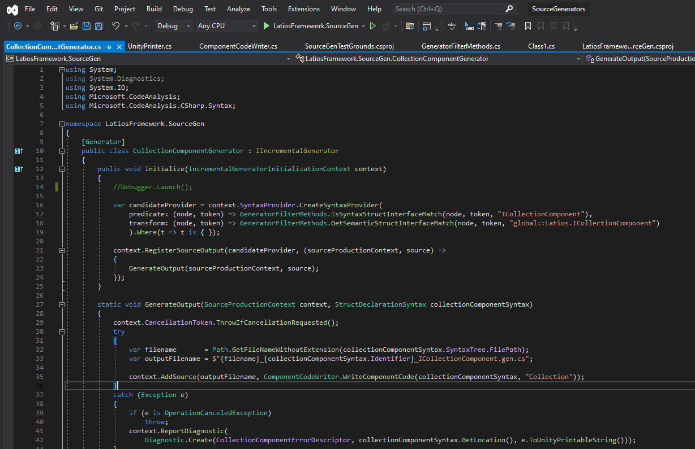
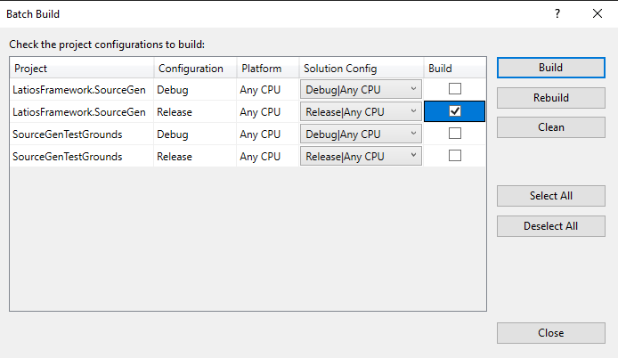
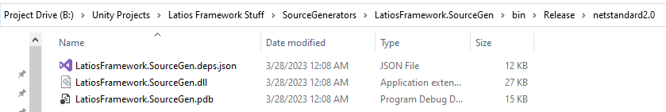
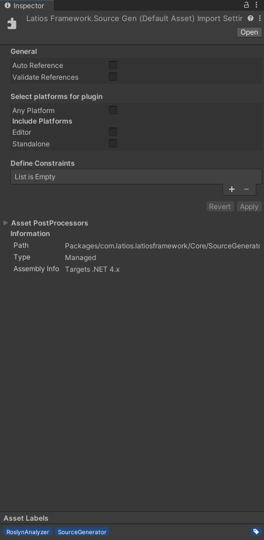

# Tech Adventures: Source Generators Part 1

Last time we investigated source generators, I encountered an issue about not
finding a particular DLL when the source generators tried to run. As you can
probably guess since I am continuing this series, I figured out the problem.

## Upgrade Chaos

The real issue here is defined by [this short but incredibly useful blog
post](https://www.damirscorner.com/blog/posts/20221014-VersionsOfSourceGeneratorDependencies.html).
And it makes the issue very clear. If I want incremental source generators, I
have to use VS 2022, or Rider.

Rider isn’t a very good option though because its vertical alignment tools do
not handle compound operators correctly. At some point I should submit an issue
for it, because I think I will otherwise like it a lot. In the meantime, that
means VS 2022.

Here’s the thing with Visual Studio. It is extendible, but switching to new
versions can be quite the adventure. The first thing I needed to do was clear
out hard drive space to install it. That meant deleting a bunch of caches and
stuff. Then after running it, I tried signing in only to be met with a bunch of
exceptions. I guess I’m not signing in? Fortunately, it lets me use the app
anyways. So I recreate my project using all the same settings, though picking
slightly better names this time. And then I see it. Obnoxious purple accents
around tabs and random icons that scream “I want attention” but then serving
little other purpose. Apparently, part of this decision was to separate VS from
VS Code. But if they actually saturated the purple to something mild like in
2019, I wouldn’t have such a big issue. New mission: restore both the old color
scheme as well as my custom syntax highlighting scheme.

Restoring the sky blue was easy. There’s a Dark 2019 theme on the internet. The
real problem was getting my custom syntax highlighting to import into that
theme. Every time I imported, the theme switched back to the built-in dark
theme. After consulting the internet, I managed to get it to work by exporting
both themes, copying a chunk of text from one to the other, and then importing
the result. But now I have proper theming in 2022!



It is worth mentioning that my criticisms may not be totally fair. My custom
theme works really well with my eyes on my monitors at my desk with my room
lighting. If I were to change any of those factors, I’d likely need to adjust
the colors accordingly to have the right amount of contrast over the things I
cared about.

Anyways, I’ve had far worse adventures getting fonts and colors working. The
other missing piece is getting Alina integrated. But I don’t need that right
now, so let’s try and generate some code.

## There Were In Fact Bugs

The first issue was getting the source generator to run at all on the side test
project. I needed to add this block to the test project to get things to happen:

```xml
  <!-- Add this as a new ItemGroup, replacing paths and names appropriately -->
  <ItemGroup>
    <ProjectReference Include="..\LatiosFramework.SourceGen\LatiosFramework.SourceGen.csproj"
                      OutputItemType="Analyzer"
                      ReferenceOutputAssembly="false" />
    <!-- Exclude the output of source generators from the compilation -->
  </ItemGroup>
```

Then, I needed to remember to add the `partial` keyword to the struct I was
testing. Whoops. But then, magic happened! I built and got compiler errors!

I wanted errors, because that means that it generated the Latios Framework code
which the test project knows nothing about. I was able to look at the code and…
why are there newlines before each opening scope brace?

I have no idea why Unity’s Printer adds a newline before every open brace. But I
just deleted the line of code that was doing it and now I am getting generated
code that makes sense!

```csharp
namespace TestLibrary.ActionableNamespaces.TotalChaos
{
	public partial class Class1
	{
		internal partial struct NestedStruct
		{
			static partial class NestedStaticClass
			{
				[global::System.Runtime.CompilerServices.CompilerGenerated]
				[global::Unity.Burst.BurstCompile]
				public partial struct MyCollectionComponent3 : global::Latios.InternalSourceGen.StaticAPI.ICollectionComponentSourceGenerated
				{
					public struct ExistComponent : IComponentData { }
					public struct CleanupComponent : ICleanupComponentData, global::Latios.InternalSourceGen.StaticAPI.ICollectionComponentCleanup
					{
						public static global::Unity.Burst.FunctionPointer<global::Latios.InternalSourceGen.StaticAPI.BurstDispatchCollectionComponentDelegate> GetBurstDispatchFunctionPtr()
						{
							return global::Unity.Burst.BurstCompiler.CompileFunctionPointer(BurstDispatch);
						}
						
						public static global::System.Type GetCollectionComponentType() => typeof(MyCollectionComponent3);
					}
					
					public ComponentType componentType => ComponentType.ReadOnly<ExistComponent>();
					public ComponentType cleanupType => ComponentType.ReadOnly<CleanupComponent>();
					
					[global::Unity.Burst.BurstCompile]
					public static unsafe void BurstDispatch(void* context, int operation)
					{
						global::Latios.InternalSourceGen.StaticAPI.BurstDispatchCollectionCollectionComponent<MyCollectionComponent3>(context, operation);
					}
				}
			}
		}
	}
}
```

However, when I tried explicitly calling out the interface instead:

```csharp
public partial struct MyCollectionComponent2 : Latios.ICollectionComponent { }
```

The source generator failed to detect it. Turns out, instead of seeing
`Latios.ICollectionComponent` as an `IdentifierNameSyntax`, it sees it as a
`QualifiedNameSyntax`. I suspect this is a bug in the Entities package too if
you tried to explicitly call out `Unity.Entities.IJobEntity`. Fortunately, this
extra check in our syntax filter solves the issue for us:

```csharp
else if (baseType.Type is QualifiedNameSyntax s2)
{
    if (s2.Right.Identifier != null && s2.Right.Identifier.ValueText != null && s2.Right.Identifier.ValueText == interfaceName)
    {
        hasInterfaceNameIdentifier = true;
        break;
    }
}
```

By the way, if you are curious as to how to debug these source generators, you
have to call `System.Diagnostics.Debugger.Launch()` at the beginning of your
generator, and then do a solution build. Also, source generators may not kick in
until after restarting VS.

I also ran into an issue where bug fixes to the source generator didn’t
propagate until after a restart. It was inconsistent though, and only happened
when I was trying to verify the fix for the newline bug.

## Does It Work in Unity?

To build for Unity, we need to select *Build -\> Batch Build* in the menu and
select the release version of our source generator.



Except, nope. That’s bugged. We have to explicitly click *Rebuild* because VS
thinks that the debug build we’ve been testing with is good enough to not build
anything and decides to skip all the packaging steps. Rebuild brings it back to
its senses.

But now we can find the DLL that we need to copy over to Unity.



But before we do that, we need to make sure that we are using a new enough
version of Unity that supports this plugin. Supposedly the required packages
were added in 2022.2.5 or something like that. I’m going to try plugging it into
2022.2.11 in my Latios Framework 0.6.6 compatibility test project.

When it loads, I get errors again about not being able to resolve the reference
to “Microsoft.CodeAnalysis”. But we haven’t finished the setup yet. We need
these settings (note the asset labels):



And then it is quiet. But once again, I’m missing a piece. I need to add partial
to one of my collection components or else the analyzer would have just skipped
over it. Maybe I was missing that the whole time in Part 1? Anyways, as soon as
I added it, I got errors in the Unity console. Unfortunately, I can’t click into
them to inspect the generated code. But I can at least fix the errors based on
the error messages and see what happens.

The first error is that I am missing some namespaces on Unity types. The second
is that I need to define the types the source generators use. I’ll just make
stubs for now. After that, we get more errors about not being able to implicitly
resolve the function pointer, or not being in an unsafe context. All of these
were pretty trivial to fix. And after all that, Unity is happy. Then I added
some code to explicitly use the generated code, and Unity is still happy. But
Visual Studio 2019 is not.

## Visual Studio 2019 Sunset

So why does Visual Studio recognize source generated code from Unity but not
mine?

Actually, does it now? It did in 2022.2.0, but this is 2022.2.11 with newer
Roslyn packages. I dug up an `IJobEntity` and tried to view the generated source
and sure enough, nothing. That means there’s only one thing left to try. I
closed VS2019, changed Unity Preferences to use VS 2022, and opened the project
back up.

Tada!

```csharp
namespace Latios.Kinemation
{
	[global::System.Runtime.CompilerServices.CompilerGenerated]
	[global::Unity.Burst.BurstCompile]
	internal partial struct PackedCullingSplits : global::Latios.InternalSourceGen.StaticAPI.ICollectionComponentSourceGenerated
	{
		public struct ExistComponent : global::Unity.Entities.IComponentData { }
		public struct CleanupComponent : global::Unity.Entities.ICleanupComponentData, global::Latios.InternalSourceGen.StaticAPI.ICollectionComponentCleanup
		{
			public static unsafe global::Unity.Burst.FunctionPointer<global::Latios.InternalSourceGen.StaticAPI.BurstDispatchCollectionComponentDelegate> GetBurstDispatchFunctionPtr()
			{
				return global::Unity.Burst.BurstCompiler.CompileFunctionPointer<global::Latios.InternalSourceGen.StaticAPI.BurstDispatchCollectionComponentDelegate>(BurstDispatch);
			}
			
			public static global::System.Type GetCollectionComponentType() => typeof(PackedCullingSplits);
		}
		
		public global::Unity.Entities.ComponentType componentType => global::Unity.Entities.ComponentType.ReadOnly<ExistComponent>();
		public global::Unity.Entities.ComponentType cleanupType => global::Unity.Entities.ComponentType.ReadOnly<CleanupComponent>();
		
		[global::Unity.Burst.BurstCompile]
		public static unsafe void BurstDispatch(void* context, int operation)
		{
			global::Latios.InternalSourceGen.StaticAPI.BurstDispatchCollectionComponent<PackedCullingSplits>(context, operation);
		}
	}
}
```

## Alina Alina Alina

Alina is my auto-formatting tool. It is a console application that takes a file,
formats it, and writes it back out. Under the hood, it leverages Uncrustify for
much of the configuration, but then inserts its own passes using Roslyn syntax
tree analysis to handle auto-alignment. Now the version of Uncrustify it uses is
fairly old at this point. At the time I originally tried to use clang-format but
that actually generated broken code for shift operators. Ideally there would be
an open-source project that was customizable but also relied on Roslyn so I
could fork the project and insert my special logic for handling vertical
alignment, especially with compound assignments which formatters seem to
struggle with.

To actually launch Alina, I use Code Beautifier, which is an extension for
plugging in a command-line tool for formatting. In it, I have a special
configuration with all my command-line arguments specific to C\# files.

So first, I have to see if this plugin is available in VS 2022. Answer: yes.

Next, I have to copy the configuration over. There seems to be an import and
export mechanism, so maybe if I export from…

Wait, why does it say “Alina”?

Turns out, just installing the extension was all that was necessary. It found
whatever settings VS 2019 had and started using it. I’m now officially using VS
2022\. Hopefully some of my other gripes with VS 2019 are gone with this new
version too.

And for anyone wondering why I bother with a formatting tool that sometimes does
weird ugly things and adds a whole bunch of whitespace everywhere, the short
answer is that I spend most of my time reading, parsing, and trying to
understand code, and this formatting style far more often than not allows me to
do those things faster due to weird quirks in my brain. If you want a deeper
explanation, feel free to ask. And if you find this vertical alignment thing to
be potentially useful for you too and want to help work out the ugly cases,
definitely reach out!

## What Does This All Mean?

Well for one, I’m now up-to-date on one of my development tools. While it wasn’t
completely smooth sailing, it was certainly smoother than previous updates.

But the bigger highlight is that the Latios Framework can now wield the power of
source generators! Collection components were just the beginning. There will be
many more use cases. I’m especially interested in fixing Burst scheduling of
`FindPairs`. Not only will it solve the problem, but I believe it will also
allow us to only Burst-compile the jobs that are actually used. Even further, I
want to do this in a generalized way such that user code that uses a similar
pattern can reap the same benefits without the need of writing additional source
generators. But all of that will have to wait for a future installment. Right
now, I have some big refactoring work ahead of me.
