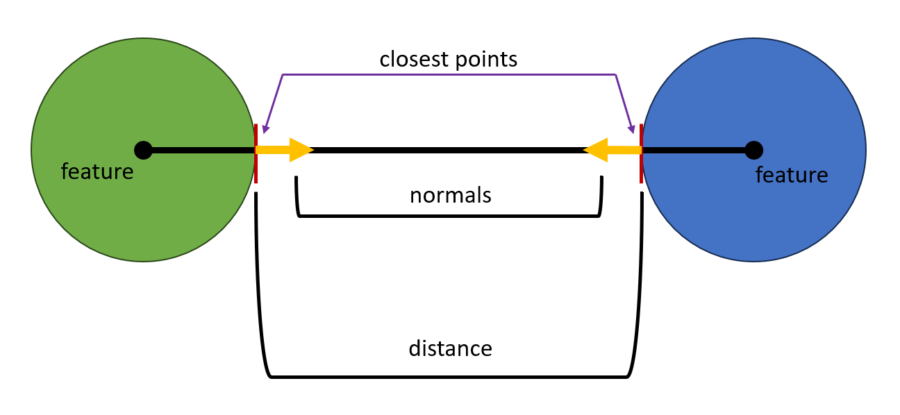

# Tech Adventures: Road to Physics Simulation Part 2

Have you ever picked up an object with a built-in magnet only to end up picking
up more than you intended because several other metal things stuck to it?
Apparently, Psyshock needs this for contact generation.

In our last adventure, we discussed the anatomy of a physics simulation engine.
This time around, we are going to zoom way in on the narrow phase of collision
detection and add *closest feature* reporting.

A feature is a part of a primitive’s shape that defines the adjacency in
structure with the rest of the primitive. Primitives have a sort of skeleton of
points, edges, and faces. Sometimes, this skeleton is an exoskeleton and these
features are on the primitive’s surface. Other times they may be hidden in the
shape behind a radius, which is the case for spheres and capsules.

When two primitives which are not allowed to penetrate each other happen to be
in contact, then for each collider, exactly one feature, or a projection of that
feature onto the surface in the case of features being internal, can be in
contact at a time. Additionally, the closest point on the surface will lie on
that feature or its surface projection.

Naturally, adding feature reporting to Psyshock’s `DistanceBetween()` method
provides all the information we need to generate contact points. But while a
straightforward idea, it is a bit of a tedious hurdle, because Psyshock uses
unique methods for each pair of collider types. We only care about pairs of
primitives, so that is pairs that are composed of spheres, capsules, boxes,
triangles, and convex meshes. That’s 15 combinations! I guess it is as good of
time as any to explore how all these combinations of distance queries work.

As for the features themselves, we can store each feature in a `ushort` where
two bits represent the type of feature while the other 14 represent the index of
that feature in the primitive. With two features, our `ColliderDistanceResult`
will be an even 64 bytes in size.

One last thing, we aren’t necessarily going to be reporting the true closest
features, but rather just the most-specific features the closest points lie on.
That is, if the closest point is a vertex, then we report a point feature, even
if the vertex is part of an edge that is parallel to a face. This is because
computing the actual closest features is where more expensive, and we are trying
to patch this info into the `DistanceBetween()` algorithm which doesn’t need
this info in many use cases.

*Disclaimer: You don’t need to understand each of these algorithms to be
effective with Psyshock’s simulation APIs in the future. This article is mostly
for those who want to know how Psyshock’s collision detection works and which
parts are optimized to what extent.*

## Sphere vs Sphere



If you draw a line between the two center points, the line direction defines the
closest point normals. And the closest points are simply a radius away from the
center along that line direction. The `DistanceBetween()` method for two spheres
is pretty much just this.

A sphere only has a single feature, its center. Therefore, the closest features
can simply be written like this:

```csharp
featureCodeA = 0,
featureCodeB = 0,
```

There is a special case for spheres where the two spheres can share the same
center point. In that case, the normal is undefined. Psyshock uses the local
space vector of (0, 1, 0) when this happens.

The sphere vs sphere implementation is based on a Unity Physics implementation
and is optimized.

## Sphere vs Capsule

Just like how a sphere is a point with a radius of padding around it, a capsule
is a line segment with a radius of padding around it. When it comes to distance
queries with capsules, we usually just try to find the closest point on the line
segment by projection algorithms, and then replaces the capsule with a sphere
centered on that point. This is the internal algorithm which does just that:

```csharp
private static bool CapsuleSphereDistance(in CapsuleCollider capsule, in SphereCollider sphere, float maxDistance, out ColliderDistanceResultInternal result)
{
    //Strategy: Project p onto the capsule's line clamped to the segment. Then inflate point on line as sphere
    float3 edge                   = capsule.pointB - capsule.pointA;
    float3 ap                     = sphere.center - capsule.pointA;
    float  dot                    = math.dot(ap, edge);
    float  edgeLengthSq           = math.lengthsq(edge);
    dot                           = math.clamp(dot, 0f, edgeLengthSq);
    float3         pointOnSegment = capsule.pointA + edge * dot / edgeLengthSq;
    SphereCollider sphereA        = new SphereCollider(pointOnSegment, capsule.radius);
    return SphereSphere.SphereSphereDistance(in sphereA, in sphere, maxDistance, out result);
}
```

Capsules have three possible features. The two endpoints of the segments are
point features, while the segment itself is a line feature. This distinction
will help capsules lie longways on flat surfaces.

To add feature analysis to this algorithm, we simply need to compare the
projection value against the clamp values.

```csharp
var hit = SphereSphere.SphereSphereDistance(in sphereA, in sphere, maxDistance, out result);
result.featureCodeA = 0x4000;
result.featureCodeA = (ushort)math.select(result.featureCodeA, 0, dot == 0f);
result.featureCodeA = (ushort)math.select(result.featureCodeA, 1, dot == edgeLengthSq);
return hit;
```

The sphere vs capsule algorithm implementation is also based on Unity Physics
and is optimized.

Shortly after working on this, I noticed an issue where if the sphere lies
directly on the capsule segment, this method could return hit data internal to
the capsule. I fixed this by exporting a bool for the degenerate case in
`SphereSphereDistance()` and adding an unlikely branch to skip over the return
and patch the result.

## Capsule vs Capsule

We only need to extend things just a little bit further to understand capsule vs
capsule. It uses the same tricks as before, except instead of a closest point on
a line segment to a sphere center, we need the closest points between two line
segments.

This is the algorithm for finding those closest points on the segment, with the
last line being a new addition to help identify the closest features:

```csharp
internal static void SegmentSegment(float3 pointA, float3 edgeA, float3 pointB, float3 edgeB, out float3 closestAOut, out float3 closestBOut, out bool4 isStartEndAB)
{
    // Find the closest point on edge A to the line containing edge B
    float3 diff = pointB - pointA;

    float r         = math.dot(edgeA, edgeB);
    float s1        = math.dot(edgeA, diff);
    float s2        = math.dot(edgeB, diff);
    float lengthASq = math.lengthsq(edgeA);
    float lengthBSq = math.lengthsq(edgeB);

    float invDenom, invLengthASq, invLengthBSq;
    {
        float  denom = lengthASq * lengthBSq - r * r;
        float3 inv   = 1.0f / new float3(denom, lengthASq, lengthBSq);
        invDenom     = inv.x;
        invLengthASq = inv.y;
        invLengthBSq = inv.z;
    }

    float fracA = (s1 * lengthBSq - s2 * r) * invDenom;
    fracA       = math.clamp(fracA, 0.0f, 1.0f);

    // Find the closest point on edge B to the point on A just found
    float fracB = fracA * (invLengthBSq * r) - invLengthBSq * s2;
    fracB       = math.clamp(fracB, 0.0f, 1.0f);

    // If the point on B was clamped then there may be a closer point on A to the edge
    fracA = fracB * (invLengthASq * r) + invLengthASq * s1;
    fracA = math.clamp(fracA, 0.0f, 1.0f);

    closestAOut = pointA + fracA * edgeA;
    closestBOut = pointB + fracB * edgeB;

    isStartEndAB = new float4(fracA, fracA, fracB, fracB) == new float4(0f, 1f, 0f, 1f);
}
```

And naturally, we process the results like so:

```csharp
private static bool CapsuleCapsuleDistance(in CapsuleCollider capsuleA, in CapsuleCollider capsuleB, float maxDistance, out ColliderDistanceResultInternal result)
{
    float3 edgeA = capsuleA.pointB - capsuleA.pointA;
    float3 edgeB = capsuleB.pointB - capsuleB.pointA;

    SegmentSegment(capsuleA.pointA, edgeA, capsuleB.pointA, edgeB, out float3 closestA, out float3 closestB, out var isStartEndAB);
    SphereCollider sphereA = new SphereCollider(closestA, capsuleA.radius);
    SphereCollider sphereB = new SphereCollider(closestB, capsuleB.radius);
    var hit = SphereSphere.SphereSphereDistance(in sphereA, in sphereB, maxDistance, out result);
    result.featureCodeA = 0x4000;
    result.featureCodeA = (ushort)math.select(result.featureCodeA, 0, isStartEndAB.x);
    result.featureCodeA = (ushort)math.select(result.featureCodeA, 1, isStartEndAB.y);
    result.featureCodeB = 0x4000;
    result.featureCodeB = (ushort)math.select(result.featureCodeB, 0, isStartEndAB.z);
    result.featureCodeB = (ushort)math.select(result.featureCodeB, 1, isStartEndAB.w);
    return hit;
}
```

Just like sphere vs capsule, these algorithms are also based on Unity Physics
and are optimized. But also like sphere vs capsule, there is a special case I
had to go back and fix.

## Sphere vs Box

The box collider presents the first collider with face features, having 6 of
them. It also has 12 edges and 8 vertices for a total of 26 features! How the
algorithm works is also a little unconventional.

Imagine that this box is in a 3D grid of boxes. How many neighbors does it have?

26.

Do you see the pattern?

Each neighbor corresponds to a feature of the box. So if the sphere’s center is
in one of the neighbors, then we instantly know which feature it is closest to.
These neighbors are called Voronoi regions. If the center is instead inside the
box, then the closest feature is always a face, whichever face is closest.

This by itself would be sufficient and fast, but Psyshock does something a
little extra. Instead of analyzing all the Voronoi regions, Psyshock divides the
box into octants, and then uses symmetry to analyze only the Voronoi regions for
a single octant, which brings the number of Voronoi regions per octant down to
just 7.

This however does complicate things slightly, because now the one-to-one mapping
of features is lost. But using the mirror mask which is a bool3 specifying if
each axis needs to be mirrored (the positive octant is what gets evaluated), we
can compute the actual feature index using some clever expressions. For example,
if the closest feature in the mirrored space is the face whose normal points in
the z direction, then the final feature code can be calculated like this:

```csharp
result.featureCode = (ushort)(0x8002 + math.select(0, 3, isNegative.z));
```

The code 80 means that the feature is a face, while the 02 means we are on the
z-axis. Lastly, we add 3 if the z-axis is mirrored.

For edges, there are two potential mirror axes to consider. The edge features
are counted such that all four edges along the x-axis are first, then all four
along y, and finally all four along z. Here’s the expression for a y-axis edge:

```csharp
result.featureCode = (ushort)(0x4004 + math.bitmask(new bool4(isNegative.xz, false, false)));
```

I’m not sure if these expressions are the fastest way to compute this, but they
definitely don’t seem slow. No memory reads and hopefully Burst will compile
them without branches.

Lastly, the corners are computed exclusively from the mirror flags:

```csharp
result.featureCode = (ushort)math.bitmask(new bool4(isNegative, false));
```

Actually, there’s still one more case, which is if the sphere center is inside
the box. In that case, we have a bool3 with a bool set for the closest plane in
the mirror space, and we need to optionally mirror it back based on our other
mask.

```csharp
result.featureCode = (ushort)(0x8000 | (math.tzcnt(math.bitmask(new bool4(minMask, false))) + math.select(0, 3, math.any(minMask & isNegative))));
```

Overall, sphere vs box is an optimized algorithm of my own making (though
someone else has probably also done this), and making it any faster would
require diving into the generated assembly.

## Capsule vs Box

This is where things start to get tricky. Unity Physics uses a generalized
solution, but Psyshock still tries to optimize this case with a dedicated SAT
technique. SAT is an acronym for Separating Axis Theorem. I won’t get into all
the details of SAT here, because there are plenty of online resources about it
and I will likely cover it deeper in an optimization adventure.

For capsule vs box, Psyshock first tests the capsule endpoints against the faces
of the box. But unlike with sphere vs box, it has to account for the composite
of the endpoints when determining separation distances. Then, it tests the
capsule segment against all 12 box edges. It does 4 edges at a time using SIMD.
Is this actually necessary? No. It only needs to test 3, but there’s a special
case where the capsule is aligned with one of the box edges that I struggled to
reason about effectively when I first wrote the algorithm.

The main issue with this algorithm is unlike with sphere vs box, the algorithm
doesn’t reason about the box’s features. Instead, it relies on clamping
infinitely-extended versions of the features and has a complex closest point
reduction algorithm for all of its tests.

Rather than try to plumb the feature code through all of that, we can instead
extract the feature code from the result’s normal vector. The math expressions
for this are a little messy, and this won’t be the last time we need this, so I
put the evaluation in a separate method.

```csharp
internal static ushort FeatureCodeFromBoxNormal(float3 normalInBoxSpace)
{
    bool3 isNegative             = normalInBoxSpace < 0f;
    var   normalsNotZero         = math.abs(normalInBoxSpace) > 0.1f;
    var   normalsNotZeroBitmask  = math.bitmask(new bool4(normalsNotZero, false));
    var   normalsNotZeroCount    = math.countbits(normalsNotZeroBitmask);
    var   featureCodeFace        = 0x8000 | (math.tzcnt(normalsNotZeroBitmask) + math.select(0, 3, math.any(normalsNotZero & isNegative)));
    var   edgeDirectionIndex     = math.tzcnt(~normalsNotZeroBitmask);
    var   featureCodeEdge        = 0x4000 | (edgeDirectionIndex * 4);
    featureCodeEdge             += math.select(0, math.bitmask(new bool4(isNegative.yz, false, false)), edgeDirectionIndex == 0);
    featureCodeEdge             += math.select(0, math.bitmask(new bool4(isNegative.xz, false, false)), edgeDirectionIndex == 1);
    featureCodeEdge             += math.select(0, math.bitmask(new bool4(isNegative.xy, false, false)), edgeDirectionIndex == 2);
    var featureCodeVertex        = math.bitmask(new bool4(isNegative, false));
    return (ushort)math.select(featureCodeFace, math.select(featureCodeEdge, featureCodeVertex, normalsNotZeroCount == 3), normalsNotZeroCount > 1);
}
```

If Burst struggles to make sense of this and balloons the instruction count,
then we probably should revisit the algorithm in an Optimization Adventure.

I also added a bunch of code to handle some special cases that weren’t being
handled before, similar to the other capsule cases.

Anyways, the algorithm overall isn’t slow, but there’s still a lot of room to
make it faster.

## Box vs Box

When I wrote box vs box, I was trying to avoid porting Unity’s solution, which
we’ll discuss later, and instead implement it using an SAT algorithm akin to
capsule vs box. My main motivation for this is that when two boxes with identity
rotation are slightly overlapping, Unity Physics may not give a clean result
along the axis of overlap. This is because Unity Physics quantizes the space
when evaluating overlaps. SAT does this a lot cleaner.

The other thing worth noting is that I had been optimizing FindPairs and was
pretty much trying to avoid branches at all cost, even if the branches could
skip a lot of work. I wrote box vs box without a single if statement or loop.
While I eventually hardened out most of the bugs, the code is pretty slow and
will definitely need to be optimized at some point.

But that point is not now. Instead, we have the ability to extract the feature
codes from the box normal in the box’s coordinate space. If you were wondering
why that method had a random 0.1f comparison, it was to be very forgiving of
coordinate space transforms of the normal. Here’s the fruit of our labor
bypassing a major headache:

```csharp
featureCodeA = PointRayBox.FeatureCodeFromBoxNormal(bestNormalA),
featureCodeB = PointRayBox.FeatureCodeFromBoxNormal(math.rotate(aInBSpace, bestNormalB))
```

## Sphere vs Triangle

I’ll be honest, at the time of writing this, triangle colliders haven’t really
been tested properly. The main reason for that is that there isn’t really an
authoring type. I used to have a project that validating a bunch of authored
colliders and ran queries to compare against Unity Physics. And triangles didn’t
get to participate in that test. With that said, I still have all the code
written, and a lot of it is borrowed from code that I know does work, so
hopefully everything discussed here will still be relevant.

Triangles in Psyshock are double-sided, meaning it doesn’t matter which way the
vertices are wound, and each side has a normal. However, the plane is considered
the same feature from either side.

The technique used in Psyshock is similar to sphere vs box and is based on
Voronoi regions. This time, the regions are carved out by 3 planes perpendicular
to the triangle that pass through the three edges. This time, there’s no
mirroring, so we can just write the results directly for each case.

Triangles themselves can become degenerate, so I handle this as well by treating
the edges like capsules with zero radius if a Voronoi region can’t be found.

Overall, I do anticipate sphere vs triangle to be a fast and optimized
algorithm. There’s some potential for more efficient SIMD usage, but nothing
egregious.

## Capsule vs Triangle

Capsule vs triangle is implemented as a combination of various techniques.

First, the capsule segment is tested against the three triangle edges using a
SIMD version of the capsule segment vs capsule segment algorithm. And then the
closest edge is selected.

Next, a ray based on the capsule segment is casted through the triangle. If the
ray hits, then the segment intersects the triangle. Using projection math, it is
computed how much the segment would have to travel along the triangle normal to
exit the triangle. If that is less than the closest edge distance, then a
virtual sphere is slid along the segment axis until it should be touching the
triangle plane, and the results can be rapidly computed from that configuration.
For feature codes, the triangle is always hit on the face, and the capsule is
always hit on the interior segment.

If instead the closest distance is an edge distance, then a capsule vs edge
algorithm is employed, and the result is corrected so that the triangle hit
normal points towards the edge normal while the capsule hit side is reversed.

There’s also two special cases where the ray crosses through a degenerate
triangle and when it crosses through a triangle vertex.

If the ray doesn’t hit, we test the for the closest sphere given the closest
point on the capsule segment to any axis, the capsule start point, and the
capsule end point. The closest naturally decides which feature is the closest.

This algorithm is a little messy, and I ended up rewriting a bunch of it while
writing this to handle all the degenerate cases and fix a bunch of potential
bugs. It isn’t nearly as slow as say box vs box, but it could probably benefit
from an optimization pass if it becomes a bottleneck.

## Box vs Triangle

While there is a way to do box vs triangle with SAT, just like with box vs box,
I decided not to take that approach here. The main reason is that I had already
been through a bunch of pain debugging the mess that is box vs box and had seen
how slow it performed. When I was adding support for triangle colliders, I was
also adding convex colliders. Convex colliders require more general algorithms,
and those algorithms also happen to work on boxes and triangles. So this is
where we get into the generalized algorithms.

The algorithms used here are Gilbert-Johnson-Keerthi (GJK) and Expanding
Polytope Algorithm (EPA). I’m not going to discuss these algorithms in detail
here. But I will go over what results these algorithms provide.

GJK is an algorithm that given two colliders, finds the closest point on the
Minkowski difference to the origin point, unless the Minkowski difference
contains the origin point. If the Minkowski difference does not contain the
origin point, the algorithm provides several pieces of useful information, such
as the closest points on each collider, the axis of their closest points, and
their distance.

However, GJK does not tell us the normals of the specific features, nor anything
about the features. While it is possible to modify GJK to do this, the GJK
algorithm in Psyshock is a port of the Unity Physics implementation which has
lots of optimizations. So instead of that, I use the axis of the closest points
multiplied by an epsilon to do a point distance query relative to each closest
point to get the normals. That means that I need to add feature codes to point
queries. But really, point queries are just sphere queries with 0 radius
spheres. So if I want feature codes, I just have to replace the point queries
with sphere queries. Easy!

And in the case where the two colliders are colliding and GJK doesn’t give us
enough information, that’s where EPA steps in. It basically provides the missing
pieces and not much else. Once again, I’m using Unity’s implementation for this.
However, I need to be cautious about EPA, because while it is fairly fast, it is
also a lot lower accuracy than most other algorithms. The reason is that for
stability purposes, Unity quantizes all floating-point numbers into an integer
space, and uses an integer-based EPA implementation. For this reason, I’d like
to switch over all but convex mesh colliders over to SAT algorithms at some
point. But for now, it is easy and it works.

Here's what the code looks like for dispatching to GJK and EPA and extracting
the results:

```csharp
public static bool DistanceBetween(in TriangleCollider triangle,
                                    in RigidTransform triangleTransform,
                                    in BoxCollider box,
                                    in RigidTransform boxTransform,
                                    float maxDistance,
                                    out ColliderDistanceResult result)
{
    // Todo: SAT algorithm similar to box vs box.
    var bInATransform = math.mul(math.inverse(triangleTransform), boxTransform);
    var gjkResult     = GjkEpa.DoGjkEpa(triangle, box, in bInATransform);
    var epsilon       = gjkResult.normalizedOriginToClosestCsoPoint * math.select(1e-4f, -1e-4f, gjkResult.distance < 0f);
    SphereTriangle.DistanceBetween(in triangle, in triangleTransform, new SphereCollider(gjkResult.hitpointOnAInASpace + epsilon, 0f), RigidTransform.identity, float.MaxValue, out var closestOnA);
    SphereBox.DistanceBetween(in box, in boxTransform, new SphereCollider(gjkResult.hitpointOnBInASpace - epsilon, 0f), RigidTransform.identity, float.MaxValue, out var closestOnB);
    result = InternalQueryTypeUtilities.BinAResultToWorld(new ColliderDistanceResultInternal
    {
        distance  = gjkResult.distance,
        hitpointA = gjkResult.hitpointOnAInASpace,
        hitpointB = gjkResult.hitpointOnBInASpace,
        normalA   = closestOnA.normalA,
        normalB   = closestOnB.normalA,
        featureCodeA = closestOnA.featureCodeA,
        featureCodeB = closestOnB.featureCodeA
    }, triangleTransform);
    return result.distance <= maxDistance;
}
```

## Triangle vs Triangle

Theoretically, there should be a fast algorithm for these that use SIMD and flow
nicely, since triangles are so common.

Nope. Unity uses GJK and EPA, and so I decided to also use GJK and EPA to save
time. You already know everything you need to know. Is it fast at runtime?
Definitely not! But only when people start doing weird TriMesh vs TriMesh
shenanigans will I start looking for better options.

## Sphere vs Convex

We’re onto the last primitive collider type, the convex collider. A convex
collider is limited to 255 vertices. The restriction mainly exists so that EPA
can rely on `stackalloc`. But also, it helps limits the algorithmic complexity
to something sane.

However, such algorithms are still greater than O(n) complexity. This is why
sphere vs convex is better served by a brute-force O(n) algorithm.

As was discussed earlier, a sphere is just a point with a radius, and we were
using point queries to find the closest feature and get the normal. That’s also
true for convex colliders, which means the sphere vs convex algorithm has to
also fetch the normal and discover the feature along the way.

A convex collider has a bunch of faces, and each face lies on a plane whose
normal faces outward. Thus, we can compute the signed distance of the sphere
center to each of these planes. The largest signed distance will correspond to
the closest face. If that distance is negative, the sphere center is inside the
convex mesh, and so the face itself must be the closest feature.

```csharp
result.featureCode = (ushort)(0x8000 + bestPlaneIndex);
```

If the sphere center is outside the convex collider, the next step is to project
the sphere center onto the plane and test against the edges of the face. This is
effectively the same technique, except in 2D using the edges instead of the
faces. And like before, if the sphere center is inside all the edges, then the
face itself is still the closest feature.

However, if the sphere center is outside the closest edge, things are a little
more interesting. Now, the closest feature cannot be a face. It is instead
either the closest edge, or one of the two vertices the edge is composed of.
Fortunately, we already know how to solve this with sphere vs capsule. And this
time, we know the capsule can’t be degenerate, nor do we need to worry about
calculating a normal since every feature in a convex collider has a prebaked
normal. Thus we get these three codes:

```csharp
result.featureCode = (ushort)edgeVertices.x;
result.featureCode = (ushort)edgeVertices.y;
result.featureCode = (ushort)(0x4000 + blob.edgeIndicesInFaces[bestFaceEdgeIndex + edgeRange.x]);
```

However, that isn’t the end of the story. Convex colliders can have local scale
factors, and each of those factors can be zero, which collapses the convex
collider into something peculiar.

In the case all three axes are 0, then the convex collider becomes a single
point, in which case the first vertex is as good as any other feature.

In the case two axes are 0, then the convex collider becomes a line segment
stretching all the way across the AABB along the non-zero axis. This becomes a
sphere vs capsule case, without the fear of a degenerate capsule. We’ll also
pretend that the whole convex mesh is a capsule with zero radius for
feature-code purposes to avoid looping through all edges to find one that
contains the closest point. I’ll change this later if it becomes a problem.

Now if only one axis is scaled to zero, things look suspiciously tricky.
Suddenly our neat collection of convex edges and vertices now become a 2D soup.
However, there’s a clever solution. To simultaneously check if the closest point
is in the interior and to find it, we can simply raycast the unscaled convex
mesh along the zero-scaled axis. If we hit, we treat the collapsed convex mesh
as a single face, and so our feature code is just the face at index 0.

If the ray misses, then we just have to find the closest edge, and maybe the
closest vertex on that edge. We’ve already done this sort of thing before, so
the only unique thing left to cover is that I grab the baked normal of each
feature and multiply it by a specially-computed normal scale factor.

Overall, this algorithm is quite fast for a brute-force convex mesh algorithm.
If there are potential improvements, they will be related to SIMD. The code is
currently written to hint at Burst to auto-vectorize certain loops, but I
haven’t really validated that it actually does that.

## Capsule vs Convex

For sphere vs convex, I made a comment about how a brute-force approach had
better algorithmic complexity than the generalized GJK + EPA algorithms. But
yes, GJK + EPA do handle spheres, and they also handle capsules, which don’t
gain the brute-force benefit in quite the same way.

So yeah. GJK + EPA it is. And in fact, that’s pretty much how it will be from
here on out.

So without further ado…

## Box vs Convex

EZ

## Triangle vs Convex

PZ

## Convex vs Convex

Done!

## What’s Next

Now that we have feature codes, the next step will be using that information to
generate contacts. The idea is that there will be static methods that take in
the collider pairs, their transforms, and the collider distance result. Those
methods will then output contact points.

Of course, I’m still learning this whole physics simulation thing. So if there’s
anything you read that seemed wrong, or if you have any other questions about
collision detection, don’t be afraid to ping me on Discord!

Thanks for reading.
