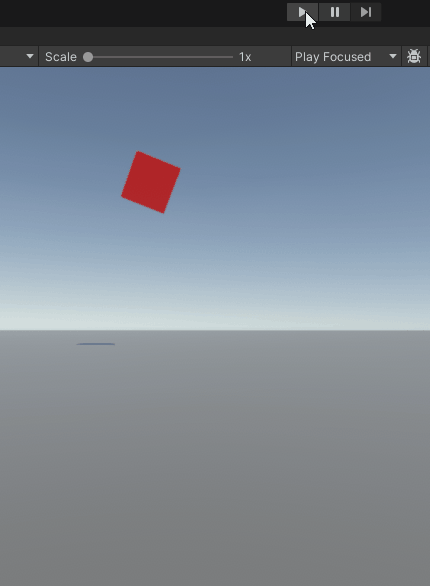
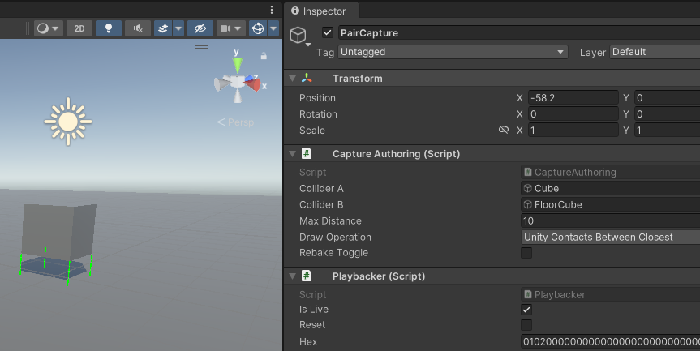
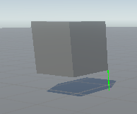
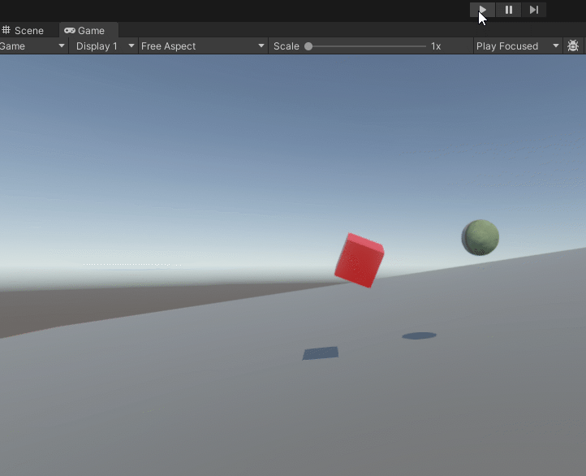

# Tech Adventures: Road to Physics Simulation Part 6

There’s a particular test of coordination that sounds really simple, but is
actually quite complex when you really think about it. The test? Throw a ball
against a wall, and it have it come back to you.

It doesn’t matter if you use an arm, a club, a catapult, a robot, telekinesis,
or a garden hose. There are so many things that can go wrong. Too much strength
or too high a throw and the ball will fly over your head. Too little, and the
ball won’t make it back before gravity prevails. And being off any bit to the
left or the right, or having too much spin, or hitting the wall at a weird spot
can all ruin things. Yet there are also infinitely many combinations of success,
as you can aim lower with a stronger forward velocity, or you can aim higher
with a weaker forward velocity. But despite having options, it is still a
difficult task that only gets harder as you move further away from the wall.

This is what building a custom physics engine is like. There are multiple
solutions, but still many ways for things to go wrong. The correct solution will
be based on the needs of your game. Psyshock is designed to give you many
choices in this regard. But right now, we don’t have a target game, so we’ll
sacrifice performance and flexibility for the sake of simplicity. The example
engine we’ll build won’t be a good fit for production, nor even as a how-to. It
is simply one single example, and nothing more than that.

I’ll be building this physics engine in the Free Parking project. I’ve already
configured a dev dungeon for it. And I’ll be taking advantage of some predefined
components for simplicity.

Anyways, let’s get started.

## Archetypes and Systems

In our simple physics engine, there will only be two types of objects. There are
the dynamically moving rigid bodies, and there are the static colliders.

The static colliders will simply be entities with collider components and the
`EnvironmentTag` component defined by Free Parking.

For the dynamic bodies, we’ll simply define a single `IComponentData` containing
all the rigid body properties we need throughout the simulation. We’ll have a
single custom authoring component for these rigid bodies as well. We’ll add
properties as we require them.

As for systems, we’ll start by putting the full simulation into a single system.
This way, we won’t have to deal with collection components and such. We’ll put
our system inside the `FixedUpdateSimulationSystemGroup` just like Unity
Physics.

These are our starting C\# files:

RigidBodyComponents.cs

```csharp
using Unity.Collections;
using Unity.Entities;
using Unity.Mathematics;

namespace DreamingImLatios.PsyshockRigidBodies
{
    struct RigidBody : IComponentData
    {
        //
    }
}
```

RigidBodyAuthoring.cs

```csharp
using Unity.Collections;
using Unity.Entities;
using Unity.Mathematics;
using UnityEngine;

namespace DreamingImLatios.PsyshockRigidBodies.Authoring
{
    public class RigidBodyAuthoring : MonoBehaviour
    {
    }

    public class RigidBodyAuthoringBaker : Baker<RigidBodyAuthoring>
    {
        public override void Bake(RigidBodyAuthoring authoring)
        {
            var entity = GetEntity(TransformUsageFlags.Dynamic);
            AddComponent(entity, new RigidBody
            {
                //
            });
        }
    }
}
```

RigidBodyPhysicsSystem.cs

```csharp
using FreeParking;
using FreeParking.Systems;
using Latios;
using Latios.Psyshock;
using Latios.Transforms;
using Unity.Burst;
using Unity.Collections;
using Unity.Entities;
using Unity.Jobs;
using Unity.Mathematics;

using static Unity.Entities.SystemAPI;

namespace DreamingImLatios.PsyshockRigidBodies.Systems
{
    [BurstCompile]
    public partial struct RigidBodyPhysicsSystem : ISystem
    {
        LatiosWorldUnmanaged latiosWorld;

        [BurstCompile]
        public void OnCreate(ref SystemState state)
        {
            latiosWorld = state.GetLatiosWorldUnmanaged();
        }

        [BurstCompile]
        public void OnUpdate(ref SystemState state)
        {
        }
    }

    [UpdateInGroup(typeof(FixedStepSimulationSystemGroup))]
    public partial class PsyshockRigidBodiesSuperSystem : RootSuperSystem
    {
        DevDungeonSystemFilter m_filter = new DevDungeonSystemFilter("DreamingImLatios/PsyshockRigidBodies");

        protected override void CreateSystems()
        {
            GetOrCreateAndAddUnmanagedSystem<BuildEnvironmentCollisionLayerSystem>();
            GetOrCreateAndAddUnmanagedSystem<RigidBodyPhysicsSystem>();
        }

        public override void OnNewScene() => m_filter.OnNewScene();

        public override bool ShouldUpdateSystem() => m_filter.ShouldUpdateSystem(sceneBlackboardEntity);
    }
}
```

You’ll notice we are borrowing BuildEnvironmentCollisionLayerSystem which is
defined in Free Parking and will be responsible for building our static layer.

## Forces and Collision Layers

Last time, I stated that our simulation can be broken up into four phases. And
the first phase involved applying forces like gravity to our velocity and
building our collision layers.

Due to motion expansion, we’ll need to build our collision layer for dynamic
bodies using custom `Aabbs`. Consequently, we’ll need to populate `ColliderBody`
and `Aabb` arrays inside an `IJobEntity`. While we are at it, we can use that
job to apply gravity and set up any other simulation values we might need.

In order to apply gravity to our velocity, we’ll need a velocity value in our
`RigidBody`. We’ll add that.

```csharp
struct RigidBody : IComponentData
{
    public UnitySim.Velocity velocity;
}

[BurstCompile]
partial struct BuildRigidBodiesJob : IJobEntity
{
    public float timeScaledGravity;

    public void Execute(Entity entity, [EntityIndexInQuery] int index, ref RigidBody rigidBody, in Collider collider, in WorldTransform transform)
    {
        rigidBody.velocity.linear.y += timeScaledGravity;
    }
}
```

What’s up with the time-scaled gravity? Well, for this simulation, we’ll assume
that we have uniform gravity on the y-axis for all bodies. Instead of
multiplying gravity with delta time for every body, we can do the multiplication
once for the job. This is simply an example of how there are little
optimizations everywhere when you can make assumptions.

Next, we’ll need to build our CollisionLayer data. So we’ll need our arrays.
We’ll also need to compute our expanded Aabb which requires the newly-computed
velocity, the time step, and an angular expansion. The latter we can calculate
from the collider. That leaves us with this job:

```csharp
[BurstCompile]
partial struct BuildRigidBodiesJob : IJobEntity
{
    public float timeScaledGravity;
    public float deltaTime;

    [NativeDisableParallelForRestriction] public NativeArray<ColliderBody> colliderArray;
    [NativeDisableParallelForRestriction] public NativeArray<Aabb>         aabbArray;

    public void Execute(Entity entity, [EntityIndexInQuery] int index, ref RigidBody rigidBody, in Collider collider, in WorldTransform transform)
    {
        rigidBody.velocity.linear.y += timeScaledGravity;

        var aabb             = Physics.AabbFrom(in collider, in transform.worldTransform);
        var angularExpansion = UnitySim.AngularExpansionFactorFrom(in collider);
        var motionExpansion  = new UnitySim.MotionExpansion(in rigidBody.velocity, deltaTime, angularExpansion);
        aabb                 = motionExpansion.ExpandAabb(aabb);

        colliderArray[index] = new ColliderBody
        {
            collider  = collider,
            transform = transform.worldTransform,
            entity    = entity
        };
        aabbArray[index] = aabb;
    }
}
```

We’ll probably have to revisit this job later, but for now we should get it
scheduled.

Except there is one problem, how do we size the arrays correctly?

Yeah… It is actually a pain.

For our use case, we can get by with
`EntityQuery.CalculateEntityCountWithoutFiltering()`. But if we wanted to size
`NativeLists` asynchronously, we’d need to do something more complicated akin to
what the query version of `BuildCollisionLayer()` does. I’ll be sure to add such
tooling prior to a final release. But for now, we’ll take the shortcut.

```csharp
[BurstCompile]
public void OnUpdate(ref SystemState state)
{
    var rigidBodyCount         = QueryBuilder().WithAll<RigidBody, Collider, WorldTransform>().Build().CalculateEntityCountWithoutFiltering();
    var rigidBodyColliderArray = CollectionHelper.CreateNativeArray<ColliderBody>(rigidBodyCount, state.WorldUpdateAllocator, NativeArrayOptions.UninitializedMemory);
    var rigidBodyAabbArray     = CollectionHelper.CreateNativeArray<Aabb>(rigidBodyCount, state.WorldUpdateAllocator, NativeArrayOptions.UninitializedMemory);

    new BuildRigidBodiesJob
    {
        timeScaledGravity = Time.DeltaTime * -9.81f,
        deltaTime         = Time.DeltaTime,
        colliderArray     = rigidBodyColliderArray,
        aabbArray         = rigidBodyAabbArray
    }.ScheduleParallel();
    state.Dependency = Physics.BuildCollisionLayer(rigidBodyColliderArray, rigidBodyAabbArray)
                        .ScheduleParallel(out var rigidBodyLayer, state.WorldUpdateAllocator, state.Dependency);
}
```

## Finding Rigid Body vs Rigid Body Pairs

The next step is to find pairs of bodies that are in contact and build out all
the associated data for each pair. We’ll start with the rigid bodies first,
since we already have the `CollisionLayer` built for that.

To start with, we’ll need to define an IFindPairsProcessor.

```csharp
struct FindBodyVsBodyProcessor : IFindPairsProcessor
{
    public void Execute(in FindPairsResult result)
    {
        //
    }
}
```

The first thing we’ll need is to perform the narrow-phase check via
`DistanceBetween()`. However, we need the distance obtained from our expanded
motion domain. That means we’ll have to store and read the `MotionExpansion`
from our bodies. We add the field to our component, and then add a single
assignment line back in our `BuildRigidBodiesJob`. With that, we can perform our
`DistanceBetween()`.

```csharp
struct FindBodyVsBodyProcessor : IFindPairsProcessor
{
    [ReadOnly] public ComponentLookup<RigidBody> bodyLookup;

    public void Execute(in FindPairsResult result)
    {
        ref readonly var rigidBodyA = ref bodyLookup.GetRefRO(result.entityA).ValueRO;
        ref readonly var rigidBodyB = ref bodyLookup.GetRefRO(result.entityB).ValueRO;

        var maxDistance = UnitySim.MotionExpansion.GetMaxDistance(in rigidBodyA.motionExpansion, in rigidBodyB.motionExpansion);
        if (Physics.DistanceBetween(result.colliderA, result.transformA, result.colliderB, result.transformB, maxDistance, out var distanceResult))
        {

        }
    }
}
```

That’s not actually right. For simple scenes, it will work fine. However, for
tri-mesh and compound colliders, we actually want to process the hits from all
the sub-colliders, which means we need to use `DistanceBetweenAll()` instead.
This method requires its own processor type to handle each result. We could
create a custom processor type that forwards the `FindPairsResult` as well as
the bodies, but perhaps it would be simpler to collect all results in a local
list and then iterate them.

Well, I decided to write a little helper to do just that. Meet
`DistanceBetweenAllCache`. Simply place one of these in your job (you can make
it a job or processor field for reduced allocations) and pass it in as the
processor. Then use foreach on it to build out contacts for all the results.

```csharp
struct FindBodyVsBodyProcessor : IFindPairsProcessor
{
    [ReadOnly] public ComponentLookup<RigidBody> bodyLookup;

    DistanceBetweenAllCache distanceBetweenAllCache;

    public void Execute(in FindPairsResult result)
    {
        ref readonly var rigidBodyA = ref bodyLookup.GetRefRO(result.entityA).ValueRO;
        ref readonly var rigidBodyB = ref bodyLookup.GetRefRO(result.entityB).ValueRO;

        var maxDistance = UnitySim.MotionExpansion.GetMaxDistance(in rigidBodyA.motionExpansion, in rigidBodyB.motionExpansion);
        Physics.DistanceBetweenAll(result.colliderA, result.transformA, result.colliderB, result.transformB, maxDistance, ref distanceBetweenAllCache);
        foreach (var distanceResult in distanceBetweenAllCache)
        {
            var contacts = UnitySim.ContactsBetween(result.colliderA, result.transformA, result.colliderB, result.transformB, in distanceResult);
        }
    }
}
```

### BuildJacobian() Rigid Body Inputs

From our contacts, the next step is to call `BuildJacobian()`. This requires
lots of parameters, and we are probably missing a few.

The first piece is the inertial pose world transform for each collider. This is
the world-space center of mass and world-space orientation of the inertia tensor
diagonal. And the second piece is the Mass instance, which is what stores the
inertia tensor diagonal inverse along with the inverse mass. We’ll add both of
these to our `RigidBody` type. And we can calculate them using
`ConvertToWorldMassInertia()`.

We created that method because there were some confusing details regarding QVVS
Transforms. And it mostly solves our problems. However, we still need to call
`LocalCenterOfMassFrom()` and `LocalInertiaTensorFrom()` to get some of the
details. The latter is not a particularly cheap call for some collider types
with non-uniform stretch, and one might choose to bake this data instead. Or
perhaps one might cache the previous stretch and local inertia tensor diagonal
and only update if the stretch changes. There’s lots of options, and one should
also consider the impact on chunk occupancy before adding cached data.

We still also need the inverse mass, and this will be the first real value we
expose to authoring. We’ll store the inverse in our Mass object, and leave the
rest uninitialized.

There are two other values we’ll need from authoring, which are our coefficients
of friction and restitution. We also need a way to combine the values between
two rigid bodies. Unity Physics provides four different algorithms to choose
from. They are the geometric mean, the arithmetic mean, the min, and max. Unity
Physics defines the default as the geometric mean, so we’ll use that. The
formula is as follows: `math.sqrt(a * b)`

At this point, our `RigidBody` component looks like this:

```csharp
struct RigidBody : IComponentData
{
    public UnitySim.Velocity        velocity;
    public UnitySim.MotionExpansion motionExpansion;
    public RigidTransform           inertialPoseWorldTransform;
    public UnitySim.Mass            mass;
    public float                    coefficientOfFriction;
    public float                    coefficientOfRestitution;
}
```

Authoring and baking looks like this:

```csharp
public class RigidBodyAuthoring : MonoBehaviour
{
    public float mass = 1f;

    [Range(0, 1)] public float coefficientOfFriction    = 0.5f;
    [Range(0, 1)] public float coefficientOfRestitution = 0.5f;
}

public class RigidBodyAuthoringBaker : Baker<RigidBodyAuthoring>
{
    public override void Bake(RigidBodyAuthoring authoring)
    {
        var entity = GetEntity(TransformUsageFlags.Dynamic);
        AddComponent(entity, new RigidBody
        {
            mass = new UnitySim.Mass
            {
                inverseMass = math.rcp(authoring.mass)
            },
            coefficientOfFriction    = authoring.coefficientOfFriction,
            coefficientOfRestitution = authoring.coefficientOfRestitution,
        });
    }
}
```

And we’ve added these lines to our `BuildRigidBodiesJob`:

```csharp
var localCenterOfMass = UnitySim.LocalCenterOfMassFrom(in collider);
var localInertia      = UnitySim.LocalInertiaTensorFrom(in collider, transform.stretch);
UnitySim.ConvertToWorldMassInertia(in transform.worldTransform,
                                    in localInertia,
                                    localCenterOfMass,
                                    rigidBody.mass.inverseMass,
                                    out rigidBody.mass,
                                    out rigidBody.inertialPoseWorldTransform);
```

### BuildJacobian() Simulation and Contact Inputs

We now have all the inputs that come directly from the rigid bodies. But we
still have plenty of inputs to go. There’s a `maxDepenetrationVelocity`. We’ll
use the default between rigid bodies which is defined as
`kMaxDepenetrationVelocityDynamicDynamic`. There’s also both the time step and
inverse time step, which we’ll store as fields in our processor.

For contacts, we can get the contact normal from our `ContactsBetweenResult`
easy enough. But we also need a `ReadOnlySpan` of our contacts. Here’s the new
member method I added for that. Hopefully this is legal for use within the same
scope:

```csharp
public Span<ContactOnB> AsSpan()
{
    fixed (ContactOnB* ptr = &this[0])
    return new Span<ContactOnB>(ptr, contactCount);
}
```

### Storing the Results

The last two arguments we need to populate are actually output arguments, and
they are the first two arguments in the `BuildJacobian()` method. One of them is
a Span of our per-contact data, and the other is a struct with additional data
for the pair of bodies. But what do we do with these?

If you are unfamiliar with physics engines, you might think we could just
allocate these on the stack and then immediately call `SolveJacobian()`.
However, that only works if we only have one solver iteration.

The whole point of having multiple solver iterations is that each time we solve
a pair, it could undo some of the effects of solving a previous pair that
included one of the same bodies. With multiple solver iterations, we solve all
the pairs once, and then go over again to clean up some of the work undone. And
with enough iterations, we are able to obtain a correct solution when a body
might be interacting with multiple other bodies at the same time.

It would not be smart to call FindPairs on every iteration. There’s already a
ton of work we’ve done with the broad-phase, narrow phase, and contact
generation that we don’t want to throw away. We need to store these results
somewhere else.

Unity Physics uses `NativeStream` for this. In fact, `NativeStream` was
originally created for this purpose, and originally lived in the Unity Physics
package by a different name. We could also do this. However, there’s a few
problems with that idea.

One problem is that `NativeStream` doesn’t know about our multi-box, and
therefore we’d need to wrap it to enforce thread-safety rules. Another problem
is that `NativeStream` doesn’t handle allocation alignment correctly. This isn’t
a problem for the way Unity Physics allocates their data, but since Psyshock
needs to adapt to any user use case, a user might create data alignment hazards.
A third issue is that `NativeStream` restricts allocation sizes to under 4kB at
a time. This could be problematic for an advanced algorithm that stored all
contacts of all sub-colliders together for contact welding or something.

But probably the most problematic detail of `NativeStream` is that it is very
unsafe. You have to know the order you wrote things when reading back and have
some scheme for managing dynamic data. And Unity Physics is writing to data it
iterates over using a `NativeStream.Reader`, which means there’s potential
safety issues the safety system may not catch if it schedules two reader jobs at
the same. There’s a lot that can go wrong, and very little to tell you when
things go wrong other than the simulation blowing up or Unity crashing. It is
something I and the Unity Physics developers can brave, but it isn’t something I
want users to worry about. And I also want something that can better take
advantage of the mult-box rules and support `PhysicsComponentLookup`. And I want
it to be easy to use.

However, there’s one thing that `NativeStream` does really well. It is very
cache-friendly. If we want something better, we need to keep this characteristic
in mind.

And so, I got cooking…

Meet `PairStream`!

This is a fully custom native container written from scratch. And it solves
every single problem I just mentioned, and even a few more! It elegantly covers
not just our current use case, but it is the solution for FindPairs caching,
interaction algorithms, and plenty of other potential use cases.

I won’t go into details of how it works here, but we’ll explore some of the
things it can do as we need them.

Anyways, for a FindPairs operation, we’ll need a `PairStream.ParallelWriter` in
our processor, so let’s add a field for that.

```csharp
struct FindBodyVsBodyProcessor : IFindPairsProcessor
{
    [ReadOnly] public ComponentLookup<RigidBody> bodyLookup;
    public PairStream.ParallelWriter             pairStream;
    public float                                 deltaTime;
    public float                                 inverseDeltaTime;

    DistanceBetweenAllCache distanceBetweenAllCache;
```

Unlike `NativeStream` where independent allocations are treated as separate
items, `PairStream` groups all allocations associated with a pair into a single
top-level object that we must define.

`ContactJacobianBodyParameters` can simply be a top-level field. And for
dynamically-sized data, we can use a special type called a `StreamSpan`. We’ll
need one for our `ContactJacobianContactParameters`, and looking ahead at the
`SolveJacobian()` method, we can see we’ll need another of type `float` for
`perContactImpulses`. The latter we’ll initialize to zeros.

```csharp
struct ContactStreamData
{
    public UnitySim.ContactJacobianBodyParameters                bodyParameters;
    public StreamSpan<UnitySim.ContactJacobianContactParameters> contactParameters;
    public StreamSpan<float>                                     contactImpulses;
}
```

We allocate an instance of this data via `AddPairAndGetRef<>()`. The first
argument requires a key. Fortunately, `FindPairsResult` now has a property to
provide this. The next two arguments let us specify whether we want each entity
in the pair to have write access later on.

You might be wondering what the value of this is. Imagine you have a giant
terrain that spans across all the multi-box cells. Lots of rigid bodies are in
contact with it. But those rigid bodies will never affect the terrain in any
way. We never need to write to the terrain. It is simply there to keep the
bodies from falling. But what we would like is to solve all those bodies in
contact with the terrain in parallel. Setting the bool argument to false
corresponding to the terrain allows `PairStream` to do just that.

Remarkably, you can even safely have an entity be read-only in some pairs and
read-write in others. The `PhysicsComponentLookup` will disable access to the
component that could be written to in a different thread if the entity were to
be processed by multiple threads simultaneously.

However, for our body vs body case, we want write-access to both.

The last argument is the `Pair`. We can read what entities are in the pair, set
some user metadata values (useful for encoding the “jacobian type” if we had
more than one), perform additional allocations, or even disable the pair.

We’ll use the `Pair` object to allocate our `StreamSpans`.

And with that, the only thing we have left to do in our processor is call
`BuildJacobian()`.

Our new code now looks like this:

```csharp
foreach (var distanceResult in distanceBetweenAllCache)
{
    var contacts = UnitySim.ContactsBetween(result.colliderA, result.transformA, result.colliderB, result.transformB, in distanceResult);

    var coefficientOfFriction    = math.sqrt(rigidBodyA.coefficientOfFriction * rigidBodyB.coefficientOfFriction);
    var coefficientOfRestitution = math.sqrt(rigidBodyA.coefficientOfRestitution * rigidBodyB.coefficientOfRestitution);

    ref var streamData           = ref pairStream.AddPairAndGetRef<ContactStreamData>(result.pairStreamKey, true, true, out var pair);
    streamData.contactParameters = pair.Allocate<UnitySim.ContactJacobianContactParameters>(contacts.contactCount, NativeArrayOptions.UninitializedMemory);
    streamData.contactImpulses   = pair.Allocate<float>(contacts.contactCount, NativeArrayOptions.ClearMemory);

    UnitySim.BuildJacobian(streamData.contactParameters.AsSpan(),
                            out streamData.bodyParameters,
                            rigidBodyA.inertialPoseWorldTransform,
                            in rigidBodyA.velocity,
                            in rigidBodyA.mass,
                            rigidBodyB.inertialPoseWorldTransform,
                            in rigidBodyB.velocity,
                            in rigidBodyB.mass,
                            contacts.contactNormal,
                            contacts.AsSpan(),
                            coefficientOfRestitution,
                            coefficientOfFriction,
                            UnitySim.kMaxDepenetrationVelocityDynamicDynamic,
                            9.81f,
                            deltaTime,
                            inverseDeltaTime);
}
```

### Allocating PairStream and Scheduling

When we create our `PairStream` instance, we have to give it some information
about our multi-box setup. Fortunately, our `CollisionLayer` has that
information. And even better, that information is immediately stored on instance
creation and is immutable, which means we can safely use that `CollisionLayer`
for this purpose even while it is building.

The rest of the setup code is quite standard if you’ve ever worked with
FindPairs before. Here’s what that all looks like:

```csharp
var pairStream            = new PairStream(rigidBodyLayer, state.WorldUpdateAllocator);
var findBodyBodyProcessor = new FindBodyVsBodyProcessor
{
    bodyLookup = GetComponentLookup<RigidBody>(true),
    pairStream = pairStream.AsParallelWriter(),
    deltaTime = Time.DeltaTime,
    inverseDeltaTime = math.rcp(Time.DeltaTime)
};
state.Dependency = Physics.FindPairs(in rigidBodyLayer, in findBodyBodyProcessor).ScheduleParallelUnsafe();
```

Wait, why `ScheduleParallelUnsafe(state.Dependency)`?

Well, we only ever read components in our processor, and
`PairStream.ParallelWriter` supports this mode, so we may as well enable it for
even greater parallelism.

## Finding Rigid Body vs Environment Pairs

Most of what we have covered so far for Body vs Body also applies here. The only
difference is that we now have to account for one of the entities not having a
`RigidBody` component at all. We’ll have to populate some dummy values where
needed. Here’s the simple list of changes:

-   Our max distance uses the single parameter version of
    `MotionExpansion.GetMaxDistance()`
-   We use the rigid body’s coefficients of friction and restitution as the
    combined pair values
-   We use `RigidTransform.identity` for the environment’s inertial pose
-   We set the environment’s `Velocity` to `default`
-   We set the environment’s `Mass` to `default`, which becomes infinite mass
    and inertia due to the type storing inverses
-   We use `kMaxDepenetrationVelocityDynamicStatic` instead of
    `kMaxDepenetrationVelocityDynamicDynamic`
-   We set the environment’s read-write access in our pair to `false`

The code for all that looks like this:

```csharp
struct FindBodyVsEnvironmentProcessor : IFindPairsProcessor
{
    [ReadOnly] public ComponentLookup<RigidBody> bodyLookup;
    public PairStream.ParallelWriter pairStream;
    public float deltaTime;
    public float inverseDeltaTime;

    DistanceBetweenAllCache distanceBetweenAllCache;

    public void Execute(in FindPairsResult result)
    {
        ref readonly var rigidBodyA = ref bodyLookup.GetRefRO(result.entityA).ValueRO;

        var maxDistance = UnitySim.MotionExpansion.GetMaxDistance(in rigidBodyA.motionExpansion);
        Physics.DistanceBetweenAll(result.colliderA, result.transformA, result.colliderB, result.transformB, maxDistance, ref distanceBetweenAllCache);
        foreach (var distanceResult in distanceBetweenAllCache)
        {
            var contacts = UnitySim.ContactsBetween(result.colliderA, result.transformA, result.colliderB, result.transformB, in distanceResult);

            ref var streamData = ref pairStream.AddPairAndGetRef<ContactStreamData>(result.pairStreamKey, true, false, out var pair);
            streamData.contactParameters = pair.Allocate<UnitySim.ContactJacobianContactParameters>(contacts.contactCount, NativeArrayOptions.UninitializedMemory);
            streamData.contactImpulses = pair.Allocate<float>(contacts.contactCount, NativeArrayOptions.ClearMemory);

            UnitySim.BuildJacobian(streamData.contactParameters.AsSpan(),
                                    out streamData.bodyParameters,
                                    rigidBodyA.inertialPoseWorldTransform,
                                    in rigidBodyA.velocity,
                                    in rigidBodyA.mass,
                                    RigidTransform.identity,
                                    default,
                                    default,
                                    contacts.contactNormal,
                                    contacts.AsSpan(),
                                    rigidBodyA.coefficientOfRestitution,
                                    rigidBodyA.coefficientOfFriction,
                                    UnitySim.kMaxDepenetrationVelocityDynamicStatic,
                                    9.81f,
                                    deltaTime,
                                    inverseDeltaTime);
        }
    }
}
```

For scheduling, we can use the same `PairStream` and continue appending to it.
We could have also created a separate `PairStream` and then concatenated them
for even greater parallelism, but we’ll keep things simple for now.

We’ll need the environment collision layer, which we can fetch from the
`sceneBlackboardEntity`. The rest should also be familiar. It is worth noting
the `PairStream` does not discriminate between single layer and bipartite
FindPairs operations. It supports both simultaneously.

```csharp
var environmentLayer             = latiosWorld.sceneBlackboardEntity.GetCollectionComponent<EnvironmentCollisionLayer>(true);
var findBodyEnvironmentProcessor = new FindBodyVsEnvironmentProcessor
{
    bodyLookup       = GetComponentLookup<RigidBody>(true),
    pairStream       = pairStream.AsParallelWriter(),
    deltaTime        = Time.DeltaTime,
    inverseDeltaTime = math.rcp(Time.DeltaTime)
};
state.Dependency = Physics.FindPairs(in rigidBodyLayer, in environmentLayer.layer, in findBodyEnvironmentProcessor).ScheduleParallelUnsafe(state.Dependency);
```

## The Solver Loop

We’re now at the point where we need to solve all our collisions. We do this in
multiple iterations over all the pairs with the hope that within a number of
iterations, we’ll converge on a solution that satisfies all the collision
constraints. Every time we process an entity in a pair, we have to ensure we
have exclusive read-write access to its data so that we can include the results
of its previous pair solves in the current pair solve. This is the classical
Gauss-Seidel method.

Fortunately, Psyshock has already established a robust method for ensuring
exclusive read-write via FindPairs. And the new `PairStream` is just a cached
version of the same concept, with some fun little twists. With FindPairs,
there’s some trickiness with parallelizing the “Part 2” when cross-buckets have
to test against cells. However, in a `PairStream`, all the pairs from “Part 2”
are known during “Part 1”. This means that during “Part 1”, we can assign one
extra thread to further divide up “Part 2” into “islands”. Islands are basically
sets of pairs that each form a connected graph, where each island is
disconnected from any other. An entity will only ever be part of a single
island, which means islands can be processed in parallel to each other.

So how do we do this?

Well just like how with collision layers we had FindPairs, with `PairStream`, we
have ForEachPair. And naturally, we operate using an `IForEachPairProcessor`. It
looks like this:

```csharp
struct SolveBodiesProcessor : IForEachPairProcessor
{
    public PhysicsComponentLookup<RigidBody> rigidBodyLookup;

    public void Execute(ref PairStream.Pair pair)
    {
                
    }
}
```

Notice, we are passed in the exact same `Pair` type we created when writing to
the `PairStream`. Some internal safety flags may be set differently, but
otherwise it is the same APIs and we can do all the same things with it. If we
want to do additional allocations, we can. If we want to modify the user values,
we can. If we want to swap out root object, we can.

However, right now we don’t actually need to do any of those things. All we care
about is getting read-write access to our `ContactStreamData` and our
`RigidBody` instances.

For the `ContactStreamData`, we can read it like this:

```csharp
ref var streamData = ref pair.GetRef<ContactStreamData>();
```

What would happen if you were to ask for the wrong type?

While unfortunately `PairStream` can’t tell you what type you stored, it can
still tell you that you asked for the wrong type. It does this by storing the
`BurstRuntime.GetHashCode32<>()` in the pair, and then checking that against the
type you passed in. There’s technically a very small chance it misses a
violation, but the odds are miniscule. I’d argue it is a significant step up
from `NativeStream`.

We can get our “A” `RigidBody` using our `PhysicsComponentLookup`, just like in
FindPairs.

```csharp
ref var rigidBodyA = ref rigidBodyLookup.GetRW(pair.entityA).ValueRW;
```

However, this time around, we don’t have a separate processor to distinguish
between our second entity being a rigid body or environment. Fortunately, we can
determine which based on whether we gave that entity read-write access. The Pair
allows us to query that.

```csharp
if (pair.bIsRW)
{
    ref var rigidBodyB = ref rigidBodyLookup.GetRW(pair.entityB).ValueRW;
}
else
{

}
```

Now we just need to populate our `SolveJacobian()` calls for each branch. For
`MotionStabilizationInput`, we can simply use `kDefault`. Likewise,
`enableFrictionVelocitiesHeuristic` will be `false`, since we don’t have that
yet. Lastly, `invNumSolverIterations` is a value we will have to get from the
main thread, so that becomes a field in our processor.

Our environment entity requires a little extra. We already know we can safely
pass a default `Mass`. But `Velocity` is needed by `ref`. The solution is to
create a default `Velocity` on the stack and pass that by `ref`. We’ll ignore
any modifications made to it. Thus, this becomes our whole processor:

```csharp
struct SolveBodiesProcessor : IForEachPairProcessor
{
    public PhysicsComponentLookup<RigidBody> rigidBodyLookup;
    public float                             invNumSolverIterations;

    public void Execute(ref PairStream.Pair pair)
    {
        ref var streamData = ref pair.GetRef<ContactStreamData>();

        ref var rigidBodyA = ref rigidBodyLookup.GetRW(pair.entityA).ValueRW;

        if (pair.bIsRW)
        {
            ref var rigidBodyB = ref rigidBodyLookup.GetRW(pair.entityB).ValueRW;
            UnitySim.SolveJacobian(ref rigidBodyA.velocity,
                                    in rigidBodyA.mass,
                                    UnitySim.MotionStabilizationInput.kDefault,
                                    ref rigidBodyB.velocity,
                                    in rigidBodyB.mass,
                                    UnitySim.MotionStabilizationInput.kDefault,
                                    streamData.contactParameters.AsSpan(),
                                    streamData.contactImpulses.AsSpan(),
                                    in streamData.bodyParameters,
                                    false,
                                    invNumSolverIterations,
                                    out _);
        }
        else
        {
            UnitySim.Velocity environmentVelocity = default;
            UnitySim.SolveJacobian(ref rigidBodyA.velocity,
                                    in rigidBodyA.mass,
                                    UnitySim.MotionStabilizationInput.kDefault,
                                    ref environmentVelocity,
                                    default,
                                    UnitySim.MotionStabilizationInput.kDefault,
                                    streamData.contactParameters.AsSpan(),
                                    streamData.contactImpulses.AsSpan(),
                                    in streamData.bodyParameters,
                                    false,
                                    invNumSolverIterations,
                                    out _);
        }
    }
}
```

If you ignore the quantity of arguments that have to be passed to
SolveJacobian(), the implementation is actually quite short. But we still need
to schedule these.

We actually will schedule this ForEachPair operation multiple times, one for
each iteration. That means we need to know the number of iterations in advance.
This is typically a configurable setting, and Unity Physics by default uses 4
iterations, which is also a typical choice. We’ll use 4 iterations too. The rest
of the scheduling code should look very intuitive if you’ve already used
FindPairs.

```csharp
int numIterations = 4;
var solveProcessor = new SolveBodiesProcessor
{
    rigidBodyLookup = GetComponentLookup<RigidBody>(false),
    invNumSolverIterations = math.rcp(numIterations)
};
for (int i = 0; i < numIterations; i++)
{
    state.Dependency = Physics.ForEachPair(in pairStream, in solveProcessor).ScheduleParallel(state.Dependency);
}
```

We’re almost done. Only one job left!

## The Integrator

Up to this point, we’ve applied gravity to our velocity, found a bunch of pairs
with their contacts, and the modified the velocities in the solver loop. The
last step is to integrate those velocities into the transforms of the entities.

We don’t need any pairs for this, just the rigid body entities. Which means we
can go back to `IJobEntity`. In fact, we don’t even need to know anything about
the colliders at this point. All we’ll need are the `TransformAspect`, the
`RigidBody` component, and the timestep.

The `Integrate()` method requires damping parameters. As discussed last time,
these map to drag values in authoring in Unity. We’ll add these to our authoring
component and `RigidBody` component.

The `Integrate()` method operates on our `inertialPoseWorldTransform`, which is
different from our entity’s transform. There are two different methods to apply
this change back to our world transform. One method uses the delta between the
inertial poses, while the other uses the local space center of mass and inertia
tensor. The former better suits the data we have on hand, so we’ll use that one.

And this is the last job:

```csharp
[BurstCompile]
partial struct IntegrateRigidBodiesJob : IJobEntity
{
    public float deltaTime;

    public void Execute(TransformAspect transform, ref RigidBody rigidBody)
    {
        var previousInertialPose = rigidBody.inertialPoseWorldTransform;
        UnitySim.Integrate(ref rigidBody.inertialPoseWorldTransform, ref rigidBody.velocity, rigidBody.linearDamping, rigidBody.angularDamping, deltaTime);
        transform.worldTransform = UnitySim.ApplyInertialPoseWorldTransformDeltaToWorldTransform(transform.worldTransform,
                                                                                                 in previousInertialPose,
                                                                                                 in rigidBody.inertialPoseWorldTransform);
    }
}
```

We can schedule that job in our `OnUpdate()`, and call this system complete!

## Moment of Truth

I’ve set up the scene with a cube using scale of (100, 1, 100) and added the
Environment component to it. I then created a cube, gave it a red material, and
gave it the RigidBody Authoring component. I moved the cube up in the air and
gave it some initial rotation. Then, I pressed play.



Well, that’s definitely not quite right.

There’s a few things we know are working. We know that gravity is working, along
with the integrator. As the object falls correctly. We know that FindPairs is
working, because it detects the collision. And we know that ForEachPair is
detecting the pair correctly. This means the bug is either in contact generation
or something regarding the “contact jacobian”. Let’s add a sphere and see if
that provides a clue.


Okay. So there’s definitely a problem in the solver, potentially not
understanding the contacts correctly. I’m going to investigate and report back
if I find anything.

## T is 4 Trouble

During my investigation, I created a new Unity project with Unity Physics as an
embedded package. My goal was to log specific variables in both projects and see
what was going on.

What I discovered was in our `SolveJacobian()` method, our contact normal was
opposite of Unity’s. And this was in spite of the falling sphere being the “A”
body in both scenarios, which I validated by logging the velocities.

As I thought about it more, I realized that indeed something was wrong. The
contact points are supposed to be on the environment collider, and consequently
the direction from the environment to the sphere should be up. But I was seeing
the contact normal pointing down. What was weird was that I had a previous test
between a sphere and a box where I knew I was generating contacts correctly. So
what is different here?

Well, tracing the code, I came across this:

```csharp
case (ColliderType.Sphere, ColliderType.Box):
{
    var result = SphereBox.UnityContactsBetween(in colliderB.m_box, in bTransform, in colliderA.m_sphere, in aTransform, in distanceResult);
    result.FlipInPlace();
    return result;
}
```

This is the generalized collider dispatch code generated by T4, and is
responsible for figuring out the types of colliders and then calling the
specialized methods. In this case, we have a box vs sphere, but not a sphere vs
box, so the dispatcher flips the results.

But, it wasn’t flipping the input `distanceResult`!

After fixing that bug, I managed to get this to happen:


It is rolling!

That means friction and rotation and all those other pieces are working.

Unfortunately, this bug didn’t affect our cube, which is still blasting off to
space. But at this point, I think I can assume the culprit is with contact
generation.

## Follow the Signs

I wrote a dev dungeon in Free Parking designed to help diagnose issues like
this. It is called PsyshockPairDebugging. Open up the subscene and look at the
PairCapture GameObject. There’s a Draw Operation setting which you can set to
show the contacts. And you can drag in any pair of Game Objects to have lines
between their contact points drawn. Here’s a fixed cube vs the giant floor cube.



Notice the green lines connect between the surfaces of the two objects. Before I
fixed those bugs, those lines were going away from the FloorCube.

If we flip the colliders, we discover another bug:



When there is only one line like this, that means it is using the closest points
as the contact point, which means the algorithm failed to find any contact
points.

What is it that is plaguing contact generation?

Sign issues.

Unity’s contact generation algorithm didn’t align with Psyshock’s collider
representations cleanly (Psyshock uses a much more compact representation for
box and triangle colliders). And while trying to recreate the algorithms, some
signs got lost in the process, since Unity Physics devs seem to like to call
things using names that have formal definitions, but not actually follow those
definitions.

Anyways, it will take some time to hunt down all the various incorrect contact
generation issues. And I will likely need help building out the various
scenarios.

But in the meantime, here’s what we can do now:



## What’s Next

We have basic simulations now! That’s quite the milestone!

Besides stomping out any remaining bugs, there’s still plenty of areas we could
explore. There’s motion stabilization and sleeping if we want stable stacking.
And there’s joints and motors for ragdolls or other character accessories.

We could also explore alternative algorithms for the various pieces, such as
different contact generation schemes or different solvers. And of course there’s
likely lots of gameplay utility APIs we are still missing.

Whatever it is we explore next, we at least know that Psyshock’s design is up
for the challenge!

Thanks for reading!
