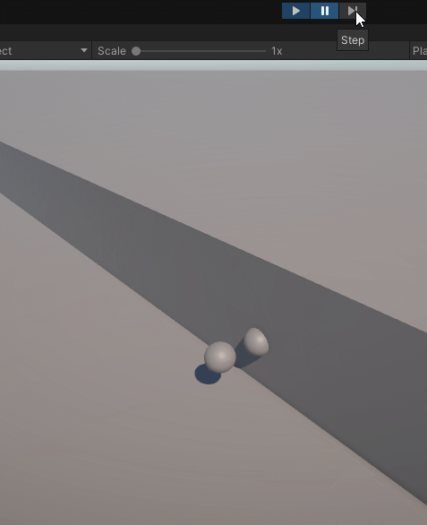
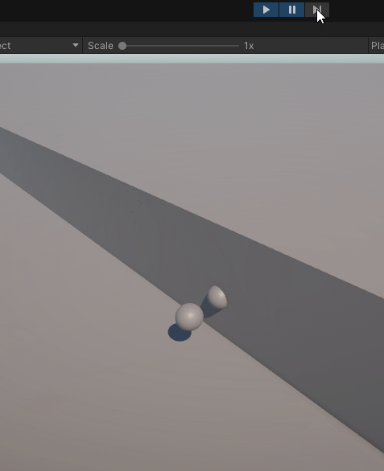

# Tech Adventures: Road to Physics Simulation Part 7

Have you ever played a game where the credits roll meant you were only \~50%
complete with the game, or perhaps even less than that? Perhaps there’s a harder
difficulty mode, or a new area, or some side-story a couple of devs went way
overboard on?

That’s where we are at right now. We got through the credits, but there’s still
so much to explore. We’ll take on the casual quests in the adventure, so let’s
jump right in!

## Investigating Specular Contacts

There have been reports that Unity Physics is very bad at handling fast-moving
objects. And while investigating some similar potential issues with the new
simulation, I actually managed to find the culprit. Here’s an example scene:



The wall marks a 45-degree trajectory of one of the spheres, which is a rigid
body. It does not make contact with the other stationary rigid body. However, if
we double the initial velocity of the moving sphere, this happens:



Strange, right?

Well, the cause of this is speculative contacts.

With speculative contacts, instead of recording contacts when penetration
happens, we instead try to guess at contacts that will happen within the
timestep. This is because we perform integration at the end, rather than at the
beginning. However, the way we estimate the contact point pair actually coming
into contact is if their distance along the contact normal closes in on zero.

So, at the start, the two spheres are side-by-side, and the contact normal
points straight left. You can imagine a vertical plane that touches the
right-side of the left sphere. If the right sphere reaches this plane within the
timestep, speculative contacts will record a collision, even though they objects
should have missed.

Speculative contacts are a performance-enhancing approximation. They are quite
accurate when the objects move very little in a timestep relative to their size,
which is true for most objects. The alternative would require computing whether
or not a true collision will occur inside the solver loop, doing multiple
iterations. That’s expensive, especially when rotations are involved.

Perhaps one day we will tackle this problem in a future adventure. But for now,
we’ll keep this pitfall in mind and design around it.

## Inertia Tensors Revisited

After the initial physics demo, I was experimenting to make the other collider
types work. Most of them had small bugs in contact generation that needed to be
ironed out.

However, compound colliders had a different issue. When they bounced, it was
like they turned into rockets, because they flew back up way higher. The actual
cause of this issue was simply me forgetting to divide the accumulated center of
mass by the accumulated volume. But during the process, I discovered that the
way I was scaling the inertia tensor was completely wrong as well.

Applying non-uniform scaling to an object doesn’t result in a scale matrix
multiplication with the inertia tensor. It is actually a bit more complicated
than that. We actually have to decompose the original inertia tensor formulas
for each of its 9 components, perform some algebra to inject our scaling, and
then recombine everything. Here’s the code if you are curious.

```csharp
static float3x3 StretchInertiaTensor(float3x3 original, float3 stretch)
{
    // The inertia tensor matrix diagonal components (not necessarily a diagonalized inertia tensor) are defined as follows:
    // diagonal.x = sum_1_k(mass_k * (y_k^2 + z_k^2)) = sum_1_k(mass_k * y_k^2) + sum_1_k(mass_k * z_k^2)
    // And for uniform density, m_k is constant, so:
    // diagonal.x = mass * sum_1_k(y_k^2) + sum_1_k(z_k^2)
    // diagonal.y = mass * sum_1_k(x_k^2) + sum_1_k(z_k^2)
    // diagonal.z = mass * sum_1_k(x_k^2) + sum_1_k(y_k^2)
    // The base inertia diagonal has mass divided out to be 1f, so we can drop it from our expression.
    //
    // We can define a property s as the sum of diagonals.
    // diagonal.x + diagonal.y + diagonal.z = sum_1_k(y_k^2) + sum_1_k(z_k^2) + sum_1_k(x_k^2) + sum_1_k(z_k^2) + sum_1_k(x_k^2) + sum_1_k(y_k^2)
    // diagonal.x + diagonal.y + diagonal.z = 2 * ( sum_1_k(x_k^2) + sum_1_k(y_k^2) + sum_1_k(z_k^2) )
    //
    // And with this, we can write this expression:
    // (diagonal.x + diagonal.y + diagonal.z) / 2 - diagonal.x = sum_1_k(x_k^2)
    // And we can do similar for the other two axes.
    //
    // Applying stretch changes the expression of sum_1_k(x_k^2) to sum_1_k( (x_k * stretch.x)^2 ) = sum_1_k(x_k^2 * stretch.x^2) = stretch.x^2 * sum_1_k(x_k^2)
    // And with that, we have all the data we need to reassemble the inertia tensor.
    var diagonal        = new float3(original.c0.x, original.c1.y, original.c2.z);
    var diagonalHalfSum = math.csum(diagonal) / 2f;
    var xSqySqzSq       = diagonalHalfSum - diagonal;
    var newDiagonal     = stretch * stretch * xSqySqzSq;

    // The off diagonals are just products, so we can actually just scale those.
    var scaleMatrix =
        new float3x3(new float3(0f, stretch.x * stretch.yz), new float3(stretch.x * stretch.y, 0f, stretch.x * stretch.z), new float3(stretch.z * stretch.xy, 0f));
    var result  = original * scaleMatrix;
    result.c0.x = newDiagonal.x;
    result.c1.y = newDiagonal.y;
    result.c2.z = newDiagonal.z;
    return result;
}
```

## Forces

Many games aren’t just content with objects bouncing off each other. Often, devs
want to apply forces to the rigid bodies. Most people know F = ma. However,
things aren’t quite as obvious when rotations are involved.

When you apply a force at a point on a rigid body, you actually apply two
forces. You apply a linear force, and you apply an angular torque. However, if
you apply the force across a large surface, the angular torques will cancel out,
leaving just the linear force. Thus, we end up with two simple methods. Note
that impulse is just force pre-multiplied by the timestep.

```csharp
public static void ApplyFieldImpulse(ref Velocity velocity, in Mass mass, float3 impulse)
{
    velocity.linear += mass.inverseMass * impulse;
}
public static void ApplyImpulseAtWorldPoint(ref Velocity velocity, in Mass mass, in RigidTransform inertialSpaceWorldTransform, float3 point, float3 impulse)
{
    ApplyFieldImpulse(ref velocity, in mass, impulse);
    var angularImpulse  = math.cross(point - inertialSpaceWorldTransform.pos, impulse);
    velocity.angular   += math.InverseRotateFast(inertialSpaceWorldTransform.rot, angularImpulse) * mass.inverseInertia;
}
```

Unity Physics also has methods to handle local-space forces. However, I suspect
their use isn’t all that common, and they require transform data that we
completely optimized out of our demo engine.

However, one method Unity has that you may want available is the
`ApplyExplosiveImpulse()`. The way you do this is by calling `DistanceBetween()`
between your explosion epicenter and your rigid body collider. You might also
use a sphere collider for your explosion, in which case you have to account for
the radius. But once you have the closest point on your rigid body, you can
optionally attenuate the impulse by the distance and then call
`ApplyImpulseAtWorldPoint()`.

Unity’s methods also have an upward bias thing, but looking at the code, I don’t
think that works as intended, since the impulse direction is unaffected. That’s
one of the reasons I am not providing my own version of this method. The other
reason is that I would like to encourage users to recycle the results of the
`DistanceBetween()` call to both figure out if the explosion is in range and to
apply it.

## Stabilization

Motion stabilization was one of the big new inventions in Unity Physics since
Unity Physics is a stateless engine. It provides the ability to stack objects
somewhat stably.

Most of the motion stabilization code in Unity Physics is copying data around.
Why? I actually have no idea. It seems pretty wasteful. My guess is that someone
lost track of the data between all the scheduling paths, and shoehorned some
redundant arrays rather than fix the problems at the source. Rather than explain
how Unity does it, I will explain the simplified solution in Psyshock.

Motion stabilization does two things that are non-physical but reduce jitter.
After the first iteration, it applies a scaling factor to the inertia based on
the number of other bodies in contact that meet a specific criterion. Second, it
clips velocity perpendicular to the gravity vector to zero to prevent subtle
sliding from floating point errors in the solver after each iteration. It also
clips angular velocity if more than one body is in contact meeting the
criterion.

The first thing in the implementation is that we rename
`MotionStabilizationInput` to `MotionStabilizer`. It is the only type we care
about for motion stabilization. All the other types in Unity Physics have been
optimized out.

Second, we need a way to count the bodies we care about for stabilization
purposes. We will store this count in our `RigidBody` component and reset it to
zero when we build our `CollisionLayer`. We will also store a `MotionStabilizer`
in `RigidBody` and also reset it to `kDefault` in the same job. As for counting,
we can do the counting in our first iteration of our `IForEachPairProcessor`.
The actual method to determine if we should include a contacting body in the
count is this:

```csharp
public static bool IsStabilizerSignificantBody(float inverseMass, float otherBodyInverseMass) => otherBodyInverseMass * 0.5f <= inverseMass;
```

Yeah. It is really simple.

Next, we need our method to actually perform the update of our stabilizer and
clip the velocities. You don’t need to understand all the math and logic here.
It was lifted from Unity Physics, with some architecture-accessed variables
changed into arguments.

```csharp
public static void UpdateStabilizationAfterSolverIteration(ref MotionStabilizer motionStabilizer,
                                                            ref Velocity velocity,
                                                            float inverseMass,
                                                            float angularExpansionFactor,
                                                            int numOtherSignificantBodiesInContact,
                                                            float3 timestepScaledGravity,
                                                            float3 gravityDirection,
                                                            float stabilizationVelocityClippingFactor,
                                                            float stabilizationInertiaScalingFactor,
                                                            bool isFirstIteration)
{
    if (numOtherSignificantBodiesInContact <= 0 || inverseMass == 0f)
        return;

    // Scale up inertia for other iterations
    if (isFirstIteration && numOtherSignificantBodiesInContact > 1)
    {
        float inertiaScale                   = 1.0f + 0.2f * (numOtherSignificantBodiesInContact - 1) * stabilizationInertiaScalingFactor;
        motionStabilizer.inverseInertiaScale = math.rcp(inertiaScale);
    }

    // Don't stabilize velocity component along the gravity vector
    float3 linVelVertical = math.dot(velocity.linear, gravityDirection) * gravityDirection;
    float3 linVelSideways = velocity.linear - linVelVertical;

    // Choose a very small gravity coefficient for clipping threshold
    float gravityCoefficient = (numOtherSignificantBodiesInContact == 1 ? 0.1f : 0.25f) * stabilizationVelocityClippingFactor;

    // Linear velocity threshold
    float smallLinVelThresholdSq = math.lengthsq(timestepScaledGravity * gravityCoefficient);

    // Stabilize the velocities
    if (math.lengthsq(linVelSideways) < smallLinVelThresholdSq)
    {
        velocity.linear = linVelVertical;

        // Only clip angular if in contact with at least 2 bodies
        if (numOtherSignificantBodiesInContact > 1)
        {
            // Angular velocity threshold
            if (angularExpansionFactor > 0.0f)
            {
                float angularFactorSq        = math.rcp(angularExpansionFactor * angularExpansionFactor) * 0.01f;
                float smallAngVelThresholdSq = smallLinVelThresholdSq * angularFactorSq;
                if (math.lengthsq(velocity.angular) < smallAngVelThresholdSq)
                {
                    velocity.angular = float3.zero;
                }
            }
        }
    }
}
```

One new surprise here is that we require the `angularExpansionFactor`. So this
now gets stored on the `RigidBody` too.

Next, we need to call this on each `RigidBody` for each solver iteration right
after the `Physics.ForEachPair()` call. There’s no pairs involved, so an
`IJobEntity` is sufficient.

```csharp
[BurstCompile]
partial struct StabilizeRigidBodiesJob : IJobEntity
{
    public bool  firstIteration;
    public float timeScaledGravity;

    public void Execute(ref RigidBody rigidBody)
    {
        UnitySim.UpdateStabilizationAfterSolverIteration(ref rigidBody.motionStabilizer,
                                                            ref rigidBody.velocity,
                                                            rigidBody.mass.inverseMass,
                                                            rigidBody.angularExpansion,
                                                            rigidBody.numOtherSignificantBodiesInContact,
                                                            new float3(0f, timeScaledGravity, 0f),
                                                            new float3(0f, -1f, 0f),
                                                            UnitySim.kDefaultVelocityClippingFactor,
                                                            UnitySim.kDefaultInertialScalingFactor,
                                                            firstIteration);
    }
}
```

The default factors are `1f` by the way.

Lastly, we can enable stabilization when calling `SolveJacobian()` by passing in
the stabilizer instances and setting the flags to true.

This is what our little physics engine looks like now. Ignore the light
glitching. That’s from the gif capturer.


## What’s Next

We have a much more robust simulation with stabilization and better handling of
inertia tensors. And we now have the ability to support gameplay forces. That
just leaves degrees-of-freedom constraints, joints, and motors.

Unity Physics implements degrees-of-freedom constraints via joints to imaginary
entities. Implementing joints will give us both features. And motors also tie
into the joint data structures, so we’ll cover those too.

Thanks for reading!
