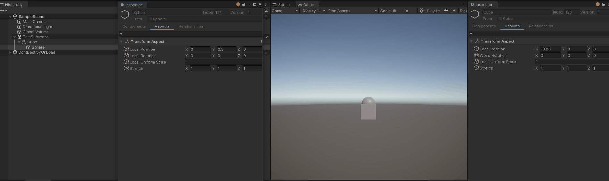
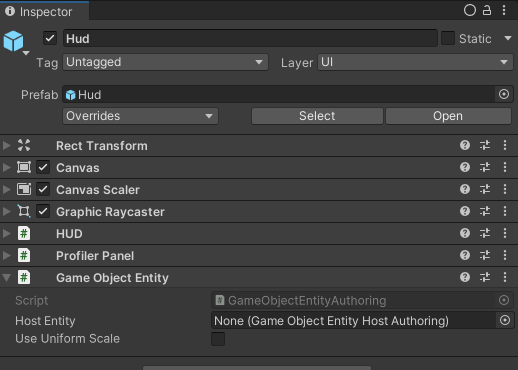
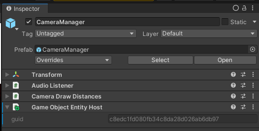
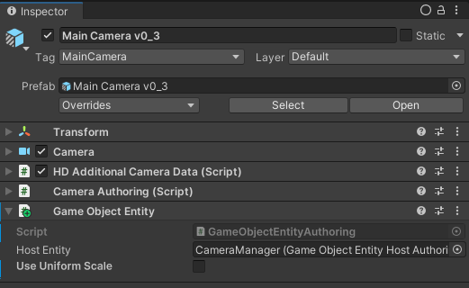

# Getting Started with QVVS Transforms

Whether you are using QVVS Transforms as your main transform system or are using
Unity Transforms and are simply trying to make sense of the `TransformQvvs` type
in the APIs of other modules, this guide will attempt to provide some intuition
as to what QVVS transforms are and how they work.

You can also explore the examples in [this
project](https://github.com/Dreaming381/LatiosFrameworkMiniDemos/tree/main/FeatureSamples/Assets/QVVS/Tutorial).

## Getting a Feel for QVVS Transforms

QVVS Transforms is the default transform system included with the Latios
Framework. You do not need to set any scripting defines to enable it. However,
it does require installation in the Latios Bootstrap.

Create a new Unity Project and install the Latios Framework. Add a *Latios
Bootstrap* using the *Standard – Injection Workflow*.

Next, add the following code to the bootstrap or a custom script. This code will
preserve hierarchies so that we can play with them.

```csharp
class PreserveHierarchyBaker : Baker<UnityEngine.Transform>
{
    public override void Bake(UnityEngine.Transform authoring)
    {
        GetEntity(TransformUsageFlags.Dynamic);
    }
}
```

Create a new subscene. Add a cube inside it at the origin. Then create a child
sphere. Set the sphere’s Y position to 0.5 and switch over to the game view.

Unfortunately, Unity removed `IAspects`, which breaks some of the intuition
behind this demo. But there’s a workaround. Select the cube and ensure you see
the GameObject Transform. Modify the scale’s y-axis. If you did everything
right, the game view should look similar to this below:



The above shows the old `IAspect` inspector, which shows that what you are
actually modifying is the `stretch` of the cube. Notice how the sphere moves
along with the top of the cube but does not deform.

## What is a QVVS?

A QVVS is an acronym of its contained quantities – **Q**uaternion, **V**ector,
**V**ector, **S**calar:

-   Quaternion – rotation
-   Vector – position
-   Vector – stretch
-   Scalar – scale

Such a transform is defined by the `TransformQvvs` type in the
`Latios.Transforms` namespace. It can be used to represent both local and
world-space transforms.

There is also a QVS, which drops the *stretch* component. It is defined by the
`TransformQvs` type. As stretch is shared between local and world spaces, this
type is typically used as a local-space companion to a world-space
`TransformQvvs`, avoiding the redundancy in memory. Unity Transforms also uses
QVS as a local-space representation.

Position and rotation are well-understood concepts. Scale is uniform scale and
is equally understood. But as explored in the demonstration above, stretch is
unique. The fundamental rule is that stretch is never influenced by any parent
transform, and it is always the first quantity applied when creating a matrix
representation for rendering or other applications. This means that unlike with
GameObjects where a parent non-uniform scale affects the child’s world space
size, shape, and position, a parent stretch value only affects the child’s
position in world space. The below table shows how the different local-space
quantities affect both the transform’s own world-space equivalent and the
world-space of a child.

|                                        | Self World-Space | Child World-Space     |
|----------------------------------------|------------------|-----------------------|
| Local Position                         | Position         | Position              |
| Local Rotation                         | Rotation         | Rotation, Position    |
| Local Uniform Scale (ECS)              | Size             | Size, Position        |
| Local Non-Uniform Scale (Game Objects) | Size, Shape      | Size, Shape, Position |
| Stretch (QVVS)                         | Size, Shape      | Position              |

It is only when the child’s shape is influenced by the parent that shear can
occur. Therefore, by definition, both QVS and QVVS are shear-free
representations.

For what it is worth, Unity’s `RigidTransform` is a QV. There is such thing as a
QVV used by other engines. However, the math for that has quirks which are not
worth discussing here.

## The Math of QVVS

QVVS retains many of the mathematical properties shared by QV, QVS, and
matrices. Such properties include associativity and multiplication to convert
between coordinate spaces. For a given local-space QVVS **L**, a parent
world-space QVVS **P**, a world-space QVVS **W** can be computed as follows:

**W** = **PL**

Which can be expressed in code using the static `qvvs` class as follows:

```csharp
var W = qvvs.mul(P, L);
```

Where QVVS catches people off-guard, is unlike QV, QVS, and matrices, it is not
invertible. That is, for a QVVS transform **T**, there is no way to represent
**T**⁻¹ as a QVVS. However, it is possible to define a function that performs
the inverse multiplication operation on **T** to convert a world-space transform
back into local-space.

```csharp
var L = qvvs.inversemulqvvs(P, W);
var L_as_QVS = qvvs.inversemul(P, W);
```

To understand why this is, imagine that a QVVS **T** when applied in a
multiplication operation expands directly into a pair of matrices **U** and
**S** such as:

**T** = **US**

Where the various elements of **T** map directly to the various elements of
**U** and **S**. Now what happens when we try to invert this value:

(**US**) ⁻¹ = **S**⁻¹**U**⁻¹

Notice the order of **S** and **U** flipped! QVVS mapping doesn’t know about
this flipping, and so it maps incorrectly. While it would be possible to add a
flag to QVVS to handle this, for performance reasons, the QVVS module leaves it
up to the user to call the appropriate inverse methods when required, as that’s
usually something the user will know in context.

Because of this, identity also doesn’t always work as one might expect:

```csharp
var isT = qvvs.mul(TransformQvvs.identity, T);
var mightNotBeT = qvvs.mul(T, TransformQvvs.identity); // result stretch will be forced to (1, 1, 1), all other values come from T
var alsoT = qvvs.inversemulqvvs(TransformQvvs.identity, T);
var notIdentity = qvvs.inversemulqvvs(T, T); // all identity values except stretch
```

What definitely does work is associativity.

**W** = **GPL** = (**GP**)**L** = **G**(**PL**)

```csharp
var temp = qvvs.mul(G, P);
var W = qvvs.mul(temp, L);
// Same as
var temp = qvvs.mul(P, L);
var W = qvvs.mul(G, temp);

// And for inverses
var temp = qvvs.inversemulqvvs(G, W);
var L = qvvs.inversemulqvvs(P, temp);
// Same as
var temp = qvvs.mul(G, P); // Yes, not inverse mul
var L = qvvs.inversemulqvvs(temp, W);
```

The `qvvs` class contains many other helpful methods, but feel free to suggest
ones you find to be missing when you need them.

## Unity Transforms Mode

The Latios Framework by default operates using its own QVVS Transform System.
However, you can switch it to use Unity Transforms instead, using the scripting
define LATIOS_TRANSFORMS_UNITY. In this mode, APIs will still use the
`TransformQvvs` and `TransformQvs` types, but they will not use the QVVS
Transform System components and systems.

However, there are a few features developed for QVVS Transforms that have been
ported to Unity Transforms.

### Baking Extras

`BakedLocalTransformOverride` and `BakedParentOverride` are components you can
add in bakers to override specific transform information without having to use
the `TransformUsageFlags.ManualOverride`. Note that in Unity Transforms mode,
`BakedParentOverride` only lets you change a parent, not add or remove one.

The Latios Framework also comes with a baker for transforms that assigns an
`AuthoringSiblingIndex` to entities, since sibling index is not included in
Unity’s `TransformAuthoring` component. You can use `AuthoringSiblingIndex` in
baking systems if you desire.

### GameObjectEntity

While installed by default when using QVVS Transforms,
[GameObjectEntity](#gameobjectentity) is compatible with Unity Transforms. But
it requires you install it in the bootstrap explicitly. Call
`TransformsBootstrap.InstallGameObjectEntitySynchronization()` in the bootstraps
for both editor and runtime worlds.

## ECS Components

Now that we’ve covered the math of QVVS transforms, it is time to explore how to
use these in ECS gameplay. By default, the Latios Framework uses a form of QVVS
that is always up-to-date. We’ll get to what that means in a bit, but first,
let’s start with an entity that has no parent nor children. A true soloist.

An Entity with a transform but without any parent nor children has a single
`IComponentData`, `WorldTransform`. `WorldTransform` contains a single
`TransformQvvs` field. This applies to both static and dynamic entities,
rendered or gameplay-only.

Now let’s suppose that the entity had a child. The child entity will have a
second component `RootReference`. As the name implies, this is an entity
reference to the root entity of the hierarchy, which in a two-entity hierarchy
will be the direct parent. `RootReference` also has an index, which refers to
the index of this child entity within the hierarchy. In a two-entity hierarchy,
this index will be `1`.

Note that the child entity does not have any component representing a local
transform. In this QVVS Transform System, local transforms are implicit to save
ECS chunk memory.

Well… technically they are only half-implicit. Some data is saved in the
hierarchy buffer to help with stability. But this is an internal detail and you
generally should not have to worry about it.

Speaking of the hierarchy buffer, this comes in the form of
`DynamicBuffer<EntityInHierarchy>`. This buffer contains a reference to each
entity in the hierarchy, as well as links to parents and children. It also
contains inheritance flags. It is what the `RootReference` is indexing into.
Some root entities will have a mirror of `EntityInHierarchy` called
`EntityInHierarchyCleanup`. This happens when there is high risk of a child
entity outliving its root. The criteria is based on `LinkedEntityGroup` buffers,
so be careful about directly modifying `LinkedEntityGroup` buffers belonging to
root entities.

### Always Up-To-Date

The QVVS Transform System is always-up-to-date. That means every hierarchy is
maintained in sync. An entity’s local transform, `WorldTransform`, and parent’s
`WorldTransform` are all in agreement at all times. If you modify a parent’s
position, once the modification operation is complete and the next line of code
is ready to execute, the child’s `WorldTransform` will already have been updated
accordingly.

This concept is quite unusual in an ECS, especially Unity’s ECS. Therefore, it
may take some time to learn the proper ways to work with it. With that said,
being always up-to-date has massive benefits for expressing gameplay logic
intuitively. And it also opens the door to optimization opportunities atypical
in an ECS.

### Inheritance Flags

By default, a change in a parent’s entity transform will propagate to a child
such that the child’s local transform remains the same, but its world-space
transform will update. However, this behavior can be altered, such that certain
attributes of the child’s world-space transform remain unaltered from parent
updates. This is represented through `InheritanceFlags`. `InheritanceFlags` can
be set by any baker using the `AddInheritanceFlags()` extension method. They can
also be set at runtime when you assign a new parent to an entity.

### Motion History Components

`PreviousTransform` and `TwoAgoTransform` are optional components as part of the
Motion History feature. `PreviousTransform` contains a copy of the transform
from the start of `SimulationSystemGroup`. While `TwoAgoTransform` contains a
copy of `PreviousTransform` at that same point. These must be added using
special baking request components. See [QVVS Transforms
Baking](QVVS%20Transforms%20Baking.md) for details.

### Ticked Components

You might encounter “Ticked” variants of components and APIs. Please ignore
these, as they are not ready to be used at this time.

## Authoring QVVS Transforms

When using QVVS Transforms, there are a couple of things to watch out for.

### Live Patching Desyncs

The QVVS Transform System is an always up-to-date transform system. That means
that any modification to an entity’s transform will immediately propagate
through the hierarchy. Everything is in-sync all the time. This is true in both
the baking world and the runtime world. However, Unity’s live baking patcher
responsible for copying data from the baking world to the runtime world doesn’t
understand this rule, and can desynchronize everything in very bad ways.

**Therefore, please avoid the following:**

-   Modifying authoring transforms while in play mode
-   Writing systems that modify transforms and injecting them into the editor
    world

There are plans to improve this, but there are many edge cases that need to be
dealt with. In the meantime, if you mess up, you can always get back to a good
state by toggling play mode, or closing all subscenes and then reopening them.

### Scale and Stretch Assignment

QVVS Transforms have both scale and stretch values, but Unity Transforms only
have a 3-component scale. During baking, a heuristic is used to identify whether
or not the scale is uniform. If it is, then `TransformQvvs.scale` is set to
match Unity and `stretch` is set to `(1f, 1f, 1f)`. Otherwise, `stretch` is set
to match Unity and `TransformQvvs.scale` is set to `1f`.

## Working with QVVS Transforms at Runtime

Always up-to-date is a foreign concept to Unity’s ECS. Therefore, you will need
to rely heavily on APIs provided by QVVS to work with transforms correctly.

### Reading Transforms

If you have a system or job that only needs to read transforms, it is safe to
read from the raw ECS components directly. The most common use case is to read
`WorldTransform` or `PreviousTransform`. You don’t need to do anything special.

If you want to read hierarchy information from a child, you can call
`ToHandle()` on the child’s `RootReference`. This gives you an
`EntityInHierarchyHandle`, which provides a convenient API for discovering other
entities in the hierarchy.

A critical thing to note is that the hierarchy may contain destroyed entities.
Any property that refers to “blood” suggests that the result may include these
destroyed entities. For transform propagation purposes, orphaned children
inherit from the closest alive ancestor.

If you find yourself in a situation where you only need to read the local
transform without writing anything, use `TransformTools.LocalTransformFrom()`.

### Writing Transforms

**Never write to the transform components directly!** Doing so will bypass the
always up-to-date mechanisms, and can cause corruption in hierarchies. You don’t
want to debug these corruptions. Just never do it.

The only time you could ever make a case for writing directly is if you are
building a solo entity from complete scratch, explicitly defining every
component in the archetype. In that case, you might set the `WorldTransform`
directly.

There are three APIs you need to know to write transforms:

-   EntityManager.SetParent()
-   EntityManager.ClearParent()
-   TransformAspect

The first two APIs do exactly as they sound. They allow you to modify the
hierarchy structure. These APIs tend to induce structural changes, hence they
are only available to `EntityManager`.

`TransformAspect` is a struct which encapsulates everything needed to modify an
entity’s transform data correctly. You can fetch it via
`EntityManager.GetTransformAspect()`. In jobs, you can use
`TransformAspectLookup`, `TransformAspectRootHandle`, and
`TransformAspectParallelChunkHandle` to retrieve a `TransformAspect`.

**Never use** `[NativeDisableParallelForRestriction]` **on**
`TransformAspectLookup`**!** Thread-safety rules for modifying transforms are
much stricter than normal components, largely because of the propagation
dependencies.

`TransformAspectRootHandle` and `TransformAspectParallelChunkHandle` are what
allows for writing transforms in parallel. More details about these APIs can be
found [here](Writing%20QVVS%20Transforms%20in%20Parallel.md).

### Instantiating Entities

While in the typical cases, instantiating entities just works, there are a few
cases you need to avoid because they cause hierarchy ownership confusion.

In general, instantiating root or solo entities via `EntityManager` just works.
This also includes root and solo prefabs, which is the common case. Afterwards,
you can call `SetParent()` or `GetTransformAspect()` to further configure the
new entity.

Instantiating entities from a job is a little trickier, because
`EntityCommandBuffer` doesn’t really understand hierarchy updates at playback
time. However, you can use `InstantiateCommandBuffer` with QVVS-provided
`IInstantiateCommands`:

-   `WorldTransformCommand`
-   `ParentCommand`
-   `ParentAndLocalTransformCommand`

This approach is the fastest way to instantiate QVVS hierarchies in batch.
Additionally, it can handle one extra use case, which is instantiating a child
entity that has no children of its own. Otherwise, instantiating children
entities is not supported and you will receive a runtime exception in the editor
when you try to do so.

## GameObjectEntity

GameObjectEntity allows you to associate entities with Game Objects in a scene
outside of a subscene. To create one, on a Game Object outside of a subscene
simply add the *Latios -\> Transforms -\> Game Object Entity* component.



If Host Entity is left empty, the Game Object is considered to be
“self-hosting”, and it will copy its `UnityEngine.Transform` to the entity’s
`WorldTransform` every update.

To bind the Game Object to an entity in the subscene, first, add the *Latios -\>
Transforms -\> Game Object Entity Host* component to the subscene Game Object.



Next, drag the subscene Game Object into the *Host Entity* field of the *Game
Object Entity*.



In this mode, at runtime, the GameObjectEntity will create a temporary Entity
that waits for the target host entity to appear. It will then bind the Game
Object to the host entity. The host entity’s `WorldTransform` will be copied to
the Game Object’s `UnityEngine.Transform` every frame.

In both modes, scripts attached to the Game Object can react to the binding to
the self-hosted or externally-hosted entity by implementing the
`IInitializeGameObjectEntity` interface. A common use case is to add unmanaged
components to the entity containing `UnityObjectRef`s referencing Game Object
scripts.

Also, at runtime the Entity will have a managed struct component
`GameObjectEntity`, which contains the Game Object’s `UnityEngine.Transform`.
Note that this will exist even for GameObjectEntity instances still searching
for their host.
